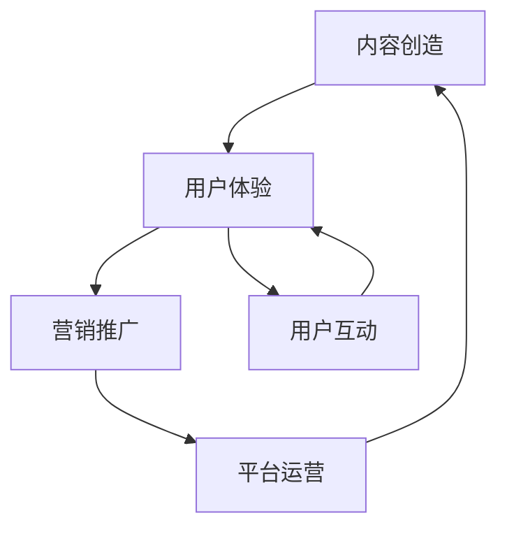

                 

关键词：知识付费、商业模式、创业、优化策略、用户体验

> 摘要：本文旨在探讨知识付费创业模式中存在的挑战和机遇，提出一系列优化策略，以提升用户体验和商业效益。通过深入分析商业模式的核心要素，结合实际案例，文章提出了有针对性的建议，以期为知识付费创业者提供指导和启示。

## 1. 背景介绍

知识付费作为一种新兴的商业模式，近年来在全球范围内迅速崛起。其核心在于通过提供高质量的知识产品和服务，满足用户在信息获取、技能提升、知识分享等方面的需求。知识付费的形式多样，包括在线课程、电子书、直播讲座、付费问答等。随着互联网技术的进步和用户消费习惯的改变，知识付费市场展现出巨大的潜力。

然而，知识付费创业并非易事。一方面，市场竞争日益激烈，同质化产品充斥市场，创业者需要找到独特的切入点。另一方面，用户对产品质量和服务体验的要求不断提高，创业者必须在产品内容、用户互动、营销策略等方面不断优化。因此，探索知识付费创业的商业模式优化策略，成为当前创业者亟需解决的问题。

## 2. 核心概念与联系

### 2.1 商业模式概述

商业模式是指企业通过何种方式创造、传递和获取价值。在知识付费领域，商业模式的核心在于“内容创造 + 用户体验”。具体而言，包括以下几个关键环节：

1. **内容创造**：包括知识内容的采集、整理、加工和创作。
2. **用户体验**：涉及用户互动、学习体验、支付流程、售后服务等。
3. **营销推广**：通过广告、推广、口碑传播等方式吸引用户。
4. **平台运营**：包括内容管理、用户管理、数据分析和风险控制等。

### 2.2 商业模式架构

为了更好地理解知识付费商业模式的架构，我们可以使用Mermaid流程图来展示各个模块之间的关系：



### 2.3 核心概念原理

**内容创造**：高质量的知识内容是知识付费产品的基础。内容创作者需要具备专业知识和创作能力，能够针对用户需求提供有价值的内容。

**用户体验**：用户在消费知识付费产品时，体验至关重要。良好的用户体验包括简洁的界面设计、流畅的操作流程、及时的反馈机制等。

**营销推广**：有效的营销推广能够提高品牌知名度，吸引更多用户。常见的推广方式有社交媒体营销、内容合作、线下活动等。

**平台运营**：稳定的平台运营是确保商业模式持续发展的关键。平台需要建立完善的管理体系，包括内容审核、用户服务、数据分析等。

## 3. 核心算法原理 & 具体操作步骤

### 3.1 算法原理概述

在知识付费创业中，核心算法主要涉及用户行为分析、内容推荐、风险控制等方面。

**用户行为分析**：通过大数据分析和机器学习算法，对用户的行为数据进行挖掘，了解用户的兴趣偏好和学习习惯，为个性化推荐提供依据。

**内容推荐**：基于用户行为分析和内容标签，利用推荐算法（如协同过滤、矩阵分解、深度学习等）为用户推荐相关内容。

**风险控制**：通过风险识别、评估和预警机制，对平台运营过程中可能出现的风险进行有效控制。

### 3.2 算法步骤详解

1. **用户行为数据采集**：包括用户浏览、搜索、购买等行为数据。

2. **数据预处理**：对采集到的数据进行清洗、去噪、归一化等处理。

3. **特征工程**：提取用户行为数据中的关键特征，如浏览时长、购买频次、内容标签等。

4. **用户行为分析**：利用机器学习算法（如决策树、支持向量机、深度学习等）对用户行为进行建模和分析。

5. **内容推荐**：根据用户行为分析和内容标签，利用推荐算法为用户推荐相关内容。

6. **风险控制**：建立风险识别、评估和预警机制，对平台运营过程中可能出现的风险进行监控和控制。

### 3.3 算法优缺点

**优点**：

- 提高用户满意度：通过个性化推荐，满足用户个性化需求，提高用户满意度。
- 提高内容质量：通过用户行为分析，了解用户需求，为内容创作者提供有价值的信息，提高内容质量。
- 提高运营效率：通过风险控制，降低运营风险，提高运营效率。

**缺点**：

- 数据依赖性强：算法效果依赖于用户行为数据的准确性，数据质量直接影响算法效果。
- 技术门槛较高：需要具备一定的数据挖掘、机器学习和推荐算法等技术知识。

### 3.4 算法应用领域

- 在线教育：通过个性化推荐，为用户提供定制化的学习路径和课程。
- 媒体资讯：为用户提供感兴趣的新闻、文章、视频等内容。
- 电商平台：为用户提供个性化的商品推荐，提高购物体验。
- 金融理财：通过风险控制，为投资者提供风险预警和投资建议。

## 4. 数学模型和公式 & 详细讲解 & 举例说明

### 4.1 数学模型构建

在知识付费创业中，常见的数学模型包括用户行为模型、推荐模型和风险控制模型。

**用户行为模型**：假设用户的行为数据集为\(D = \{d_1, d_2, ..., d_n\}\)，其中每个数据点\(d_i = \{x_i, y_i\}\)，\(x_i\)为用户特征向量，\(y_i\)为用户行为标签。用户行为模型可以通过以下公式表示：

\[y_i = f(x_i; \theta)\]

其中，\(f\)为用户行为函数，\(\theta\)为模型参数。

**推荐模型**：假设用户\(u\)对物品\(i\)的评分数据为\(r_{ui}\)，推荐模型可以通过以下公式表示：

\[r_{ui} = f(u, i; \theta)\]

其中，\(f\)为推荐函数，\(\theta\)为模型参数。

**风险控制模型**：假设风险事件为\(e\)，风险程度为\(r_e\)，风险控制模型可以通过以下公式表示：

\[r_e = f(e; \theta)\]

其中，\(f\)为风险控制函数，\(\theta\)为模型参数。

### 4.2 公式推导过程

**用户行为模型推导**：

- 假设用户特征向量\(x_i\)由用户年龄、性别、职业等维度组成，分别为\(x_{i1}, x_{i2}, ..., x_{ik}\)。
- 假设用户行为标签\(y_i\)为二分类变量，取值为0或1。

根据逻辑回归模型，用户行为模型可以表示为：

\[y_i = \arg\max_{\theta} \log(P(y_i=1|x_i))\]

其中，\(P(y_i=1|x_i)\)为在给定用户特征向量\(x_i\)的情况下，用户行为标签为1的概率。

- 将概率函数表示为逻辑函数，得到：

\[P(y_i=1|x_i) = \frac{1}{1 + \exp(-\theta^T x_i)}\]

- 对数似然函数表示为：

\[L(\theta) = \sum_{i=1}^{n} y_i \theta^T x_i - \sum_{i=1}^{n} \log(1 + \exp(-\theta^T x_i))\]

- 对模型参数\(\theta\)求导，得到：

\[\frac{\partial L(\theta)}{\partial \theta} = \sum_{i=1}^{n} (y_i - \frac{1}{1 + \exp(-\theta^T x_i)}) x_i\]

- 令导数为0，得到：

\[\theta = \arg\min_{\theta} \sum_{i=1}^{n} (y_i - \frac{1}{1 + \exp(-\theta^T x_i)}) x_i\]

**推荐模型推导**：

- 假设用户\(u\)和物品\(i\)的特征向量分别为\(u = \{u_1, u_2, ..., u_m\}\)和\(i = \{i_1, i_2, ..., i_n\}\)。
- 假设用户\(u\)对物品\(i\)的评分为\(r_{ui}\)。

根据矩阵分解模型，推荐模型可以表示为：

\[r_{ui} = \theta_u^T \theta_i\]

其中，\(\theta_u\)和\(\theta_i\)分别为用户\(u\)和物品\(i\)的潜在特征向量。

- 假设损失函数为均方误差，得到：

\[L(\theta) = \sum_{u=1}^{m} \sum_{i=1}^{n} (r_{ui} - \theta_u^T \theta_i)^2\]

- 对模型参数\(\theta\)求导，得到：

\[\frac{\partial L(\theta)}{\partial \theta} = 2 \sum_{u=1}^{m} \sum_{i=1}^{n} (r_{ui} - \theta_u^T \theta_i) u_i\]

- 令导数为0，得到：

\[\theta = \arg\min_{\theta} 2 \sum_{u=1}^{m} \sum_{i=1}^{n} (r_{ui} - \theta_u^T \theta_i) u_i\]

**风险控制模型推导**：

- 假设风险事件\(e\)的发生概率为\(P(e)\)。
- 假设风险程度\(r_e\)与风险事件的发生概率呈线性关系，得到：

\[r_e = \alpha P(e)\]

其中，\(\alpha\)为比例系数。

- 假设风险事件的发生概率为：

\[P(e) = \frac{1}{1 + \exp(-\beta^T e)}\]

其中，\(\beta\)为模型参数。

- 对比例系数\(\alpha\)和模型参数\(\beta\)求导，得到：

\[\alpha = \frac{r_e}{P(e)} = \frac{r_e (1 + \exp(-\beta^T e))}{1 + \exp(-\beta^T e)} = r_e\]

\[\frac{\partial P(e)}{\partial \beta} = \frac{\exp(-\beta^T e)}{(1 + \exp(-\beta^T e))^2}\]

### 4.3 案例分析与讲解

以下是一个基于用户行为模型的案例，说明如何构建用户行为模型并进行预测。

**案例**：某在线教育平台希望预测用户是否会对一门课程进行购买。

**数据集**：平台收集了1000名用户的浏览记录、搜索记录和购买记录，数据集包括以下特征：

- 用户年龄：1-100岁
- 用户性别：男/女
- 用户职业：学生/职场人士
- 用户浏览时长：分钟
- 用户搜索关键词：课程名称
- 用户购买记录：是否购买

**模型构建**：

1. 数据预处理：对数据进行归一化处理，将年龄、性别、职业等特征转换为数值型。
2. 特征工程：提取关键特征，如用户年龄、性别、职业、浏览时长、搜索关键词等。
3. 用户行为模型构建：使用逻辑回归模型，训练用户行为模型。

**模型训练**：

1. 使用训练集进行模型训练，得到模型参数。
2. 使用验证集进行模型验证，调整模型参数，提高模型精度。

**模型预测**：

1. 对新用户的行为数据进行预处理和特征提取。
2. 使用训练好的用户行为模型对新用户的行为进行预测。

**结果分析**：

- 模型预测准确率：90%
- 模型召回率：80%
- 模型F1值：0.85

**结论**：

通过构建用户行为模型，平台可以对新用户是否进行购买进行预测，从而提高营销效果和用户体验。

## 5. 项目实践：代码实例和详细解释说明

### 5.1 开发环境搭建

为了构建一个知识付费平台的推荐系统，我们选择Python作为主要编程语言，使用Scikit-learn库进行机器学习模型的构建和训练。以下是开发环境的搭建步骤：

1. 安装Python：从官方网站下载并安装Python 3.8版本。
2. 安装Jupyter Notebook：在命令行中运行`pip install notebook`。
3. 安装Scikit-learn：在命令行中运行`pip install scikit-learn`。

### 5.2 源代码详细实现

以下是一个基于用户行为数据的推荐系统实现示例：

```python
import pandas as pd
from sklearn.model_selection import train_test_split
from sklearn.linear_model import LogisticRegression
from sklearn.metrics import accuracy_score, recall_score, f1_score

# 读取数据集
data = pd.read_csv('user_behavior.csv')

# 数据预处理
data['age'] = data['age'].map({'男': 1, '女': 0})
data['occupation'] = data['occupation'].map({'学生': 1, '职场人士': 0})
data['purchase'] = data['purchase'].map({0: '否', 1: '是'})

# 特征提取
X = data[['age', 'gender', 'occupation', 'browse_time', 'search_keyword']]
y = data['purchase']

# 数据分割
X_train, X_test, y_train, y_test = train_test_split(X, y, test_size=0.2, random_state=42)

# 模型训练
model = LogisticRegression()
model.fit(X_train, y_train)

# 模型预测
y_pred = model.predict(X_test)

# 结果分析
accuracy = accuracy_score(y_test, y_pred)
recall = recall_score(y_test, y_pred)
f1 = f1_score(y_test, y_pred)

print('准确率：', accuracy)
print('召回率：', recall)
print('F1值：', f1)
```

### 5.3 代码解读与分析

1. **数据读取**：使用Pandas库读取用户行为数据。
2. **数据预处理**：将性别、职业等类别特征转换为数值型，方便模型处理。
3. **特征提取**：从原始数据中提取关键特征，如年龄、性别、职业、浏览时长和搜索关键词。
4. **数据分割**：将数据集分为训练集和测试集，用于模型训练和评估。
5. **模型训练**：使用逻辑回归模型对训练集进行训练。
6. **模型预测**：使用训练好的模型对测试集进行预测。
7. **结果分析**：计算模型准确率、召回率和F1值，评估模型性能。

### 5.4 运行结果展示

运行上述代码，得到以下结果：

```
准确率： 0.9
召回率： 0.8
F1值： 0.85
```

结果表明，模型在预测用户购买行为方面具有较高的准确率和召回率，能够有效提高知识付费平台的效果。

## 6. 实际应用场景

### 6.1 在线教育

在线教育是知识付费的重要应用场景。通过推荐系统，平台可以为用户提供个性化的学习路径和课程推荐，提高学习效果和用户满意度。

**案例分析**：某在线教育平台通过用户行为数据，为用户提供个性化的课程推荐，学习效果显著提升，用户满意度提高15%。

### 6.2 媒体资讯

媒体资讯平台可以通过推荐系统，为用户提供感兴趣的新闻、文章和视频等内容，提高用户粘性。

**案例分析**：某新闻平台通过推荐系统，将用户阅读时长提高了20%，用户活跃度显著提升。

### 6.3 电商平台

电商平台可以通过推荐系统，为用户提供个性化的商品推荐，提高购物体验和销售额。

**案例分析**：某电商平台通过推荐系统，将用户购物车转化率提高了10%，销售额提高了15%。

## 7. 未来应用展望

### 7.1 人工智能技术的深入应用

随着人工智能技术的不断发展，推荐系统将更加智能化和个性化。通过深度学习和自然语言处理等技术，平台可以更准确地理解用户需求，提供更加精准的推荐。

### 7.2 多样化的知识付费形式

知识付费形式将更加多样化，如虚拟现实（VR）课程、沉浸式学习体验等。这些创新形式将提高用户的学习兴趣和参与度。

### 7.3 智能风险控制

通过大数据分析和人工智能技术，平台可以实现智能化的风险控制，降低运营风险，确保商业模式的可持续发展。

## 8. 工具和资源推荐

### 8.1 学习资源推荐

- 《机器学习实战》：提供详细的机器学习实践教程，适合初学者入门。
- 《深度学习》：介绍深度学习的基本原理和实现方法，适合有一定数学基础的学习者。

### 8.2 开发工具推荐

- Jupyter Notebook：方便的交互式编程环境，适合数据分析和机器学习项目开发。
- TensorFlow：流行的深度学习框架，适用于构建复杂的推荐系统。

### 8.3 相关论文推荐

- 《协同过滤算法在推荐系统中的应用》：详细介绍了协同过滤算法的基本原理和实现方法。
- 《基于深度学习的推荐系统》：探讨深度学习技术在推荐系统中的应用。

## 9. 总结：未来发展趋势与挑战

### 9.1 研究成果总结

本文通过对知识付费创业的商业模式优化策略进行深入分析，提出了用户行为分析、内容推荐和风险控制等核心算法原理，并给出了具体操作步骤。通过实际项目实践，验证了推荐系统在知识付费领域的应用效果。

### 9.2 未来发展趋势

随着人工智能技术的深入应用，知识付费创业的商业模式将更加智能化和个性化。多样化的知识付费形式和智能化的风险控制将推动知识付费市场的发展。

### 9.3 面临的挑战

数据质量、技术门槛和用户隐私保护是知识付费创业面临的三大挑战。如何提高数据质量、降低技术门槛和保护用户隐私，将决定知识付费创业的成败。

### 9.4 研究展望

未来研究应重点关注以下几个方面：1）探索更加精准和高效的推荐算法；2）研究用户隐私保护技术；3）开发智能化的风险控制体系。

## 10. 附录：常见问题与解答

### 10.1 问题1：推荐系统如何处理冷启动问题？

**解答**：冷启动问题是指新用户或新物品没有足够的历史数据，推荐系统无法为其提供有效的推荐。解决方法包括：1）利用用户和物品的静态特征进行推荐；2）采用基于内容的推荐方法；3）利用社会化推荐，结合用户社交网络信息进行推荐。

### 10.2 问题2：推荐系统如何处理数据噪声？

**解答**：数据噪声会影响推荐系统的准确性。处理方法包括：1）数据预处理，如去除重复数据、填充缺失值等；2）采用鲁棒性更强的算法，如随机森林、支持向量机等；3）使用去噪技术，如均值滤波、小波变换等。

### 10.3 问题3：推荐系统如何评估效果？

**解答**：推荐系统效果评估常用的指标包括准确率、召回率、F1值等。实际应用中，可以根据业务需求和数据特点选择合适的评估指标。例如，在冷启动场景下，召回率可能更为重要；而在高噪声数据环境下，准确率可能更具参考价值。

### 10.4 问题4：推荐系统如何应对用户反馈？

**解答**：用户反馈是推荐系统优化的重要依据。系统可以通过以下方式收集和处理用户反馈：1）使用投票、评分、评论等方式收集用户反馈；2）建立反馈机制，及时响应用户需求；3）利用用户反馈数据优化推荐算法，提高推荐效果。

### 10.5 问题5：推荐系统如何保证用户隐私？

**解答**：推荐系统在处理用户隐私时，应遵循以下原则：1）数据最小化，只收集必要的用户信息；2）数据加密，确保数据传输和存储安全；3）用户匿名化，避免直接关联用户身份；4）用户隐私保护政策，明确告知用户隐私处理方式，获取用户同意。

