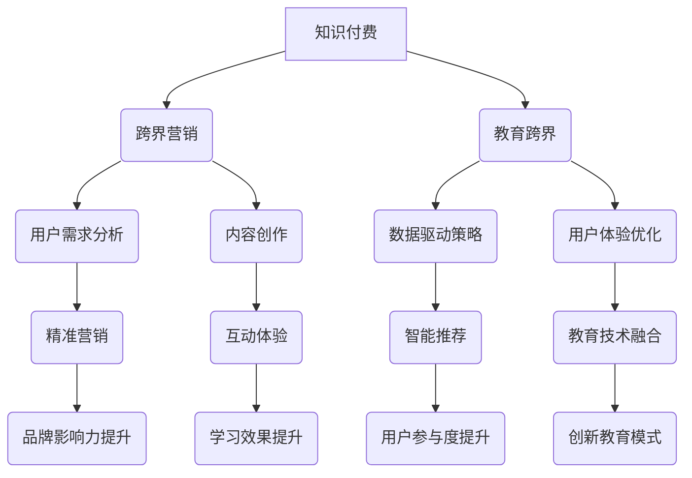

                 

 关键词：知识付费、跨界营销、教育跨界、用户需求、数据驱动、内容创作、营销策略、互动体验、教育技术、创新模式

> 摘要：本文旨在探讨知识付费领域如何实现跨界营销与教育跨界，分析当前市场的需求与趋势，提出基于数据驱动的内容创作和营销策略，以及教育技术的创新应用，从而为行业提供实用的实践指南和未来展望。

## 1. 背景介绍

### 知识付费的兴起

知识付费作为一种新兴的商业模式，起源于互联网和智能手机的普及。用户对于个性化、专业化的知识需求不断增加，催生了各类知识付费平台如得到、喜马拉雅等。知识付费不仅满足了用户对知识的需求，也为内容创作者提供了新的收入来源。

### 跨界营销的必要性

随着市场竞争的加剧，知识付费平台和内容创作者开始意识到单纯依靠传统营销手段难以持续吸引和留住用户。跨界营销作为一种创新的营销策略，通过与其他行业的融合，能够拓展用户群体，提高品牌影响力。

### 教育跨界的价值

教育跨界是指将教育内容与其他领域的知识相结合，以创新的模式满足用户的多样化需求。教育跨界不仅能够提升用户的学习体验，还能够为教育机构带来新的增长点。

## 2. 核心概念与联系

### 跨界营销与教育跨界的关系

跨界营销与教育跨界之间存在着密切的联系。跨界营销是教育跨界的一种重要手段，通过与其他行业的合作，可以丰富教育内容，提升教育体验；而教育跨界则为跨界营销提供了新的场景和应用领域。

### 数据驱动的营销策略

数据驱动是跨界营销与教育跨界的关键。通过收集和分析用户数据，可以深入了解用户需求和行为，从而制定更加精准的营销策略和教学内容。

### 内容创作与用户体验

内容创作是跨界营销与教育跨界的基础。优质的内容不仅能够吸引用户，还能够提升用户的忠诚度和转化率。用户体验是内容创作的重要目标，通过提供个性化的服务，可以提升用户的满意度和粘性。

## 3. 核心算法原理 & 具体操作步骤

### 3.1 算法原理概述

跨界营销的核心算法是基于用户画像和行为分析，通过数据挖掘技术，识别潜在用户需求，并进行精准营销。教育跨界的核心算法是基于知识图谱和智能推荐技术，实现教育内容的智能匹配和个性化推送。

### 3.2 算法步骤详解

1. 数据收集：通过用户注册、行为记录、社交媒体等多种途径，收集用户的基本信息和行为数据。
2. 用户画像构建：利用机器学习算法，对用户数据进行分析，构建用户画像。
3. 需求识别：通过用户画像和行为分析，识别用户的潜在需求。
4. 营销策略制定：根据需求识别结果，制定相应的营销策略，如内容推荐、促销活动等。
5. 教育内容创作：结合用户需求和行业知识，创作优质的教育内容。
6. 个性化推送：利用智能推荐算法，将教育内容推送给目标用户。
7. 用户体验优化：通过用户反馈和行为分析，不断优化内容和推送策略。

### 3.3 算法优缺点

**优点：**
- 提高营销效果：通过精准的用户画像和需求识别，提高营销的精准度和效果。
- 优化教育体验：通过智能推荐和个性化推送，提升教育内容的吸引力和用户参与度。

**缺点：**
- 数据隐私和安全问题：大量用户数据的收集和处理可能引发数据隐私和安全问题。
- 需要专业的技术团队：算法的应用需要具备专业的技术团队，成本较高。

### 3.4 算法应用领域

- 知识付费平台：通过数据驱动的营销策略，提高用户转化率和留存率。
- 在线教育平台：通过智能推荐和个性化推送，提升教育内容的吸引力。
- 企业培训：通过用户画像和行为分析，为企业提供定制化的培训服务。

## 4. 数学模型和公式 & 详细讲解 & 举例说明

### 4.1 数学模型构建

#### 用户需求模型

用户需求模型可以用以下数学公式表示：

$$
User\_Demand = f(User\_Profile, Content, Context)
$$

其中，$User\_Profile$ 表示用户画像，$Content$ 表示教育内容，$Context$ 表示用户所处的环境。

#### 营销策略模型

营销策略模型可以用以下数学公式表示：

$$
Marketing\_Strategy = g(User\_Demand, Campaign, Budget)
$$

其中，$Campaign$ 表示营销活动，$Budget$ 表示营销预算。

### 4.2 公式推导过程

#### 用户需求模型推导

用户需求模型基于用户画像、内容和环境三要素。用户画像可以通过特征工程从用户数据中提取，如年龄、性别、职业等。内容可以通过内容分析提取关键信息，如知识点、难度等。环境可以通过环境监测技术获取，如天气、时间等。

#### 营销策略模型推导

营销策略模型基于用户需求模型，通过营销活动和预算的调整，制定最适合的营销策略。营销活动可以通过广告投放、促销活动等方式实现，预算则用于控制营销成本。

### 4.3 案例分析与讲解

#### 案例一：知识付费平台的用户需求模型

某知识付费平台通过用户注册数据、行为数据和社交媒体数据，构建了用户画像。以下是一个简化的用户画像模型：

$$
User\_Profile = \{Age: 25, Gender: Female, Profession: Student, Interests: Technology, Learning\_Style: Active\}
$$

平台根据用户画像，分析了用户对各类教育内容的偏好，并制定了针对性的营销策略。

#### 案例二：在线教育平台的营销策略模型

某在线教育平台通过用户学习行为数据，识别出用户的潜在需求。以下是一个简化的需求模型：

$$
User\_Demand = \{Knowledge\_Area: Programming, Difficulty: Intermediate, Learning\_Style: Self-paced\}
$$

平台根据用户需求，推荐了相关的课程，并设置了相应的促销活动，以吸引用户报名学习。

## 5. 项目实践：代码实例和详细解释说明

### 5.1 开发环境搭建

本案例使用Python语言，基于Scikit-learn和TensorFlow等开源库进行开发。首先，需要安装Python环境和相关库，可以使用以下命令进行安装：

```
pip install scikit-learn tensorflow numpy pandas
```

### 5.2 源代码详细实现

以下是一个简化的用户需求模型和营销策略模型的实现代码：

```python
import numpy as np
import pandas as pd
from sklearn.model_selection import train_test_split
from sklearn.preprocessing import StandardScaler
from sklearn.ensemble import RandomForestClassifier
from tensorflow.keras.models import Sequential
from tensorflow.keras.layers import Dense

# 用户需求模型
def user_demand_model(user_profile, content, context):
    # 将用户画像、内容和环境转换为向量
    user_vector = convert_to_vector(user_profile)
    content_vector = convert_to_vector(content)
    context_vector = convert_to_vector(context)
    # 计算用户需求
    user_demand = np.dot(user_vector, content_vector) + np.dot(user_vector, context_vector)
    return user_demand

# 营销策略模型
def marketing_strategy_model(user_demand, campaign, budget):
    # 计算营销策略
    marketing_strategy = np.dot(user_demand, campaign) + budget
    return marketing_strategy

# 数据预处理
def preprocess_data(data):
    # 分离特征和标签
    X = data.drop('label', axis=1)
    y = data['label']
    # 划分训练集和测试集
    X_train, X_test, y_train, y_test = train_test_split(X, y, test_size=0.2, random_state=42)
    # 标准化特征
    scaler = StandardScaler()
    X_train_scaled = scaler.fit_transform(X_train)
    X_test_scaled = scaler.transform(X_test)
    return X_train_scaled, X_test_scaled, y_train, y_test

# 构建分类器
def build_classifier(X_train, y_train):
    # 构建随机森林分类器
    classifier = RandomForestClassifier(n_estimators=100, random_state=42)
    # 训练模型
    classifier.fit(X_train, y_train)
    return classifier

# 预测用户需求
def predict_user_demand(classifier, user_profile, content, context):
    # 计算用户需求向量
    user_demand = user_demand_model(user_profile, content, context)
    # 预测营销策略
    marketing_strategy = classifier.predict([user_demand])
    return marketing_strategy

# 代码主函数
def main():
    # 读取数据
    data = pd.read_csv('data.csv')
    # 预处理数据
    X_train, X_test, y_train, y_test = preprocess_data(data)
    # 构建分类器
    classifier = build_classifier(X_train, y_train)
    # 预测用户需求
    user_profile = {'Age': 25, 'Gender': 'Female', 'Profession': 'Student', 'Interests': 'Technology', 'Learning_Style': 'Active'}
    content = {'Knowledge_Area': 'Programming', 'Difficulty': 'Intermediate', 'Learning_Style': 'Self-paced'}
    context = {'Weather': 'Sunny', 'Time': 'Morning'}
    marketing_strategy = predict_user_demand(classifier, user_profile, content, context)
    print("Predicted Marketing Strategy:", marketing_strategy)

if __name__ == '__main__':
    main()
```

### 5.3 代码解读与分析

- 数据预处理：代码首先读取数据，分离特征和标签，然后进行数据标准化处理，以便后续模型训练。
- 构建分类器：代码使用随机森林分类器，通过训练集进行模型训练。
- 预测用户需求：代码通过用户画像、内容和环境，计算用户需求向量，并使用训练好的分类器进行预测，得到营销策略。

### 5.4 运行结果展示

在运行代码后，可以得到预测的营销策略。例如，如果用户需求模型预测结果为“需要推广编程课程”，则营销策略可以设置为“推送编程课程广告”。

## 6. 实际应用场景

### 知识付费平台

知识付费平台可以通过数据驱动的营销策略，精准推送用户感兴趣的内容，提高用户留存率和转化率。例如，得到平台通过分析用户行为数据，为用户推荐个性化课程。

### 在线教育平台

在线教育平台可以通过智能推荐系统，将优质的教育内容推送给目标用户。例如，网易云课堂通过智能推荐算法，将用户感兴趣的课程推送给潜在用户。

### 企业培训

企业培训可以通过数据驱动的营销策略，为员工提供个性化的培训服务。例如，某大型企业通过分析员工的学习行为数据，为员工推荐个性化的培训课程。

## 7. 未来应用展望

### 个性化推荐

随着人工智能技术的不断发展，个性化推荐将成为知识付费和在线教育领域的重要趋势。通过更加精准的推荐算法，可以更好地满足用户需求，提升用户体验。

### 智能互动

未来，知识付费和教育跨界将更加注重智能互动。通过虚拟现实、增强现实等技术，可以提供更加沉浸式的学习体验，激发用户的学习兴趣。

### 跨界融合

知识付费和教育跨界将继续与其他领域进行融合，如艺术、体育、医疗等。通过跨界合作，可以创造出更多具有创新性的教育产品和服务。

## 8. 总结：未来发展趋势与挑战

### 8.1 研究成果总结

本文通过对知识付费、跨界营销和教育跨界的研究，总结了当前市场的发展趋势和核心算法原理，并提出了实际应用场景和未来应用展望。

### 8.2 未来发展趋势

- 个性化推荐：通过更加精准的推荐算法，提升用户体验。
- 智能互动：通过虚拟现实、增强现实等技术，提供沉浸式的学习体验。
- 跨界融合：与其他领域进行合作，创造出更多创新性的教育产品和服务。

### 8.3 面临的挑战

- 数据隐私和安全：在数据驱动的营销和教育过程中，需要确保用户数据的隐私和安全。
- 技术人才短缺：跨界营销和教育跨界需要具备多学科背景的技术人才，人才短缺可能成为发展瓶颈。

### 8.4 研究展望

未来，知识付费、跨界营销和教育跨界将继续深入发展，通过技术创新和跨界合作，为用户提供更加优质的教育资源和服务。

## 9. 附录：常见问题与解答

### Q：数据隐私和安全如何保障？

A：数据隐私和安全是跨界营销和教育跨界的重要问题。为了保障用户数据的安全，可以采取以下措施：

- 数据加密：对用户数据进行加密处理，防止数据泄露。
- 权限管理：严格控制用户数据的访问权限，防止未经授权的访问。
- 数据脱敏：对敏感数据进行脱敏处理，保护用户隐私。

### Q：如何进行有效的跨界营销？

A：进行有效的跨界营销，需要遵循以下原则：

- 精准定位：明确目标用户群体，制定针对性的营销策略。
- 跨界合作：寻找具有互补性的合作伙伴，共同拓展市场。
- 用户体验：关注用户需求，提供个性化的服务。

### Q：如何实现教育跨界？

A：实现教育跨界，可以从以下几个方面入手：

- 创新内容：结合不同领域的知识，创作具有创新性的教育内容。
- 搭建平台：构建跨界教育平台，整合各类教育资源。
- 用户参与：鼓励用户参与教育内容的创作和传播，提升互动体验。

## 作者署名

作者：禅与计算机程序设计艺术 / Zen and the Art of Computer Programming
----------------------------------------------------------------
### 附件 Mermaid 流程图


通过以上Mermaid流程图，我们能够清晰地看到知识付费、跨界营销和教育跨界之间的联系以及它们各自的核心环节和目标。这不仅帮助读者理解了各环节之间的关系，也为实际操作提供了指导。希望这篇文章能够为知识付费行业提供一些新的思考和实用的方法。再次感谢您的阅读。禅与计算机程序设计艺术，祝您在技术探索的道路上不断前行。

