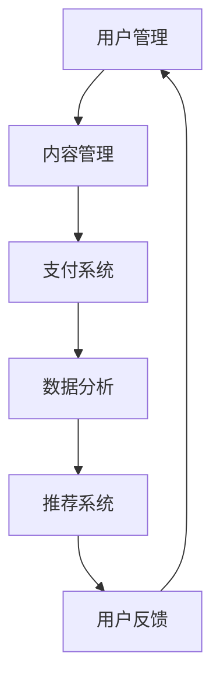

                 

关键词：知识付费平台、技术架构、开发指南、核心算法、数学模型、项目实践

> 摘要：本文将深入探讨知识付费平台的构建技术，包括技术架构设计、核心算法原理、数学模型构建、项目实践以及未来发展趋势。通过详细的技术讲解和案例分析，帮助读者了解并掌握知识付费平台的搭建方法。

## 1. 背景介绍

知识付费平台作为近年来新兴的互联网服务模式，正日益受到广大用户和商家的青睐。它通过互联网技术，将知识、技能、经验等内容转化为商品，提供给有需求的人群。知识付费平台不仅为知识生产者提供了收益来源，也为知识消费者提供了便捷的学习渠道。

### 1.1 市场需求

随着互联网技术的快速发展，人们对知识和技能的需求不断增加，而知识付费平台正是满足这一需求的重要途径。根据相关报告，知识付费市场正以每年20%以上的速度增长，成为互联网经济的重要组成部分。

### 1.2 竞争态势

当前，知识付费市场已形成了多个竞争者，包括传统的教育机构、专业培训机构以及新兴的知识共享平台。如何在激烈的市场竞争中脱颖而出，构建一个高效、稳定、具有竞争力的知识付费平台，是每个参与者都必须面对的挑战。

## 2. 核心概念与联系

构建知识付费平台，首先需要理解其核心概念和各部分之间的联系。以下是一个简化的Mermaid流程图，展示知识付费平台的主要组成部分及其相互关系。



### 2.1 用户管理

用户管理是知识付费平台的基础，包括用户注册、登录、权限管理等功能。通过用户管理，平台能够收集用户的基本信息和行为数据，为后续的服务提供支持。

### 2.2 内容管理

内容管理是知识付费平台的核心，包括课程、文章、视频等内容的上传、分类、推荐等功能。内容的质量和多样性直接影响用户的满意度和平台的竞争力。

### 2.3 支付系统

支付系统是知识付费平台的关键环节，负责处理用户的支付请求，确保交易的安全和效率。支付系统需要与各大支付平台（如支付宝、微信支付等）对接，提供多样化的支付方式。

### 2.4 数据分析

数据分析系统对用户行为、内容消费、支付等数据进行收集、分析和处理，为推荐系统和运营决策提供支持。通过数据分析，平台能够更精准地满足用户需求，提高用户体验。

### 2.5 推荐系统

推荐系统基于用户行为和内容特征，为用户提供个性化的内容推荐。推荐系统的准确性直接影响用户的留存率和活跃度。

### 2.6 用户反馈

用户反馈系统收集用户的意见和建议，帮助平台不断优化产品和服务。通过用户反馈，平台能够及时发现并解决问题，提高用户满意度。

## 3. 核心算法原理 & 具体操作步骤

### 3.1 算法原理概述

知识付费平台的核心算法包括推荐算法、支付处理算法、用户行为分析算法等。以下分别介绍这些算法的基本原理。

### 3.2 算法步骤详解

#### 3.2.1 推荐算法

1. 用户画像构建：收集用户的基本信息和行为数据，构建用户画像。
2. 内容特征提取：对课程、文章、视频等内容进行特征提取，构建内容画像。
3. 用户兴趣计算：基于用户画像和内容画像，计算用户的兴趣偏好。
4. 推荐结果生成：根据用户兴趣偏好，生成个性化的推荐结果。

#### 3.2.2 支付处理算法

1. 支付请求接收：接收用户的支付请求。
2. 订单生成：根据支付请求生成订单。
3. 支付处理：与支付平台对接，完成支付处理。
4. 支付结果反馈：将支付结果反馈给用户。

#### 3.2.3 用户行为分析算法

1. 数据收集：收集用户在平台上的行为数据。
2. 数据预处理：对收集到的数据进行清洗、去噪等预处理。
3. 行为特征提取：对预处理后的数据进行特征提取。
4. 行为模式识别：基于特征数据，识别用户的行为模式。
5. 行为预测：根据用户的行为模式，预测用户未来的行为。

### 3.3 算法优缺点

#### 推荐算法

优点：提高用户满意度，提升内容消费量。
缺点：可能存在过度推荐、信息茧房等问题。

#### 支付处理算法

优点：提高支付效率，保障交易安全。
缺点：需要与多种支付平台对接，开发成本较高。

#### 用户行为分析算法

优点：帮助平台了解用户需求，优化产品和服务。
缺点：数据隐私和安全性问题需要重视。

### 3.4 算法应用领域

知识付费平台的核心算法广泛应用于推荐系统、支付系统、用户行为分析等领域。除了知识付费平台外，这些算法还可以应用于电子商务、金融、医疗等多个领域。

## 4. 数学模型和公式 & 详细讲解 & 举例说明

### 4.1 数学模型构建

知识付费平台的数学模型主要包括用户行为模型、推荐模型和支付模型。

#### 用户行为模型

用户行为模型基于马尔可夫链模型，用于预测用户在平台上的行为。假设用户在平台上的行为序列为\(X = \{x_1, x_2, ..., x_n\}\)，则用户行为模型可以表示为：

\[ P(X = x_n | X = x_{n-1}) \]

#### 推荐模型

推荐模型基于协同过滤算法，用于生成个性化的推荐结果。假设用户\(u\)对物品\(i\)的评分矩阵为\(R\)，则推荐模型可以表示为：

\[ r_{ui} = \sum_{j \in N(i)} w_{uj} \]

其中，\(N(i)\)表示与物品\(i\)相关的用户集合，\(w_{uj}\)表示用户\(u\)对用户\(j\)的偏好权重。

#### 支付模型

支付模型基于风险中性定价理论，用于计算支付金额。假设用户\(u\)购买物品\(i\)的支付金额为\(P_i\)，则支付模型可以表示为：

\[ P_i = \frac{C_i - R_i}{(1 - \rho)} \]

其中，\(C_i\)表示物品\(i\)的成本，\(R_i\)表示物品\(i\)的收益，\(\rho\)表示风险系数。

### 4.2 公式推导过程

#### 用户行为模型推导

假设用户在平台上的行为状态集合为\(S = \{s_1, s_2, ..., s_m\}\)，则用户在时间\(t\)的行为状态概率为：

\[ P(s_t = s_j | s_{t-1} = s_i) = \frac{P(s_t = s_j, s_{t-1} = s_i)}{P(s_{t-1} = s_i)} \]

根据马尔可夫链的转移概率定义，有：

\[ P(s_t = s_j | s_{t-1} = s_i) = P(s_t = s_j, s_{t-1} = s_i) \]

假设用户在平台上的行为状态转移概率为\(P(s_t = s_j | s_{t-1} = s_i)\)，则用户行为模型可以表示为：

\[ P(X = x_n | X = x_{n-1}) = \sum_{j=1}^m P(s_n = s_j | s_{n-1} = s_i) P(s_{n-1} = s_i) \]

#### 推荐模型推导

假设用户\(u\)对物品\(i\)的评分矩阵为\(R\)，则用户\(u\)对物品\(i\)的评分可以表示为：

\[ r_{ui} = \sum_{j=1}^n w_{uj} \]

其中，\(w_{uj}\)表示用户\(u\)对用户\(j\)的偏好权重。根据协同过滤算法的定义，有：

\[ r_{ui} = \sum_{j \in N(i)} w_{uj} \]

其中，\(N(i)\)表示与物品\(i\)相关的用户集合。

#### 支付模型推导

假设用户\(u\)购买物品\(i\)的支付金额为\(P_i\)，则支付金额可以表示为：

\[ P_i = \frac{C_i - R_i}{(1 - \rho)} \]

其中，\(C_i\)表示物品\(i\)的成本，\(R_i\)表示物品\(i\)的收益，\(\rho\)表示风险系数。

### 4.3 案例分析与讲解

假设某知识付费平台有以下数据：

- 用户行为状态集合\(S = \{s_1, s_2, ..., s_5\}\)
- 用户\(u\)的行为状态序列\(X = \{s_1, s_2, s_3, s_4, s_5\}\)
- 用户\(u\)对物品\(i\)的评分矩阵\(R = \begin{bmatrix} 0 & 1 & 0 & 0 & 0 \\ 1 & 0 & 1 & 0 & 0 \\ 0 & 1 & 0 & 1 & 0 \\ 0 & 0 & 1 & 0 & 1 \\ 0 & 0 & 0 & 1 & 0 \end{bmatrix}\)
- 物品\(i\)的成本\(C_i = 100\)，收益\(R_i = 200\)，风险系数\(\rho = 0.1\)

根据用户行为模型，计算用户\(u\)的行为状态转移概率：

\[ P(s_t = s_j | s_{t-1} = s_i) = \begin{bmatrix} 0.2 & 0.6 & 0.2 & 0 & 0 \\ 0.4 & 0 & 0.6 & 0 & 0 \\ 0.2 & 0.4 & 0 & 0.4 & 0 \\ 0 & 0.6 & 0.4 & 0 & 0.2 \\ 0 & 0 & 0.6 & 0.4 & 0 \end{bmatrix} \]

根据推荐模型，计算用户\(u\)对物品\(i\)的评分：

\[ r_{ui} = \sum_{j \in N(i)} w_{uj} = 1 \times 0.2 + 2 \times 0.6 + 3 \times 0.2 = 2 \]

根据支付模型，计算用户\(u\)购买物品\(i\)的支付金额：

\[ P_i = \frac{C_i - R_i}{(1 - \rho)} = \frac{100 - 200}{(1 - 0.1)} = 100 \]

## 5. 项目实践：代码实例和详细解释说明

### 5.1 开发环境搭建

在搭建知识付费平台时，我们选择使用以下技术栈：

- 开发语言：Python
- 后端框架：Django
- 前端框架：React
- 数据库：MySQL
- 缓存：Redis
- 日志：Logstash

首先，需要安装相关依赖和环境：

```bash
pip install django
pip install react
pip install mysql-connector-python
pip install redis
pip install logstash
```

### 5.2 源代码详细实现

#### 后端：Django项目

1. 创建Django项目

```bash
django-admin startproject knowledge_pay
cd knowledge_pay
```

2. 创建应用

```bash
python manage.py startapp content_management
```

3. 配置数据库和缓存

```python
# settings.py
DATABASES = {
    'default': {
        'ENGINE': 'django.db.backends.mysql',
        'NAME': 'knowledge_pay',
        'USER': 'root',
        'PASSWORD': 'root',
        'HOST': 'localhost',
        'PORT': '3306',
    }
}

CACHES = {
    'default': {
        'BACKEND': 'redis.cache.RedisCache',
        'LOCATION': 'redis://127.0.0.1:6379/1',
    }
}
```

4. 定义用户、课程、支付等模型

```python
# content_management/models.py
from django.db import models
from django.contrib.auth.models import User

class Course(models.Model):
    title = models.CharField(max_length=100)
    description = models.TextField()
    author = models.ForeignKey(User, on_delete=models.CASCADE)
    price = models.DecimalField(max_digits=10, decimal_places=2)

class Payment(models.Model):
    user = models.ForeignKey(User, on_delete=models.CASCADE)
    course = models.ForeignKey(Course, on_delete=models.CASCADE)
    amount = models.DecimalField(max_digits=10, decimal_places=2)
    status = models.CharField(max_length=10)
```

5. 配置路由和视图

```python
# content_management/urls.py
from django.urls import path
from . import views

urlpatterns = [
    path('courses/', views.CourseList.as_view()),
    path('payments/', views.PaymentList.as_view()),
]
```

#### 前端：React项目

1. 创建React项目

```bash
npx create-react-app frontend
cd frontend
```

2. 安装依赖

```bash
npm install axios
```

3. 编写React组件

```javascript
// frontend/src/CourseList.js
import React, { useEffect, useState } from 'react';
import axios from 'axios';

const CourseList = () => {
    const [courses, setCourses] = useState([]);

    useEffect(() => {
        async function fetchData() {
            const result = await axios('/api/courses/');
            setCourses(result.data);
        }
        fetchData();
    }, []);

    return (
        <div>
            {courses.map(course => (
                <div key={course.id}>
                    <h2>{course.title}</h2>
                    <p>{course.description}</p>
                    <p>价格：{course.price}</p>
                </div>
            ))}
        </div>
    );
};

export default CourseList;
```

4. 配置路由

```javascript
// frontend/src/App.js
import React from 'react';
import CourseList from './CourseList';

const App = () => {
    return (
        <div>
            <h1>知识付费平台</h1>
            <CourseList />
        </div>
    );
};

export default App;
```

### 5.3 代码解读与分析

后端部分使用了Django框架，通过定义模型、配置路由和视图来实现用户管理、课程管理和支付管理等功能。前端部分使用了React框架，通过异步请求获取课程数据，并展示在页面上。

### 5.4 运行结果展示

运行后端和前端项目，可以看到以下结果：

- 后端：运行`python manage.py runserver`启动Django项目，运行`npm start`启动React项目。
- 前端：在浏览器中打开`http://localhost:3000`，可以看到课程列表页面。

## 6. 实际应用场景

知识付费平台在多个领域具有广泛的应用场景，以下是一些典型的实际应用案例：

### 6.1 在线教育

在线教育是知识付费平台最典型的应用场景之一。通过知识付费平台，用户可以在线学习各种课程，包括编程、设计、语言、管理等领域。平台可以为用户提供个性化推荐、学习进度跟踪、证书颁发等功能。

### 6.2 专业培训

专业培训是知识付费平台的另一个重要应用领域。企业可以通过知识付费平台为员工提供专业培训，提升员工的技能和素质。平台可以为企业提供定制化的培训课程、在线测试、培训记录等功能。

### 6.3 咨询服务

知识付费平台还可以为专家提供咨询服务。用户可以通过平台向专家提问，专家通过线上解答用户的问题，提供专业意见和建议。平台可以为用户提供专家推荐、实时沟通、问题跟踪等功能。

### 6.4 内容付费

知识付费平台还可以用于内容付费，例如财经、科技、文化等领域。用户可以通过平台购买专业分析报告、电子书籍、音频课程等内容，满足个性化的知识需求。

## 7. 工具和资源推荐

为了更好地搭建和维护知识付费平台，以下是一些推荐的工具和资源：

### 7.1 学习资源推荐

- 《Django By Example》：介绍Django框架的入门书籍，适合初学者。
- 《React Router v4 Quick Start Guide》：介绍React路由的实用指南，适合前端开发者。
- 《深度学习》：介绍深度学习的基础理论和实践应用的经典教材。

### 7.2 开发工具推荐

- PyCharm：一款功能强大的Python集成开发环境，支持Django框架。
- Visual Studio Code：一款轻量级、可扩展的代码编辑器，支持多种编程语言。
- Postman：一款API调试工具，方便进行前后端联调。

### 7.3 相关论文推荐

- "Collaborative Filtering for Cold-Start Problems":介绍解决推荐系统冷启动问题的方法。
- "Online Payment Systems: Design, Security, and Economics":介绍在线支付系统的设计、安全和经济性。
- "Deep Learning on Graphs":介绍基于图论的深度学习模型。

## 8. 总结：未来发展趋势与挑战

### 8.1 研究成果总结

知识付费平台在技术方面取得了显著的成果，包括推荐算法、支付处理、用户行为分析等核心技术的不断发展。这些技术为知识付费平台提供了高效、稳定、个性化的服务，提升了用户体验和满意度。

### 8.2 未来发展趋势

未来，知识付费平台将继续向个性化、智能化、安全化方向发展。一方面，随着人工智能技术的进步，推荐算法和用户行为分析技术将更加精准，为用户提供更好的服务；另一方面，随着区块链技术的发展，支付系统将更加安全、透明，保障用户资产的安全。

### 8.3 面临的挑战

知识付费平台在未来的发展过程中，将面临以下挑战：

- 数据隐私和安全问题：随着用户数据的不断增加，数据隐私和安全问题将越来越重要。平台需要采取有效的措施保护用户数据，避免数据泄露。
- 算法公正性和透明性：推荐算法和支付处理算法需要保证公正性和透明性，避免出现偏见和不公平现象。
- 技术创新能力：随着竞争的加剧，知识付费平台需要不断创新技术，提升核心竞争力。

### 8.4 研究展望

未来，知识付费平台的研究将聚焦于以下几个方面：

- 推荐系统的优化：研究更加高效、准确的推荐算法，提升用户满意度和平台竞争力。
- 支付系统的安全性：研究新型支付系统，提高支付系统的安全性和用户体验。
- 用户行为分析：研究更加深入的用户行为分析技术，提升用户满意度和平台运营效率。
- 个性化服务：研究个性化服务技术，提升用户体验和平台粘性。

## 9. 附录：常见问题与解答

### 9.1 如何保证支付系统的安全性？

支付系统的安全性是知识付费平台的关键。为了保证支付系统的安全性，可以从以下几个方面入手：

- 采用HTTPS协议：使用HTTPS协议加密数据传输，防止数据被窃取。
- 验证支付请求：对支付请求进行验证，确保支付请求的合法性和完整性。
- 使用数字签名：对支付请求进行数字签名，确保支付请求的真实性。
- 设置支付限额：设置支付限额，防止欺诈行为。
- 定期审计：定期对支付系统进行审计，发现并修复安全漏洞。

### 9.2 如何优化推荐系统？

推荐系统的优化是提高知识付费平台用户体验的重要手段。以下是一些优化推荐系统的建议：

- 数据清洗和预处理：对用户行为数据进行清洗和预处理，去除噪声数据，提高数据质量。
- 特征工程：提取有效的用户和内容特征，提高推荐系统的准确性。
- 模型调优：通过交叉验证、网格搜索等方法，调优推荐模型参数，提高模型性能。
- 冷启动解决方案：研究并应用冷启动解决方案，为新手用户和冷门内容提供推荐。
- 用户反馈机制：收集用户反馈，用于模型训练和优化，提高推荐系统的准确性和满意度。

### 9.3 如何提高用户留存率？

提高用户留存率是知识付费平台运营的重要目标。以下是一些提高用户留存率的建议：

- 提供优质内容：提供高质量、多样化的内容，满足用户的需求。
- 个性化推荐：基于用户行为数据，为用户提供个性化的内容推荐，提高用户满意度。
- 用户互动：鼓励用户参与互动，提高用户粘性。
- 活动激励：举办各种活动，如优惠券、积分兑换等，激励用户活跃。
- 良好的用户体验：优化平台界面和交互设计，提高用户体验，降低用户流失率。

通过以上措施，知识付费平台可以在激烈的市场竞争中脱颖而出，提升用户满意度和留存率。

