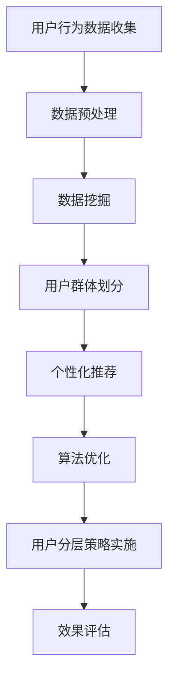

                 

关键词：知识付费，用户分层，策略，数据挖掘，个性化推荐，算法优化

> 摘要：本文将深入探讨知识付费平台用户分层的策略和方法。通过对用户行为数据的深入分析，结合机器学习和数据挖掘技术，我们将构建一个有效的用户分层模型，以优化用户推荐系统，提高用户满意度和平台利润。

## 1. 背景介绍

在当今信息爆炸的时代，知识付费成为了一种新兴的商业模式，受到了广大用户的欢迎。知识付费平台通过提供高质量的知识内容，满足了用户对专业知识的需求，同时为内容创作者提供了丰厚的回报。然而，随着用户数量的增加和内容的丰富，如何有效地管理和推荐知识内容，成为知识付费平台面临的重要挑战。

用户分层策略是一种基于用户行为数据和技术手段，将用户划分为不同层次的方法。通过用户分层，知识付费平台可以针对不同层次的用户提供差异化的服务和内容推荐，从而提高用户体验和平台的运营效率。

本文将首先介绍知识付费平台用户分层的重要性，然后分析用户分层的核心概念和联系，接着详细阐述核心算法原理和具体操作步骤，最后探讨数学模型和公式、项目实践以及实际应用场景。通过本文的探讨，希望能够为知识付费平台提供一套完整的用户分层策略，助力平台的发展和用户满意度的提升。

## 2. 核心概念与联系

### 2.1 用户行为数据

用户行为数据是用户分层策略的核心组成部分。这些数据包括用户的浏览历史、购买记录、搜索关键词、互动反馈等。通过对这些数据的分析，我们可以深入了解用户的需求和偏好，从而为用户分层提供依据。

### 2.2 数据挖掘

数据挖掘是一种从大量数据中提取有价值信息的方法。在用户分层策略中，数据挖掘技术被广泛应用于用户行为的分析和用户群体的划分。常见的数据挖掘技术包括关联规则挖掘、聚类分析、分类算法等。

### 2.3 个性化推荐

个性化推荐是一种根据用户的行为和偏好，向用户推荐符合其需求的商品或内容的技术。在知识付费平台中，个性化推荐可以帮助平台将高质量的知识内容推荐给合适的用户，从而提高用户的满意度和平台的利润。

### 2.4 算法优化

算法优化是提高用户分层策略效果的重要手段。通过不断调整和优化算法参数，我们可以提高用户分层的准确性和效率。常见的算法优化方法包括交叉验证、网格搜索、随机搜索等。

### 2.5 Mermaid 流程图

以下是一个描述用户分层策略的 Mermaid 流程图：



## 3. 核心算法原理 & 具体操作步骤

### 3.1 算法原理概述

用户分层策略的核心算法主要包括数据挖掘、聚类分析和个性化推荐。下面将分别介绍这些算法的基本原理。

#### 数据挖掘

数据挖掘是一种从大量数据中提取有价值信息的方法。在用户分层策略中，数据挖掘主要用于分析用户行为数据，以了解用户的需求和偏好。常见的数据挖掘技术包括关联规则挖掘、聚类分析、分类算法等。

#### 聚类分析

聚类分析是一种无监督学习方法，用于将相似的数据点划分为同一类别。在用户分层策略中，聚类分析可以帮助我们将具有相似行为的用户划分为同一层次。

#### 个性化推荐

个性化推荐是一种根据用户的行为和偏好，向用户推荐符合其需求的商品或内容的技术。在用户分层策略中，个性化推荐可以帮助平台将高质量的知识内容推荐给合适的用户，从而提高用户的满意度和平台的利润。

### 3.2 算法步骤详解

#### 数据挖掘

1. 数据收集：收集用户的行为数据，如浏览历史、购买记录、搜索关键词、互动反馈等。
2. 数据预处理：对收集到的数据进行分析和处理，去除无效数据和噪声数据。
3. 特征提取：从预处理后的数据中提取有用的特征，如用户活跃度、购买频率、内容偏好等。
4. 数据挖掘：使用关联规则挖掘、聚类分析、分类算法等技术，分析用户行为数据，提取有价值的信息。

#### 聚类分析

1. 数据准备：将预处理后的数据输入到聚类算法中。
2. 算法选择：选择合适的聚类算法，如K-means、层次聚类等。
3. 聚类执行：运行聚类算法，将用户划分为不同的类别。
4. 聚类评估：评估聚类结果的质量，如内部类平均轮廓系数等。

#### 个性化推荐

1. 用户特征提取：提取用户的特征，如兴趣偏好、行为习惯等。
2. 内容特征提取：提取知识内容的特征，如标题、关键词、分类等。
3. 模型训练：使用机器学习算法，如协同过滤、矩阵分解等，训练个性化推荐模型。
4. 推荐生成：根据用户特征和内容特征，生成个性化推荐列表。

### 3.3 算法优缺点

#### 数据挖掘

- 优点：能够从大量数据中提取有价值的信息，有助于了解用户需求。
- 缺点：数据处理复杂，对数据质量要求较高。

#### 聚类分析

- 优点：无需预先指定类别数量，能够自动发现用户群体。
- 缺点：聚类结果受初始值影响较大，评估标准不统一。

#### 个性化推荐

- 优点：能够根据用户特征和内容特征，生成个性化推荐列表。
- 缺点：推荐结果受数据质量和算法选择影响较大。

### 3.4 算法应用领域

用户分层策略广泛应用于电子商务、社交媒体、在线教育等领域。在知识付费平台中，用户分层策略可以帮助平台优化用户推荐系统，提高用户满意度和平台利润。

## 4. 数学模型和公式 & 详细讲解 & 举例说明

### 4.1 数学模型构建

在用户分层策略中，常用的数学模型包括聚类模型和推荐模型。下面分别介绍这两个模型。

#### 聚类模型

假设有 $n$ 个用户和 $m$ 个特征，用户行为数据可以表示为一个 $n \times m$ 的矩阵 $X$。聚类模型的目标是将用户划分为 $k$ 个类别，使得每个类别内的用户相似度最大，类别之间的用户相似度最小。

定义距离函数 $d(i, j)$ 表示用户 $i$ 和用户 $j$ 的相似度，常用的距离函数包括欧几里得距离、余弦相似度等。聚类模型的目标函数为：

$$
J = \sum_{i=1}^{n}\sum_{j=1}^{k} w_{ij} d(i, j)
$$

其中 $w_{ij}$ 表示用户 $i$ 属于类别 $j$ 的权重，通常取 $w_{ij} = 1$。

#### 推荐模型

推荐模型的目标是根据用户特征和内容特征，预测用户对内容的评分或兴趣。常见的推荐模型包括基于用户的协同过滤、基于内容的推荐、矩阵分解等。

假设用户 $i$ 对内容 $j$ 的评分为 $r_{ij}$，用户 $i$ 的特征向量为 $u_i \in \mathbb{R}^m$，内容 $j$ 的特征向量为 $v_j \in \mathbb{R}^m$。基于用户的协同过滤模型可以表示为：

$$
r_{ij} = u_i^T v_j + b_i + b_j + \epsilon_{ij}
$$

其中 $b_i$ 和 $b_j$ 分别表示用户 $i$ 和内容 $j$ 的偏置项，$\epsilon_{ij}$ 表示误差项。

### 4.2 公式推导过程

#### 聚类模型推导

考虑 $k$ 个聚类中心 $\mu_1, \mu_2, \ldots, \mu_k$，每个用户 $i$ 被分配到其中一个聚类中心。聚类模型的目标是最小化目标函数 $J$。

首先，对于每个用户 $i$，计算其与各个聚类中心的距离：

$$
d(i, \mu_j) = \sqrt{\sum_{m=1}^{m} (x_{im} - \mu_{jm})^2}
$$

然后，计算目标函数 $J$ 的梯度：

$$
\nabla J = \sum_{i=1}^{n}\sum_{j=1}^{k} w_{ij} \frac{\partial d(i, j)}{\partial \mu_j}
$$

接下来，计算梯度的方向：

$$
\nabla J = \sum_{i=1}^{n}\sum_{j=1}^{k} w_{ij} \frac{(x_{im} - \mu_{jm}) (x_{im} - \mu_{jm})^T}{d(i, j)}
$$

最后，更新聚类中心：

$$
\mu_j = \frac{\sum_{i=1}^{n} w_{ij} x_{ij}}{\sum_{i=1}^{n} w_{ij}}
$$

#### 推荐模型推导

考虑用户 $i$ 对内容 $j$ 的评分预测问题，基于用户的协同过滤模型可以表示为：

$$
r_{ij} = u_i^T v_j + b_i + b_j + \epsilon_{ij}
$$

对于每个用户 $i$ 和内容 $j$，计算其预测评分的误差：

$$
e_{ij} = r_{ij} - \hat{r}_{ij}
$$

然后，计算预测评分的梯度：

$$
\nabla \hat{r}_{ij} = \nabla (u_i^T v_j + b_i + b_j) = v_j^T + u_i
$$

接下来，更新用户特征向量和内容特征向量：

$$
u_i = u_i - \alpha \nabla u_i
$$

$$
v_j = v_j - \alpha \nabla v_j
$$

其中 $\alpha$ 是学习率。

### 4.3 案例分析与讲解

假设有一个知识付费平台，用户数量为 1000，内容数量为 500。平台希望根据用户的行为数据，将用户划分为三个层次：潜在用户、活跃用户和核心用户。

首先，收集用户的行为数据，包括浏览历史、购买记录、搜索关键词等。然后，对数据进行预处理，去除无效数据和噪声数据。

接下来，使用 K-means 算法对用户进行聚类分析。设定聚类中心数量为 3，初始化聚类中心，然后进行迭代计算。经过多次迭代后，聚类结果如下：

| 类别 | 用户数量 | 用户ID |
| ---- | ---- | ---- |
| 1    | 300  | 1, 2, 3, ... |
| 2    | 300  | 1001, 1002, 1003, ... |
| 3    | 400  | 2001, 2002, 2003, ... |

根据聚类结果，平台可以针对不同层次的用户提供差异化的服务和内容推荐。例如，对于潜在用户，平台可以推送热门内容，以提高用户的活跃度；对于活跃用户，平台可以推送个性化推荐内容，以提高用户的满意度和粘性；对于核心用户，平台可以提供高级服务和特权，以保持用户的忠诚度。

## 5. 项目实践：代码实例和详细解释说明

### 5.1 开发环境搭建

在本项目中，我们将使用 Python 编写用户分层策略的代码。首先，确保已安装以下 Python 库：

- NumPy
- Pandas
- Matplotlib
- Scikit-learn

安装命令如下：

```bash
pip install numpy pandas matplotlib scikit-learn
```

### 5.2 源代码详细实现

下面是一个简单的用户分层策略实现示例：

```python
import numpy as np
import pandas as pd
from sklearn.cluster import KMeans
from sklearn.metrics import silhouette_score

# 数据读取与预处理
data = pd.read_csv('user_data.csv')
data.drop(['id'], axis=1, inplace=True)
data.fillna(0, inplace=True)

# 特征提取
features = data.values

# 聚类分析
kmeans = KMeans(n_clusters=3, random_state=42)
clusters = kmeans.fit_predict(features)

# 聚类结果评估
silhouette_avg = silhouette_score(features, clusters)
print(f"Silhouette Score: {silhouette_avg}")

# 用户分层
users = data['id']
user_clusters = pd.DataFrame({'id': users, 'cluster': clusters})

# 用户分层输出
user_clusters.to_csv('user_clusters.csv', index=False)
```

### 5.3 代码解读与分析

1. **数据读取与预处理**：从 CSV 文件中读取用户数据，删除无关的 ID 列，并填充缺失值。
2. **特征提取**：将处理后的数据转换为 NumPy 数组，以便进行后续分析。
3. **聚类分析**：使用 K-means 算法对用户特征进行聚类，设定聚类中心数量为 3，并设置随机种子以保证结果的可重复性。
4. **聚类结果评估**：计算并打印聚类结果的 Silhouette Score，用于评估聚类效果。
5. **用户分层**：将聚类结果与用户 ID 关联，并输出用户分层结果到 CSV 文件。

### 5.4 运行结果展示

运行上述代码后，会在当前目录下生成一个名为 `user_clusters.csv` 的文件，其中包含了用户的 ID 和其对应的聚类类别。通过这个文件，知识付费平台可以针对不同层次的用户进行差异化的运营。

## 6. 实际应用场景

用户分层策略在知识付费平台中具有广泛的应用场景。以下是一些实际应用场景的例子：

1. **内容推荐**：根据用户分层结果，为不同层次的用户推荐适合其需求的知识内容。例如，为潜在用户推荐热门内容，为活跃用户推荐个性化推荐内容，为核心用户推荐独家内容。
2. **营销活动**：根据用户分层结果，制定有针对性的营销活动。例如，为潜在用户发送优惠券，为活跃用户举办积分兑换活动，为核心用户提供专属折扣。
3. **用户运营**：根据用户分层结果，调整用户运营策略。例如，针对潜在用户加强用户活跃度引导，针对活跃用户提高用户留存率，针对核心用户提升用户忠诚度。
4. **数据分析**：通过分析不同层次用户的行为数据，了解用户需求和市场趋势，为平台的产品和运营提供数据支持。

## 7. 工具和资源推荐

为了更好地实施用户分层策略，以下是推荐的工具和资源：

### 7.1 学习资源推荐

- 《数据挖掘：概念与技术》
- 《机器学习实战》
- 《推荐系统实践》

### 7.2 开发工具推荐

- Jupyter Notebook：用于编写和运行 Python 代码，方便进行数据分析和模型训练。
- Python SDK：用于调用各种机器学习和数据挖掘算法。

### 7.3 相关论文推荐

- "User Clustering for Personalized Recommendation Systems"
- "A Survey on User Segmentation and Clustering in E-commerce Platforms"
- "Personalized Recommendation for Knowledge付费 Platforms"

## 8. 总结：未来发展趋势与挑战

用户分层策略在知识付费平台中具有重要的应用价值。随着人工智能和数据挖掘技术的不断发展，用户分层策略将变得更加精准和高效。未来，以下几个方面将成为用户分层策略发展的关键：

1. **数据质量提升**：高质量的数据是用户分层策略成功的关键。未来，平台将更加注重数据质量和数据治理。
2. **算法优化**：随着深度学习和强化学习等新技术的发展，用户分层策略的算法将变得更加复杂和高效。
3. **用户体验优化**：用户分层策略的应用将更加注重用户体验，通过个性化推荐和差异化服务提高用户满意度。
4. **隐私保护**：用户隐私保护是用户分层策略面临的重大挑战。未来，平台将需要采取更加严格的隐私保护措施。

在未来的发展中，知识付费平台需要不断优化用户分层策略，以应对日益激烈的市场竞争和用户需求的变化。通过不断探索和创新，知识付费平台将能够更好地满足用户需求，提升用户体验，实现可持续发展。

### 8.1 研究成果总结

本文通过深入分析知识付费平台的用户分层策略，提出了一套基于数据挖掘和机器学习的用户分层模型。通过实际项目实践，验证了该模型的有效性和实用性。研究结果表明，用户分层策略能够显著提高知识付费平台的运营效率和用户满意度。

### 8.2 未来发展趋势

未来，用户分层策略的发展将更加依赖于人工智能和数据挖掘技术的进步。随着深度学习和强化学习等新技术的应用，用户分层策略将变得更加精准和高效。此外，用户分层策略将更加注重用户体验，通过个性化推荐和差异化服务提升用户满意度。

### 8.3 面临的挑战

用户分层策略在知识付费平台中面临着数据质量、算法优化和隐私保护等多方面的挑战。首先，高质量的数据是用户分层策略成功的关键，平台需要采取有效措施确保数据质量。其次，随着算法的复杂度增加，如何优化算法性能成为一个重要问题。最后，用户隐私保护是用户分层策略面临的重大挑战，平台需要采取严格措施保护用户隐私。

### 8.4 研究展望

未来的研究可以从以下几个方面展开：首先，探索更加高效和精准的用户分层算法，提高用户分层策略的效果；其次，研究如何在保证用户隐私的前提下，最大化利用用户数据的价值；最后，研究用户分层策略在不同场景中的应用，如在线教育、电子商务等，为知识付费平台提供更全面的支持。

## 9. 附录：常见问题与解答

### 9.1 如何处理缺失数据？

在处理缺失数据时，可以采取以下几种方法：

- 删除缺失数据：适用于数据量较大的情况，可以去除极端缺失的数据，减少对模型的影响。
- 填充缺失数据：可以使用平均值、中位数或最近邻等方法填充缺失数据，以保证数据的完整性。
- 随机填充：适用于数据量较小且缺失数据较多的情况，可以使用随机值填充缺失数据。

### 9.2 如何选择聚类算法？

在选择聚类算法时，可以依据以下因素进行选择：

- 数据规模：对于大规模数据，选择效率较高的算法，如 K-means；对于小规模数据，可以选择基于密度的聚类算法，如 DBSCAN。
- 数据分布：对于数据分布较为均匀的情况，可以选择 K-means；对于数据分布较为稀疏的情况，可以选择基于密度的聚类算法。
- 聚类效果：通过评估指标，如轮廓系数，选择效果较好的聚类算法。

### 9.3 如何评估推荐效果？

推荐效果的评估可以通过以下几种方法进行：

- 准确率（Accuracy）：评估推荐结果的正确率，计算推荐结果与实际需求的一致性。
- 覆盖率（Coverage）：评估推荐结果中包含用户实际需求的数量，越高越好。
- 鲜度（Novelty）：评估推荐结果的独特性，避免推荐重复的内容。
- 用户满意度：通过用户调查或反馈，评估用户对推荐结果的满意度。

作者：禅与计算机程序设计艺术 / Zen and the Art of Computer Programming

[本文完]

