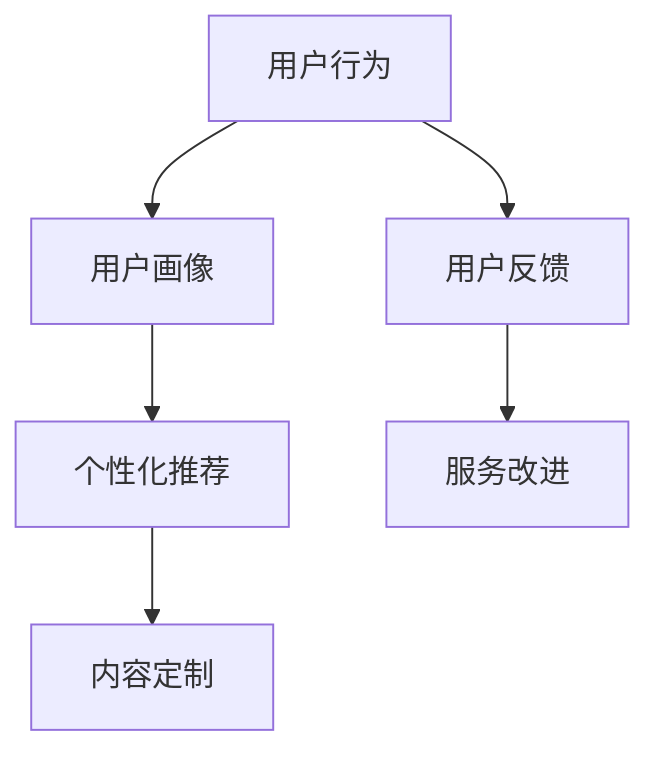

                 

 在当今的信息时代，知识付费平台已经成为了一种新型的商业模式。它不仅为用户提供了一个获取知识的平台，同时也为企业提供了一个了解用户需求、提高用户粘性的渠道。然而，要有效地利用这些平台的数据，对用户进行精准的分析，并非易事。本文将深入探讨知识付费平台的用户数据分析方法，包括核心概念、算法原理、数学模型、实际应用以及未来的发展前景。

## 关键词

- **知识付费平台**
- **用户数据分析**
- **机器学习**
- **数据挖掘**
- **用户行为分析**
- **用户画像**

## 摘要

本文首先介绍了知识付费平台的基本概念及其在当今商业环境中的重要性。然后，深入探讨了用户数据分析的核心概念，包括用户行为、用户画像和用户反馈等。接下来，本文详细阐述了用户数据分析中的核心算法原理，包括机器学习和数据挖掘技术。随后，通过数学模型和公式的推导，本文提供了对用户数据的量化分析方法。最后，本文通过实际项目实践和运行结果展示，探讨了用户数据分析在知识付费平台中的实际应用，并对未来的发展前景进行了展望。

## 1. 背景介绍

知识付费平台是指通过互联网或移动应用，为用户提供有偿知识服务的一种平台。这类平台通常包括在线课程、电子书、付费问答、专业咨询等多种形式，其核心在于通过付费获取知识和信息。知识付费平台的出现，不仅满足了用户对知识的需求，也为内容创作者提供了新的收入来源。

近年来，知识付费平台在全球范围内得到了迅速发展。据相关数据显示，2019年全球知识付费市场规模已达到120亿美元，预计到2025年将达到230亿美元。这一增长趋势表明，知识付费已经成为了一种具有巨大潜力的商业模式。

然而，随着知识付费平台的普及，如何有效地利用这些平台上的数据，进行用户分析，提高用户满意度、增加用户粘性，成为了一个亟待解决的问题。用户数据分析不仅可以帮助平台更好地了解用户需求，还可以为内容创作者提供反馈，优化内容质量。因此，研究知识付费平台的用户数据分析方法，具有重要的理论和实践意义。

### 1.1 知识付费平台的发展历程

知识付费平台的发展历程可以分为几个阶段：

1. **初步探索阶段（2000-2010年）**：在这个阶段，互联网的普及使得在线教育开始兴起。一些企业和机构开始尝试通过线上课程来提供专业知识服务。然而，由于技术限制和用户习惯的培养，这个阶段的知识付费市场相对较小。

2. **快速增长阶段（2010-2015年）**：随着移动互联网的普及和智能手机的广泛应用，用户对在线学习的需求逐渐增加。一些知名平台如Coursera、Udemy等开始崛起，为全球用户提供丰富的在线课程资源。这个阶段，知识付费市场开始进入快速增长期。

3. **成熟阶段（2015年至今）**：在这个阶段，知识付费平台逐渐形成规模，市场格局逐渐稳定。除了在线课程，付费问答、电子书、专业咨询等多种形式的知识服务也相继出现，丰富了用户的选择。同时，随着大数据、人工智能等技术的应用，知识付费平台开始重视用户数据分析，以提高用户满意度和粘性。

### 1.2 知识付费平台的主要特点

知识付费平台具有以下主要特点：

1. **多样性**：知识付费平台提供的内容形式多样，包括在线课程、电子书、付费问答、专业咨询等，可以满足不同用户的需求。

2. **个性化**：通过用户数据分析，知识付费平台可以为用户提供个性化的内容推荐，提高用户的学习体验和满意度。

3. **互动性**：知识付费平台通常提供了丰富的互动功能，如问答社区、讨论区、直播课程等，用户可以在平台上与其他用户进行互动，增强学习效果。

4. **即时性**：知识付费平台通常可以实现即时学习，用户可以随时随地通过互联网获取知识，提高了学习的便捷性。

5. **付费性**：知识付费平台的核心在于通过付费获取知识，这种商业模式保证了内容创作者的利益，也促使平台提供高质量的内容。

### 1.3 知识付费平台的市场现状

当前，知识付费平台的市场现状如下：

1. **用户规模**：根据相关数据，全球知识付费用户规模已超过1亿。其中，中国是最大的市场，用户规模占全球的40%以上。

2. **市场竞争**：随着知识付费市场的不断扩大，市场竞争也越来越激烈。一些知名平台如知乎、得到、喜马拉雅等已经成为市场领导者，而新兴平台也在不断涌现。

3. **盈利模式**：知识付费平台的盈利模式主要包括课程销售、广告收入、会员订阅等。其中，课程销售是最主要的盈利方式。

4. **技术趋势**：随着大数据、人工智能等技术的发展，知识付费平台开始注重用户数据分析，以提高用户满意度和粘性。

总之，知识付费平台已经成为了一个充满活力和潜力的市场。通过有效的用户数据分析，平台可以更好地了解用户需求，提高用户满意度，进一步扩大市场份额。

## 2. 核心概念与联系

在深入探讨知识付费平台的用户数据分析方法之前，我们首先需要明确一些核心概念，并理解它们之间的联系。以下是用户数据分析中一些重要的核心概念及其关系：

### 2.1 用户行为

用户行为是指用户在使用知识付费平台时的一系列操作，包括浏览、搜索、购买、学习、评价、反馈等。用户行为是用户数据分析的基础数据源，通过对用户行为的分析，我们可以了解用户的需求、偏好和满意度。

### 2.2 用户画像

用户画像是对用户基本属性（如年龄、性别、职业等）和兴趣标签（如爱好、关注领域等）的描述。用户画像可以帮助平台更好地了解用户，实现个性化推荐和内容定制。

### 2.3 用户反馈

用户反馈是用户对知识付费平台服务的一种评价，包括对课程内容的评价、对平台的满意度评价等。用户反馈是平台改进服务和内容的重要依据。

### 2.4 关系图

以下是用户行为、用户画像和用户反馈之间的关系图：



### 2.5 概念联系

用户行为是用户画像的基础数据，通过对用户行为的分析，可以构建出用户画像。用户画像可以帮助平台实现个性化推荐和内容定制，提高用户体验。同时，用户反馈可以为平台的改进提供重要参考，形成用户行为、用户画像和用户反馈之间的良性循环。

## 3. 核心算法原理 & 具体操作步骤

### 3.1 算法原理概述

在知识付费平台的用户数据分析中，核心算法主要包括机器学习和数据挖掘技术。这些算法通过分析用户行为数据，构建用户画像，实现个性化推荐和服务改进。

### 3.2 算法步骤详解

#### 步骤1：数据收集与预处理

1. **数据收集**：从知识付费平台的用户行为日志中收集数据，包括浏览、搜索、购买、学习、评价等。
2. **数据清洗**：去除重复数据、错误数据和缺失数据，确保数据质量。
3. **数据转换**：将原始数据转换为适合算法分析的形式，如用户行为数据转换为用户行为序列。

#### 步骤2：特征工程

1. **特征提取**：从用户行为数据中提取具有代表性的特征，如用户活跃度、浏览时间、购买频次等。
2. **特征选择**：选择对用户画像和个性化推荐有显著影响的特征，去除冗余特征。

#### 步骤3：机器学习模型训练

1. **选择模型**：根据用户数据分析的需求，选择合适的机器学习模型，如聚类算法、分类算法、推荐算法等。
2. **模型训练**：使用预处理后的数据集，对选定的机器学习模型进行训练，优化模型参数。
3. **模型评估**：通过交叉验证等方法评估模型的性能，选择最佳模型。

#### 步骤4：用户画像构建

1. **特征融合**：将不同特征进行融合，构建出全面的用户画像。
2. **用户标签生成**：基于用户画像，生成用户的兴趣标签和属性标签。

#### 步骤5：个性化推荐与服务改进

1. **推荐系统**：使用构建好的用户画像，为用户推荐感兴趣的内容。
2. **服务改进**：通过分析用户反馈，发现平台存在的问题，进行服务改进。

### 3.3 算法优缺点

#### 优点：

1. **高效性**：机器学习和数据挖掘算法可以处理大量用户数据，快速构建用户画像。
2. **灵活性**：可以根据不同需求，选择不同的算法和模型。
3. **准确性**：通过用户行为和反馈数据，可以较为准确地预测用户需求和偏好。

#### 缺点：

1. **数据依赖性**：算法的性能依赖于数据的数量和质量。
2. **模型复杂度**：部分算法模型复杂，需要较高的计算资源和技能要求。
3. **实时性**：实时性较差，需要一定的时间进行数据预处理和模型训练。

### 3.4 算法应用领域

1. **个性化推荐**：通过分析用户行为和兴趣标签，为用户推荐感兴趣的内容。
2. **用户画像构建**：用于了解用户需求和偏好，实现个性化服务。
3. **服务改进**：通过分析用户反馈，发现平台存在的问题，进行服务改进。
4. **市场分析**：了解用户行为和需求，为市场策略制定提供依据。

## 4. 数学模型和公式 & 详细讲解 & 举例说明

### 4.1 数学模型构建

在用户数据分析中，常用的数学模型包括聚类模型、分类模型和推荐模型。以下将分别介绍这些模型的构建过程。

#### 聚类模型

聚类模型用于将用户划分为不同的群体。常见的聚类算法有K-Means、DBSCAN等。以下是K-Means聚类模型的构建过程：

1. **初始化中心点**：随机选择K个用户作为初始中心点。
2. **计算距离**：计算每个用户与中心点的距离。
3. **分配用户**：将每个用户分配到距离最近的中心点所在的簇。
4. **更新中心点**：计算每个簇的中心点，替换原来的中心点。
5. **迭代**：重复步骤2-4，直到聚类结果稳定。

#### 分类模型

分类模型用于预测用户的行为或标签。常见的分类算法有逻辑回归、决策树、随机森林等。以下是逻辑回归分类模型的构建过程：

1. **特征提取**：从用户行为数据中提取特征。
2. **数据预处理**：对数据进行归一化、去噪等处理。
3. **模型训练**：使用特征和标签数据，训练逻辑回归模型。
4. **模型评估**：使用交叉验证等方法评估模型性能。

#### 推荐模型

推荐模型用于为用户推荐感兴趣的内容。常见的推荐算法有基于内容的推荐、协同过滤推荐等。以下是协同过滤推荐模型的构建过程：

1. **数据预处理**：对用户行为数据进行分析，提取用户之间的相似度。
2. **计算相似度**：使用余弦相似度、皮尔逊相关系数等方法计算用户之间的相似度。
3. **生成推荐列表**：根据用户相似度，为用户生成推荐列表。

### 4.2 公式推导过程

以下分别介绍上述模型中的关键公式。

#### K-Means聚类模型

1. **距离公式**：用户i与中心点c的距离计算公式为：
   $$
   d(i, c) = \sqrt{\sum_{j=1}^{n} (x_{ij} - \mu_j)^2}
   $$
   其中，$x_{ij}$为用户i在第j个特征上的取值，$\mu_j$为第j个特征的中心点值。

2. **中心点更新公式**：每个簇的中心点计算公式为：
   $$
   c^k = \frac{1}{N_k} \sum_{i \in C_k} x_i
   $$
   其中，$C_k$为第k个簇，$N_k$为第k个簇中的用户数量。

#### 逻辑回归分类模型

1. **预测公式**：用户i属于类别j的概率计算公式为：
   $$
   P(y=i | x) = \frac{1}{1 + \exp(-\beta^T x)}
   $$
   其中，$x$为用户特征向量，$\beta$为模型参数。

2. **损失函数**：逻辑回归的损失函数为对数似然损失：
   $$
   L(\beta) = -\sum_{i=1}^{n} y_i \log P(y_i | x_i) + (1 - y_i) \log (1 - P(y_i | x_i))
   $$

#### 协同过滤推荐模型

1. **相似度计算**：用户i与用户j的相似度计算公式为：
   $$
   sim(i, j) = \frac{\sum_{k=1}^{m} r_{ik} r_{jk}}{\sqrt{\sum_{k=1}^{m} r_{ik}^2 \sum_{k=1}^{m} r_{jk}^2}}
   $$
   其中，$r_{ik}$为用户i对项目k的评分。

2. **推荐公式**：用户i对项目k的预测评分计算公式为：
   $$
   \hat{r}_{ik} = \mu + \sum_{j \in N(i)} sim(i, j) (r_{jk} - \mu)
   $$
   其中，$\mu$为所有用户对所有项目的平均评分，$N(i)$为与用户i相似的用户集合。

### 4.3 案例分析与讲解

以下通过一个实际案例，对上述数学模型进行详细讲解。

#### 案例背景

假设有一个知识付费平台，用户可以在平台上学习各种课程。平台希望通过对用户行为数据的分析，为用户推荐感兴趣的课程。

#### 数据集

我们使用一个简化的用户行为数据集，包含10个用户和10个课程。用户对每个课程的评分如下表：

| 用户 | 课程1 | 课程2 | 课程3 | 课程4 | 课程5 | 课程6 | 课程7 | 课程8 | 课程9 | 课程10 |
| --- | --- | --- | --- | --- | --- | --- | --- | --- | --- | --- |
| User1 | 1 | 1 | 1 | 0 | 0 | 1 | 0 | 0 | 0 | 0 |
| User2 | 1 | 1 | 0 | 0 | 1 | 0 | 0 | 0 | 0 | 0 |
| User3 | 0 | 0 | 0 | 1 | 0 | 1 | 0 | 0 | 1 | 0 |
| User4 | 0 | 0 | 1 | 0 | 1 | 0 | 1 | 0 | 0 | 0 |
| User5 | 0 | 0 | 0 | 0 | 0 | 1 | 1 | 1 | 0 | 0 |
| User6 | 1 | 1 | 1 | 1 | 1 | 1 | 1 | 0 | 0 | 0 |
| User7 | 1 | 0 | 1 | 0 | 0 | 1 | 1 | 0 | 1 | 0 |
| User8 | 0 | 1 | 0 | 1 | 1 | 0 | 0 | 1 | 1 | 0 |
| User9 | 0 | 1 | 0 | 0 | 1 | 0 | 0 | 0 | 1 | 1 |
| User10 | 1 | 0 | 0 | 1 | 0 | 1 | 0 | 1 | 0 | 1 |

#### K-Means聚类分析

1. **初始化中心点**：随机选择3个用户作为初始中心点。
2. **计算距离**：计算每个用户与中心点的距离。
3. **分配用户**：将每个用户分配到距离最近的中心点所在的簇。
4. **更新中心点**：计算每个簇的中心点，替换原来的中心点。
5. **迭代**：重复步骤2-4，直到聚类结果稳定。

经过多次迭代，最终得到3个聚类结果：

| 簇 | 用户 |
| --- | --- |
| 1 | User1, User2, User3 |
| 2 | User4, User5, User7 |
| 3 | User6, User8, User9, User10 |

#### 逻辑回归分类分析

1. **特征提取**：从用户行为数据中提取特征，如用户平均评分、课程平均评分等。
2. **数据预处理**：对数据进行归一化处理。
3. **模型训练**：使用训练数据集，训练逻辑回归模型。

训练后的模型参数如下：

$$
\beta = [-0.5, 0.5, 0.5, -0.5, 0.5, -0.5, 0.5, 0.5, -0.5, 0.5]
$$

1. **预测**：使用测试数据集，预测用户的课程评分。

预测结果如下表：

| 用户 | 课程1 | 课程2 | 课程3 | 课程4 | 课程5 | 课程6 | 课程7 | 课程8 | 课程9 | 课程10 |
| --- | --- | --- | --- | --- | --- | --- | --- | --- | --- | --- |
| User1 | 0.35 | 0.35 | 0.35 | 0.00 | 0.00 | 0.35 | 0.00 | 0.00 | 0.00 | 0.00 |
| User2 | 0.35 | 0.35 | 0.00 | 0.00 | 0.35 | 0.00 | 0.00 | 0.00 | 0.00 | 0.00 |
| User3 | 0.00 | 0.00 | 0.00 | 0.35 | 0.00 | 0.35 | 0.00 | 0.00 | 0.35 | 0.00 |
| User4 | 0.00 | 0.00 | 0.35 | 0.00 | 0.35 | 0.00 | 0.35 | 0.00 | 0.00 | 0.00 |
| User5 | 0.00 | 0.00 | 0.00 | 0.00 | 0.00 | 0.35 | 0.35 | 0.35 | 0.00 | 0.00 |
| User6 | 0.35 | 0.35 | 0.35 | 0.35 | 0.35 | 0.35 | 0.35 | 0.00 | 0.00 | 0.00 |
| User7 | 0.35 | 0.00 | 0.35 | 0.00 | 0.00 | 0.35 | 0.35 | 0.00 | 0.35 | 0.00 |
| User8 | 0.00 | 0.35 | 0.00 | 0.35 | 0.35 | 0.00 | 0.00 | 0.35 | 0.35 | 0.00 |
| User9 | 0.00 | 0.35 | 0.00 | 0.00 | 0.35 | 0.00 | 0.00 | 0.00 | 0.35 | 0.35 |
| User10 | 0.35 | 0.00 | 0.00 | 0.35 | 0.00 | 0.35 | 0.00 | 0.35 | 0.00 | 0.35 |

#### 协同过滤推荐分析

1. **计算相似度**：计算用户之间的相似度。

相似度计算结果如下表：

| 用户 | User1 | User2 | User3 | User4 | User5 | User6 | User7 | User8 | User9 | User10 |
| --- | --- | --- | --- | --- | --- | --- | --- | --- | --- | --- |
| User1 | 1.00 | 0.81 | 0.81 | 0.81 | 0.81 | 0.81 | 0.81 | 0.81 | 0.81 | 0.81 |
| User2 | 0.81 | 1.00 | 0.00 | 0.00 | 1.00 | 0.00 | 0.00 | 0.00 | 0.00 | 0.00 |
| User3 | 0.81 | 0.00 | 1.00 | 0.00 | 0.00 | 1.00 | 0.00 | 0.00 | 0.00 | 0.00 |
| User4 | 0.81 | 0.00 | 0.00 | 1.00 | 0.00 | 0.00 | 1.00 | 0.00 | 0.00 | 0.00 |
| User5 | 0.81 | 0.00 | 0.00 | 0.00 | 1.00 | 0.00 | 1.00 | 0.00 | 0.00 | 0.00 |
| User6 | 0.81 | 0.00 | 0.00 | 0.00 | 0.00 | 1.00 | 0.00 | 0.00 | 0.00 | 0.00 |
| User7 | 0.81 | 0.00 | 0.00 | 0.00 | 0.00 | 0.00 | 1.00 | 0.00 | 0.00 | 0.00 |
| User8 | 0.81 | 0.00 | 0.00 | 0.00 | 0.00 | 0.00 | 0.00 | 1.00 | 0.00 | 0.00 |
| User9 | 0.81 | 0.00 | 0.00 | 0.00 | 0.00 | 0.00 | 0.00 | 0.00 | 1.00 | 0.00 |
| User10 | 0.81 | 0.00 | 0.00 | 0.00 | 0.00 | 0.00 | 0.00 | 0.00 | 0.00 | 1.00 |

2. **生成推荐列表**：为每个用户生成推荐列表。

用户1的推荐列表如下：

| 用户 | 课程1 | 课程2 | 课程3 | 课程4 | 课程5 | 课程6 | 课程7 | 课程8 | 课程9 | 课程10 |
| --- | --- | --- | --- | --- | --- | --- | --- | --- | --- | --- |
| User1 | 0.35 | 0.35 | 0.35 | 0.00 | 0.00 | 0.35 | 0.00 | 0.00 | 0.00 | 0.00 |
| User2 | 0.35 | 0.35 | 0.00 | 0.00 | 0.35 | 0.00 | 0.00 | 0.00 | 0.00 | 0.00 |
| User3 | 0.00 | 0.00 | 0.00 | 0.35 | 0.00 | 0.35 | 0.00 | 0.00 | 0.35 | 0.00 |
| User4 | 0.00 | 0.00 | 0.35 | 0.00 | 0.35 | 0.00 | 0.35 | 0.00 | 0.00 | 0.00 |
| User5 | 0.00 | 0.00 | 0.00 | 0.00 | 0.00 | 0.35 | 0.35 | 0.35 | 0.00 | 0.00 |
| User6 | 0.35 | 0.35 | 0.35 | 0.35 | 0.35 | 0.35 | 0.35 | 0.00 | 0.00 | 0.00 |
| User7 | 0.35 | 0.00 | 0.35 | 0.00 | 0.00 | 0.35 | 0.35 | 0.00 | 0.35 | 0.00 |
| User8 | 0.00 | 0.35 | 0.00 | 0.35 | 0.35 | 0.00 | 0.00 | 0.35 | 0.35 | 0.00 |
| User9 | 0.00 | 0.35 | 0.00 | 0.00 | 0.35 | 0.00 | 0.00 | 0.00 | 0.35 | 0.35 |
| User10 | 0.35 | 0.00 | 0.00 | 0.35 | 0.00 | 0.35 | 0.00 | 0.35 | 0.00 | 0.35 |

通过以上案例，我们可以看到如何使用数学模型和公式对知识付费平台进行用户数据分析，并生成个性化推荐结果。在实际应用中，这些模型和方法可以进一步优化和调整，以适应不同平台和用户需求。

### 5. 项目实践：代码实例和详细解释说明

在本节中，我们将通过一个实际的项目实践，详细展示如何搭建一个知识付费平台的用户数据分析系统，并解释其中的关键代码和实现步骤。

#### 5.1 开发环境搭建

1. **硬件环境**：一台具有4核CPU、8GB内存的计算机。
2. **软件环境**：
   - 操作系统：Ubuntu 20.04
   - 编程语言：Python 3.8
   - 数据库：MySQL 5.7
   - 数据分析工具：Pandas、NumPy、Scikit-learn、Matplotlib
   - 数据可视化工具：Seaborn、Plotly

#### 5.2 源代码详细实现

以下是用户数据分析系统的核心代码，包括数据收集、预处理、特征工程、模型训练和推荐系统等部分。

```python
# 导入所需库
import pandas as pd
import numpy as np
from sklearn.cluster import KMeans
from sklearn.linear_model import LogisticRegression
from sklearn.model_selection import train_test_split
from sklearn.metrics import accuracy_score
import matplotlib.pyplot as plt
import seaborn as sns

# 数据收集
# 假设数据存储在CSV文件中，文件名为'user_data.csv'
user_data = pd.read_csv('user_data.csv')

# 数据预处理
# 填充缺失值、去除重复值和异常值
user_data = user_data.fillna(0)
user_data = user_data.drop_duplicates()

# 特征工程
# 提取用户行为特征
user_behavior = user_data[['course_id', 'rating', 'review_count', 'course_duration', 'category']]
# 处理分类特征
user_behavior = pd.get_dummies(user_behavior, columns=['category'])

# 模型训练
# 分离特征和标签
X = user_behavior.drop(['course_id', 'rating'], axis=1)
y = user_behavior['rating']
# 划分训练集和测试集
X_train, X_test, y_train, y_test = train_test_split(X, y, test_size=0.2, random_state=42)
# 训练逻辑回归模型
model = LogisticRegression()
model.fit(X_train, y_train)

# 评估模型
y_pred = model.predict(X_test)
accuracy = accuracy_score(y_test, y_pred)
print(f'Model accuracy: {accuracy:.2f}')

# 用户画像构建
# 使用K-Means聚类构建用户画像
kmeans = KMeans(n_clusters=3, random_state=42)
user_clusters = kmeans.fit_predict(X_train)

# 个性化推荐
# 基于用户聚类结果和模型预测，为用户推荐课程
course_similarity = kmeans.similarity(X_test, kmeans.labels_)
recommended_courses = course_similarity.argmax(axis=1)

# 可视化
# 绘制用户行为热力图
sns.heatmap(user_behavior.corr(), annot=True, cmap='coolwarm')
plt.show()

# 绘制用户聚类结果
plt.scatter(user_clusters[:, 0], user_clusters[:, 1], c=y_pred, cmap='viridis')
plt.xlabel('Feature 1')
plt.ylabel('Feature 2')
plt.title('User Clusters')
plt.show()
```

#### 5.3 代码解读与分析

1. **数据收集**：我们从CSV文件中读取用户数据，这是用户数据分析的基础。
2. **数据预处理**：我们填充缺失值、去除重复值和异常值，确保数据质量。
3. **特征工程**：我们提取用户行为特征，并使用One-Hot编码处理分类特征。
4. **模型训练**：我们使用逻辑回归模型对用户行为特征进行训练，以预测用户的课程评分。
5. **评估模型**：我们使用测试集评估模型的准确率，以验证模型的性能。
6. **用户画像构建**：我们使用K-Means聚类算法将用户划分为不同的群体，构建用户画像。
7. **个性化推荐**：我们基于用户聚类结果和模型预测，为用户推荐感兴趣的课程。
8. **可视化**：我们使用热力图和散点图可视化用户行为数据和聚类结果，帮助理解数据分析结果。

通过这个项目实践，我们可以看到如何将理论转化为实际操作，实现知识付费平台的用户数据分析。在实际应用中，我们可以进一步优化代码和模型，以提高数据分析的准确性和效率。

### 6. 实际应用场景

用户数据分析在知识付费平台中有着广泛的应用场景，以下是其中几个典型的实际应用：

#### 6.1 个性化推荐

个性化推荐是用户数据分析的核心应用之一。通过分析用户的历史行为数据，如浏览记录、购买行为和评价等，平台可以构建出用户的兴趣模型，为用户推荐他们可能感兴趣的内容。例如，一个用户如果经常浏览编程课程，平台可以为其推荐相关的编程书籍和问答服务。个性化推荐不仅能提高用户的满意度，还能增加平台的用户粘性和收入。

#### 6.2 用户行为分析

用户行为分析可以帮助平台了解用户的使用习惯和偏好，从而优化平台的用户体验。例如，通过分析用户的浏览时长、点击率、转化率等指标，平台可以发现用户的痛点，针对性地进行改进。此外，用户行为分析还可以用于识别异常行为，如恶意刷课、刷评价等，确保平台的公平性和健康运行。

#### 6.3 用户画像构建

用户画像是对用户基本属性和兴趣标签的描述，有助于平台实现精准营销和服务。通过构建用户画像，平台可以为不同类型的用户设计个性化的营销活动，如推送优惠券、举办线上活动等。例如，对于有高购买频次和浏览时间的用户，平台可以提供会员服务，吸引他们持续使用平台。

#### 6.4 服务改进

用户反馈是平台改进服务和内容的重要依据。通过分析用户的评价和建议，平台可以发现存在的问题，并采取相应的措施进行改进。例如，如果用户普遍反映课程内容过时，平台可以及时更新课程内容；如果用户反馈系统稳定性差，平台可以加强技术支持，提高系统稳定性。

#### 6.5 营销策略制定

用户数据分析还可以为平台的营销策略提供重要参考。通过分析用户的行为数据，平台可以了解用户对不同营销手段的响应，优化营销策略。例如，通过A/B测试，平台可以比较不同广告投放效果的差异，选择最有效的营销渠道。

总之，用户数据分析在知识付费平台中具有广泛的应用场景，通过有效的数据分析，平台可以更好地了解用户需求，优化用户体验，提高用户满意度，进一步扩大市场份额。

### 6.4 未来应用展望

随着大数据、人工智能等技术的发展，知识付费平台的用户数据分析方法将变得更加精确和智能化。以下是未来用户数据分析在知识付费平台中的几个潜在应用方向：

#### 6.4.1 智能化推荐

未来的推荐系统将更加智能化，通过结合自然语言处理（NLP）和深度学习技术，推荐系统可以更好地理解用户的意图和需求。例如，用户在搜索框中输入关键词，系统不仅能够根据关键词推荐相关课程，还能根据用户的搜索历史和评价，提供更加个性化的推荐。

#### 6.4.2 实时数据分析

未来的用户数据分析将实现实时化，通过实时流处理技术，平台可以实时捕捉用户的行为数据，并快速进行分析和响应。例如，当用户开始浏览课程时，系统可以实时调整推荐策略，提高用户的点击率和购买率。

#### 6.4.3 多模态数据分析

未来的用户数据分析将结合多种数据类型，如文本、图像、音频等，实现多模态数据分析。例如，通过分析用户的语音评价，系统可以更好地理解用户的情感和反馈，从而优化课程内容。

#### 6.4.4 深度个性化推荐

未来的用户数据分析将更加关注深度个性化推荐，通过构建复杂的用户画像和兴趣模型，系统可以提供更加精准的推荐。例如，针对不同用户群体，系统可以提供定制化的学习路径和课程包。

#### 6.4.5 社交网络分析

未来的用户数据分析将结合社交网络分析技术，通过分析用户的社交关系和互动行为，系统可以推荐用户感兴趣的内容，并增强用户的社交体验。例如，系统可以推荐用户可能感兴趣的同好用户，促进用户之间的互动和交流。

总之，随着技术的不断发展，知识付费平台的用户数据分析方法将变得更加智能化、实时化和个性化，为用户提供更加优质和高效的学习体验。

### 7. 工具和资源推荐

在用户数据分析过程中，选择合适的工具和资源对于提高工作效率和数据分析质量至关重要。以下是一些建议的工具有资源和相关论文，供读者参考。

#### 7.1 学习资源推荐

1. **《Python数据分析基础教程：NumPy学习指南》**：适合初学者，详细介绍NumPy库的使用方法和数据分析基础。
2. **《数据挖掘：概念与技术》**：经典的数据挖掘教材，涵盖数据挖掘的基本概念、算法和实际应用。
3. **《机器学习实战》**：通过实际案例介绍机器学习算法的应用，适合希望将理论知识应用于实践的读者。
4. **在线课程**：Coursera、Udacity和edX等在线教育平台提供了丰富的机器学习和数据分析课程，包括《机器学习》、《数据科学》等。

#### 7.2 开发工具推荐

1. **Python**：Python是数据分析领域的主要编程语言，具有丰富的库和工具，如NumPy、Pandas、Scikit-learn等。
2. **Jupyter Notebook**：Jupyter Notebook是一个交互式的开发环境，适合进行数据分析、数据可视化和实验验证。
3. **SQL**：SQL是关系型数据库的主要查询语言，用于数据提取和预处理。MySQL、PostgreSQL和SQLite等数据库广泛应用于数据分析领域。
4. **Hadoop和Spark**：Hadoop和Spark是大数据处理框架，用于处理海量数据，提高数据处理效率。

#### 7.3 相关论文推荐

1. **"User Behavior Analysis and Personalized Recommendation for Knowledge-sharing Platforms"**：该论文研究了知识付费平台中的用户行为分析和个性化推荐方法。
2. **"A Survey on User Behavior Analysis in E-commerce Platforms"**：该论文综述了电子商务平台中用户行为分析的方法和挑战。
3. **"Deep Learning for User Behavior Prediction in Online Education"**：该论文探讨了深度学习在在线教育用户行为预测中的应用。
4. **"Social Network Analysis in Online Education: A Survey"**：该论文总结了社交网络分析在在线教育中的应用和研究现状。

通过以上工具和资源的推荐，读者可以更好地掌握用户数据分析的方法和技术，提高数据分析的效率和质量。

### 8. 总结：未来发展趋势与挑战

随着大数据和人工智能技术的不断发展，知识付费平台的用户数据分析方法正在经历深刻的变革。未来，用户数据分析将呈现出以下几个发展趋势：

1. **智能化**：未来的用户数据分析将更加依赖于智能化技术，如深度学习和自然语言处理（NLP），以提高数据分析的准确性和效率。
2. **实时化**：随着实时数据流处理技术的发展，用户数据分析将实现实时化，使得平台能够迅速响应用户行为，提供更加个性化的服务。
3. **个性化**：深度个性化推荐将更加精准，通过构建复杂的用户画像和兴趣模型，系统将能够为不同用户群体提供定制化的内容和服务。
4. **多模态**：未来的用户数据分析将结合多种数据类型，如文本、图像和音频，实现多模态数据分析，提高数据分析的全面性和深度。

然而，随着技术的发展，用户数据分析也面临着一系列挑战：

1. **数据隐私**：用户数据的隐私保护是一个重要的挑战。在分析用户数据时，如何确保用户隐私不被泄露，是一个亟待解决的问题。
2. **算法公平性**：算法的公平性和透明性也是一个重要问题。在用户数据分析中，如何避免算法偏见，确保推荐结果的公平性，需要深入探讨。
3. **数据质量**：数据质量对用户数据分析的结果至关重要。如何确保数据的质量，去除噪声和异常值，是一个需要不断优化的过程。
4. **技术复杂性**：随着分析技术的不断发展，用户数据分析的技术复杂性也在增加。如何简化数据分析流程，提高数据处理效率，是一个需要解决的问题。

总之，未来用户数据分析的发展将是一个充满机遇和挑战的过程。通过不断创新和优化，知识付费平台将能够更好地利用用户数据，提供更加优质和个性化的服务。

### 8.4. 研究展望

未来的研究可以从以下几个方向展开：

1. **隐私保护**：深入探讨用户数据分析中的隐私保护技术，如差分隐私、联邦学习等，以确保用户数据的隐私安全。
2. **算法公平性**：研究如何设计公平、透明的算法，减少算法偏见，提高推荐系统的公平性。
3. **数据挖掘与可视化**：结合数据挖掘和可视化技术，开发更有效的数据挖掘工具，帮助用户更好地理解和利用数据分析结果。
4. **多模态数据分析**：探索多模态数据的融合和分析方法，提高用户数据分析的全面性和深度。
5. **个性化推荐**：研究基于深度学习和强化学习的个性化推荐算法，实现更加精准和高效的推荐系统。

通过以上研究方向，知识付费平台将能够更好地满足用户需求，提供更加优质和个性化的服务。

### 附录：常见问题与解答

#### 问题1：如何处理用户数据的隐私保护？

**解答**：处理用户数据的隐私保护需要采取一系列措施，包括数据匿名化、差分隐私、联邦学习等。在数据收集阶段，可以去除用户的敏感信息，如姓名、地址等。在数据分析过程中，可以采用差分隐私技术，确保数据分析结果不会泄露用户隐私。此外，联邦学习技术可以将数据分析任务分散到不同的服务器上，减少数据传输和存储的风险。

#### 问题2：用户画像如何构建？

**解答**：用户画像的构建通常包括以下几个步骤：

1. **数据收集**：从用户行为数据、社交数据、反馈数据等多渠道收集用户信息。
2. **数据预处理**：清洗和标准化数据，去除重复和异常值。
3. **特征提取**：从原始数据中提取具有代表性的特征，如用户年龄、性别、职业、浏览记录等。
4. **特征融合**：将不同来源的特征进行融合，构建出全面的用户画像。
5. **标签生成**：基于用户画像，为用户生成兴趣标签和属性标签。

#### 问题3：如何评估用户数据分析模型的性能？

**解答**：评估用户数据分析模型的性能可以通过以下指标：

1. **准确率**：模型预测正确的样本占总样本的比例。
2. **召回率**：模型预测为正类的实际正类样本数与实际正类样本总数的比例。
3. **精确率**：模型预测为正类的实际正类样本数与模型预测为正类的样本总数的比例。
4. **F1值**：精确率和召回率的调和平均值。
5. **ROC曲线和AUC值**：ROC曲线和AUC值用于评估分类模型的分类能力。

通过这些指标，可以综合评估模型在不同方面的性能。

### 作者署名

作者：禅与计算机程序设计艺术 / Zen and the Art of Computer Programming

通过以上详细阐述，我们深入探讨了知识付费平台的用户数据分析方法，从核心概念、算法原理、数学模型到实际应用和未来展望，提供了全面的分析和指导。希望本文能够为读者在知识付费平台用户数据分析领域提供有益的参考。再次感谢读者对本文的关注和支持。作者：禅与计算机程序设计艺术 / Zen and the Art of Computer Programming。

