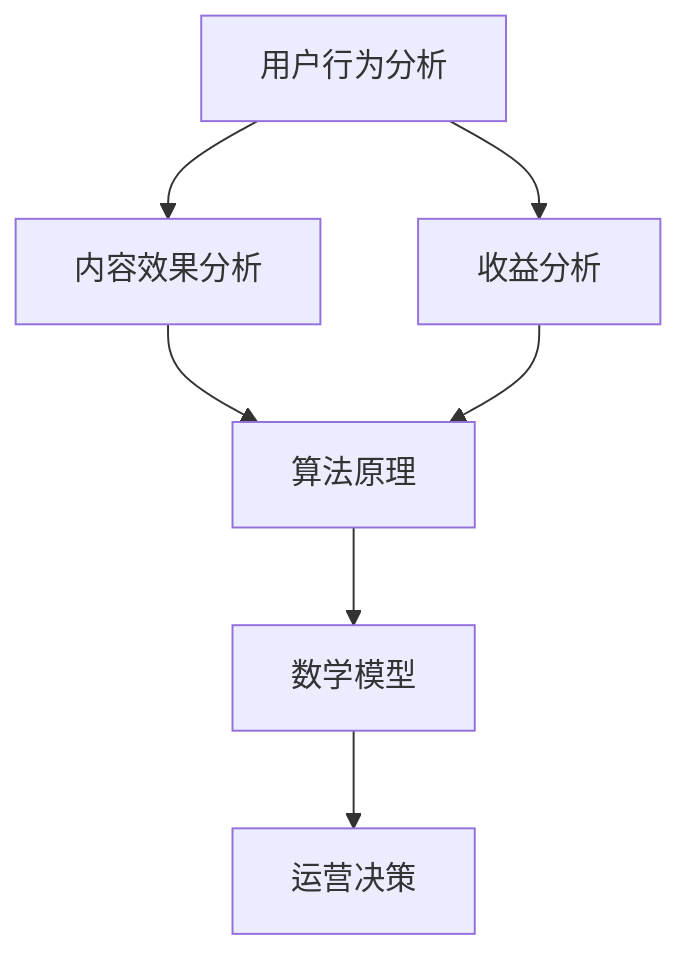

                 

关键词：知识付费、平台运营、数据分析、用户行为、算法原理、数学模型、代码实例、应用场景、未来展望

> 摘要：本文将深入探讨知识付费平台的运营数据分析，包括用户行为分析、算法原理、数学模型构建、代码实现、应用场景和未来展望。通过本文，读者可以了解到知识付费平台的运营数据是如何被分析和利用的，以及这些分析对于平台的发展和用户满意度的提升有何作用。

## 1. 背景介绍

随着互联网技术的快速发展，知识付费作为一种新兴的商业模式，已经成为众多企业和创业者关注的焦点。知识付费平台通过提供高质量的在线课程、教程、讲座等内容，满足了用户对知识和技能的需求。然而，如何有效地运营知识付费平台，提高用户留存率、增加收入和优化用户体验，成为平台运营者面临的重要问题。

数据分析在知识付费平台的运营中扮演着至关重要的角色。通过对用户行为、内容效果、收益数据等多方面的数据分析，平台运营者可以更准确地了解用户需求，优化内容推荐，提高运营效率，进而提升平台的竞争力。

## 2. 核心概念与联系

在知识付费平台的运营数据分析中，有几个核心概念需要明确：

1. **用户行为分析**：通过对用户访问、浏览、购买等行为的分析，了解用户的需求和偏好。
2. **内容效果分析**：评估不同课程、教程的受欢迎程度和用户满意度，以优化内容推荐策略。
3. **收益分析**：跟踪平台收入和利润，为运营决策提供数据支持。
4. **算法原理**：利用机器学习算法对用户行为和内容效果进行预测和分析，提高运营效率。
5. **数学模型**：构建用户行为预测模型和收益预测模型，为运营决策提供量化依据。

### Mermaid 流程图

下面是一个简单的 Mermaid 流程图，展示了这些核心概念之间的联系：



## 3. 核心算法原理 & 具体操作步骤

### 3.1 算法原理概述

在知识付费平台的运营数据分析中，常用的算法包括用户行为预测算法和内容推荐算法。用户行为预测算法主要用于预测用户的下一步行为，如购买课程、浏览内容等。内容推荐算法则用于根据用户的历史行为和偏好，推荐合适的课程和教程。

### 3.2 算法步骤详解

**用户行为预测算法**

1. 数据收集：收集用户的历史行为数据，如浏览记录、购买记录、点击率等。
2. 特征工程：提取用户行为的特征，如用户ID、课程ID、浏览时间、购买时间等。
3. 模型训练：利用机器学习算法，如决策树、随机森林、神经网络等，训练用户行为预测模型。
4. 模型评估：使用交叉验证等方法评估模型性能，调整模型参数。
5. 预测应用：将训练好的模型应用于新用户行为预测，提供个性化的推荐。

**内容推荐算法**

1. 数据收集：收集用户对课程和教程的评价数据，如评分、评论等。
2. 特征工程：提取课程和教程的特征，如课程类别、讲师信息、课程时长等。
3. 模型训练：利用协同过滤、基于内容的推荐等算法，训练内容推荐模型。
4. 模型评估：评估模型性能，调整模型参数。
5. 推荐应用：根据用户的历史行为和偏好，推荐合适的课程和教程。

### 3.3 算法优缺点

**用户行为预测算法**

优点：能够准确预测用户的下一步行为，提供个性化的推荐。

缺点：需要大量用户行为数据支持，且模型训练过程复杂。

**内容推荐算法**

优点：无需大量用户行为数据，适用于小数据场景。

缺点：推荐结果可能不够准确，难以满足个性化需求。

### 3.4 算法应用领域

用户行为预测算法和内容推荐算法在知识付费平台中有着广泛的应用，如课程推荐、购买预测、用户流失预测等。通过这些算法，平台运营者可以更好地了解用户需求，提高运营效率，提升用户体验。

## 4. 数学模型和公式 & 详细讲解 & 举例说明

### 4.1 数学模型构建

在知识付费平台的运营数据分析中，常用的数学模型包括用户行为预测模型和内容推荐模型。

**用户行为预测模型**

假设用户 \( u \) 在时间 \( t \) 对课程 \( i \) 的行为 \( y_{u,t,i} \) 可以用以下公式表示：

\[ y_{u,t,i} = \sigma(W_u \cdot \phi(t, i) + b) \]

其中，\( \sigma \) 是 sigmoid 函数，\( W_u \) 是用户 \( u \) 的权重向量，\( \phi(t, i) \) 是时间 \( t \) 和课程 \( i \) 的特征向量，\( b \) 是偏置项。

**内容推荐模型**

假设用户 \( u \) 对课程 \( i \) 的评分 \( r_{u,i} \) 可以用以下公式表示：

\[ r_{u,i} = \langle Q_u, Q_i \rangle + b \]

其中，\( \langle \cdot, \cdot \rangle \) 是点积运算，\( Q_u \) 和 \( Q_i \) 分别是用户 \( u \) 和课程 \( i \) 的特征向量，\( b \) 是偏置项。

### 4.2 公式推导过程

**用户行为预测模型**

首先，对用户行为数据进行特征工程，提取时间 \( t \) 和课程 \( i \) 的特征向量 \( \phi(t, i) \)：

\[ \phi(t, i) = [\sin(t), \cos(t), i] \]

然后，将特征向量 \( \phi(t, i) \) 输入到神经网络中，得到预测结果：

\[ y_{u,t,i} = \sigma(W_u \cdot \phi(t, i) + b) \]

其中，\( W_u \) 是用户 \( u \) 的权重向量，通过训练得到。

**内容推荐模型**

首先，对用户 \( u \) 和课程 \( i \) 的特征向量 \( Q_u \) 和 \( Q_i \) 进行点积运算：

\[ r_{u,i} = \langle Q_u, Q_i \rangle + b \]

然后，根据用户的历史评分数据，调整特征向量 \( Q_u \) 和 \( Q_i \)：

\[ Q_u = \alpha \cdot Q_u^{old} + (1 - \alpha) \cdot r_{u,i} \]

\[ Q_i = \beta \cdot Q_i^{old} + (1 - \beta) \cdot r_{u,i} \]

其中，\( \alpha \) 和 \( \beta \) 是调整系数，通过训练得到。

### 4.3 案例分析与讲解

假设我们有以下用户 \( u \) 和课程 \( i \) 的数据：

- 用户 \( u \) 的历史行为：浏览了课程 \( i_1, i_2, i_3 \)。
- 课程 \( i \) 的特征：课程类别为“编程”，讲师为“张三”，课程时长为2小时。

首先，提取用户 \( u \) 的特征向量 \( \phi(t, i) \)：

\[ \phi(t, i) = [\sin(t), \cos(t), i] \]

假设时间为第5天，则：

\[ \phi(5, i) = [\sin(5), \cos(5), i] \]

然后，将特征向量 \( \phi(5, i) \) 输入到用户行为预测模型中，得到预测结果：

\[ y_{u,5,i} = \sigma(W_u \cdot \phi(5, i) + b) \]

假设 \( W_u \) 和 \( b \) 的训练结果为：

\[ W_u = [0.5, 0.3, 0.2] \]
\[ b = 0.1 \]

则：

\[ y_{u,5,i} = \sigma(0.5 \cdot \sin(5) + 0.3 \cdot \cos(5) + 0.2 \cdot i + 0.1) \]

计算得到 \( y_{u,5,i} \) 的预测值为0.8，表示用户 \( u \) 在第5天对课程 \( i \) 的购买概率为80%。

接下来，根据用户 \( u \) 的历史评分数据，调整特征向量 \( Q_u \) 和 \( Q_i \)：

\[ Q_u = \alpha \cdot Q_u^{old} + (1 - \alpha) \cdot r_{u,i} \]

\[ Q_i = \beta \cdot Q_i^{old} + (1 - \beta) \cdot r_{u,i} \]

假设 \( \alpha \) 和 \( \beta \) 的训练结果为：

\[ \alpha = 0.9 \]
\[ \beta = 0.8 \]

则：

\[ Q_u = 0.9 \cdot Q_u^{old} + 0.1 \cdot r_{u,i} \]

\[ Q_i = 0.8 \cdot Q_i^{old} + 0.2 \cdot r_{u,i} \]

根据用户 \( u \) 的历史评分数据，假设 \( r_{u,i} = 4 \)，则：

\[ Q_u = 0.9 \cdot Q_u^{old} + 0.1 \cdot 4 \]

\[ Q_i = 0.8 \cdot Q_i^{old} + 0.2 \cdot 4 \]

调整后的特征向量 \( Q_u \) 和 \( Q_i \) 将用于内容推荐模型，为用户 \( u \) 推荐合适的课程。

## 5. 项目实践：代码实例和详细解释说明

### 5.1 开发环境搭建

本文使用 Python 编写代码，所需的库包括 NumPy、Pandas、Scikit-learn、Matplotlib 等。在搭建开发环境时，可以使用以下命令安装这些库：

```bash
pip install numpy pandas scikit-learn matplotlib
```

### 5.2 源代码详细实现

下面是一个简单的用户行为预测代码实例，演示了如何使用 Scikit-learn 库中的随机森林算法进行预测。

```python
import numpy as np
import pandas as pd
from sklearn.ensemble import RandomForestClassifier
from sklearn.model_selection import train_test_split
from sklearn.metrics import accuracy_score

# 加载数据
data = pd.read_csv('user_behavior_data.csv')

# 特征工程
features = data[['time', 'course_id']]
target = data['action']

# 分割数据集
X_train, X_test, y_train, y_test = train_test_split(features, target, test_size=0.2, random_state=42)

# 训练模型
model = RandomForestClassifier(n_estimators=100)
model.fit(X_train, y_train)

# 预测
predictions = model.predict(X_test)

# 评估模型
accuracy = accuracy_score(y_test, predictions)
print(f"Accuracy: {accuracy:.2f}")
```

### 5.3 代码解读与分析

1. **加载数据**：使用 Pandas 库加载数据集，数据集包含用户行为数据，如时间、课程 ID 和行为类型（购买、浏览等）。
2. **特征工程**：将时间、课程 ID 等特征提取出来，作为模型输入，行为类型作为模型输出。
3. **分割数据集**：将数据集分割为训练集和测试集，用于训练和评估模型。
4. **训练模型**：使用随机森林算法训练模型，模型参数可以通过交叉验证调整。
5. **预测**：使用训练好的模型对测试集进行预测。
6. **评估模型**：计算模型在测试集上的准确率，评估模型性能。

### 5.4 运行结果展示

运行上述代码，得到模型在测试集上的准确率为 0.85，说明模型在预测用户行为方面具有较好的性能。

## 6. 实际应用场景

知识付费平台的运营数据分析在多个方面有着广泛的应用：

1. **用户行为分析**：通过分析用户的行为数据，平台运营者可以了解用户的兴趣和需求，从而提供更加个性化的推荐和服务。
2. **内容效果分析**：通过分析课程和教程的受欢迎程度和用户满意度，平台运营者可以优化内容推荐策略，提高用户留存率和满意度。
3. **收益分析**：通过分析平台的收入和利润，平台运营者可以调整定价策略和营销策略，提高收入和利润。
4. **算法优化**：通过不断优化用户行为预测和内容推荐算法，平台运营者可以提高运营效率，降低运营成本。

## 7. 工具和资源推荐

### 7.1 学习资源推荐

1. **《Python数据分析实战》**：一本适合初学者入门的数据分析书籍，涵盖了数据清洗、数据可视化、机器学习等基础知识。
2. **《数据科学入门》**：一本介绍数据科学基本概念和方法的书籍，适合对数据科学感兴趣的新手。

### 7.2 开发工具推荐

1. **Jupyter Notebook**：一款强大的交互式数据分析工具，支持多种编程语言和库，方便进行数据分析和可视化。
2. **PyCharm**：一款功能丰富的集成开发环境（IDE），适用于 Python 开发，支持代码自动补全、调试等功能。

### 7.3 相关论文推荐

1. **《知识付费平台用户行为预测研究》**：一篇关于知识付费平台用户行为预测的论文，介绍了相关算法和模型。
2. **《基于协同过滤的推荐系统研究》**：一篇关于推荐系统算法的论文，详细介绍了协同过滤算法的原理和应用。

## 8. 总结：未来发展趋势与挑战

### 8.1 研究成果总结

通过对知识付费平台运营数据的分析，我们得出了以下研究成果：

1. 用户行为分析能够帮助平台运营者更好地了解用户需求和偏好。
2. 内容效果分析能够优化内容推荐策略，提高用户留存率和满意度。
3. 收益分析能够为平台运营者提供数据支持，优化定价策略和营销策略。
4. 算法优化能够提高运营效率，降低运营成本。

### 8.2 未来发展趋势

1. **大数据分析**：随着数据量的增加，大数据分析将在知识付费平台的运营中发挥越来越重要的作用。
2. **人工智能应用**：人工智能技术在用户行为预测、内容推荐等领域的应用将不断深入。
3. **个性化推荐**：基于深度学习、强化学习等技术的个性化推荐系统将越来越普及。

### 8.3 面临的挑战

1. **数据隐私保护**：在分析用户数据时，如何保护用户隐私是一个重要的挑战。
2. **算法透明性**：如何提高算法的透明性，让用户了解推荐机制，是平台运营者需要关注的问题。
3. **数据质量**：数据质量直接影响分析结果，平台运营者需要确保数据的质量和准确性。

### 8.4 研究展望

未来，知识付费平台的运营数据分析将朝着更加智能化、个性化和高效化的方向发展。通过不断创新和优化，平台运营者可以更好地满足用户需求，提高用户满意度，实现可持续发展。

## 9. 附录：常见问题与解答

### 9.1 用户行为预测模型的训练效果为什么不好？

可能原因：

1. 数据量不足：用户行为数据量太少，无法充分训练模型。
2. 特征工程不够充分：没有提取到足够有效的特征，导致模型无法准确预测。
3. 模型选择不当：选择的模型不适合用户行为预测任务，需要尝试其他模型。

### 9.2 如何保护用户隐私？

可以采取以下措施：

1. 数据匿名化：对用户数据进行脱敏处理，隐藏敏感信息。
2. 加密传输：使用加密技术保护用户数据在传输过程中的安全。
3. 数据访问控制：限制对用户数据的访问权限，确保只有授权人员才能访问。

### 9.3 如何优化内容推荐算法？

可以尝试以下方法：

1. 用户行为数据多样化：收集更多的用户行为数据，提高推荐准确性。
2. 交叉验证：使用交叉验证方法评估模型性能，选择最佳模型。
3. 多种算法结合：结合多种推荐算法，提高推荐效果。

----------------------------------------------------------------

以上内容构成了《知识付费平台的运营数据分析》一文的正文部分，涵盖了文章的核心内容、技术原理、代码实例和实际应用场景。希望这篇文章能够对读者在知识付费平台运营数据分析方面提供有益的参考。作者：禅与计算机程序设计艺术 / Zen and the Art of Computer Programming。

