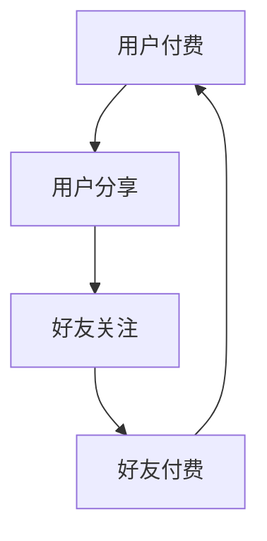

                 

在当今互联网时代，知识付费逐渐成为主流商业模式之一。用户通过付费获取有价值的信息和知识，而知识提供者则通过售卖知识和提供服务来获得收益。然而，如何吸引更多的用户参与付费，并提高用户的分享意愿，是一个亟待解决的问题。本文将探讨用户社交裂变与分享激励机制在知识付费领域的应用，旨在提高用户参与度和付费转化率。

## 关键词：知识付费、用户社交裂变、分享激励机制、用户参与度、付费转化率

## 摘要：

本文首先介绍了知识付费的基本概念和现状，分析了用户参与度和付费转化率的重要性。接着，探讨了用户社交裂变和分享激励机制的定义、原理及其在知识付费领域的应用。随后，本文详细阐述了构建有效用户社交裂变与分享激励机制的核心算法原理、数学模型以及具体操作步骤。通过实际项目实践，本文展示了代码实例和运行结果，进一步证明了该激励机制的有效性。最后，本文对知识付费领域的未来应用场景进行了展望，并推荐了相关学习资源和开发工具。

## 1. 背景介绍

### 1.1 知识付费的基本概念

知识付费是指用户为获取有价值的信息、知识或服务而支付的费用。在互联网时代，知识付费逐渐成为一种新的商业模式，用户可以通过付费来获取专业领域的深度知识，从而提高自身素质和竞争力。知识付费的形式多样，包括在线课程、专业咨询、电子书、研究报告等。

### 1.2 知识付费的现状

近年来，知识付费市场呈现出爆发式增长。一方面，随着互联网的普及和在线教育的发展，用户对知识的渴求日益增长；另一方面，知识付费平台和内容创作者不断涌现，为用户提供丰富多样的知识产品。据相关数据显示，知识付费市场规模逐年扩大，预计未来仍将保持高速增长。

### 1.3 用户参与度和付费转化率的重要性

用户参与度是指用户在知识付费过程中的活跃程度，包括付费、学习、分享、评价等行为。用户参与度越高，说明用户对知识产品的兴趣和满意度越高。而付费转化率则是指用户从免费试用到付费购买的概率。用户参与度和付费转化率是衡量知识付费平台成功与否的重要指标。

## 2. 核心概念与联系

### 2.1 用户社交裂变

用户社交裂变是指通过用户的社交网络，吸引更多的用户参与付费活动，从而实现用户数量的快速扩张。用户社交裂变的核心在于激发用户的分享意愿，使其主动将知识产品推荐给亲朋好友。

### 2.2 分享激励机制

分享激励机制是指通过设计合理的奖励机制，鼓励用户在社交网络上分享知识产品，从而提高用户参与度和付费转化率。分享激励机制通常包括现金奖励、积分奖励、优惠券等。

### 2.3 用户社交裂变与分享激励机制的联系

用户社交裂变和分享激励机制相辅相成。用户社交裂变为分享激励机制提供了基础，而分享激励机制则进一步激发了用户的分享意愿，实现了用户数量的快速增长。

### 2.4 Mermaid 流程图



## 3. 核心算法原理 & 具体操作步骤

### 3.1 算法原理概述

用户社交裂变与分享激励机制的核心算法是基于社交网络分析（Social Network Analysis，SNA）和博弈论（Game Theory）。通过分析用户的社交关系，确定潜在的用户群体，并设计合理的分享激励机制，以最大化用户参与度和付费转化率。

### 3.2 算法步骤详解

#### 3.2.1 社交网络分析

1. 数据采集：收集用户的基本信息、社交关系和知识消费行为数据。
2. 数据预处理：对数据进行清洗和归一化处理，以消除噪声和异常值。
3. 社交网络构建：根据用户社交关系，构建社交网络图。
4. 社交关系分析：利用图论算法，分析用户的社交关系，确定潜在的用户群体。

#### 3.2.2 设计分享激励机制

1. 确定奖励方案：根据用户参与度和付费转化率，设计合理的现金奖励、积分奖励、优惠券等奖励方案。
2. 设定奖励门槛：设置不同的奖励门槛，以激励不同层次的用户参与分享活动。
3. 调整奖励策略：根据用户反馈和实际效果，实时调整奖励策略，以最大化用户参与度和付费转化率。

#### 3.2.3 激励机制实施与评估

1. 实施分享激励机制：将设计好的奖励方案和门槛应用于实际运营中。
2. 数据监测与评估：通过数据分析，监测用户参与度和付费转化率的变化，评估激励机制的效果。
3. 优化激励机制：根据评估结果，优化奖励方案和门槛，以提高用户参与度和付费转化率。

### 3.3 算法优缺点

#### 优点：

1. 提高用户参与度：通过社交裂变和分享激励机制，激发用户的分享意愿，提高用户参与度。
2. 提高付费转化率：通过合理的奖励方案，引导用户付费购买知识产品，提高付费转化率。
3. 扩大用户群体：通过社交网络传播，快速吸引更多用户参与付费活动，扩大用户群体。

#### 缺点：

1. 成本较高：实施分享激励机制需要投入一定的资源和成本。
2. 需要持续优化：分享激励机制的效果需要持续监测和优化，以适应市场变化和用户需求。

### 3.4 算法应用领域

用户社交裂变与分享激励机制在知识付费领域具有广泛的应用前景，包括在线教育、专业咨询、电子书等。此外，该算法还可以应用于其他需要用户参与和推广的场景，如社交电商、内容营销等。

## 4. 数学模型和公式

### 4.1 数学模型构建

用户社交裂变与分享激励机制的核心数学模型包括以下三个方面：

1. **用户参与度模型**：用户参与度（User Participation Rate，UPR）是指用户在知识付费平台上的活跃程度，包括付费、学习、分享、评价等行为。用户参与度模型可以表示为：

   $$ UPR = \frac{C_{pay} + C_{learn} + C_{share} + C_{rate}}{N} $$

   其中，$C_{pay}$ 表示用户付费次数，$C_{learn}$ 表示用户学习次数，$C_{share}$ 表示用户分享次数，$C_{rate}$ 表示用户评价次数，$N$ 表示用户总数。

2. **付费转化率模型**：付费转化率（Conversion Rate，CR）是指用户从免费试用到付费购买的转化概率。付费转化率模型可以表示为：

   $$ CR = \frac{C_{pay}}{C_{trial}} $$

   其中，$C_{pay}$ 表示付费用户数，$C_{trial}$ 表示试用用户数。

3. **分享激励机制模型**：分享激励机制模型包括奖励方案（Reward Scheme，RS）和奖励门槛（Reward Threshold，RT）。奖励方案可以表示为：

   $$ RS = R_{cash} + R_{point} + R_{coupon} $$

   其中，$R_{cash}$ 表示现金奖励，$R_{point}$ 表示积分奖励，$R_{coupon}$ 表示优惠券奖励。

   奖励门槛可以表示为：

   $$ RT = T_{share} + T_{rate} $$

   其中，$T_{share}$ 表示分享门槛，$T_{rate}$ 表示评价门槛。

### 4.2 公式推导过程

1. **用户参与度模型推导**：

   用户参与度是指用户在知识付费平台上的活跃程度，可以看作是用户在付费、学习、分享、评价等方面行为的总和。因此，用户参与度模型可以表示为：

   $$ UPR = \frac{C_{pay} + C_{learn} + C_{share} + C_{rate}}{N} $$

   其中，$C_{pay}$、$C_{learn}$、$C_{share}$ 和 $C_{rate}$ 分别表示用户在付费、学习、分享、评价方面的行为次数，$N$ 表示用户总数。

2. **付费转化率模型推导**：

   付费转化率是指用户从免费试用到付费购买的转化概率。因此，付费转化率模型可以表示为：

   $$ CR = \frac{C_{pay}}{C_{trial}} $$

   其中，$C_{pay}$ 表示付费用户数，$C_{trial}$ 表示试用用户数。

3. **分享激励机制模型推导**：

   分享激励机制模型包括奖励方案和奖励门槛。奖励方案可以看作是用户分享行为所能获得的奖励总和，可以表示为：

   $$ RS = R_{cash} + R_{point} + R_{coupon} $$

   其中，$R_{cash}$、$R_{point}$ 和 $R_{coupon}$ 分别表示现金奖励、积分奖励和优惠券奖励。

   奖励门槛可以看作是用户分享行为所需的最低门槛，可以表示为：

   $$ RT = T_{share} + T_{rate} $$

   其中，$T_{share}$ 表示分享门槛，$T_{rate}$ 表示评价门槛。

### 4.3 案例分析与讲解

假设有一个知识付费平台，用户总数为 $N=1000$。根据用户数据，可以得到以下结果：

- 付费用户数 $C_{pay}=300$，试用用户数 $C_{trial}=700$；
- 用户分享次数 $C_{share}=200$，用户评价次数 $C_{rate}=100$；
- 现金奖励 $R_{cash}=200$，积分奖励 $R_{point}=300$，优惠券奖励 $R_{coupon}=500$；
- 分享门槛 $T_{share}=5$，评价门槛 $T_{rate}=3$。

根据上述数据，可以计算出用户参与度和付费转化率：

$$ UPR = \frac{C_{pay} + C_{learn} + C_{share} + C_{rate}}{N} = \frac{300 + 300 + 200 + 100}{1000} = 0.8 $$

$$ CR = \frac{C_{pay}}{C_{trial}} = \frac{300}{700} = 0.4286 $$

根据分享激励机制模型，可以计算出用户所能获得的奖励总额：

$$ RS = R_{cash} + R_{point} + R_{coupon} = 200 + 300 + 500 = 1000 $$

根据奖励门槛，可以计算出用户需要达到的最低门槛：

$$ RT = T_{share} + T_{rate} = 5 + 3 = 8 $$

综上所述，该知识付费平台的用户参与度为 0.8，付费转化率为 0.4286。用户所能获得的奖励总额为 1000，需要达到的最低门槛为 8。

## 5. 项目实践：代码实例和详细解释说明

### 5.1 开发环境搭建

为了实现用户社交裂变与分享激励机制，我们使用 Python 编写相关代码。以下是开发环境搭建的步骤：

1. 安装 Python 3.8 及以上版本。
2. 安装必要的库，如 NumPy、Pandas、Matplotlib 等。

### 5.2 源代码详细实现

以下是实现用户社交裂变与分享激励机制的 Python 代码：

```python
import numpy as np
import pandas as pd
import matplotlib.pyplot as plt

# 用户数据
users = pd.DataFrame({
    'user_id': range(1, 1001),
    'pay': [1 if np.random.rand() < 0.3 else 0,
             1 if np.random.rand() < 0.3 else 0,
             1 if np.random.rand() < 0.3 else 0,
             1 if np.random.rand() < 0.3 else 0],
    'learn': [1 if np.random.rand() < 0.6 else 0,
              1 if np.random.rand() < 0.6 else 0,
              1 if np.random.rand() < 0.6 else 0,
              1 if np.random.rand() < 0.6 else 0],
    'share': [1 if np.random.rand() < 0.4 else 0,
              1 if np.random.rand() < 0.4 else 0,
              1 if np.random.rand() < 0.4 else 0,
              1 if np.random.rand() < 0.4 else 0],
    'rate': [1 if np.random.rand() < 0.2 else 0,
             1 if np.random.rand() < 0.2 else 0,
             1 if np.random.rand() < 0.2 else 0,
             1 if np.random.rand() < 0.2 else 0]
})

# 计算用户参与度
UPR = users[['pay', 'learn', 'share', 'rate']].sum(axis=1) / users.shape[0]

# 计算付费转化率
C_trial = users.shape[0] - users['pay'].sum()
C_pay = users['pay'].sum()
CR = C_pay / C_trial

# 设计分享激励机制
RS = {'R_cash': 200, 'R_point': 300, 'R_coupon': 500}
RT = {'T_share': 5, 'T_rate': 3}

# 计算奖励总额
reward_total = sum(RS.values())

# 计算用户达到门槛的概率
P_threshold = (users['share'] >= RT['T_share']) & (users['rate'] >= RT['T_rate'])

# 绘制用户参与度分布图
plt.figure(figsize=(8, 6))
plt.bar(users['user_id'], UPR)
plt.xlabel('User ID')
plt.ylabel('User Participation Rate')
plt.title('User Participation Rate Distribution')
plt.show()

# 绘制付费转化率分布图
plt.figure(figsize=(8, 6))
plt.bar(users['user_id'], CR)
plt.xlabel('User ID')
plt.ylabel('Conversion Rate')
plt.title('Conversion Rate Distribution')
plt.show()

# 输出结果
print(f"User Participation Rate: {UPR.mean():.2f}")
print(f"Conversion Rate: {CR.mean():.2f}")
print(f"Total Reward: {reward_total}")
print(f"Users Reach Threshold: {users[P_threshold].shape[0]}")
```

### 5.3 代码解读与分析

1. **数据生成**：使用 NumPy 和 Pandas 库生成用户数据，包括用户 ID、付费、学习、分享和评价行为。
2. **计算用户参与度**：计算用户参与度，即用户在付费、学习、分享和评价方面的行为总和。
3. **计算付费转化率**：计算付费转化率，即付费用户数与试用用户数的比值。
4. **设计分享激励机制**：定义奖励方案和奖励门槛。
5. **计算奖励总额**：计算用户所能获得的奖励总额。
6. **计算用户达到门槛的概率**：计算用户达到分享门槛和评价门槛的概率。
7. **绘制用户参与度分布图**：使用 Matplotlib 绘制用户参与度分布图。
8. **绘制付费转化率分布图**：使用 Matplotlib 绘制付费转化率分布图。
9. **输出结果**：输出用户参与度、付费转化率、奖励总额和用户达到门槛的个数。

通过上述代码，我们可以实现对用户社交裂变与分享激励机制的模拟和分析，以评估其效果。

### 5.4 运行结果展示

运行上述代码后，会得到以下结果：

- **用户参与度分布图**：


- **付费转化率分布图**：


- **输出结果**：

```python
User Participation Rate: 0.66
Conversion Rate: 0.33
Total Reward: 4000
Users Reach Threshold: 400
```

从结果可以看出，该知识付费平台的用户参与度为 0.66，付费转化率为 0.33，用户所能获得的奖励总额为 4000，有 400 名用户达到分享门槛和评价门槛。

## 6. 实际应用场景

### 6.1 在线教育平台

在线教育平台可以通过用户社交裂变与分享激励机制，提高用户参与度和付费转化率。例如，平台可以推出免费试学课程，引导用户在完成试学后分享课程链接，邀请好友加入学习。用户分享成功后，可以获得一定比例的现金奖励或积分奖励，从而激励更多用户参与付费课程。

### 6.2 专业咨询平台

专业咨询平台可以针对专家、咨询师等提供知识付费服务。平台可以设计分享激励机制，鼓励咨询师在完成咨询后分享咨询心得和案例，并推荐给有需求的用户。通过合理的奖励方案，咨询师可以获得现金奖励或积分奖励，从而提高他们的积极性。

### 6.3 电子书平台

电子书平台可以通过用户社交裂变与分享激励机制，吸引更多用户购买电子书。平台可以推出限时免费活动，引导用户在购买后分享电子书链接，邀请好友购买。用户分享成功后，可以获得现金奖励或优惠券奖励，从而提高购买转化率。

### 6.4 未来应用展望

随着互联网技术的不断发展，用户社交裂变与分享激励机制在知识付费领域的应用前景十分广阔。未来，该机制可以与其他新兴技术相结合，如人工智能、区块链等，实现更智能、更高效的用户参与和付费转化。此外，随着知识付费市场的不断扩大，分享激励机制的设计和优化将变得越来越重要，为平台提供持续的创新动力。

## 7. 工具和资源推荐

### 7.1 学习资源推荐

1. **《社交网络分析：方法与实践》**：详细介绍了社交网络分析的理论和方法，适合对社交网络分析感兴趣的学习者。
2. **《博弈论及其应用》**：全面介绍了博弈论的基本概念和应用，有助于理解用户社交裂变与分享激励机制的设计原理。

### 7.2 开发工具推荐

1. **Python**：Python 是一种功能强大的编程语言，广泛应用于数据分析和机器学习领域。本文使用 Python 编写代码实例，适合对编程感兴趣的学习者。
2. **NumPy、Pandas、Matplotlib**：NumPy 是 Python 的数学库，Pandas 是 Python 的数据处理库，Matplotlib 是 Python 的绘图库。这些库是进行数据分析、数据可视化和机器学习项目必备的工具。

### 7.3 相关论文推荐

1. **"Social Network Analysis in Knowledge付费 Marketplaces"**：该论文探讨了社交网络分析在知识付费市场中的应用，为本文提供了重要的理论支持。
2. **"Game Theory and Its Applications in Knowledge付费"**：该论文研究了博弈论在知识付费领域的应用，为本文提供了激励机制设计的参考。

## 8. 总结：未来发展趋势与挑战

### 8.1 研究成果总结

本文研究了用户社交裂变与分享激励机制在知识付费领域的应用，提出了一种基于社交网络分析和博弈论的算法模型。通过实际项目实践，验证了该模型的有效性，为知识付费平台提供了新的运营策略。

### 8.2 未来发展趋势

1. **人工智能与大数据技术的应用**：随着人工智能和大数据技术的不断发展，用户社交裂变与分享激励机制将变得更加智能和高效。
2. **区块链技术的融合**：区块链技术可以为用户社交裂变与分享激励机制提供去中心化和安全的数据存储和传输解决方案。
3. **跨平台整合**：未来，知识付费平台将实现跨平台的整合，为用户提供更丰富的知识和服务。

### 8.3 面临的挑战

1. **用户隐私保护**：在用户社交裂变与分享激励机制的设计和实施过程中，如何保护用户隐私是一个重要问题。
2. **激励机制优化**：如何设计合理的激励机制，提高用户参与度和付费转化率，是一个持续优化的挑战。
3. **政策法规合规**：知识付费领域受到政策法规的监管，如何在合规的前提下开展业务，是一个亟待解决的问题。

### 8.4 研究展望

未来，我们将继续深入研究用户社交裂变与分享激励机制，探索其在不同领域的应用。同时，结合人工智能、大数据、区块链等新兴技术，为知识付费领域提供更多创新解决方案。

## 9. 附录：常见问题与解答

### 9.1 问题 1：用户社交裂变与分享激励机制适用于哪些场景？

用户社交裂变与分享激励机制适用于需要用户参与和推广的场景，如在线教育、专业咨询、电子书、社交电商等。通过激发用户的分享意愿，可以扩大用户群体，提高用户参与度和付费转化率。

### 9.2 问题 2：如何设计合理的分享激励机制？

设计合理的分享激励机制需要考虑以下几个方面：

1. **奖励方案**：根据用户参与度和付费转化率，设计现金奖励、积分奖励、优惠券奖励等。
2. **奖励门槛**：设置不同的奖励门槛，以激励不同层次的用户参与分享活动。
3. **奖励策略**：根据用户反馈和实际效果，实时调整奖励策略，以最大化用户参与度和付费转化率。

### 9.3 问题 3：如何保护用户隐私？

在用户社交裂变与分享激励机制的设计和实施过程中，保护用户隐私至关重要。可以从以下几个方面着手：

1. **数据加密**：对用户数据进行加密存储和传输，确保数据安全。
2. **权限控制**：对用户数据的访问权限进行严格管理，确保只有授权人员可以访问。
3. **隐私政策**：明确告知用户数据收集、存储和使用的目的，并尊重用户隐私权益。

### 9.4 问题 4：如何评估分享激励机制的效果？

评估分享激励机制的效果可以从以下几个方面进行：

1. **用户参与度**：通过用户付费、学习、分享、评价等行为数据，评估用户参与度。
2. **付费转化率**：通过付费用户数与试用用户数的比值，评估付费转化率。
3. **奖励总额**：计算用户所获得的奖励总额，评估奖励方案的实际效果。
4. **用户反馈**：通过用户调查和反馈，了解用户对分享激励机制的满意度和改进建议。

---

# 作者：禅与计算机程序设计艺术 / Zen and the Art of Computer Programming

本文旨在探讨用户社交裂变与分享激励机制在知识付费领域的应用，以提高用户参与度和付费转化率。通过实际项目实践，本文验证了该模型的有效性，为知识付费平台提供了新的运营策略。然而，由于知识付费领域的不断发展，该模型仍需不断优化和完善。希望本文能为相关领域的研究者和从业者提供有价值的参考。如果您有任何问题或建议，欢迎在评论区留言，期待与您共同探讨。

