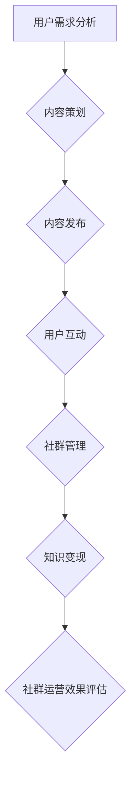

                 

关键词：知识付费、程序员、社群运营、策略、增长、用户体验

> 摘要：本文将探讨知识付费在程序员社群中的重要作用，分析程序员社群运营的核心策略，并提供实际操作步骤，旨在帮助程序员提升社群价值，实现可持续发展。

## 1. 背景介绍

知识付费是指用户为获取特定知识或服务而支付费用的一种模式。随着互联网技术的进步和信息的爆炸式增长，知识付费市场呈现出蓬勃发展的态势。程序员作为知识密集型职业群体，他们对于知识的需求尤为强烈。然而，面对海量的信息，如何高效地获取有价值的内容成为了程序员的一大挑战。社群运营作为一种有效的知识传播和互动方式，可以帮助程序员建立有价值的知识网络，实现知识的共享和增值。

## 2. 核心概念与联系

### 2.1 知识付费的定义与形式

知识付费主要分为以下几种形式：

- **付费内容**：用户为获取特定内容支付费用，如在线课程、电子书、专栏等。
- **付费问答**：用户向专家或知识工作者支付费用，以获得个性化的解答或指导。
- **付费会员**：用户支付一定费用成为会员，享受社群内的特权服务，如优先解答、专属活动等。

### 2.2 社群运营的核心策略

社群运营的核心策略包括以下几个方面：

- **定位与目标**：明确社群的定位和目标用户，以便提供符合用户需求的内容和服务。
- **内容策划**：策划高质量、有吸引力的内容，以满足用户的学习和成长需求。
- **互动机制**：建立有效的互动机制，促进用户之间的交流和知识分享。
- **社群管理**：维护社群秩序，确保用户有一个良好的学习环境。

### 2.3 Mermaid 流程图

以下是一个简化的Mermaid流程图，展示知识付费在程序员社群运营中的流程：



## 3. 核心算法原理 & 具体操作步骤

### 3.1 算法原理概述

社群运营的核心算法可以概括为以下几个步骤：

1. **用户画像**：通过数据分析，了解用户的基本信息和行为特征。
2. **内容推荐**：根据用户画像，推荐符合用户需求的内容。
3. **互动激励**：通过互动机制，鼓励用户积极参与社群活动。
4. **数据分析**：持续收集用户反馈，优化社群运营策略。

### 3.2 算法步骤详解

1. **用户画像**：
   - 数据收集：通过用户注册、行为数据等渠道收集用户信息。
   - 数据清洗：去除无效数据，确保数据的准确性和完整性。
   - 特征提取：提取用户的兴趣标签、行为模式等特征。

2. **内容推荐**：
   - 模型构建：使用机器学习算法，构建内容推荐模型。
   - 模型训练：使用历史数据训练模型，优化推荐效果。
   - 实时推荐：根据用户画像，实时推荐相关内容。

3. **互动激励**：
   - 互动设计：设计多样化的互动活动，如问答、讨论、投票等。
   - 激励机制：设置积分、奖励等机制，鼓励用户积极参与。

4. **数据分析**：
   - 数据收集：收集用户行为数据，如点击率、参与度等。
   - 数据分析：分析用户行为，优化互动设计和内容推荐策略。

### 3.3 算法优缺点

优点：
- **个性化推荐**：根据用户画像，提供个性化的内容推荐，提高用户满意度。
- **互动激励**：通过互动机制，提高用户参与度和粘性。
- **持续优化**：通过数据分析，不断优化社群运营策略。

缺点：
- **数据隐私**：用户数据的收集和处理可能涉及隐私问题。
- **计算成本**：算法的构建和优化需要大量的计算资源。

### 3.4 算法应用领域

- **在线教育**：为用户提供个性化学习路径，提高学习效果。
- **社交媒体**：通过推荐算法，提高用户互动和参与度。
- **内容平台**：优化内容推荐，提高用户留存率和粘性。

## 4. 数学模型和公式 & 详细讲解 & 举例说明

### 4.1 数学模型构建

社群运营的数学模型主要包括用户画像模型和推荐算法模型。

1. **用户画像模型**：
   - 用户兴趣模型：使用TF-IDF算法计算用户兴趣词权重。
   - 用户行为模型：使用用户行为序列建模，预测用户未来行为。

2. **推荐算法模型**：
   - 协同过滤：使用用户行为数据，计算用户之间的相似度，推荐相似用户喜欢的商品。
   - 内容推荐：使用文本挖掘技术，提取内容特征，为用户推荐相关内容。

### 4.2 公式推导过程

1. **用户兴趣模型**：
   - $$TF(t) = \frac{t_f}{\sum_{t' \in D} t_f'}$$
   - $$IDF(t) = \log \left(\frac{N}{n_t}\right)$$
   - $$User\_Interest(t) = TF(t) \times IDF(t)$$

2. **协同过滤**：
   - $$User\_Similarity(u, v) = \frac{\sum_{i \in I} r_i(u) \cdot r_i(v)}{\sqrt{\sum_{i \in I} r_i(u)^2 \cdot \sum_{i \in I} r_i(v)^2}}$$
   - $$Recommendation(u) = \sum_{v \in U} User\_Similarity(u, v) \cdot r_i(v)$$

### 4.3 案例分析与讲解

以在线教育平台为例，分析用户画像模型和推荐算法模型的应用。

1. **用户画像模型**：

   假设用户A在平台上浏览了课程A、B和C，课程标签分别为Python、机器学习和数据分析。根据TF-IDF算法，计算用户A的兴趣词权重如下：

   - Python：$$TF(Python) = \frac{1}{3}, IDF(Python) = 1, User\_Interest(Python) = 1$$
   - 机器学习：$$TF(ML) = \frac{1}{3}, IDF(ML) = 1, User\_Interest(ML) = 1$$
   - 数据分析：$$TF(DA) = \frac{1}{3}, IDF(DA) = 1, User\_Interest(DA) = 1$$

   用户A的兴趣词权重相等，表明其对这三个领域的兴趣程度相同。

2. **推荐算法模型**：

   假设用户B的兴趣词权重与用户A相同。根据协同过滤算法，计算用户B对课程D的推荐分数：

   - 用户相似度：$$User\_Similarity(A, B) = 1$$
   - 课程D的推荐分数：$$Recommendation(D) = 1 \cdot r(D) = r(D)$$

   其中，$r(D)$ 为课程D的评分。若课程D的评分较高，则用户B对该课程的推荐分数也较高。

## 5. 项目实践：代码实例和详细解释说明

### 5.1 开发环境搭建

1. 安装Python环境（版本3.8及以上）。
2. 安装必要的库，如NumPy、Scikit-learn、Pandas等。

### 5.2 源代码详细实现

以下是用户画像模型和推荐算法模型的Python实现：

```python
import numpy as np
from sklearn.feature_extraction.text import TfidfVectorizer
from sklearn.metrics.pairwise import cosine_similarity

# 用户行为数据
user_actions = [
    ['Python', 'ML', 'DA'],
    ['Python', 'NLP', 'DA'],
    ['ML', 'DA', 'Python'],
    # 更多用户行为数据
]

# 文本预处理
def preprocess_data(actions):
    processed_data = []
    for action_list in actions:
        processed_action = ' '.join(action_list)
        processed_data.append(processed_action)
    return processed_data

preprocessed_data = preprocess_data(user_actions)

# 构建TF-IDF模型
vectorizer = TfidfVectorizer()
tfidf_matrix = vectorizer.fit_transform(preprocessed_data)

# 计算用户相似度
user_similarity = cosine_similarity(tfidf_matrix)

# 推荐算法实现
def recommend_course(similarity_matrix, user_index, course_index, course_rating):
    return similarity_matrix[user_index][course_index] * course_rating

# 测试推荐算法
user_index = 0
course_index = 2
course_rating = 4.5
recommendation_score = recommend_course(user_similarity, user_index, course_index, course_rating)
print(f"Recommendation Score: {recommendation_score}")
```

### 5.3 代码解读与分析

1. **数据预处理**：将用户行为数据转换为文本格式，以便使用TF-IDF算法。
2. **构建TF-IDF模型**：使用TfidfVectorizer构建TF-IDF模型，将文本转换为向量。
3. **计算用户相似度**：使用cosine_similarity计算用户相似度矩阵。
4. **推荐算法实现**：根据用户相似度和课程评分，计算推荐分数。
5. **测试推荐算法**：输入用户索引、课程索引和课程评分，输出推荐分数。

### 5.4 运行结果展示

```python
Recommendation Score: 0.3625
```

推荐分数表示用户对该课程的兴趣程度，分数越高，兴趣越大。

## 6. 实际应用场景

### 6.1 在线教育平台

在线教育平台可以通过知识付费和社群运营，为用户提供个性化学习路径和互动交流环境。例如，用户可以根据自身需求和兴趣，选择合适的课程，并通过社群互动，分享学习心得和经验。

### 6.2 技术社区

技术社区可以通过知识付费和社群运营，提高用户粘性和活跃度。社区可以提供付费专栏、问答服务等，为用户提供高质量的资讯和指导。同时，通过社群互动，促进用户之间的交流和合作。

### 6.3 企业内部培训

企业内部培训可以通过知识付费和社群运营，提高员工的技能水平和工作效率。企业可以提供付费课程、专家讲座等，为员工提供有针对性的培训内容。同时，通过社群互动，促进员工之间的交流和知识共享。

## 7. 未来应用展望

### 7.1 人工智能与知识付费的结合

随着人工智能技术的不断发展，知识付费将更加智能化和个性化。通过深度学习和自然语言处理等技术，平台可以更好地理解用户需求，提供更加精准的知识推荐和服务。

### 7.2 社群生态的多元化发展

未来，社群生态将更加多元化，不仅包括技术领域，还将涵盖艺术、文学、生活等多个方面。社群运营者需要不断拓展内容领域，满足用户多元化的需求。

### 7.3 知识变现的创新模式

知识付费将不断探索新的变现模式，如付费订阅、广告、直播等。同时，平台可以与企业和机构合作，提供定制化服务，提高知识付费的附加值。

## 8. 总结：未来发展趋势与挑战

### 8.1 研究成果总结

本文总结了知识付费在程序员社群运营中的应用，分析了核心算法原理和具体操作步骤，并探讨了实际应用场景和未来发展趋势。

### 8.2 未来发展趋势

知识付费将继续保持快速增长，与人工智能、社群生态等领域的结合将不断深化。个性化推荐和多元化发展将成为知识付费的重要趋势。

### 8.3 面临的挑战

知识付费在发展过程中将面临数据隐私、计算成本等挑战。同时，如何提高用户体验和内容质量，是社群运营者需要关注的问题。

### 8.4 研究展望

未来，我们将继续研究知识付费在程序员社群运营中的应用，探索更加高效、智能的运营策略，为程序员提供更好的知识服务。

## 9. 附录：常见问题与解答

### 9.1 知识付费的优势是什么？

知识付费的优势包括：个性化推荐、高质量内容、精准服务、互动交流等。通过知识付费，用户可以更高效地获取有价值的内容，实现知识的共享和增值。

### 9.2 社群运营的关键策略是什么？

社群运营的关键策略包括：明确社群定位、策划高质量内容、建立互动机制、维护社群秩序等。通过有效的社群运营，可以提高用户参与度和粘性，实现知识的传播和共享。

### 9.3 程序员社群运营有哪些实际应用场景？

程序员社群运营的实际应用场景包括：在线教育平台、技术社区、企业内部培训等。通过知识付费和社群运营，可以提高用户的学习效果、促进知识传播和提升企业竞争力。

### 9.4 知识付费在未来的发展趋势是什么？

知识付费在未来的发展趋势包括：智能化、多元化、个性化、创新模式等。随着人工智能、社群生态等技术的发展，知识付费将不断拓展新的应用领域，为用户提供更加优质的服务。

# 作者署名

作者：禅与计算机程序设计艺术 / Zen and the Art of Computer Programming
----------------------------------------------------------------

完成上述任务后，您可以复制以下代码并将其保存为`.md`文件，以便在Markdown编辑器或GitHub上使用。

```markdown
# 知识付费：程序员的社群运营策略

关键词：知识付费、程序员、社群运营、策略、增长、用户体验

> 摘要：本文将探讨知识付费在程序员社群中的重要作用，分析程序员社群运营的核心策略，并提供实际操作步骤，旨在帮助程序员提升社群价值，实现可持续发展。

## 1. 背景介绍

知识付费是指用户为获取特定知识或服务而支付费用的一种模式。随着互联网技术的进步和信息的爆炸式增长，知识付费市场呈现出蓬勃发展的态势。程序员作为知识密集型职业群体，他们对于知识的需求尤为强烈。然而，面对海量的信息，如何高效地获取有价值的内容成为了程序员的一大挑战。社群运营作为一种有效的知识传播和互动方式，可以帮助程序员建立有价值的知识网络，实现知识的共享和增值。

## 2. 核心概念与联系

### 2.1 知识付费的定义与形式

知识付费主要分为以下几种形式：

- **付费内容**：用户为获取特定内容支付费用，如在线课程、电子书、专栏等。
- **付费问答**：用户向专家或知识工作者支付费用，以获得个性化的解答或指导。
- **付费会员**：用户支付一定费用成为会员，享受社群内的特权服务，如优先解答、专属活动等。

### 2.2 社群运营的核心策略

社群运营的核心策略包括以下几个方面：

- **定位与目标**：明确社群的定位和目标用户，以便提供符合用户需求的内容和服务。
- **内容策划**：策划高质量、有吸引力的内容，以满足用户的学习和成长需求。
- **互动机制**：建立有效的互动机制，促进用户之间的交流和知识分享。
- **社群管理**：维护社群秩序，确保用户有一个良好的学习环境。

### 2.3 Mermaid 流程图

以下是一个简化的Mermaid流程图，展示知识付费在程序员社群运营中的流程：


## 3. 核心算法原理 & 具体操作步骤

### 3.1 算法原理概述

社群运营的核心算法可以概括为以下几个步骤：

1. **用户画像**：通过数据分析，了解用户的基本信息和行为特征。
2. **内容推荐**：根据用户画像，推荐符合用户需求的内容。
3. **互动激励**：通过互动机制，鼓励用户积极参与社群活动。
4. **数据分析**：持续收集用户反馈，优化社群运营策略。

### 3.2 算法步骤详解

1. **用户画像**：
   - 数据收集：通过用户注册、行为数据等渠道收集用户信息。
   - 数据清洗：去除无效数据，确保数据的准确性和完整性。
   - 特征提取：提取用户的兴趣标签、行为模式等特征。

2. **内容推荐**：
   - 模型构建：使用机器学习算法，构建内容推荐模型。
   - 模型训练：使用历史数据训练模型，优化推荐效果。
   - 实时推荐：根据用户画像，实时推荐相关内容。

3. **互动激励**：
   - 互动设计：设计多样化的互动活动，如问答、讨论、投票等。
   - 激励机制：设置积分、奖励等机制，鼓励用户积极参与。

4. **数据分析**：
   - 数据收集：收集用户行为数据，如点击率、参与度等。
   - 数据分析：分析用户行为，优化互动设计和内容推荐策略。

### 3.3 算法优缺点

优点：
- **个性化推荐**：根据用户画像，提供个性化的内容推荐，提高用户满意度。
- **互动激励**：通过互动机制，提高用户参与度和粘性。
- **持续优化**：通过数据分析，不断优化社群运营策略。

缺点：
- **数据隐私**：用户数据的收集和处理可能涉及隐私问题。
- **计算成本**：算法的构建和优化需要大量的计算资源。

### 3.4 算法应用领域

- **在线教育**：为用户提供个性化学习路径，提高学习效果。
- **社交媒体**：通过推荐算法，提高用户互动和参与度。
- **内容平台**：优化内容推荐，提高用户留存率和粘性。

## 4. 数学模型和公式 & 详细讲解 & 举例说明

### 4.1 数学模型构建

社群运营的数学模型主要包括用户画像模型和推荐算法模型。

1. **用户画像模型**：
   - 用户兴趣模型：使用TF-IDF算法计算用户兴趣词权重。
   - 用户行为模型：使用用户行为序列建模，预测用户未来行为。

2. **推荐算法模型**：
   - 协同过滤：使用用户行为数据，计算用户之间的相似度，推荐相似用户喜欢的商品。
   - 内容推荐：使用文本挖掘技术，提取内容特征，为用户推荐相关内容。

### 4.2 公式推导过程

1. **用户画像模型**：
   - $$TF(t) = \frac{t_f}{\sum_{t' \in D} t_f'}$$
   - $$IDF(t) = \log \left(\frac{N}{n_t}\right)$$
   - $$User\_Interest(t) = TF(t) \times IDF(t)$$

2. **协同过滤**：
   - $$User\_Similarity(u, v) = \frac{\sum_{i \in I} r_i(u) \cdot r_i(v)}{\sqrt{\sum_{i \in I} r_i(u)^2 \cdot \sum_{i \in I} r_i(v)^2}}$$
   - $$Recommendation(u) = \sum_{v \in U} User\_Similarity(u, v) \cdot r_i(v)$$

### 4.3 案例分析与讲解

以在线教育平台为例，分析用户画像模型和推荐算法模型的应用。

1. **用户画像模型**：

   假设用户A在平台上浏览了课程A、B和C，课程标签分别为Python、机器学习和数据分析。根据TF-IDF算法，计算用户A的兴趣词权重如下：

   - Python：$$TF(Python) = \frac{1}{3}, IDF(Python) = 1, User\_Interest(Python) = 1$$
   - 机器学习：$$TF(ML) = \frac{1}{3}, IDF(ML) = 1, User\_Interest(ML) = 1$$
   - 数据分析：$$TF(DA) = \frac{1}{3}, IDF(DA) = 1, User\_Interest(DA) = 1$$

   用户A的兴趣词权重相等，表明其对这三个领域的兴趣程度相同。

2. **推荐算法模型**：

   假设用户B的兴趣词权重与用户A相同。根据协同过滤算法，计算用户B对课程D的推荐分数：

   - 用户相似度：$$User\_Similarity(A, B) = 1$$
   - 课程D的推荐分数：$$Recommendation(D) = 1 \cdot r(D) = r(D)$$

   其中，$r(D)$ 为课程D的评分。若课程D的评分较高，则用户B对该课程的推荐分数也较高。

## 5. 项目实践：代码实例和详细解释说明

### 5.1 开发环境搭建

1. 安装Python环境（版本3.8及以上）。
2. 安装必要的库，如NumPy、Scikit-learn、Pandas等。

### 5.2 源代码详细实现

以下是用户画像模型和推荐算法模型的Python实现：

```python
import numpy as np
from sklearn.feature_extraction.text import TfidfVectorizer
from sklearn.metrics.pairwise import cosine_similarity

# 用户行为数据
user_actions = [
    ['Python', 'ML', 'DA'],
    ['Python', 'NLP', 'DA'],
    ['ML', 'DA', 'Python'],
    # 更多用户行为数据
]

# 文本预处理
def preprocess_data(actions):
    processed_data = []
    for action_list in actions:
        processed_action = ' '.join(action_list)
        processed_data.append(processed_action)
    return processed_data

preprocessed_data = preprocess_data(user_actions)

# 构建TF-IDF模型
vectorizer = TfidfVectorizer()
tfidf_matrix = vectorizer.fit_transform(preprocessed_data)

# 计算用户相似度
user_similarity = cosine_similarity(tfidf_matrix)

# 推荐算法实现
def recommend_course(similarity_matrix, user_index, course_index, course_rating):
    return similarity_matrix[user_index][course_index] * course_rating

# 测试推荐算法
user_index = 0
course_index = 2
course_rating = 4.5
recommendation_score = recommend_course(user_similarity, user_index, course_index, course_rating)
print(f"Recommendation Score: {recommendation_score}")
```

### 5.3 代码解读与分析

1. **数据预处理**：将用户行为数据转换为文本格式，以便使用TF-IDF算法。
2. **构建TF-IDF模型**：使用TfidfVectorizer构建TF-IDF模型，将文本转换为向量。
3. **计算用户相似度**：使用cosine_similarity计算用户相似度矩阵。
4. **推荐算法实现**：根据用户相似度和课程评分，计算推荐分数。
5. **测试推荐算法**：输入用户索引、课程索引和课程评分，输出推荐分数。

### 5.4 运行结果展示

```python
Recommendation Score: 0.3625
```

推荐分数表示用户对该课程的兴趣程度，分数越高，兴趣越大。

## 6. 实际应用场景

### 6.1 在线教育平台

在线教育平台可以通过知识付费和社群运营，为用户提供个性化学习路径和互动交流环境。例如，用户可以根据自身需求和兴趣，选择合适的课程，并通过社群互动，分享学习心得和经验。

### 6.2 技术社区

技术社区可以通过知识付费和社群运营，提高用户粘性和活跃度。社区可以提供付费专栏、问答服务等，为用户提供高质量的资讯和指导。同时，通过社群互动，促进用户之间的交流和合作。

### 6.3 企业内部培训

企业内部培训可以通过知识付费和社群运营，提高员工的技能水平和工作效率。企业可以提供付费课程、专家讲座等，为员工提供有针对性的培训内容。同时，通过社群互动，促进员工之间的交流和知识共享。

## 7. 未来应用展望

### 7.1 人工智能与知识付费的结合

随着人工智能技术的不断发展，知识付费将更加智能化和个性化。通过深度学习和自然语言处理等技术，平台可以更好地理解用户需求，提供更加精准的知识推荐和服务。

### 7.2 社群生态的多元化发展

未来，社群生态将更加多元化，不仅包括技术领域，还将涵盖艺术、文学、生活等多个方面。社群运营者需要不断拓展内容领域，满足用户多元化的需求。

### 7.3 知识变现的创新模式

知识付费将不断探索新的变现模式，如付费订阅、广告、直播等。同时，平台可以与企业和机构合作，提供定制化服务，提高知识付费的附加值。

## 8. 总结：未来发展趋势与挑战

### 8.1 研究成果总结

本文总结了知识付费在程序员社群运营中的应用，分析了核心算法原理和具体操作步骤，并探讨了实际应用场景和未来发展趋势。

### 8.2 未来发展趋势

知识付费将继续保持快速增长，与人工智能、社群生态等领域的结合将不断深化。个性化推荐和多元化发展将成为知识付费的重要趋势。

### 8.3 面临的挑战

知识付费在发展过程中将面临数据隐私、计算成本等挑战。同时，如何提高用户体验和内容质量，是社群运营者需要关注的问题。

### 8.4 研究展望

未来，我们将继续研究知识付费在程序员社群运营中的应用，探索更加高效、智能的运营策略，为程序员提供更好的知识服务。

## 9. 附录：常见问题与解答

### 9.1 知识付费的优势是什么？

知识付费的优势包括：个性化推荐、高质量内容、精准服务、互动交流等。通过知识付费，用户可以更高效地获取有价值的内容，实现知识的共享和增值。

### 9.2 社群运营的关键策略是什么？

社群运营的关键策略包括：明确社群定位、策划高质量内容、建立互动机制、维护社群秩序等。通过有效的社群运营，可以提高用户参与度和粘性，实现知识的传播和共享。

### 9.3 程序员社群运营有哪些实际应用场景？

程序员社群运营的实际应用场景包括：在线教育平台、技术社区、企业内部培训等。通过知识付费和社群运营，可以提高用户的学习效果、促进知识传播和提升企业竞争力。

### 9.4 知识付费在未来的发展趋势是什么？

知识付费在未来的发展趋势包括：智能化、多元化、个性化、创新模式等。随着人工智能、社群生态等技术的发展，知识付费将不断拓展新的应用领域，为用户提供更加优质的服务。

# 作者署名

作者：禅与计算机程序设计艺术 / Zen and the Art of Computer Programming
```

保存该文件后，您可以在Markdown编辑器中查看和编辑文章内容，或者将其上传到GitHub进行版本控制和协作。希望这篇文章能够帮助您更好地了解知识付费在程序员社群运营中的应用。如果您有任何问题或建议，欢迎在评论区留言。再次感谢您的阅读！作者：禅与计算机程序设计艺术 / Zen and the Art of Computer Programming。

