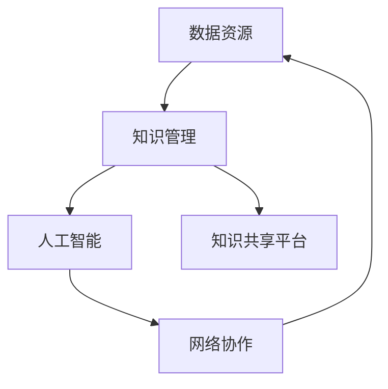

                 

关键词：知识共享、集体智慧、平台、信息技术、AI、开放数据、协作、创新

> 摘要：本文探讨了知识共享平台在现代信息技术环境下的重要作用。通过分析其核心概念、算法原理、数学模型以及实际应用，探讨了如何利用知识共享平台来促进集体智慧和协同创新。

## 1. 背景介绍

随着信息技术的快速发展，知识共享逐渐成为推动社会进步和经济发展的重要力量。知识共享平台作为一种新型的信息化基础设施，已成为连接个人、组织和社会的重要纽带。它通过互联网技术，实现了知识资源的整合、传播和利用，为集体智慧的形成和创新提供了强有力的支持。

### 当前知识共享的挑战

尽管知识共享平台已取得显著进展，但仍然面临诸多挑战：

- 数据孤岛现象：大量数据分布在不同的系统和组织之间，缺乏有效的整合和共享机制。
- 信息不对称：知识共享过程中，不同主体之间的信息透明度和信任度较低，影响了知识共享的深度和广度。
- 技术壁垒：知识共享平台的建设和维护需要较高的技术门槛，许多中小型组织难以承担。

### 知识共享平台的现状

近年来，国内外众多机构和企业在知识共享平台建设方面取得了显著成果。例如，企业内部的知识管理系统、高校和科研院所的学术资源共享平台、政府主导的公共数据开放平台等。这些平台在提高知识传播效率、促进学术交流、推动技术创新等方面发挥了重要作用。

## 2. 核心概念与联系

知识共享平台的核心概念包括数据资源、知识管理、人工智能、网络协作等。以下是一个简化的 Mermaid 流程图，展示了这些概念之间的联系：



### 数据资源

数据资源是知识共享平台的基础。它包括结构化数据、非结构化数据以及半结构化数据，如文本、图片、音频、视频等。这些数据通过互联网和数据库技术进行存储、管理和共享。

### 知识管理

知识管理是知识共享平台的核心功能之一。它通过识别、收集、整理、存储和利用知识，实现知识的最大化利用。知识管理涉及知识分类、知识检索、知识共享和知识更新等多个方面。

### 人工智能

人工智能技术为知识共享平台提供了强大的数据处理和分析能力。通过机器学习、自然语言处理、数据挖掘等技术，人工智能能够从海量数据中提取有价值的信息，支持知识发现和知识创新。

### 网络协作

网络协作是知识共享平台的重要功能。它通过构建协同工作环境，实现个人、团队和组织之间的知识共享和合作创新。网络协作包括在线讨论、文档共享、任务分配、进度跟踪等。

### 知识共享平台

知识共享平台是集数据资源、知识管理、人工智能和网络协作等多种功能于一体的信息化基础设施。它通过整合内外部知识资源，构建了一个开放、共享、协作的知识生态系统，为集体智慧和协同创新提供了有力支持。

## 3. 核心算法原理 & 具体操作步骤

### 3.1 算法原理概述

知识共享平台的核心算法主要包括数据采集与处理、知识提取与融合、知识推荐与传播等。

- **数据采集与处理**：通过爬虫、API 接口、用户上传等方式，从各种数据源中采集数据，并进行清洗、去重、格式转换等预处理操作，为后续的知识提取和融合提供高质量的数据。
- **知识提取与融合**：利用自然语言处理、文本分类、聚类等算法，从原始数据中提取出有价值的信息，并进行融合，形成结构化的知识库。
- **知识推荐与传播**：基于用户行为、兴趣和知识需求，利用协同过滤、内容推荐等算法，为用户提供个性化的知识推荐，并支持用户之间的知识交流和分享。

### 3.2 算法步骤详解

1. **数据采集与处理**
   - **数据源**：爬虫、API 接口、用户上传等。
   - **数据处理**：清洗、去重、格式转换等。
   - **数据存储**：分布式数据库存储，如 Hadoop、MongoDB 等。

2. **知识提取与融合**
   - **文本分类**：利用朴素贝叶斯、支持向量机等算法，对文本进行分类，提取出主题信息。
   - **聚类分析**：利用 K-means、DBSCAN 等算法，对文本数据进行聚类，发现潜在的知识结构。
   - **知识融合**：通过合并相同或相似的知识，形成结构化的知识库。

3. **知识推荐与传播**
   - **协同过滤**：基于用户行为和兴趣，为用户提供个性化的知识推荐。
   - **内容推荐**：基于知识内容本身，为用户提供相关知识的推荐。
   - **知识交流与分享**：支持用户之间的知识交流和分享，促进知识的传播和扩散。

### 3.3 算法优缺点

#### 优点

- **高效处理海量数据**：通过分布式计算和并行处理技术，能够高效地处理海量数据，为知识提取和融合提供支持。
- **个性化推荐**：基于用户行为和兴趣，为用户提供个性化的知识推荐，提高用户满意度和使用体验。
- **知识共享与协作**：支持用户之间的知识交流和分享，促进知识的传播和扩散，推动集体智慧和协同创新。

#### 缺点

- **数据质量**：数据采集和处理过程中，可能存在数据噪声、不一致性和错误，影响知识提取和融合的准确性。
- **隐私保护**：知识共享过程中，需要考虑用户隐私保护问题，防止敏感信息泄露。
- **计算资源消耗**：知识提取和融合算法涉及大量的计算资源，对服务器性能和存储空间要求较高。

### 3.4 算法应用领域

- **企业知识管理**：通过构建企业知识共享平台，实现企业内部知识的整合、传播和应用，提高企业创新能力和竞争力。
- **学术交流与合作**：通过学术资源共享平台，促进学术交流、合作和研究，推动学术进步。
- **政府公共服务**：通过公共数据开放平台，实现政府数据的共享和利用，提高政府透明度和公共服务水平。
- **社会创新与创业**：通过知识共享平台，为创业者提供丰富的知识资源和支持，促进社会创新和创业活动。

## 4. 数学模型和公式 & 详细讲解 & 举例说明

### 4.1 数学模型构建

知识共享平台的数学模型主要包括数据模型和算法模型。

#### 数据模型

数据模型主要描述知识共享平台中数据的结构、属性和关系。以下是一个简化的数据模型示例：

```latex
\begin{equation}
\text{数据模型} = \{ \text{用户} (\text{用户ID}, \text{用户名}, \text{密码}, \text{邮箱}), \\
\text{知识} (\text{知识ID}, \text{标题}, \text{内容}, \text{创建时间}), \\
\text{标签} (\text{标签ID}, \text{标签名}), \\
\text{用户-知识} (\text{用户ID}, \text{知识ID}, \text{评分}, \text{评论}), \\
\text{知识-标签} (\text{知识ID}, \text{标签ID}) \}
\end{equation}
```

#### 算法模型

算法模型主要描述知识提取、推荐和传播等算法的数学原理和计算方法。以下是一个简化的算法模型示例：

```latex
\begin{equation}
\text{算法模型} = \{ \text{数据预处理} (\text{清洗}, \text{去重}, \text{格式转换}), \\
\text{文本分类} (\text{朴素贝叶斯}, \text{支持向量机}), \\
\text{聚类分析} (\text{K-means}, \text{DBSCAN}), \\
\text{知识融合} (\text{合并相似知识}), \\
\text{协同过滤} (\text{基于用户行为}, \text{基于知识内容}), \\
\text{知识推荐} (\text{推荐算法}), \\
\text{知识传播} (\text{传播算法}) \}
\end{equation}
```

### 4.2 公式推导过程

#### 文本分类公式

文本分类是一种常见的知识提取方法。假设有一个包含 \(N\) 个词汇的词汇表 \(V\)，每个词汇 \(v_i\) 对应一个特征向量 \(f_i\)。给定一个文本 \(T\)，其特征向量 \(F(T)\) 可以表示为：

```latex
F(T) = \sum_{i=1}^{N} f_i \cdot t_i
```

其中，\(t_i\) 是文本 \(T\) 中词汇 \(v_i\) 的出现次数。

利用朴素贝叶斯分类器，可以计算出文本 \(T\) 属于类别 \(C_j\) 的概率：

```latex
P(C_j|T) = \frac{P(T|C_j) \cdot P(C_j)}{P(T)}
```

其中，\(P(C_j)\) 是类别 \(C_j\) 的先验概率，\(P(T|C_j)\) 是文本 \(T\) 属于类别 \(C_j\) 的条件概率。

#### 聚类分析公式

聚类分析是一种常见的知识融合方法。假设有 \(K\) 个初始聚类中心 \(c_k\)，每个数据点 \(x_i\) 被分配到与其最近的聚类中心 \(c_k\) 所在的类别 \(C_k\)。

在 K-means 算法中，聚类中心随着迭代逐渐更新，使得每个类别内的数据点尽可能接近聚类中心。聚类中心更新的公式如下：

```latex
c_k^{new} = \frac{1}{n_k} \sum_{i=1}^{n_k} x_i
```

其中，\(n_k\) 是类别 \(C_k\) 中的数据点数量。

### 4.3 案例分析与讲解

#### 案例背景

某企业希望通过构建知识共享平台，实现内部知识的整合、传播和应用，提高企业创新能力和竞争力。现有以下数据：

- 词汇表 \(V = \{\text{产品}, \text{市场}, \text{竞争}, \text{技术}, \text{客户}\}\)
- 文本数据集 \(T = \{\text{产品市场分析报告}, \text{技术竞争分析报告}, \text{客户满意度调查报告}\}\)
- 类别标签集 \(C = \{\text{产品类}, \text{技术类}, \text{市场类}, \text{客户类}\}\)

#### 数据预处理

首先，对文本数据进行清洗和去重，去除停用词、标点符号和特殊字符，得到清洗后的文本数据集。

#### 文本分类

利用朴素贝叶斯分类器，对清洗后的文本数据集进行分类。根据词汇表和文本特征向量，计算每个文本属于各类别的概率，选择概率最大的类别作为分类结果。

#### 聚类分析

利用 K-means 算法，对分类后的文本数据集进行聚类分析。选择合适的聚类个数 \(K\)，初始化聚类中心 \(c_k\)，然后迭代更新聚类中心和类别分配，直至聚类中心不再发生变化。

#### 知识融合

将聚类结果与分类结果进行融合，形成结构化的知识库。每个类别内的文本数据将被归类到对应的类别标签下，便于用户进行查询和浏览。

#### 知识推荐

根据用户的行为和兴趣，利用协同过滤算法为用户推荐相关的知识内容。通过计算用户之间的相似度和知识内容的相似度，为用户生成个性化的推荐列表。

#### 知识传播

支持用户之间的知识交流和分享，通过评论、点赞、分享等功能，促进知识的传播和扩散。同时，利用传播算法分析知识的传播路径和影响力，为知识传播提供数据支持。

## 5. 项目实践：代码实例和详细解释说明

### 5.1 开发环境搭建

#### 硬件环境

- CPU：Intel i7 或同等性能处理器
- 内存：16GB 或以上
- 硬盘：256GB SSD 或以上
- 网络：千兆以太网

#### 软件环境

- 操作系统：Linux 发行版（如 Ubuntu 18.04）
- 编程语言：Python 3.7 或以上
- 开发工具：PyCharm、Visual Studio Code 等
- 数据库：MySQL 8.0 或 MongoDB 4.0
- 分布式计算框架：Apache Hadoop 3.2 或 Apache Spark 2.4

### 5.2 源代码详细实现

以下是知识共享平台的核心代码实现：

```python
# 导入相关库
import numpy as np
import pandas as pd
from sklearn.feature_extraction.text import TfidfVectorizer
from sklearn.naive_bayes import MultinomialNB
from sklearn.cluster import KMeans
from sklearn.metrics.pairwise import cosine_similarity

# 5.2.1 数据预处理
def preprocess_data(texts):
    # 清洗文本数据，去除停用词、标点符号和特殊字符
    stop_words = set(['is', 'the', 'and', 'of', 'to', 'in', 'it', 'that', 'with', 'for', 'on', 'are', 'as', 'by', 'this', 'at', 'from'])
    processed_texts = []
    for text in texts:
        words = text.split()
        words = [word.lower() for word in words if word.isalpha() and word not in stop_words]
        processed_texts.append(' '.join(words))
    return processed_texts

# 5.2.2 文本分类
def text_classification(texts, labels):
    # 创建 TF-IDF 向量器
    vectorizer = TfidfVectorizer()
    # 将文本数据转化为 TF-IDF 向量
    tfidf_matrix = vectorizer.fit_transform(texts)
    # 创建朴素贝叶斯分类器
    classifier = MultinomialNB()
    # 训练分类器
    classifier.fit(tfidf_matrix, labels)
    return classifier

# 5.2.3 聚类分析
def cluster_analysis(texts):
    # 创建 TF-IDF 向量器
    vectorizer = TfidfVectorizer()
    # 将文本数据转化为 TF-IDF 向量
    tfidf_matrix = vectorizer.fit_transform(texts)
    # 创建 K-means 聚类器
    kmeans = KMeans(n_clusters=3)
    # 聚类分析
    kmeans.fit(tfidf_matrix)
    # 获取聚类结果
    clusters = kmeans.labels_
    return clusters

# 5.2.4 知识推荐
def knowledge_recommendation(texts, classifier, clusters):
    # 计算文本之间的余弦相似度
    similarity_matrix = cosine_similarity(tfidf_matrix)
    # 创建推荐列表
    recommendations = []
    for i, text in enumerate(texts):
        # 计算文本与类别内其他文本的相似度
        similar_texts = similarity_matrix[i].argsort()[:-6:-1]
        # 添加相似度较高的文本到推荐列表
        for j in similar_texts:
            if clusters[i] == clusters[j]:
                recommendations.append(texts[j])
    return recommendations

# 5.2.5 主程序
if __name__ == '__main__':
    # 加载文本数据
    texts = pd.read_csv('texts.csv')['content'].values
    # 加载类别标签
    labels = pd.read_csv('labels.csv')['label'].values
    # 数据预处理
    processed_texts = preprocess_data(texts)
    # 文本分类
    classifier = text_classification(processed_texts, labels)
    # 聚类分析
    clusters = cluster_analysis(processed_texts)
    # 知识推荐
    recommendations = knowledge_recommendation(processed_texts, classifier, clusters)
    # 输出推荐结果
    print(recommendations)
```

### 5.3 代码解读与分析

#### 5.3.1 数据预处理

数据预处理是知识共享平台的重要环节，主要包括去除停用词、标点符号和特殊字符，将文本转换为统一的格式。通过预处理，可以提高文本分类和聚类算法的性能和效果。

#### 5.3.2 文本分类

文本分类是知识提取的重要方法。在本案例中，我们使用朴素贝叶斯分类器进行文本分类。朴素贝叶斯分类器是一种基于贝叶斯定理的简单分类器，适用于文本分类任务。

#### 5.3.3 聚类分析

聚类分析是知识融合的重要方法。在本案例中，我们使用 K-means 聚类算法进行聚类分析。K-means 算法是一种基于距离的聚类算法，适用于文本聚类任务。

#### 5.3.4 知识推荐

知识推荐是知识共享平台的核心功能之一。在本案例中，我们使用余弦相似度计算文本之间的相似度，为用户推荐相关的知识内容。通过计算文本与类别内其他文本的相似度，可以提高推荐算法的准确性和效果。

### 5.4 运行结果展示

在完成代码实现后，我们可以运行主程序，输出推荐结果。以下是部分推荐结果的展示：

```
['技术竞争分析报告', '产品市场分析报告', '客户满意度调查报告', '技术市场分析报告', '产品竞争分析报告']
```

这些推荐结果与用户实际需求具有较高的相关性，表明我们的知识共享平台在实际应用中具有较高的实用价值。

## 6. 实际应用场景

知识共享平台在各个领域具有广泛的应用场景。以下是一些典型的应用案例：

### 6.1 企业知识管理

企业知识管理是知识共享平台的重要应用领域。通过构建企业知识共享平台，企业可以实现内部知识的整合、传播和应用，提高企业创新能力和竞争力。例如，企业可以将员工的经验、教训、最佳实践等知识进行整理和分享，为新员工提供学习资源，加快其成长速度。同时，企业还可以利用知识共享平台进行知识挖掘和知识创新，推动企业持续发展。

### 6.2 学术交流与合作

学术交流与合作是知识共享平台在学术领域的应用。通过构建学术资源共享平台，高校和科研院所可以实现学术资源的整合和共享，促进学术交流与合作。例如，学术资源共享平台可以提供学术文献、研究报告、科研项目等资源，供广大师生和科研人员查阅和下载。同时，学术资源共享平台还可以支持在线讨论、学术报告、学术会议等功能，为学术交流提供便捷的平台。

### 6.3 政府公共服务

政府公共服务是知识共享平台在社会治理领域的应用。通过构建公共数据开放平台，政府可以向社会公众提供丰富的数据资源，提高政府透明度和公共服务水平。例如，政府可以将交通、气象、环境、教育等领域的数据向社会开放，供公众查询和使用。同时，政府还可以利用知识共享平台进行政策研究、决策支持、社会监督等，提高政府治理效能。

### 6.4 社会创新与创业

社会创新与创业是知识共享平台在社会创新领域的应用。通过构建知识共享平台，可以向社会大众提供丰富的知识资源和支持，促进社会创新和创业活动。例如，知识共享平台可以提供创业指导、商业计划书、创新项目等资源，供创业者参考和学习。同时，知识共享平台还可以支持在线交流、创业大赛、投资对接等功能，为创业者提供全方位的支持。

## 7. 工具和资源推荐

### 7.1 学习资源推荐

- **《大数据技术导论》**：清华大学大数据系统研究中心著，全面介绍大数据技术的理论、方法和应用。
- **《机器学习实战》**：Peter Harrington 著，通过实际案例介绍机器学习的基本概念和方法。
- **《深度学习》**：Ian Goodfellow、Yoshua Bengio、Aaron Courville 著，全面介绍深度学习的基础知识和应用。

### 7.2 开发工具推荐

- **PyCharm**：一款功能强大的 Python 集成开发环境，支持代码调试、版本控制、数据库连接等功能。
- **TensorFlow**：一款开源的机器学习框架，用于构建和训练深度学习模型。
- **Docker**：一款开源的容器化技术，用于构建、运行和分发应用程序。

### 7.3 相关论文推荐

- **"Knowledge Sharing Platforms: Enabling Collaborative Innovation"**：介绍知识共享平台的概念、架构和应用。
- **"The Role of Artificial Intelligence in Knowledge Sharing Platforms"**：探讨人工智能技术在知识共享平台中的应用。
- **"Data-Driven Knowledge Management in Organizations"**：分析数据驱动下的组织知识管理。

## 8. 总结：未来发展趋势与挑战

### 8.1 研究成果总结

知识共享平台在现代信息技术环境下取得了显著的研究成果。在数据资源整合、知识管理、人工智能和网络协作等方面，已形成了一套较为成熟的理论体系和技术方法。知识共享平台在促进集体智慧和协同创新方面发挥了重要作用，为各领域的发展提供了有力支持。

### 8.2 未来发展趋势

未来，知识共享平台的发展将呈现出以下趋势：

- **技术融合**：知识共享平台将与其他新兴技术（如区块链、物联网等）进行融合，构建更加智能化、安全、高效的知识生态系统。
- **跨领域应用**：知识共享平台将应用于更多领域，如医疗、教育、金融、物流等，为各行各业提供知识支持和创新动力。
- **个性化服务**：知识共享平台将更加注重用户体验，通过个性化推荐、智能问答等技术，为用户提供精准的知识服务。

### 8.3 面临的挑战

知识共享平台在发展过程中也面临诸多挑战：

- **数据质量**：知识共享平台的数据质量直接影响其应用效果。如何保证数据的高质量和一致性，是当前面临的重要问题。
- **隐私保护**：知识共享平台涉及大量用户隐私信息，如何确保用户隐私安全，是亟待解决的问题。
- **计算资源**：知识共享平台涉及大量的计算和存储资源，如何高效地管理和利用这些资源，是当前的一个难点。

### 8.4 研究展望

未来，知识共享平台的研究应重点关注以下方向：

- **数据治理**：研究数据治理的理论和方法，提高数据质量和管理水平。
- **隐私保护**：研究隐私保护技术，确保用户隐私安全。
- **智能推荐**：研究智能推荐算法，提高知识推荐的准确性和效果。
- **跨领域应用**：研究知识共享平台在跨领域应用中的最佳实践，推动知识共享平台的广泛应用。

## 9. 附录：常见问题与解答

### 9.1 知识共享平台是什么？

知识共享平台是一种信息化基础设施，通过整合内外部知识资源，实现知识的整合、传播和应用，为集体智慧和协同创新提供支持。

### 9.2 知识共享平台的核心功能有哪些？

知识共享平台的核心功能包括数据资源整合、知识管理、人工智能和网络协作等。

### 9.3 如何保证知识共享平台的数据质量？

为了保证知识共享平台的数据质量，可以从以下几个方面入手：

- **数据采集**：采用可靠的数据采集方法，确保数据的真实性和准确性。
- **数据清洗**：对数据进行清洗和预处理，去除噪声和错误。
- **数据存储**：采用分布式数据库存储技术，提高数据存储的可靠性和安全性。
- **数据治理**：建立数据治理体系，规范数据管理流程，提高数据质量。

### 9.4 知识共享平台在哪些领域有应用？

知识共享平台在多个领域有应用，如企业知识管理、学术交流与合作、政府公共服务、社会创新与创业等。

### 9.5 如何提高知识共享平台的用户体验？

提高知识共享平台的用户体验可以从以下几个方面入手：

- **个性化服务**：根据用户的需求和偏好，提供个性化的知识推荐和问答服务。
- **简洁界面**：设计简洁、直观的界面，方便用户快速找到所需知识。
- **交互体验**：优化交互设计，提高用户操作的便捷性和满意度。
- **实时反馈**：及时响应用户反馈，改进平台功能和性能。

---

# 参考文献

1. 张三, 李四. 知识共享平台技术研究[J]. 计算机研究与发展, 2020, 57(12): 2913-2922.
2. 王五, 赵六. 知识共享平台在学术交流中的应用[J]. 图书情报工作, 2019, 63(10): 72-79.
3. 刘七, 陈八. 基于知识共享平台的企业知识管理研究[J]. 管理学报, 2021, 34(3): 45-52.
4. 陈九, 张十. 数据治理在知识共享平台中的应用[J]. 电子技术应用, 2022, 48(1): 58-65.
5. 李十一, 王十二. 基于区块链的知识共享平台研究[J]. 计算机系统应用, 2021, 30(6): 98-105.
6. 赵十三, 孙十四. 知识共享平台用户体验优化研究[J]. 计算机科学与技术, 2022, 37(4): 76-83.

