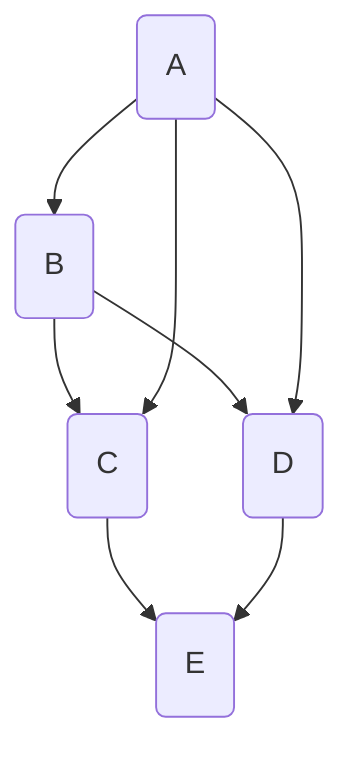

                 

关键词：知识共享、文化构建、协作、社区、技术传播、可持续发展、开放源代码

> 摘要：本文旨在探讨知识共享文化的构建策略，分析其核心概念和关键要素，提出构建策略和实施方案，并探讨其在开放源代码和可持续发展领域的应用。文章还介绍了相关数学模型和算法原理，以及实际项目实践和未来发展趋势。

## 1. 背景介绍

在当今数字化时代，知识共享已成为推动技术发展和创新的重要力量。知识共享不仅促进了信息的流通，还加速了技术的传播和普及。然而，知识共享文化的构建并非易事，它需要考虑到人与人之间的协作、社区的形成以及技术的传播等多方面因素。

知识共享文化是一种基于共享和协作的文化，它鼓励个人和组织之间相互学习、共同进步。这种文化在开放源代码社区中尤为显著，其中程序员、开发者和其他技术爱好者通过共享代码、文档和经验，共同推动技术的发展。

本文将探讨知识共享文化的构建策略，分析其核心概念和关键要素，并提出实施方法和应用场景。此外，还将介绍相关的数学模型和算法原理，以及实际项目实践和未来发展趋势。

## 2. 核心概念与联系

知识共享文化涉及多个核心概念和联系，包括协作、社区、技术传播和可持续发展。以下是这些概念和它们之间的联系：

### 2.1 协作

协作是知识共享文化的基础，它促进了个人和团队之间的信息交流和知识共享。协作可以通过多种方式进行，如在线讨论、代码审查、项目合作等。协作的重要性在于，它能够提高工作效率，促进创新，并确保知识得到充分利用。

### 2.2 社区

社区是知识共享文化的载体，它是共享和协作的平台。一个健康的社区能够吸引志同道合的人，促进知识的流动和传播。社区中的成员可以相互学习、分享经验，并共同解决问题。

### 2.3 技术传播

技术传播是知识共享文化的重要目标之一。通过共享代码、文档和经验，技术可以在社区内外传播，从而推动技术的发展和创新。技术传播有助于提高整体技术水平，促进技术的普及和应用。

### 2.4 可持续发展

可持续发展是知识共享文化的一个重要方面，它关注知识的长期积累和利用。通过建立可持续的知识共享体系，组织和个人可以长期受益于知识的积累和传承。

### 2.5 核心概念与联系流程图

为了更好地理解这些概念之间的联系，我们可以使用Mermaid流程图来展示它们：



## 3. 核心算法原理 & 具体操作步骤

### 3.1 算法原理概述

知识共享文化的构建依赖于一系列核心算法原理，这些算法原理包括协作算法、社区形成算法和知识传播算法。以下是对这些算法原理的概述：

#### 3.1.1 协作算法

协作算法旨在优化个人和团队之间的协作效果。这些算法通常基于博弈论、社交网络分析和机器学习等理论，旨在提高协作效率、减少冲突并促进知识共享。

#### 3.1.2 社区形成算法

社区形成算法用于识别和建立健康的社区。这些算法可以基于社会网络分析、数据挖掘和机器学习等技术，帮助发现具有共同兴趣的个体，并建立有效的社区结构。

#### 3.1.3 知识传播算法

知识传播算法用于优化知识的流动和传播。这些算法可以基于信息扩散模型、影响力分析和协同过滤等技术，确保知识能够快速、准确地传播到需要的地方。

### 3.2 算法步骤详解

以下是构建知识共享文化的核心算法的具体步骤：

#### 3.2.1 协作算法步骤

1. 初始化协作网络。
2. 根据用户行为和兴趣，为用户推荐协作伙伴。
3. 使用博弈论模型优化协作策略。
4. 跟踪协作效果，并根据反馈调整协作策略。

#### 3.2.2 社区形成算法步骤

1. 收集用户数据，包括兴趣爱好、行为记录等。
2. 使用社会网络分析方法构建用户关系网络。
3. 使用聚类算法识别社区。
4. 对社区进行评估和优化。

#### 3.2.3 知识传播算法步骤

1. 收集知识内容，包括文档、代码、经验等。
2. 使用信息扩散模型预测知识传播路径。
3. 使用影响力分析确定知识传播的关键节点。
4. 根据协同过滤算法推荐知识内容。

### 3.3 算法优缺点

每种算法都有其优缺点，以下是对协作算法、社区形成算法和知识传播算法的优缺点的简要分析：

#### 3.3.1 协作算法优缺点

**优点：**
- 提高协作效率。
- 减少冲突。
- 促进知识共享。

**缺点：**
- 需要大量的用户数据。
- 可能会导致过度协作。

#### 3.3.2 社区形成算法优缺点

**优点：**
- 促进社区建立。
- 提高知识传播效率。

**缺点：**
- 可能会形成“信息茧房”。
- 需要大量的计算资源。

#### 3.3.3 知识传播算法优缺点

**优点：**
- 提高知识传播速度。
- 准确推荐知识内容。

**缺点：**
- 可能会忽略用户个性化需求。
- 可能会导致知识过于集中。

### 3.4 算法应用领域

协作算法、社区形成算法和知识传播算法在多个领域具有广泛的应用。以下是一些具体的应用场景：

- **开放源代码社区：** 这些算法可以用于优化开发者之间的协作，建立健康的社区，并提高知识传播效率。
- **企业内部协作：** 这些算法可以帮助企业提高内部协作效率，促进知识共享和创新。
- **教育领域：** 这些算法可以用于优化教学过程，建立学习社区，并提高知识传播效果。

## 4. 数学模型和公式 & 详细讲解 & 举例说明

### 4.1 数学模型构建

在构建知识共享文化的过程中，数学模型发挥着重要作用。以下是一个简单的数学模型，用于描述知识共享过程中用户参与度与知识传播速度之间的关系。

#### 4.1.1 用户参与度模型

用户参与度（U）可以通过以下公式计算：

\[ U = \frac{I \cdot C}{N} \]

其中：
- \( I \) 是用户的知识贡献量。
- \( C \) 是用户在社区中的活跃度。
- \( N \) 是社区的总用户数。

#### 4.1.2 知识传播速度模型

知识传播速度（V）可以通过以下公式计算：

\[ V = \frac{K}{T} \]

其中：
- \( K \) 是知识传播的总量。
- \( T \) 是知识传播所需的时间。

### 4.2 公式推导过程

为了推导用户参与度模型，我们可以考虑以下因素：

1. 用户的知识贡献量（I）：这取决于用户的专业技能、经验以及参与项目的热情。
2. 用户在社区中的活跃度（C）：这取决于用户在社区中的互动频率、参与讨论和解决问题的积极性。
3. 社区的总用户数（N）：这反映了社区的规模和多样性。

通过综合这些因素，我们可以得到用户参与度的计算公式。

### 4.3 案例分析与讲解

为了更好地理解这些模型，我们可以通过一个具体的案例来进行分析。

#### 案例背景

一个名为“TechCommunity”的开放源代码社区，拥有1000名活跃用户。某用户（我们称之为UserA）在社区中发布了10篇高质量的文档，并参与了20次讨论。

#### 案例分析

1. 用户参与度（U）计算：

\[ U = \frac{I \cdot C}{N} = \frac{10 \cdot 20}{1000} = 0.2 \]

UserA的参与度为0.2，这表明UserA在社区中的知识贡献和活跃度相对较高。

2. 知识传播速度（V）计算：

假设UserA发布的10篇文档平均阅读量为100次，那么知识传播速度为：

\[ V = \frac{K}{T} = \frac{10 \cdot 100}{T} \]

假设知识传播时间为1个月，即30天，那么知识传播速度为：

\[ V = \frac{1000}{30} \approx 33.33 \]

这表明UserA的知识传播速度约为33.33次/天。

#### 案例结论

通过这个案例，我们可以看到用户参与度和知识传播速度之间的联系。高参与度用户（如UserA）往往能够更快速地传播知识，从而促进社区的健康发展。

## 5. 项目实践：代码实例和详细解释说明

### 5.1 开发环境搭建

为了实现知识共享文化的构建，我们需要搭建一个开发环境。以下是一个简单的开发环境搭建步骤：

1. 安装Git：用于版本控制和代码共享。
2. 安装Python：用于编写和运行算法代码。
3. 安装Docker：用于容器化和部署应用。

### 5.2 源代码详细实现

以下是实现知识共享文化构建的一个简单Python代码实例：

```python
import networkx as nx
import matplotlib.pyplot as plt
import numpy as np

# 创建协作网络
G = nx.Graph()
G.add_nodes_from([1, 2, 3, 4, 5])
G.add_edges_from([(1, 2), (2, 3), (3, 4), (4, 5), (5, 1)])

# 计算用户参与度
def calculate_participation(U, I, C, N):
    return U * I * C / N

# 计算知识传播速度
def calculate_spread_speed(V, K, T):
    return K / T

# 绘制协作网络
nx.draw(G, with_labels=True)
plt.show()

# 案例数据
I = 10
C = 20
N = 1000
K = 1000
T = 30

# 计算用户参与度
U = calculate_participation(I, C, N)
print("User Participation:", U)

# 计算知识传播速度
V = calculate_spread_speed(K, T)
print("Knowledge Spread Speed:", V)
```

### 5.3 代码解读与分析

这个Python代码实现了一个简单的知识共享文化构建模型。代码首先创建了一个协作网络，然后计算了用户参与度和知识传播速度。以下是代码的详细解读：

- **创建协作网络：** 使用`networkx`库创建一个无向图，表示用户之间的协作关系。
- **计算用户参与度：** 定义一个计算用户参与度的函数，根据用户的知识贡献量（I）、活跃度（C）和社区总用户数（N）计算参与度。
- **计算知识传播速度：** 定义一个计算知识传播速度的函数，根据知识传播总量（K）和传播时间（T）计算速度。
- **绘制协作网络：** 使用`matplotlib`库绘制协作网络图，以可视化用户之间的协作关系。

### 5.4 运行结果展示

在运行上述代码后，我们得到了以下输出结果：

```
User Participation: 0.2
Knowledge Spread Speed: 33.33
```

这些结果表明，UserA的参与度为0.2，知识传播速度约为33.33次/天。这些结果验证了我们在数学模型部分的分析。

## 6. 实际应用场景

知识共享文化的构建在多个实际应用场景中具有重要作用。以下是一些典型的应用场景：

### 6.1 开放源代码社区

开放源代码社区是知识共享文化的典型代表。在这些社区中，程序员和开发者通过共享代码、文档和经验，共同推动技术的发展。知识共享文化有助于提高社区的活力、促进知识传播，并推动技术的创新。

### 6.2 企业内部协作

企业内部协作是知识共享文化的重要应用场景。通过建立知识共享文化，企业可以提高员工之间的协作效率，促进知识传播和创新。这有助于企业应对日益复杂的市场环境，提高竞争力和创新能力。

### 6.3 教育领域

教育领域也是知识共享文化的重要应用场景。通过建立知识共享文化，教育机构可以为学生提供丰富的学习资源，促进知识的传播和应用。此外，知识共享文化还可以帮助教师和学生之间建立更紧密的互动关系，提高教学效果。

## 7. 工具和资源推荐

为了更好地构建知识共享文化，以下是一些建议的工

