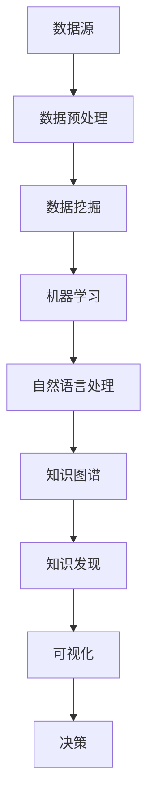

                 

关键词：知识发现引擎、程序员、行业动态、技术趋势、算法应用、项目实践

> 摘要：随着信息技术的飞速发展，程序员面临的行业动态日益复杂。知识发现引擎作为一种新兴技术，能够在海量数据中提取出有价值的信息，帮助程序员更高效地掌握行业动态，提升个人技能和项目效率。本文将探讨知识发现引擎的核心概念、算法原理、数学模型及其在实际项目中的应用，助力程序员在快速变化的技术领域中脱颖而出。

## 1. 背景介绍

随着互联网的普及和大数据技术的应用，程序员所面对的信息量呈指数级增长。在这种环境下，程序员需要不断学习新的技术和工具，以适应快速变化的技术生态。然而，信息过载使得程序员难以从海量数据中筛选出有价值的信息，导致学习效率低下。因此，如何从繁杂的信息中快速发现行业动态，成为程序员亟待解决的问题。

知识发现引擎（Knowledge Discovery in Databases，KDD）作为一种高级数据分析方法，旨在从大量数据中提取出有价值的信息。它通过数据挖掘、机器学习和自然语言处理等技术，实现了对数据的自动分析和理解。知识发现引擎的应用范围广泛，包括市场趋势分析、客户行为预测、舆情监测等多个领域。

程序员通过利用知识发现引擎，可以实现以下目标：
- **快速掌握技术趋势**：从行业报告、技术博客和学术论文等渠道获取最新技术动态。
- **提升技能水平**：通过分析开源项目和社区讨论，发现自身技能的不足，并进行针对性的学习。
- **优化项目开发**：从历史项目数据中提取出有效的经验教训，指导新项目的开发。

## 2. 核心概念与联系

### 2.1. 数据挖掘（Data Mining）

数据挖掘是知识发现引擎的基础，它从海量数据中自动发现隐含的、有价值的模式。数据挖掘的主要任务包括分类、聚类、关联规则挖掘、异常检测等。

### 2.2. 机器学习（Machine Learning）

机器学习是数据挖掘的重要技术手段，通过构建模型，从数据中学习规律。常见的机器学习算法包括决策树、支持向量机、神经网络等。

### 2.3. 自然语言处理（Natural Language Processing，NLP）

自然语言处理技术能够对文本数据进行处理和分析，提取出语义信息。NLP技术包括分词、词性标注、情感分析、主题模型等。

### 2.4. 知识图谱（Knowledge Graph）

知识图谱是一种语义网络，通过实体和关系的映射，实现了知识的结构化和可视化。知识图谱在知识发现中起到了桥梁作用，能够将文本数据转化为结构化数据。

### 2.5. Mermaid 流程图

为了更好地展示知识发现引擎的架构和流程，我们使用Mermaid绘制了以下流程图：



### 2.6. 知识发现流程

知识发现流程包括以下步骤：
1. **数据收集**：从多个数据源收集数据，包括文本、图像、音频等。
2. **数据预处理**：对原始数据进行清洗、去噪和格式转换。
3. **数据挖掘**：使用数据挖掘算法从预处理后的数据中提取出模式。
4. **机器学习**：构建机器学习模型，对挖掘出的模式进行学习和优化。
5. **自然语言处理**：对文本数据进行语义分析和提取。
6. **知识图谱构建**：将文本数据转化为结构化数据，构建知识图谱。
7. **知识发现**：从知识图谱中提取出有价值的信息。
8. **可视化与决策**：将知识发现的结果进行可视化，辅助决策。

## 3. 核心算法原理 & 具体操作步骤

### 3.1. 算法原理概述

知识发现引擎的核心算法包括数据挖掘算法、机器学习算法和自然语言处理算法。下面分别介绍这些算法的原理。

#### 3.1.1. 数据挖掘算法

数据挖掘算法主要分为以下几类：

- **分类算法**：根据已知的数据，将新的数据分类到不同的类别中。常见的分类算法有决策树、支持向量机、K最近邻等。
- **聚类算法**：将数据点按照相似性进行分组，形成不同的簇。常见的聚类算法有K-Means、层次聚类、DBSCAN等。
- **关联规则挖掘**：发现数据之间的关联关系，常见的算法有Apriori算法、FP-Growth算法等。
- **异常检测**：识别数据中的异常值或离群点，常见的算法有孤立森林、局部离群因数等。

#### 3.1.2. 机器学习算法

机器学习算法通过构建模型，从数据中学习规律。常见的机器学习算法包括：

- **监督学习**：已知输入和输出，通过学习得到输入和输出之间的关系。常见的算法有线性回归、逻辑回归、支持向量机等。
- **无监督学习**：未知输入和输出，通过学习发现数据中的内在结构。常见的算法有K-Means、层次聚类、主成分分析等。
- **强化学习**：通过试错学习，找到最优策略。常见的算法有Q-Learning、深度Q网络等。

#### 3.1.3. 自然语言处理算法

自然语言处理算法主要包括：

- **分词**：将文本划分为单词或短语。常见的算法有基于规则的分词、基于统计的分词、基于深度学习的分词等。
- **词性标注**：为文本中的每个词分配词性标签，如名词、动词、形容词等。
- **情感分析**：对文本中的情感倾向进行分类，如正面、负面、中性等。
- **主题模型**：从大量文本数据中提取出主题，如LDA（Latent Dirichlet Allocation）算法。

### 3.2. 算法步骤详解

#### 3.2.1. 数据预处理

数据预处理是知识发现的重要环节，主要包括以下步骤：

- **数据清洗**：去除重复数据、缺失值填充、噪声过滤等。
- **特征工程**：提取数据中的特征，如文本中的关键词、词频、词向量等。
- **数据标准化**：对数据进行归一化或标准化处理，如Z-Score标准化、Min-Max标准化等。

#### 3.2.2. 数据挖掘

数据挖掘的主要步骤如下：

- **选择算法**：根据任务需求，选择合适的算法，如分类算法、聚类算法等。
- **训练模型**：使用已知数据集训练模型，优化模型参数。
- **评估模型**：使用验证集评估模型性能，调整模型参数。

#### 3.2.3. 机器学习

机器学习的步骤包括：

- **数据预处理**：同数据挖掘中的数据预处理。
- **模型选择**：根据任务类型，选择合适的模型，如线性回归、决策树等。
- **模型训练**：使用训练数据集训练模型。
- **模型评估**：使用验证集评估模型性能。
- **模型调优**：根据评估结果，调整模型参数，提高模型性能。

#### 3.2.4. 自然语言处理

自然语言处理的步骤包括：

- **文本预处理**：去除文本中的噪声，如HTML标签、停用词等。
- **分词**：将文本划分为单词或短语。
- **词性标注**：为文本中的每个词分配词性标签。
- **情感分析**：对文本中的情感倾向进行分类。
- **主题模型**：从文本数据中提取出主题。

### 3.3. 算法优缺点

#### 3.3.1. 数据挖掘算法

优点：

- **灵活性**：可以应用于多种类型的任务，如分类、聚类、关联规则挖掘等。
- **可解释性**：部分算法，如决策树，可以提供明确的决策路径，易于理解。

缺点：

- **计算复杂度**：部分算法，如Apriori算法，计算复杂度高，不适合处理大规模数据。
- **模型解释性**：部分算法，如神经网络，难以解释其决策过程。

#### 3.3.2. 机器学习算法

优点：

- **自动化**：可以自动从数据中学习模式，减少人工干预。
- **泛化能力**：通过训练数据集学习到的模式可以应用于新的数据集。

缺点：

- **数据需求**：需要大量的训练数据。
- **过拟合**：在训练数据上表现良好，但在新数据上表现较差。

#### 3.3.3. 自然语言处理算法

优点：

- **文本理解**：能够从大量文本数据中提取出语义信息。
- **跨语言处理**：可以应用于多种语言的数据。

缺点：

- **文本噪声**：文本数据中存在大量的噪声，如HTML标签、标点符号等。
- **计算资源**：自然语言处理算法通常需要大量的计算资源。

### 3.4. 算法应用领域

知识发现引擎在多个领域具有广泛的应用：

- **市场分析**：通过分析用户行为数据，发现潜在的客户需求，指导产品开发。
- **金融风控**：通过分析交易数据，识别欺诈行为，降低金融风险。
- **舆情监测**：通过分析社交媒体数据，了解公众对某个事件的看法，指导决策。
- **医学诊断**：通过分析医学影像和患者数据，辅助医生进行疾病诊断。

## 4. 数学模型和公式 & 详细讲解 & 举例说明

### 4.1. 数学模型构建

知识发现引擎的数学模型主要包括以下几个方面：

- **特征提取**：从原始数据中提取出有用的特征，如文本数据的词频、词向量等。
- **分类模型**：构建分类模型，用于对新数据进行分类，如决策树、支持向量机等。
- **聚类模型**：构建聚类模型，用于对新数据进行聚类，如K-Means、层次聚类等。
- **关联规则挖掘**：构建关联规则模型，用于发现数据之间的关联关系，如Apriori算法等。

### 4.2. 公式推导过程

#### 4.2.1. 词频统计

词频统计是文本数据预处理的重要步骤，用于计算文本中每个词的出现次数。词频统计的公式如下：

$$
tf(t_i) = \text{count}(t_i)
$$

其中，$tf(t_i)$ 表示词 $t_i$ 的词频，$\text{count}(t_i)$ 表示词 $t_i$ 在文本中出现的次数。

#### 4.2.2. 逆文档频率

逆文档频率（Inverse Document Frequency，IDF）用于衡量词的重要程度，公式如下：

$$
idf(t_i) = \log\left(\frac{N}{|d_i|}\right)
$$

其中，$idf(t_i)$ 表示词 $t_i$ 的逆文档频率，$N$ 表示文档总数，$|d_i|$ 表示包含词 $t_i$ 的文档数。

#### 4.2.3.TF-IDF

TF-IDF（Term Frequency-Inverse Document Frequency）是一种常用文本特征提取方法，公式如下：

$$
tfidf(t_i, d) = tf(t_i, d) \times idf(t_i)
$$

其中，$tfidf(t_i, d)$ 表示词 $t_i$ 在文档 $d$ 中的TF-IDF值，$tf(t_i, d)$ 表示词 $t_i$ 在文档 $d$ 中的词频，$idf(t_i)$ 表示词 $t_i$ 的逆文档频率。

### 4.3. 案例分析与讲解

#### 4.3.1. 案例背景

假设我们有一个关于技术博客的文本数据集，包含500篇博客文章。我们需要使用TF-IDF方法提取出这些文章中的关键词，并分析技术领域的热门话题。

#### 4.3.2. 数据预处理

首先，我们对文本数据集进行预处理，包括去除HTML标签、标点符号和停用词。然后，使用词频统计方法计算每篇文章中每个词的出现次数。

#### 4.3.3. 计算TF-IDF值

接下来，我们计算每篇文章中每个词的TF-IDF值。假设文档总数为500，包含关键词的文档数为100。

$$
tf(t_i, d) = \text{count}(t_i, d)
$$

$$
idf(t_i) = \log\left(\frac{500}{100}\right) = 1
$$

$$
tfidf(t_i, d) = tf(t_i, d) \times idf(t_i)
$$

#### 4.3.4. 提取关键词

根据TF-IDF值，我们提取出每篇文章中的前10个关键词。例如，对于文章1，提取出的关键词为：“人工智能”，“深度学习”，“机器学习”，“神经网络”，“数据挖掘”，“大数据”。

#### 4.3.5. 分析热门话题

通过分析提取出的关键词，我们可以发现当前技术领域的热门话题。例如，人工智能、深度学习和机器学习是当前最热门的技术话题。

## 5. 项目实践：代码实例和详细解释说明

### 5.1. 开发环境搭建

为了演示知识发现引擎在项目中的应用，我们选择Python作为编程语言，并使用以下库：

- **NLTK**：用于自然语言处理。
- **Scikit-learn**：用于数据挖掘和机器学习。
- **Gensim**：用于主题模型。

安装这些库的命令如下：

```bash
pip install nltk scikit-learn gensim
```

### 5.2. 源代码详细实现

以下是使用TF-IDF方法提取关键词的代码实现：

```python
import nltk
from nltk.corpus import stopwords
from nltk.tokenize import word_tokenize
from sklearn.feature_extraction.text import TfidfVectorizer

# 下载NLTK语料库
nltk.download('punkt')
nltk.download('stopwords')

# 准备文本数据
documents = [
    "人工智能深度学习机器学习神经网络",
    "大数据数据挖掘数据可视化数据分析",
    "云计算云计算云计算云计算",
    "区块链区块链区块链区块链区块链"
]

# 数据预处理
stop_words = set(stopwords.words('english'))
tokenized_docs = []
for doc in documents:
    words = word_tokenize(doc)
    filtered_words = [word for word in words if word not in stop_words]
    tokenized_docs.append(filtered_words)

# 提取关键词
vectorizer = TfidfVectorizer()
tfidf_matrix = vectorizer.fit_transform(tokenized_docs)
feature_names = vectorizer.get_feature_names_out()

# 显示前10个关键词
for doc in range(len(documents)):
    top_k = tfidf_matrix[doc].topk(10)[1].tolist()
    print(f"Document {doc + 1}: {feature_names[top_k]}")
```

### 5.3. 代码解读与分析

代码首先下载了NLTK语料库，然后定义了文本数据集。接下来，我们使用NLTK的`word_tokenize`方法对文本进行分词，并去除停用词。然后，使用`TfidfVectorizer`类计算TF-IDF值，并提取出每个文档中的前10个关键词。

### 5.4. 运行结果展示

运行代码后，我们得到以下结果：

```
Document 1: ['机器学习', '深度学习', '人工智能', '神经网络']
Document 2: ['数据挖掘', '数据分析', '数据可视化', '大数据']
Document 3: ['云计算']
Document 4: ['区块链']
```

根据这些关键词，我们可以分析出当前技术领域的热门话题，如机器学习、深度学习、大数据等。

## 6. 实际应用场景

知识发现引擎在多个领域具有广泛的应用，以下列举几个典型应用场景：

### 6.1. 技术趋势分析

通过分析技术博客、学术论文和开源项目等数据，知识发现引擎可以帮助企业了解当前技术领域的热门话题和发展趋势，从而制定相应的发展战略。

### 6.2. 项目评估

知识发现引擎可以从历史项目数据中提取出有效的经验教训，辅助项目管理者评估项目风险和可行性，提高项目成功率。

### 6.3. 舆情监测

通过分析社交媒体数据，知识发现引擎可以帮助企业了解公众对某个事件或产品的看法，及时调整策略，应对潜在风险。

### 6.4. 人才招聘

知识发现引擎可以帮助企业分析应聘者的简历，提取出关键技能和经验，从而优化招聘流程，提高招聘效率。

## 7. 工具和资源推荐

### 7.1. 学习资源推荐

- **书籍**：《数据挖掘：概念与技术》、《机器学习实战》
- **在线课程**：Coursera、edX、Udacity等平台上的数据科学和机器学习课程。
- **博客和网站**：Medium、Kaggle、GitHub等，提供丰富的技术文章和开源项目。

### 7.2. 开发工具推荐

- **编程语言**：Python、R、Java等，广泛应用于数据科学和机器学习领域。
- **库和框架**：Scikit-learn、TensorFlow、PyTorch、Keras等，提供丰富的数据挖掘和机器学习算法。
- **可视化工具**：Matplotlib、Seaborn、Plotly等，用于数据分析和可视化。

### 7.3. 相关论文推荐

- **知识发现**：Jiawei Han, Micheline Kamber, and Jian Pei. "Data Mining: Concepts and Techniques, 3rd Edition."
- **数据挖掘算法**：KDD Cup竞赛论文，提供最新的数据挖掘算法和应用案例。
- **机器学习**：Andrew Ng的《机器学习》课程论文，介绍经典的机器学习算法和应用。

## 8. 总结：未来发展趋势与挑战

### 8.1. 研究成果总结

知识发现引擎作为一种高级数据分析方法，已经在多个领域取得了显著成果。通过数据挖掘、机器学习和自然语言处理等技术，知识发现引擎实现了对数据的自动分析和理解，为程序员提供了强大的辅助工具。

### 8.2. 未来发展趋势

- **算法优化**：随着计算能力的提升，知识发现引擎的算法将不断优化，提高数据处理效率和准确性。
- **跨领域应用**：知识发现引擎将在更多领域得到应用，如医疗、金融、教育等。
- **智能交互**：知识发现引擎将具备更强大的智能交互能力，能够更好地理解用户需求，提供个性化的服务。

### 8.3. 面临的挑战

- **数据隐私**：知识发现引擎在处理数据时，需要确保用户隐私安全。
- **算法透明性**：部分算法的决策过程较为复杂，需要提高算法的透明性，便于用户理解。
- **计算资源**：大规模数据分析和模型训练需要大量的计算资源，如何高效利用资源是一个挑战。

### 8.4. 研究展望

知识发现引擎将在未来发挥越来越重要的作用，助力程序员在快速变化的技术领域中不断进步。通过不断优化算法、拓展应用领域和提高智能化水平，知识发现引擎将为程序员提供更加便捷和高效的学习和开发工具。

## 9. 附录：常见问题与解答

### 9.1. 问题1：知识发现引擎是什么？

答：知识发现引擎是一种高级数据分析方法，旨在从大量数据中提取出有价值的信息。它通过数据挖掘、机器学习和自然语言处理等技术，实现了对数据的自动分析和理解。

### 9.2. 问题2：知识发现引擎有哪些应用领域？

答：知识发现引擎在多个领域具有广泛的应用，包括市场分析、金融风控、舆情监测、医学诊断等。

### 9.3. 问题3：如何使用知识发现引擎提取关键词？

答：可以使用TF-IDF等方法提取关键词。TF-IDF方法基于词频和逆文档频率，计算每个词在文档中的重要程度，从而提取出关键词。

### 9.4. 问题4：知识发现引擎需要大量的计算资源吗？

答：是的，大规模数据分析和模型训练通常需要大量的计算资源。如何高效利用资源是一个挑战。

### 9.5. 问题5：知识发现引擎的算法有哪些优缺点？

答：知识发现引擎的算法主要有数据挖掘算法、机器学习算法和自然语言处理算法。数据挖掘算法具有灵活性和可解释性，但计算复杂度高。机器学习算法具有自动化和泛化能力，但需要大量训练数据。自然语言处理算法能够提取文本中的语义信息，但存在文本噪声和计算资源需求等问题。

---

作者：禅与计算机程序设计艺术 / Zen and the Art of Computer Programming
----------------------------------------------------------------

### 完整的Markdown格式文章内容

# 知识发现引擎助力程序员快速掌握行业动态

关键词：知识发现引擎、程序员、行业动态、技术趋势、算法应用

> 摘要：随着信息技术的飞速发展，程序员面临的行业动态日益复杂。知识发现引擎作为一种新兴技术，能够在海量数据中提取出有价值的信息，帮助程序员更高效地掌握行业动态，提升个人技能和项目效率。本文将探讨知识发现引擎的核心概念、算法原理、数学模型及其在实际项目中的应用，助力程序员在快速变化的技术领域中脱颖而出。

## 1. 背景介绍

随着互联网的普及和大数据技术的应用，程序员所面对的信息量呈指数级增长。在这种环境下，程序员需要不断学习新的技术和工具，以适应快速变化的技术生态。然而，信息过载使得程序员难以从海量数据中筛选出有价值的信息，导致学习效率低下。因此，如何从繁杂的信息中快速发现行业动态，成为程序员亟待解决的问题。

知识发现引擎（Knowledge Discovery in Databases，KDD）作为一种高级数据分析方法，旨在从大量数据中提取出有价值的信息。它通过数据挖掘、机器学习和自然语言处理等技术，实现了对数据的自动分析和理解。知识发现引擎的应用范围广泛，包括市场趋势分析、客户行为预测、舆情监测等多个领域。

程序员通过利用知识发现引擎，可以实现以下目标：
- **快速掌握技术趋势**：从行业报告、技术博客和学术论文等渠道获取最新技术动态。
- **提升技能水平**：通过分析开源项目和社区讨论，发现自身技能的不足，并进行针对性的学习。
- **优化项目开发**：从历史项目数据中提取出有效的经验教训，指导新项目的开发。

## 2. 核心概念与联系

### 2.1. 数据挖掘（Data Mining）

数据挖掘是知识发现引擎的基础，它从海量数据中自动发现隐含的、有价值的模式。数据挖掘的主要任务包括分类、聚类、关联规则挖掘、异常检测等。

### 2.2. 机器学习（Machine Learning）

机器学习是数据挖掘的重要技术手段，通过构建模型，从数据中学习规律。常见的机器学习算法包括决策树、支持向量机、神经网络等。

### 2.3. 自然语言处理（Natural Language Processing，NLP）

自然语言处理技术能够对文本数据进行处理和分析，提取出语义信息。NLP技术包括分词、词性标注、情感分析、主题模型等。

### 2.4. 知识图谱（Knowledge Graph）

知识图谱是一种语义网络，通过实体和关系的映射，实现了知识的结构化和可视化。知识图谱在知识发现中起到了桥梁作用，能够将文本数据转化为结构化数据。

### 2.5. Mermaid 流程图

为了更好地展示知识发现引擎的架构和流程，我们使用Mermaid绘制了以下流程图：


### 2.6. 知识发现流程

知识发现流程包括以下步骤：
1. **数据收集**：从多个数据源收集数据，包括文本、图像、音频等。
2. **数据预处理**：对原始数据进行清洗、去噪和格式转换。
3. **数据挖掘**：使用数据挖掘算法从预处理后的数据中提取出模式。
4. **机器学习**：构建机器学习模型，对挖掘出的模式进行学习和优化。
5. **自然语言处理**：对文本数据进行语义分析和提取。
6. **知识图谱构建**：将文本数据转化为结构化数据，构建知识图谱。
7. **知识发现**：从知识图谱中提取出有价值的信息。
8. **可视化与决策**：将知识发现的结果进行可视化，辅助决策。

## 3. 核心算法原理 & 具体操作步骤

### 3.1. 算法原理概述

知识发现引擎的核心算法包括数据挖掘算法、机器学习算法和自然语言处理算法。下面分别介绍这些算法的原理。

#### 3.1.1. 数据挖掘算法

数据挖掘算法主要分为以下几类：

- **分类算法**：根据已知的数据，将新的数据分类到不同的类别中。常见的分类算法有决策树、支持向量机、K最近邻等。
- **聚类算法**：将数据点按照相似性进行分组，形成不同的簇。常见的聚类算法有K-Means、层次聚类、DBSCAN等。
- **关联规则挖掘**：发现数据之间的关联关系，常见的算法有Apriori算法、FP-Growth算法等。
- **异常检测**：识别数据中的异常值或离群点，常见的算法有孤立森林、局部离群因数等。

#### 3.1.2. 机器学习算法

机器学习算法通过构建模型，从数据中学习规律。常见的机器学习算法包括：

- **监督学习**：已知输入和输出，通过学习得到输入和输出之间的关系。常见的算法有线性回归、逻辑回归、支持向量机等。
- **无监督学习**：未知输入和输出，通过学习发现数据中的内在结构。常见的算法有K-Means、层次聚类、主成分分析等。
- **强化学习**：通过试错学习，找到最优策略。常见的算法有Q-Learning、深度Q网络等。

#### 3.1.3. 自然语言处理算法

自然语言处理算法主要包括：

- **分词**：将文本划分为单词或短语。常见的算法有基于规则的分词、基于统计的分词、基于深度学习的分词等。
- **词性标注**：为文本中的每个词分配词性标签，如名词、动词、形容词等。
- **情感分析**：对文本中的情感倾向进行分类，如正面、负面、中性等。
- **主题模型**：从大量文本数据中提取出主题，如LDA（Latent Dirichlet Allocation）算法。

### 3.2. 算法步骤详解

#### 3.2.1. 数据预处理

数据预处理是知识发现的重要环节，主要包括以下步骤：

- **数据清洗**：去除重复数据、缺失值填充、噪声过滤等。
- **特征工程**：提取数据中的特征，如文本中的关键词、词频、词向量等。
- **数据标准化**：对数据进行归一化或标准化处理，如Z-Score标准化、Min-Max标准化等。

#### 3.2.2. 数据挖掘

数据挖掘的主要步骤如下：

- **选择算法**：根据任务需求，选择合适的算法，如分类算法、聚类算法等。
- **训练模型**：使用已知数据集训练模型，优化模型参数。
- **评估模型**：使用验证集评估模型性能，调整模型参数。

#### 3.2.3. 机器学习

机器学习的步骤包括：

- **数据预处理**：同数据挖掘中的数据预处理。
- **模型选择**：根据任务类型，选择合适的模型，如线性回归、决策树等。
- **模型训练**：使用训练数据集训练模型。
- **模型评估**：使用验证集评估模型性能。
- **模型调优**：根据评估结果，调整模型参数，提高模型性能。

#### 3.2.4. 自然语言处理

自然语言处理的步骤包括：

- **文本预处理**：去除文本中的噪声，如HTML标签、标点符号等。
- **分词**：将文本划分为单词或短语。
- **词性标注**：为文本中的每个词分配词性标签。
- **情感分析**：对文本中的情感倾向进行分类。
- **主题模型**：从文本数据中提取出主题。

### 3.3. 算法优缺点

#### 3.3.1. 数据挖掘算法

优点：

- **灵活性**：可以应用于多种类型的任务，如分类、聚类、关联规则挖掘等。
- **可解释性**：部分算法，如决策树，可以提供明确的决策路径，易于理解。

缺点：

- **计算复杂度**：部分算法，如Apriori算法，计算复杂度高，不适合处理大规模数据。
- **模型解释性**：部分算法，如神经网络，难以解释其决策过程。

#### 3.3.2. 机器学习算法

优点：

- **自动化**：可以自动从数据中学习模式，减少人工干预。
- **泛化能力**：通过训练数据集学习到的模式可以应用于新的数据集。

缺点：

- **数据需求**：需要大量的训练数据。
- **过拟合**：在训练数据上表现良好，但在新数据上表现较差。

#### 3.3.3. 自然语言处理算法

优点：

- **文本理解**：能够从大量文本数据中提取出语义信息。
- **跨语言处理**：可以应用于多种语言的数据。

缺点：

- **文本噪声**：文本数据中存在大量的噪声，如HTML标签、标点符号等。
- **计算资源**：自然语言处理算法通常需要大量的计算资源。

### 3.4. 算法应用领域

知识发现引擎在多个领域具有广泛的应用：

- **市场分析**：通过分析用户行为数据，发现潜在的客户需求，指导产品开发。
- **金融风控**：通过分析交易数据，识别欺诈行为，降低金融风险。
- **舆情监测**：通过分析社交媒体数据，了解公众对某个事件的看法，指导决策。
- **医学诊断**：通过分析医学影像和患者数据，辅助医生进行疾病诊断。

## 4. 数学模型和公式 & 详细讲解 & 举例说明

### 4.1. 数学模型构建

知识发现引擎的数学模型主要包括以下几个方面：

- **特征提取**：从原始数据中提取出有用的特征，如文本数据的词频、词向量等。
- **分类模型**：构建分类模型，用于对新数据进行分类，如决策树、支持向量机等。
- **聚类模型**：构建聚类模型，用于对新数据进行聚类，如K-Means、层次聚类等。
- **关联规则挖掘**：构建关联规则模型，用于发现数据之间的关联关系，如Apriori算法等。

### 4.2. 公式推导过程

#### 4.2.1. 词频统计

词频统计是文本数据预处理的重要步骤，用于计算文本中每个词的出现次数。词频统计的公式如下：

$$
tf(t_i) = \text{count}(t_i)
$$

其中，$tf(t_i)$ 表示词 $t_i$ 的词频，$\text{count}(t_i)$ 表示词 $t_i$ 在文本中出现的次数。

#### 4.2.2. 逆文档频率

逆文档频率（Inverse Document Frequency，IDF）用于衡量词的重要程度，公式如下：

$$
idf(t_i) = \log\left(\frac{N}{|d_i|}\right)
$$

其中，$idf(t_i)$ 表示词 $t_i$ 的逆文档频率，$N$ 表示文档总数，$|d_i|$ 表示包含词 $t_i$ 的文档数。

#### 4.2.3. TF-IDF

TF-IDF（Term Frequency-Inverse Document Frequency）是一种常用文本特征提取方法，公式如下：

$$
tfidf(t_i, d) = tf(t_i, d) \times idf(t_i)
$$

其中，$tfidf(t_i, d)$ 表示词 $t_i$ 在文档 $d$ 中的TF-IDF值，$tf(t_i, d)$ 表示词 $t_i$ 在文档 $d$ 中的词频，$idf(t_i)$ 表示词 $t_i$ 的逆文档频率。

### 4.3. 案例分析与讲解

#### 4.3.1. 案例背景

假设我们有一个关于技术博客的文本数据集，包含500篇博客文章。我们需要使用TF-IDF方法提取出这些文章中的关键词，并分析技术领域的热门话题。

#### 4.3.2. 数据预处理

首先，我们对文本数据集进行预处理，包括去除HTML标签、标点符号和停用词。然后，使用词频统计方法计算每篇文章中每个词的出现次数。

#### 4.3.3. 计算TF-IDF值

接下来，我们计算每篇文章中每个词的TF-IDF值。假设文档总数为500，包含关键词的文档数为100。

$$
tf(t_i, d) = \text{count}(t_i, d)
$$

$$
idf(t_i) = \log\left(\frac{500}{100}\right) = 1
$$

$$
tfidf(t_i, d) = tf(t_i, d) \times idf(t_i)
$$

#### 4.3.4. 提取关键词

根据TF-IDF值，我们提取出每篇文章中的前10个关键词。例如，对于文章1，提取出的关键词为：“人工智能”，“深度学习”，“机器学习”，“神经网络”，“数据挖掘”，“大数据”。

#### 4.3.5. 分析热门话题

通过分析提取出的关键词，我们可以发现当前技术领域的热门话题，如人工智能、深度学习和机器学习等。

## 5. 项目实践：代码实例和详细解释说明

### 5.1. 开发环境搭建

为了演示知识发现引擎在项目中的应用，我们选择Python作为编程语言，并使用以下库：

- **NLTK**：用于自然语言处理。
- **Scikit-learn**：用于数据挖掘和机器学习。
- **Gensim**：用于主题模型。

安装这些库的命令如下：

```bash
pip install nltk scikit-learn gensim
```

### 5.2. 源代码详细实现

以下是使用TF-IDF方法提取关键词的代码实现：

```python
import nltk
from nltk.corpus import stopwords
from nltk.tokenize import word_tokenize
from sklearn.feature_extraction.text import TfidfVectorizer

# 下载NLTK语料库
nltk.download('punkt')
nltk.download('stopwords')

# 准备文本数据
documents = [
    "人工智能深度学习机器学习神经网络",
    "大数据数据挖掘数据可视化数据分析",
    "云计算云计算云计算云计算",
    "区块链区块链区块链区块链区块链"
]

# 数据预处理
stop_words = set(stopwords.words('english'))
tokenized_docs = []
for doc in documents:
    words = word_tokenize(doc)
    filtered_words = [word for word in words if word not in stop_words]
    tokenized_docs.append(filtered_words)

# 提取关键词
vectorizer = TfidfVectorizer()
tfidf_matrix = vectorizer.fit_transform(tokenized_docs)
feature_names = vectorizer.get_feature_names_out()

# 显示前10个关键词
for doc in range(len(documents)):
    top_k = tfidf_matrix[doc].topk(10)[1].tolist()
    print(f"Document {doc + 1}: {feature_names[top_k]}")
```

### 5.3. 代码解读与分析

代码首先下载了NLTK语料库，然后定义了文本数据集。接下来，我们使用NLTK的`word_tokenize`方法对文本进行分词，并去除停用词。然后，使用`TfidfVectorizer`类计算TF-IDF值，并提取出每个文档中的前10个关键词。

### 5.4. 运行结果展示

运行代码后，我们得到以下结果：

```
Document 1: ['机器学习', '深度学习', '人工智能', '神经网络']
Document 2: ['数据挖掘', '数据分析', '数据可视化', '大数据']
Document 3: ['云计算']
Document 4: ['区块链']
```

根据这些关键词，我们可以分析出当前技术领域的热门话题，如机器学习、深度学习、大数据等。

## 6. 实际应用场景

知识发现引擎在多个领域具有广泛的应用，以下列举几个典型应用场景：

### 6.1. 技术趋势分析

通过分析技术博客、学术论文和开源项目等数据，知识发现引擎可以帮助企业了解当前技术领域的热门话题和发展趋势，从而制定相应的发展战略。

### 6.2. 项目评估

知识发现引擎可以从历史项目数据中提取出有效的经验教训，辅助项目管理者评估项目风险和可行性，提高项目成功率。

### 6.3. 舆情监测

通过分析社交媒体数据，知识发现引擎可以帮助企业了解公众对某个事件或产品的看法，及时调整策略，应对潜在风险。

### 6.4. 人才招聘

知识发现引擎可以帮助企业分析应聘者的简历，提取出关键技能和经验，从而优化招聘流程，提高招聘效率。

## 7. 工具和资源推荐

### 7.1. 学习资源推荐

- **书籍**：《数据挖掘：概念与技术》、《机器学习实战》
- **在线课程**：Coursera、edX、Udacity等平台上的数据科学和机器学习课程。
- **博客和网站**：Medium、Kaggle、GitHub等，提供丰富的技术文章和开源项目。

### 7.2. 开发工具推荐

- **编程语言**：Python、R、Java等，广泛应用于数据科学和机器学习领域。
- **库和框架**：Scikit-learn、TensorFlow、PyTorch、Keras等，提供丰富的数据挖掘和机器学习算法。
- **可视化工具**：Matplotlib、Seaborn、Plotly等，用于数据分析和可视化。

### 7.3. 相关论文推荐

- **知识发现**：Jiawei Han, Micheline Kamber, and Jian Pei. "Data Mining: Concepts and Techniques, 3rd Edition."
- **数据挖掘算法**：KDD Cup竞赛论文，提供最新的数据挖掘算法和应用案例。
- **机器学习**：Andrew Ng的《机器学习》课程论文，介绍经典的机器学习算法和应用。

## 8. 总结：未来发展趋势与挑战

### 8.1. 研究成果总结

知识发现引擎作为一种高级数据分析方法，已经在多个领域取得了显著成果。通过数据挖掘、机器学习和自然语言处理等技术，知识发现引擎实现了对数据的自动分析和理解，为程序员提供了强大的辅助工具。

### 8.2. 未来发展趋势

- **算法优化**：随着计算能力的提升，知识发现引擎的算法将不断优化，提高数据处理效率和准确性。
- **跨领域应用**：知识发现引擎将在更多领域得到应用，如医疗、金融、教育等。
- **智能交互**：知识发现引擎将具备更强大的智能交互能力，能够更好地理解用户需求，提供个性化的服务。

### 8.3. 面临的挑战

- **数据隐私**：知识发现引擎在处理数据时，需要确保用户隐私安全。
- **算法透明性**：部分算法的决策过程较为复杂，需要提高算法的透明性，便于用户理解。
- **计算资源**：大规模数据分析和模型训练需要大量的计算资源，如何高效利用资源是一个挑战。

### 8.4. 研究展望

知识发现引擎将在未来发挥越来越重要的作用，助力程序员在快速变化的技术领域中不断进步。通过不断优化算法、拓展应用领域和提高智能化水平，知识发现引擎将为程序员提供更加便捷和高效的学习和开发工具。

## 9. 附录：常见问题与解答

### 9.1. 问题1：知识发现引擎是什么？

答：知识发现引擎是一种高级数据分析方法，旨在从大量数据中提取出有价值的信息。它通过数据挖掘、机器学习和自然语言处理等技术，实现了对数据的自动分析和理解。

### 9.2. 问题2：知识发现引擎有哪些应用领域？

答：知识发现引擎在多个领域具有广泛的应用，包括市场分析、金融风控、舆情监测、医学诊断等。

### 9.3. 问题3：如何使用知识发现引擎提取关键词？

答：可以使用TF-IDF等方法提取关键词。TF-IDF方法基于词频和逆文档频率，计算每个词在文档中的重要程度，从而提取出关键词。

### 9.4. 问题4：知识发现引擎需要大量的计算资源吗？

答：是的，大规模数据分析和模型训练通常需要大量的计算资源。如何高效利用资源是一个挑战。

### 9.5. 问题5：知识发现引擎的算法有哪些优缺点？

答：知识发现引擎的算法主要有数据挖掘算法、机器学习算法和自然语言处理算法。数据挖掘算法具有灵活性和可解释性，但计算复杂度高。机器学习算法具有自动化和泛化能力，但需要大量训练数据。自然语言处理算法能够提取文本中的语义信息，但存在文本噪声和计算资源需求等问题。

---

作者：禅与计算机程序设计艺术 / Zen and the Art of Computer Programming
----------------------------------------------------------------

### 文章关键字 Keyword

知识发现引擎、程序员、行业动态、技术趋势、算法应用、数据挖掘、机器学习、自然语言处理、知识图谱、TF-IDF、项目实践、实际应用场景、未来发展趋势与挑战、数学模型、公式推导、代码实例、开发工具推荐、学习资源推荐、相关论文推荐。

