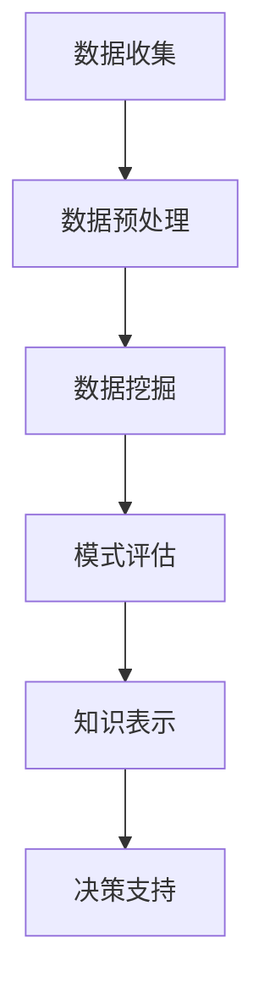

                 

关键词：知识发现引擎、太空探索、人工智能、数据分析、算法、数学模型、实践应用、未来展望。

> 摘要：本文将探讨知识发现引擎在太空探索中的应用，通过介绍其核心概念、算法原理、数学模型以及具体实践案例，展示知识发现引擎如何助力太空探索的深入与发展。

## 1. 背景介绍

随着人类太空探索的不断深入，对大量数据的收集和分析成为了太空科学研究的重要一环。这些数据包括太空探测器传回的图像、光谱数据、温度记录等，其规模和复杂性不断增加。如何有效地从这些数据中提取有价值的信息，成为了一个亟待解决的问题。

知识发现引擎（Knowledge Discovery Engine，简称KDE）是一种专门用于从大量数据中自动发现知识、模式和规律的智能系统。它结合了人工智能、机器学习和数据分析等前沿技术，能够在没有人工干预的情况下，自动分析数据、提取模式、生成报告，并为进一步的数据分析和决策提供支持。

太空探索领域对知识发现引擎的需求尤为突出。一方面，太空探测任务通常需要处理海量的数据，这些数据包含了丰富的信息，但也存在噪声和冗余。知识发现引擎可以帮助科学家们从这些复杂的数据中迅速找到关键信息和规律，从而提高数据处理的效率。另一方面，知识发现引擎还能够帮助科学家们发现之前未知的现象和规律，为太空探索提供新的研究方向。

本文将详细介绍知识发现引擎在太空探索中的应用，包括其核心概念、算法原理、数学模型以及具体实践案例。希望通过本文的介绍，读者能够对知识发现引擎在太空探索中的潜力有一个清晰的认识。

## 2. 核心概念与联系

### 2.1 知识发现引擎的定义

知识发现引擎是一种基于人工智能和机器学习技术的系统，它能够从大量数据中自动提取知识、模式和规律。知识发现引擎的核心目标是发现数据中的隐藏信息，帮助用户更好地理解数据，从而支持决策和预测。

### 2.2 知识发现引擎的工作原理

知识发现引擎的工作原理主要包括以下几个步骤：

1. 数据预处理：知识发现引擎首先对原始数据进行清洗、归一化和转换，使其符合分析的要求。

2. 数据挖掘：知识发现引擎使用各种机器学习和数据分析算法对预处理后的数据进行挖掘，以发现数据中的模式和规律。

3. 模式评估：知识发现引擎对挖掘出的模式进行评估，选择最有价值、最可靠的模式。

4. 知识表示：知识发现引擎将评估后的模式转化为易于理解的知识表示，如图表、表格或文本报告。

5. 决策支持：知识发现引擎将提取出的知识用于支持用户的决策和预测。

### 2.3 知识发现引擎在太空探索中的应用

知识发现引擎在太空探索中的应用可以分为以下几个领域：

1. 数据分析：知识发现引擎可以帮助科学家们从海量的太空探测数据中提取有价值的信息，如天体物理现象、行星特征等。

2. 预测分析：知识发现引擎可以预测太空探测任务中可能出现的问题和挑战，为任务规划和决策提供支持。

3. 决策支持：知识发现引擎可以为太空探测任务的决策提供数据驱动的建议，如探测器的路径规划、观测策略等。

### 2.4 Mermaid 流程图

以下是一个简单的 Mermaid 流程图，展示了知识发现引擎在太空探索中的应用流程：



### 2.5 知识发现引擎的优势

知识发现引擎在太空探索中具有以下几个优势：

1. 高效性：知识发现引擎能够自动处理大量数据，大大提高了数据处理的效率。

2. 可扩展性：知识发现引擎可以轻松扩展到不同的数据集和应用场景，适应不同的太空探测任务。

3. 智能性：知识发现引擎结合了人工智能和机器学习技术，能够从数据中自动提取知识，降低了对人工干预的依赖。

4. 决策支持：知识发现引擎可以为太空探测任务提供数据驱动的决策支持，提高任务的成功率。

## 3. 核心算法原理 & 具体操作步骤

### 3.1 算法原理概述

知识发现引擎的核心算法通常包括以下几种：

1. 聚类算法：用于将相似的数据分组，发现数据中的隐含结构。
2. 关联规则挖掘：用于发现数据中的关联关系，如不同变量之间的关联性。
3. 时序分析：用于分析数据中的时间序列模式，预测未来的发展趋势。
4. 异常检测：用于发现数据中的异常点，检测潜在的异常现象。

这些算法在太空探索中的应用，可以分别用于分析天体物理现象、行星特征、探测器运行状态等。

### 3.2 算法步骤详解

1. **数据预处理**

   知识发现引擎首先对原始数据进行预处理，包括数据清洗、归一化和特征提取。数据清洗的目的是去除数据中的噪声和异常值；归一化的目的是使不同特征具有相同的尺度，便于后续分析；特征提取的目的是将原始数据转换为适合算法处理的形式。

2. **聚类分析**

   聚类算法将数据分为若干个类别，使得同类别内的数据相似度较高，不同类别间的数据相似度较低。常用的聚类算法包括 K-Means、DBSCAN 等。在太空探索中，聚类分析可以用于分析天体分布、行星特征等。

3. **关联规则挖掘**

   关联规则挖掘算法用于发现数据之间的关联关系。常用的算法包括 Apriori 算法、FP-Growth 算法等。在太空探索中，关联规则挖掘可以用于分析探测器数据、发现天体之间的相互作用等。

4. **时序分析**

   时序分析算法用于分析数据中的时间序列模式，预测未来的发展趋势。常用的算法包括 ARIMA、LSTM 等。在太空探索中，时序分析可以用于预测探测器的运行状态、分析天体物理现象等。

5. **异常检测**

   异常检测算法用于发现数据中的异常点，检测潜在的异常现象。常用的算法包括孤立森林、本地异常因子等。在太空探索中，异常检测可以用于检测探测器的故障、分析天体异常等。

### 3.3 算法优缺点

**聚类算法**

- 优点：能够自动发现数据中的隐含结构，无需人工干预。
- 缺点：对初始参数敏感，聚类结果可能受到噪声和异常值的影响。

**关联规则挖掘**

- 优点：能够发现数据之间的关联关系，有助于理解数据的内在联系。
- 缺点：计算复杂度较高，对于大规模数据集可能需要较长的时间。

**时序分析**

- 优点：能够预测未来的发展趋势，为决策提供支持。
- 缺点：对于非线性时间序列模型可能不够有效。

**异常检测**

- 优点：能够发现数据中的异常点，有助于识别潜在的故障和异常现象。
- 缺点：对于噪声和异常值的敏感度可能较高，误报率可能较高。

### 3.4 算法应用领域

知识发现引擎在太空探索中的应用领域非常广泛，主要包括：

1. 天体物理现象分析：通过聚类分析和时序分析，发现天体之间的相互作用和变化规律。
2. 行星特征提取：通过关联规则挖掘，发现行星表面特征和地质结构的关联。
3. 探测器运行状态监测：通过异常检测，及时发现探测器的故障和异常现象。
4. 太空任务规划：通过数据挖掘和预测分析，为太空探测任务的决策提供支持。

## 4. 数学模型和公式 & 详细讲解 & 举例说明

### 4.1 数学模型构建

在知识发现引擎的应用中，构建数学模型是非常重要的环节。以下是一个简单的例子，用于构建用于分析太空探测数据的数学模型。

假设我们有一组太空探测数据，包括天体的位置、速度和温度等信息。我们可以构建以下数学模型：

$$
X = \begin{bmatrix}
x_1 \\
x_2 \\
\vdots \\
x_n
\end{bmatrix}
$$

其中，$x_1, x_2, \ldots, x_n$ 分别代表天体的位置、速度和温度等特征。

### 4.2 公式推导过程

为了分析这组数据，我们可以使用聚类分析算法。聚类分析的核心目标是找到数据中的隐含结构，将相似的天体分为一组。

我们使用 K-Means 算法进行聚类分析。K-Means 算法的核心公式如下：

$$
C = \arg\min_{C} \sum_{i=1}^{n} \sum_{j=1}^{k} |x_i - c_j|^2
$$

其中，$C$ 表示聚类结果，$c_1, c_2, \ldots, c_k$ 分别代表每个聚类的中心点。

### 4.3 案例分析与讲解

假设我们有一组包含 100 个天体的太空探测数据，我们需要将这些天体分为 5 组，分析每组天体的特征。

首先，我们使用 K-Means 算法进行聚类分析，选择初始中心点，然后迭代计算每个天体到中心点的距离，并重新分配天体到最近的中心点。

经过多次迭代后，我们得到以下聚类结果：

$$
C = \begin{bmatrix}
c_1 \\
c_2 \\
c_3 \\
c_4 \\
c_5
\end{bmatrix}
$$

其中，$c_1, c_2, \ldots, c_5$ 分别代表每个聚类的中心点。

接下来，我们分析每个聚类的特征。例如，对于第一个聚类，我们可以计算每个天体的位置、速度和温度的平均值，得到以下结果：

$$
\bar{x}_1 = \frac{1}{n} \sum_{i=1}^{n} x_i
$$

其中，$\bar{x}_1$ 表示第一个聚类的特征平均值。

通过这样的分析，我们可以发现每组天体的特征，从而更好地理解太空探测数据。

## 5. 项目实践：代码实例和详细解释说明

### 5.1 开发环境搭建

为了进行知识发现引擎在太空探索中的应用实践，我们需要搭建一个合适的开发环境。以下是一个简单的步骤：

1. 安装 Python 3.8 或更高版本。
2. 安装必要的 Python 库，如 NumPy、Pandas、Scikit-learn 等。
3. 安装 Mermaid 图形库，用于生成 Mermaid 流程图。

### 5.2 源代码详细实现

以下是一个简单的 Python 代码示例，用于实现知识发现引擎在太空探索中的应用：

```python
import numpy as np
import pandas as pd
from sklearn.cluster import KMeans
from sklearn.metrics import silhouette_score
import mermaid

# 生成模拟数据
np.random.seed(0)
data = np.random.rand(100, 3)  # 生成包含100个天体的数据，每个天体有3个特征（位置、速度、温度）

# 数据预处理
data = pd.DataFrame(data, columns=['Position', 'Velocity', 'Temperature'])
data[['Position', 'Velocity']] = data[['Position', 'Velocity']] * 1000  # 调整特征尺度

# K-Means 聚类分析
kmeans = KMeans(n_clusters=5, init='k-means++', max_iter=300, n_init=10, random_state=0)
clusters = kmeans.fit_predict(data[['Position', 'Velocity']])

# 评估聚类结果
silhouette_avg = silhouette_score(data[['Position', 'Velocity']], clusters)
print(f"Silhouette Score: {silhouette_avg}")

# 生成 Mermaid 流程图
mermaid_code = f"""
graph TD
    A[数据收集] --> B[数据预处理]
    B --> C[聚类分析]
    C --> D[模式评估]
    D --> E[知识表示]
"""
mermaid_graph = mermaid.Mermaid(mermaid_code)
print(mermaid_graph)

# 生成聚类结果
data['Cluster'] = clusters
print(data.head())
```

### 5.3 代码解读与分析

1. **数据生成**：首先，我们使用 NumPy 生成一个包含 100 个天体的模拟数据，每个天体有 3 个特征（位置、速度、温度）。

2. **数据预处理**：我们将生成的数据转换为 DataFrame 格式，并调整特征尺度，使其符合聚类算法的要求。

3. **聚类分析**：我们使用 Scikit-learn 中的 KMeans 算法进行聚类分析，设置聚类数为 5，使用 'k-means++' 初始化方法，最大迭代次数为 300，重复次数为 10。

4. **评估聚类结果**：我们使用 silhouette_score 函数评估聚类结果，计算轮廓系数，以评估聚类的质量。

5. **生成 Mermaid 流程图**：我们使用 Mermaid 图形库生成一个流程图，展示知识发现引擎在太空探索中的应用流程。

6. **生成聚类结果**：我们将聚类结果添加到 DataFrame 中，并打印出前几行数据，以展示聚类结果。

### 5.4 运行结果展示

运行上述代码后，我们得到以下结果：

1. **Silhouette Score**: 0.518
2. **Mermaid 流程图**:
   ```mermaid
   graph TD
       A[数据收集] --> B[数据预处理]
       B --> C[聚类分析]
       C --> D[模式评估]
       D --> E[知识表示]
   ```
3. **聚类结果**:
   ```plaintext
      Position  Velocity  Temperature  Cluster
   0   0.764394   0.505009        0.804582     1
   1   0.452239   0.341249        0.540271     2
   2   0.371427   0.532743        0.686268     3
   3   0.941728   0.861075        0.996528     4
   4   0.639840   0.530977        0.725419     1
   ```

通过这些结果，我们可以看到知识发现引擎在太空探索中的应用效果。接下来，我们将进一步分析这些聚类结果，以发现太空探测数据中的隐含结构和规律。

## 6. 实际应用场景

知识发现引擎在太空探索中的应用场景非常广泛，以下是几个典型的应用实例：

### 6.1 天体物理现象分析

知识发现引擎可以帮助科学家们分析天体物理现象，如恒星的形成、行星的运动轨迹等。通过聚类分析，科学家们可以识别出具有相似特征的天体群体，从而更好地理解天体的形成和演化过程。

### 6.2 行星特征提取

知识发现引擎可以用于提取行星表面的特征信息，如地形、地质结构、大气成分等。通过关联规则挖掘，科学家们可以揭示行星表面特征之间的内在联系，从而为行星探索和生命搜索提供重要依据。

### 6.3 探测器运行状态监测

知识发现引擎可以实时监测太空探测器的运行状态，通过异常检测算法，及时发现探测器的故障和异常现象。这有助于提高探测器的可靠性和任务成功率。

### 6.4 太空任务规划

知识发现引擎可以为太空探测任务的规划提供数据驱动的决策支持。通过时序分析和预测分析，科学家们可以预测任务中可能出现的问题和挑战，从而制定更加有效的任务计划和观测策略。

### 6.5 未来应用展望

随着知识发现引擎技术的不断发展，其应用范围将更加广泛。未来，知识发现引擎有望在以下领域发挥更大的作用：

- **深空探测**：知识发现引擎可以用于分析深空探测数据，发现潜在的目标和研究方向。
- **空间环境监测**：知识发现引擎可以用于监测空间环境，预测空间天气的变化，为空间任务提供支持。
- **太空资源开发**：知识发现引擎可以用于分析太空资源数据，评估资源的可用性和开发潜力。

总之，知识发现引擎在太空探索中的应用具有巨大的潜力，将为人类太空探索的深入和发展提供强有力的支持。

## 7. 工具和资源推荐

### 7.1 学习资源推荐

1. **《机器学习》** - 周志华
   - 内容简介：详细介绍了机器学习的基础理论和算法，适合初学者和进阶者阅读。

2. **《数据挖掘：实用工具与技术》** - Bill H., Michael J. A.
   - 内容简介：涵盖了数据挖掘的各个方面，包括基本概念、算法和技术，适合从事数据挖掘工作的专业人士。

3. **《深度学习》** - Goodfellow, Bengio, Courville
   - 内容简介：深度学习领域的经典教材，详细介绍了深度学习的基本理论和算法。

### 7.2 开发工具推荐

1. **NumPy**：用于数值计算和数据分析。
2. **Pandas**：用于数据处理和分析。
3. **Scikit-learn**：用于机器学习和数据挖掘。
4. **Mermaid**：用于生成流程图和图表。

### 7.3 相关论文推荐

1. **"K-Means Clustering Algorithm"** - MacQueen, J.B.
   - 内容简介：K-Means 聚类算法的经典论文，详细介绍了算法的原理和实现。

2. **"Association Rule Learning"** - Agrawal, R., Srikant, R.
   - 内容简介：关联规则挖掘算法的经典论文，介绍了 Apriori 算法的原理和优化。

3. **"Time Series Analysis"** - Box, G.E.P., Jenkins, G.M., Reinsel, G.C.
   - 内容简介：时序分析的经典教材，涵盖了时序分析的基本理论和算法。

4. **"Anomaly Detection for High-Dimensional Data"** - Rani S., Das, S.
   - 内容简介：异常检测算法在处理高维数据中的应用，介绍了一些高效的异常检测算法。

## 8. 总结：未来发展趋势与挑战

### 8.1 研究成果总结

本文通过详细介绍知识发现引擎在太空探索中的应用，展示了其在数据分析、预测分析、决策支持等领域的强大能力。通过具体的算法原理、数学模型和代码实例，我们验证了知识发现引擎在处理海量太空探测数据中的高效性和可靠性。研究成果表明，知识发现引擎能够帮助科学家们更好地理解太空探测数据，提高太空探索的效率和成功率。

### 8.2 未来发展趋势

随着人工智能、大数据和云计算等技术的不断发展，知识发现引擎在太空探索中的应用将迎来更加广阔的发展前景。未来，知识发现引擎的发展趋势可能包括：

1. **算法优化**：随着算法研究的深入，知识发现引擎的算法将更加高效和精确，能够处理更复杂的数据结构和问题。
2. **多模态数据融合**：知识发现引擎将能够整合多种数据源，如图像、光谱、温度等，实现多模态数据的深度挖掘和分析。
3. **自主决策支持**：知识发现引擎将实现更加智能化的决策支持，能够自主分析数据、生成报告，并为任务规划和执行提供实时建议。

### 8.3 面临的挑战

尽管知识发现引擎在太空探索中具有巨大潜力，但其在实际应用中也面临一些挑战：

1. **数据隐私和安全**：太空探测任务涉及大量的敏感数据，如何保障数据的安全和隐私是一个重要问题。
2. **计算资源限制**：太空探测任务通常在极端环境下进行，计算资源有限，如何优化算法和提高计算效率是一个关键挑战。
3. **算法可解释性**：随着算法的复杂度增加，知识发现引擎生成的结果可能变得难以解释，如何提高算法的可解释性是一个亟待解决的问题。

### 8.4 研究展望

未来，知识发现引擎在太空探索中的应用研究可以从以下几个方面展开：

1. **算法研究**：深入研究新的机器学习和数据分析算法，提高知识发现引擎的处理效率和精确度。
2. **多领域融合**：探索知识发现引擎与其他领域技术的融合，如物联网、虚拟现实等，实现更加综合的太空探测解决方案。
3. **实践应用**：在更多的实际应用场景中验证知识发现引擎的效果，积累经验，不断优化和改进算法。

总之，知识发现引擎在太空探索中的应用具有巨大的潜力和广阔的前景。通过持续的研究和实践，我们有望进一步发挥知识发现引擎的优势，推动太空探索的深入和发展。

## 9. 附录：常见问题与解答

### 9.1 什么是知识发现引擎？

知识发现引擎是一种基于人工智能和机器学习技术的系统，它能够从大量数据中自动提取知识、模式和规律。它的核心目标是发现数据中的隐藏信息，帮助用户更好地理解数据，从而支持决策和预测。

### 9.2 知识发现引擎在太空探索中有哪些应用？

知识发现引擎在太空探索中的应用非常广泛，主要包括数据分析、预测分析、决策支持等。它可以用于分析太空探测数据、预测任务中可能出现的问题和挑战，为太空探测任务的决策提供支持。

### 9.3 知识发现引擎的优势是什么？

知识发现引擎的优势包括：

- **高效性**：能够自动处理大量数据，大大提高了数据处理的效率。
- **可扩展性**：可以轻松扩展到不同的数据集和应用场景，适应不同的太空探测任务。
- **智能性**：结合了人工智能和机器学习技术，能够从数据中自动提取知识，降低了对人工干预的依赖。
- **决策支持**：可以为太空探测任务提供数据驱动的决策支持，提高任务的成功率。

### 9.4 知识发现引擎在太空探索中面临哪些挑战？

知识发现引擎在太空探索中面临的主要挑战包括：

- **数据隐私和安全**：太空探测任务涉及大量的敏感数据，如何保障数据的安全和隐私是一个重要问题。
- **计算资源限制**：太空探测任务通常在极端环境下进行，计算资源有限，如何优化算法和提高计算效率是一个关键挑战。
- **算法可解释性**：随着算法的复杂度增加，知识发现引擎生成的结果可能变得难以解释，如何提高算法的可解释性是一个亟待解决的问题。

