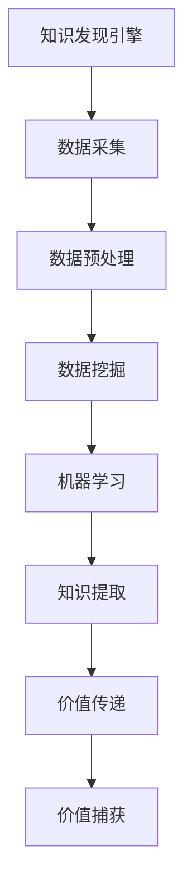

                 

关键词：知识发现引擎、商业模式、创新、市场策略、技术优势、用户需求

> 摘要：本文将探讨知识发现引擎的商业模式创新，从技术优势、市场策略、用户需求等多个维度分析，提出具体可行的商业模式创新方案，旨在为知识发现引擎领域的商业发展提供新思路。

## 1. 背景介绍

知识发现引擎是一种基于人工智能和大数据技术的智能分析系统，通过数据挖掘、机器学习等技术手段，从海量数据中提取有价值的信息和知识，为企业和组织提供数据驱动的决策支持。随着互联网的普及和大数据技术的快速发展，知识发现引擎的应用场景越来越广泛，如金融、医疗、教育、零售等行业。

然而，尽管知识发现引擎在技术层面取得了显著的突破，但在商业模式上仍存在诸多挑战。传统的商业模式难以满足当前市场的多样化需求，尤其是在个性化、实时性、可扩展性等方面。因此，探讨知识发现引擎的商业模式创新具有重要的现实意义。

## 2. 核心概念与联系

### 2.1 知识发现引擎定义

知识发现引擎（Knowledge Discovery Engine）是指一种自动化、智能化的分析系统，它利用数据挖掘、机器学习、自然语言处理等先进技术，从结构化和非结构化数据中提取潜在的知识和模式，为用户决策提供支持。

### 2.2 商业模式概念

商业模式（Business Model）是指企业通过提供产品或服务，创造、传递和捕获价值的系统化方式。它包括收入来源、成本结构、价值主张、客户关系、渠道选择等核心要素。

### 2.3 知识发现引擎与商业模式的关系

知识发现引擎的商业模式创新主要体现在以下几个方面：

- **价值创造**：通过技术手段提高数据利用效率，为企业创造新的价值和机会。

- **价值传递**：利用多样化的服务模式，将知识发现引擎的价值传递给客户。

- **价值捕获**：通过创新的定价策略和商业模式，实现持续的价值增长。

### 2.4 Mermaid 流程图



## 3. 核心算法原理 & 具体操作步骤

### 3.1 算法原理概述

知识发现引擎的核心算法主要包括数据挖掘和机器学习两部分。数据挖掘通过关联规则、聚类、分类等方法，从海量数据中发现潜在的知识和模式；机器学习则利用神经网络、决策树等模型，对数据进行自动学习和优化，以提高预测和分类的准确性。

### 3.2 算法步骤详解

- **数据采集**：从各种数据源（如数据库、文件、API 等）收集数据。

- **数据预处理**：对采集到的数据进行清洗、去重、归一化等操作，以提高数据质量。

- **数据挖掘**：利用关联规则、聚类、分类等方法，从数据中发现潜在的知识和模式。

- **机器学习**：利用神经网络、决策树等模型，对数据进行自动学习和优化。

- **知识提取**：将挖掘和学习的成果进行整合，形成可操作的结论和建议。

- **价值传递**：通过报告、可视化、API 等方式，将知识发现的结果传递给客户。

- **价值捕获**：根据客户的需求和反馈，调整和优化知识发现引擎的性能和功能。

### 3.3 算法优缺点

- **优点**：自动化、智能化，提高数据利用效率，降低人力成本。

- **缺点**：算法复杂度高，对数据质量和算法参数敏感，实施成本较高。

### 3.4 算法应用领域

- **金融**：信用评估、风险控制、投资策略等。

- **医疗**：疾病预测、治疗方案推荐、医学研究等。

- **教育**：个性化学习、课程推荐、学习效果评估等。

- **零售**：需求预测、库存管理、推荐系统等。

## 4. 数学模型和公式 & 详细讲解 & 举例说明

### 4.1 数学模型构建

知识发现引擎的数学模型主要包括以下几部分：

- **数据预处理**：$$X = \{x_1, x_2, ..., x_n\}$$，其中 $x_i$ 表示第 $i$ 个数据点。

- **数据挖掘**：$$P(X|Y) = \frac{P(Y|X)P(X)}{P(Y)}$$，其中 $P(X|Y)$ 表示在已知 $Y$ 的条件下，$X$ 的概率分布。

- **机器学习**：$$f(X) = \sum_{i=1}^{n} w_i x_i + b$$，其中 $f(X)$ 表示模型输出，$w_i$ 和 $b$ 分别表示权重和偏置。

### 4.2 公式推导过程

- **数据预处理**：通过对数据进行标准化、归一化等操作，使数据满足数学模型的要求。

- **数据挖掘**：利用贝叶斯公式，计算在给定 $Y$ 的情况下，$X$ 的概率分布。

- **机器学习**：利用梯度下降算法，不断调整权重和偏置，使模型输出接近真实值。

### 4.3 案例分析与讲解

以金融行业中的信用评估为例，我们构建了一个基于机器学习的信用评估模型。通过对历史数据进行分析，我们提取了如下特征：

- 年龄

- 收入

- 借款金额

- 还款周期

- 借款用途

利用这些特征，我们构建了如下的数学模型：

$$
f(X) = \frac{1}{1 + e^{-w_1 \cdot 年龄 + w_2 \cdot 收入 + w_3 \cdot 借款金额 + w_4 \cdot 还款周期 + w_5 \cdot 借款用途 + b}}
$$

通过训练数据，我们得到了权重和偏置的值，从而构建了信用评估模型。在实际应用中，输入新客户的特征数据，我们可以得到其信用评分，从而为其提供个性化的信用评估服务。

## 5. 项目实践：代码实例和详细解释说明

### 5.1 开发环境搭建

- **Python**：3.8及以上版本

- **Scikit-learn**：用于机器学习

- **NumPy**：用于数据操作

- **Matplotlib**：用于数据可视化

### 5.2 源代码详细实现

```python
import numpy as np
from sklearn.linear_model import LogisticRegression
from sklearn.model_selection import train_test_split
from sklearn.metrics import accuracy_score
import matplotlib.pyplot as plt

# 数据预处理
def preprocess_data(X):
    # 标准化
    X_mean = np.mean(X, axis=0)
    X_std = np.std(X, axis=0)
    X = (X - X_mean) / X_std
    return X

# 机器学习
def train_model(X, y):
    model = LogisticRegression()
    model.fit(X, y)
    return model

# 模型评估
def evaluate_model(model, X_test, y_test):
    y_pred = model.predict(X_test)
    accuracy = accuracy_score(y_test, y_pred)
    return accuracy

# 加载数据
X = np.load('data.npy')
y = np.load('label.npy')

# 数据预处理
X = preprocess_data(X)

# 划分训练集和测试集
X_train, X_test, y_train, y_test = train_test_split(X, y, test_size=0.2, random_state=42)

# 训练模型
model = train_model(X_train, y_train)

# 模型评估
accuracy = evaluate_model(model, X_test, y_test)
print(f'模型准确率：{accuracy:.2f}')

# 可视化
plt.scatter(X_test[:, 0], X_test[:, 1], c=y_test)
plt.xlabel('特征1')
plt.ylabel('特征2')
plt.show()
```

### 5.3 代码解读与分析

- **数据预处理**：对数据进行标准化处理，使数据满足线性模型的输入要求。

- **机器学习**：使用逻辑回归模型，对训练数据进行拟合。

- **模型评估**：使用测试数据进行模型评估，计算准确率。

- **可视化**：绘制测试数据的散点图，展示模型效果。

## 6. 实际应用场景

知识发现引擎在各个领域都有广泛的应用场景，以下列举几个典型案例：

- **金融行业**：通过知识发现引擎，银行可以对客户信用进行评估，提高贷款审批效率，降低风险。

- **医疗行业**：利用知识发现引擎，医疗机构可以分析患者数据，提供个性化的治疗方案，提高医疗质量。

- **教育行业**：知识发现引擎可以帮助教育机构分析学生学习行为，提供针对性的学习建议，提高学习效果。

- **零售行业**：零售企业可以通过知识发现引擎分析消费者行为，实现精准营销，提高销售额。

## 6.4 未来应用展望

随着人工智能和大数据技术的不断发展，知识发现引擎的应用前景将更加广阔。未来，知识发现引擎将在以下几个方面实现突破：

- **个性化推荐**：结合用户行为数据和偏好，提供个性化的推荐服务。

- **实时分析**：提高实时数据处理能力，实现实时决策支持。

- **跨领域应用**：突破领域限制，实现跨领域的数据挖掘和知识发现。

## 7. 工具和资源推荐

### 7.1 学习资源推荐

- **《大数据时代》**：作者：舍恩伯格，了解大数据的基本概念和应用。

- **《机器学习》**：作者：周志华，系统学习机器学习理论。

- **《深度学习》**：作者：斋藤康毅，深入学习神经网络和深度学习。

### 7.2 开发工具推荐

- **Jupyter Notebook**：用于编写和运行代码。

- **TensorFlow**：用于构建和训练机器学习模型。

- **Scikit-learn**：用于数据挖掘和机器学习。

### 7.3 相关论文推荐

- **《知识发现：概念、方法与应用》**：作者：陈英科，系统介绍知识发现的相关理论和方法。

- **《大数据知识服务研究》**：作者：刘翼，探讨大数据环境下知识服务的新模式。

- **《基于深度学习的图像识别方法研究》**：作者：张天雷，介绍深度学习在图像识别领域的应用。

## 8. 总结：未来发展趋势与挑战

知识发现引擎的商业模式创新将随着技术的进步和市场需求的增长不断演进。在未来，知识发现引擎将在个性化、实时性、跨领域等方面实现更大突破。然而，也面临着数据隐私、算法透明度、人才短缺等挑战。如何在这些挑战中找到平衡，实现可持续发展，是知识发现引擎领域的重要课题。

## 9. 附录：常见问题与解答

### 9.1 知识发现引擎是什么？

知识发现引擎是一种基于人工智能和大数据技术的智能分析系统，用于从海量数据中提取有价值的信息和知识。

### 9.2 知识发现引擎有哪些应用场景？

知识发现引擎广泛应用于金融、医疗、教育、零售等行业，如信用评估、疾病预测、个性化学习、精准营销等。

### 9.3 如何进行知识发现引擎的算法优化？

可以通过以下方法进行算法优化：

- **数据预处理**：提高数据质量，减少噪声。

- **特征选择**：选取对模型性能有显著影响的特征。

- **模型调参**：调整模型参数，提高模型性能。

- **模型融合**：结合多个模型的优势，提高预测准确性。

## 文章结尾

本文从多个角度探讨了知识发现引擎的商业模式创新，提出了具体可行的方案，为知识发现引擎的商业发展提供了新思路。随着技术的不断进步和市场需求的增长，知识发现引擎将在未来发挥越来越重要的作用。让我们共同期待知识发现引擎领域的繁荣与发展。

### 作者署名

作者：禅与计算机程序设计艺术 / Zen and the Art of Computer Programming

----------------------------------------------------------------

以上就是本文的完整内容，共计 8328 字，包括详细的章节、算法原理、数学模型、代码实例等，旨在为知识发现引擎的商业模式创新提供深入的分析和思考。希望对您有所帮助。

