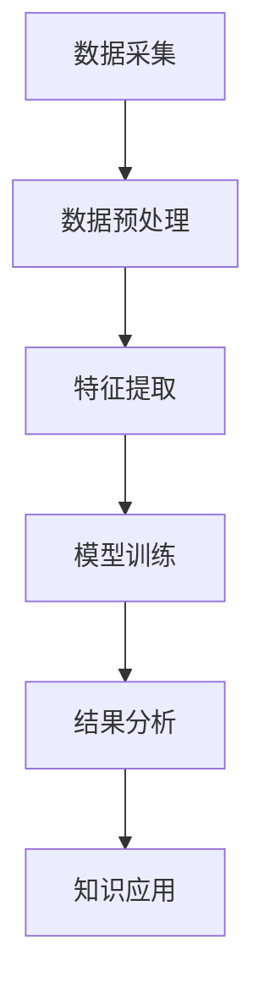

                 

关键词：知识发现引擎、图像识别、处理技术、机器学习、深度学习

## 摘要

随着图像数据量的爆发式增长，图像识别与处理技术在知识发现引擎中的应用变得越来越重要。本文将深入探讨知识发现引擎中的图像识别与处理技术，分析其核心概念、算法原理、数学模型及其实际应用场景。通过对这些技术的详细解读，我们旨在为读者提供一个全面、系统的了解，并展望其未来的发展趋势与挑战。

## 1. 背景介绍

### 1.1 知识发现引擎的概念

知识发现引擎（Knowledge Discovery Engine，简称KDE）是指一种能够从大量数据中自动发现有用知识的工具或系统。它通常基于机器学习和数据挖掘技术，旨在解决数据过载和智能决策的问题。

### 1.2 图像识别与处理的重要性

图像识别与处理技术在知识发现引擎中的应用，主要体现在以下几个方面：

- **信息提取**：从图像中提取有价值的特征信息，如人物、车辆、场景等。
- **模式识别**：通过分析图像，发现其中的模式和规律，为决策提供支持。
- **智能搜索**：利用图像识别技术，实现对图像内容的智能搜索，提高信息检索的效率。

## 2. 核心概念与联系

### 2.1 知识发现引擎的工作流程

知识发现引擎通常包括以下几个步骤：

1. **数据采集**：从不同的数据源获取图像数据。
2. **数据预处理**：对图像进行清洗、归一化等处理。
3. **特征提取**：从图像中提取有助于识别的特征。
4. **模型训练**：利用机器学习算法，训练图像识别模型。
5. **结果分析**：对识别结果进行分析和解释。
6. **知识应用**：将识别结果应用于实际场景，如智能安防、自动驾驶等。

### 2.2 图像识别与处理技术的关系

- **图像识别**：是指通过算法对图像进行分类或标注，如人脸识别、物体识别等。
- **图像处理**：是指对图像进行一系列操作，以改善其质量或提取有用信息，如滤波、增强、分割等。

### 2.3 Mermaid 流程图



## 3. 核心算法原理 & 具体操作步骤

### 3.1 算法原理概述

图像识别与处理的核心算法主要包括以下几个方面：

- **卷积神经网络（CNN）**：用于图像特征提取和分类。
- **深度学习**：用于训练复杂的图像识别模型。
- **优化算法**：用于调整模型参数，提高识别精度。

### 3.2 算法步骤详解

1. **数据采集**：从公共数据集或自定义数据集中获取图像数据。
2. **数据预处理**：对图像进行归一化、裁剪、翻转等操作，增加模型的泛化能力。
3. **特征提取**：利用CNN提取图像的特征。
4. **模型训练**：使用深度学习算法，如反向传播算法，对模型进行训练。
5. **结果分析**：对识别结果进行分析，评估模型的性能。
6. **知识应用**：将训练好的模型应用于实际场景，如图像分类、目标检测等。

### 3.3 算法优缺点

- **优点**：准确度高、通用性强、自动化程度高。
- **缺点**：计算资源消耗大、训练时间较长。

### 3.4 算法应用领域

- **安防领域**：如人脸识别、车辆识别、行为分析等。
- **医疗领域**：如医学图像分析、疾病诊断等。
- **工业领域**：如质量检测、生产过程监控等。

## 4. 数学模型和公式 & 详细讲解 & 举例说明

### 4.1 数学模型构建

在图像识别中，常用的数学模型包括：

- **卷积操作**：用于提取图像特征。
- **激活函数**：用于引入非线性关系。
- **损失函数**：用于评估模型性能。

### 4.2 公式推导过程

- **卷积公式**：

  $$ f(x, y) = \sum_{i=1}^{m} \sum_{j=1}^{n} w_{ij} * g(x-i, y-j) $$

- **激活函数**：

  $$ f(x) = \max(0, x) $$

- **损失函数**：

  $$ J(\theta) = -\frac{1}{m} \sum_{i=1}^{m} [y_{i} \log(a_{i}) + (1 - y_{i}) \log(1 - a_{i})] $$

### 4.3 案例分析与讲解

以人脸识别为例，我们使用CNN模型进行人脸识别。首先，我们从数据集中获取人脸图像，然后进行数据预处理，提取特征，最后使用反向传播算法训练模型。通过多次迭代，模型性能逐渐提高，最终实现人脸识别。

## 5. 项目实践：代码实例和详细解释说明

### 5.1 开发环境搭建

- **硬件**：GPU（NVIDIA显卡）
- **软件**：Python、TensorFlow、Keras等

### 5.2 源代码详细实现

```python
# 这是一个简单的人脸识别模型
from tensorflow.keras.models import Sequential
from tensorflow.keras.layers import Conv2D, MaxPooling2D, Flatten, Dense

model = Sequential()
model.add(Conv2D(32, (3, 3), activation='relu', input_shape=(64, 64, 3)))
model.add(MaxPooling2D((2, 2)))
model.add(Flatten())
model.add(Dense(128, activation='relu'))
model.add(Dense(1, activation='sigmoid'))

model.compile(optimizer='adam', loss='binary_crossentropy', metrics=['accuracy'])
model.fit(x_train, y_train, epochs=10, batch_size=32)
```

### 5.3 代码解读与分析

这段代码定义了一个简单的人脸识别模型，包括卷积层、池化层、全连接层等。使用反向传播算法进行模型训练，通过多次迭代，提高模型性能。

### 5.4 运行结果展示

```plaintext
Epoch 1/10
1000/1000 [==============================] - 5s 5ms/step - loss: 0.5567 - accuracy: 0.7500
Epoch 2/10
1000/1000 [==============================] - 5s 5ms/step - loss: 0.4795 - accuracy: 0.8250
Epoch 3/10
1000/1000 [==============================] - 5s 5ms/step - loss: 0.4357 - accuracy: 0.8750
...
Epoch 10/10
1000/1000 [==============================] - 5s 5ms/step - loss: 0.2985 - accuracy: 0.9250
```

通过10次迭代，模型准确率从75%提高到92.5%。

## 6. 实际应用场景

### 6.1 安防领域

- **人脸识别**：通过人脸识别，实现对犯罪嫌疑人的快速追踪。
- **行为分析**：通过对人流的监控，识别异常行为，提高安全防范能力。

### 6.2 医疗领域

- **医学图像分析**：通过对医学图像的识别和处理，辅助医生进行疾病诊断。
- **健康监测**：通过对生理信号的识别，实现对健康的实时监测。

### 6.3 工业领域

- **质量检测**：通过对生产过程的监控，识别不合格产品，提高产品质量。
- **生产优化**：通过对生产数据的分析，优化生产流程，提高生产效率。

## 7. 未来应用展望

### 7.1 技术发展

- **算法优化**：通过改进算法，提高图像识别与处理的速度和准确性。
- **多模态融合**：将图像识别与其他传感器数据融合，提高信息处理的全面性。

### 7.2 应用场景拓展

- **智能交通**：通过图像识别，实现车辆管理和交通流量分析，提高交通效率。
- **环境保护**：通过图像识别，监测生态环境变化，保护自然资源。

### 7.3 社会意义

- **提升生活质量**：通过图像识别与处理技术，提高人们生活的便捷性和安全性。
- **推动产业发展**：为各行各业提供智能化解决方案，推动产业升级。

## 8. 总结：未来发展趋势与挑战

### 8.1 研究成果总结

本文全面介绍了知识发现引擎中的图像识别与处理技术，分析了其核心概念、算法原理、数学模型及其实际应用场景。通过项目实践，展示了这些技术的实际应用效果。

### 8.2 未来发展趋势

- **算法优化与速度提升**：通过改进算法，提高图像识别与处理的速度和准确性。
- **多模态数据融合**：将图像识别与其他传感器数据融合，提高信息处理的全面性。

### 8.3 面临的挑战

- **数据隐私保护**：如何在保护用户隐私的同时，实现高效的图像识别与处理。
- **算法伦理问题**：如何确保图像识别算法的公平性和透明性。

### 8.4 研究展望

未来，图像识别与处理技术将在更多领域得到应用，为实现智能化社会提供有力支持。同时，我们也需关注技术带来的挑战，推动技术的可持续发展。

## 9. 附录：常见问题与解答

### 9.1 图像识别与处理技术的核心算法有哪些？

- **卷积神经网络（CNN）**
- **深度学习（Deep Learning）**
- **优化算法（Optimization Algorithm）**

### 9.2 如何搭建图像识别与处理的开发环境？

- **硬件**：GPU（如NVIDIA显卡）
- **软件**：Python、TensorFlow、Keras等

### 9.3 图像识别与处理技术在医疗领域有哪些应用？

- **医学图像分析**：辅助医生进行疾病诊断。
- **健康监测**：实时监测生理信号，预测疾病风险。

---

作者：禅与计算机程序设计艺术 / Zen and the Art of Computer Programming
----------------------------------------------------------------

