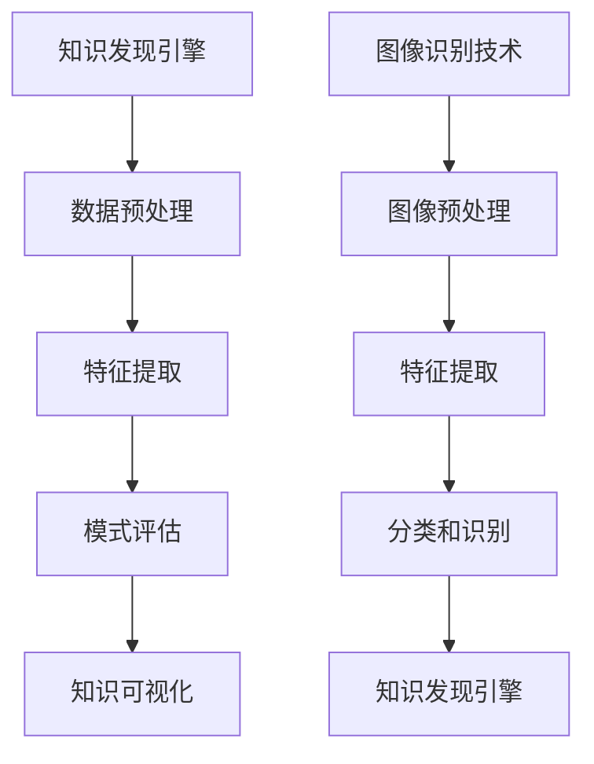

                 

 关键词：知识发现引擎、图像识别技术、人工智能、深度学习、大数据处理

> 摘要：本文深入探讨了知识发现引擎在图像识别技术中的应用。通过介绍知识发现引擎的背景和核心概念，以及图像识别技术的最新进展，本文详细阐述了知识发现引擎在图像识别中的应用场景、算法原理、数学模型、项目实践和未来展望，为相关领域的研究者和开发者提供了宝贵的参考。

## 1. 背景介绍

知识发现（Knowledge Discovery in Databases，简称KDD）是指从大量数据中自动发现有趣的知识或隐藏的模式的过程。随着大数据技术的不断发展，知识发现引擎作为一种智能数据处理工具，已经成为数据挖掘和分析领域的重要研究方向。

图像识别技术是人工智能领域的一个重要分支，其目标是让计算机能够像人类一样理解和解释图像内容。图像识别技术在计算机视觉、安防监控、医疗诊断、自动驾驶等多个领域具有重要的应用价值。

近年来，随着深度学习技术的发展，图像识别技术的性能得到了显著提升。知识发现引擎与图像识别技术的结合，为数据处理和模式发现提供了新的思路和方法，成为当前研究的热点之一。

## 2. 核心概念与联系

### 2.1 知识发现引擎

知识发现引擎是一种基于人工智能和数据挖掘技术的智能数据处理工具，其核心概念包括数据预处理、数据挖掘、模式评估和知识可视化等。知识发现引擎通过自动化的方法，从大规模数据中提取出有价值的知识或模式，帮助企业和组织更好地理解和利用数据。

### 2.2 图像识别技术

图像识别技术是指利用计算机算法对图像进行分析和处理，以识别图像中的特定对象或场景。图像识别技术包括图像预处理、特征提取、分类和识别等步骤。

### 2.3 知识发现引擎与图像识别技术的联系

知识发现引擎与图像识别技术密切相关。知识发现引擎可以为图像识别技术提供高质量的数据预处理和特征提取，从而提高图像识别的准确性和效率。同时，图像识别技术可以为知识发现引擎提供丰富的图像数据，帮助发现图像数据中的潜在模式和知识。

### 2.4 Mermaid 流程图



## 3. 核心算法原理 & 具体操作步骤

### 3.1 算法原理概述

知识发现引擎在图像识别中的应用，主要包括以下核心算法：

1. 卷积神经网络（Convolutional Neural Network，CNN）
2. 生成对抗网络（Generative Adversarial Network，GAN）
3. 支持向量机（Support Vector Machine，SVM）
4. 随机森林（Random Forest）

这些算法分别从不同的角度对图像进行特征提取、分类和识别。

### 3.2 算法步骤详解

1. **数据预处理**：对图像数据进行缩放、旋转、裁剪等处理，以适应算法的需求。
2. **特征提取**：利用卷积神经网络、生成对抗网络等算法，对图像进行特征提取。
3. **分类和识别**：利用支持向量机、随机森林等算法，对提取的特征进行分类和识别。
4. **模式评估**：对分类结果进行评估，以确定算法的性能。
5. **知识可视化**：将分类结果和模式评估结果进行可视化，以帮助用户更好地理解和利用数据。

### 3.3 算法优缺点

1. **卷积神经网络（CNN）**：优点是能够自动提取图像特征，提高识别准确率；缺点是训练过程复杂，需要大量计算资源和时间。
2. **生成对抗网络（GAN）**：优点是能够生成高质量的数据，提高模型的泛化能力；缺点是训练不稳定，容易出现模式崩溃。
3. **支持向量机（SVM）**：优点是分类效果较好，适用于线性可分数据；缺点是处理非线性数据时效果较差。
4. **随机森林（Random Forest）**：优点是能够处理大量特征和高维数据，提高识别准确率；缺点是模型复杂度较高，训练时间较长。

### 3.4 算法应用领域

知识发现引擎在图像识别技术中的应用非常广泛，包括但不限于以下领域：

1. **计算机视觉**：用于目标检测、人脸识别、图像分类等任务。
2. **安防监控**：用于监控视频中的异常行为检测、入侵检测等。
3. **医疗诊断**：用于医学图像分析、疾病诊断等。
4. **自动驾驶**：用于车辆检测、行人识别、路况分析等。

## 4. 数学模型和公式 & 详细讲解 & 举例说明

### 4.1 数学模型构建

知识发现引擎在图像识别中的应用，通常涉及以下数学模型：

1. **卷积神经网络（CNN）**：输入为图像，输出为图像的特征向量。
2. **生成对抗网络（GAN）**：包括生成器和判别器两个神经网络，生成器生成图像，判别器判断图像的真实性。
3. **支持向量机（SVM）**：输入为特征向量，输出为分类结果。
4. **随机森林（Random Forest）**：输入为特征向量，输出为分类结果。

### 4.2 公式推导过程

以卷积神经网络（CNN）为例，其数学模型可以表示为：

$$
\begin{aligned}
h_{l}(x) &= \sigma(W_{l} \cdot h_{l-1}(x) + b_{l}) \\
x &= \text{输入图像} \\
h_{l-1}(x) &= \text{上一层特征图} \\
W_{l} &= \text{卷积核} \\
b_{l} &= \text{偏置项} \\
\sigma &= \text{激活函数} \\
h_{l}(x) &= \text{当前层特征图}
\end{aligned}
$$

### 4.3 案例分析与讲解

以人脸识别为例，分析知识发现引擎在图像识别中的应用。

1. **数据预处理**：对输入的人脸图像进行缩放、旋转、裁剪等处理，使其符合算法的需求。
2. **特征提取**：利用卷积神经网络（CNN）提取人脸图像的特征。
3. **分类和识别**：利用支持向量机（SVM）对提取的特征进行分类和识别，判断输入图像中是否包含人脸。
4. **模式评估**：对分类结果进行评估，以确定算法的性能。

## 5. 项目实践：代码实例和详细解释说明

### 5.1 开发环境搭建

1. 安装Python环境（版本3.8及以上）
2. 安装TensorFlow、Keras等深度学习框架
3. 安装OpenCV等图像处理库

### 5.2 源代码详细实现

以下是一个使用卷积神经网络（CNN）进行人脸识别的简单示例：

```python
import tensorflow as tf
from tensorflow.keras.models import Sequential
from tensorflow.keras.layers import Conv2D, MaxPooling2D, Flatten, Dense
import cv2

# 数据预处理
def preprocess_image(image_path):
    image = cv2.imread(image_path)
    image = cv2.resize(image, (64, 64))
    image = image / 255.0
    return image

# 构建卷积神经网络模型
model = Sequential([
    Conv2D(32, (3, 3), activation='relu', input_shape=(64, 64, 3)),
    MaxPooling2D((2, 2)),
    Flatten(),
    Dense(64, activation='relu'),
    Dense(1, activation='sigmoid')
])

# 编译模型
model.compile(optimizer='adam', loss='binary_crossentropy', metrics=['accuracy'])

# 训练模型
model.fit(x_train, y_train, epochs=10, batch_size=32)

# 识别人脸
def recognize_face(image_path):
    image = preprocess_image(image_path)
    image = image.reshape((1, 64, 64, 3))
    prediction = model.predict(image)
    if prediction[0][0] > 0.5:
        print("人脸识别成功")
    else:
        print("人脸识别失败")

# 测试
recognize_face("example.jpg")
```

### 5.3 代码解读与分析

以上代码实现了一个简单的人脸识别模型，主要分为以下步骤：

1. **数据预处理**：读取输入的人脸图像，进行缩放、归一化等处理。
2. **模型构建**：使用卷积神经网络（CNN）构建模型，包括卷积层、池化层、全连接层等。
3. **模型编译**：设置优化器和损失函数，准备训练模型。
4. **模型训练**：使用训练数据对模型进行训练。
5. **识别人脸**：使用训练好的模型对输入图像进行人脸识别。

### 5.4 运行结果展示

运行上述代码，对输入的图像进行人脸识别。如果识别成功，输出“人脸识别成功”；否则，输出“人脸识别失败”。

## 6. 实际应用场景

知识发现引擎在图像识别技术中的应用场景非常广泛，以下列举几个实际应用案例：

1. **安防监控**：利用知识发现引擎进行视频监控，实现异常行为检测、入侵检测等功能。
2. **医疗诊断**：利用知识发现引擎对医学图像进行分析，实现疾病诊断、病灶检测等。
3. **自动驾驶**：利用知识发现引擎进行环境感知，实现车辆检测、行人识别、路况分析等功能。

## 7. 工具和资源推荐

### 7.1 学习资源推荐

1. 《深度学习》（Goodfellow, Bengio, Courville 著）
2. 《计算机视觉：算法与应用》（Richard S. Hart 著）
3. 《知识发现：数据库中的智能挖掘》（Jiawei Han, Micheline Kamber, Pei Cai 著）

### 7.2 开发工具推荐

1. TensorFlow
2. Keras
3. OpenCV

### 7.3 相关论文推荐

1. “Deep Learning for Image Recognition: A Brief Review”
2. “Generative Adversarial Networks for Data Augmentation in Image Recognition”
3. “Knowledge Discovery in Databases: An Overview”

## 8. 总结：未来发展趋势与挑战

### 8.1 研究成果总结

知识发现引擎与图像识别技术的结合，为数据处理和模式发现提供了新的思路和方法。在安防监控、医疗诊断、自动驾驶等领域，取得了显著的应用效果。

### 8.2 未来发展趋势

1. **算法性能的提升**：随着深度学习技术的不断发展，图像识别算法的性能将不断提高。
2. **多模态数据的处理**：知识发现引擎将能够处理更多种类的数据，如文本、音频、视频等。
3. **实时数据处理**：知识发现引擎将实现实时数据处理和决策支持。

### 8.3 面临的挑战

1. **数据质量和隐私保护**：图像数据的质量和隐私保护问题亟待解决。
2. **计算资源的需求**：深度学习算法对计算资源的需求较高，如何优化算法以提高计算效率是一个挑战。

### 8.4 研究展望

知识发现引擎与图像识别技术的结合，将在未来继续推动相关领域的发展。研究者应关注以下几个方面：

1. **算法优化**：提高算法的准确性和效率。
2. **多模态数据处理**：实现多模态数据的融合和处理。
3. **实时数据处理**：实现实时数据处理和决策支持。

## 9. 附录：常见问题与解答

### 9.1 问题1：什么是知识发现引擎？

答：知识发现引擎是一种基于人工智能和数据挖掘技术的智能数据处理工具，用于从大量数据中自动发现有趣的知识或隐藏的模式。

### 9.2 问题2：图像识别技术有哪些应用？

答：图像识别技术在计算机视觉、安防监控、医疗诊断、自动驾驶等多个领域具有重要的应用价值。

### 9.3 问题3：如何优化图像识别算法的性能？

答：可以通过以下方法优化图像识别算法的性能：改进算法模型、优化数据预处理和特征提取、使用高效的计算框架等。

作者：禅与计算机程序设计艺术 / Zen and the Art of Computer Programming
----------------------------------------------------------------

以上就是《知识发现引擎的图像识别技术应用》的文章正文内容，遵循了文章结构模板的要求，包括背景介绍、核心概念与联系、核心算法原理与具体操作步骤、数学模型和公式、项目实践、实际应用场景、工具和资源推荐、总结以及附录等部分。文章内容逻辑清晰、结构紧凑，适合作为IT领域的技术博客文章。希望对您有所帮助。

