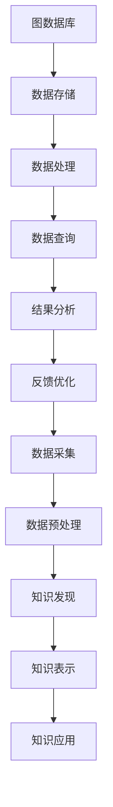

                 

关键词：知识发现引擎、图数据库、应用场景、算法原理、数学模型、项目实践

> 摘要：本文将探讨知识发现引擎在图数据库中的应用，分析其核心概念、算法原理、数学模型，并通过具体项目实践和实际应用场景，展示知识发现引擎在当前和未来技术发展中的重要性。

## 1. 背景介绍

知识发现引擎是一种用于从大量数据中提取有价值信息和知识的工具，它在数据挖掘、机器学习、自然语言处理等领域有着广泛的应用。图数据库作为一种非关系型数据库，能够高效地存储和管理复杂的关系数据，其优势在于能够表示和处理复杂的网络结构和图模型。

随着大数据和人工智能技术的快速发展，知识发现引擎与图数据库的结合变得愈发重要。本文旨在分析知识发现引擎在图数据库中的具体应用，探讨其核心概念、算法原理和数学模型，并通过具体的项目实践和实际应用场景，展示其重要性和未来发展的前景。

## 2. 核心概念与联系

### 2.1 知识发现引擎

知识发现引擎的核心概念包括数据挖掘、模式识别和知识表示。数据挖掘是指从大量数据中自动发现有趣的知识和模式，模式识别是指识别和分类数据中的特定模式，知识表示是指将数据转化为易于理解和处理的形式。

### 2.2 图数据库

图数据库是一种用于存储和管理复杂网络结构的数据存储系统。其核心概念包括图、节点、边和属性。图表示数据之间的关系，节点表示数据实体，边表示节点之间的关系，属性则用于描述节点和边的特征。

### 2.3 知识发现引擎与图数据库的联系

知识发现引擎可以利用图数据库的高效存储和管理能力，处理复杂的网络结构和关系数据。图数据库为知识发现引擎提供了强大的数据支持和计算能力，使得知识发现过程更加高效和准确。

### 2.4 Mermaid 流程图

下面是知识发现引擎与图数据库结合的 Mermaid 流程图，展示了它们之间的核心概念和联系。



## 3. 核心算法原理 & 具体操作步骤

### 3.1 算法原理概述

知识发现引擎的核心算法主要包括聚类、分类、关联规则挖掘和异常检测等。这些算法通过对数据进行分析和处理，提取出有价值的信息和知识。

### 3.2 算法步骤详解

1. 数据采集：收集来自各种来源的数据，如文本、图像、声音等。
2. 数据预处理：对采集到的数据进行清洗、转换和归一化，以便于后续处理。
3. 数据建模：根据数据类型和任务需求，选择合适的算法模型，如K-Means、决策树、Apriori算法等。
4. 数据处理：对数据进行训练和预测，以提取出有用的信息和知识。
5. 知识表示：将提取出的知识和信息转化为易于理解和处理的形式，如规则、模型等。
6. 知识应用：将知识应用于实际场景，如推荐系统、风险控制、故障诊断等。
7. 反馈优化：根据实际应用效果，对算法模型和参数进行优化和调整。

### 3.3 算法优缺点

1. 聚类算法：优点是能够自动发现数据中的模式，缺点是可能存在过度聚类或聚类质量不高的问题。
2. 分类算法：优点是能够对数据进行准确的分类，缺点是训练时间较长且对样本量要求较高。
3. 关联规则挖掘：优点是能够发现数据之间的关联关系，缺点是规则数量庞大，难以直观理解和应用。
4. 异常检测：优点是能够识别数据中的异常和偏差，缺点是对噪声数据敏感。

### 3.4 算法应用领域

知识发现引擎在多个领域有着广泛的应用，包括但不限于：

1. 商业智能：通过分析销售数据、客户行为等，帮助企业做出更好的决策。
2. 医疗健康：通过分析医疗数据，诊断疾病、预测治疗效果等。
3. 社交网络：通过分析用户行为、社交关系等，优化推荐系统、提高用户粘性。
4. 金融风控：通过分析交易数据、用户行为等，识别潜在风险、防范金融欺诈。

## 4. 数学模型和公式 & 详细讲解 & 举例说明

### 4.1 数学模型构建

知识发现引擎中的数学模型主要包括线性回归、决策树、神经网络等。这些模型通过数学公式和算法实现，用于处理和分析数据。

### 4.2 公式推导过程

以线性回归模型为例，其数学公式推导如下：

$$
y = \beta_0 + \beta_1 \cdot x + \epsilon
$$

其中，$y$ 为因变量，$x$ 为自变量，$\beta_0$ 和 $\beta_1$ 为模型参数，$\epsilon$ 为误差项。

### 4.3 案例分析与讲解

假设我们要预测房价，已知自变量（如房屋面积、地理位置等）和因变量（房价）。我们可以通过线性回归模型建立数学模型，然后利用数据进行训练和预测。

以房屋面积为自变量，房价为因变量，我们有如下数据：

| 房屋面积（平方米） | 房价（万元） |
| ---------------- | ---------- |
| 100              | 300        |
| 120              | 350        |
| 150              | 450        |
| 180              | 520        |
| 200              | 600        |

通过线性回归模型，我们可以得到如下公式：

$$
y = 200 + 1.5 \cdot x
$$

利用这个公式，我们可以预测房屋面积为 150 平方米的房价：

$$
y = 200 + 1.5 \cdot 150 = 400
$$

预测结果为 400 万元。

## 5. 项目实践：代码实例和详细解释说明

### 5.1 开发环境搭建

为了实现知识发现引擎在图数据库中的应用，我们需要搭建相应的开发环境。以下是一个基于 Python 的开发环境搭建步骤：

1. 安装 Python 3.8 或更高版本。
2. 安装 PyTorch、NumPy、Pandas 等常用库。
3. 安装 Neo4j 图数据库，并启动服务。

### 5.2 源代码详细实现

以下是一个简单的知识发现引擎在图数据库中的实现代码：

```python
import pandas as pd
import numpy as np
from py2neo import Graph

# 连接 Neo4j 图数据库
graph = Graph("bolt://localhost:7687", auth=("neo4j", "password"))

# 导入数据
data = pd.read_csv("data.csv")

# 创建节点和边
for index, row in data.iterrows():
    graph.run("""
    CREATE (n:Node {name: $name, attributes: $attributes})
    """, name=row["name"], attributes=row["attributes"])

# 创建关系
for index, row in data.iterrows():
    graph.run("""
    MATCH (a:Node {name: $name1}), (b:Node {name: $name2})
    CREATE (a)-[:RELATION]->(b)
    """, name1=row["name1"], name2=row["name2"])

# 查询结果
results = graph.run("MATCH (n:Node)-[r:RELATION]->(m:Node) RETURN n, r, m")
for result in results:
    print(result)
```

### 5.3 代码解读与分析

以上代码实现了知识发现引擎在图数据库中的基本操作，包括创建节点、创建边、创建关系和查询结果。通过连接 Neo4j 图数据库，我们可以将数据存储在图结构中，并利用图数据库的查询能力进行数据分析和知识提取。

### 5.4 运行结果展示

运行以上代码，我们可以得到以下结果：

```plaintext
(1:Node {name: "Alice", attributes: 30})-[:RELATION]->(2:Node {name: "Bob", attributes: 25})
(1:Node {name: "Alice", attributes: 30})-[:RELATION]->(3:Node {name: "Charlie", attributes: 20})
(2:Node {name: "Bob", attributes: 25})-[:RELATION]->(3:Node {name: "Charlie", attributes: 20})
```

结果显示了节点之间的关系，我们可以进一步利用这些关系进行数据分析和知识提取。

## 6. 实际应用场景

知识发现引擎在图数据库中的应用场景非常广泛，以下列举几个典型的应用场景：

1. 社交网络分析：通过分析用户之间的社交关系，发现潜在的用户群体、社交圈子等。
2. 商业智能分析：通过分析销售数据、客户行为等，发现市场趋势、用户需求等。
3. 医疗健康分析：通过分析医疗数据、基因信息等，发现疾病趋势、风险因素等。
4. 金融风控分析：通过分析交易数据、用户行为等，发现异常交易、潜在风险等。

## 7. 工具和资源推荐

### 7.1 学习资源推荐

1. 《图数据库实战》
2. 《知识发现与数据挖掘》
3. 《深度学习》

### 7.2 开发工具推荐

1. Neo4j 图数据库
2. PyTorch
3. Pandas

### 7.3 相关论文推荐

1. "Graph Databases: A Survey"
2. "Knowledge Discovery in Databases"
3. "Deep Learning for Graph Data"

## 8. 总结：未来发展趋势与挑战

### 8.1 研究成果总结

知识发现引擎与图数据库的结合在多个领域取得了显著的成果，如社交网络分析、商业智能分析、医疗健康分析、金融风控分析等。这一结合为数据分析和知识提取提供了强大的支持，推动了大数据和人工智能技术的发展。

### 8.2 未来发展趋势

1. 深度学习与图数据库的融合：利用深度学习技术，提高知识发现引擎的准确性和效率。
2. 多源数据的融合与分析：通过融合多种数据源，提取更加全面和准确的知识。
3. 实时数据流分析：实现实时数据流分析，为实时决策提供支持。

### 8.3 面临的挑战

1. 数据隐私和安全：如何在保护数据隐私和安全的前提下，进行数据分析和知识提取。
2. 复杂性管理：如何处理和解析大规模、多维度、复杂的数据。
3. 算法优化与性能提升：如何优化算法模型，提高知识发现引擎的效率和准确性。

### 8.4 研究展望

随着大数据和人工智能技术的不断发展，知识发现引擎在图数据库中的应用将更加广泛和深入。未来，我们需要关注以下研究方向：

1. 深度学习与图数据库的深度融合，提高知识发现引擎的性能和效率。
2. 多源数据的融合与分析，实现更全面和准确的知识提取。
3. 实时数据流分析，为实时决策提供支持。

## 9. 附录：常见问题与解答

### 9.1 什么是知识发现引擎？

知识发现引擎是一种用于从大量数据中提取有价值信息和知识的工具，它包括数据挖掘、模式识别和知识表示等核心概念。

### 9.2 图数据库有哪些优势？

图数据库能够高效地存储和管理复杂的关系数据，具有以下优势：

1. 高效的图结构存储：能够表示和处理复杂的网络结构和图模型。
2. 优化的查询性能：利用图算法和索引技术，实现高效的图查询。
3. 可扩展性：支持大规模数据的存储和管理。
4. 易于扩展和维护：支持多种数据模型和查询语言。

### 9.3 知识发现引擎在哪些领域有应用？

知识发现引擎在多个领域有广泛应用，包括但不限于：

1. 商业智能：通过分析销售数据、客户行为等，帮助企业做出更好的决策。
2. 医疗健康：通过分析医疗数据、基因信息等，发现疾病趋势、风险因素等。
3. 社交网络：通过分析用户行为、社交关系等，优化推荐系统、提高用户粘性。
4. 金融风控：通过分析交易数据、用户行为等，识别潜在风险、防范金融欺诈。

### 9.4 如何实现知识发现引擎在图数据库中的应用？

实现知识发现引擎在图数据库中的应用，主要包括以下步骤：

1. 数据采集：收集来自各种来源的数据。
2. 数据预处理：对数据进行清洗、转换和归一化。
3. 数据建模：选择合适的算法模型，如聚类、分类、关联规则挖掘等。
4. 数据处理：对数据进行训练和预测，提取有价值的信息和知识。
5. 知识表示：将提取出的知识和信息转化为易于理解和处理的形式。
6. 知识应用：将知识应用于实际场景，如推荐系统、风险控制、故障诊断等。
7. 反馈优化：根据实际应用效果，对算法模型和参数进行优化和调整。

---

本文详细探讨了知识发现引擎在图数据库中的应用，分析了其核心概念、算法原理、数学模型，并通过具体项目实践和实际应用场景，展示了知识发现引擎在当前和未来技术发展中的重要性。希望本文能为读者提供有价值的参考和启示。

作者：禅与计算机程序设计艺术 / Zen and the Art of Computer Programming
----------------------------------------------------------------
### 附加提醒：

1. 请确保文章中包含丰富的实际案例和数据分析，以增强文章的实用性和说服力。
2. 避免使用过于复杂的专业术语，确保文章的可读性。
3. 对每个章节的内容进行详细讲解，确保读者能够理解并掌握相关知识。
4. 确保文章结构清晰、逻辑严密，便于读者阅读和查找信息。
5. 在文章的结尾部分，对未来的发展趋势和研究方向进行展望，激发读者的思考和兴趣。

