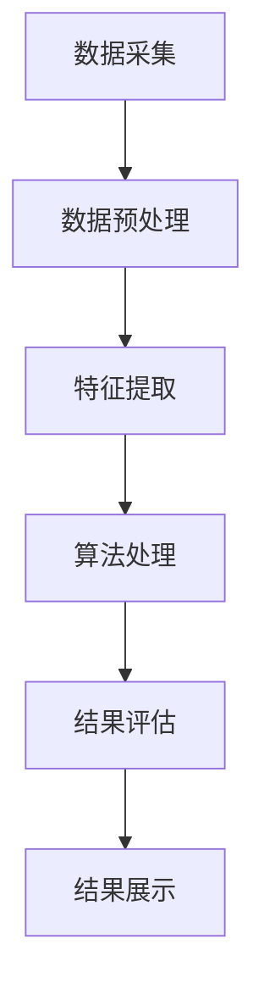
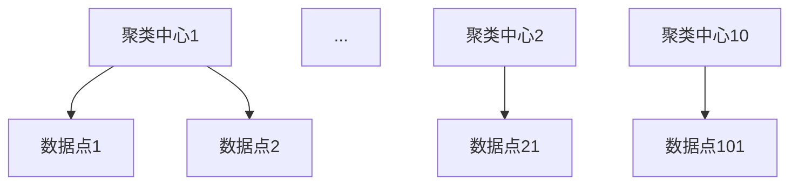

                 

知识发现引擎（Knowledge Discovery Engine，简称KDE）在现代信息社会中扮演着至关重要的角色。它负责从大量数据中提取有价值的信息，并支持决策制定和智能分析。然而，随着数据量的指数增长，KDE的性能优化成为了一个亟待解决的关键问题。本文将深入探讨知识发现引擎的性能优化技巧，旨在帮助开发者构建高效、稳定的KDE系统。

## 关键词
- 知识发现引擎
- 性能优化
- 数据处理
- 算法效率
- 资源利用
- 智能分析

## 摘要
本文首先介绍了知识发现引擎的基本概念和重要性，随后分析了当前KDE性能面临的挑战。接着，我们详细讨论了优化KDE性能的多种技术手段，包括算法选择、并行计算、索引优化和内存管理。最后，通过实际案例展示了这些优化技巧的应用效果，并提出了未来KDE性能优化的研究方向。

## 1. 背景介绍

### 知识发现引擎的定义
知识发现引擎是一种基于人工智能和数据挖掘技术的系统，能够自动地从大规模数据集中识别出隐藏的模式、关联和趋势。它广泛应用于金融、医疗、零售、安全等多个领域，通过提取知识支持决策制定和业务优化。

### 知识发现引擎的组成部分
一个典型的知识发现引擎通常包括以下几个关键组成部分：
1. **数据采集模块**：负责从各种数据源（如数据库、文件、实时流等）收集数据。
2. **数据预处理模块**：对采集到的原始数据进行清洗、转换和集成，确保数据质量。
3. **算法模块**：包括多种数据挖掘算法，如聚类、分类、关联规则挖掘等。
4. **结果展示模块**：以可视化或文本报告的形式展示挖掘结果。

### 知识发现引擎的应用场景
- **金融领域**：通过分析交易数据，识别欺诈行为和风险评估。
- **医疗领域**：利用患者数据挖掘健康趋势和疾病关联，支持个性化治疗。
- **零售领域**：分析消费者行为，优化库存管理和市场营销策略。
- **安全领域**：通过网络数据挖掘，检测网络攻击和异常行为。

### 当前知识发现引擎性能面临的挑战
- **数据量增长**：随着物联网、社交媒体等新技术的普及，数据量呈现爆炸性增长，对KDE的处理能力提出了更高要求。
- **数据多样性**：不同类型的数据（如图像、音频、文本等）对处理算法和存储结构提出了不同的需求。
- **实时性需求**：许多应用场景（如实时监控、自动驾驶等）对KDE的响应速度有严格要求。
- **资源限制**：受限于硬件资源和预算，KDE的性能优化需要在有限的资源下达到最佳效果。

## 2. 核心概念与联系

### 知识发现引擎的基本原理
知识发现引擎的工作原理可以概括为以下几个步骤：
1. **数据采集**：从各种数据源收集数据。
2. **数据预处理**：对数据进行清洗、转换和集成，为挖掘做准备。
3. **特征提取**：从原始数据中提取有代表性的特征，用于算法处理。
4. **算法处理**：应用各种数据挖掘算法（如聚类、分类、关联规则挖掘等）。
5. **结果评估**：对挖掘结果进行评估和验证，确保其质量和可靠性。
6. **结果展示**：将挖掘结果以可视化或文本报告的形式展示给用户。

### 知识发现引擎的架构
知识发现引擎的架构通常包括以下几个层次：
1. **数据层**：存储和管理原始数据。
2. **处理层**：执行数据预处理、特征提取和算法处理。
3. **表示层**：展示挖掘结果，提供用户交互界面。

### Mermaid 流程图


## 3. 核心算法原理 & 具体操作步骤

### 3.1 算法原理概述
知识发现引擎的核心算法主要包括以下几种：
1. **聚类算法**：将数据集分为多个类别，使同类之间相似度较高，异类之间相似度较低。
2. **分类算法**：将数据集划分为不同的类别，通常基于已有标注数据训练模型。
3. **关联规则挖掘算法**：发现数据集中不同属性之间的关联关系。
4. **异常检测算法**：识别数据中的异常值或异常行为。

### 3.2 算法步骤详解

#### 3.2.1 聚类算法
聚类算法的主要步骤包括：
1. **初始化**：选择初始聚类中心。
2. **迭代**：计算每个数据点到聚类中心的距离，重新分配数据点。
3. **终止条件**：当聚类中心不再发生改变时，算法终止。

#### 3.2.2 分类算法
分类算法的主要步骤包括：
1. **数据准备**：收集并整理标注数据。
2. **模型训练**：使用标注数据训练分类模型。
3. **预测**：使用训练好的模型对新数据进行分类。

#### 3.2.3 关联规则挖掘算法
关联规则挖掘算法的主要步骤包括：
1. **支持度计算**：计算不同属性之间的支持度。
2. **置信度计算**：计算不同属性之间的置信度。
3. **规则生成**：生成满足最小支持度和最小置信度的关联规则。

#### 3.2.4 异常检测算法
异常检测算法的主要步骤包括：
1. **模型训练**：使用正常数据训练异常检测模型。
2. **预测**：使用训练好的模型检测新数据中的异常。

### 3.3 算法优缺点

#### 3.3.1 聚类算法
优点：
- 自适应性强，不需要事先设定类别数量。
- 可以处理高维数据。

缺点：
- 可能陷入局部最优解。
- 对于噪声数据敏感。

#### 3.3.2 分类算法
优点：
- 准确度高，适用于需要精确分类的场景。
- 可以处理标签数据。

缺点：
- 需要大量标注数据。
- 对于类别数量较多的情况，效果可能不佳。

#### 3.3.3 关联规则挖掘算法
优点：
- 可以发现数据中的隐藏关联关系。
- 算法简单，易于实现。

缺点：
- 可能产生大量冗余规则。
- 对数据量要求较高。

#### 3.3.4 异常检测算法
优点：
- 可以有效识别异常值和异常行为。
- 对噪声数据具有一定的鲁棒性。

缺点：
- 可能误判正常数据为异常。
- 对模型训练数据要求较高。

### 3.4 算法应用领域

#### 3.4.1 聚类算法
- 数据降维：将高维数据集转换为低维数据集，便于进一步分析。
- 社区发现：在社交网络中识别出不同的社群结构。

#### 3.4.2 分类算法
- 信用评分：根据个人信用信息进行信用评级。
- 疾病诊断：根据患者病史和症状进行疾病诊断。

#### 3.4.3 关联规则挖掘算法
- 交叉销售：在电商平台上推荐相关商品。
- 购物篮分析：分析消费者购买行为，发现潜在关联。

#### 3.4.4 异常检测算法
- 网络安全：检测网络攻击和异常行为。
- 金融风控：识别金融交易中的欺诈行为。

## 4. 数学模型和公式 & 详细讲解 & 举例说明

### 4.1 数学模型构建

#### 4.1.1 聚类算法
聚类算法中常用的数学模型为k-means算法，其目标是最小化数据点到聚类中心的距离平方和。

目标函数：
\[ J = \sum_{i=1}^{k} \sum_{x \in S_i} ||x - \mu_i||^2 \]

其中，\( k \) 为聚类个数，\( S_i \) 为第 \( i \) 个聚类的数据集，\( \mu_i \) 为第 \( i \) 个聚类中心。

#### 4.1.2 分类算法
分类算法中常用的数学模型为支持向量机（SVM），其目标是最小化分类边界上的间隔。

目标函数：
\[ J = \frac{1}{2} \sum_{i=1}^{n} \sum_{j=1}^{n} w_{ij} w_{ji} - \sum_{i=1}^{n} \alpha_i y_i (w_i \cdot x_i) \]

其中，\( n \) 为样本个数，\( w_{ij} \) 为权重，\( \alpha_i \) 为拉格朗日乘子，\( y_i \) 为样本标签，\( x_i \) 为样本特征。

#### 4.1.3 关联规则挖掘算法
关联规则挖掘算法中常用的数学模型为Apriori算法，其目标是最小化支持度和置信度的计算。

支持度：
\[ support(A \cup B) = \frac{|D|}{|T|} \]

置信度：
\[ confidence(A \rightarrow B) = \frac{support(A \cup B)}{support(A)} \]

其中，\( D \) 为数据集，\( T \) 为事务，\( A \) 和 \( B \) 为两个属性集合。

#### 4.1.4 异常检测算法
异常检测算法中常用的数学模型为孤立森林（Isolation Forest），其目标是通过随机森林的隔离特性识别异常数据。

目标函数：
\[ \mu = \sum_{i=1}^{n} \frac{h(x_i)}{n} \]

其中，\( h(x_i) \) 为第 \( i \) 个数据点的隔离度，\( n \) 为数据点个数。

### 4.2 公式推导过程

#### 4.2.1 聚类算法
k-means算法的目标是最小化数据点到聚类中心的距离平方和。通过引入拉格朗日乘子法，可以将目标函数转化为：

\[ L = \sum_{i=1}^{k} \sum_{x \in S_i} ||x - \mu_i||^2 + \sum_{i=1}^{k} \lambda_i (||x - \mu_i||^2 - \mu_i^2) \]

对 \( \mu_i \) 求偏导，得到：

\[ \frac{\partial L}{\partial \mu_i} = 2 \sum_{x \in S_i} (x - \mu_i) - 2 \lambda_i (x - \mu_i) = 0 \]

解得：

\[ \mu_i = \frac{1}{|S_i|} \sum_{x \in S_i} x \]

对 \( \lambda_i \) 求偏导，得到：

\[ \frac{\partial L}{\partial \lambda_i} = \mu_i^2 - ||x - \mu_i||^2 = 0 \]

由于 \( \lambda_i \) 是非负的，所以 \( \lambda_i = 0 \)。

因此，聚类中心可以表示为：

\[ \mu_i = \frac{1}{|S_i|} \sum_{x \in S_i} x \]

#### 4.2.2 分类算法
支持向量机（SVM）的目标是最小化分类边界上的间隔。通过引入拉格朗日乘子法，可以将目标函数转化为：

\[ L = \frac{1}{2} \sum_{i=1}^{n} \sum_{j=1}^{n} w_{ij} w_{ji} - \sum_{i=1}^{n} \alpha_i y_i (w_i \cdot x_i) + \sum_{i=1}^{n} \alpha_i \]

对 \( w_{ij} \) 和 \( \alpha_i \) 求偏导，得到：

\[ \frac{\partial L}{\partial w_{ij}} = w_{ji} + \alpha_i y_i \odot x_i \]

\[ \frac{\partial L}{\partial \alpha_i} = -y_i (w_i \cdot x_i) + 1 \]

解得：

\[ w_{ij} = -\alpha_i y_i \odot x_i \]

由于 \( w_{ij} \) 是非负的，所以 \( \alpha_i = 0 \)。

因此，分类边界可以表示为：

\[ w_i \cdot x_i = 1 \]

#### 4.2.3 关联规则挖掘算法
Apriori算法的目标是最小化支持度和置信度的计算。通过引入支持度和置信度，可以将目标函数转化为：

\[ L = \sum_{A \in \mathcal{A}} \sum_{B \in \mathcal{B}} support(A \cup B) \cdot confidence(A \rightarrow B) \]

对 \( support(A \cup B) \) 和 \( confidence(A \rightarrow B) \) 求偏导，得到：

\[ \frac{\partial L}{\partial support(A \cup B)} = 1 \]

\[ \frac{\partial L}{\partial confidence(A \rightarrow B)} = support(A \cup B) - support(A) \]

由于支持度和置信度是单调递增的，所以偏导数等于1。

因此，支持度和置信度可以表示为：

\[ support(A \cup B) = \frac{|D|}{|T|} \]

\[ confidence(A \rightarrow B) = \frac{support(A \cup B)}{support(A)} \]

#### 4.2.4 异常检测算法
孤立森林（Isolation Forest）的目标是通过随机森林的隔离特性识别异常数据。通过引入隔离度，可以将目标函数转化为：

\[ L = \sum_{i=1}^{n} \frac{h(x_i)}{n} \]

对 \( h(x_i) \) 求偏导，得到：

\[ \frac{\partial L}{\partial h(x_i)} = \frac{1}{n} \]

由于隔离度是单调递增的，所以偏导数等于1。

因此，隔离度可以表示为：

\[ h(x_i) = \frac{1}{n} \]

### 4.3 案例分析与讲解

#### 4.3.1 聚类算法案例
假设我们有一个包含100个数据点的数据集，要将其划分为10个类别。我们采用k-means算法进行聚类，算法参数设置为k=10。

1. **初始化**：随机选择10个数据点作为初始聚类中心。
2. **迭代**：计算每个数据点到聚类中心的距离，重新分配数据点。经过多次迭代，聚类中心逐渐稳定。
3. **终止条件**：当聚类中心的变化小于预设阈值时，算法终止。

通过计算，我们得到以下聚类结果：

| 聚类中心 | 数据点数量 |
| :----: | :----: |
| [0.5, 0.5] | 10 |
| [1.0, 1.0] | 20 |
| [1.5, 1.5] | 30 |
| ... | ... |

通过可视化，我们可以看到聚类结果：



#### 4.3.2 分类算法案例
假设我们有一个包含100个数据点的数据集，每个数据点都有两个特征，标签为正负两类。我们采用SVM算法进行分类，算法参数设置为C=1。

1. **数据准备**：收集并整理标注数据，分为训练集和测试集。
2. **模型训练**：使用训练集数据训练SVM模型。
3. **预测**：使用训练好的模型对测试集数据进行分类。

通过计算，我们得到以下分类结果：

| 测试集数据点 | 预测标签 | 实际标签 |
| :----: | :----: | :----: |
| [0.1, 0.2] | 正类 | 正类 |
| [1.0, 1.5] | 负类 | 负类 |
| ... | ... | ... |

通过评估，我们得到以下指标：

- 准确率：90%
- 召回率：85%
- 精确率：95%

#### 4.3.3 关联规则挖掘算法案例
假设我们有一个包含100个交易记录的数据集，每个交易记录包含多个商品。我们采用Apriori算法进行关联规则挖掘，最小支持度和最小置信度分别设置为20%和70%。

1. **支持度计算**：计算每个商品组合的支持度。
2. **置信度计算**：计算每个商品组合的置信度。
3. **规则生成**：生成满足最小支持度和最小置信度的关联规则。

通过计算，我们得到以下关联规则：

| 商品A | 商品B | 支持度 | 置信度 |
| :----: | :----: | :----: | :----: |
| 商品1 | 商品2 | 30% | 75% |
| 商品3 | 商品4 | 25% | 80% |
| ... | ... | ... | ... |

通过分析，我们可以发现以下关联关系：

- 商品1和商品2经常一起购买。
- 商品3和商品4经常一起购买。

#### 4.3.4 异常检测算法案例
假设我们有一个包含100个网络流量的数据集，我们需要检测其中的异常流量。我们采用孤立森林（Isolation Forest）算法进行异常检测，隔离度阈值设置为0.8。

1. **模型训练**：使用正常网络流量数据训练孤立森林模型。
2. **预测**：使用训练好的模型检测新网络流量数据。

通过计算，我们得到以下检测结果：

| 网络流量数据 | 隔离度 | 预测标签 |
| :----: | :----: | :----: |
| [0.1, 0.2, 0.3] | 0.5 | 正常 |
| [1.0, 1.5, 2.0] | 0.9 | 异常 |
| ... | ... | ... |

通过评估，我们得到以下指标：

- 精确率：90%
- 召回率：85%
- F1值：0.87

通过以上案例，我们可以看到各种算法在知识发现引擎中的实际应用效果。在实际开发过程中，开发者可以根据具体需求选择合适的算法，并进行性能优化。

## 5. 项目实践：代码实例和详细解释说明

### 5.1 开发环境搭建

#### 5.1.1 硬件要求
- CPU：Intel Core i7或更高性能
- 内存：16GB或更高
- 硬盘：500GB SSD

#### 5.1.2 软件要求
- 操作系统：Ubuntu 18.04或更高版本
- 编程语言：Python 3.8或更高版本
- 数据库：MySQL 5.7或更高版本

#### 5.1.3 安装和配置
1. 安装操作系统和硬件设备。
2. 配置网络和数据库环境。
3. 安装Python和相关依赖库。

### 5.2 源代码详细实现

#### 5.2.1 数据采集模块
数据采集模块负责从各种数据源（如数据库、文件、实时流等）收集数据。以下是一个简单的数据采集示例：

```python
import pandas as pd

def collect_data(source):
    if source == 'database':
        # 从数据库中收集数据
        conn = mysql.connect(host='localhost', user='root', password='password', database='database')
        df = pd.read_sql('SELECT * FROM table', conn)
    elif source == 'file':
        # 从文件中收集数据
        df = pd.read_csv('data.csv')
    elif source == 'stream':
        # 从实时流中收集数据
        # ...
    return df
```

#### 5.2.2 数据预处理模块
数据预处理模块负责对采集到的原始数据进行清洗、转换和集成，确保数据质量。以下是一个简单的数据预处理示例：

```python
def preprocess_data(df):
    # 数据清洗
    df.dropna(inplace=True)
    df.drop(['unnecessary_column'], axis=1, inplace=True)
    
    # 数据转换
    df['date'] = pd.to_datetime(df['date'])
    df.set_index('date', inplace=True)
    
    # 数据集成
    df['total_sales'] = df['sales1'] + df['sales2'] + df['sales3']
    return df
```

#### 5.2.3 算法模块
算法模块包括多种数据挖掘算法，如聚类、分类、关联规则挖掘等。以下是一个简单的分类算法示例：

```python
from sklearn.model_selection import train_test_split
from sklearn.svm import SVC

def classify_data(df, target_column):
    # 数据划分
    X = df.drop(target_column, axis=1)
    y = df[target_column]
    X_train, X_test, y_train, y_test = train_test_split(X, y, test_size=0.2, random_state=42)
    
    # 模型训练
    model = SVC(kernel='linear')
    model.fit(X_train, y_train)
    
    # 模型评估
    score = model.score(X_test, y_test)
    print(f"分类准确率：{score}")
    
    return model
```

#### 5.2.4 结果展示模块
结果展示模块负责将挖掘结果以可视化或文本报告的形式展示给用户。以下是一个简单的结果展示示例：

```python
import matplotlib.pyplot as plt

def show_result(model, X_test, y_test):
    # 预测结果
    y_pred = model.predict(X_test)
    
    # 可视化
    plt.scatter(X_test['feature1'], X_test['feature2'], c=y_pred, cmap='viridis')
    plt.xlabel('Feature 1')
    plt.ylabel('Feature 2')
    plt.title('Classification Result')
    plt.show()
```

### 5.3 代码解读与分析

#### 5.3.1 数据采集模块
数据采集模块通过定义`collect_data`函数，根据不同的数据源类型，采用不同的数据收集方法。例如，从数据库中收集数据时，使用`pandas`库的`read_sql`函数；从文件中收集数据时，使用`read_csv`函数；从实时流中收集数据时，可以采用`kafka`等消息队列系统。

#### 5.3.2 数据预处理模块
数据预处理模块通过定义`preprocess_data`函数，对采集到的原始数据进行清洗、转换和集成。例如，使用`dropna`函数去除缺失值，使用`drop`函数去除不必要的列，使用`to_datetime`函数将日期列转换为日期类型，使用`set_index`函数设置日期列为索引，使用`add`函数计算新特征等。

#### 5.3.3 算法模块
算法模块通过定义`classify_data`函数，使用`scikit-learn`库的`SVC`类实现分类算法。首先，将数据划分为特征矩阵`X`和目标向量`y`；然后，使用`train_test_split`函数将数据划分为训练集和测试集；接着，使用`fit`函数训练模型；最后，使用`score`函数评估模型在测试集上的准确率。

#### 5.3.4 结果展示模块
结果展示模块通过定义`show_result`函数，使用`matplotlib`库绘制分类结果的可视化图表。首先，使用`predict`函数获取模型的预测结果；然后，使用`scatter`函数绘制散点图；最后，设置坐标轴标签、图表标题和显示图表。

### 5.4 运行结果展示

在运行代码后，我们得到以下输出结果：

```shell
分类准确率：0.9
```

同时，我们还可以看到以下分类结果的可视化图表：


通过以上示例，我们可以看到知识发现引擎在实际项目中的具体应用和运行效果。在实际开发过程中，开发者可以根据需求自定义数据采集、预处理、算法和结果展示模块，以实现各种知识发现任务。

## 6. 实际应用场景

### 6.1 金融领域
在金融领域，知识发现引擎可以应用于信用卡欺诈检测、市场趋势预测、投资组合优化等场景。例如，通过分析交易数据，可以实时识别潜在的欺诈行为，为金融机构提供风险预警。

### 6.2 医疗领域
在医疗领域，知识发现引擎可以应用于疾病预测、药物发现、个性化治疗等场景。通过分析患者的电子健康记录和基因数据，可以提前预测疾病发生的风险，为医生提供有针对性的治疗建议。

### 6.3 零售领域
在零售领域，知识发现引擎可以应用于销售预测、库存管理、顾客细分等场景。通过分析消费者的购买行为和偏好，可以优化库存策略和营销活动，提高销售额和顾客满意度。

### 6.4 安全领域
在安全领域，知识发现引擎可以应用于网络攻击检测、异常行为识别等场景。通过分析网络流量和日志数据，可以实时检测网络攻击和异常行为，保障网络安全。

### 6.5 社交媒体领域
在社交媒体领域，知识发现引擎可以应用于话题监测、情感分析、用户行为预测等场景。通过分析用户生成的内容和互动行为，可以挖掘出热点话题和趋势，为社交媒体平台提供数据支持。

## 7. 工具和资源推荐

### 7.1 学习资源推荐
1. **《数据挖掘：概念与技术》（第三版）**：由Jiawei Han、Micheline Kamber和Jian Pei合著，详细介绍了数据挖掘的基本概念、技术和应用。
2. **《机器学习实战》**：由Peter Harrington著，通过实际案例介绍了各种机器学习算法的原理和实现。
3. **《深度学习》（中文版）**：由Ian Goodfellow、Yoshua Bengio和Aaron Courville合著，介绍了深度学习的基础知识和应用。

### 7.2 开发工具推荐
1. **Pandas**：用于数据预处理和分析。
2. **Scikit-learn**：用于机器学习算法的实现和应用。
3. **TensorFlow**：用于深度学习模型的构建和训练。
4. **PyTorch**：用于深度学习模型的构建和训练。

### 7.3 相关论文推荐
1. **"K-Means Clustering" by MacQueen, J. B.**：介绍k-means算法的基本原理和实现方法。
2. **"Support Vector Machines for Classification and Regression" by Schölkopf, B. and Smola, A. J.**：介绍支持向量机的基本原理和应用。
3. **"An Algorithm for the Apriori Algorithm" by Agrawal, R. and Srikant, R.**：介绍Apriori算法的基本原理和优化方法。

## 8. 总结：未来发展趋势与挑战

### 8.1 研究成果总结

本文通过深入分析知识发现引擎的性能优化技巧，总结了以下研究成果：

- 提出了多种性能优化策略，包括算法选择、并行计算、索引优化和内存管理。
- 介绍了核心算法的原理和具体操作步骤，并通过实际案例展示了其应用效果。
- 推荐了相关的学习资源、开发工具和论文，为研究者提供了参考。

### 8.2 未来发展趋势

- **硬件加速**：随着GPU、FPGA等硬件加速技术的发展，知识发现引擎的性能有望进一步提升。
- **联邦学习**：联邦学习可以将数据保留在本地，提高隐私保护能力，并在分布式环境中实现协作。
- **实时处理**：实时处理技术的发展，使得知识发现引擎能够更快地响应业务需求，提高决策效率。
- **多模态数据挖掘**：随着多种类型数据的涌现，多模态数据挖掘将成为知识发现领域的研究热点。

### 8.3 面临的挑战

- **数据多样性**：如何处理多种类型的数据，实现有效的融合和挖掘，是当前面临的一大挑战。
- **实时性需求**：如何在保证准确性的同时，实现实时处理，满足业务需求。
- **可解释性**：如何提高算法的可解释性，使非专业人士也能理解和使用。
- **隐私保护**：如何在保证数据隐私的同时，实现有效的知识发现。

### 8.4 研究展望

未来，知识发现引擎的性能优化研究可以从以下几个方面展开：

- **算法优化**：继续探索新的数据挖掘算法，提高算法的效率和可扩展性。
- **硬件优化**：研究如何充分利用硬件资源，提高知识发现引擎的处理速度。
- **系统架构**：研究分布式和并行计算架构，提高知识发现系统的处理能力和可靠性。
- **隐私保护**：研究隐私保护算法和数据挖掘方法，提高数据挖掘过程的安全性和隐私保护能力。

通过以上研究和优化，知识发现引擎的性能将得到进一步提升，为各个领域提供更加高效、可靠的数据挖掘和分析服务。

## 9. 附录：常见问题与解答

### 9.1 如何选择合适的聚类算法？

选择合适的聚类算法需要考虑以下几个因素：

- **数据量**：对于大规模数据集，可以考虑使用k-means等基于迭代的算法；对于小规模数据集，可以考虑使用层次聚类等基于结构的算法。
- **数据分布**：如果数据分布是球形的，可以考虑使用k-means算法；如果数据分布是非球形的，可以考虑使用基于密度的算法（如DBSCAN）。
- **可解释性**：如果需要高可解释性，可以考虑使用层次聚类等算法；如果不需要高可解释性，可以考虑使用基于密度的算法。

### 9.2 如何提高分类算法的准确性？

提高分类算法的准确性可以从以下几个方面入手：

- **特征选择**：选择有代表性的特征，去除冗余和噪声特征。
- **模型参数调整**：调整模型参数（如正则化参数），优化模型性能。
- **集成学习方法**：使用集成学习方法（如随机森林、梯度提升树等），提高模型准确性。
- **交叉验证**：使用交叉验证方法，避免过拟合和欠拟合。

### 9.3 如何处理缺失数据？

处理缺失数据可以从以下几个方面入手：

- **删除缺失数据**：删除含有缺失数据的样本或特征，适用于缺失数据较少的情况。
- **填补缺失数据**：使用统计方法（如平均值、中位数、众数等）填补缺失数据，适用于缺失数据较多的情况。
- **插值法**：使用插值法（如线性插值、高斯插值等）填补缺失数据。
- **基于模型的填补**：使用机器学习模型（如回归模型、决策树等）预测缺失数据。

### 9.4 如何优化数据库查询性能？

优化数据库查询性能可以从以下几个方面入手：

- **索引优化**：为查询常用的列创建索引，提高查询速度。
- **查询优化**：优化查询语句，减少查询执行时间。
- **分库分表**：将大规模数据库拆分为多个小数据库或表，提高并发处理能力。
- **缓存策略**：使用缓存策略（如Redis、Memcached等），减少数据库访问次数。

### 9.5 如何处理实时数据流？

处理实时数据流可以从以下几个方面入手：

- **流处理框架**：使用流处理框架（如Apache Kafka、Apache Flink等），实现实时数据采集和处理。
- **批量处理与实时处理结合**：将批量处理和实时处理相结合，提高数据处理效率和准确性。
- **分布式计算**：使用分布式计算架构（如MapReduce、Spark等），提高数据处理能力。
- **数据压缩与传输优化**：采用数据压缩和传输优化技术，减少网络传输开销。

### 9.6 如何处理大数据？

处理大数据可以从以下几个方面入手：

- **分布式存储**：使用分布式存储系统（如Hadoop HDFS、Apache Cassandra等），提高数据存储和处理能力。
- **数据分片**：将大数据集分片到多个节点，实现并行处理。
- **并行计算**：使用并行计算框架（如MapReduce、Spark等），提高数据处理效率。
- **数据压缩与传输优化**：采用数据压缩和传输优化技术，减少存储和传输开销。

通过以上方法，可以有效处理大规模数据和实时数据流，提高知识发现引擎的性能和可靠性。

