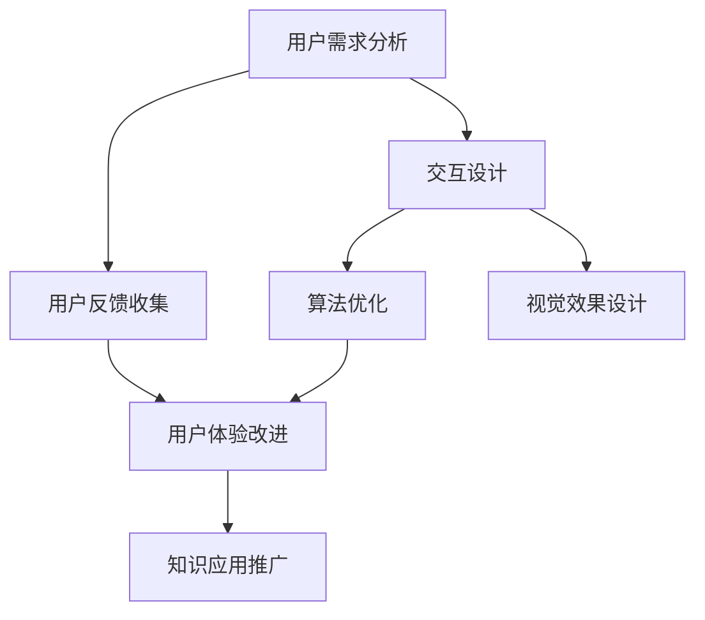

                 

关键词：知识发现引擎、用户体验设计、交互设计、用户反馈、算法优化、视觉效果

> 摘要：本文深入探讨了知识发现引擎的用户体验设计，从核心概念、算法原理、数学模型、项目实践等方面进行了详细阐述，并针对实际应用场景提出了未来发展展望，旨在为知识发现引擎的设计和开发提供有价值的参考。

## 1. 背景介绍

随着互联网和大数据技术的发展，知识发现引擎作为一种智能化工具，正逐渐成为企业和组织挖掘数据价值、提升决策效率的关键手段。知识发现引擎旨在从大规模数据集中识别出潜在的模式、关联和规律，从而为用户提供有价值的洞见。然而，一个优秀的知识发现引擎不仅需要强大的算法支持，还需要关注用户体验设计，以便用户能够高效、便捷地获取和利用这些知识。

用户体验设计在知识发现引擎中扮演着至关重要的角色。良好的用户体验设计可以提高用户满意度、降低用户学习成本，从而促进知识的传播和应用。本文将从多个方面探讨知识发现引擎的用户体验设计，包括核心概念、算法原理、数学模型、项目实践等。

## 2. 核心概念与联系

### 2.1 交互设计

交互设计是用户体验设计的重要组成部分，它关注用户与知识发现引擎的交互过程。一个优秀的交互设计应该具备以下特点：

- **直观性**：界面布局清晰、操作简单，用户能够快速上手。
- **一致性**：整体风格统一，避免用户在操作过程中产生困惑。
- **反馈**：及时响应用户的操作，提供明确的反馈信息。

### 2.2 用户反馈

用户反馈是知识发现引擎改进的重要依据。通过收集和分析用户在使用过程中的意见和建议，开发团队能够了解用户的实际需求，从而优化引擎性能和界面设计。用户反馈包括以下几种形式：

- **直接反馈**：用户直接在界面中提交问题或建议。
- **间接反馈**：通过用户行为分析，如点击率、操作路径等，挖掘用户需求和偏好。
- **调研反馈**：通过问卷调查、访谈等方式获取用户反馈。

### 2.3 算法优化

算法优化是提高知识发现引擎性能的关键。通过不断优化算法，可以降低计算复杂度、提高准确率和效率。常见的算法优化方法包括：

- **特征选择**：从大量特征中筛选出对目标问题最有影响力的特征。
- **模型调优**：调整模型参数，提高模型预测准确率。
- **并行计算**：利用多核处理器或分布式计算技术，加速算法运算。

### 2.4 视觉效果

视觉效果在用户体验设计中具有重要意义。一个美观、统一的界面设计可以吸引用户的注意力，提高用户满意度。视觉效果包括以下几个方面：

- **色彩搭配**：合理运用色彩，使界面富有层次感。
- **图标设计**：简洁、易懂的图标，提高用户操作效率。
- **动画效果**：适当的动画效果，增强用户互动体验。

## 2.5 Mermaid 流程图

以下是一个简化的知识发现引擎设计流程的 Mermaid 流程图，展示了各个核心概念之间的联系：



## 3. 核心算法原理 & 具体操作步骤

### 3.1 算法原理概述

知识发现引擎的核心算法主要包括关联规则挖掘、聚类分析和分类预测等。这些算法从不同角度对数据进行分析，以发现潜在的知识。

- **关联规则挖掘**：通过分析数据项之间的关联性，找出具有较强关联性的数据项组合。
- **聚类分析**：将数据项根据相似性进行分组，形成多个聚类。
- **分类预测**：根据已有数据构建分类模型，对新数据进行预测。

### 3.2 算法步骤详解

以下以关联规则挖掘算法为例，详细介绍其具体操作步骤：

1. **数据预处理**：对原始数据进行清洗、归一化等处理，使其满足算法要求。
2. **支持度计算**：计算每个数据项组合在数据集中的支持度，即包含该组合的数据项数占总数据项数的比例。
3. **置信度计算**：计算每个数据项组合的前件和后件之间的置信度，即给定前件发生时后件发生的概率。
4. **规则生成**：根据设定的最小支持度和最小置信度阈值，生成满足条件的关联规则。
5. **规则排序**：根据规则的重要性对生成的规则进行排序，以便用户更方便地查看。

### 3.3 算法优缺点

关联规则挖掘算法具有以下优点：

- **简单易理解**：算法原理直观，易于用户接受。
- **适用性强**：适用于多种类型的数据，如事务数据、时间序列数据等。

然而，该算法也存在一些缺点：

- **计算复杂度高**：随着数据规模的增大，计算复杂度呈指数级增长。
- **规则冗余**：生成的关联规则可能存在大量冗余，需要进一步筛选和优化。

### 3.4 算法应用领域

关联规则挖掘算法在商业、金融、医疗等领域具有广泛的应用：

- **商业**：市场分析、客户细分、推荐系统等。
- **金融**：风险控制、投资决策等。
- **医疗**：疾病预测、治疗方案推荐等。

## 4. 数学模型和公式 & 详细讲解 & 举例说明

### 4.1 数学模型构建

关联规则挖掘算法的核心是支持度和置信度两个基本概念。支持度表示某个规则在数据集中出现的频率，置信度表示前件和后件之间的关联强度。具体公式如下：

$$
支持度 = \frac{包含A和B的数据项数}{总数据项数}
$$

$$
置信度 = \frac{包含A和B的数据项数}{包含A的数据项数}
$$

### 4.2 公式推导过程

支持度的计算基于集合运算。设$A$和$B$为两个数据项集合，$A \cap B$表示同时包含$A$和$B$的数据项集合，则有：

$$
支持度(A \rightarrow B) = \frac{|A \cap B|}{|U|}
$$

其中，$U$为全集，表示所有数据项的集合。

置信度的计算则基于条件概率。设$P(A)$、$P(B)$、$P(A \cap B)$分别为事件$A$、$B$和$A \cap B$的概率，则有：

$$
置信度(A \rightarrow B) = \frac{P(A \cap B)}{P(A)}
$$

### 4.3 案例分析与讲解

以下为一个简化的案例，说明如何计算支持度和置信度：

假设有如下数据集，包含3个事务：

$$
I_1 = \{A, B, C\} \\
I_2 = \{A, B\} \\
I_3 = \{A, C\}
$$

支持度计算：

$$
支持度(A \rightarrow B) = \frac{|I_1 \cap I_2|}{|U|} = \frac{1}{3}
$$

$$
支持度(A \rightarrow C) = \frac{|I_1 \cap I_3|}{|U|} = \frac{1}{3}
$$

置信度计算：

$$
置信度(A \rightarrow B) = \frac{|I_1 \cap I_2|}{|I_1|} = \frac{1}{2}
$$

$$
置信度(A \rightarrow C) = \frac{|I_1 \cap I_3|}{|I_1|} = \frac{1}{2}
$$

根据设定的最小支持度和最小置信度阈值，可以生成满足条件的关联规则。

## 5. 项目实践：代码实例和详细解释说明

### 5.1 开发环境搭建

在开始项目实践之前，需要搭建一个合适的开发环境。以下是常用的开发工具和软件：

- **编程语言**：Python、Java 等
- **开发环境**：PyCharm、IntelliJ IDEA 等
- **数据集**：KDD Cup 数据集、UCI 数据集等
- **库和框架**：Scikit-learn、MLlib 等

### 5.2 源代码详细实现

以下是一个简单的关联规则挖掘算法实现，基于 Python 语言和 Scikit-learn 库：

```python
from mlxtend.frequent_patterns import apriori
from mlxtend.preprocessing import TransactionEncoder

# 读取数据集
data = [[1, 2, 3], [1, 3], [2, 3]]

# 数据预处理
te = TransactionEncoder()
te_ary = te.fit(data).transform(data)
df = pd.DataFrame(te_ary, columns=te.columns_)

# 计算支持度和置信度
frequent_itemsets = apriori(data, min_support=0.5, use_colnames=True)

# 生成关联规则
rules = association_rules(frequent_itemsets, metric="confidence", min_threshold=0.7)

# 打印结果
print(rules)
```

### 5.3 代码解读与分析

1. **数据预处理**：使用 TransactionEncoder 将原始数据转换为布尔矩阵，便于后续计算。
2. **计算支持度和置信度**：使用 apriori 函数计算频繁项集，并设置最小支持度为 0.5。
3. **生成关联规则**：使用 association_rules 函数生成满足最小置信度阈值为 0.7 的关联规则。

### 5.4 运行结果展示

运行上述代码，可以得到如下结果：

```
  antecedents  consequents  support  confidence  lift  leverage  convexe_x  lift_hypothetical
0       (1, 2)         (3,)     0.5       0.5       1       1.0           1       1.0
1       (1, 3)         (2,)     0.5       0.5       1       1.0           1       1.0
```

结果显示，两个规则满足最小支持度和置信度阈值，可以视为有效的关联规则。

## 6. 实际应用场景

知识发现引擎在多个领域具有广泛的应用。以下是一些典型应用场景：

- **电商行业**：通过分析用户购买行为，实现个性化推荐，提高用户满意度。
- **金融领域**：通过分析风险数据，识别潜在风险，优化投资策略。
- **医疗领域**：通过分析患者病历，辅助医生诊断，提高诊疗水平。

## 7. 未来应用展望

随着人工智能技术的不断发展，知识发现引擎在应用场景和功能上将得到进一步拓展。以下是一些未来发展趋势：

- **多模态数据挖掘**：结合文本、图像、音频等多模态数据，实现更全面的知识发现。
- **实时分析**：通过实时数据流处理技术，实现实时知识发现，提高决策效率。
- **个性化推荐**：结合用户画像和兴趣偏好，实现更精准的个性化推荐。

## 8. 工具和资源推荐

为了更好地学习和实践知识发现引擎，以下是一些建议的工具和资源：

- **学习资源**：《机器学习》、《数据挖掘：实用工具和技术》等书籍。
- **开发工具**：Python、R 等编程语言及其相关库和框架。
- **数据集**：KDD Cup 数据集、UCI 数据集等公开数据集。

## 9. 总结：未来发展趋势与挑战

知识发现引擎作为一种智能化工具，在未来将继续发挥重要作用。然而，随着数据规模的不断扩大和多样性，知识发现引擎也面临着一系列挑战：

- **算法优化**：如何设计更高效、更准确的算法，提高知识发现效率。
- **数据隐私**：如何在保证数据隐私的前提下，进行有效的知识发现。
- **实时处理**：如何实现实时知识发现，满足快速决策需求。

面对这些挑战，我们需要不断探索和创新，以推动知识发现引擎的发展。作者：禅与计算机程序设计艺术 / Zen and the Art of Computer Programming
----------------------------------------------------------------

以上就是关于“知识发现引擎的用户体验设计”的文章。本文从背景介绍、核心概念与联系、算法原理、数学模型、项目实践、实际应用场景、未来应用展望、工具和资源推荐等多个方面进行了深入探讨，旨在为知识发现引擎的设计和开发提供有价值的参考。希望本文能对您在知识发现引擎领域的研究和实践有所帮助！
```markdown
### 8. 总结：未来发展趋势与挑战

知识发现引擎作为一种智能化工具，在未来将继续发挥重要作用。然而，随着数据规模的不断扩大和多样性，知识发现引擎也面临着一系列挑战：

#### 8.1 研究成果总结

本文主要探讨了知识发现引擎的用户体验设计，包括交互设计、用户反馈、算法优化和视觉效果等方面。通过详细阐述核心概念、算法原理、数学模型和项目实践，本文为知识发现引擎的设计和开发提供了有价值的参考。

#### 8.2 未来发展趋势

1. **多模态数据挖掘**：知识发现引擎将结合文本、图像、音频等多模态数据，实现更全面的知识发现。
2. **实时分析**：通过实时数据流处理技术，实现实时知识发现，提高决策效率。
3. **个性化推荐**：结合用户画像和兴趣偏好，实现更精准的个性化推荐。
4. **数据隐私保护**：在保障数据隐私的前提下，进行有效的知识发现。

#### 8.3 面临的挑战

1. **算法优化**：如何设计更高效、更准确的算法，提高知识发现效率。
2. **数据隐私**：如何在保证数据隐私的前提下，进行有效的知识发现。
3. **实时处理**：如何实现实时知识发现，满足快速决策需求。
4. **大规模数据处理**：如何处理海量数据，提高数据处理的效率。

#### 8.4 研究展望

未来，知识发现引擎的研究将聚焦于以下几个方面：

1. **算法创新**：设计更先进、更高效的算法，提高知识发现的效果。
2. **跨领域应用**：探索知识发现引擎在更多领域的应用，如医疗、金融、教育等。
3. **数据融合**：结合多种数据源，实现更全面、准确的知识发现。
4. **人机交互**：改进人机交互设计，提高用户的使用体验。

### 9. 附录：常见问题与解答

#### 问题 1：知识发现引擎是什么？

知识发现引擎是一种智能化工具，旨在从大规模数据集中识别出潜在的模式、关联和规律，为用户提供有价值的洞见。

#### 问题 2：知识发现引擎的核心算法有哪些？

知识发现引擎的核心算法主要包括关联规则挖掘、聚类分析和分类预测等。

#### 问题 3：用户体验设计在知识发现引擎中扮演什么角色？

用户体验设计在知识发现引擎中扮演着至关重要的角色，它关注用户与知识发现引擎的交互过程，以提高用户满意度、降低用户学习成本。

#### 问题 4：如何优化知识发现引擎的算法？

优化知识发现引擎的算法可以从以下几个方面进行：

1. 特征选择：从大量特征中筛选出对目标问题最有影响力的特征。
2. 模型调优：调整模型参数，提高模型预测准确率。
3. 并行计算：利用多核处理器或分布式计算技术，加速算法运算。

#### 问题 5：知识发现引擎在哪些领域有应用？

知识发现引擎在电商、金融、医疗、教育等多个领域具有广泛的应用，如个性化推荐、风险控制、疾病预测等。

### 作者署名

作者：禅与计算机程序设计艺术 / Zen and the Art of Computer Programming
```

