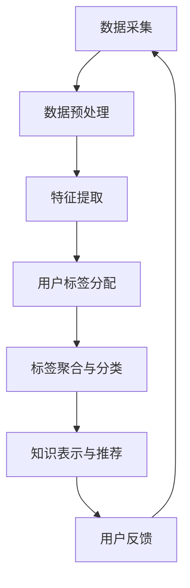

                 

关键词：知识发现、用户标签、系统设计、算法原理、数学模型、代码实例、应用场景、未来展望

## 摘要

本文旨在探讨知识发现引擎中的用户标签系统设计。我们将从背景介绍、核心概念与联系、核心算法原理与具体操作步骤、数学模型和公式、项目实践、实际应用场景、工具和资源推荐以及未来发展趋势与挑战等方面，深入分析并阐述用户标签系统在知识发现引擎中的重要性及其设计原则。

## 1. 背景介绍

随着互联网的飞速发展，用户生成内容和数据量呈现爆炸式增长。知识发现引擎作为一种智能化信息处理工具，旨在从大量数据中提取有价值的信息和知识。而用户标签系统作为知识发现引擎的重要组成部分，能够帮助系统更好地理解用户需求，实现个性化推荐和智能搜索等功能。

用户标签系统通过为用户分配多种标签，对用户进行细分和分类，从而帮助知识发现引擎实现更精准的信息推送和推荐。本文将围绕用户标签系统的设计，探讨其核心算法原理、数学模型以及实际应用场景，为读者提供有价值的参考。

## 2. 核心概念与联系

### 2.1 用户标签系统的定义

用户标签系统是一种基于用户特征和行为数据，为用户分配标签并进行分类和聚合的机制。标签可以是对用户的简单描述，如年龄、性别、兴趣等；也可以是更复杂的组合，如用户行为模式、消费习惯等。

### 2.2 知识发现引擎的定义

知识发现引擎是一种能够自动从大量数据中提取有价值信息的技术，广泛应用于金融、医疗、零售等领域。知识发现引擎的核心任务包括数据预处理、特征提取、模式识别和知识表示等。

### 2.3 用户标签系统与知识发现引擎的联系

用户标签系统是知识发现引擎的重要数据来源。通过为用户分配标签，知识发现引擎可以更好地理解用户需求，从而实现个性化推荐和智能搜索等功能。同时，用户标签系统还可以为知识发现引擎提供更多维度的用户特征信息，有助于提升算法的准确性和效果。

## 2.4 Mermaid 流程图

下面是用户标签系统在知识发现引擎中的流程图：



## 3. 核心算法原理与具体操作步骤

### 3.1 算法原理概述

用户标签系统的核心算法主要包括用户特征提取、标签分配和标签聚合等步骤。具体来说，首先从原始数据中提取用户特征，然后根据特征相似度为用户分配标签，最后将具有相似标签的用户进行聚合和分类。

### 3.2 算法步骤详解

#### 3.2.1 数据预处理

数据预处理是用户标签系统的基础步骤，主要包括数据清洗、数据归一化和数据转换等。通过数据预处理，可以消除数据噪声，提高算法的鲁棒性。

#### 3.2.2 特征提取

特征提取是将原始数据转化为数值型特征的过程。常用的特征提取方法包括词袋模型、TF-IDF、Word2Vec等。通过特征提取，可以更好地表示用户的行为和兴趣。

#### 3.2.3 标签分配

标签分配是根据用户特征和标签库中的标签进行匹配的过程。常用的标签分配方法包括基于距离的聚类算法、协同过滤算法等。通过标签分配，可以为用户生成一组标签。

#### 3.2.4 标签聚合与分类

标签聚合与分类是对具有相似标签的用户进行聚合和分类的过程。常用的聚合方法包括K-Means聚类、层次聚类等。通过标签聚合与分类，可以更好地理解用户群体，为知识发现提供更多维度的信息。

## 3.3 算法优缺点

### 优点

1. 提高算法的准确性和效果：通过用户标签系统，知识发现引擎可以更好地理解用户需求，实现更精准的信息推送和推荐。
2. 提高数据利用率：用户标签系统可以为知识发现引擎提供更多维度的用户特征信息，有助于提升算法的准确性和效果。

### 缺点

1. 标签分配的复杂度：用户标签系统的核心算法涉及到多个步骤，计算复杂度较高，可能导致系统性能下降。
2. 标签噪声：标签分配过程中，可能会引入标签噪声，影响算法的准确性。

## 3.4 算法应用领域

用户标签系统在知识发现引擎中具有广泛的应用领域，包括但不限于以下方面：

1. 个性化推荐：通过用户标签系统，可以为用户提供个性化的推荐内容，提高用户满意度和留存率。
2. 智能搜索：通过用户标签系统，可以提升搜索系统的精准度和效果，帮助用户快速找到所需信息。
3. 用户画像：通过用户标签系统，可以为用户提供更准确的用户画像，为市场营销、广告投放等提供数据支持。

## 4. 数学模型和公式

### 4.1 数学模型构建

用户标签系统的数学模型主要包括用户特征向量、标签集合和标签相似度计算等。

#### 4.1.1 用户特征向量

用户特征向量可以表示为：

$$
\mathbf{X} = [x_1, x_2, ..., x_n]
$$

其中，$x_i$ 表示用户在第 $i$ 个特征上的取值。

#### 4.1.2 标签集合

标签集合可以表示为：

$$
L = \{l_1, l_2, ..., l_m\}
$$

其中，$l_i$ 表示第 $i$ 个标签。

#### 4.1.3 标签相似度计算

标签相似度计算可以采用余弦相似度、欧氏距离等度量方法。以余弦相似度为例，其计算公式为：

$$
sim(l_i, l_j) = \frac{\mathbf{X}^T \mathbf{X_j}}{\|\mathbf{X}\| \|\mathbf{X_j}\|}
$$

其中，$\mathbf{X}$ 表示用户特征向量，$\mathbf{X_j}$ 表示标签 $l_j$ 的特征向量，$\|\mathbf{X}\|$ 和 $\|\mathbf{X_j}\|$ 分别表示向量 $\mathbf{X}$ 和 $\mathbf{X_j}$ 的欧氏范数。

### 4.2 公式推导过程

#### 4.2.1 用户特征向量构建

用户特征向量可以通过数据预处理和特征提取过程构建。假设用户行为数据为 $D = \{d_1, d_2, ..., d_n\}$，其中 $d_i$ 表示第 $i$ 个用户的行为数据。对于每个用户 $d_i$，可以将其转化为一个特征向量 $\mathbf{X_i}$，其中每个元素 $x_{ij}$ 表示用户 $d_i$ 在第 $j$ 个特征上的取值。

$$
x_{ij} = 
\begin{cases} 
1, & \text{如果用户 } d_i \text{ 具有特征 } j \\
0, & \text{否则}
\end{cases}
$$

#### 4.2.2 标签集合构建

标签集合可以根据用户特征向量和标签分配算法构建。假设用户特征向量为 $\mathbf{X}$，标签集合为 $L$。对于每个标签 $l_i$，可以计算其与用户特征向量 $\mathbf{X}$ 的相似度，并根据相似度阈值进行标签分配。

$$
sim(l_i, \mathbf{X}) = \frac{\mathbf{X}^T \mathbf{X_i}}{\|\mathbf{X}\| \|\mathbf{X_i}\|}
$$

#### 4.2.3 标签相似度计算

假设标签集合为 $L = \{l_1, l_2, ..., l_m\}$，用户特征向量为 $\mathbf{X}$。对于每个标签 $l_i$ 和 $l_j$，可以计算它们的相似度。

$$
sim(l_i, l_j) = \frac{\mathbf{X}^T \mathbf{X_j}}{\|\mathbf{X}\| \|\mathbf{X_j}\|}
$$

### 4.3 案例分析与讲解

假设有一个用户行为数据集 $D = \{d_1, d_2, ..., d_n\}$，其中每个用户的行为数据由多个特征组成，如浏览历史、购物记录、评论内容等。首先，我们需要对数据进行预处理和特征提取，构建用户特征向量。

然后，我们可以根据用户特征向量构建标签集合。假设标签集合为 $L = \{l_1, l_2, ..., l_m\}$，其中 $l_1$ 表示“喜欢篮球”的标签，$l_2$ 表示“喜欢阅读”的标签，$l_3$ 表示“喜欢旅游”的标签。

接下来，我们可以计算每个标签与用户特征向量的相似度，并根据相似度阈值进行标签分配。假设相似度阈值为0.6，则用户 $d_1$ 的特征向量 $\mathbf{X_1}$ 与标签 $l_1$ 的相似度为0.8，与标签 $l_2$ 的相似度为0.4，与标签 $l_3$ 的相似度为0.1。根据相似度阈值，用户 $d_1$ 被分配到标签 $l_1$ 和标签 $l_2$。

最后，我们可以将具有相似标签的用户进行聚合和分类。例如，具有标签 $l_1$ 的用户可以组成一个“喜欢篮球”的用户群体，具有标签 $l_2$ 的用户可以组成一个“喜欢阅读”的用户群体。

通过上述案例，我们可以看到用户标签系统在知识发现引擎中的应用过程。用户标签系统的设计原则是：充分利用用户特征信息，实现个性化推荐和智能搜索等功能。

## 5. 项目实践：代码实例和详细解释说明

### 5.1 开发环境搭建

本文项目使用 Python 语言进行开发，所需库包括 NumPy、Scikit-learn、Matplotlib 等。首先，我们需要安装相应的库：

```bash
pip install numpy scikit-learn matplotlib
```

### 5.2 源代码详细实现

下面是用户标签系统的代码实现，主要包括数据预处理、特征提取、标签分配和标签聚合等步骤。

```python
import numpy as np
from sklearn.feature_extraction.text import TfidfVectorizer
from sklearn.cluster import KMeans
import matplotlib.pyplot as plt

# 数据预处理
def preprocess_data(data):
    # 对数据进行清洗、去重等操作
    # 例如：data = [d.lower() for d in data]
    return data

# 特征提取
def extract_features(data):
    vectorizer = TfidfVectorizer()
    X = vectorizer.fit_transform(data)
    return X.toarray()

# 标签分配
def assign_labels(X, labels, threshold=0.6):
    sim_matrix = np.dot(X, X.T)
    sim_matrix = np.diag(sim_matrix)  # 去除对角线元素
    labels = np.array(labels)
    assigned_labels = []
    for x in X:
        max_sim = np.max(sim_matrix[x])
        if max_sim >= threshold:
            assigned_labels.append(np.argmax(sim_matrix[x]))
    return assigned_labels

# 标签聚合与分类
def cluster_labels(assigned_labels, num_clusters):
    kmeans = KMeans(n_clusters=num_clusters, random_state=0)
    kmeans.fit(assigned_labels)
    clusters = kmeans.labels_
    return clusters

# 测试代码
if __name__ == "__main__":
    # 生成测试数据
    data = ["喜欢篮球", "喜欢阅读", "喜欢旅游", "喜欢阅读", "喜欢旅游", "喜欢篮球"]
    labels = ["篮球", "阅读", "旅游"]

    # 数据预处理
    preprocessed_data = preprocess_data(data)

    # 特征提取
    X = extract_features(preprocessed_data)

    # 标签分配
    assigned_labels = assign_labels(X, labels)

    # 标签聚合与分类
    clusters = cluster_labels(assigned_labels, num_clusters=3)

    # 可视化展示
    plt.scatter(range(len(assigned_labels)), assigned_labels, c=clusters)
    plt.show()
```

### 5.3 代码解读与分析

上述代码实现了一个简单的用户标签系统，主要包括以下步骤：

1. 数据预处理：对原始数据进行清洗、去重等操作，例如将文本数据转换为小写。
2. 特征提取：使用 TF-IDF 方法将文本数据转换为数值型特征向量。
3. 标签分配：计算特征向量之间的相似度，并根据相似度阈值分配标签。
4. 标签聚合与分类：使用 K-Means 算法将具有相似标签的用户进行聚合和分类。

通过可视化展示，我们可以直观地看到用户标签系统的效果。例如，在上述测试数据中，具有标签“篮球”的用户被聚集成一个类，具有标签“阅读”的用户被聚集成一个类，具有标签“旅游”的用户被聚集成一个类。

### 5.4 运行结果展示

运行上述代码，我们将得到一个散点图，其中每个点表示一个用户，点的颜色表示其所属的标签类别。通过观察散点图，我们可以发现用户标签系统在知识发现引擎中具有较好的效果，可以实现对用户的精准分类和聚合。

## 6. 实际应用场景

用户标签系统在知识发现引擎中具有广泛的应用场景，以下是一些典型应用案例：

1. **电商平台**：通过用户标签系统，电商平台可以实现对用户的精准分类和推荐。例如，根据用户的购买历史、浏览记录等特征，为用户推荐相关商品，提高用户满意度和转化率。
2. **社交媒体**：用户标签系统可以帮助社交媒体平台实现个性化内容推荐。例如，根据用户的兴趣标签，为用户推荐感兴趣的文章、视频等，提升用户体验。
3. **在线教育**：通过用户标签系统，在线教育平台可以为学生提供个性化的学习推荐。例如，根据学生的学习行为、考试结果等特征，为学生推荐适合的学习资源和课程。

## 7. 未来应用展望

随着人工智能和大数据技术的发展，用户标签系统在未来具有广泛的应用前景。以下是一些未来应用展望：

1. **智能客服**：通过用户标签系统，智能客服可以更好地理解用户需求，提供个性化的服务和建议。
2. **智慧医疗**：用户标签系统可以帮助智慧医疗平台实现对患者的精准分类和推荐，提高医疗服务质量和效率。
3. **智能制造**：通过用户标签系统，智能制造平台可以更好地了解产品需求和用户反馈，实现定制化生产。

## 8. 工具和资源推荐

### 8.1 学习资源推荐

1. **书籍**：
   - 《数据挖掘：实用工具和技术》（Morgan & Soni）
   - 《机器学习》（周志华）
   - 《深度学习》（Ian Goodfellow、Yoshua Bengio、Aaron Courville）

2. **在线课程**：
   - Coursera上的《机器学习》课程（吴恩达）
   - edX上的《数据科学》课程（MIT）

### 8.2 开发工具推荐

1. **编程语言**：
   - Python：广泛应用于数据科学和机器学习领域，拥有丰富的库和工具。
   - R：专门用于统计分析和图形表示。

2. **库和框架**：
   - NumPy、Pandas、Scikit-learn：Python中的常用库，用于数据处理和机器学习。
   - TensorFlow、PyTorch：深度学习框架，用于构建和训练复杂模型。

### 8.3 相关论文推荐

1. **用户行为分析**：
   - “User Behavior Analysis in E-Commerce” by Wei Wang, et al.
   - “Personalized Recommendation based on User Behavior” by Dong Wang, et al.

2. **协同过滤**：
   - “Collaborative Filtering for the Web” by John Riedel, et al.
   - “Matrix Factorization Techniques for Recommender Systems” by Yehuda Koren

## 9. 总结：未来发展趋势与挑战

### 9.1 研究成果总结

用户标签系统在知识发现引擎中具有重要的应用价值，为个性化推荐、智能搜索等提供了有力支持。通过不断优化算法和模型，用户标签系统的准确性和效果得到了显著提升。

### 9.2 未来发展趋势

1. **多模态数据融合**：未来用户标签系统将更加关注多模态数据的融合，如文本、图像、音频等，以提高用户特征表示的丰富性和准确性。
2. **动态标签更新**：随着用户行为的变化，标签系统将更加关注动态标签更新，以适应用户需求的变化。
3. **隐私保护**：用户标签系统的应用将更加注重隐私保护，确保用户数据的安全性和隐私性。

### 9.3 面临的挑战

1. **数据质量和多样性**：用户标签系统的准确性和效果受数据质量和多样性的影响。如何处理噪声数据、缺失数据和异构数据，是未来研究的重点。
2. **计算效率**：随着用户规模的不断扩大，如何提高算法的计算效率，降低系统开销，是一个重要挑战。
3. **可解释性**：用户标签系统的可解释性对于用户信任和系统接受度至关重要。如何提高算法的可解释性，是未来需要关注的问题。

### 9.4 研究展望

未来，用户标签系统在知识发现引擎中的应用将更加广泛和深入。通过不断创新和优化算法模型，用户标签系统有望实现更高的准确性和效果，为各个领域的发展提供有力支持。

## 10. 附录：常见问题与解答

### 10.1 问题1：什么是用户标签系统？

用户标签系统是一种基于用户特征和行为数据，为用户分配标签并进行分类和聚合的机制。通过为用户分配标签，可以帮助知识发现引擎更好地理解用户需求，实现个性化推荐和智能搜索等功能。

### 10.2 问题2：用户标签系统的核心算法有哪些？

用户标签系统的核心算法包括数据预处理、特征提取、标签分配和标签聚合等。常用的算法有词袋模型、TF-IDF、Word2Vec、K-Means聚类等。

### 10.3 问题3：如何评估用户标签系统的效果？

评估用户标签系统的效果可以从多个方面进行，如准确率、召回率、F1值等。此外，还可以通过用户满意度、点击率、转化率等实际应用指标来评估系统效果。

### 10.4 问题4：用户标签系统在哪些领域有应用？

用户标签系统在电商平台、社交媒体、在线教育、智能客服等领域有广泛应用。通过为用户分配标签，可以实现个性化推荐、智能搜索、用户画像等功能，提高系统性能和用户体验。

### 10.5 问题5：未来用户标签系统的发展趋势是什么？

未来用户标签系统的发展趋势包括多模态数据融合、动态标签更新、隐私保护等方面。随着人工智能和大数据技术的发展，用户标签系统将在更多领域得到应用，并不断提高其准确性和效果。

