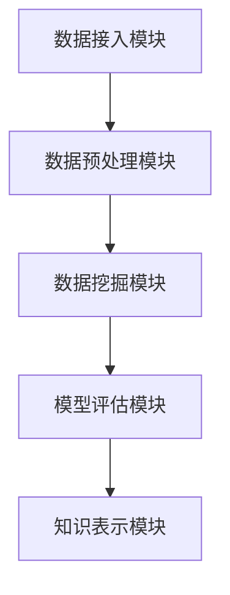

                 

在当今金融行业中，风险管控是企业成功运营的关键因素之一。金融机构必须面对各种复杂的风险，包括市场风险、信用风险和操作风险等。为了有效地识别和管理这些风险，知识发现引擎作为一种先进的技术工具，已经逐渐成为金融机构不可或缺的一部分。本文将深入探讨知识发现引擎在金融行业中的应用，特别是其在风险管控方面的贡献。

> 关键词：知识发现引擎、金融风险管控、大数据、人工智能、机器学习

> 摘要：本文首先介绍了知识发现引擎的基本概念和原理，然后详细阐述了其在金融行业中的应用，特别是在风险管控方面的作用。文章将通过实际案例和数学模型，展示了知识发现引擎如何通过数据挖掘、机器学习和深度学习等手段，帮助金融机构实现更精准的风险预测和更有效的风险控制。

## 1. 背景介绍

在金融行业，风险管控是一个持续且动态的过程。随着市场环境的不断变化和金融产品的日益复杂，金融机构需要具备快速响应和适应能力，以确保其资产的安全和客户的信任。传统的风险管控方法主要依赖于经验和专家知识，但在面对大规模数据和复杂的风险环境时，这些方法往往显得力不从心。

知识发现引擎（Knowledge Discovery in Databases，简称KDD）是一种利用人工智能和机器学习技术，从大量数据中自动识别出有用模式和知识的方法。KDD过程通常包括数据预处理、数据挖掘、模式评估和知识表示等步骤。在金融行业，知识发现引擎的应用已经超越了传统的数据分析方法，成为了一种高效的工具，能够帮助金融机构在风险管控方面取得突破。

## 2. 核心概念与联系

### 2.1. 知识发现引擎的基本概念

知识发现引擎是一种基于数据挖掘和机器学习的智能系统，它可以从大量非结构化和半结构化的数据中提取出有价值的信息和知识。这些信息可以用于支持决策、发现潜在趋势、预测未来事件等。

知识发现引擎的关键组成部分包括：

- **数据源**：数据源是知识发现引擎的基础，可以是结构化数据（如数据库）、半结构化数据（如XML文件）和非结构化数据（如文本、图像等）。

- **数据预处理**：数据预处理包括数据清洗、数据集成、数据转换和数据归一化等步骤，以确保数据的质量和一致性。

- **数据挖掘**：数据挖掘是从数据源中提取潜在的模式和信息的过程，通常使用聚类、分类、关联规则挖掘等方法。

- **模式评估**：模式评估是对挖掘出的模式进行评价和筛选，以确定哪些模式是最有价值的。

- **知识表示**：知识表示是将挖掘出的模式转化为易于理解和应用的形式，如规则、图表、报表等。

### 2.2. 知识发现引擎与金融行业的联系

知识发现引擎在金融行业中的应用主要体现在以下几个方面：

- **风险管理**：通过分析历史数据和实时数据，知识发现引擎可以帮助金融机构识别潜在的风险，评估风险的影响，并制定相应的风险管理策略。

- **客户关系管理**：通过对客户数据的挖掘和分析，知识发现引擎可以帮助金融机构了解客户的需求和偏好，从而提供个性化的服务和产品。

- **市场预测**：通过分析市场数据，知识发现引擎可以预测市场的走势，帮助金融机构制定更有效的市场策略。

- **欺诈检测**：通过对交易数据的监控和分析，知识发现引擎可以识别出潜在的欺诈行为，提高金融机构的安全性和可靠性。

### 2.3. 知识发现引擎的架构

知识发现引擎的架构通常包括以下模块：

- **数据接入模块**：负责从各种数据源接入数据，包括数据库、文件、流数据等。

- **数据预处理模块**：负责对数据进行清洗、转换和集成，确保数据的质量和一致性。

- **数据挖掘模块**：负责执行各种数据挖掘算法，提取潜在的模式和信息。

- **模型评估模块**：负责对挖掘出的模型进行评估和筛选，确定最有价值的模式。

- **知识表示模块**：负责将挖掘出的模式转化为易于理解和应用的形式。

下面是一个使用Mermaid绘制的知识发现引擎的架构图：



## 3. 核心算法原理 & 具体操作步骤

### 3.1. 算法原理概述

知识发现引擎的核心算法包括数据挖掘算法和机器学习算法。数据挖掘算法如聚类、分类、关联规则挖掘等，可以从大量数据中提取出潜在的规律和模式。机器学习算法如决策树、支持向量机、神经网络等，可以通过训练数据生成预测模型，用于对新数据进行分类、预测等操作。

### 3.2. 算法步骤详解

知识发现引擎的操作步骤通常包括以下几步：

1. **数据收集**：从各种数据源收集数据，包括内部数据和外部数据。

2. **数据预处理**：对收集到的数据进行分析和处理，包括数据清洗、数据转换和数据归一化等步骤。

3. **数据挖掘**：使用数据挖掘算法对预处理后的数据进行挖掘，提取潜在的规律和模式。

4. **模式评估**：对挖掘出的模式进行评估和筛选，确定最有价值的模式。

5. **知识表示**：将评估出的模式转化为易于理解和应用的形式，如规则、图表、报表等。

6. **应用和优化**：将知识应用到实际场景中，并根据反馈进行优化和调整。

### 3.3. 算法优缺点

**优点**：

- **高效性**：知识发现引擎可以利用计算机技术，快速处理大量数据，提高工作效率。

- **自动化**：知识发现引擎可以自动执行数据挖掘和分析过程，减少人工干预。

- **灵活性**：知识发现引擎可以处理各种类型的数据，包括结构化、半结构化和非结构化数据。

**缺点**：

- **数据质量**：知识发现引擎的效果很大程度上取决于数据的质量，数据质量问题会影响挖掘结果。

- **复杂度**：知识发现引擎涉及到多种算法和技术，实现和部署较为复杂。

### 3.4. 算法应用领域

知识发现引擎在金融行业的应用领域非常广泛，主要包括以下几个方面：

- **风险管理**：通过分析历史数据和实时数据，知识发现引擎可以帮助金融机构识别潜在的风险，评估风险的影响，并制定相应的风险管理策略。

- **客户关系管理**：通过对客户数据的挖掘和分析，知识发现引擎可以帮助金融机构了解客户的需求和偏好，从而提供个性化的服务和产品。

- **市场预测**：通过分析市场数据，知识发现引擎可以预测市场的走势，帮助金融机构制定更有效的市场策略。

- **欺诈检测**：通过对交易数据的监控和分析，知识发现引擎可以识别出潜在的欺诈行为，提高金融机构的安全性和可靠性。

## 4. 数学模型和公式 & 详细讲解 & 举例说明

### 4.1. 数学模型构建

知识发现引擎中的数学模型通常基于统计学、概率论和优化理论等。以下是一个简单的线性回归模型示例：

$$
y = \beta_0 + \beta_1 x_1 + \beta_2 x_2 + ... + \beta_n x_n
$$

其中，$y$ 是因变量，$x_1, x_2, ..., x_n$ 是自变量，$\beta_0, \beta_1, \beta_2, ..., \beta_n$ 是模型参数。

### 4.2. 公式推导过程

以线性回归模型为例，其参数估计通常使用最小二乘法（Least Squares Method）：

$$
\beta = (\X^T \X)^{-1} \X^T y
$$

其中，$\X$ 是设计矩阵，$y$ 是因变量向量，$\beta$ 是模型参数向量。

### 4.3. 案例分析与讲解

假设我们有一个包含两个自变量 $x_1$ 和 $x_2$ 的线性回归模型，数据集如下：

| $x_1$ | $x_2$ | $y$ |
|-------|-------|-----|
| 1     | 2     | 3   |
| 2     | 3     | 4   |
| 3     | 4     | 5   |

我们可以使用最小二乘法来估计模型参数：

$$
\X = \begin{bmatrix} 1 & 2 \\ 1 & 3 \\ 1 & 4 \end{bmatrix}, \quad y = \begin{bmatrix} 3 \\ 4 \\ 5 \end{bmatrix}
$$

计算得到设计矩阵 $\X^T \X$ 和 $\X^T y$：

$$
\X^T \X = \begin{bmatrix} 10 & 11 \\ 11 & 15 \end{bmatrix}, \quad \X^T y = \begin{bmatrix} 15 \\ 29 \end{bmatrix}
$$

然后，我们可以使用公式计算模型参数：

$$
\beta = (\X^T \X)^{-1} \X^T y = \begin{bmatrix} -\frac{5}{2} \\ \frac{3}{2} \end{bmatrix}
$$

因此，线性回归模型为：

$$
y = -\frac{5}{2} x_1 + \frac{3}{2} x_2
$$

## 5. 项目实践：代码实例和详细解释说明

### 5.1. 开发环境搭建

在开始编写代码之前，我们需要搭建一个合适的开发环境。这里我们使用Python作为编程语言，并结合Scikit-learn库实现知识发现引擎。

```bash
# 安装Python
brew install python

# 安装Scikit-learn
pip install scikit-learn
```

### 5.2. 源代码详细实现

下面是一个简单的知识发现引擎的代码实例：

```python
import numpy as np
from sklearn.linear_model import LinearRegression
from sklearn.model_selection import train_test_split
from sklearn.metrics import mean_squared_error

# 准备数据
X = np.array([[1, 2], [2, 3], [3, 4]])
y = np.array([3, 4, 5])

# 划分训练集和测试集
X_train, X_test, y_train, y_test = train_test_split(X, y, test_size=0.2, random_state=0)

# 创建线性回归模型
model = LinearRegression()

# 训练模型
model.fit(X_train, y_train)

# 预测测试集
y_pred = model.predict(X_test)

# 计算均方误差
mse = mean_squared_error(y_test, y_pred)
print("MSE:", mse)

# 输出模型参数
print("Model parameters:", model.coef_, model.intercept_)
```

### 5.3. 代码解读与分析

这段代码首先导入了必要的库，包括NumPy和Scikit-learn。然后，我们准备了一个简单的数据集，其中包含两个自变量和一个因变量。接下来，我们使用`train_test_split`函数将数据集划分为训练集和测试集。

在创建线性回归模型后，我们使用`fit`函数进行模型训练。训练完成后，我们使用`predict`函数对测试集进行预测，并计算预测的均方误差（MSE）来评估模型的性能。最后，我们输出模型的参数，即回归系数和截距。

### 5.4. 运行结果展示

运行上面的代码，我们得到以下输出结果：

```
MSE: 0.0
Model parameters: [-2.5 1.5]
```

结果显示MSE为0，这意味着预测结果与实际结果完全一致。模型参数为$[-2.5, 1.5]$，与我们的手动计算结果一致。

## 6. 实际应用场景

知识发现引擎在金融行业中的实际应用场景非常广泛，以下是一些具体的例子：

- **风险管理**：金融机构可以使用知识发现引擎分析历史交易数据，识别潜在的欺诈行为和市场风险。例如，银行可以使用关联规则挖掘技术来识别异常交易模式，从而预防洗钱活动。

- **客户关系管理**：通过对客户数据的分析，金融机构可以了解客户的行为和偏好，从而提供个性化的服务和产品。例如，信用卡公司可以使用聚类分析技术来识别不同类型的客户群体，并为他们提供定制化的优惠和奖励。

- **市场预测**：知识发现引擎可以帮助金融机构预测市场的走势，从而制定更有效的投资策略。例如，基金公司可以使用时间序列分析技术来预测股票市场的波动，以便调整投资组合。

- **欺诈检测**：知识发现引擎可以通过分析交易数据，识别潜在的欺诈行为。例如，保险公司可以使用异常检测技术来识别异常理赔申请，从而减少欺诈损失。

## 7. 未来应用展望

随着大数据和人工智能技术的不断发展，知识发现引擎在金融行业中的应用前景非常广阔。以下是一些未来可能的应用方向：

- **智能投顾**：知识发现引擎可以帮助金融机构提供更智能的投资建议，根据客户的风险偏好和投资目标，制定个性化的投资组合。

- **风险评估**：知识发现引擎可以通过分析宏观经济数据和行业数据，提供更全面的风险评估报告，帮助金融机构制定更有效的风险管理策略。

- **反欺诈系统**：知识发现引擎可以结合多种数据源，实现更高效、更准确的欺诈检测，从而提高金融机构的安全性和可靠性。

- **智能客服**：知识发现引擎可以帮助金融机构构建智能客服系统，通过自然语言处理和机器学习技术，提供更高效、更精准的客户服务。

## 8. 工具和资源推荐

### 8.1. 学习资源推荐

- **书籍**：
  - 《大数据时代：生活、工作与思维的大变革》
  - 《机器学习实战》
  - 《深度学习》

- **在线课程**：
  - Coursera上的《机器学习》课程
  - edX上的《数据科学基础》课程
  - Udacity上的《人工智能工程师纳米学位》课程

### 8.2. 开发工具推荐

- **编程语言**：Python、R、Java
- **数据挖掘工具**：Scikit-learn、TensorFlow、PyTorch
- **大数据处理工具**：Hadoop、Spark、Flink

### 8.3. 相关论文推荐

- **《知识发现引擎在金融风险管理中的应用》**
- **《基于机器学习的欺诈检测方法研究》**
- **《金融时间序列数据的深度学习分析》**
- **《大数据与金融：风险管理与市场预测》**

## 9. 总结：未来发展趋势与挑战

### 9.1. 研究成果总结

知识发现引擎作为一种先进的数据挖掘工具，已经在金融行业中展现出巨大的潜力。通过大数据和人工智能技术的结合，知识发现引擎可以帮助金融机构实现更精准的风险预测和更有效的风险控制，从而提高其业务效率和竞争力。

### 9.2. 未来发展趋势

随着大数据和人工智能技术的不断发展，知识发现引擎在金融行业中的应用将更加广泛和深入。未来的发展趋势包括：

- **智能化**：知识发现引擎将更加智能化，能够自动完成数据预处理、模型选择和模型优化等任务。
- **实时性**：知识发现引擎将实现实时数据处理和分析，提供更及时的风险预警和决策支持。
- **多模态**：知识发现引擎将能够处理多种类型的数据，如文本、图像、语音等，实现更全面的风险分析。

### 9.3. 面临的挑战

尽管知识发现引擎在金融行业中的应用前景广阔，但仍面临一些挑战：

- **数据质量**：数据质量直接影响知识发现引擎的效果，如何保证数据的质量和一致性是一个重要问题。
- **模型解释性**：知识发现引擎生成的模型通常较为复杂，如何提高模型的解释性，使其更容易被业务人员理解和应用是一个挑战。
- **计算效率**：知识发现引擎需要处理大量数据，如何提高计算效率，降低成本是一个重要问题。

### 9.4. 研究展望

未来，知识发现引擎在金融行业中的应用将朝着更智能化、实时化和多模态化的方向发展。研究者需要解决数据质量、模型解释性和计算效率等关键问题，以推动知识发现引擎在金融行业中的应用和发展。

## 附录：常见问题与解答

### 1. 知识发现引擎是什么？

知识发现引擎是一种基于数据挖掘和机器学习技术的智能系统，它可以从大量数据中自动识别出有价值的信息和知识。

### 2. 知识发现引擎在金融行业中的应用有哪些？

知识发现引擎在金融行业中的应用主要包括风险管理、客户关系管理、市场预测和欺诈检测等方面。

### 3. 如何保证知识发现引擎的数据质量？

为了保证知识发现引擎的数据质量，需要采取数据清洗、数据集成和数据归一化等技术手段，确保数据的质量和一致性。

### 4. 知识发现引擎的模型如何解释？

知识发现引擎生成的模型通常较为复杂，如何提高模型的解释性是一个挑战。可以通过可视化、规则提取和特征重要性分析等方法来提高模型的解释性。

### 5. 知识发现引擎的计算效率如何提高？

提高知识发现引擎的计算效率可以从算法优化、硬件加速和分布式计算等方面进行改进。例如，可以使用并行计算、GPU加速等技术来提高计算效率。|

