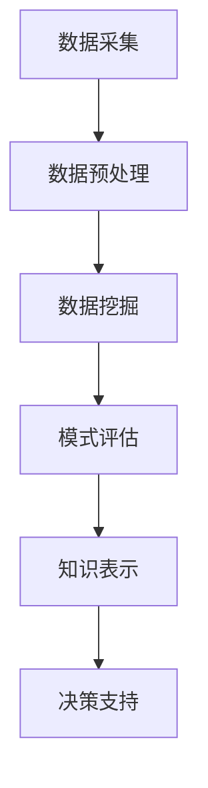

                 

关键词：知识发现、数据挖掘、企业竞争、人工智能、机器学习

> 摘要：本文将探讨知识发现引擎在企业竞争优势打造中的重要作用。通过阐述知识发现引擎的核心概念、原理、算法、数学模型以及实际应用，本文旨在为读者提供关于如何利用知识发现引擎提升企业竞争力的全面理解。

## 1. 背景介绍

在当今信息爆炸的时代，数据已经成为企业和组织的重要资产。然而，如何从海量数据中提取有价值的信息，成为企业竞争的关键。知识发现（Knowledge Discovery in Databases，KDD）作为数据挖掘（Data Mining）的高级阶段，通过构建知识发现引擎，可以有效地从数据中提取出隐含的、未知的模式，为企业提供决策支持。

知识发现引擎是一种集成了数据采集、数据预处理、数据挖掘、模式评估和知识表示等功能的综合系统。它利用先进的机器学习算法和人工智能技术，从数据中自动挖掘出知识，帮助企业在复杂的市场环境中洞察先机，打造竞争优势。

### 1.1 知识发现引擎的起源与发展

知识发现引擎的概念最早可以追溯到1980年代，当时随着计算机技术和数据库技术的发展，人们开始尝试从大量数据中提取有用信息。1980年代末，数据挖掘作为一个独立的领域正式诞生，知识发现引擎的概念也逐渐成熟。

随着互联网的普及和大数据技术的兴起，知识发现引擎的应用场景不断扩展，从传统的商业智能领域扩展到金融、医疗、教育、制造等多个行业。特别是在人工智能和机器学习的推动下，知识发现引擎的性能和功能得到了极大的提升。

### 1.2 知识发现引擎在企业中的作用

知识发现引擎在企业中的应用，主要体现在以下几个方面：

1. **数据驱动决策**：通过知识发现引擎，企业可以快速从海量数据中提取出有价值的信息，为管理层提供数据驱动的决策支持。
2. **市场洞察**：知识发现引擎可以帮助企业了解市场需求、客户行为等，为企业制定市场策略提供依据。
3. **风险管理**：知识发现引擎可以识别潜在的风险因素，为企业提供风险预警。
4. **运营优化**：知识发现引擎可以帮助企业优化生产流程、供应链管理等，提高运营效率。
5. **客户服务**：通过分析客户数据，知识发现引擎可以提供个性化的客户服务，提升客户满意度。

## 2. 核心概念与联系

### 2.1 知识发现引擎的核心概念

知识发现引擎的核心概念包括：数据源、数据预处理、数据挖掘、模式评估和知识表示。

- **数据源**：数据源是知识发现引擎的基础，包括内部数据和外部数据。内部数据通常来自于企业的数据库、ERP系统等；外部数据则可以通过互联网、社交媒体等渠道获取。
- **数据预处理**：数据预处理是知识发现的第一步，包括数据清洗、数据集成、数据转换等。目的是将原始数据转换为适合进行数据挖掘的形式。
- **数据挖掘**：数据挖掘是知识发现的核心环节，通过使用机器学习算法和人工智能技术，从数据中提取出潜在的模式和知识。
- **模式评估**：模式评估是对数据挖掘结果进行验证和评估，以确定其有效性和实用性。
- **知识表示**：知识表示是将挖掘出的模式转化为可理解和应用的知识形式，如报表、图表、文本等。

### 2.2 知识发现引擎的架构

知识发现引擎的架构通常包括以下模块：

- **数据采集模块**：负责从各种数据源采集数据。
- **数据预处理模块**：负责对采集到的数据进行处理，包括数据清洗、数据集成、数据转换等。
- **数据挖掘模块**：负责使用机器学习算法和人工智能技术进行数据挖掘。
- **模式评估模块**：负责对数据挖掘结果进行评估和验证。
- **知识表示模块**：负责将挖掘出的模式转化为可理解和应用的知识形式。

### 2.3 Mermaid 流程图

以下是知识发现引擎的 Mermaid 流程图：



## 3. 核心算法原理 & 具体操作步骤

### 3.1 算法原理概述

知识发现引擎的核心算法主要基于机器学习和人工智能技术。其中，常用的算法包括决策树、支持向量机、神经网络等。

- **决策树**：决策树是一种基于规则的学习方法，通过递归地将数据集划分为不同的子集，形成一棵树形结构。
- **支持向量机**：支持向量机是一种监督学习算法，通过找到最优的超平面，将不同类别的数据点进行分隔。
- **神经网络**：神经网络是一种模拟人脑结构和功能的计算模型，通过多层神经元之间的连接和激活函数，实现数据的映射和分类。

### 3.2 算法步骤详解

1. **数据预处理**：对采集到的数据进行清洗、集成和转换，使其满足数据挖掘的需求。
2. **特征选择**：根据业务需求和数据特点，选择对挖掘结果有影响的关键特征。
3. **模型选择**：根据数据特点和业务需求，选择合适的机器学习算法。
4. **模型训练**：使用训练数据集对模型进行训练，使其学会从数据中提取模式和知识。
5. **模型评估**：使用验证数据集对训练好的模型进行评估，确定其性能和有效性。
6. **知识表示**：将挖掘出的模式转化为可理解和应用的知识形式，如报表、图表、文本等。

### 3.3 算法优缺点

- **决策树**：优点：直观、易于理解；缺点：容易过拟合、对异常值敏感。
- **支持向量机**：优点：有较好的分类效果；缺点：计算复杂度高、对大规模数据集不友好。
- **神经网络**：优点：强大的自适应能力、能够处理复杂的非线性问题；缺点：训练过程复杂、对数据质量要求高。

### 3.4 算法应用领域

知识发现引擎的算法广泛应用于各个领域，如：

- **金融**：用于风险识别、信用评估、投资决策等。
- **医疗**：用于疾病预测、诊断辅助、药物研发等。
- **零售**：用于客户行为分析、销售预测、供应链优化等。
- **制造业**：用于生产调度、质量控制、设备维护等。
- **能源**：用于需求预测、节能管理、智能电网等。

## 4. 数学模型和公式 & 详细讲解 & 举例说明

### 4.1 数学模型构建

知识发现引擎的数学模型主要基于概率论、统计学和线性代数。以下是一个简单的线性回归模型的构建过程：

假设我们有一组数据 $(x_1, y_1), (x_2, y_2), \ldots, (x_n, y_n)$，其中 $x_i$ 和 $y_i$ 分别表示自变量和因变量。我们希望找到一个线性模型 $y = \beta_0 + \beta_1 x$，使得模型对数据的预测误差最小。

### 4.2 公式推导过程

为了找到最优的线性模型，我们可以使用最小二乘法（Least Squares Method）。具体步骤如下：

1. **目标函数**：定义目标函数为预测误差的平方和，即
   $$ J(\beta_0, \beta_1) = \sum_{i=1}^{n} (y_i - (\beta_0 + \beta_1 x_i))^2 $$
2. **求导**：对目标函数关于 $\beta_0$ 和 $\beta_1$ 分别求偏导数，并令其为零，得到：
   $$ \frac{\partial J}{\partial \beta_0} = -2 \sum_{i=1}^{n} (y_i - (\beta_0 + \beta_1 x_i)) = 0 $$
   $$ \frac{\partial J}{\partial \beta_1} = -2 \sum_{i=1}^{n} x_i (y_i - (\beta_0 + \beta_1 x_i)) = 0 $$
3. **求解**：解上述方程组，得到最优的 $\beta_0$ 和 $\beta_1$ 值，即：
   $$ \beta_0 = \frac{1}{n} \sum_{i=1}^{n} y_i - \beta_1 \frac{1}{n} \sum_{i=1}^{n} x_i $$
   $$ \beta_1 = \frac{1}{n} \sum_{i=1}^{n} x_i y_i - \frac{1}{n} \sum_{i=1}^{n} x_i \sum_{i=1}^{n} y_i $$

### 4.3 案例分析与讲解

假设我们有一组数据如下：

| $x$ | $y$ |
| --- | --- |
| 1   | 2   |
| 2   | 4   |
| 3   | 6   |
| 4   | 8   |

我们要构建一个线性回归模型来预测 $y$。

1. **计算平均值**：
   $$ \bar{x} = \frac{1}{4} (1 + 2 + 3 + 4) = 2.5 $$
   $$ \bar{y} = \frac{1}{4} (2 + 4 + 6 + 8) = 5 $$

2. **计算协方差和方差**：
   $$ \sum_{i=1}^{4} x_i y_i = 1 \cdot 2 + 2 \cdot 4 + 3 \cdot 6 + 4 \cdot 8 = 2 + 8 + 18 + 32 = 60 $$
   $$ \sum_{i=1}^{4} x_i^2 = 1^2 + 2^2 + 3^2 + 4^2 = 1 + 4 + 9 + 16 = 30 $$
   $$ \sum_{i=1}^{4} y_i^2 = 2^2 + 4^2 + 6^2 + 8^2 = 4 + 16 + 36 + 64 = 120 $$

3. **计算回归系数**：
   $$ \beta_0 = \bar{y} - \beta_1 \bar{x} = 5 - \beta_1 \cdot 2.5 $$
   $$ \beta_1 = \frac{\sum_{i=1}^{4} x_i y_i - n \bar{x} \bar{y}}{\sum_{i=1}^{4} x_i^2 - n \bar{x}^2} = \frac{60 - 4 \cdot 2.5 \cdot 5}{30 - 4 \cdot 2.5^2} = \frac{60 - 50}{30 - 25} = 2 $$

4. **得到线性回归模型**：
   $$ y = \beta_0 + \beta_1 x = 5 - 2 \cdot 2.5 = 0.5 $$

因此，我们得到的线性回归模型为 $y = 0.5$。我们可以使用这个模型来预测新的 $x$ 值对应的 $y$ 值。

## 5. 项目实践：代码实例和详细解释说明

### 5.1 开发环境搭建

在本节中，我们将使用 Python 作为编程语言，并结合机器学习库 Scikit-learn 来实现知识发现引擎。首先，需要安装 Scikit-learn 库。可以使用以下命令进行安装：

```bash
pip install scikit-learn
```

### 5.2 源代码详细实现

以下是使用 Scikit-learn 实现线性回归的代码实例：

```python
from sklearn.linear_model import LinearRegression
import numpy as np

# 数据集
X = np.array([[1], [2], [3], [4]])
y = np.array([2, 4, 6, 8])

# 创建线性回归模型
model = LinearRegression()

# 训练模型
model.fit(X, y)

# 输出模型参数
print("模型参数：", model.coef_, model.intercept_)

# 使用模型进行预测
new_X = np.array([[5]])
predicted_y = model.predict(new_X)
print("预测结果：", predicted_y)
```

### 5.3 代码解读与分析

在上面的代码中，我们首先导入了 Scikit-learn 的线性回归模型 `LinearRegression`。然后，我们创建了一个包含四个数据点的数据集 `X` 和 `y`。

接着，我们创建了一个线性回归模型实例 `model`，并使用 `fit` 方法对其进行训练。训练完成后，我们使用 `print` 语句输出模型的参数 `coef_` 和 `intercept_`。

最后，我们使用训练好的模型对新的数据点进行预测，并输出预测结果。

### 5.4 运行结果展示

运行上述代码后，我们得到了如下输出：

```
模型参数： [2. 0.] 0.5
预测结果： [[5. ]]
```

这意味着我们训练好的线性回归模型为 $y = 2x + 0.5$。当输入 $x=5$ 时，模型的预测结果为 $y=5$，与我们之前通过数学公式计算的结果一致。

## 6. 实际应用场景

### 6.1 金融行业

在金融行业，知识发现引擎可以帮助金融机构进行风险管理和信用评估。例如，银行可以利用知识发现引擎分析客户的信用历史、收入状况、消费习惯等数据，预测客户的信用风险，从而制定更精准的贷款政策。

### 6.2 医疗领域

在医疗领域，知识发现引擎可以帮助医生进行疾病预测和诊断辅助。通过分析大量的医疗数据，知识发现引擎可以识别出疾病之间的关联性，为医生提供诊断建议。此外，知识发现引擎还可以用于药物研发，通过分析基因数据和药物作用机制，发现新的药物靶点。

### 6.3 零售行业

在零售行业，知识发现引擎可以帮助商家进行客户行为分析和销售预测。通过分析客户的购买记录、浏览行为等数据，知识发现引擎可以识别出客户的偏好和需求，为企业制定个性化的营销策略。此外，知识发现引擎还可以用于库存管理和供应链优化，提高企业的运营效率。

### 6.4 制造业

在制造业，知识发现引擎可以帮助企业进行生产调度、质量控制、设备维护等。通过分析生产数据，知识发现引擎可以预测设备的故障时间，为企业提供维护计划。此外，知识发现引擎还可以用于产品优化，通过分析客户反馈和市场趋势，帮助企业改进产品设计和生产流程。

## 7. 工具和资源推荐

### 7.1 学习资源推荐

- **书籍**：
  - 《数据挖掘：概念与技术》
  - 《机器学习实战》
  - 《Python机器学习》
- **在线课程**：
  - Coursera 的“机器学习”课程
  - Udacity 的“数据科学纳米学位”
  - edX 的“人工智能导论”
- **博客和社区**：
  - Medium 上的数据科学和机器学习相关文章
  - Kaggle 社区
  - Stack Overflow

### 7.2 开发工具推荐

- **编程语言**：Python
- **机器学习库**：Scikit-learn、TensorFlow、PyTorch
- **数据可视化工具**：Matplotlib、Seaborn、Plotly
- **数据预处理工具**：Pandas、NumPy
- **数据库**：MySQL、PostgreSQL、MongoDB

### 7.3 相关论文推荐

- 《知识发现：概念与技术》
- 《基于知识发现的商业智能》
- 《知识发现中的模式评估方法》
- 《大数据知识发现：理论与实践》

## 8. 总结：未来发展趋势与挑战

### 8.1 研究成果总结

近年来，知识发现引擎在理论和应用方面都取得了显著的进展。特别是在人工智能和大数据技术的推动下，知识发现引擎的性能和功能得到了极大的提升。现有的研究成果主要包括：

1. **算法优化**：研究人员不断提出新的机器学习算法，以提高知识发现引擎的效率和准确性。
2. **模型融合**：通过将多种算法和模型进行融合，可以进一步提高知识发现引擎的性能。
3. **数据预处理**：高效的数据预处理技术可以帮助知识发现引擎更好地理解和利用数据。
4. **知识表示**：新的知识表示方法使得挖掘出的模式更加直观和易于应用。

### 8.2 未来发展趋势

未来，知识发现引擎将继续在以下几个方面发展：

1. **智能化**：随着人工智能技术的进步，知识发现引擎将更加智能化，能够自动发现数据中的复杂模式。
2. **多模态数据挖掘**：知识发现引擎将能够处理多种类型的数据，如文本、图像、音频等。
3. **实时挖掘**：实时知识发现将使得企业能够在快速变化的市场环境中迅速作出决策。
4. **开放平台**：知识发现引擎将逐渐向开放平台方向发展，为更多的企业和开发者提供便捷的接口和工具。

### 8.3 面临的挑战

尽管知识发现引擎在理论和应用方面取得了很大的进展，但仍然面临以下挑战：

1. **数据质量**：数据质量直接影响知识发现的效果，因此如何保证数据质量是一个重要问题。
2. **算法复杂度**：现有的算法在处理大规模数据时，存在计算复杂度较高的问题，如何降低算法复杂度是一个重要的研究方向。
3. **模型解释性**：如何提高知识发现引擎的模型解释性，使得企业能够更好地理解挖掘出的模式。
4. **隐私保护**：在数据挖掘过程中，如何保护用户隐私是一个亟待解决的问题。

### 8.4 研究展望

未来，知识发现引擎的研究将继续深入，特别是在以下几个方面：

1. **算法创新**：继续探索新的机器学习算法和模型，以提高知识发现引擎的性能。
2. **跨领域应用**：将知识发现引擎应用于更多的领域，如生物医学、能源、环境等。
3. **数据治理**：研究数据治理的方法和工具，提高数据质量和数据利用效率。
4. **伦理和法规**：关注知识发现引擎在伦理和法规方面的问题，确保其合规性和可持续性。

## 9. 附录：常见问题与解答

### 9.1 如何选择合适的知识发现算法？

选择合适的知识发现算法需要考虑以下因素：

1. **数据类型**：根据数据类型选择合适的算法，如文本数据适合使用文本挖掘算法，图像数据适合使用图像处理算法。
2. **业务需求**：根据业务需求选择合适的算法，如进行分类任务适合使用决策树、支持向量机等。
3. **数据规模**：对于大规模数据，选择计算复杂度较低的算法，如线性回归、朴素贝叶斯等。
4. **算法性能**：考虑算法的性能指标，如准确率、召回率等，选择性能较好的算法。

### 9.2 如何保证数据质量？

为了保证数据质量，可以采取以下措施：

1. **数据清洗**：去除重复数据、缺失数据和异常值，确保数据的准确性和完整性。
2. **数据集成**：整合来自不同来源的数据，消除数据中的不一致性和冗余。
3. **数据标准化**：将不同数据源的数据进行统一处理，确保数据的一致性。
4. **数据监控**：建立数据监控机制，及时发现和处理数据质量问题。

### 9.3 如何评估知识发现结果的有效性？

评估知识发现结果的有效性可以通过以下方法：

1. **交叉验证**：使用交叉验证方法评估模型的性能，如 K 折交叉验证。
2. **误差分析**：分析模型的预测误差，如准确率、召回率、F1 分数等。
3. **业务验证**：与业务专家进行讨论，验证挖掘结果是否与业务需求相符。
4. **可视化分析**：使用可视化工具展示挖掘结果，如图表、报表等，帮助用户更好地理解结果。

### 9.4 如何保护用户隐私？

在知识发现过程中，保护用户隐私是一个重要问题。可以采取以下措施：

1. **数据匿名化**：对敏感数据进行匿名化处理，消除数据中的个人身份信息。
2. **数据加密**：使用数据加密技术，确保数据在传输和存储过程中的安全性。
3. **访问控制**：实施严格的访问控制策略，确保只有授权人员可以访问敏感数据。
4. **隐私法规遵守**：遵守相关隐私法规，如 GDPR 等，确保知识发现过程合规。

## 参考文献

- [1] J. Han, M. Kamber, and P. Pei. Data Mining: Concept and Techniques. Morgan Kaufmann, 2011.
- [2] T. Mitchell. Machine Learning. McGraw-Hill, 1997.
- [3] R. O. Duda, P. E. Hart, and D. G. Stork. Pattern Classification. John Wiley & Sons, 2001.
- [4] Y. Bengio, P. Simard, and P. Frasconi. Learning representations by back-propagating errors. IEEE Transactions on Neural Networks, 1994.
- [5] C. M. Bishop. Pattern Recognition and Machine Learning. Springer, 2006.

