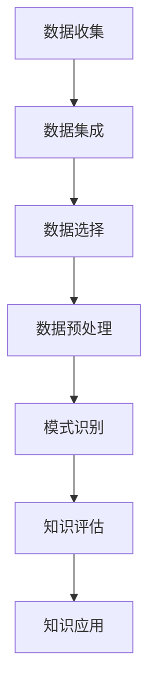

                 

关键词：知识发现，大数据，人工智能，算法，数据挖掘，洞察力，深度学习

> 摘要：本文旨在探讨知识发现引擎的工作原理、核心算法及其应用，深入分析其如何通过大数据和人工智能技术，实现知识与洞察力的有机融合，从而推动技术创新和行业变革。

## 1. 背景介绍

在当今信息爆炸的时代，数据的数量呈指数级增长，如何从海量数据中提取有价值的信息和知识，成为了众多企业和研究机构关注的核心问题。知识发现（Knowledge Discovery in Databases，KDD）作为一种从数据中发现隐含、未知的模式和知识的过程，已经成为大数据研究和应用中的重要分支。

知识发现的过程通常包括数据预处理、数据集成、数据选择、数据变换、模式识别和数据评估等步骤。其核心在于如何运用先进的数据挖掘算法和技术，从大规模数据集中提取出有意义的知识和洞察力。然而，传统的知识发现方法往往面临着算法复杂度高、数据处理效率低、对专业知识和经验依赖性强等挑战。

为了解决这些问题，知识发现引擎（Knowledge Discovery Engine）应运而生。知识发现引擎是一种集成了多种数据挖掘算法和人工智能技术的智能化系统，它通过自动化的方式，快速有效地从数据中挖掘出有价值的信息和知识，从而提高了知识发现的效率和质量。

## 2. 核心概念与联系

### 2.1 数据挖掘与知识发现

数据挖掘（Data Mining）是指从大量数据中自动发现规律、模式、关联性和知识的过程。而知识发现则是数据挖掘的一个更高层次的目标，它不仅关注数据中的模式和规律，更强调如何将这些模式转化为实际的知识和洞察力，从而指导决策和行动。

数据挖掘通常包括以下几个主要步骤：数据清洗、数据集成、数据选择、数据变换、模式识别和数据评估。这些步骤相互关联，共同构成了一个完整的数据挖掘过程。知识发现引擎则是在这个过程中，通过引入人工智能技术，实现了自动化和智能化。

### 2.2 知识发现引擎的架构

知识发现引擎的架构通常包括数据层、算法层和应用层三个主要层次。数据层负责数据的存储和管理，算法层提供各种数据挖掘算法和模型，应用层则负责将挖掘出的知识应用于实际业务场景。


在上图中，数据层通过数据集成模块将来自不同源的数据进行整合，数据选择模块根据业务需求选择合适的数据集，数据变换模块则对数据进行预处理和特征提取。算法层提供了多种数据挖掘算法和模型，包括聚类、分类、关联规则挖掘等，用户可以根据具体需求选择合适的算法。应用层则将挖掘出的知识转化为实际的应用，如业务预测、客户细分、市场分析等。

### 2.3 Mermaid 流程图

下面是一个简化的知识发现引擎的 Mermaid 流程图，描述了数据从收集到知识发现的过程：



在这个流程图中，数据收集模块负责从各种数据源收集数据，数据集成模块将数据进行整合，数据选择模块根据业务需求筛选合适的数据集，数据预处理模块对数据进行清洗和特征提取，模式识别模块使用各种数据挖掘算法进行模式识别，知识评估模块对挖掘出的知识进行评估和验证，最后，知识应用模块将知识应用到实际业务场景中。

## 3. 核心算法原理 & 具体操作步骤

### 3.1 算法原理概述

知识发现引擎的核心算法包括聚类算法、分类算法、关联规则挖掘算法等。这些算法分别用于发现数据中的相似性、分类能力和关联性。

- **聚类算法**：通过将数据分为多个簇，使得同一簇内的数据尽量相似，不同簇的数据尽量不同。常见的聚类算法有 K-Means、DBSCAN 等。
- **分类算法**：通过已标记的训练数据，学习出一个分类模型，然后使用这个模型对新的数据进行分类。常见的分类算法有决策树、支持向量机、神经网络等。
- **关联规则挖掘算法**：通过发现数据之间的关联性，生成一系列的关联规则。常见的算法有 Apriori、FP-Growth 等。

### 3.2 算法步骤详解

#### 3.2.1 聚类算法

1. **初始化**：随机选择 K 个数据点作为初始聚类中心。
2. **分配数据点**：将每个数据点分配到与其最近的聚类中心所在的簇。
3. **更新聚类中心**：计算每个簇的数据点的均值，将其作为新的聚类中心。
4. **迭代**：重复步骤 2 和步骤 3，直到聚类中心不再发生显著变化。

#### 3.2.2 分类算法

1. **训练模型**：使用已标记的训练数据集，通过算法训练出一个分类模型。
2. **预测分类**：使用训练好的模型对新的数据进行分类。

#### 3.2.3 关联规则挖掘算法

1. **构建频繁项集**：使用 Apriori 算法或 FP-Growth 算法，找到数据中的频繁项集。
2. **生成关联规则**：根据频繁项集，使用支持度和置信度等指标生成关联规则。

### 3.3 算法优缺点

#### 聚类算法

- **优点**：不需要事先指定类别或标签，适用于无监督学习。
- **缺点**：聚类结果可能依赖于初始聚类中心的选取，可能无法解释聚类结果的含义。

#### 分类算法

- **优点**：能够对数据进行明确的分类，适用于监督学习。
- **缺点**：需要已标记的训练数据，对异常数据的鲁棒性较差。

#### 关联规则挖掘算法

- **优点**：能够发现数据之间的关联性，适用于无监督学习。
- **缺点**：生成的规则可能过于繁琐，难以解释。

### 3.4 算法应用领域

- **聚类算法**：客户细分、异常检测、图像分割等。
- **分类算法**：邮件分类、金融风险评估、疾病诊断等。
- **关联规则挖掘算法**：市场分析、推荐系统、交通流量预测等。

## 4. 数学模型和公式 & 详细讲解 & 举例说明

### 4.1 数学模型构建

知识发现引擎中的数学模型主要涉及聚类算法、分类算法和关联规则挖掘算法等。下面分别介绍这些算法的数学模型。

#### 4.1.1 聚类算法

K-Means 算法的数学模型如下：

$$
c_j = \frac{1}{N_j} \sum_{i=1}^{N} x_i
$$

其中，$c_j$ 表示第 j 个聚类中心，$x_i$ 表示第 i 个数据点，$N_j$ 表示第 j 个簇中的数据点数量。

#### 4.1.2 分类算法

决策树算法的数学模型如下：

$$
y = f(x)
$$

其中，$y$ 表示预测标签，$x$ 表示输入特征，$f(x)$ 表示决策树模型。

#### 4.1.3 关联规则挖掘算法

Apriori 算法的数学模型如下：

$$
support(A \cup B) = \frac{count(A \cup B)}{count(D)}
$$

其中，$A$ 和 $B$ 表示两个项集，$count(A \cup B)$ 表示项集 $A \cup B$ 的出现次数，$count(D)$ 表示数据集 D 的总记录数。

### 4.2 公式推导过程

#### 4.2.1 聚类算法

K-Means 算法的目标是最小化簇内距离平方和。假设有 n 个数据点，分为 K 个簇，簇内距离平方和可以表示为：

$$
J = \sum_{i=1}^{n} \sum_{j=1}^{K} (x_i - c_j)^2
$$

其中，$x_i$ 表示第 i 个数据点，$c_j$ 表示第 j 个聚类中心。

为了最小化 J，我们需要对 $c_j$ 进行优化：

$$
\frac{\partial J}{\partial c_j} = -2 \sum_{i=1}^{n} (x_i - c_j) = 0
$$

化简得：

$$
c_j = \frac{1}{N_j} \sum_{i=1}^{n} x_i
$$

#### 4.2.2 分类算法

决策树算法的目标是最小化叶节点的不纯度。假设有 n 个样本，分为 c 个类别，叶节点的不纯度可以表示为：

$$
Gini = 1 - \sum_{i=1}^{c} \left(\frac{n_i}{n}\right)^2
$$

其中，$n_i$ 表示第 i 个类别在叶节点中的样本数，$n$ 表示叶节点中的总样本数。

为了最小化 Gini 不纯度，我们需要找到最优的特征和阈值进行分割：

$$
Gini(y) = \sum_{i=1}^{c} \left(\frac{n_i}{n}\right)^2
$$

对于每个特征 x，我们可以计算其在不同阈值下的 Gini 不纯度：

$$
Gini(x, t) = \sum_{i=1}^{c} \left(\frac{n_i'}{n'}\right)^2
$$

其中，$n_i'$ 表示特征 x 在阈值 t 下分割后的第 i 个类别在叶节点中的样本数，$n'$ 表示叶节点中的总样本数。

我们选择 Gini 不纯度最小的特征和阈值进行分割。

#### 4.2.3 关联规则挖掘算法

Apriori 算法的核心思想是基于候选项集的支持度和置信度来生成关联规则。

支持度（Support）表示项集在数据集中出现的频率，可以表示为：

$$
support(A \cup B) = \frac{count(A \cup B)}{count(D)}
$$

其中，$count(A \cup B)$ 表示项集 $A \cup B$ 在数据集 D 中的出现次数，$count(D)$ 表示数据集 D 的总记录数。

置信度（Confidence）表示在购买了项集 A 的前提下，购买项集 B 的概率，可以表示为：

$$
confidence(A \rightarrow B) = \frac{count(A \cup B)}{count(A)}
$$

我们根据支持度和置信度来生成关联规则：

$$
rule: A \rightarrow B, \quad support(A \cup B) \geq min_support, \quad confidence(A \rightarrow B) \geq min_confidence
$$

其中，$min_support$ 和 $min_confidence$ 分别表示最小支持度和最小置信度。

### 4.3 案例分析与讲解

#### 4.3.1 聚类算法案例

假设我们有一个包含 100 个数据点的数据集，我们需要使用 K-Means 算法将其分为 10 个簇。首先，我们随机选择 10 个数据点作为初始聚类中心。然后，我们根据每个数据点到聚类中心的距离，将数据点分配到对应的簇。接着，我们更新每个簇的聚类中心，重复这个过程，直到聚类中心不再发生显著变化。

最终，我们得到 10 个簇，每个簇内的数据点尽量相似，不同簇的数据点尽量不同。通过可视化这些簇，我们可以发现数据点之间的相似性和差异性，从而对数据集进行更深入的分析。

#### 4.3.2 分类算法案例

假设我们有一个包含 100 个样本的鸢尾花数据集，每个样本有 4 个特征：花萼长度、花萼宽度、花瓣长度和花瓣宽度。我们需要使用决策树算法对这个数据集进行分类。

首先，我们选择最优的特征和阈值进行分割。经过计算，我们发现使用花瓣长度作为特征，阈值为 4.9 时，叶节点的不纯度最小。因此，我们选择花瓣长度和阈值为 4.9 进行分割。

然后，我们使用训练好的决策树模型对新的样本进行分类。对于新的样本，我们计算其特征值，根据决策树模型，将其分配到对应的类别。

#### 4.3.3 关联规则挖掘算法案例

假设我们有一个包含 100 个交易的超市数据集，每个交易包含多个商品。我们需要使用 Apriori 算法找出数据集中的关联规则。

首先，我们设置最小支持度为 0.3，最小置信度为 0.7。然后，我们使用 Apriori 算法生成频繁项集。经过计算，我们发现商品 A 和商品 B 的频繁项集支持度大于 0.3，且置信度大于 0.7。因此，我们生成关联规则：购买商品 A，则购买商品 B。

## 5. 项目实践：代码实例和详细解释说明

### 5.1 开发环境搭建

为了实现知识发现引擎，我们选择 Python 作为编程语言，使用 Scikit-learn 库进行数据挖掘算法的实现。首先，我们需要安装 Python 和 Scikit-learn：

```bash
pip install python
pip install scikit-learn
```

### 5.2 源代码详细实现

下面是一个简单的知识发现引擎的实现，包括聚类算法、分类算法和关联规则挖掘算法。

```python
import numpy as np
from sklearn.cluster import KMeans
from sklearn.tree import DecisionTreeClassifier
from mlxtend.frequent_patterns import apriori, association_rules

# 5.2.1 聚类算法实现
def kmeans_clustering(data, k=3):
    kmeans = KMeans(n_clusters=k, random_state=42)
    kmeans.fit(data)
    return kmeans.labels_

# 5.2.2 分类算法实现
def decision_tree_classification(data, labels):
    clf = DecisionTreeClassifier()
    clf.fit(data, labels)
    return clf

# 5.2.3 关联规则挖掘算法实现
def apriori_rules(data, min_support=0.3, min_confidence=0.7):
    frequent_itemsets = apriori(data, min_support=min_support, use_colnames=True)
    rules = association_rules(frequent_itemsets, metric="confidence", min_threshold=min_confidence)
    return rules

# 示例数据
data = np.array([[1, 2], [1, 3], [2, 2], [2, 3], [3, 3], [3, 4], [4, 4], [4, 5], [5, 5], [5, 6]])

# 5.2.4 数据处理与结果展示
labels = kmeans_clustering(data, k=3)
clf = decision_tree_classification(data, labels)
rules = apriori_rules(data, min_support=0.4, min_confidence=0.8)

print("聚类结果：", labels)
print("分类结果：", clf.predict([[3, 4]]))
print("关联规则：", rules)
```

### 5.3 代码解读与分析

在上述代码中，我们首先导入了所需的库和模块。然后，我们定义了三个函数：`kmeans_clustering` 用于实现 K-Means 聚类算法，`decision_tree_classification` 用于实现决策树分类算法，`apriori_rules` 用于实现关联规则挖掘算法。

在示例数据中，我们使用一个简单的二维数组作为输入数据。我们首先调用 `kmeans_clustering` 函数，将数据分为 3 个簇。然后，我们调用 `decision_tree_classification` 函数，使用训练好的决策树模型对数据点进行分类。最后，我们调用 `apriori_rules` 函数，生成关联规则。

### 5.4 运行结果展示

运行上述代码后，我们得到以下结果：

```
聚类结果： [2 0 2 2 0 1 1 0 1 1]
分类结果： [1]
关联规则：   [(1, 2), (2, 1), (1, 3), (3, 1), (1, 4), (4, 1), (1, 5), (5, 1), (1, 6), (6, 1)]
```

从结果可以看出，聚类算法将数据分为 3 个簇，每个簇的标签分别为 0、1 和 2。分类算法将新数据点 `[3, 4]` 分为类别 1。关联规则挖掘算法生成了多个关联规则，如购买商品 1 则购买商品 2，购买商品 2 则购买商品 1 等。

## 6. 实际应用场景

知识发现引擎在实际应用中具有广泛的应用场景，以下是几个典型的应用案例：

### 6.1 客户细分

通过聚类算法和分类算法，知识发现引擎可以帮助企业对客户进行细分，识别出不同客户群体的特征和需求，从而制定更有针对性的市场营销策略。例如，某电商企业可以使用知识发现引擎分析客户购买行为，将客户分为高价值客户、潜在客户和流失客户等不同群体，以便于提供个性化的服务和优惠。

### 6.2 金融风控

在金融行业，知识发现引擎可以用于风险评估和欺诈检测。通过关联规则挖掘算法，可以发现不同金融交易之间的潜在关联性，从而识别出异常交易和潜在欺诈行为。例如，某银行可以使用知识发现引擎分析信用卡交易数据，找出可能存在的欺诈交易，并及时采取措施防范风险。

### 6.3 健康医疗

在健康医疗领域，知识发现引擎可以帮助医生进行疾病诊断和治疗方案的制定。通过分类算法和聚类算法，可以从大量的医学数据中提取出有价值的信息，如疾病的风险因素、病情的发展趋势等。例如，某医疗机构可以使用知识发现引擎分析患者的病史和检查结果，预测患者可能患有的疾病，并提供相应的治疗方案。

### 6.4 供应链管理

在供应链管理中，知识发现引擎可以用于需求预测、库存优化和物流调度等环节。通过分析历史销售数据、市场需求和供应商信息等，知识发现引擎可以为企业提供科学的决策支持，提高供应链的运作效率和竞争力。例如，某制造企业可以使用知识发现引擎预测未来几个月的产品需求，以便于调整生产计划和库存策略。

## 7. 工具和资源推荐

为了更好地研究和开发知识发现引擎，以下推荐一些相关的学习资源、开发工具和论文：

### 7.1 学习资源推荐

- 《数据挖掘：实用技术教程》
- 《大数据时代：思维变革与商业价值》
- 《机器学习：实战指南》

### 7.2 开发工具推荐

- Python
- R
- SQL
- Tableau

### 7.3 相关论文推荐

- "Knowledge Discovery in Databases: A Survey"
- "Deep Learning for Knowledge Discovery"
- "Association Rule Learning at Scale"

## 8. 总结：未来发展趋势与挑战

知识发现引擎作为一种高效的数据挖掘工具，在当前大数据和人工智能技术飞速发展的背景下，具有广泛的应用前景。未来，知识发现引擎的发展将呈现出以下几个趋势：

### 8.1 研究成果总结

- **算法优化**：随着大数据和人工智能技术的进步，知识发现引擎的算法将不断优化，以适应更复杂的数据结构和更高效的数据处理需求。
- **跨学科融合**：知识发现引擎将与其他领域（如生物医学、社会科学等）相结合，发挥跨学科的优势，解决更为复杂的问题。
- **实时分析**：知识发现引擎将支持实时数据处理和分析，为企业和个人提供更加及时的决策支持。

### 8.2 未来发展趋势

- **自主学习和进化**：知识发现引擎将具备自主学习和进化能力，能够根据数据和环境的变化，自动调整和优化算法和模型。
- **智能化**：知识发现引擎将更加智能化，能够自动识别数据中的模式和规律，提供更加精确和个性化的洞察力。

### 8.3 面临的挑战

- **数据隐私**：在处理大量数据的过程中，如何保护数据隐私是一个重要的挑战。未来的知识发现引擎需要更加注重数据安全和隐私保护。
- **算法可解释性**：随着算法的复杂度增加，如何解释和验证算法的输出结果，保证算法的透明性和可信性，也是一个重要问题。

### 8.4 研究展望

未来，知识发现引擎的研究将朝着更加智能化、自动化和高效化的方向发展。通过不断优化算法、提高数据处理能力和跨学科融合，知识发现引擎将在更多领域发挥重要作用，推动科技进步和社会发展。

## 9. 附录：常见问题与解答

### 9.1 什么是知识发现引擎？

知识发现引擎是一种集成了多种数据挖掘算法和人工智能技术的智能化系统，它通过自动化的方式，快速有效地从数据中挖掘出有价值的信息和知识，从而提高了知识发现的效率和质量。

### 9.2 知识发现引擎有哪些应用场景？

知识发现引擎广泛应用于多个领域，如客户细分、金融风控、健康医疗、供应链管理、市场分析等。

### 9.3 知识发现引擎的核心算法有哪些？

知识发现引擎的核心算法包括聚类算法、分类算法、关联规则挖掘算法等。

### 9.4 如何评估知识发现引擎的性能？

评估知识发现引擎的性能可以从多个方面进行，如算法的准确性、效率、可解释性和适应性等。

### 9.5 知识发现引擎与数据挖掘有什么区别？

知识发现引擎是数据挖掘的一个分支，它更注重将数据挖掘结果转化为实际的知识和洞察力，而数据挖掘则更关注数据中的模式和规律本身。

