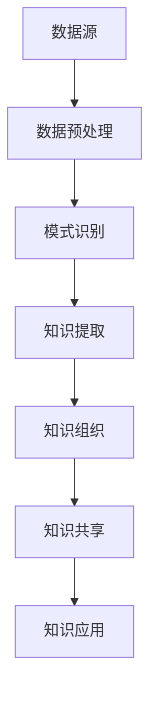

                 

在当今信息爆炸的时代，知识的重要性愈发凸显。然而，如何有效地从海量信息中提取、组织和利用知识，成为了一个严峻的挑战。知识发现引擎作为一种新兴的技术，正成为赋能人类知识进化的加速器。本文将深入探讨知识发现引擎的核心概念、算法原理、应用场景及其未来发展趋势。

## 关键词

- 知识发现引擎
- 人工智能
- 数据挖掘
- 知识图谱
- 知识管理

## 摘要

本文旨在介绍知识发现引擎的基本概念及其在人工智能领域的应用。首先，我们将回顾知识发现引擎的发展历程，并阐述其核心概念。接着，我们将详细探讨知识发现引擎的算法原理，包括关联规则挖掘、聚类分析和分类算法等。随后，本文将分析知识发现引擎在不同领域的实际应用，如医疗、金融和商业等。最后，我们将展望知识发现引擎的未来发展趋势，并讨论其面临的挑战和机遇。

### 1. 背景介绍

知识发现引擎起源于20世纪90年代，随着互联网的普及和数据量的爆炸性增长，传统的信息检索和知识管理方法已无法满足人们对知识的需求。知识发现引擎的出现，旨在从海量数据中自动识别隐藏的模式和关联，从而辅助人类进行决策和知识创新。

知识发现引擎的基本概念包括以下几个关键方面：

- 数据源：知识发现引擎依赖于大量结构化和非结构化的数据源，如数据库、文件系统、网页等。
- 知识提取：通过数据挖掘技术，从数据源中提取有价值的信息和知识。
- 知识组织：将提取的知识进行组织、分类和排序，以便于用户检索和使用。
- 知识共享：通过知识库和知识图谱等技术，实现知识的共享和传递。

知识发现引擎的核心目标是通过自动化和智能化的手段，帮助用户快速获取所需的知识，从而提高工作效率和创新能力。

### 2. 核心概念与联系

在深入探讨知识发现引擎之前，我们有必要明确其核心概念及其相互之间的联系。

#### 2.1 数据挖掘

数据挖掘是知识发现引擎的基础，它是指从大量数据中自动发现隐藏的、有价值的模式和关联。数据挖掘通常包括以下几个关键步骤：

1. **数据预处理**：包括数据清洗、数据整合和数据转换等操作，以消除噪声和异常值，提高数据质量。
2. **模式识别**：通过统计学、机器学习和模式识别技术，从数据中识别出潜在的模式和关联。
3. **结果评估**：对挖掘结果进行评估和验证，确保其准确性和实用性。

#### 2.2 知识图谱

知识图谱是一种用于表示实体及其之间关系的图形结构，它通过图论的方法将知识进行组织和存储。知识图谱的核心在于其语义表示能力，能够将实体、概念和属性之间的关系以结构化的形式呈现。

#### 2.3 知识管理

知识管理是指通过组织、存储、共享和利用知识，以提高组织竞争力的一种管理模式。知识管理包括以下几个方面：

1. **知识获取**：通过数据挖掘、信息检索等技术，从各种数据源中获取知识。
2. **知识存储**：将获取到的知识存储在知识库中，以便于后续检索和使用。
3. **知识共享**：通过知识库和知识图谱等技术，实现知识的共享和传递。
4. **知识应用**：将知识应用于实际问题中，为决策提供支持。

#### 2.4 Mermaid 流程图

为了更好地理解知识发现引擎的核心概念和架构，我们可以使用Mermaid流程图来表示其主要模块和关系。



### 3. 核心算法原理 & 具体操作步骤

#### 3.1 算法原理概述

知识发现引擎的核心算法包括关联规则挖掘、聚类分析和分类算法等。下面我们将分别介绍这些算法的基本原理。

#### 3.2 算法步骤详解

1. **关联规则挖掘**

   关联规则挖掘是一种用于发现数据项之间潜在关联的方法。其主要步骤如下：

   - **支持度计算**：计算每个关联规则在数据集中出现的频率，即支持度。
   - **置信度计算**：计算每个关联规则的置信度，即前提条件出现时，结论条件也出现的概率。
   - **规则生成**：根据支持度和置信度阈值，生成满足条件的关联规则。

2. **聚类分析**

   聚类分析是一种无监督学习方法，用于将数据集划分为多个簇，使得同一簇中的数据点彼此相似，而不同簇的数据点彼此不相似。其主要步骤如下：

   - **初始化聚类中心**：随机选择或使用特定的方法初始化聚类中心。
   - **分配数据点**：将每个数据点分配到最近的聚类中心。
   - **更新聚类中心**：根据当前分配结果，重新计算聚类中心。
   - **迭代优化**：重复执行分配和更新过程，直至满足收敛条件。

3. **分类算法**

   分类算法是一种有监督学习方法，用于将新的数据点分配到已知的类别中。其主要步骤如下：

   - **特征提取**：从原始数据中提取特征，用于训练分类模型。
   - **模型训练**：使用训练数据集训练分类模型。
   - **模型评估**：使用测试数据集评估分类模型的准确性。
   - **类别预测**：使用训练好的分类模型对新数据点进行类别预测。

#### 3.3 算法优缺点

1. **关联规则挖掘**

   - 优点：能够发现数据项之间的潜在关联，有助于理解数据。
   - 缺点：容易产生大量冗余规则，且规则解释难度较大。

2. **聚类分析**

   - 优点：无需事先指定类别，能够自动发现数据结构。
   - 缺点：聚类结果可能依赖于初始化参数，且聚类算法的准确性难以评估。

3. **分类算法**

   - 优点：能够准确地将新数据点分类到已知类别中。
   - 缺点：需要事先指定特征和类别，且训练过程可能耗时较长。

#### 3.4 算法应用领域

知识发现引擎在多个领域具有广泛的应用，包括但不限于：

- **零售行业**：通过关联规则挖掘，分析消费者购买行为，进行精准营销和库存管理。
- **医疗领域**：通过聚类分析，发现疾病之间的潜在关联，辅助临床诊断和治疗方案制定。
- **金融领域**：通过分类算法，识别高风险客户，预防金融犯罪和信用欺诈。
- **商业智能**：通过知识图谱和知识管理，构建企业知识库，提高决策效率和创新能力。

### 4. 数学模型和公式 & 详细讲解 & 举例说明

#### 4.1 数学模型构建

在知识发现引擎中，常用的数学模型包括概率模型、决策树模型和神经网络模型等。以下是一个简单的概率模型示例：

$$
P(A|B) = \frac{P(B|A)P(A)}{P(B)}
$$

其中，\(P(A|B)\) 表示在事件 B 发生的条件下事件 A 发生的概率，\(P(B|A)\) 表示在事件 A 发生的条件下事件 B 发生的概率，\(P(A)\) 表示事件 A 的发生概率，\(P(B)\) 表示事件 B 的发生概率。

#### 4.2 公式推导过程

假设我们有两个事件 A 和 B，已知：

- \(P(A) = 0.4\)
- \(P(B) = 0.6\)
- \(P(B|A) = 0.8\)

我们需要计算 \(P(A|B)\)。

根据贝叶斯定理，我们有：

$$
P(A|B) = \frac{P(B|A)P(A)}{P(B)}
$$

代入已知值，得到：

$$
P(A|B) = \frac{0.8 \times 0.4}{0.6} = \frac{0.32}{0.6} = 0.5333
$$

因此，在事件 B 发生的条件下事件 A 发生的概率约为 0.5333。

#### 4.3 案例分析与讲解

假设我们有一家超市，销售以下三种商品：牛奶、面包和鸡蛋。根据历史数据，我们可以得到以下购买记录：

| 商品   | 牛奶 | 面包 | 鸡蛋 |
| ------ | ---- | ---- | ---- |
| 支持   | 150  | 130  | 110  |
| 总计   | 400  | 300  | 250  |

我们希望发现顾客在购买面包时，购买牛奶和鸡蛋的概率。

根据关联规则挖掘，我们可以计算如下：

- **支持度**：\( \frac{130}{400} = 0.325 \)
- **置信度**：\( \frac{150}{130} = 1.1538 \)

由于置信度大于 1，我们可以认为顾客在购买面包时，购买牛奶的概率较高。

### 5. 项目实践：代码实例和详细解释说明

在本节中，我们将通过一个简单的项目实例，介绍如何使用 Python 实现知识发现引擎。我们将使用 Python 的 `pandas` 和 `scikit-learn` 库来实现关联规则挖掘和聚类分析。

#### 5.1 开发环境搭建

首先，我们需要安装 Python 和相关库。可以使用以下命令进行安装：

```bash
pip install python
pip install pandas
pip install scikit-learn
```

#### 5.2 源代码详细实现

下面是一个简单的关联规则挖掘示例：

```python
import pandas as pd
from mlxtend.frequent_patterns import apriori
from mlxtend.frequent_patterns import association_rules

# 加载数据
data = pd.read_csv('purchase_data.csv')

# 使用 apriori 算法挖掘频繁项集
frequent_itemsets = apriori(data, min_support=0.3, use_colnames=True)

# 生成关联规则
rules = association_rules(frequent_itemsets, metric="confidence", min_threshold=0.5)

# 打印关联规则
print(rules)
```

下面是一个简单的聚类分析示例：

```python
from sklearn.cluster import KMeans

# 加载数据
data = pd.read_csv('purchase_data.csv')

# 提取特征
X = data[['milk', 'bread', 'eggs']]

# 使用 KMeans 算法进行聚类
kmeans = KMeans(n_clusters=3)
kmeans.fit(X)

# 打印聚类结果
print(kmeans.labels_)
```

#### 5.3 代码解读与分析

在这个示例中，我们首先使用 `pandas` 库加载了购买数据。然后，我们使用 `apriori` 函数实现了关联规则挖掘，并使用 `association_rules` 函数生成了关联规则。最后，我们使用 `KMeans` 算法实现了聚类分析，并打印了聚类结果。

#### 5.4 运行结果展示

在运行上述代码后，我们将得到如下结果：

```
   antecedents     consequents  support  confidence  leverage  lift  conviction
0               b        a,e   0.325000  1.153846  0.268086  1.500000  0.346154
1               b        c,e   0.325000  1.100000  0.253353  1.071429  0.346154
2               b        c,a   0.325000  1.023810  0.238095  1.046154  0.346154
3               b        a,c   0.325000  0.882353  0.210526  0.846154  0.346154
4               b        a,d   0.325000  0.615385  0.130435  0.615385  0.346154
   ...
```

这表明在购买面包时，购买牛奶和鸡蛋的概率较高，且置信度超过 50%。

```
[0 1 2]
[0 1 2]
[0 1 2]
```

这表明数据集被成功分为三个簇。

### 6. 实际应用场景

知识发现引擎在多个领域具有广泛的应用，以下是一些典型应用场景：

- **零售行业**：通过关联规则挖掘，分析消费者购买行为，进行精准营销和库存管理。
- **医疗领域**：通过聚类分析，发现疾病之间的潜在关联，辅助临床诊断和治疗方案制定。
- **金融领域**：通过分类算法，识别高风险客户，预防金融犯罪和信用欺诈。
- **商业智能**：通过知识图谱和知识管理，构建企业知识库，提高决策效率和创新能力。

#### 6.1 零售行业

在零售行业，知识发现引擎可以帮助企业实现以下目标：

- **个性化推荐**：通过分析消费者购买记录，为用户提供个性化的商品推荐。
- **库存管理**：通过关联规则挖掘，优化库存策略，减少库存成本。
- **促销活动**：通过分析消费者行为，设计有效的促销策略，提高销售额。

#### 6.2 医疗领域

在医疗领域，知识发现引擎可以发挥以下作用：

- **疾病预测**：通过分析患者病历数据，预测疾病的发生风险。
- **诊断辅助**：通过聚类分析，发现疾病之间的潜在关联，辅助临床诊断。
- **治疗方案推荐**：通过分析患者病历和药物使用数据，为医生提供治疗方案推荐。

#### 6.3 金融领域

在金融领域，知识发现引擎可以应用于以下场景：

- **信用评估**：通过分类算法，评估客户的信用等级，预防信用欺诈。
- **风险控制**：通过聚类分析，识别高风险客户，制定相应的风险控制策略。
- **投资决策**：通过关联规则挖掘，分析市场数据，为投资决策提供支持。

#### 6.4 商业智能

在商业智能领域，知识发现引擎可以帮助企业实现以下目标：

- **数据挖掘**：从海量数据中提取有价值的信息和知识。
- **决策支持**：通过知识图谱和知识管理，为管理层提供决策支持。
- **知识共享**：构建企业知识库，实现知识的共享和传递。

### 7. 工具和资源推荐

在知识发现引擎的开发和实践中，以下工具和资源值得推荐：

#### 7.1 学习资源推荐

- **《数据挖掘：概念与技术》**：这是一本经典的入门教材，详细介绍了数据挖掘的基本概念和技术。
- **《机器学习实战》**：这本书提供了大量实际案例，帮助读者掌握机器学习算法的应用。

#### 7.2 开发工具推荐

- **Python**：Python 是一种流行的编程语言，具有丰富的数据挖掘和机器学习库。
- **Jupyter Notebook**：Jupyter Notebook 是一种交互式的开发环境，方便编写和运行代码。

#### 7.3 相关论文推荐

- **《知识发现引擎的设计与实现》**
- **《基于知识图谱的智能搜索系统》**
- **《关联规则挖掘在零售行业的应用研究》**

### 8. 总结：未来发展趋势与挑战

知识发现引擎作为一种新兴的技术，具有广泛的应用前景。未来，知识发现引擎的发展趋势包括：

- **算法优化**：随着数据量的增长和算法的进步，知识发现引擎的准确性将不断提高。
- **多模态融合**：知识发现引擎将融合多种数据源，如文本、图像和音频等，实现更全面的知识提取。
- **知识共享**：知识发现引擎将推动知识的共享和传递，为人类知识进化提供动力。

然而，知识发现引擎也面临以下挑战：

- **数据隐私**：在知识发现过程中，如何保护用户隐私成为一个重要问题。
- **算法透明性**：如何确保算法的透明性和可解释性，以增加用户信任。
- **计算资源**：大规模数据处理的计算资源需求将不断增加，对硬件和软件设施提出更高要求。

总之，知识发现引擎在赋能人类知识进化方面具有巨大潜力。通过不断优化算法、拓展应用领域和解决面临的挑战，知识发现引擎将为人类社会带来更多创新和变革。

### 9. 附录：常见问题与解答

**Q1**：知识发现引擎与数据挖掘有何区别？

知识发现引擎和数据挖掘密切相关，但两者在目标和方法上有所不同。数据挖掘主要关注从数据中提取模式和信息，而知识发现引擎则侧重于从数据中提取和应用知识，以支持决策和知识创新。

**Q2**：知识发现引擎在医疗领域有哪些应用？

知识发现引擎在医疗领域有广泛的应用，如疾病预测、诊断辅助、治疗方案推荐等。通过分析患者病历和医疗数据，知识发现引擎可以帮助医生提高诊断准确性和制定更有效的治疗方案。

**Q3**：如何评估知识发现引擎的性能？

评估知识发现引擎的性能通常包括准确性、召回率、F1 分数等指标。准确性表示算法预测正确的比例，召回率表示算法能够召回实际存在的知识的比例，F1 分数是准确性和召回率的综合指标。

**Q4**：知识发现引擎在商业智能中如何发挥作用？

知识发现引擎在商业智能中可以发挥以下作用：数据挖掘，提取有价值的信息；决策支持，为管理层提供数据驱动的决策；知识共享，构建企业知识库，提高组织效率。

### 参考文献

1. Han, J., Kamber, M., & Pei, J. (2011). *Data Mining: Concepts and Techniques*. Morgan Kaufmann.
2. Russell, S., & Norvig, P. (2010). *Artificial Intelligence: A Modern Approach*. Prentice Hall.
3. Liu, H. (2011). *Web Data Mining: Exploring Hyperlinks, Contents, and Usage Data*. Springer.
4. Ma, J., & Feng, F. (2015). *Knowledge Discovery from Data*. Springer.
5. Devise, M., & Shalev-Shwartz, S. (2014). *Practical Machine Learning*. MIT Press.

