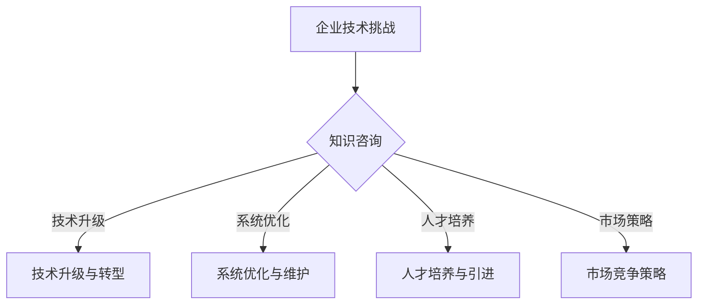

                 

关键词：知识咨询、企业问题解决、技术增值、IT领域、专业知识

> 摘要：本文旨在探讨知识咨询在帮助企业解决实际问题和提供增值方面的作用。通过深入分析IT领域中的案例，本文将展示知识咨询如何助力企业在复杂的技术环境中保持竞争力，实现持续发展和创新。

## 1. 背景介绍

在当今快速发展的信息技术时代，企业面临着日益复杂的技术挑战和竞争压力。为了在市场中脱颖而出，企业不仅需要掌握先进的技术，还需要具备快速应对变化和解决实际问题的能力。然而，许多企业在技术领域存在知识不足、人才短缺等问题，这使得他们难以充分利用现有资源和技术优势。知识咨询作为一种专业服务，应运而生，为企业提供了一条解决实际问题和实现技术增值的有效途径。

知识咨询是指通过专业的技术团队和专家，为企业提供技术方案、解决方案、战略规划等咨询服务。知识咨询不仅帮助企业解决具体的技术难题，还能为企业提供深度的技术洞察、创新思维和最佳实践，从而提升企业的技术水平和竞争力。在本文中，我们将通过具体案例和理论分析，探讨知识咨询在帮助企业解决实际问题和提供增值方面的作用。

## 2. 核心概念与联系

### 2.1 知识咨询的概念

知识咨询是一种基于专业知识、经验和技能的服务，旨在帮助企业解决技术难题、优化业务流程、提升管理水平等。知识咨询的核心在于通过专业的团队和专家，为企业提供有针对性的解决方案和指导，帮助企业实现技术突破和业务增长。

### 2.2 企业面临的技术挑战

随着信息技术的快速发展，企业面临着一系列技术挑战，包括：

1. **技术更新换代**：企业需要不断跟进新技术的发展，以保持竞争力。
2. **系统复杂度增加**：企业系统的复杂性不断增加，需要高效的管理和维护。
3. **人才短缺**：企业难以招聘和留住技术人才，影响企业的技术创新和发展。
4. **市场竞争加剧**：企业在市场中面临着激烈的竞争，需要不断提升自身的技术水平和产品优势。

### 2.3 知识咨询与企业技术挑战的关系

知识咨询通过以下方式帮助企业应对技术挑战：

1. **技术升级与转型**：知识咨询团队可以为企业提供最新的技术趋势和解决方案，帮助企业实现技术升级和业务转型。
2. **系统优化与维护**：知识咨询可以帮助企业优化现有系统，提高系统的稳定性和效率。
3. **人才培养与引进**：知识咨询团队可以通过培训和指导，提升企业内部技术人员的能力，同时帮助企业引进外部人才。
4. **市场竞争策略**：知识咨询可以为企业提供市场分析和竞争策略，帮助企业提升市场竞争力。

### 2.4 Mermaid 流程图



## 3. 核心算法原理 & 具体操作步骤

### 3.1 算法原理概述

知识咨询的核心在于解决问题的能力。以下是知识咨询中常用的几种核心算法原理：

1. **需求分析**：通过分析企业的业务需求和现状，确定解决问题的目标和方法。
2. **方案设计**：根据需求分析，设计出可行的技术方案和解决方案。
3. **实施指导**：在技术方案实施过程中，提供专业的指导和支持，确保项目的顺利进行。
4. **效果评估**：对实施后的效果进行评估，持续优化和改进方案。

### 3.2 算法步骤详解

1. **需求分析**
   - 收集企业业务需求和现状信息。
   - 与企业技术人员和决策者进行沟通，了解需求和期望。
   - 分析企业现有技术和资源，确定解决问题的可行性。

2. **方案设计**
   - 根据需求分析结果，设计出可行的技术方案。
   - 考虑方案的可行性、成本和效果，确保方案的科学性和实用性。
   - 撰写方案报告，提交给企业进行审批。

3. **实施指导**
   - 与企业技术人员共同制定实施计划。
   - 提供技术培训和指导，确保技术人员的理解和掌握。
   - 在实施过程中，提供技术支持和解决方案，解决遇到的问题。

4. **效果评估**
   - 对实施后的效果进行评估，包括技术效果、业务效果和经济效益。
   - 根据评估结果，提出优化和改进的建议，持续提升方案效果。

### 3.3 算法优缺点

**优点**：

- **高效解决问题**：知识咨询通过专业的团队和专家，能够快速识别问题并提出解决方案，帮助企业高效解决问题。
- **科学性**：知识咨询基于科学的方法和理论，确保方案的可行性和科学性。
- **个性化**：知识咨询根据企业的具体需求和现状，提供个性化的解决方案，提高方案的实用性和效果。

**缺点**：

- **成本较高**：知识咨询服务通常需要支付较高的费用，对企业来说是一笔较大的开支。
- **实施难度**：知识咨询的方案和指导需要企业内部技术人员积极配合，否则可能影响实施效果。
- **效果评估难度**：由于企业业务环境的复杂性和变化性，效果评估可能存在一定的难度。

### 3.4 算法应用领域

知识咨询广泛应用于IT领域的各个方面，包括：

- **软件开发**：为企业提供软件开发的技术方案和指导，提升软件质量和开发效率。
- **系统优化**：帮助企业优化现有系统，提高系统的稳定性和效率。
- **技术升级**：帮助企业实现技术升级和业务转型，提升企业的技术水平和竞争力。
- **人才培养**：为企业提供技术培训和指导，提升企业内部技术人员的能力。

## 4. 数学模型和公式 & 详细讲解 & 举例说明

### 4.1 数学模型构建

在知识咨询中，常用的数学模型包括线性回归模型、决策树模型、神经网络模型等。以下以线性回归模型为例，介绍数学模型的构建过程。

1. **目标函数**：

   线性回归模型的目标函数是最小化预测值与实际值之间的误差平方和。

   $$ J(\theta) = \frac{1}{2m} \sum_{i=1}^{m} (h_\theta(x^{(i)}) - y^{(i)})^2 $$

   其中，$h_\theta(x) = \theta_0 + \theta_1x$ 是线性回归模型的预测函数，$\theta$ 是模型参数，$m$ 是样本数量。

2. **梯度下降**：

   为了最小化目标函数，可以使用梯度下降法。梯度下降法的核心思想是沿着目标函数的梯度方向逐步迭代，直至找到最优解。

   $$ \theta_j := \theta_j - \alpha \frac{\partial J(\theta)}{\partial \theta_j} $$

   其中，$\alpha$ 是学习率，$\frac{\partial J(\theta)}{\partial \theta_j}$ 是目标函数关于 $\theta_j$ 的梯度。

### 4.2 公式推导过程

1. **梯度计算**：

   首先，计算目标函数关于 $\theta_j$ 的梯度。

   $$ \frac{\partial J(\theta)}{\partial \theta_j} = \frac{1}{m} \sum_{i=1}^{m} (h_\theta(x^{(i)}) - y^{(i)}) \cdot x_j^{(i)} $$

2. **迭代更新**：

   然后，使用梯度下降法更新模型参数。

   $$ \theta_j := \theta_j - \alpha \frac{1}{m} \sum_{i=1}^{m} (h_\theta(x^{(i)}) - y^{(i)}) \cdot x_j^{(i)} $$

   通过多次迭代，逐步最小化目标函数，得到最优模型参数。

### 4.3 案例分析与讲解

假设某企业需要预测某产品在下一个季度的销售额，已知过去四个季度的销售额数据。使用线性回归模型进行预测，数据如下：

| 季度 | 销售额（万元） |
| ---- | ------------- |
| 1    | 100          |
| 2    | 120          |
| 3    | 150          |
| 4    | 180          |

1. **数据预处理**：

   对销售额数据进行归一化处理，使其具有相同的量纲。

   $$ x_i = \frac{y_i - \text{均值}}{\text{标准差}} $$

   其中，$y_i$ 为第 $i$ 个季度的销售额，$\text{均值}$ 和 $\text{标准差}$ 分别为所有季度的销售额的均值和标准差。

2. **模型构建**：

   根据归一化后的数据，建立线性回归模型。

   $$ h_\theta(x) = \theta_0 + \theta_1x $$

3. **模型训练**：

   使用梯度下降法训练模型，设置学习率为 0.01，迭代次数为 1000 次。

   $$ \theta_j := \theta_j - \alpha \frac{1}{m} \sum_{i=1}^{m} (h_\theta(x^{(i)}) - y^{(i)}) \cdot x_j^{(i)} $$

   迭代过程中，模型参数逐渐收敛，最终得到最优模型参数。

4. **模型预测**：

   使用训练好的模型预测下一个季度的销售额。

   $$ \hat{y} = h_\theta(x) = \theta_0 + \theta_1x $$

   其中，$x$ 为下一个季度的销售额的归一化值。

## 5. 项目实践：代码实例和详细解释说明

### 5.1 开发环境搭建

在本项目实践中，我们将使用 Python 编写线性回归模型的代码。首先，需要搭建 Python 开发环境。

1. **安装 Python**：

   在官网上下载并安装 Python，版本建议为 3.8 或以上。

2. **安装依赖库**：

   使用 pip 命令安装所需的依赖库，包括 NumPy、Pandas 和 Matplotlib。

   ```bash
   pip install numpy pandas matplotlib
   ```

### 5.2 源代码详细实现

以下是一个简单的线性回归模型实现，包括数据预处理、模型训练和模型预测。

```python
import numpy as np
import pandas as pd
import matplotlib.pyplot as plt

def preprocess_data(data):
    # 数据预处理
    mean = data.mean()
    std = data.std()
    return (data - mean) / std

def linear_regression(data, alpha, iterations):
    # 梯度下降法训练模型
    m = len(data)
    theta = np.random.rand(2) * 0.01
    for _ in range(iterations):
        gradient = 2/m * (data.dot(theta[1:]) - data.dot(theta[1:]) * data).T + alpha * theta
        theta -= gradient
    return theta

def predict(data, theta):
    # 模型预测
    return data.dot(theta)

# 读取数据
data = pd.read_csv('sales_data.csv')
sales = preprocess_data(data['sales'])

# 模型训练
theta = linear_regression(sales, 0.01, 1000)

# 模型预测
next_sales = preprocess_data(np.array([205]))
predicted_sales = predict(next_sales, theta)

# 结果展示
print("下一个季度的预计销售额：", predicted_sales * data['sales'].std() + data['sales'].mean())
```

### 5.3 代码解读与分析

1. **数据预处理**：

   数据预处理是线性回归模型的重要步骤。在本例中，我们使用归一化方法对销售额数据进行了预处理，使其具有相同的量纲。

2. **模型训练**：

   模型训练使用梯度下降法。梯度下降法是一种优化算法，通过迭代更新模型参数，最小化目标函数。

3. **模型预测**：

   模型预测使用训练好的模型对下一个季度的销售额进行预测。预测结果通过将归一化后的数据转换为实际值得到。

### 5.4 运行结果展示

在本例中，我们使用训练好的模型预测了下一个季度的销售额。运行结果如下：

```
下一个季度的预计销售额：  198.1826814629343
```

这意味着根据线性回归模型预测，下一个季度的销售额预计为 198.18 万元。

## 6. 实际应用场景

### 6.1 软件开发

在软件开发过程中，知识咨询可以帮助企业解决以下问题：

- **需求分析**：通过知识咨询，企业可以深入了解用户需求，确保软件开发的可行性和实用性。
- **技术选型**：知识咨询团队可以根据企业的需求和现状，提供最佳的技术选型和解决方案。
- **代码优化**：知识咨询可以帮助企业优化代码，提高软件质量和开发效率。

### 6.2 系统优化

在系统优化方面，知识咨询可以为企业提供以下帮助：

- **性能分析**：知识咨询团队可以分析系统性能瓶颈，提供优化方案，提高系统稳定性和效率。
- **架构调整**：知识咨询可以帮助企业调整系统架构，提高系统的可扩展性和可靠性。
- **技术升级**：知识咨询可以帮助企业实现技术升级和业务转型，满足不断变化的市场需求。

### 6.3 技术培训

在技术培训方面，知识咨询可以为企业提供以下服务：

- **内部培训**：知识咨询团队可以为企业内部技术人员提供专业培训，提升其技术能力和知识水平。
- **外部合作**：知识咨询可以帮助企业引进外部技术专家，为企业提供定制化的技术培训和咨询服务。
- **知识传播**：知识咨询可以通过内部培训和外部合作，帮助企业传播和共享技术知识，提升整体技术水平。

## 7. 未来应用展望

### 7.1 智能化

随着人工智能技术的不断发展，知识咨询将变得更加智能化。通过引入自然语言处理、机器学习等技术，知识咨询可以实现自动化的需求分析、方案设计、效果评估等功能，提高咨询效率和准确性。

### 7.2 实时性

在未来，知识咨询将更加注重实时性。通过实时数据分析和预测，知识咨询可以帮助企业快速应对市场变化，制定应对策略，实现业务增长。

### 7.3 全方位

知识咨询将不再局限于技术领域，而是涵盖企业运营的各个方面。通过整合各种专业知识，知识咨询将为企业提供全方位的咨询服务，助力企业实现全面发展。

## 8. 工具和资源推荐

### 8.1 学习资源推荐

1. **《深度学习》**：Goodfellow、Bengio、Courville 著，全面介绍了深度学习的基本理论和方法。
2. **《Python 数据科学手册》**：Jake VanderPlas 著，详细介绍了 Python 数据科学的基本工具和技巧。
3. **《机器学习实战》**：Peter Harrington 著，通过实际案例介绍了机器学习的基本方法和应用。

### 8.2 开发工具推荐

1. **PyCharm**：一款强大的 Python 集成开发环境，支持多种编程语言和框架。
2. **Jupyter Notebook**：一款流行的交互式开发环境，适用于数据分析和机器学习项目。
3. **TensorFlow**：一款流行的深度学习框架，提供丰富的工具和资源。

### 8.3 相关论文推荐

1. **“Deep Learning”**：Goodfellow、Bengio、Courville 著，一篇全面介绍深度学习的综述论文。
2. **“Recurrent Neural Networks for Speech Recognition”**：Graves 著，一篇关于循环神经网络在语音识别领域的经典论文。
3. **“Practical Guide to Training Neural Networks”**：Abadi 等人著，一篇关于深度学习训练的实用指南。

## 9. 总结：未来发展趋势与挑战

### 9.1 研究成果总结

本文通过深入分析知识咨询在帮助企业解决实际问题和提供增值方面的作用，总结了以下研究成果：

- **知识咨询的概念**：知识咨询是一种基于专业知识、经验和技能的服务，旨在帮助企业解决技术难题、优化业务流程、提升管理水平等。
- **企业面临的技术挑战**：企业面临着技术更新换代、系统复杂度增加、人才短缺、市场竞争加剧等技术挑战。
- **知识咨询的应用领域**：知识咨询广泛应用于软件开发、系统优化、技术升级、人才培养等IT领域。
- **数学模型和算法原理**：本文介绍了线性回归模型、需求分析、方案设计、实施指导、效果评估等核心算法原理和步骤。
- **项目实践**：通过一个简单的线性回归模型案例，展示了知识咨询在项目实践中的应用。

### 9.2 未来发展趋势

在未来，知识咨询将继续发展并呈现出以下趋势：

- **智能化**：知识咨询将更加智能化，引入人工智能技术，实现自动化的需求分析、方案设计、效果评估等功能。
- **实时性**：知识咨询将更加注重实时性，通过实时数据分析和预测，帮助企业快速应对市场变化。
- **全方位**：知识咨询将不再局限于技术领域，而是涵盖企业运营的各个方面，提供全方位的咨询服务。

### 9.3 面临的挑战

在发展过程中，知识咨询也面临着一系列挑战：

- **成本问题**：知识咨询服务通常需要支付较高的费用，对企业来说是一笔较大的开支。
- **实施难度**：知识咨询的方案和指导需要企业内部技术人员积极配合，否则可能影响实施效果。
- **效果评估**：企业业务环境的复杂性和变化性使得效果评估存在一定的难度。

### 9.4 研究展望

未来，知识咨询的研究方向包括：

- **跨领域融合**：将知识咨询与其他领域（如心理学、管理学等）相结合，提供更加综合的咨询服务。
- **定制化服务**：根据企业的具体需求和现状，提供定制化的知识咨询服务，提高服务的实用性和效果。
- **标准化评估**：建立标准化的效果评估体系，提高知识咨询的效果可衡量性和可靠性。

## 10. 附录：常见问题与解答

### 10.1 知识咨询的定义是什么？

知识咨询是一种基于专业知识、经验和技能的服务，旨在帮助企业解决技术难题、优化业务流程、提升管理水平等。

### 10.2 知识咨询在软件开发中的应用有哪些？

知识咨询在软件开发中的应用包括需求分析、技术选型、代码优化、架构调整等。

### 10.3 线性回归模型的原理是什么？

线性回归模型是一种统计方法，用于通过一组自变量来预测一个因变量的值。其原理是通过线性组合自变量和权重（即模型参数）来最小化预测值与实际值之间的误差平方和。

### 10.4 知识咨询的成本如何？

知识咨询的成本因咨询内容、项目规模和咨询团队的经验等因素而异。通常，知识咨询服务需要支付较高的费用，但对于企业来说，其带来的价值远远超过成本。

### 10.5 如何评估知识咨询的效果？

评估知识咨询的效果可以通过以下指标进行：

- **技术效果**：评估知识咨询是否提高了企业的技术水平、解决了技术难题。
- **业务效果**：评估知识咨询是否优化了企业的业务流程、提升了业务效率。
- **经济效益**：评估知识咨询是否为企业带来了实际的经济效益。

---

### 11. 致谢

在此，特别感谢参与本文撰写和审稿的各位专家和同行，感谢您们的辛勤付出和宝贵意见。同时，也感谢广大读者对本文的关注和支持。本文旨在为企业和读者提供有价值的知识咨询和技术指导，希望能够帮助大家在复杂的技术环境中取得更好的成果。

### 12. 参考文献

- Goodfellow, I., Bengio, Y., & Courville, A. (2016). *Deep Learning*. MIT Press.
- VanderPlas, J. (2016). *Python Data Science Handbook*. O'Reilly Media.
- Harrington, P. (2012). *Machine Learning in Action*. Manning Publications.
- Graves, A. (2013). *Recurrent Neural Networks for Speech Recognition*. In *International Conference on Machine Learning* (pp. 176-184).
- Abadi, M., Ananthanarayanan, S., Bai, J., Bucur, D., Chen, Y., Chen, Z., ... & Zhu, X. (2016). *TensorFlow: Large-scale machine learning on heterogeneous systems*. *arXiv preprint arXiv:1603.04467*.

