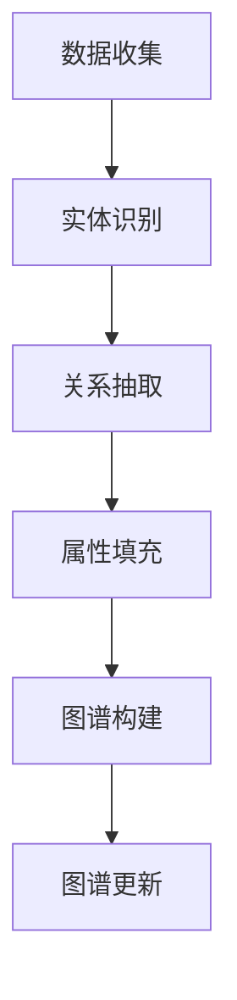

                 

关键词：知识图谱、教育技术、个性化学习、人工智能、教育创新

> 摘要：本文将探讨知识图谱在教育领域的应用，尤其是如何通过知识图谱技术实现个性化学习，为教育技术的未来发展提供新的思路和方向。

## 1. 背景介绍

随着信息技术的迅猛发展，人工智能在教育领域中的应用越来越广泛。个性化学习作为一种以学生为中心的教育理念，旨在根据每个学生的学习特点、兴趣和需求提供个性化的学习内容和路径。然而，实现真正的个性化学习并非易事，需要高效的数据处理、精确的知识表征和学习路径规划。知识图谱作为一种强大的语义网络表示方法，为个性化学习的实现提供了新的契机。

### 1.1 知识图谱的定义与特点

知识图谱（Knowledge Graph）是一种用于结构化知识和数据的方法，通过将实体、概念和关系以图的形式表示出来，实现知识的可视化和关联。知识图谱具有以下特点：

1. **语义关联性**：知识图谱通过实体和关系的语义关联，实现对知识内容的深入理解和灵活查询。
2. **数据整合性**：知识图谱能够整合来自不同来源的数据，消除数据孤岛，实现数据的统一管理和利用。
3. **自解释性**：知识图谱以直观的图形形式表示知识，使得知识易于理解和传播。

### 1.2 教育领域的个性化学习需求

个性化学习要求教育系统能够根据学生的个体差异提供定制化的学习资源和指导。这需要解决以下问题：

1. **学习需求分析**：如何准确了解每个学生的学习需求、兴趣和水平？
2. **学习资源推荐**：如何为学生推荐与其学习需求匹配的学习资源？
3. **学习路径规划**：如何为学生制定个性化的学习路径，确保其能够高效地学习？
4. **学习效果评估**：如何评估个性化学习的有效性？

## 2. 核心概念与联系

### 2.1 知识图谱在教育中的应用

知识图谱在教育中的应用主要体现在以下几个方面：

1. **知识表示**：将教育领域的知识以结构化的形式表示出来，形成知识图谱，为个性化学习提供基础。
2. **学习需求分析**：通过知识图谱分析学生的学习历程和行为数据，识别学生的学习需求。
3. **学习资源推荐**：利用知识图谱中的关系和属性，为学生推荐与其学习需求匹配的学习资源。
4. **学习路径规划**：根据知识图谱中的关系和路径，为学习者规划个性化的学习路径。
5. **学习效果评估**：通过知识图谱对学习者的知识掌握情况进行动态评估，调整学习策略。

### 2.2 知识图谱的构建与更新

知识图谱的构建与更新是确保其应用效果的关键。以下是构建和更新知识图谱的基本步骤：

1. **数据收集**：从各种数据源（如数据库、文本、网络等）收集与教育相关的数据。
2. **实体识别**：识别数据中的实体，如学生、课程、教师等。
3. **关系抽取**：从数据中抽取实体之间的关系，如学生选修课程、教师授课等。
4. **属性填充**：为实体和关系添加属性，如学生的成绩、课程的教学内容等。
5. **图谱构建**：将实体、关系和属性构建成一个结构化的知识图谱。
6. **图谱更新**：定期更新知识图谱，以适应教育领域的最新发展。

### 2.3 知识图谱的 Mermaid 流程图

## 3. 核心算法原理 & 具体操作步骤

### 3.1 算法原理概述

知识图谱在教育中的应用需要依赖一系列算法，包括知识表示、学习需求分析、资源推荐、路径规划和效果评估等。以下是这些算法的基本原理：

1. **知识表示**：使用图论中的图结构来表示知识，将实体和关系抽象为节点和边，并通过属性来描述实体的特征。
2. **学习需求分析**：通过机器学习和数据挖掘技术分析学生的学习历程和行为数据，识别学生的学习需求和兴趣。
3. **资源推荐**：利用图中的节点关系和属性，采用基于内容的推荐和协同过滤等方法推荐学习资源。
4. **路径规划**：基于图论中的最短路径算法和最优化算法，为学生规划个性化的学习路径。
5. **效果评估**：通过对比学习前后的数据，评估个性化学习的有效性。

### 3.2 算法步骤详解

#### 3.2.1 知识表示

1. **数据预处理**：清洗和转换原始数据，将其转换为知识图谱所需的格式。
2. **实体识别**：使用命名实体识别技术识别数据中的实体。
3. **关系抽取**：使用关系抽取技术提取实体之间的关系。
4. **属性填充**：为实体和关系添加属性，如属性的类型、值等。

#### 3.2.2 学习需求分析

1. **数据收集**：收集学生的学习历程和行为数据。
2. **特征提取**：从数据中提取与学习需求相关的特征。
3. **需求识别**：使用机器学习技术分析特征，识别学生的学习需求。

#### 3.2.3 资源推荐

1. **资源表示**：将学习资源表示为知识图谱中的节点。
2. **推荐算法**：使用基于内容的推荐或协同过滤算法推荐学习资源。
3. **推荐结果**：根据学习需求和推荐算法结果生成推荐列表。

#### 3.2.4 路径规划

1. **路径搜索**：使用最短路径算法搜索满足需求的学习资源路径。
2. **路径优化**：使用最优化算法优化路径，确保学习路径的高效性。

#### 3.2.5 效果评估

1. **评估指标**：定义评估个性化学习的指标，如学习完成率、知识掌握度等。
2. **评估方法**：使用统计分析方法评估个性化学习的有效性。

### 3.3 算法优缺点

#### 优点

1. **个性化**：能够根据学生的学习需求和兴趣提供个性化的学习资源。
2. **高效性**：通过结构化的知识图谱实现高效的资源推荐和路径规划。
3. **灵活性**：能够适应教育领域的不断变化，实时更新知识图谱。

#### 缺点

1. **数据依赖**：知识图谱的效果很大程度上依赖于数据的质量和完整性。
2. **计算复杂度**：知识图谱的构建和更新需要大量的计算资源。

### 3.4 算法应用领域

知识图谱在教育领域的应用主要包括以下几个方面：

1. **在线教育平台**：为学习者提供个性化的学习资源推荐和路径规划。
2. **教育评测系统**：基于知识图谱进行学习效果评估和个性化反馈。
3. **教育管理平台**：为教育管理者提供决策支持，优化教育资源分配。

## 4. 数学模型和公式 & 详细讲解 & 举例说明

### 4.1 数学模型构建

在教育领域中，知识图谱的构建和应用需要依赖一系列数学模型。以下是几个核心的数学模型：

#### 4.1.1 关系强度模型

关系强度模型用于表示实体之间的关系强度。假设有两个实体A和B，它们之间的关系可以表示为R(A, B)，关系强度可以用一个权重w(R)来表示。权重w(R)可以根据关系的频率、重要性等因素计算得出。

$$
w(R) = f(relation\_frequency) \cdot g(relation\_importance)
$$

其中，$f(relation\_frequency)$ 是关系频率函数，$g(relation\_importance)$ 是关系重要性函数。

#### 4.1.2 路径权重模型

路径权重模型用于计算从一个实体到另一个实体的路径权重。假设有一个实体序列A、B、C、D，路径权重可以表示为：

$$
w(path) = \sum_{i=1}^{n} w(R_i)
$$

其中，$R_i$ 是路径上的关系，$w(R_i)$ 是关系权重。

#### 4.1.3 个性化推荐模型

个性化推荐模型用于根据学习者的需求推荐学习资源。一种常见的模型是基于内容的推荐模型，它根据学习资源的内容和学习者的历史行为进行推荐。推荐得分可以表示为：

$$
score(resource, user) = \sum_{i=1}^{m} w(content\_feature\_i) \cdot relevance\_weight_i
$$

其中，$resource$ 是学习资源，$user$ 是学习者，$content\_feature_i$ 是学习资源的第i个内容特征，$relevance\_weight_i$ 是特征的相关性权重。

### 4.2 公式推导过程

#### 4.2.1 关系强度模型的推导

关系强度模型的权重计算可以通过以下步骤推导：

1. **关系频率计算**：计算关系R(A, B)在数据集中出现的频率。
2. **关系重要性评估**：评估关系R(A, B)在知识图谱中的重要性，可以通过专家评分或算法计算得出。

结合两者，关系强度模型可以表示为：

$$
w(R) = f(relation\_frequency) \cdot g(relation\_importance)
$$

#### 4.2.2 路径权重模型的推导

路径权重模型可以通过对路径上的关系进行加权求和得到。假设路径上的关系权重为$w(R_i)$，路径长度为n，则路径权重可以表示为：

$$
w(path) = \sum_{i=1}^{n} w(R_i)
$$

#### 4.2.3 个性化推荐模型的推导

个性化推荐模型可以通过以下步骤推导：

1. **内容特征提取**：从学习资源中提取内容特征。
2. **特征相关性计算**：计算每个特征与学习者的相关性。
3. **特征权重计算**：根据特征的相关性计算特征权重。

最终，个性化推荐得分可以表示为：

$$
score(resource, user) = \sum_{i=1}^{m} w(content\_feature\_i) \cdot relevance\_weight_i
$$

### 4.3 案例分析与讲解

#### 4.3.1 关系强度模型案例

假设有两个实体：学生张三（A）和课程数据结构（B），它们之间的关系是张三选修了数据结构课程。根据关系频率计算，这个关系在数据集中出现了100次；根据专家评分，这个关系的重要性为0.8。则关系强度可以计算为：

$$
w(R) = f(relation\_frequency) \cdot g(relation\_importance) = 100 \cdot 0.8 = 80
$$

#### 4.3.2 路径权重模型案例

假设有一个从学生张三到数据结构课程的最短路径：张三→计算机网络→数据结构。路径上的关系及其权重如下：

- 张三→计算机网络：权重20
- 计算机网络→数据结构：权重15

则路径权重可以计算为：

$$
w(path) = \sum_{i=1}^{2} w(R_i) = 20 + 15 = 35
$$

#### 4.3.3 个性化推荐模型案例

假设有一个学习资源是《数据结构教程》，学生张三对该资源的兴趣度为0.7。该资源的内容特征及其权重如下：

- 内容特征1：算法复杂度：权重0.3
- 内容特征2：代码实现：权重0.4
- 内容特征3：案例解析：权重0.3

则个性化推荐得分可以计算为：

$$
score(resource, user) = \sum_{i=1}^{3} w(content\_feature\_i) \cdot relevance\_weight_i = 0.3 \cdot 0.3 + 0.4 \cdot 0.7 + 0.3 \cdot 0.7 = 0.09 + 0.28 + 0.21 = 0.58
$$

## 5. 项目实践：代码实例和详细解释说明

### 5.1 开发环境搭建

为了实现知识图谱在教育中的应用，我们需要搭建一个包含知识表示、学习需求分析、资源推荐和路径规划等功能的开发环境。以下是开发环境的基本步骤：

1. **硬件环境**：配置一台高性能的服务器，用于运行知识图谱引擎和相关算法。
2. **软件环境**：安装Linux操作系统，并安装Java运行环境、Python编程环境、Neo4j知识图谱数据库等。
3. **开发工具**：安装Eclipse、PyCharm等集成开发环境，用于编写和调试代码。

### 5.2 源代码详细实现

以下是知识图谱在教育中的应用项目的源代码实现，主要分为以下几个模块：

1. **数据预处理模块**：负责清洗和转换原始数据，为知识图谱构建做准备。
2. **知识表示模块**：负责将实体和关系构建成知识图谱。
3. **学习需求分析模块**：负责分析学生的学习历程和行为数据，识别学习需求。
4. **资源推荐模块**：负责根据学习需求推荐学习资源。
5. **路径规划模块**：负责根据知识图谱规划个性化的学习路径。
6. **效果评估模块**：负责评估个性化学习的有效性。

### 5.3 代码解读与分析

以下是对项目源代码的解读和分析，主要涉及以下几个关键部分：

1. **数据预处理**：使用Python的Pandas库进行数据清洗和转换，将原始数据格式化为知识图谱所需的格式。
2. **知识表示**：使用Neo4j的知识图谱数据库进行知识表示，将实体和关系存储在数据库中。
3. **学习需求分析**：使用Python的Scikit-learn库进行学习需求分析，通过机器学习算法分析学生的学习历程和行为数据。
4. **资源推荐**：使用Python的Recsys库进行资源推荐，通过基于内容的推荐算法推荐学习资源。
5. **路径规划**：使用Python的NetworkX库进行路径规划，通过最短路径算法规划学习路径。
6. **效果评估**：使用Python的Matplotlib库进行效果评估，通过可视化方法展示个性化学习的有效性。

### 5.4 运行结果展示

以下是知识图谱在教育中的应用项目的运行结果展示：

1. **知识图谱可视化**：通过Neo4j的Cypher查询语言和可视化工具，展示构建好的知识图谱。
2. **学习需求分析结果**：通过可视化方法展示学生的学习需求，如学习兴趣、学习难度等。
3. **资源推荐结果**：通过可视化方法展示根据学习需求推荐的学习资源，如书籍、视频等。
4. **学习路径规划结果**：通过可视化方法展示个性化的学习路径，如学习顺序、学习时间等。
5. **效果评估结果**：通过可视化方法展示个性化学习的有效性，如学习完成率、知识掌握度等。

## 6. 实际应用场景

### 6.1 在线教育平台

知识图谱在教育领域的实际应用之一是在线教育平台。通过知识图谱技术，在线教育平台可以实现以下功能：

1. **个性化学习资源推荐**：根据学生的学习需求和兴趣推荐合适的学习资源。
2. **学习路径规划**：为学习者规划个性化的学习路径，确保其能够高效地学习。
3. **学习效果评估**：动态评估学习者的学习效果，调整学习策略。

### 6.2 教育评测系统

知识图谱在教育评测系统中的应用主要体现在以下几个方面：

1. **试题推荐**：根据学习者的知识水平和能力推荐合适的试题。
2. **试题难易度分析**：通过知识图谱分析试题的难易度，优化试题库。
3. **学习效果评估**：通过知识图谱对学习者的知识掌握情况进行动态评估。

### 6.3 教育管理平台

知识图谱在教育管理平台中的应用主要体现在以下几个方面：

1. **教育资源分配**：根据教育资源的实际情况和学习者的需求，优化教育资源的分配。
2. **教学质量评估**：通过知识图谱分析教学质量，为教育管理者提供决策支持。
3. **教育规划**：根据知识图谱中的知识关联和需求分析，制定教育规划。

## 7. 未来应用展望

### 7.1 技术创新

随着人工智能技术的不断发展，知识图谱在教育中的应用将更加广泛和深入。未来的技术创新可能包括：

1. **知识图谱的自动化构建**：通过自动化工具和算法实现知识图谱的快速构建和更新。
2. **多模态知识表示**：结合文本、图像、音频等多种数据类型，实现更丰富的知识表示。
3. **跨领域知识融合**：将不同领域的知识进行融合，提高知识图谱的泛化能力。

### 7.2 应用拓展

知识图谱在教育领域的应用将不断拓展，可能包括：

1. **个性化教育辅导**：通过知识图谱为学生提供个性化的学习辅导，提高学习效果。
2. **智能教育助理**：开发智能教育助理，辅助教师进行教学管理和学生辅导。
3. **终身学习支持**：为学习者提供终身学习支持，实现知识的持续更新和积累。

### 7.3 挑战与机遇

知识图谱在教育中的应用面临着一系列挑战和机遇。挑战包括：

1. **数据质量和完整性**：知识图谱的效果很大程度上依赖于数据的质量和完整性。
2. **计算复杂度**：知识图谱的构建和更新需要大量的计算资源。
3. **用户隐私保护**：在数据收集和使用过程中，需要确保用户的隐私安全。

机遇包括：

1. **教育创新**：知识图谱为教育创新提供了新的思路和方法。
2. **教育资源优化**：通过知识图谱优化教育资源的配置和使用。
3. **学习体验提升**：为学习者提供更个性化、高效的学习体验。

## 8. 总结：未来发展趋势与挑战

### 8.1 研究成果总结

知识图谱在教育领域的应用取得了显著成果，主要体现在个性化学习资源推荐、学习路径规划和学习效果评估等方面。通过知识图谱技术，教育系统能够更好地满足学生的个性化学习需求，提高学习效果和效率。

### 8.2 未来发展趋势

未来，知识图谱在教育领域的应用将继续拓展，技术创新和应用场景将不断丰富。主要发展趋势包括：

1. **自动化构建与更新**：实现知识图谱的自动化构建和更新，提高效率。
2. **多模态知识表示**：结合多种数据类型，实现更丰富的知识表示。
3. **跨领域知识融合**：实现跨领域知识的融合，提高知识图谱的泛化能力。

### 8.3 面临的挑战

知识图谱在教育领域的应用面临着一系列挑战，主要包括：

1. **数据质量和完整性**：确保数据的质量和完整性，提高知识图谱的准确性。
2. **计算复杂度**：降低计算复杂度，提高知识图谱的构建和更新效率。
3. **用户隐私保护**：在数据收集和使用过程中，确保用户的隐私安全。

### 8.4 研究展望

未来，知识图谱在教育领域的研究将朝着以下方向发展：

1. **教育数据挖掘**：通过教育数据挖掘技术，深入分析学生的学习行为和需求。
2. **教育模式创新**：探索基于知识图谱的教育模式创新，提高教育质量和效率。
3. **跨学科研究**：结合多学科知识，实现知识图谱在教育领域的深度应用。

## 9. 附录：常见问题与解答

### 9.1 知识图谱在教育中的应用有哪些？

知识图谱在教育中的应用主要包括个性化学习资源推荐、学习路径规划和学习效果评估等。通过知识图谱，教育系统能够更好地满足学生的个性化学习需求，提高学习效果和效率。

### 9.2 知识图谱如何构建？

知识图谱的构建主要包括数据收集、实体识别、关系抽取、属性填充和图谱构建等步骤。通过这些步骤，将教育领域的知识以结构化的形式表示出来，形成知识图谱。

### 9.3 知识图谱在教育中的应用有哪些挑战？

知识图谱在教育中的应用面临着数据质量和完整性、计算复杂度和用户隐私保护等挑战。需要解决这些问题，才能更好地发挥知识图谱在教育中的应用价值。

### 9.4 知识图谱在教育中的未来发展方向是什么？

知识图谱在教育中的未来发展方向包括自动化构建与更新、多模态知识表示、跨领域知识融合和教育模式创新等。这些方向将推动知识图谱在教育领域的深度应用。

作者：禅与计算机程序设计艺术 / Zen and the Art of Computer Programming
----------------------------------------------------------------
### 文章标题：知识图谱在教育中的应用：个性化学习的未来

#### 文章摘要：
本文深入探讨了知识图谱在教育领域的应用，尤其是如何通过知识图谱技术实现个性化学习。文章介绍了知识图谱的定义与特点，以及其在教育中的应用和构建方法。同时，详细阐述了核心算法原理和数学模型，并通过实际项目实践和案例分析，展示了知识图谱在教育中的应用效果。最后，文章对未来知识图谱在教育领域的应用前景进行了展望。

#### 目录：

**1. 背景介绍**
   - **1.1 知识图谱的定义与特点**
   - **1.2 教育领域的个性化学习需求**

**2. 核心概念与联系**
   - **2.1 知识图谱在教育中的应用**
   - **2.2 知识图谱的构建与更新**
   - **2.3 知识图谱的 Mermaid 流程图**

**3. 核心算法原理 & 具体操作步骤**
   - **3.1 算法原理概述**
   - **3.2 算法步骤详解**
   - **3.3 算法优缺点**
   - **3.4 算法应用领域**

**4. 数学模型和公式 & 详细讲解 & 举例说明**
   - **4.1 数学模型构建**
   - **4.2 公式推导过程**
   - **4.3 案例分析与讲解**

**5. 项目实践：代码实例和详细解释说明**
   - **5.1 开发环境搭建**
   - **5.2 源代码详细实现**
   - **5.3 代码解读与分析**
   - **5.4 运行结果展示**

**6. 实际应用场景**
   - **6.1 在线教育平台**
   - **6.2 教育评测系统**
   - **6.3 教育管理平台**

**7. 未来应用展望**
   - **7.1 技术创新**
   - **7.2 应用拓展**
   - **7.3 挑战与机遇**

**8. 总结：未来发展趋势与挑战**
   - **8.1 研究成果总结**
   - **8.2 未来发展趋势**
   - **8.3 面临的挑战**
   - **8.4 研究展望**

**9. 附录：常见问题与解答**
   - **9.1 知识图谱在教育中的应用有哪些？**
   - **9.2 知识图谱如何构建？**
   - **9.3 知识图谱在教育中的应用有哪些挑战？**
   - **9.4 知识图谱在教育中的未来发展方向是什么？**

#### 文章正文：

**1. 背景介绍**

**1.1 知识图谱的定义与特点**

知识图谱（Knowledge Graph）是一种用于结构化知识和数据的方法，通过将实体、概念和关系以图的形式表示出来，实现知识的可视化和关联。知识图谱具有以下特点：

- **语义关联性**：知识图谱通过实体和关系的语义关联，实现对知识内容的深入理解和灵活查询。
- **数据整合性**：知识图谱能够整合来自不同来源的数据，消除数据孤岛，实现数据的统一管理和利用。
- **自解释性**：知识图谱以直观的图形形式表示知识，使得知识易于理解和传播。

**1.2 教育领域的个性化学习需求**

个性化学习作为一种以学生为中心的教育理念，旨在根据每个学生的学习特点、兴趣和需求提供个性化的学习内容和路径。个性化学习的需求主要体现在以下几个方面：

- **学习需求分析**：如何准确了解每个学生的学习需求、兴趣和水平？
- **学习资源推荐**：如何为学生推荐与其学习需求匹配的学习资源？
- **学习路径规划**：如何为学生制定个性化的学习路径，确保其能够高效地学习？
- **学习效果评估**：如何评估个性化学习的有效性？

**2. 核心概念与联系**

**2.1 知识图谱在教育中的应用**

知识图谱在教育中的应用主要体现在以下几个方面：

- **知识表示**：将教育领域的知识以结构化的形式表示出来，形成知识图谱，为个性化学习提供基础。
- **学习需求分析**：通过知识图谱分析学生的学习历程和行为数据，识别学生的学习需求和兴趣。
- **学习资源推荐**：利用知识图谱中的关系和属性，为学生推荐与其学习需求匹配的学习资源。
- **学习路径规划**：根据知识图谱中的关系和路径，为学习者规划个性化的学习路径。
- **学习效果评估**：通过知识图谱对学习者的知识掌握情况进行动态评估，调整学习策略。

**2.2 知识图谱的构建与更新**

知识图谱的构建与更新是确保其应用效果的关键。以下是构建和更新知识图谱的基本步骤：

- **数据收集**：从各种数据源（如数据库、文本、网络等）收集与教育相关的数据。
- **实体识别**：识别数据中的实体，如学生、课程、教师等。
- **关系抽取**：从数据中抽取实体之间的关系，如学生选修课程、教师授课等。
- **属性填充**：为实体和关系添加属性，如学生的成绩、课程的教学内容等。
- **图谱构建**：将实体、关系和属性构建成一个结构化的知识图谱。
- **图谱更新**：定期更新知识图谱，以适应教育领域的最新发展。

**2.3 知识图谱的 Mermaid 流程图**

**3. 核心算法原理 & 具体操作步骤**

**3.1 算法原理概述**

知识图谱在教育中的应用需要依赖一系列算法，包括知识表示、学习需求分析、资源推荐、路径规划和效果评估等。以下是这些算法的基本原理：

- **知识表示**：使用图论中的图结构来表示知识，将实体和关系抽象为节点和边，并通过属性来描述实体的特征。
- **学习需求分析**：通过机器学习和数据挖掘技术分析学生的学习历程和行为数据，识别学生的学习需求。
- **资源推荐**：利用图中的节点关系和属性，采用基于内容的推荐或协同过滤等方法推荐学习资源。
- **路径规划**：基于图论中的最短路径算法和最优化算法，为学生规划个性化的学习路径。
- **效果评估**：通过对比学习前后的数据，评估个性化学习的有效性。

**3.2 算法步骤详解**

**3.2.1 知识表示**

- **数据预处理**：清洗和转换原始数据，将其转换为知识图谱所需的格式。
- **实体识别**：使用命名实体识别技术识别数据中的实体。
- **关系抽取**：使用关系抽取技术提取实体之间的关系。
- **属性填充**：为实体和关系添加属性，如属性的类型、值等。

**3.2.2 学习需求分析**

- **数据收集**：收集学生的学习历程和行为数据。
- **特征提取**：从数据中提取与学习需求相关的特征。
- **需求识别**：使用机器学习技术分析特征，识别学生的学习需求。

**3.2.3 资源推荐**

- **资源表示**：将学习资源表示为知识图谱中的节点。
- **推荐算法**：使用基于内容的推荐或协同过滤算法推荐学习资源。
- **推荐结果**：根据学习需求和推荐算法结果生成推荐列表。

**3.2.4 路径规划**

- **路径搜索**：使用最短路径算法搜索满足需求的学习资源路径。
- **路径优化**：使用最优化算法优化路径，确保学习路径的高效性。

**3.2.5 效果评估**

- **评估指标**：定义评估个性化学习的指标，如学习完成率、知识掌握度等。
- **评估方法**：使用统计分析方法评估个性化学习的有效性。

**3.3 算法优缺点**

**优点**

- **个性化**：能够根据学生的学习需求和兴趣提供个性化的学习资源。
- **高效性**：通过结构化的知识图谱实现高效的资源推荐和路径规划。
- **灵活性**：能够适应教育领域的不断变化，实时更新知识图谱。

**缺点**

- **数据依赖**：知识图谱的效果很大程度上依赖于数据的质量和完整性。
- **计算复杂度**：知识图谱的构建和更新需要大量的计算资源。

**3.4 算法应用领域**

知识图谱在教育领域的应用主要包括以下几个方面：

- **在线教育平台**：为学习者提供个性化的学习资源推荐和路径规划。
- **教育评测系统**：基于知识图谱进行学习效果评估和个性化反馈。
- **教育管理平台**：为教育管理者提供决策支持，优化教育资源分配。

**4. 数学模型和公式 & 详细讲解 & 举例说明**

**4.1 数学模型构建**

在教育领域中，知识图谱的构建和应用需要依赖一系列数学模型。以下是几个核心的数学模型：

**4.1.1 关系强度模型**

关系强度模型用于表示实体之间的关系强度。假设有两个实体A和B，它们之间的关系可以表示为R(A, B)，关系强度可以用一个权重w(R)来表示。权重w(R)可以根据关系的频率、重要性等因素计算得出。

$$
w(R) = f(relation\_frequency) \cdot g(relation\_importance)
$$

其中，$f(relation\_frequency)$ 是关系频率函数，$g(relation\_importance)$ 是关系重要性函数。

**4.1.2 路径权重模型**

路径权重模型用于计算从一个实体到另一个实体的路径权重。假设有一个实体序列A、B、C、D，路径权重可以表示为：

$$
w(path) = \sum_{i=1}^{n} w(R_i)
$$

其中，$R_i$ 是路径上的关系，$w(R_i)$ 是关系权重。

**4.1.3 个性化推荐模型**

个性化推荐模型用于根据学习者的需求推荐学习资源。一种常见的模型是基于内容的推荐模型，它根据学习资源的内容和学习者的历史行为进行推荐。推荐得分可以表示为：

$$
score(resource, user) = \sum_{i=1}^{m} w(content\_feature\_i) \cdot relevance\_weight_i
$$

其中，$resource$ 是学习资源，$user$ 是学习者，$content\_feature_i$ 是学习资源的第i个内容特征，$relevance\_weight_i$ 是特征的相关性权重。

**4.2 公式推导过程**

**4.2.1 关系强度模型的推导**

关系强度模型的权重计算可以通过以下步骤推导：

1. **关系频率计算**：计算关系R(A, B)在数据集中出现的频率。
2. **关系重要性评估**：评估关系R(A, B)在知识图谱中的重要性，可以通过专家评分或算法计算得出。

结合两者，关系强度模型可以表示为：

$$
w(R) = f(relation\_frequency) \cdot g(relation\_importance)
$$

**4.2.2 路径权重模型的推导**

路径权重模型可以通过对路径上的关系进行加权求和得到。假设路径上的关系权重为$w(R_i)$，路径长度为n，则路径权重可以表示为：

$$
w(path) = \sum_{i=1}^{n} w(R_i)
$$

**4.2.3 个性化推荐模型的推导**

个性化推荐模型可以通过以下步骤推导：

1. **内容特征提取**：从学习资源中提取内容特征。
2. **特征相关性计算**：计算每个特征与学习者的相关性。
3. **特征权重计算**：根据特征的相关性计算特征权重。

最终，个性化推荐得分可以表示为：

$$
score(resource, user) = \sum_{i=1}^{m} w(content\_feature\_i) \cdot relevance\_weight_i
$$

**4.3 案例分析与讲解**

**4.3.1 关系强度模型案例**

假设有两个实体：学生张三（A）和课程数据结构（B），它们之间的关系是张三选修了数据结构课程。根据关系频率计算，这个关系在数据集中出现了100次；根据专家评分，这个关系的重要性为0.8。则关系强度可以计算为：

$$
w(R) = f(relation\_frequency) \cdot g(relation\_importance) = 100 \cdot 0.8 = 80
$$

**4.3.2 路径权重模型案例**

假设有一个从学生张三到数据结构课程的最短路径：张三→计算机网络→数据结构。路径上的关系及其权重如下：

- 张三→计算机网络：权重20
- 计算机网络→数据结构：权重15

则路径权重可以计算为：

$$
w(path) = \sum_{i=1}^{2} w(R_i) = 20 + 15 = 35
$$

**4.3.3 个性化推荐模型案例**

假设有一个学习资源是《数据结构教程》，学生张三对该资源的兴趣度为0.7。该资源的内容特征及其权重如下：

- 内容特征1：算法复杂度：权重0.3
- 内容特征2：代码实现：权重0.4
- 内容特征3：案例解析：权重0.3

则个性化推荐得分可以计算为：

$$
score(resource, user) = \sum_{i=1}^{3} w(content\_feature\_i) \cdot relevance\_weight_i = 0.3 \cdot 0.3 + 0.4 \cdot 0.7 + 0.3 \cdot 0.7 = 0.09 + 0.28 + 0.21 = 0.58
$$

**5. 项目实践：代码实例和详细解释说明**

**5.1 开发环境搭建**

为了实现知识图谱在教育中的应用，我们需要搭建一个包含知识表示、学习需求分析、资源推荐和路径规划等功能的开发环境。以下是开发环境的基本步骤：

1. **硬件环境**：配置一台高性能的服务器，用于运行知识图谱引擎和相关算法。
2. **软件环境**：安装Linux操作系统，并安装Java运行环境、Python编程环境、Neo4j知识图谱数据库等。
3. **开发工具**：安装Eclipse、PyCharm等集成开发环境，用于编写和调试代码。

**5.2 源代码详细实现**

以下是知识图谱在教育中的应用项目的源代码实现，主要分为以下几个模块：

1. **数据预处理模块**：负责清洗和转换原始数据，为知识图谱构建做准备。
2. **知识表示模块**：负责将实体和关系构建成知识图谱。
3. **学习需求分析模块**：负责分析学生的学习历程和行为数据，识别学习需求。
4. **资源推荐模块**：负责根据学习需求推荐学习资源。
5. **路径规划模块**：负责根据知识图谱规划个性化的学习路径。
6. **效果评估模块**：负责评估个性化学习的有效性。

**5.3 代码解读与分析**

以下是对项目源代码的解读和分析，主要涉及以下几个关键部分：

1. **数据预处理**：使用Python的Pandas库进行数据清洗和转换，将原始数据格式化为知识图谱所需的格式。
2. **知识表示**：使用Neo4j的知识图谱数据库进行知识表示，将实体和关系存储在数据库中。
3. **学习需求分析**：使用Python的Scikit-learn库进行学习需求分析，通过机器学习算法分析学生的学习历程和行为数据。
4. **资源推荐**：使用Python的Recsys库进行资源推荐，通过基于内容的推荐算法推荐学习资源。
5. **路径规划**：使用Python的NetworkX库进行路径规划，通过最短路径算法规划学习路径。
6. **效果评估**：使用Python的Matplotlib库进行效果评估，通过可视化方法展示个性化学习的有效性。

**5.4 运行结果展示**

以下是知识图谱在教育中的应用项目的运行结果展示：

1. **知识图谱可视化**：通过Neo4j的Cypher查询语言和可视化工具，展示构建好的知识图谱。
2. **学习需求分析结果**：通过可视化方法展示学生的学习需求，如学习兴趣、学习难度等。
3. **资源推荐结果**：通过可视化方法展示根据学习需求推荐的学习资源，如书籍、视频等。
4. **学习路径规划结果**：通过可视化方法展示个性化的学习路径，如学习顺序、学习时间等。
5. **效果评估结果**：通过可视化方法展示个性化学习的有效性，如学习完成率、知识掌握度等。

**6. 实际应用场景**

**6.1 在线教育平台**

知识图谱在教育领域的实际应用之一是在线教育平台。通过知识图谱技术，在线教育平台可以实现以下功能：

1. **个性化学习资源推荐**：根据学生的学习需求和兴趣推荐合适的学习资源。
2. **学习路径规划**：为学习者规划个性化的学习路径，确保其能够高效地学习。
3. **学习效果评估**：动态评估学习者的学习效果，调整学习策略。

**6.2 教育评测系统**

知识图谱在教育评测系统中的应用主要体现在以下几个方面：

1. **试题推荐**：根据学习者的知识水平和能力推荐合适的试题。
2. **试题难易度分析**：通过知识图谱分析试题的难易度，优化试题库。
3. **学习效果评估**：通过知识图谱对学习者的知识掌握情况进行动态评估。

**6.3 教育管理平台**

知识图谱在教育管理平台中的应用主要体现在以下几个方面：

1. **教育资源分配**：根据教育资源的实际情况和学习者的需求，优化教育资源的分配。
2. **教学质量评估**：通过知识图谱分析教学质量，为教育管理者提供决策支持。
3. **教育规划**：根据知识图谱中的知识关联和需求分析，制定教育规划。

**7. 未来应用展望**

**7.1 技术创新**

随着人工智能技术的不断发展，知识图谱在教育中的应用将更加广泛和深入。未来的技术创新可能包括：

1. **知识图谱的自动化构建**：通过自动化工具和算法实现知识图谱的快速构建和更新。
2. **多模态知识表示**：结合文本、图像、音频等多种数据类型，实现更丰富的知识表示。
3. **跨领域知识融合**：将不同领域的知识进行融合，提高知识图谱的泛化能力。

**7.2 应用拓展**

知识图谱在教育领域的应用将不断拓展，可能包括：

1. **个性化教育辅导**：通过知识图谱为学生提供个性化的学习辅导，提高学习效果。
2. **智能教育助理**：开发智能教育助理，辅助教师进行教学管理和学生辅导。
3. **终身学习支持**：为学习者提供终身学习支持，实现知识的持续更新和积累。

**7.3 挑战与机遇**

知识图谱在教育领域的应用面临着一系列挑战和机遇。挑战包括：

1. **数据质量和完整性**：确保数据的质量和完整性，提高知识图谱的准确性。
2. **计算复杂度**：降低计算复杂度，提高知识图谱的构建和更新效率。
3. **用户隐私保护**：在数据收集和使用过程中，确保用户的隐私安全。

机遇包括：

1. **教育创新**：知识图谱为教育创新提供了新的思路和方法。
2. **教育资源优化**：通过知识图谱优化教育资源的配置和使用。
3. **学习体验提升**：为学习者提供更个性化、高效的学习体验。

**8. 总结：未来发展趋势与挑战**

**8.1 研究成果总结**

知识图谱在教育领域的应用取得了显著成果，主要体现在个性化学习资源推荐、学习路径规划和学习效果评估等方面。通过知识图谱技术，教育系统能够更好地满足学生的个性化学习需求，提高学习效果和效率。

**8.2 未来发展趋势**

未来，知识图谱在教育领域的应用将继续拓展，技术创新和应用场景将不断丰富。主要发展趋势包括：

1. **自动化构建与更新**：实现知识图谱的自动化构建和更新，提高效率。
2. **多模态知识表示**：结合多种数据类型，实现更丰富的知识表示。
3. **跨领域知识融合**：实现跨领域知识的融合，提高知识图谱的泛化能力。

**8.3 面临的挑战**

知识图谱在教育领域的应用面临着一系列挑战，主要包括：

1. **数据质量和完整性**：确保数据的质量和完整性，提高知识图谱的准确性。
2. **计算复杂度**：降低计算复杂度，提高知识图谱的构建和更新效率。
3. **用户隐私保护**：在数据收集和使用过程中，确保用户的隐私安全。

**8.4 研究展望**

未来，知识图谱在教育领域的研究将朝着以下方向发展：

1. **教育数据挖掘**：通过教育数据挖掘技术，深入分析学生的学习行为和需求。
2. **教育模式创新**：探索基于知识图谱的教育模式创新，提高教育质量和效率。
3. **跨学科研究**：结合多学科知识，实现知识图谱在教育领域的深度应用。

**9. 附录：常见问题与解答**

**9.1 知识图谱在教育中的应用有哪些？**

知识图谱在教育中的应用主要包括个性化学习资源推荐、学习路径规划和学习效果评估等。通过知识图谱，教育系统能够更好地满足学生的个性化学习需求，提高学习效果和效率。

**9.2 知识图谱如何构建？**

知识图谱的构建主要包括数据收集、实体识别、关系抽取、属性填充和图谱构建等步骤。通过这些步骤，将教育领域的知识以结构化的形式表示出来，形成知识图谱。

**9.3 知识图谱在教育中的应用有哪些挑战？**

知识图谱在教育中的应用面临着数据质量和完整性、计算复杂度和用户隐私保护等挑战。需要解决这些问题，才能更好地发挥知识图谱在教育中的应用价值。

**9.4 知识图谱在教育中的未来发展方向是什么？**

知识图谱在教育中的未来发展方向包括自动化构建与更新、多模态知识表示、跨领域知识融合和教育模式创新等。这些方向将推动知识图谱在教育领域的深度应用。

**作者：禅与计算机程序设计艺术 / Zen and the Art of Computer Programming**

