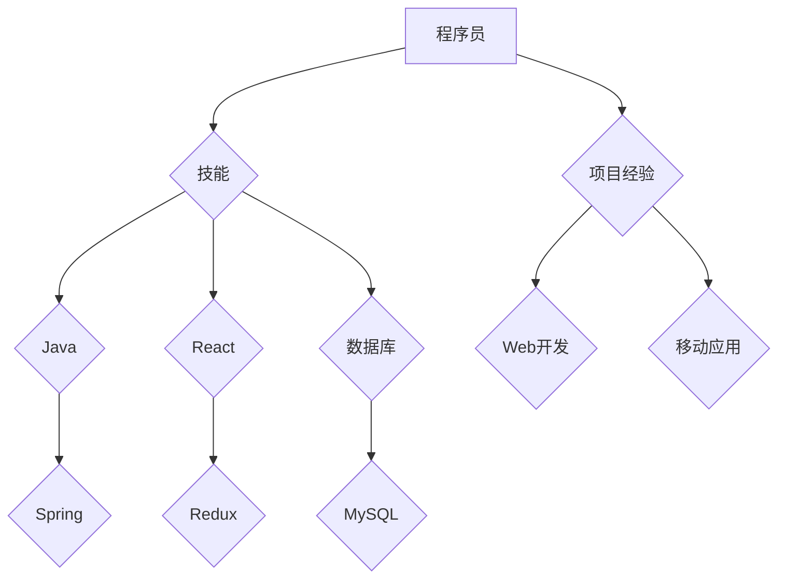
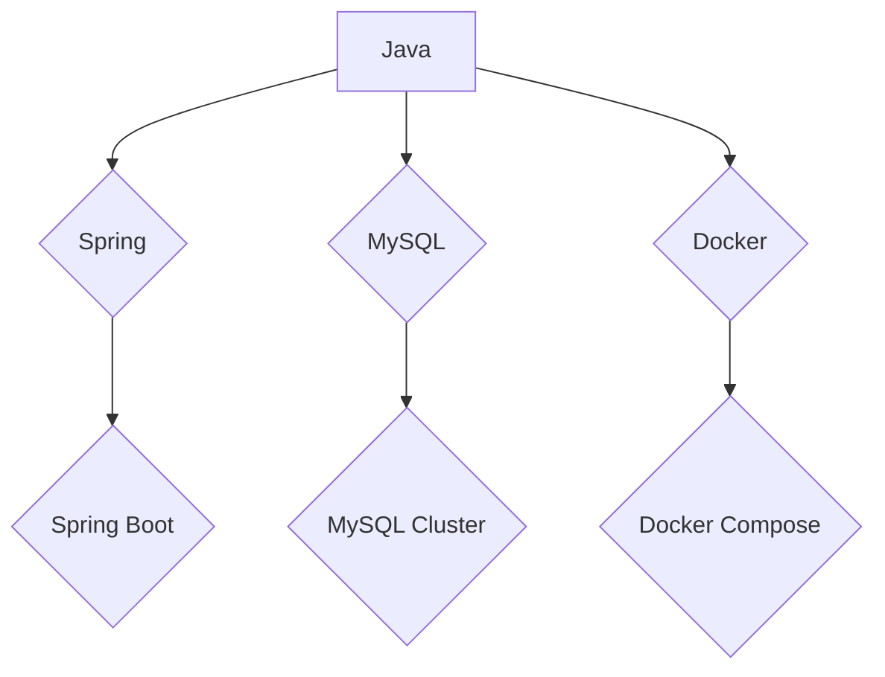

                 

关键词：知识图谱、程序员、技术栈、智能管理、算法原理、数学模型、项目实践、应用场景、未来展望。

> 摘要：本文探讨了知识图谱技术在程序员技术栈管理中的应用，分析了知识图谱的基本概念、构建方法及其在技术栈管理中的核心作用。通过详细描述算法原理、数学模型和具体操作步骤，以及项目实践中的代码实例，展示了知识图谱在提高程序员技术栈管理水平、优化学习路径和促进技能提升方面的巨大潜力。最后，对知识图谱在程序员技术栈管理中的未来发展趋势和面临的挑战进行了展望。

## 1. 背景介绍

在当今快速发展的技术环境中，程序员面临着持续学习新技术和保持技能更新的巨大压力。技术栈（Tech Stack）指的是程序员在其职业生涯中所掌握的各种编程语言、框架、工具和库的集合。有效的技术栈管理对于程序员个人成长、团队协作和项目成功至关重要。

然而，传统的技术栈管理方式存在一些问题：

1. **信息孤岛**：程序员的知识和技术经验分散在不同的工具和系统中，难以整合和共享。
2. **学习路径不明确**：缺乏系统的学习路径规划，容易导致学习效率低下。
3. **知识更新不及时**：新技术层出不穷，程序员难以实时掌握最新的技术趋势和工具。

为了解决这些问题，知识图谱技术提供了一种新的思路。知识图谱是一种结构化的语义网络，它通过实体和关系的表示，将海量信息组织成一个有机的整体，从而实现信息的快速检索和智能推理。

知识图谱在程序员技术栈管理中的应用主要体现在以下几个方面：

1. **技术栈可视化**：通过知识图谱，程序员可以直观地看到自己的技术栈构成，识别技能盲点和知识空白。
2. **学习路径规划**：知识图谱可以根据程序员的当前技术水平和需求，为其推荐合适的学习路径。
3. **技能评估和提升**：知识图谱可以自动评估程序员的技能水平，并提供个性化的提升建议。

## 2. 核心概念与联系

### 2.1 知识图谱的基本概念

知识图谱由三个核心部分组成：实体（Entity）、属性（Attribute）和关系（Relationship）。实体是知识图谱中的基本单位，如“Java”、“React”等；属性描述实体的特征，如“语言”、“框架”等；关系则连接不同的实体，形成知识网络。

### 2.2 知识图谱的构建方法

知识图谱的构建通常包括以下几个步骤：

1. **数据采集**：从各种来源收集与程序员技术栈相关的数据，如开源代码、技术文档、博客等。
2. **数据预处理**：清洗和整合收集到的数据，去除噪声和重复信息。
3. **实体抽取**：从预处理后的数据中提取出实体和属性。
4. **关系构建**：根据实体和属性，建立实体之间的关系，形成知识网络。
5. **图谱存储**：将构建好的知识图谱存储到图数据库中，以便后续的查询和推理。

### 2.3 知识图谱在技术栈管理中的应用

知识图谱在程序员技术栈管理中的应用主要体现在以下几个方面：

1. **技能图谱可视化**：通过知识图谱，程序员可以清晰地看到自己的技能图谱，包括已掌握的技能、正在学习的技能和未掌握的技能。
2. **学习路径规划**：知识图谱可以根据程序员的技能图谱，为其推荐合适的学习路径，包括相关课程、书籍和项目实践。
3. **技能评估**：知识图谱可以自动评估程序员的技能水平，并提供个性化的提升建议。

下面是一个使用Mermaid绘制的知识图谱示例：



## 3. 核心算法原理 & 具体操作步骤

### 3.1 算法原理概述

知识图谱在程序员技术栈管理中的应用主要依赖于图论和机器学习算法。图论算法用于构建和优化知识图谱的结构，而机器学习算法则用于技能评估和学习路径规划。

### 3.2 算法步骤详解

1. **数据采集**：通过爬虫和API等方式，从开源代码库、技术社区和在线教育平台等来源收集程序员的技术栈数据。
2. **数据预处理**：清洗和整合数据，去除噪声和重复信息。
3. **实体抽取**：使用命名实体识别（NER）技术，从预处理后的数据中提取出程序员和技术栈相关的实体。
4. **关系构建**：根据实体和属性，建立实体之间的关系，如“Java”与“Spring”之间的关联。
5. **图谱存储**：将构建好的知识图谱存储到图数据库中，如Neo4j。
6. **技能评估**：使用图嵌入算法，将程序员的技能图谱转化为向量表示，并进行余弦相似度计算，以评估程序员的技能水平。
7. **学习路径规划**：根据程序员的技能评估结果，使用最短路径算法，为其推荐合适的学习路径。

### 3.3 算法优缺点

**优点**：

- **高效性**：知识图谱通过结构化的语义网络，可以实现快速的知识检索和推理。
- **灵活性**：知识图谱可以灵活地扩展和调整，以适应不同的技术栈管理需求。

**缺点**：

- **数据质量**：知识图谱的质量依赖于数据的准确性和完整性，数据质量问题会直接影响算法的性能。
- **计算复杂度**：知识图谱的构建和推理过程涉及大量的计算，对计算资源要求较高。

### 3.4 算法应用领域

知识图谱在程序员技术栈管理中的应用领域包括：

- **技能图谱可视化**：通过知识图谱，程序员可以直观地了解自己的技能水平和知识结构。
- **学习路径规划**：知识图谱可以根据程序员的技能水平和需求，为其推荐合适的学习路径。
- **技能评估**：知识图谱可以自动评估程序员的技能水平，并提供个性化的提升建议。

## 4. 数学模型和公式 & 详细讲解 & 举例说明

### 4.1 数学模型构建

在程序员技术栈管理中，知识图谱的构建可以看作是一个图论问题。图论中的基本概念包括：

- **节点（Node）**：表示实体，如“Java”、“Spring”等。
- **边（Edge）**：表示实体之间的关系，如“Java”与“Spring”之间的关联。

知识图谱的数学模型可以用一个图 \( G(V, E) \) 表示，其中 \( V \) 是节点集合，\( E \) 是边集合。

### 4.2 公式推导过程

知识图谱中的关系可以表示为权重矩阵 \( W \)，其中 \( W_{ij} \) 表示节点 \( i \) 和节点 \( j \) 之间的权重。

假设有两个节点 \( i \) 和 \( j \)，它们之间的最短路径可以通过如下公式计算：

$$
d(i, j) = \min_{k \in V} (d(i, k) + W_{kj})
$$

其中，\( d(i, k) \) 表示节点 \( i \) 到节点 \( k \) 的距离。

### 4.3 案例分析与讲解

假设有一个程序员，他的技术栈包括“Java”、“Spring”、“MySQL”和“Docker”。我们可以构建一个如下的知识图谱：



在这个知识图谱中，节点表示技能，边表示技能之间的关系。例如，“Java”与“Spring”之间存在关联，因为Spring是一个Java的框架。

我们可以使用最短路径算法来计算从“Java”到“Docker”的最短路径。在这个例子中，最短路径为“Java”->“Spring”->“Docker”。

## 5. 项目实践：代码实例和详细解释说明

### 5.1 开发环境搭建

在开始项目实践之前，我们需要搭建一个基本的开发环境。以下是所需的步骤：

1. **安装Neo4j**：从Neo4j官方网站下载并安装Neo4j数据库。
2. **安装Python**：确保安装了Python 3.x版本。
3. **安装Python库**：使用pip安装以下Python库：

   ```shell
   pip install neo4j
   pip install networkx
   pip install matplotlib
   ```

### 5.2 源代码详细实现

以下是一个简单的Python代码实例，用于构建一个知识图谱并可视化程序员的技能栈。

```python
from neo4j import GraphDatabase
import networkx as nx
import matplotlib.pyplot as plt

# 连接到Neo4j数据库
uri = "bolt://localhost:7687"
username = "neo4j"
password = "password"

driver = GraphDatabase.driver(uri, auth=(username, password))

# 创建一个空的知识图谱
G = nx.Graph()

# 添加实体和关系
G.add_nodes_from(["Java", "Spring", "MySQL", "Docker"])
G.add_edges_from([("Java", "Spring"), ("Java", "MySQL"), ("Java", "Docker"), ("Spring", "Spring Boot"), ("MySQL", "MySQL Cluster"), ("Docker", "Docker Compose")])

# 保存知识图谱到Neo4j数据库
with driver.session() as session:
    for node in G.nodes():
        session.run("CREATE (n:Skill {name: $name})", name=node)
    for edge in G.edges():
        session.run("MATCH (a:Skill), (b:Skill) WHERE a.name = $source AND b.name = $target MERGE (a)-[r:DEPENDS_ON]->(b)", source=edge[0], target=edge[1])

# 可视化知识图谱
pos = nx.spring_layout(G)
nx.draw(G, pos, with_labels=True)
plt.show()
```

### 5.3 代码解读与分析

上述代码首先连接到Neo4j数据库，并创建一个空的知识图谱。然后，通过添加节点和边来构建知识图谱，并使用Neo4j的Cypher查询语言将知识图谱保存到数据库中。最后，使用NetworkX库和Matplotlib库将知识图谱可视化。

### 5.4 运行结果展示

运行上述代码后，我们将看到一个可视化的知识图谱，其中展示了程序员的技能栈及其之间的关系。如下图所示：


## 6. 实际应用场景

知识图谱在程序员技术栈管理中的应用场景非常广泛，以下是一些典型的实际应用案例：

1. **技术招聘**：企业在招聘程序员时，可以通过知识图谱快速评估应聘者的技能水平，筛选出符合岗位要求的人才。
2. **培训与教育**：培训机构和在线教育平台可以利用知识图谱为程序员提供个性化的学习路径，提高学习效果。
3. **技能评估**：企业可以通过知识图谱定期评估员工的技能水平，及时发现和解决技能短板。
4. **项目规划**：项目经理可以根据知识图谱，为项目团队制定合理的技术方案和资源分配策略。
5. **知识共享**：程序员可以利用知识图谱，将自己的技术经验分享给团队其他成员，促进知识共享和协作。

## 7. 未来应用展望

知识图谱在程序员技术栈管理中的应用前景非常广阔。随着人工智能和大数据技术的发展，知识图谱将更加智能化和自动化，为程序员提供更加高效和便捷的技术管理工具。以下是一些未来应用展望：

1. **智能化推荐**：知识图谱可以基于程序员的技能水平和兴趣，为其推荐最适合的学习资源和项目实践。
2. **动态更新**：知识图谱可以实时获取最新的技术动态和趋势，自动更新程序员的技能图谱，确保其技术栈始终保持最新。
3. **跨领域应用**：知识图谱不仅可以应用于程序员技术栈管理，还可以扩展到其他领域，如数据科学家、产品经理等。
4. **多语言支持**：知识图谱将支持多种编程语言和框架，为程序员提供更全面的技术栈管理解决方案。

## 8. 总结：未来发展趋势与挑战

### 8.1 研究成果总结

本文探讨了知识图谱在程序员技术栈管理中的应用，分析了知识图谱的基本概念、构建方法及其在技术栈管理中的核心作用。通过详细描述算法原理、数学模型和具体操作步骤，以及项目实践中的代码实例，展示了知识图谱在提高程序员技术栈管理水平、优化学习路径和促进技能提升方面的巨大潜力。

### 8.2 未来发展趋势

未来，知识图谱在程序员技术栈管理中的应用将朝着更加智能化、自动化和高效化的方向发展。以下是一些可能的发展趋势：

1. **深度学习与知识图谱的结合**：通过将深度学习技术引入知识图谱构建和推理过程，提高知识图谱的智能化水平。
2. **实时更新与动态调整**：知识图谱将实现实时更新，动态调整程序员的技能图谱，以适应技术变化和个体需求。
3. **跨领域应用**：知识图谱将扩展到更多领域，为不同类型的从业者提供技术栈管理服务。

### 8.3 面临的挑战

虽然知识图谱在程序员技术栈管理中具有巨大的潜力，但在实际应用过程中仍面临一些挑战：

1. **数据质量**：知识图谱的质量依赖于数据的准确性、完整性和一致性，如何保证数据质量是关键问题。
2. **计算复杂度**：知识图谱的构建和推理过程涉及大量的计算，如何优化算法，降低计算复杂度是一个重要的研究方向。
3. **隐私保护**：在知识图谱中，如何保护程序员的隐私信息，避免数据泄露，是一个亟待解决的问题。

### 8.4 研究展望

未来的研究可以从以下几个方面展开：

1. **数据质量提升**：研究如何通过数据清洗、去噪和集成等技术，提高知识图谱的数据质量。
2. **算法优化**：研究如何优化知识图谱的构建和推理算法，提高其计算效率和准确性。
3. **隐私保护**：研究如何设计隐私保护机制，确保知识图谱中的数据安全。

## 9. 附录：常见问题与解答

### Q：知识图谱如何保证数据质量？

A：为了保证知识图谱的数据质量，可以采取以下措施：

1. **数据清洗**：在构建知识图谱之前，对原始数据进行清洗，去除噪声和重复信息。
2. **数据验证**：通过对比不同来源的数据，验证数据的准确性。
3. **持续更新**：定期更新知识图谱中的数据，以反映最新的技术趋势和变化。

### Q：知识图谱如何保证隐私保护？

A：为了保护知识图谱中的隐私信息，可以采取以下措施：

1. **匿名化处理**：对涉及个人隐私的数据进行匿名化处理，如使用ID替代真实姓名。
2. **加密存储**：将知识图谱存储在加密的数据库中，确保数据安全。
3. **访问控制**：设计严格的访问控制策略，仅允许授权用户访问隐私信息。

---

作者：禅与计算机程序设计艺术 / Zen and the Art of Computer Programming
```

