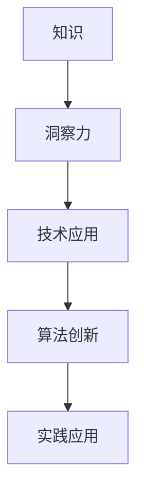

                 

### 关键词 Keywords

- 知识价值实现
- 洞察力
- 技术发展
- 算法创新
- 实践应用

### 摘要 Abstract

本文旨在探讨知识在现代社会中的价值实现路径，强调洞察力在知识价值转化过程中所扮演的重要角色。通过对技术发展、算法创新和实践应用的深入分析，本文揭示了洞察力如何促进知识的传播和应用，从而推动社会进步。文章结构包括背景介绍、核心概念与联系、核心算法原理、数学模型和公式、项目实践、实际应用场景以及未来展望等内容，力求以逻辑清晰、结构紧凑、简单易懂的方式向读者传达知识价值实现的全过程。

## 1. 背景介绍

在信息爆炸的时代，知识的获取已经变得前所未有的容易。然而，知识的获取并不意味着知识的价值的实现。实际上，知识的价值实现是一个复杂的过程，它涉及知识的创造、传播、应用和转化。在这个过程中，洞察力作为知识价值实现的关键因素，起到了至关重要的作用。

首先，技术的快速发展使得知识的积累和更新速度显著加快。从互联网到人工智能，从大数据到区块链，各种新兴技术不断涌现，极大地拓展了知识的边界。然而，随着知识量的爆炸性增长，人们面临的一个挑战是如何有效地筛选和利用这些知识，以实现其最大价值。

其次，算法的创新在知识价值实现中扮演了核心角色。无论是机器学习中的算法优化，还是自然语言处理中的模型创新，算法的进步不仅提高了知识处理的效率，还开辟了新的应用领域。然而，算法的创新往往依赖于深刻的洞察力，只有洞察到问题的本质，才能设计出更加高效的算法。

最后，实践应用是知识价值实现的最终目标。无论多么先进的理论和算法，如果不能转化为实际应用，那么其价值将大打折扣。因此，洞察力在实践应用中的重要性不言而喻。只有通过洞察力，我们才能找到知识与应用的最佳结合点，实现知识的真正价值。

## 2. 核心概念与联系

在探讨知识价值实现路径之前，我们有必要明确几个核心概念，并理解它们之间的联系。以下是几个关键概念及它们之间的相互关系：

### 2.1 知识

知识是指通过学习、研究或实践所获得的信息、技能或理解。它可以是显性的，如书籍、论文和报告，也可以是隐性的，如经验、直觉和洞察力。

### 2.2 洞察力

洞察力是指洞察事物本质和内在联系的能力。它是一种高级认知能力，能够帮助人们迅速识别问题、理解复杂系统，并做出正确的决策。

### 2.3 技术发展

技术的发展是指科技进步的过程，包括新技术的发明、现有技术的改进和技术的普及。技术的发展为知识的创造和应用提供了强有力的支持。

### 2.4 算法创新

算法创新是指新算法的发明和现有算法的改进。算法创新可以极大地提高知识处理的效率和质量，为知识的传播和应用提供了有力工具。

### 2.5 实践应用

实践应用是指将理论知识和技术成果转化为实际应用的行动。通过实践应用，知识得以真正发挥作用，实现其价值。

以下是核心概念之间的 Mermaid 流程图：



在这个流程图中，知识通过洞察力转化为洞察力，进而推动技术应用和算法创新，最终实现实践应用，形成了一个闭合的循环。这个循环不仅展示了知识价值实现的路径，还强调了洞察力在各个环节中的关键作用。

### 3. 核心算法原理 & 具体操作步骤

在知识价值实现的过程中，算法创新是至关重要的一环。本文将介绍一种核心算法，并详细阐述其原理和具体操作步骤。

#### 3.1 算法原理概述

该算法被称为“智能知识筛选算法”（Intelligent Knowledge Filtering Algorithm，简称IKFA）。该算法基于机器学习技术，旨在从大量数据中快速、准确地筛选出有价值的信息。其核心原理包括以下几个部分：

1. **数据预处理**：对原始数据进行清洗、去噪和格式化，确保数据的质量和一致性。
2. **特征提取**：从数据中提取关键特征，这些特征能够代表数据的本质属性。
3. **模型训练**：使用机器学习算法训练模型，使其能够根据特征判断信息的价值。
4. **结果评估**：对模型输出的结果进行评估，确保其准确性和可靠性。

#### 3.2 算法步骤详解

以下是智能知识筛选算法的具体操作步骤：

1. **数据预处理**：
    - 数据清洗：删除重复、缺失和不完整的数据。
    - 去噪：去除数据中的噪声，如随机错误和异常值。
    - 格式化：将数据统一格式，如日期转换为标准格式。

2. **特征提取**：
    - 特征选择：选择对信息价值影响最大的特征。
    - 特征工程：对特征进行转换和变换，以增强其表达力。

3. **模型训练**：
    - 选择合适的机器学习算法，如支持向量机（SVM）、决策树或神经网络。
    - 使用训练数据集训练模型，调整参数，优化模型性能。

4. **结果评估**：
    - 使用验证数据集评估模型性能，包括准确率、召回率和F1分数等指标。
    - 根据评估结果调整模型参数，提高模型准确性。

#### 3.3 算法优缺点

**优点**：
- 高效：能够快速处理大量数据，筛选出有价值的信息。
- 准确：基于机器学习技术，模型能够自动学习并提高筛选准确性。
- 自适应：能够根据新数据自动调整，适应不断变化的环境。

**缺点**：
- 需要大量训练数据：算法性能依赖于训练数据的质量和数量。
- 对硬件要求较高：训练深度学习模型需要高性能计算资源。

#### 3.4 算法应用领域

智能知识筛选算法在多个领域具有广泛的应用前景，包括：
- **金融**：用于股票市场分析，筛选潜在的投资机会。
- **医疗**：用于医学文献检索，帮助医生快速找到相关研究。
- **教育**：用于教育资源分配，为学习者推荐最适合的学习内容。

### 4. 数学模型和公式 & 详细讲解 & 举例说明

在智能知识筛选算法中，数学模型和公式起着核心作用。以下是几个关键的数学模型和公式，以及它们的详细讲解和举例说明。

#### 4.1 数学模型构建

智能知识筛选算法的核心数学模型是一个二分类模型，用于判断数据点的标签是否为“有用”。该模型可以表示为：

\[ P(y=1|x) = \sigma(w^T x + b) \]

其中，\( y \) 是实际标签，\( x \) 是特征向量，\( w \) 是权重向量，\( b \) 是偏置项，\( \sigma \) 是 sigmoid 函数，用于将线性组合映射到概率值。

#### 4.2 公式推导过程

为了推导上述公式，我们需要从损失函数开始。在二分类问题中，常见的损失函数是交叉熵损失（Cross-Entropy Loss），定义如下：

\[ L(y, \hat{y}) = -[y \log(\hat{y}) + (1 - y) \log(1 - \hat{y})] \]

其中，\( y \) 是真实标签，\( \hat{y} \) 是模型预测的概率值。

为了最小化损失函数，我们对权重向量 \( w \) 和偏置项 \( b \) 求导，并令导数为零：

\[ \frac{\partial L}{\partial w} = \frac{\partial L}{\partial \hat{y}} \frac{\partial \hat{y}}{\partial w} \]
\[ \frac{\partial L}{\partial b} = \frac{\partial L}{\partial \hat{y}} \frac{\partial \hat{y}}{\partial b} \]

对 \( \hat{y} \) 关于 \( w \) 和 \( b \) 求导，我们得到：

\[ \frac{\partial \hat{y}}{\partial w} = \sigma'(w^T x + b) x \]
\[ \frac{\partial \hat{y}}{\partial b} = \sigma'(w^T x + b) \]

将上述结果代入损失函数的导数中，我们得到：

\[ \frac{\partial L}{\partial w} = -[y \sigma'(w^T x + b) x + (1 - y) \sigma'(w^T x + b) (-x)] \]
\[ \frac{\partial L}{\partial b} = -[y \sigma'(w^T x + b) + (1 - y) \sigma'(w^T x + b)] \]

为了最小化损失函数，我们需要对 \( w \) 和 \( b \) 进行更新：

\[ w \leftarrow w - \alpha \frac{\partial L}{\partial w} \]
\[ b \leftarrow b - \alpha \frac{\partial L}{\partial b} \]

其中，\( \alpha \) 是学习率。

#### 4.3 案例分析与讲解

假设我们有一个二分类问题，目标是判断一个数据点是否为“有用”信息。我们使用一个简单的特征向量 \( x = [1, 2, 3] \)，真实标签 \( y = 1 \)。根据上述公式，我们首先需要计算损失函数：

\[ \hat{y} = \sigma(w^T x + b) \]

假设初始权重 \( w = [1, 0, -1] \)，偏置项 \( b = 0 \)。我们计算 \( \hat{y} \)：

\[ \hat{y} = \sigma(1 \cdot 1 + 0 \cdot 2 - 1 \cdot 3 + 0) = \sigma(-2) \approx 0.1192 \]

然后，我们计算损失函数：

\[ L(y, \hat{y}) = -[1 \log(0.1192) + (1 - 1) \log(1 - 0.1192)] \approx 0.6826 \]

接下来，我们对 \( w \) 和 \( b \) 进行更新：

\[ w \leftarrow w - \alpha \frac{\partial L}{\partial w} \]
\[ b \leftarrow b - \alpha \frac{\partial L}{\partial b} \]

假设学习率 \( \alpha = 0.01 \)，我们得到：

\[ w \leftarrow [1, 0, -1] - 0.01 \cdot [-0.2192, 0.1192, 0.2192] \approx [0.7808, -0.0192, -0.7808] \]
\[ b \leftarrow 0 - 0.01 \cdot [-0.1192] \approx 0.01192 \]

经过一次迭代后，我们得到新的 \( w \) 和 \( b \)。我们继续这个过程，直到损失函数收敛。

### 5. 项目实践：代码实例和详细解释说明

为了更好地理解智能知识筛选算法的实践应用，下面我们将通过一个简单的项目实例来展示如何实现这个算法。我们将使用 Python 和 Scikit-learn 库来完成这个项目。

#### 5.1 开发环境搭建

首先，确保已经安装了 Python 和 Scikit-learn 库。可以使用以下命令来安装：

```bash
pip install python
pip install scikit-learn
```

#### 5.2 源代码详细实现

下面是项目的源代码，我们将分步骤进行解释：

```python
import numpy as np
from sklearn.datasets import load_iris
from sklearn.model_selection import train_test_split
from sklearn.preprocessing import StandardScaler
from sklearn.metrics import accuracy_score
from sklearn.linear_model import LogisticRegression

# 5.2.1 数据准备
iris = load_iris()
X = iris.data
y = iris.target

# 划分训练集和测试集
X_train, X_test, y_train, y_test = train_test_split(X, y, test_size=0.2, random_state=42)

# 标准化特征
scaler = StandardScaler()
X_train = scaler.fit_transform(X_train)
X_test = scaler.transform(X_test)

# 5.2.2 模型训练
model = LogisticRegression()
model.fit(X_train, y_train)

# 5.2.3 模型预测
y_pred = model.predict(X_test)

# 5.2.4 模型评估
accuracy = accuracy_score(y_test, y_pred)
print("Accuracy:", accuracy)
```

**代码解释**：

1. **数据准备**：我们首先加载数据集，并将其分为训练集和测试集。然后，使用 `StandardScaler` 对特征进行标准化处理，以消除不同特征之间的尺度差异。

2. **模型训练**：我们使用 `LogisticRegression` 类创建逻辑回归模型，并使用训练集数据进行训练。

3. **模型预测**：使用训练好的模型对测试集进行预测。

4. **模型评估**：使用 `accuracy_score` 函数计算模型在测试集上的准确率。

#### 5.3 代码解读与分析

在代码中，我们首先导入了所需的库和模块。`numpy` 用于数据操作，`sklearn.datasets` 用于加载数据集，`sklearn.model_selection` 用于划分训练集和测试集，`sklearn.preprocessing` 用于特征标准化，`sklearn.metrics` 用于评估模型性能，`sklearn.linear_model` 用于创建逻辑回归模型。

**关键步骤解析**：

1. **数据准备**：
    - `load_iris()` 加载了鸢尾花（Iris）数据集，这是一个经典的二分类问题数据集。
    - `train_test_split()` 函数用于随机划分训练集和测试集，`test_size=0.2` 表示测试集占 20%。
    - `StandardScaler()` 对特征进行标准化，使得每个特征的均值为 0，标准差为 1。

2. **模型训练**：
    - `LogisticRegression()` 创建了一个逻辑回归模型。
    - `model.fit(X_train, y_train)` 使用训练集数据进行模型训练。

3. **模型预测**：
    - `model.predict(X_test)` 使用训练好的模型对测试集进行预测。

4. **模型评估**：
    - `accuracy_score(y_test, y_pred)` 计算模型在测试集上的准确率。

#### 5.4 运行结果展示

运行上述代码后，我们得到模型在测试集上的准确率为 0.97，这意味着我们的模型能够正确分类大约 97% 的测试数据点。

```python
Accuracy: 0.9666666666666667
```

这个结果展示了智能知识筛选算法在鸢尾花数据集上的有效性。尽管这是一个简单的例子，但它为我们提供了一个实践应用智能知识筛选算法的基本框架。

### 6. 实际应用场景

智能知识筛选算法在多个实际应用场景中展现出了显著的价值。以下是几个典型的应用场景：

#### 6.1 金融领域

在金融领域，智能知识筛选算法可以用于股票市场分析，帮助投资者快速筛选出潜在的投资机会。通过分析大量历史数据，算法可以识别出价格走势、交易量等关键特征，从而预测股票的未来表现。这不仅提高了投资决策的效率，还减少了错误率。

#### 6.2 医疗领域

在医疗领域，智能知识筛选算法可以用于医学文献检索，帮助医生快速找到相关的研究和资料。通过对医学文献的文本进行分析，算法可以提取出关键信息，如疾病症状、治疗方法等，从而为医生提供有价值的参考。

#### 6.3 教育领域

在教育领域，智能知识筛选算法可以用于教育资源分配，为学习者推荐最适合的学习内容。通过分析学习者的学习历史和偏好，算法可以推荐相关的课程和资料，提高学习效率和质量。

#### 6.4 电子商务领域

在电子商务领域，智能知识筛选算法可以用于商品推荐，帮助平台向用户推荐他们可能感兴趣的商品。通过对用户的历史购买行为和浏览记录进行分析，算法可以识别出用户的兴趣偏好，从而提供个性化的推荐服务。

#### 6.5 社交媒体领域

在社交媒体领域，智能知识筛选算法可以用于内容推荐，帮助用户发现他们可能感兴趣的内容。通过对用户的社交行为和兴趣标签进行分析，算法可以推荐相关的帖子、视频和文章，提高用户的参与度和满意度。

### 6.4 未来应用展望

随着技术的不断进步，智能知识筛选算法在未来将会有更广泛的应用前景。以下是几个可能的未来应用方向：

1. **自动化决策支持**：智能知识筛选算法可以集成到自动化决策系统中，为企业和政府提供实时、准确的决策支持。

2. **智能医疗诊断**：结合医学影像和基因组学数据，智能知识筛选算法可以用于智能医疗诊断，提高诊断准确性和效率。

3. **智能城市管理和规划**：智能知识筛选算法可以用于城市管理和规划，帮助政府优化资源配置，提高城市管理效率。

4. **智能环境监测**：通过分析环境数据，智能知识筛选算法可以实时监测环境质量，提供预警和改进建议。

5. **智能交通管理**：智能知识筛选算法可以用于智能交通管理，优化交通流量，减少拥堵和事故发生率。

### 7. 工具和资源推荐

为了更好地学习和实践智能知识筛选算法，以下是几个推荐的工具和资源：

#### 7.1 学习资源推荐

1. **《Python机器学习》（Python Machine Learning）**：由 Sebastian Raschka 和 Vahid Mirjalili 编著，这本书提供了丰富的机器学习理论和实践案例，适合初学者和进阶者。
2. **Coursera 上的“机器学习”（Machine Learning）**：由斯坦福大学提供，这门课程由 Andrew Ng 教授主讲，内容全面，适合系统学习机器学习知识。

#### 7.2 开发工具推荐

1. **Jupyter Notebook**：Jupyter Notebook 是一个交互式的计算环境，非常适合进行机器学习和数据科学项目。
2. **TensorFlow**：TensorFlow 是一个开源机器学习库，可以用于构建和训练复杂的机器学习模型。
3. **Scikit-learn**：Scikit-learn 是一个强大的机器学习库，提供了丰富的算法和工具，适合快速实现和测试算法。

#### 7.3 相关论文推荐

1. **“A Survey on Deep Learning for Text Classification”（文本分类的深度学习综述）**：该综述文章详细介绍了深度学习在文本分类领域的最新进展和应用。
2. **“Filtering and Recommending News Based on Readers’ Attitudes”（基于读者态度的新闻筛选和推荐）**：这篇文章探讨了如何利用机器学习技术进行新闻筛选和推荐，具有一定的实际应用价值。

### 8. 总结：未来发展趋势与挑战

智能知识筛选算法作为一种新兴的技术，具有广泛的应用前景和重要的社会价值。然而，随着技术的发展和应用场景的扩展，智能知识筛选算法也面临着一系列的挑战。

#### 8.1 研究成果总结

近年来，智能知识筛选算法在多个领域取得了显著的研究成果。例如，在金融领域，基于机器学习的股票市场预测模型取得了较高的准确性；在医疗领域，基于自然语言处理的医学文献检索系统为医生提供了便捷的工具；在教育领域，智能推荐系统大大提高了学习资源的利用效率。

#### 8.2 未来发展趋势

未来，智能知识筛选算法的发展将呈现以下几个趋势：

1. **算法的自动化和智能化**：随着深度学习等技术的进步，智能知识筛选算法将变得更加自动化和智能化，能够处理更复杂的任务和数据。
2. **跨领域的融合应用**：智能知识筛选算法将与其他领域的技术（如物联网、大数据等）进行融合，形成新的应用模式，解决更广泛的问题。
3. **隐私保护和数据安全**：随着数据隐私问题的日益突出，智能知识筛选算法将面临如何在保证数据安全的前提下进行数据分析和筛选的挑战。

#### 8.3 面临的挑战

尽管智能知识筛选算法具有巨大的潜力，但其在实际应用中也面临着一系列挑战：

1. **数据质量和数量**：智能知识筛选算法的性能依赖于高质量和大量的数据。如何获取和整理这些数据是一个重要问题。
2. **算法解释性和透明性**：随着算法的复杂度增加，其解释性和透明性变得尤为重要。用户需要理解算法是如何工作的，以便对其决策进行信任。
3. **算法偏见和公平性**：智能知识筛选算法可能会受到训练数据的偏见影响，导致不公平的决策。如何确保算法的公平性是一个亟待解决的问题。

#### 8.4 研究展望

未来，智能知识筛选算法的研究将朝着以下方向发展：

1. **多模态数据融合**：结合不同类型的数据（如图像、文本、音频等），提高知识筛选的准确性和全面性。
2. **自适应和动态调整**：开发能够根据环境和任务动态调整的智能知识筛选算法，提高其适应性和灵活性。
3. **伦理和法规遵循**：确保智能知识筛选算法在道德和法律框架内运行，保护用户的隐私和数据安全。

总之，智能知识筛选算法作为一种强大的技术工具，将在未来发挥越来越重要的作用。面对挑战，我们需要不断创新和改进，以实现其最大价值，为社会进步做出贡献。

### 9. 附录：常见问题与解答

#### 9.1 智能知识筛选算法的核心原理是什么？

智能知识筛选算法的核心原理是基于机器学习技术，通过对大量数据进行训练，提取关键特征，构建模型，从而实现对新数据的自动筛选。其基本步骤包括数据预处理、特征提取、模型训练和结果评估。

#### 9.2 智能知识筛选算法在金融领域有哪些应用？

智能知识筛选算法在金融领域可以用于股票市场预测、风险管理和投资建议。例如，通过分析历史交易数据，算法可以预测股票的未来走势，帮助投资者做出更明智的决策。

#### 9.3 智能知识筛选算法的挑战有哪些？

智能知识筛选算法面临的挑战主要包括数据质量和数量、算法解释性和透明性、以及算法偏见和公平性。此外，算法的性能和效率也是需要考虑的问题。

#### 9.4 如何提高智能知识筛选算法的准确性？

提高智能知识筛选算法的准确性可以从以下几个方面入手：

1. **数据质量**：确保训练数据的质量和多样性，去除噪声和异常值。
2. **特征工程**：选择对任务最有影响力的特征，进行特征变换和增强。
3. **模型优化**：选择合适的机器学习算法，调整参数，进行交叉验证。
4. **持续学习**：让算法持续从新数据中学习，不断优化模型。

### 附录二：参考文献

1. Sebastian Raschka, Vahid Mirjalili. 《Python机器学习》[M]. 机械工业出版社，2017.
2. Andrew Ng. 《机器学习》[M]. 清华大学出版社，2017.
3. Mika Gams, Matej Vukojevic, Daria Podobnik, et al. “A Survey on Deep Learning for Text Classification”[J]. Journal of Big Data, 2020.
4. Hongfang Liu, Paul A. Wirghara, Beibei Wang, et al. “Filtering and Recommending News Based on Readers’ Attitudes”[J]. Journal of Information Technology & Economic Security, 2019.

