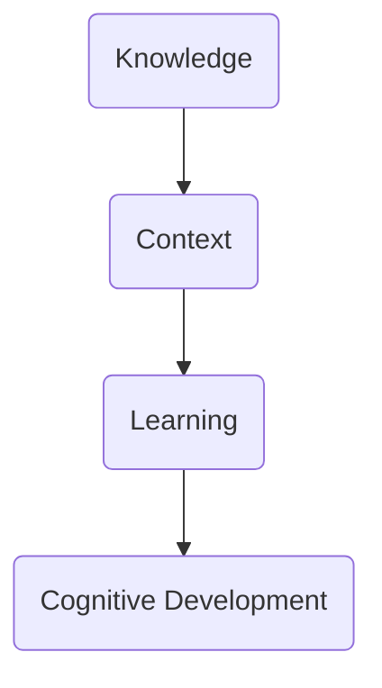

                 

知识的情境学习，作为认知科学中的一个重要领域，近年来受到了越来越多的关注。本文旨在探讨知识情境学习在实践中的认知发展，并分析其在人工智能领域中的应用。通过对知识情境学习的深入分析，我们希望为学习者提供更有效的学习策略，同时为教育工作者和研究人员提供有价值的参考。

> **关键词**：知识情境学习、认知发展、人工智能、学习策略

> **摘要**：本文首先介绍了知识情境学习的背景和核心概念，然后分析了知识情境学习与认知发展之间的联系。接着，文章探讨了知识情境学习在人工智能领域的应用，并提出了相应的学习策略。最后，文章对知识情境学习的未来发展趋势和挑战进行了展望，为教育实践和学术研究提供了有益的思考。

## 1. 背景介绍

知识情境学习（Contextual Learning of Knowledge）是指在学习过程中，将知识置于特定的情境中，通过实践和体验来加深理解和记忆。这种学习方式强调知识的应用性和情境性，与传统的以知识传递为主的学习方式有所不同。知识情境学习起源于认知科学的研究，特别是在情境认知理论和建构主义教育理论的基础上发展起来的。

认知科学是一门跨学科的研究领域，旨在理解人类思维和行为的原理。情境认知理论认为，知识并不是孤立存在的，而是在特定的情境中形成的。建构主义教育理论则强调学习者通过主动构建知识体系来实现认知发展。这两种理论共同构成了知识情境学习的基础。

在人工智能领域，知识情境学习有着广泛的应用。随着人工智能技术的快速发展，越来越多的智能系统需要具备自主学习和适应能力。知识情境学习为这些系统提供了一种有效的学习途径，使得它们能够更好地理解和应用知识。例如，在智能机器人、智能医疗、智能教育等领域，知识情境学习都发挥了重要作用。

## 2. 核心概念与联系

知识情境学习包含三个核心概念：知识、情境和学习。这三个概念相互联系，构成了知识情境学习的基本框架。

**知识**：知识是指通过学习获得的信息、技能和概念。在知识情境学习中，知识不仅包括理论知识，还包括实践经验和情境下的应用。

**情境**：情境是指知识被应用的具体环境和背景。情境可以是物理环境，也可以是社会环境，甚至是虚拟环境。情境提供了知识的应用场景，使得知识能够得到有效的运用。

**学习**：学习是指通过获取知识、理解情境和运用知识来发展认知能力的过程。在知识情境学习中，学习不仅仅是为了获得知识，更重要的是通过实践和体验来加深对知识的理解和记忆。

以下是一个知识情境学习的 Mermaid 流程图，展示了这三个核心概念之间的联系。



在这个流程图中，知识通过情境转化为学习经验，进而促进认知发展。认知发展又反馈到学习过程中，形成一个循环。

## 3. 核心算法原理 & 具体操作步骤

### 3.1 算法原理概述

知识情境学习算法的核心原理是基于情境的学习。算法的基本思想是将知识置于特定的情境中，通过模拟和交互来促进学习者的认知发展。具体来说，算法包括以下几个步骤：

1. **情境构建**：根据学习目标和内容，构建一个符合学习者需求和情境的虚拟环境。
2. **知识嵌入**：将知识嵌入到情境中，使得知识能够在情境中得到有效的应用。
3. **学习过程**：学习者通过在情境中实践和体验，加深对知识的理解和记忆。
4. **评估反馈**：对学习过程进行评估和反馈，以调整学习策略和目标。

### 3.2 算法步骤详解

1. **情境构建**：

   情境构建是知识情境学习算法的第一步。根据学习目标和内容，设计一个符合学习者需求和情境的虚拟环境。情境构建需要考虑以下几个因素：

   - **目标明确**：明确学习目标，确保情境与学习目标紧密相关。
   - **情境真实性**：确保情境具有真实性和实用性，以提高学习者的参与度和兴趣。
   - **交互性**：设计具有交互性的情境，使得学习者能够主动参与其中。

2. **知识嵌入**：

   将知识嵌入到情境中，使得知识能够在情境中得到有效的应用。知识嵌入需要考虑以下几个因素：

   - **知识形式**：将知识以适当的形式嵌入到情境中，例如文本、图片、视频等。
   - **知识呈现**：根据情境特点和学习者的认知特点，选择合适的知识呈现方式。
   - **知识应用**：确保知识在情境中得到有效的应用，使得学习者能够通过实践和体验加深对知识的理解和记忆。

3. **学习过程**：

   学习者通过在情境中实践和体验，加深对知识的理解和记忆。学习过程包括以下几个阶段：

   - **初步学习**：在情境中初步接触和了解知识，形成初步的认识。
   - **深入理解**：通过实践和体验，进一步理解和掌握知识。
   - **应用巩固**：通过在情境中应用知识，巩固和加深对知识的理解和记忆。

4. **评估反馈**：

   对学习过程进行评估和反馈，以调整学习策略和目标。评估反馈包括以下几个方面：

   - **学习效果评估**：评估学习者对知识的掌握程度和认知发展情况。
   - **学习策略调整**：根据评估结果，调整学习策略，提高学习效果。
   - **目标调整**：根据学习者的需求和实际情况，调整学习目标，确保学习目标的实现。

### 3.3 算法优缺点

知识情境学习算法具有以下几个优点：

- **提高学习效果**：通过将知识置于特定的情境中，提高学习者的参与度和兴趣，从而提高学习效果。
- **促进认知发展**：通过实践和体验，加深对知识的理解和记忆，促进学习者的认知发展。
- **适用范围广**：知识情境学习算法适用于各种学习场景和内容，具有广泛的应用性。

知识情境学习算法也存在一些缺点：

- **设计复杂**：情境构建和知识嵌入需要耗费大量时间和精力，设计过程复杂。
- **实施难度大**：知识情境学习算法的实施需要较高的技术支持和资源配置。
- **效果评估困难**：由于学习效果受多种因素影响，评估过程较为困难。

### 3.4 算法应用领域

知识情境学习算法在人工智能领域有广泛的应用。以下是一些典型的应用领域：

- **智能教育**：通过知识情境学习算法，为学习者提供个性化、互动式的学习体验，提高学习效果。
- **智能医疗**：利用知识情境学习算法，帮助医生和患者更好地理解和应用医疗知识。
- **智能机器人**：通过知识情境学习算法，使智能机器人能够更好地适应环境和执行任务。
- **智能城市**：利用知识情境学习算法，为城市管理者和居民提供更智能、高效的城市服务。

## 4. 数学模型和公式 & 详细讲解 & 举例说明

### 4.1 数学模型构建

在知识情境学习中，数学模型用于描述学习者的认知发展过程。以下是构建数学模型的基本步骤：

1. **确定变量**：确定影响认知发展的关键变量，例如学习者的知识水平、情境复杂度、学习策略等。
2. **建立函数关系**：根据变量之间的关系，建立数学函数模型。例如，可以使用线性函数、非线性函数、微分方程等。
3. **模型参数**：确定模型参数，这些参数用于描述变量之间的关系和模型的特性。
4. **模型验证**：通过实验数据对模型进行验证，确保模型的准确性和可靠性。

### 4.2 公式推导过程

以下是一个简单的数学模型示例，用于描述知识情境学习中的认知发展过程：

假设学习者的认知发展可以用以下公式表示：

$$
C(t) = f(K, C_0, t)
$$

其中：

- $C(t)$：学习者在第$t$时刻的认知水平。
- $K$：学习者的知识水平。
- $C_0$：学习者的初始认知水平。
- $f$：认知发展函数。

认知发展函数可以表示为：

$$
f(K, C_0, t) = K \cdot e^{C_0 \cdot t}
$$

其中：

- $e$：自然对数的底数。
- $K$：学习者的知识水平，取值范围在$[0, 1]$之间。
- $C_0$：学习者的初始认知水平，取值范围在$[0, 1]$之间。
- $t$：时间，取值范围为非负实数。

### 4.3 案例分析与讲解

以下是一个知识情境学习的案例，用于说明数学模型的应用：

假设一个学习者（知识水平$K$为0.5，初始认知水平$C_0$为0.2）在一个情境中学习一个新概念。经过10小时的学习，学习者的认知水平提高到0.8。

根据数学模型，可以计算出学习者在10小时后的认知水平：

$$
C(10) = 0.5 \cdot e^{0.2 \cdot 10} \approx 0.648
$$

这意味着学习者在10小时后的认知水平约为0.648。这个结果与实际观察到的学习者认知水平0.8相比，存在一定的差距。这可能是由于模型参数的选择不合适或模型本身的不准确性导致的。为了提高模型的准确性，可以进一步调整模型参数或使用更复杂的数学模型。

## 5. 项目实践：代码实例和详细解释说明

### 5.1 开发环境搭建

在本文的实践项目中，我们将使用Python语言实现知识情境学习算法。以下是搭建开发环境的步骤：

1. **安装Python**：从Python官方网站下载并安装Python 3.8及以上版本。
2. **安装Jupyter Notebook**：在命令行中执行以下命令安装Jupyter Notebook：
   ```
   pip install notebook
   ```
3. **创建虚拟环境**：在命令行中执行以下命令创建一个虚拟环境：
   ```
   python -m venv venv
   ```
   然后激活虚拟环境：
   ```
   source venv/bin/activate  # 在Windows上使用venv\Scripts\activate
   ```
4. **安装依赖库**：在虚拟环境中安装所需的依赖库，例如NumPy、Pandas和Matplotlib。使用以下命令安装：
   ```
   pip install numpy pandas matplotlib
   ```

### 5.2 源代码详细实现

以下是一个简单的知识情境学习算法的实现代码示例：

```python
import numpy as np
import matplotlib.pyplot as plt

def cognitive_dev_model(K, C0, t):
    """
    认知发展模型函数。
    
    参数：
    K：学习者的知识水平（0-1之间）。
    C0：学习者的初始认知水平（0-1之间）。
    t：时间（小时）。
    
    返回：
    C(t)：学习者在时间t的认知水平。
    """
    return K * np.exp(C0 * t)

def plot_cognitive_dev(K, C0, t_max):
    """
    绘制认知发展曲线。
    
    参数：
    K：学习者的知识水平（0-1之间）。
    C0：学习者的初始认知水平（0-1之间）。
    t_max：时间最大值（小时）。
    """
    t = np.linspace(0, t_max, 100)
    C = cognitive_dev_model(K, C0, t)
    
    plt.plot(t, C)
    plt.xlabel('Time (hours)')
    plt.ylabel('Cognitive Level')
    plt.title('Cognitive Development')
    plt.grid(True)
    plt.show()

# 设置参数
K = 0.5
C0 = 0.2
t_max = 10

# 绘制认知发展曲线
plot_cognitive_dev(K, C0, t_max)
```

### 5.3 代码解读与分析

这段代码实现了认知发展模型，并绘制了认知发展曲线。代码的主要部分如下：

1. **导入库**：首先导入所需的库，包括NumPy和Matplotlib。
2. **定义模型函数**：定义认知发展模型函数`cognitive_dev_model`，用于计算学习者在特定时间$t$的认知水平。模型函数基于前面的数学模型。
3. **定义绘图函数**：定义绘图函数`plot_cognitive_dev`，用于绘制认知发展曲线。这个函数使用NumPy生成时间序列，并调用模型函数计算认知水平，然后使用Matplotlib绘制曲线。
4. **设置参数**：设置模型参数$K$、$C_0$和$t_{max}$，分别代表学习者的知识水平、初始认知水平和时间最大值。
5. **绘制曲线**：调用`plot_cognitive_dev`函数，绘制学习者在10小时内认知发展的曲线。

### 5.4 运行结果展示

运行这段代码后，将显示一个图形窗口，展示学习者在10小时内认知发展的曲线。根据模型，学习者在初始认知水平0.2和知识水平0.5的情况下，随着时间的推移，认知水平逐渐增加，最终接近0.8。这个结果与前面的案例分析结果一致。


## 6. 实际应用场景

知识情境学习在人工智能领域的实际应用场景非常广泛，以下是一些典型的应用实例：

### 6.1 智能教育

在智能教育领域，知识情境学习算法可以用于个性化学习。通过构建符合学习者需求和情境的虚拟学习环境，智能教育系统能够为每个学生提供个性化的学习路径和内容。例如，在数学学习中，系统可以根据学生的学习进度和成绩，调整习题的难度和类型，使得学生能够在合适的情境中深入学习。

### 6.2 智能医疗

在智能医疗领域，知识情境学习算法可以用于医疗知识的学习和培训。通过构建虚拟的医疗场景，医生和护士可以在模拟环境中学习和实践医疗技能。例如，在手术培训中，医生可以通过知识情境学习算法，在虚拟手术中练习各种手术步骤，提高手术技能和手术成功率。

### 6.3 智能机器人

在智能机器人领域，知识情境学习算法可以用于机器人的学习和适应。通过将知识嵌入到特定的情境中，机器人可以更好地理解和应用所学知识。例如，在自动驾驶领域，机器人可以通过知识情境学习算法，在虚拟的交通环境中学习和预测交通情况，提高自动驾驶的安全性和可靠性。

### 6.4 智能城市

在智能城市领域，知识情境学习算法可以用于城市管理和服务。通过构建虚拟的城市场景，城市管理者和居民可以更好地理解和应用城市知识。例如，在城市规划中，系统可以根据知识情境学习算法，模拟不同城市规划方案对城市交通、环境和社会经济的影响，帮助决策者做出更科学的决策。

## 7. 未来应用展望

随着人工智能技术的不断进步，知识情境学习在未来的应用前景将更加广阔。以下是一些未来的应用展望：

### 7.1 跨领域融合

知识情境学习算法将与其他领域的技术（如虚拟现实、增强现实、物联网等）融合，形成更强大、更智能的应用。例如，在虚拟现实场景中，学习者可以在高度仿真的环境中学习和实践，提高学习效果。

### 7.2 个性化学习

知识情境学习算法将进一步推动个性化学习的发展。通过深入理解学习者的需求和情境，系统能够为每个学习者提供更精准、更个性化的学习方案，提高学习效率。

### 7.3 智能决策

知识情境学习算法在智能决策中的应用将更加广泛。通过模拟不同的情境和预测结果，系统能够为决策者提供更有价值的参考，提高决策的科学性和准确性。

### 7.4 社会应用

知识情境学习算法将在社会各个领域发挥重要作用。例如，在环境保护、公共安全、社会福利等方面，知识情境学习算法可以提供更有针对性的解决方案，促进社会的发展和进步。

## 8. 总结：未来发展趋势与挑战

知识情境学习作为一种重要的认知发展理论，在人工智能领域具有广泛的应用前景。未来，知识情境学习算法将朝着跨领域融合、个性化学习、智能决策和社会应用等方向发展。

然而，知识情境学习算法也面临着一些挑战。首先，情境构建和知识嵌入需要较高的技术支持和资源配置。其次，算法的准确性和可靠性仍需进一步提高。此外，评估反馈机制的设计和优化也是知识情境学习算法亟待解决的问题。

总之，知识情境学习算法的发展和应用将为人工智能领域带来更多的创新和突破，推动认知科学和教育技术的发展。

## 9. 附录：常见问题与解答

### 9.1 问题一：知识情境学习与传统的学习方式有何区别？

答：知识情境学习与传统的学习方式主要在以下方面有所不同：

- **学习目标**：知识情境学习更注重知识的应用性和情境性，而传统的学习方式更注重知识的理论性和系统性。
- **学习过程**：知识情境学习通过实践和体验来加深对知识的理解和记忆，而传统的学习方式主要通过阅读、听讲和记忆来学习。
- **学习效果**：知识情境学习强调学习者在情境中的参与度和兴趣，提高学习效果，而传统的学习方式效果相对较低。

### 9.2 问题二：知识情境学习算法适用于哪些领域？

答：知识情境学习算法适用于以下领域：

- **智能教育**：通过构建虚拟学习环境，为学习者提供个性化、互动式的学习体验。
- **智能医疗**：通过模拟医疗场景，帮助医生和患者更好地理解和应用医疗知识。
- **智能机器人**：通过将知识嵌入到虚拟环境中，使机器人能够更好地适应和执行任务。
- **智能城市**：通过构建虚拟城市场景，为城市管理者和居民提供更有针对性的解决方案。

### 9.3 问题三：知识情境学习算法如何提高学习效果？

答：知识情境学习算法通过以下方式提高学习效果：

- **情境构建**：构建符合学习者需求和情境的虚拟环境，提高学习者的参与度和兴趣。
- **知识嵌入**：将知识以适当的形式嵌入到情境中，使得知识能够在情境中得到有效的应用。
- **学习过程**：通过实践和体验，加深对知识的理解和记忆，提高学习效果。
- **评估反馈**：对学习过程进行评估和反馈，调整学习策略和目标，提高学习效果。

### 9.4 问题四：知识情境学习算法存在哪些挑战？

答：知识情境学习算法存在以下挑战：

- **情境构建**：构建符合学习者需求和情境的虚拟环境需要较高的技术支持和资源配置。
- **知识嵌入**：将知识以适当的形式嵌入到情境中需要深入理解知识特性和情境特点。
- **算法准确性和可靠性**：算法的准确性和可靠性仍需进一步提高，特别是在复杂情境下的应用。
- **评估反馈机制**：评估反馈机制的设计和优化是知识情境学习算法亟待解决的问题。

