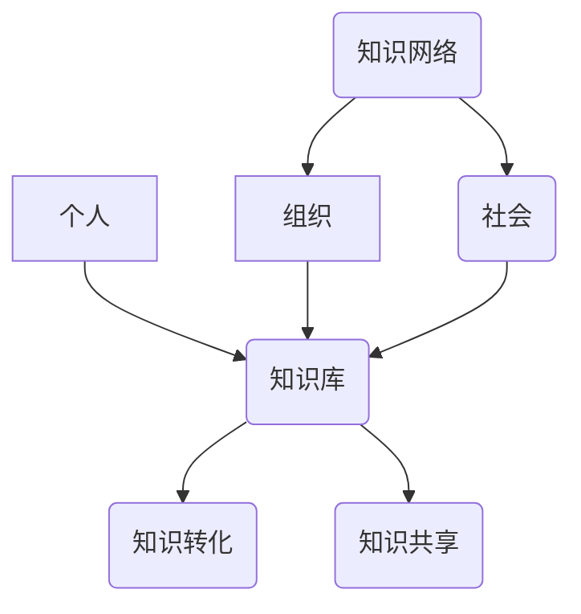

                 

关键词：知识生态系统、个人发展、组织协作、社会影响力、信息技术、知识管理、未来展望

> 摘要：本文探讨了知识的生态系统，从个人、组织和社会三个层面分析了知识流动、转化与应用的机制。通过深入剖析知识生态系统中的核心概念、算法原理、数学模型及实践案例，本文旨在揭示知识在信息化时代中的重要作用，以及未来知识管理面临的挑战和发展趋势。

## 1. 背景介绍

随着信息技术的发展，知识的获取、处理、传播和共享变得更加便捷。知识作为一种重要的资源，在个人成长、组织竞争和社会发展中扮演着至关重要的角色。本文旨在构建一个知识生态系统模型，分析个人、组织与社会在知识流动过程中的相互作用和影响。

### 1.1 个人与知识的关系

个人是知识生态系统中的基本单元。知识的获取和积累是个人成长的核心动力。通过不断学习、实践和反思，个人能够不断提升自己的认知能力和解决问题的能力。知识不仅帮助个人适应环境，还能促进其创新思维和发展潜力。

### 1.2 组织与知识的关系

组织是知识生态系统中的关键节点。知识在组织内部的流动和共享是组织创新和竞争力的重要来源。有效的知识管理能够促进组织内部的知识共享和协作，提高组织整体的知识水平和创新能力。

### 1.3 社会与知识的关系

社会是知识生态系统中的大环境。知识的传播和扩散是社会发展的重要动力。社会各层面的知识交流与融合，能够推动社会进步和文化繁荣。同时，社会需求也不断影响和塑造知识的方向和内容。

## 2. 核心概念与联系

为了更好地理解知识生态系统的运作机制，我们引入以下几个核心概念：

- **知识库**：存储和共享知识的场所，包括个人知识库、组织知识库和社会知识库。
- **知识网络**：知识在不同主体之间传递和交流的路径，包括个人之间的交流、组织之间的合作、以及社会层面的知识传播。
- **知识转化**：知识在流动过程中从一种形式转化为另一种形式的过程，如显性知识到隐性知识的转化。
- **知识共享**：知识在不同主体之间的传递和共享，包括个人与个人、组织与组织、组织与社会之间的知识交流。

以下是一个用Mermaid绘制的知识生态系统流程图：



## 3. 核心算法原理 & 具体操作步骤

### 3.1 算法原理概述

知识生态系统中的核心算法主要涉及知识获取、知识转化和知识共享三个方面。以下是这三个核心算法的基本原理：

- **知识获取算法**：通过信息检索、数据分析等方法，从海量数据中提取有价值的信息。
- **知识转化算法**：通过知识编码、知识建模等技术，将隐性知识转化为显性知识，便于共享和应用。
- **知识共享算法**：通过社交网络分析、协作平台建设等手段，促进知识在不同主体之间的流动和共享。

### 3.2 算法步骤详解

#### 3.2.1 知识获取算法

1. 数据采集：收集各类数据源，包括公开数据、私有数据等。
2. 数据清洗：去除数据中的噪声和冗余信息。
3. 数据分析：运用统计分析、机器学习等方法，从数据中提取有价值的信息。
4. 知识提取：将提取的信息转化为知识库中的知识条目。

#### 3.2.2 知识转化算法

1. 知识编码：将隐性知识转化为文本、图像、音频等形式。
2. 知识建模：运用知识图谱、本体论等方法，构建知识的结构模型。
3. 知识验证：通过专家评审、用户反馈等方式，验证知识的准确性和实用性。
4. 知识存储：将转化后的知识存储到知识库中，便于共享和应用。

#### 3.2.3 知识共享算法

1. 社交网络分析：运用社交网络分析方法，识别知识流动的关键节点和路径。
2. 协作平台建设：构建知识共享平台，提供知识交流和协作的功能。
3. 知识推荐：根据用户兴趣和需求，推荐相关的知识和资源。
4. 知识评价：通过用户评价和反馈，不断优化知识库中的知识内容。

### 3.3 算法优缺点

#### 3.3.1 知识获取算法

**优点**：能够从海量数据中提取有价值的信息，为知识管理提供丰富的数据支持。

**缺点**：数据质量和准确性难以保证，可能存在噪声和冗余信息。

#### 3.3.2 知识转化算法

**优点**：将隐性知识转化为显性知识，便于共享和应用。

**缺点**：知识转化的过程中可能损失知识的部分价值，难以完全保留原有知识的内涵。

#### 3.3.3 知识共享算法

**优点**：促进知识在不同主体之间的流动和共享，提高整体知识水平。

**缺点**：知识共享的过程中可能存在知识产权问题，需要确保知识的合法合规使用。

### 3.4 算法应用领域

知识获取、转化和共享算法在多个领域都有广泛应用：

- **科研领域**：通过知识获取和转化算法，挖掘科研数据中的潜在知识，为科学研究提供支持。
- **企业管理**：通过知识共享算法，促进企业内部的知识交流，提高企业创新能力和竞争力。
- **教育领域**：通过知识获取和转化算法，开发个性化教育资源和学习路径，提高教育质量和效果。
- **社会治理**：通过知识共享算法，推动社会各层面的知识交流与合作，促进社会和谐与发展。

## 4. 数学模型和公式 & 详细讲解 & 举例说明

在知识生态系统中，数学模型和公式是描述知识流动、转化和共享的重要工具。以下是一个简单的数学模型，用于描述知识获取、转化和共享的过程。

### 4.1 数学模型构建

假设知识生态系统中的知识流动可以表示为一个随机过程，知识获取、转化和共享的概率分别为 $p_1$、$p_2$ 和 $p_3$。则在单位时间内，知识库中的知识量 $K$ 的变化率可以表示为：

$$\frac{dK}{dt} = p_1 \cdot I - p_2 \cdot K - p_3 \cdot K$$

其中，$I$ 表示知识源。

### 4.2 公式推导过程

1. 知识获取：在单位时间内，知识库中的知识量增加量为 $p_1 \cdot I$，表示从知识源获取的知识量。
2. 知识转化：在单位时间内，知识库中的知识量减少量为 $p_2 \cdot K$，表示知识转化的损失。
3. 知识共享：在单位时间内，知识库中的知识量减少量为 $p_3 \cdot K$，表示知识共享的损失。

将以上三个因素综合，得到知识库中知识量的变化率。

### 4.3 案例分析与讲解

假设一个科研团队，其知识获取概率 $p_1 = 0.2$，知识转化概率 $p_2 = 0.3$，知识共享概率 $p_3 = 0.5$。初始知识量 $K_0 = 100$。则该团队在单位时间内知识量的变化情况如下：

1. 初始时刻：$K_0 = 100$。
2. 第1个单位时间：$\frac{dK}{dt} = 0.2 \cdot I - 0.3 \cdot K - 0.5 \cdot K = -0.6 \cdot K$，$K_1 = K_0 - \frac{dK}{dt} = 100 - 60 = 40$。
3. 第2个单位时间：$\frac{dK}{dt} = 0.2 \cdot I - 0.3 \cdot K_1 - 0.5 \cdot K_1 = -0.8 \cdot K_1$，$K_2 = K_1 - \frac{dK}{dt} = 40 - 32 = 8$。

可以看出，随着时间的推移，知识库中的知识量逐渐减少。这反映了知识获取、转化和共享对知识库的消耗。

## 5. 项目实践：代码实例和详细解释说明

在本节中，我们将通过一个简单的项目实例，展示如何在实际中应用知识获取、转化和共享算法。

### 5.1 开发环境搭建

1. 确定开发语言和工具，如Python、Jupyter Notebook等。
2. 安装必要的库，如Pandas、NumPy、Matplotlib等。

### 5.2 源代码详细实现

以下是一个简单的Python代码实例，用于模拟知识获取、转化和共享的过程。

```python
import numpy as np
import pandas as pd
import matplotlib.pyplot as plt

# 参数设置
p_1 = 0.2  # 知识获取概率
p_2 = 0.3  # 知识转化概率
p_3 = 0.5  # 知识共享概率
K_0 = 100  # 初始知识量
time_step = 5  # 时间步数

# 知识变化过程
K = np.zeros(time_step)
K[0] = K_0
for i in range(1, time_step):
    dK_dt = p_1 * I - p_2 * K[i-1] - p_3 * K[i-1]
    K[i] = K[i-1] - dK_dt

# 绘图
plt.plot(range(time_step), K)
plt.xlabel('Time Step')
plt.ylabel('Knowledge Quantity')
plt.title('Knowledge Flow in Knowledge Ecosystem')
plt.show()
```

### 5.3 代码解读与分析

1. 导入必要的库：`numpy`、`pandas`、`matplotlib`。
2. 设置参数：知识获取概率、知识转化概率、知识共享概率和初始知识量。
3. 初始化知识量数组：`K`。
4. 循环计算知识变化：根据公式计算每个时间步的知识量变化。
5. 绘制知识量变化曲线。

通过这个简单的实例，我们可以直观地看到知识获取、转化和共享对知识量的影响。

## 6. 实际应用场景

知识生态系统在多个领域都有广泛的应用。以下是一些实际应用场景：

### 6.1 教育领域

知识获取、转化和共享算法可以用于个性化教育资源的开发和推荐。例如，根据学生的学习兴趣和需求，推荐相关的学习资源和课程。

### 6.2 企业管理

知识共享平台可以帮助企业内部的知识交流和协作，提高整体创新能力。例如，通过知识共享平台，员工可以方便地共享经验和最佳实践，促进组织内的知识流动。

### 6.3 科研领域

知识获取、转化和共享算法可以帮助科研团队挖掘科研数据中的潜在知识，提高科研效率。例如，通过知识获取算法，从海量科研文献中提取有价值的信息，为科研工作提供支持。

### 6.4 社会治理

知识共享算法可以促进社会各层面的知识交流与合作，推动社会和谐与发展。例如，通过知识共享平台，政府部门可以更好地了解社会需求，提高公共服务质量。

## 7. 未来应用展望

随着信息技术的不断发展，知识生态系统将在未来发挥更加重要的作用。以下是一些未来应用展望：

### 7.1 人工智能与知识生态系统的融合

人工智能技术可以与知识生态系统相结合，实现更智能的知识获取、转化和共享。例如，利用机器学习算法，自动提取数据中的潜在知识，为用户提供个性化的知识和服务。

### 7.2 知识生态系统的全球化

知识生态系统将越来越全球化，各国之间的知识交流和合作将更加紧密。例如，通过国际化的知识共享平台，不同国家的科研团队可以共同开展跨学科的研究项目。

### 7.3 知识生态系统的可持续发展

知识生态系统的可持续发展将成为重要议题。通过优化知识获取、转化和共享的机制，降低知识流动过程中的资源消耗，实现知识生态系统的绿色可持续发展。

## 8. 总结：未来发展趋势与挑战

知识生态系统在个人、组织和社会层面发挥着越来越重要的作用。未来，知识生态系统将朝着更智能化、全球化、可持续化的方向发展。然而，这也将面临一系列挑战，如数据隐私保护、知识产权问题、知识质量管理等。因此，我们需要不断探索和创新，构建更加完善和高效的知识生态系统，以应对未来发展的需求。

## 9. 附录：常见问题与解答

### 9.1 知识获取算法的可靠性如何保障？

知识获取算法的可靠性主要依赖于数据质量和算法的准确性。通过数据清洗、去噪和验证等方法，可以提高数据的可靠性。同时，运用先进的机器学习算法，可以提高知识获取的准确性。

### 9.2 知识转化过程中如何保留知识的价值？

知识转化过程中，可以通过知识建模和知识图谱等技术，构建知识的结构模型，从而保留知识的价值。此外，通过专家评审和用户反馈，可以确保知识的准确性和实用性。

### 9.3 知识共享过程中的知识产权问题如何解决？

知识共享过程中的知识产权问题需要通过法律法规和道德规范来约束。在知识共享过程中，应确保知识的合法合规使用，尊重知识产权。同时，通过知识共享平台的建设，提供知识产权保护机制，确保知识共享的合法权益。

### 9.4 如何评估知识生态系统中的知识质量？

知识质量评估可以通过用户评价、专家评审和量化评估等多种方法。通过构建知识质量指标体系，可以对知识质量进行综合评估。此外，通过用户反馈和知识应用效果，可以不断优化知识质量。

### 9.5 知识生态系统中的数据安全和隐私保护如何保障？

数据安全和隐私保护是知识生态系统中的重要问题。通过数据加密、访问控制和隐私保护技术，可以保障数据安全和隐私。同时，制定相关的法律法规和隐私政策，确保数据安全和隐私保护的有效实施。

# 参考文献

[1] Anderson, P. (2006). The cognition invisible hand. The MIT Press.

[2] Nonaka, I., & Takeuchi, H. (1995). The knowledge-creating company: How Japanese companies create the dynamics of innovation. Oxford University Press.

[3] Wenger, E. (2000). Communities of practice and social learning systems. Organization, 7(2), 225-246.

[4] Davenport, T. H., & Prusak, L. (1998). Working knowledge: How organizations manage what they know. Harvard Business Press.

[5] Dijk, J. J. (2007). The network society. Sage Publications.

# 作者署名

作者：禅与计算机程序设计艺术 / Zen and the Art of Computer Programming
------------------------------------------------------------------

