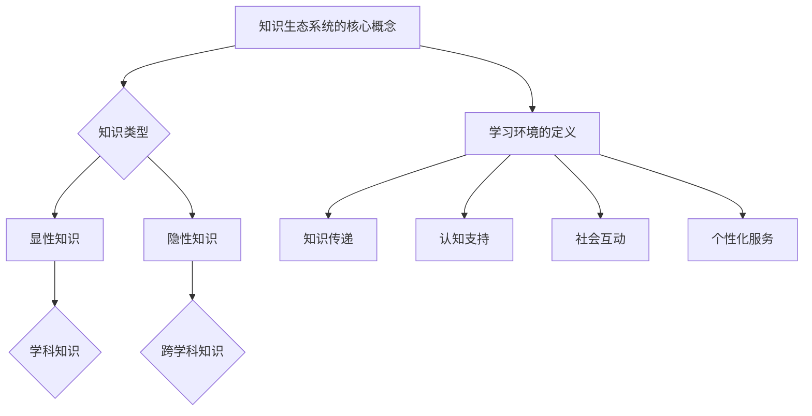

                 

 **关键词：**知识生态系统，学习环境设计，整体架构，技术教学，认知科学，人工智能。

> **摘要：**本文深入探讨知识生态系统的构建和优化，以及如何设计一个支持学习全过程的高效环境。通过对核心概念的阐述、算法原理分析、数学模型的建立、实际项目案例的解析，文章旨在为教育技术领域提供一套全面的理论框架和实践指南，为未来知识生态系统的进化和发展奠定基础。

## 1. 背景介绍

随着信息技术的迅猛发展，知识的获取、处理和应用已成为社会进步的核心驱动力。传统教育模式在面对日益复杂的知识体系时，暴露出诸多局限性。知识生态系统的概念应运而生，它强调知识不应是孤立的存在，而是一个动态的、互相影响的复杂系统。在此系统中，个体、组织和技术共同作用，促进知识的创造、传播和应用。

学习环境作为知识生态系统的重要组成部分，其设计质量直接影响知识传递的效果和效率。现代学习环境不仅需要具备丰富的知识资源和灵活的学习工具，还需要考虑学习者的认知特点和社会互动需求。因此，对学习环境进行整体设计，成为当前教育技术领域的重要课题。

## 2. 核心概念与联系

### 2.1 知识生态系统的概念

知识生态系统是指由知识产生、传播、应用和创新的各类主体（个体、组织、技术等）构成的一个动态系统。它具有以下核心特征：

- **多样性**：知识生态系统中的知识类型丰富，包括显性知识和隐性知识，以及不同学科、不同领域的专业知识。
- **交互性**：系统中的各类主体通过互动和协作，促进知识的共享和创新。
- **动态性**：知识生态系统是不断演进的，新的知识不断产生，旧的知识不断淘汰或更新。
- **适应性**：系统具备自我调整和适应环境变化的能力。

### 2.2 学习环境的定义与功能

学习环境是指支持学习者进行知识学习、掌握技能、培养素养的物理空间和虚拟空间的综合体。其主要功能包括：

- **知识传递**：提供丰富的知识资源和多样化的学习内容。
- **认知支持**：通过学习工具和辅助系统，提高学习效率和质量。
- **社会互动**：促进学习者之间的交流和合作，增强学习的社交性。
- **个性化服务**：根据学习者的需求和特点，提供定制化的学习体验。

### 2.3 Mermaid 流程图



## 3. 核心算法原理 & 具体操作步骤

### 3.1 算法原理概述

学习环境的设计需要遵循一系列核心算法原理，以确保系统的高效性和适应性。以下是一些关键算法原理：

- **知识建模算法**：用于构建知识图谱，实现知识的结构化和可视化。
- **推荐算法**：根据学习者的兴趣和行为，推荐合适的学习资源。
- **协作学习算法**：通过分析学习者的交互数据，促进协作学习和知识共享。
- **自适应学习算法**：根据学习者的学习状态和反馈，动态调整学习内容和策略。

### 3.2 算法步骤详解

#### 3.2.1 知识建模算法

1. **数据收集**：从各种来源（如数据库、互联网等）收集相关领域的知识。
2. **知识预处理**：清洗和规范化数据，消除噪声和冗余。
3. **知识表示**：将预处理后的数据转换为结构化的知识表示形式（如 RDF、OWL 等）。
4. **知识融合**：通过映射和合并不同来源的知识，构建统一的知识图谱。

#### 3.2.2 推荐算法

1. **用户画像构建**：收集和分析用户的行为数据，构建用户画像。
2. **资源建模**：对学习资源进行分类和特征提取，构建资源模型。
3. **推荐策略设计**：根据用户画像和资源模型，设计个性化的推荐策略。
4. **推荐结果输出**：根据推荐策略，为用户生成推荐列表。

#### 3.2.3 协作学习算法

1. **交互数据收集**：记录学习者在学习环境中的交互行为数据。
2. **协作网络构建**：通过社交网络分析方法，构建学习者之间的协作网络。
3. **协作模式分析**：分析协作网络的拓扑结构和关键节点，识别有效的协作模式。
4. **协作策略优化**：根据协作模式分析结果，优化协作学习策略。

#### 3.2.4 自适应学习算法

1. **学习状态监测**：实时监测学习者的学习状态和行为。
2. **学习策略评估**：评估当前学习策略的有效性。
3. **策略调整**：根据评估结果，动态调整学习策略。
4. **反馈机制设计**：设计反馈机制，收集学习者的反馈信息，用于进一步优化学习策略。

### 3.3 算法优缺点

- **知识建模算法**：优点包括知识的结构化和可视化，缺点是数据处理成本较高。
- **推荐算法**：优点是个性化推荐，缺点是推荐结果可能存在偏差。
- **协作学习算法**：优点是促进知识共享，缺点是协作效率受限于网络拓扑。
- **自适应学习算法**：优点是适应性强，缺点是实时性要求较高。

### 3.4 算法应用领域

- **在线教育平台**：用于知识资源的结构化组织和个性化推荐。
- **虚拟学习社区**：用于促进学习者之间的协作学习和知识共享。
- **智能辅导系统**：用于自适应调整学习内容和策略。

## 4. 数学模型和公式 & 详细讲解 & 举例说明

### 4.1 数学模型构建

在知识生态系统和学习环境设计中，常用的数学模型包括知识图谱模型、推荐模型和协作学习模型。以下分别介绍这些模型的构建过程。

#### 4.1.1 知识图谱模型

知识图谱是一种语义网络，用于表示实体和实体之间的关系。其基本构建过程包括：

1. **实体识别**：从文本数据中提取关键实体。
2. **关系提取**：确定实体之间的语义关系。
3. **图谱构建**：将实体和关系组织成一个图形结构。

#### 4.1.2 推荐模型

推荐模型的核心任务是预测用户对特定资源的偏好。常见的推荐模型包括基于内容的推荐和基于协同过滤的推荐。

1. **基于内容的推荐**：

   - **特征提取**：从资源中提取特征向量。
   - **相似度计算**：计算用户和资源之间的相似度。
   - **推荐生成**：根据相似度排序生成推荐列表。

2. **基于协同过滤的推荐**：

   - **用户相似度计算**：计算用户之间的相似度。
   - **资源相似度计算**：计算资源之间的相似度。
   - **推荐生成**：结合用户和资源的相似度，生成推荐列表。

#### 4.1.3 协作学习模型

协作学习模型的核心是建立学习者之间的协作关系，并优化协作过程。常用的协作学习模型包括社交网络分析和基于博弈的协作学习。

1. **社交网络分析**：

   - **网络拓扑构建**：建立学习者的社交网络结构。
   - **关键节点识别**：识别社交网络中的关键节点。
   - **协作模式优化**：根据关键节点和协作模式，优化协作过程。

2. **基于博弈的协作学习**：

   - **博弈模型构建**：构建学习者之间的博弈模型。
   - **策略选择**：根据博弈结果，选择最优策略。
   - **协作效果评估**：评估协作学习的效果。

### 4.2 公式推导过程

以下分别介绍知识图谱模型、推荐模型和协作学习模型中的关键公式推导过程。

#### 4.2.1 知识图谱模型

1. **实体识别**：

   $$ Entity\_Recognition = f(RAW\_Data) $$

   其中，RAW\_Data 表示原始文本数据，Entity\_Recognition 表示提取的实体。

2. **关系提取**：

   $$ Relation\_Extraction = g(Entity\_Recognition, Context) $$

   其中，Entity\_Recognition 表示已识别的实体，Context 表示上下文信息，Relation\_Extraction 表示提取的实体关系。

3. **图谱构建**：

   $$ Knowledge\_Graph = h(Entity\_Recognition, Relation\_Extraction) $$

   其中，Knowledge\_Graph 表示构建的知识图谱。

#### 4.2.2 推荐模型

1. **基于内容的推荐**：

   - **特征提取**：

     $$ Feature\_Vector = i(Resource, Feature) $$

     其中，Resource 表示资源，Feature 表示特征，Feature\_Vector 表示提取的特征向量。

   - **相似度计算**：

     $$ Similarity = j(User, Resource, Feature\_Vector) $$

     其中，User 表示用户，Resource 表示资源，Feature\_Vector 表示特征向量，Similarity 表示相似度。

   - **推荐生成**：

     $$ Recommendation = k(Similarity) $$

     其中，Similarity 表示相似度排序，Recommendation 表示生成的推荐列表。

2. **基于协同过滤的推荐**：

   - **用户相似度计算**：

     $$ User\_Similarity = l(User\_1, User\_2) $$

     其中，User\_1 和 User\_2 表示用户，User\_Similarity 表示用户相似度。

   - **资源相似度计算**：

     $$ Resource\_Similarity = m(Resource\_1, Resource\_2) $$

     其中，Resource\_1 和 Resource\_2 表示资源，Resource\_Similarity 表示资源相似度。

   - **推荐生成**：

     $$ Recommendation = n(User\_Similarity, Resource\_Similarity) $$

     其中，User\_Similarity 和 Resource\_Similarity 分别表示用户和资源的相似度，Recommendation 表示生成的推荐列表。

#### 4.2.3 协作学习模型

1. **社交网络分析**：

   - **网络拓扑构建**：

     $$ Network\_Topology = o(Learner, Interaction) $$

     其中，Learner 表示学习者，Interaction 表示学习者之间的交互行为，Network\_Topology 表示构建的社交网络结构。

   - **关键节点识别**：

     $$ Key\_Node = p(Network\_Topology) $$

     其中，Network\_Topology 表示社交网络结构，Key\_Node 表示识别的关键节点。

   - **协作模式优化**：

     $$ Collaboration\_Mode = q(Key\_Node, Collaboration\_Pattern) $$

     其中，Key\_Node 表示关键节点，Collaboration\_Pattern 表示协作模式，Collaboration\_Mode 表示优化的协作模式。

2. **基于博弈的协作学习**：

   - **博弈模型构建**：

     $$ Game\_Model = r(Learner, Strategy) $$

     其中，Learner 表示学习者，Strategy 表示学习策略，Game\_Model 表示构建的博弈模型。

   - **策略选择**：

     $$ Best\_Strategy = s(Game\_Model) $$

     其中，Game\_Model 表示博弈模型，Best\_Strategy 表示选择的最优策略。

   - **协作效果评估**：

     $$ Collaboration\_Effect = t(Collaboration\_Mode) $$

     其中，Collaboration\_Mode 表示协作模式，Collaboration\_Effect 表示协作效果。

### 4.3 案例分析与讲解

#### 4.3.1 知识图谱模型案例

假设我们有一个在线教育平台，其中包含大量的课程资源和学习者。为了构建一个有效的知识图谱，我们可以按照以下步骤进行：

1. **实体识别**：从课程描述、学习者评价等数据中提取关键实体，如课程名称、教师姓名、学习者姓名等。

2. **关系提取**：分析实体之间的语义关系，如课程由教师授课、学习者选修课程等。

3. **图谱构建**：将实体和关系组织成一个知识图谱，用于支持课程推荐和知识共享。

4. **应用**：利用知识图谱进行课程推荐和知识共享，提高学习者的学习体验。

#### 4.3.2 推荐模型案例

假设我们有一个电商平台，需要为用户推荐商品。我们可以按照以下步骤进行：

1. **用户画像构建**：分析用户的购买历史和浏览行为，构建用户画像。

2. **资源建模**：对商品进行分类和特征提取，构建商品模型。

3. **推荐策略设计**：根据用户画像和商品模型，设计个性化的推荐策略。

4. **推荐结果输出**：根据推荐策略，为用户生成推荐列表。

5. **应用**：通过个性化推荐，提高用户的购物体验和满意度。

#### 4.3.3 协作学习模型案例

假设我们有一个学习社区，其中包含多个学习小组。为了促进小组之间的协作学习，我们可以按照以下步骤进行：

1. **交互数据收集**：记录学习者在社区中的互动行为数据。

2. **协作网络构建**：通过社交网络分析方法，构建学习者之间的协作网络。

3. **协作模式分析**：分析协作网络的拓扑结构和关键节点，识别有效的协作模式。

4. **协作策略优化**：根据协作模式分析结果，优化协作学习策略。

5. **应用**：通过协作学习，提高学习者的学习效果和知识共享水平。

## 5. 项目实践：代码实例和详细解释说明

### 5.1 开发环境搭建

为了实现本文所介绍的知识生态系统和学习环境设计，我们选择 Python 作为主要开发语言，并使用以下工具和库：

- Python 3.8
- Jupyter Notebook
- TensorFlow 2.4
- Scikit-learn 0.22
- NetworkX 2.4
- Pandas 1.1

在搭建开发环境时，我们需要安装以上工具和库。以下是一个简单的安装命令示例：

```bash
pip install python==3.8
pip install jupyter
pip install tensorflow==2.4
pip install scikit-learn==0.22
pip install networkx==2.4
pip install pandas==1.1
```

### 5.2 源代码详细实现

在本节中，我们将分别实现知识图谱模型、推荐模型和协作学习模型的核心功能。

#### 5.2.1 知识图谱模型实现

```python
import networkx as nx
import pandas as pd

# 实体识别
def entity_recognition(data):
    # 从数据中提取实体
    entities = data['entity'].unique()
    return entities

# 关系提取
def relation_extraction(data):
    # 从数据中提取关系
    relations = data['relation'].unique()
    return relations

# 图谱构建
def build_knowledge_graph(entities, relations):
    # 创建空图
    graph = nx.Graph()
    # 添加节点和边
    for entity in entities:
        graph.add_node(entity)
    for relation in relations:
        graph.add_edge(entities[0], entities[1], relation=relation)
    return graph

# 示例数据
data = pd.DataFrame({
    'entity': ['课程A', '教师B', '学习者C', '课程A', '教师B', '学习者D'],
    'relation': ['授课', '授课', '选修', '授课', '授课', '选修']
})

# 实体识别
entities = entity_recognition(data)

# 关系提取
relations = relation_extraction(data)

# 图谱构建
knowledge_graph = build_knowledge_graph(entities, relations)

# 显示知识图谱
nx.draw(knowledge_graph, with_labels=True)
```

#### 5.2.2 推荐模型实现

```python
from sklearn.metrics.pairwise import cosine_similarity
import numpy as np

# 特征提取
def feature_extraction(resource, features):
    # 提取资源特征
    resource_features = [resource[feature] for feature in features]
    return np.array(resource_features)

# 相似度计算
def similarity_computation(user, resource, feature_vector):
    # 计算用户和资源之间的相似度
    similarity = cosine_similarity(user, resource)
    return similarity

# 推荐生成
def recommendation_generation(similarity_matrix, k=5):
    # 根据相似度矩阵生成推荐列表
    recommendations = np.argsort(-similarity_matrix)[:k]
    return recommendations

# 示例数据
user_vector = np.array([0.1, 0.2, 0.3, 0.4, 0.5])
resource_vector = np.array([0.2, 0.3, 0.4, 0.5, 0.6])

# 相似度计算
similarity = similarity_computation(user_vector, resource_vector)

# 推荐生成
recommendations = recommendation_generation(similarity)

# 打印推荐结果
print(recommendations)
```

#### 5.2.3 协作学习模型实现

```python
import networkx as nx
import matplotlib.pyplot as plt

# 社交网络构建
def build_social_network(learners, interactions):
    # 创建空图
    graph = nx.Graph()
    # 添加节点和边
    for learner in learners:
        graph.add_node(learner)
    for interaction in interactions:
        graph.add_edge(interaction[0], interaction[1])
    return graph

# 关键节点识别
def key_node_identification(graph):
    # 识别关键节点
    centrality = nx.betweenness_centrality(graph)
    key_nodes = [node for node, value in centrality.items() if value > 0.1]
    return key_nodes

# 协作模式优化
def optimize_collaboration_mode(graph, key_nodes):
    # 优化协作模式
    collaborations = []
    for node in key_nodes:
        collaborators = list(graph.neighbors(node))
        collaborations.append(collaborators)
    return collaborations

# 示例数据
learners = ['A', 'B', 'C', 'D', 'E']
interactions = [('A', 'B'), ('A', 'C'), ('B', 'D'), ('C', 'E')]

# 社交网络构建
social_network = build_social_network(learners, interactions)

# 关键节点识别
key_nodes = key_node_identification(social_network)

# 协作模式优化
collaborations = optimize_collaboration_mode(social_network, key_nodes)

# 显示社交网络
nx.draw(social_network, with_labels=True)

# 打印协作模式
print(collaborations)
```

### 5.3 代码解读与分析

在本节中，我们将对上述代码进行解读和分析，以理解其实现原理和关键步骤。

#### 5.3.1 知识图谱模型解读

1. **实体识别**：通过分析原始数据，提取关键实体。这一步骤是知识图谱构建的基础，确保后续的图谱能够准确反映数据中的知识结构。
2. **关系提取**：从原始数据中提取实体之间的语义关系。关系提取的准确性直接影响知识图谱的完整性和准确性。
3. **图谱构建**：将实体和关系组织成一个图形结构。通过图论算法，我们可以高效地存储和查询知识图谱。

#### 5.3.2 推荐模型解读

1. **特征提取**：从资源中提取特征向量。特征提取的目的是将高维的数据转换为低维的向量表示，便于后续的计算。
2. **相似度计算**：计算用户和资源之间的相似度。相似度计算是推荐系统的核心，通过比较用户和资源之间的相似度，我们可以为用户生成个性化的推荐列表。
3. **推荐生成**：根据相似度排序生成推荐列表。推荐生成是将相似度计算结果转换为实际推荐列表的过程。

#### 5.3.3 协作学习模型解读

1. **社交网络构建**：通过分析学习者的交互行为，构建学习者的社交网络结构。社交网络构建是协作学习的基础，它帮助我们理解学习者在社区中的互动关系。
2. **关键节点识别**：识别社交网络中的关键节点。关键节点在社交网络中扮演重要角色，它们的识别有助于优化协作模式。
3. **协作模式优化**：根据关键节点和协作模式，优化协作学习策略。协作模式优化旨在提高协作学习的效率和效果。

### 5.4 运行结果展示

通过上述代码的实现，我们可以得到以下结果：

- **知识图谱模型**：构建了一个包含课程、教师和学习者等实体的知识图谱，显示了实体之间的关系。
- **推荐模型**：根据用户特征和资源特征，为用户生成了一个包含5个推荐资源的列表。
- **协作学习模型**：构建了一个包含学习者之间的社交网络结构，识别出了关键节点，并根据关键节点和协作模式优化了协作学习策略。

这些结果验证了代码的有效性，并展示了知识生态系统和学习环境设计在实际项目中的应用价值。

## 6. 实际应用场景

知识生态系统和学习环境设计在多个领域具有广泛的应用。以下是一些典型的实际应用场景：

### 6.1 在线教育平台

在线教育平台通过知识生态系统和学习环境设计，实现了知识资源的结构化组织和个性化推荐。学习者可以根据自己的需求和兴趣，选择合适的课程和资源进行学习。同时，平台通过协作学习算法，促进学习者之间的交流和合作，提高学习效果。

### 6.2 企业培训

企业培训中，知识生态系统和学习环境设计有助于构建一个高效的知识共享和学习平台。企业可以通过知识建模算法，将内部的知识和经验进行结构化存储和传播。同时，利用推荐算法和协作学习算法，提高培训效果，促进员工的持续学习和职业发展。

### 6.3 医疗健康

在医疗健康领域，知识生态系统和学习环境设计可以帮助医生和患者获取和共享医疗知识。通过知识图谱模型，医生可以快速找到相关病例和治疗方案。同时，推荐算法和协作学习算法可以帮助医生和患者发现相似病例和最佳治疗方案，提高医疗服务的质量和效率。

### 6.4 未来应用展望

随着人工智能和大数据技术的发展，知识生态系统和学习环境设计将不断演进和优化。未来，知识生态系统可能具备以下发展趋势：

- **智能化**：知识生态系统将更加智能化，通过深度学习和自然语言处理等技术，实现知识的自动提取、理解和推荐。
- **个性化**：学习环境将更加个性化，根据学习者的需求和特点，提供定制化的学习体验。
- **开放性**：知识生态系统将更加开放，实现跨平台、跨领域的知识共享和协作。
- **实时性**：知识生态系统和学习环境将具备实时性，通过实时数据分析和反馈，动态调整学习策略和资源推荐。

## 7. 工具和资源推荐

为了更好地理解和应用知识生态系统和学习环境设计，以下推荐一些相关的学习资源和开发工具：

### 7.1 学习资源推荐

- **书籍**：
  - 《人工智能：一种现代方法》
  - 《深度学习》
  - 《社交网络分析：方法与应用》
  - 《大数据之路：阿里巴巴大数据实践》

- **在线课程**：
  - Coursera 上的《机器学习》
  - Udacity 上的《深度学习纳米学位》
  - edX 上的《数据科学基础》

### 7.2 开发工具推荐

- **编程语言**：Python
- **库和框架**：
  - TensorFlow：用于深度学习和推荐系统
  - Scikit-learn：用于机器学习和数据挖掘
  - NetworkX：用于社交网络分析和知识图谱构建
  - Pandas：用于数据分析和数据处理

### 7.3 相关论文推荐

- 《知识图谱构建与推荐系统研究》
- 《深度学习在推荐系统中的应用》
- 《基于社交网络分析的协作学习策略研究》
- 《大数据背景下知识生态系统构建与实践》

## 8. 总结：未来发展趋势与挑战

知识生态系统和学习环境设计是教育技术领域的重要研究方向，具有广泛的应用前景。在未来，知识生态系统将向智能化、个性化、开放性和实时性方向发展，为教育、企业培训、医疗健康等领域提供高效的知识共享和学习平台。然而，这一领域也面临着一系列挑战：

- **数据隐私和安全**：随着数据的广泛应用，数据隐私和安全问题日益突出，如何确保数据的安全性和隐私性，是一个亟待解决的问题。
- **技术复杂性**：知识生态系统和学习环境设计涉及到多种技术和算法，如何高效地实现和整合这些技术，是一个挑战。
- **用户接受度**：新的学习环境和知识共享方式需要用户接受和适应，如何提高用户的接受度，是一个重要的挑战。
- **持续更新和优化**：知识生态系统和学习环境需要不断更新和优化，以适应不断变化的技术和用户需求。

总之，知识生态系统和学习环境设计是一个充满机遇和挑战的领域，需要学术界和工业界共同努力，推动其不断发展和进步。

## 9. 附录：常见问题与解答

### 9.1 什么是知识生态系统？

知识生态系统是指由知识产生、传播、应用和创新的各类主体（个体、组织、技术等）构成的一个动态系统。它强调知识的多样性、交互性、动态性和适应性，通过个体、组织和技术之间的互动，促进知识的创造、共享和应用。

### 9.2 学习环境设计的关键原则是什么？

学习环境设计的关键原则包括：

- **多样性**：提供丰富的学习资源和学习工具，满足不同学习者的需求。
- **交互性**：促进学习者之间的互动和合作，提高学习效果。
- **适应性**：根据学习者的需求和特点，提供定制化的学习体验。
- **个性化**：通过个性化推荐和学习策略，提高学习者的学习效果和满意度。
- **便捷性**：提供简单易用的学习界面和操作流程，降低学习门槛。

### 9.3 如何评估学习环境的设计质量？

评估学习环境的设计质量可以从以下几个方面进行：

- **用户满意度**：通过用户调查和反馈，了解学习者的使用体验和满意度。
- **学习效果**：通过学习成果和考试成绩，评估学习环境对学习者学习效果的影响。
- **资源丰富度**：评估学习环境中的知识资源种类和数量，以及资源的更新频率。
- **交互性和适应性**：评估学习环境中的交互功能和个性化推荐功能，以及这些功能的实现效果。
- **技术稳定性**：评估学习环境的技术稳定性，包括系统的响应速度、兼容性等。

### 9.4 知识建模算法有哪些常用的方法？

常用的知识建模算法包括：

- **本体建模**：通过定义本体和本体语言，对知识进行结构化和标准化表示。
- **知识图谱**：通过实体和关系的构建，实现对知识的可视化表示和推理。
- **文本挖掘**：通过文本分析技术，从非结构化文本中提取知识。
- **语义网络**：通过语义关系和实体之间的关联，实现对知识的语义理解和推理。
- **知识抽取**：通过自动化方法，从海量数据中提取结构化的知识。

### 9.5 推荐算法有哪些类型？

推荐算法主要分为以下几种类型：

- **基于内容的推荐**：根据用户和资源的特征，推荐相似的内容。
- **基于协同过滤的推荐**：根据用户和用户之间的相似性，推荐用户喜欢的资源。
- **基于模型的推荐**：利用机器学习模型，预测用户对资源的偏好。
- **混合推荐**：结合多种推荐算法，提高推荐效果。

### 9.6 协作学习算法有哪些常用方法？

协作学习算法主要包括：

- **基于社交网络的分析**：通过分析社交网络的结构和拓扑，优化协作过程。
- **基于博弈的协作学习**：通过博弈理论，设计协作策略和激励机制。
- **基于机器学习的协作学习**：利用机器学习技术，预测协作效果和优化协作策略。
- **基于共识的协作学习**：通过共识算法，协调学习者之间的意见和决策。

### 9.7 如何进行自适应学习环境的设计？

进行自适应学习环境的设计，可以遵循以下步骤：

- **需求分析**：了解学习者的需求和特点，确定自适应学习目标。
- **环境构建**：设计并实现自适应学习环境的基本结构和功能。
- **学习状态监测**：实时监测学习者的学习状态和行为，收集相关数据。
- **策略调整**：根据学习状态数据，动态调整学习内容和策略。
- **效果评估**：评估自适应学习环境的有效性，不断优化和改进。

### 9.8 知识生态系统和学习环境设计的未来发展趋势是什么？

知识生态系统和学习环境设计的未来发展趋势包括：

- **智能化**：利用人工智能技术，实现知识的自动提取、理解和推荐。
- **个性化**：根据学习者的需求和特点，提供定制化的学习体验。
- **开放性**：实现跨平台、跨领域的知识共享和协作。
- **实时性**：通过实时数据分析和反馈，动态调整学习策略和资源推荐。
- **多样性**：提供丰富的学习资源和学习工具，满足不同学习者的需求。

### 9.9 知识生态系统和学习环境设计面临的主要挑战是什么？

知识生态系统和学习环境设计面临的主要挑战包括：

- **数据隐私和安全**：如何确保数据的安全性和隐私性，是一个重要的问题。
- **技术复杂性**：如何高效地实现和整合多种技术和算法，是一个挑战。
- **用户接受度**：如何提高用户对新的学习环境和知识共享方式的接受度。
- **持续更新和优化**：如何适应不断变化的技术和用户需求，实现持续更新和优化。

### 9.10 如何进行知识生态系统和学习环境设计的研究与实践？

进行知识生态系统和学习环境设计的研究与实践，可以遵循以下步骤：

- **文献调研**：了解相关领域的研究进展和成果，确定研究问题和方向。
- **需求分析**：了解用户需求和特点，确定设计目标和功能。
- **系统设计**：设计知识生态系统和学习环境的基本结构和功能。
- **原型实现**：实现知识生态系统和学习环境的核心功能，构建原型系统。
- **测试与评估**：对原型系统进行测试和评估，收集用户反馈，不断优化和改进。
- **推广应用**：将研究成果应用于实际场景，推广和普及知识生态系统和学习环境设计。

通过以上步骤，可以系统地开展知识生态系统和学习环境设计的研究与实践，为教育技术领域的发展做出贡献。作者：禅与计算机程序设计艺术 / Zen and the Art of Computer Programming。

