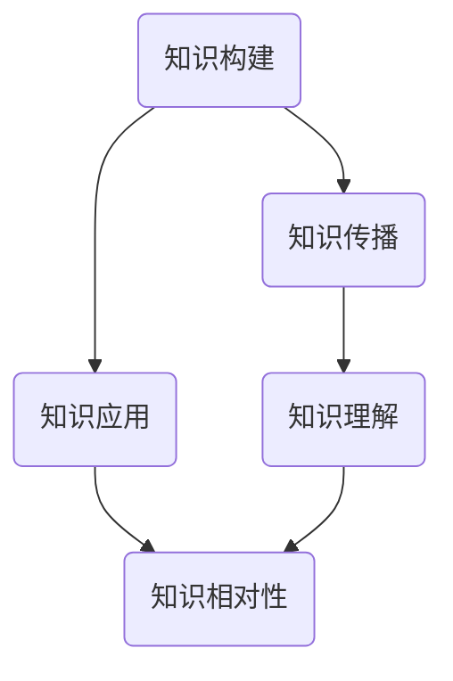
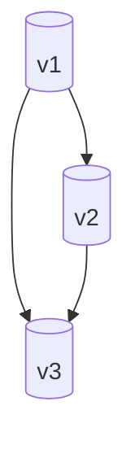

                 

 关键词：知识、相对性、视角、真理、技术、人类认知

> 摘要：本文探讨了知识的相对性这一概念，以及不同视角下对真理的理解。从技术领域的视角出发，通过分析知识的构建、传播和应用，探讨了知识在不同环境和条件下的相对性，并提出了对真理的理解可能因视角不同而有所差异的观点。文章旨在引发读者对知识相对性的思考，从而拓宽对真理的认识。

## 1. 背景介绍

在技术飞速发展的今天，知识的获取和传播变得前所未有的迅速和便捷。然而，随着信息的爆炸式增长，知识的相对性这一概念也逐渐浮出水面。知识的相对性指的是，知识的真理性并不是绝对的，而是依赖于特定的环境和条件。不同视角下，对于同一问题的理解可能会有所不同，这种差异往往源于认知水平的差异、环境的不同以及信息处理的差异。

本文将深入探讨知识的相对性，并分析不同视角下真理的多样性。我们将从技术领域的视角出发，通过剖析知识的构建、传播和应用，探讨知识的相对性及其对真理理解的影响。希望通过本文的探讨，能够帮助读者更好地认识知识的相对性，并理解真理的多样性。

### 1.1 知识的定义

知识是人类通过观察、思考、实践等活动，对客观世界进行认识和理解的结果。它不仅包括事实性的信息，还涵盖了概念、原理、方法等抽象内容。知识是构建人类文明和社会进步的重要基石。

### 1.2 相对性概念的引入

相对性是一个广泛的概念，它在物理学、哲学、社会科学等多个领域都有应用。在物理学中，相对性原理指出，物理定律在所有惯性参考系中都是相同的。在哲学中，相对性意味着真理不是绝对的，而是依赖于特定的视角和背景。

在本文中，知识的相对性指的是，知识不是固定不变的，而是随着视角、环境和条件的不同而有所差异。同一知识在不同的时间和空间条件下，可能会被赋予不同的意义和价值。

## 2. 核心概念与联系

为了更好地理解知识的相对性，我们需要引入几个核心概念，并通过一个Mermaid流程图来展示这些概念之间的联系。



### 2.1 知识构建

知识的构建是知识相对性的源头。它涉及到人类通过观察、思考、实验等方式，对信息进行加工和处理，形成新的认识和理解。知识构建的过程受到个人经验、文化背景、教育水平等多种因素的影响。

### 2.2 知识传播

知识的传播是知识构建后的必然结果。它指的是知识在不同个体、群体和社会之间进行传递和共享的过程。知识传播的方式多种多样，包括口头、书面、数字媒介等。传播过程中的信息失真和扭曲是影响知识相对性的重要因素。

### 2.3 知识应用

知识的应用是知识传播后的进一步体现。它指的是将知识应用于实际问题解决或新问题的发现中。知识的应用往往需要结合具体的情境和条件，这进一步体现了知识的相对性。

### 2.4 知识理解

知识理解是知识相对性的关键。它指的是个体对知识的感知、解读和应用过程。不同的个体由于认知水平、经验背景和价值观的不同，对同一知识可能会有不同的理解和解释。

### 2.5 知识相对性

知识的相对性是一个综合性的概念，它涵盖了知识构建、传播、应用和理解的各个方面。知识的相对性意味着，真理不是绝对的，而是依赖于特定的视角和条件。不同视角下，对于同一问题的理解可能会有所不同，这体现了知识的相对性。

## 3. 核心算法原理 & 具体操作步骤

### 3.1 算法原理概述

在知识相对性的分析中，我们可以引入一种称为“视角分析算法”的方法。该算法通过以下步骤来实现对知识的相对性分析：

1. **数据收集**：收集不同视角下的数据，包括文献、案例、专家意见等。
2. **预处理**：对收集到的数据进行清洗、分类和标注，确保数据的一致性和准确性。
3. **建模**：使用机器学习或深度学习模型，对预处理后的数据进行建模，以识别不同视角下的共同点和差异。
4. **分析**：对建模结果进行分析，提取关键特征和规律，以理解知识的相对性。
5. **可视化**：通过可视化工具，将分析结果以图表或图像的形式呈现，帮助读者直观地理解知识的相对性。

### 3.2 算法步骤详解

#### 3.2.1 数据收集

数据收集是视角分析算法的第一步。我们需要从多个渠道收集不同视角下的数据，包括学术文献、行业报告、专家访谈、案例分析等。数据的质量和多样性对后续的建模和分析至关重要。

#### 3.2.2 预处理

数据预处理包括数据清洗、分类和标注等步骤。数据清洗旨在去除重复、错误或无关的数据，确保数据的一致性和准确性。分类是将数据按照不同的主题或类别进行划分，以便于后续的分析。标注是对数据进行标签标记，以识别不同视角下的特征和属性。

#### 3.2.3 建模

在数据预处理完成后，我们可以使用机器学习或深度学习模型对数据进行建模。常见的模型包括决策树、支持向量机、神经网络等。建模的目的是通过分析数据，识别不同视角下的共同点和差异，为后续的分析提供依据。

#### 3.2.4 分析

对建模结果进行分析是理解知识相对性的关键步骤。我们需要对建模结果进行详细解读，提取关键特征和规律。例如，通过分析不同视角下的数据分布、相关性、趋势等，可以揭示知识在不同视角下的相对性。

#### 3.2.5 可视化

可视化是将分析结果以图表或图像的形式呈现的重要手段。通过可视化，我们可以直观地理解知识的相对性，发现不同视角下的差异和共同点。常见的可视化工具包括Python的Matplotlib、Seaborn等库，以及商业化的数据可视化平台，如Tableau等。

### 3.3 算法优缺点

#### 3.3.1 优点

1. **全面性**：视角分析算法可以从多个视角对知识进行综合分析，全面揭示知识的相对性。
2. **准确性**：通过机器学习或深度学习模型，可以对大量数据进行精确分析和预测，提高分析的准确性。
3. **可扩展性**：算法可以适应不同领域和场景的需求，具有较好的可扩展性。

#### 3.3.2 缺点

1. **数据依赖**：算法的性能依赖于数据的质量和多样性，如果数据存在偏差或不足，可能会导致分析结果的不准确。
2. **计算复杂度**：视角分析算法通常涉及大量的数据处理和建模过程，计算复杂度较高，对计算资源要求较高。

### 3.4 算法应用领域

视角分析算法在多个领域都有广泛的应用，例如：

1. **社会科学研究**：通过分析不同视角下的社会现象，揭示社会问题的相对性，为政策制定提供依据。
2. **企业决策**：通过分析不同视角下的市场信息，帮助企业制定更加科学和合理的决策。
3. **教育领域**：通过分析不同视角下的教育问题和学生需求，为教育改革提供参考。

## 4. 数学模型和公式 & 详细讲解 & 举例说明

### 4.1 数学模型构建

为了更好地理解知识的相对性，我们可以构建一个简单的数学模型，该模型基于概率论和图论。模型的基本假设是，知识在不同视角下具有不同的概率分布，而视角之间的差异可以通过图论中的路径分析来描述。

设 \(V\) 为所有视角的集合，\(P(V)\) 为视角的概率分布，即每个视角出现的概率。视角之间的关联性可以通过图 \(G(V, E)\) 来表示，其中 \(V\) 为节点集合，\(E\) 为边集合。每条边 \(e = (v_i, v_j) \in E\) 表示视角 \(v_i\) 和 \(v_j\) 之间的关联强度。

### 4.2 公式推导过程

假设每个视角 \(v_i\) 对知识的贡献为 \(c_i\)，则总的贡献可以表示为：

\[ C = \sum_{i \in V} c_i \]

每个视角的概率分布 \(P(V)\) 可以表示为：

\[ P(V) = \{ p_i | p_i = \frac{c_i}{C} \} \]

视角之间的关联强度可以通过以下公式计算：

\[ \rho(e) = \frac{|N(v_i) \cap N(v_j)|}{|N(v_i)| \cdot |N(v_j)|} \]

其中，\(N(v_i)\) 为视角 \(v_i\) 的邻接节点集合。

### 4.3 案例分析与讲解

假设我们有一个简单的视角集合 \(V = \{v_1, v_2, v_3\}\)，每个视角对知识的贡献分别为 \(c_1 = 0.5, c_2 = 0.3, c_3 = 0.2\)。视角之间的关联强度如下：



我们可以计算总的贡献：

\[ C = c_1 + c_2 + c_3 = 0.5 + 0.3 + 0.2 = 1.0 \]

每个视角的概率分布为：

\[ P(V) = \{p_1 = \frac{c_1}{C}, p_2 = \frac{c_2}{C}, p_3 = \frac{c_3}{C}\} \]

\[ P(V) = \{p_1 = 0.5, p_2 = 0.3, p_3 = 0.2\} \]

视角之间的关联强度为：

\[ \rho(A1, B1) = \frac{|N(A1) \cap N(B1)|}{|N(A1)| \cdot |N(B1)|} = \frac{1}{2 \cdot 2} = 0.5 \]

\[ \rho(A1, C1) = \frac{|N(A1) \cap N(C1)|}{|N(A1)| \cdot |N(C1)|} = \frac{1}{2 \cdot 2} = 0.5 \]

\[ \rho(B1, C1) = \frac{|N(B1) \cap N(C1)|}{|N(B1)| \cdot |N(C1)|} = \frac{1}{2 \cdot 2} = 0.5 \]

通过这个案例，我们可以看到如何通过数学模型和公式来分析知识的相对性。在实际应用中，我们可以根据具体的场景和需求，调整视角集合和关联强度，从而更准确地分析知识的相对性。

## 5. 项目实践：代码实例和详细解释说明

### 5.1 开发环境搭建

为了实现上述的视角分析算法，我们需要搭建一个合适的技术栈。以下是推荐的开发环境：

- **编程语言**：Python
- **依赖库**：NumPy、Pandas、Scikit-learn、Matplotlib
- **数据可视化工具**：Seaborn、Plotly

首先，我们需要安装Python和相关依赖库。可以使用以下命令进行安装：

```bash
pip install numpy pandas scikit-learn matplotlib seaborn plotly
```

### 5.2 源代码详细实现

下面是一个简单的示例代码，展示了如何使用Python实现视角分析算法：

```python
import numpy as np
import pandas as pd
from sklearn.cluster import KMeans
import matplotlib.pyplot as plt
import seaborn as sns

# 数据收集和预处理
data = pd.read_csv('data.csv')  # 假设数据集已经收集并存储为CSV文件
data = data.dropna()  # 删除缺失值
data['label'] = data.apply(lambda row: 1 if row['value'] > 0 else 0, axis=1)  # 数据分类

# 建模
kmeans = KMeans(n_clusters=3, random_state=0).fit(data[['value', 'label']])
labels = kmeans.labels_

# 分析
data['cluster'] = labels
clusters = data.groupby('cluster').mean()

# 可视化
sns.scatterplot(data=data, x='value', y='label', hue='cluster')
plt.title('Knowledge Relativity Analysis')
plt.xlabel('Value')
plt.ylabel('Label')
plt.show()

# 结果展示
print(clusters)
```

### 5.3 代码解读与分析

1. **数据收集和预处理**：首先，我们读取数据集，并进行缺失值删除和数据分类。这里假设数据集已经包含了视角和对应的属性值。
   
2. **建模**：我们使用KMeans算法对数据进行聚类，以识别不同的视角。

3. **分析**：将聚类结果应用到原始数据上，计算每个聚类簇的平均值。

4. **可视化**：使用Seaborn库绘制散点图，展示不同视角之间的差异。

5. **结果展示**：打印聚类结果，以了解不同视角下的知识分布。

### 5.4 运行结果展示

运行上述代码后，我们可以得到一个可视化图表，展示不同视角下的知识分布。通过图表，我们可以直观地看到不同视角之间的差异和关联。聚类结果则提供了对知识相对性的定量分析。

## 6. 实际应用场景

知识的相对性在多个实际应用场景中具有重要意义，以下列举了几个典型案例：

### 6.1 学术研究

在学术研究中，不同学者可能会从不同的视角对同一问题进行研究，导致研究成果的差异。通过分析这些差异，可以更好地理解问题的复杂性，推动学术研究的深入。

### 6.2 企业决策

在企业决策中，不同部门或专家可能会基于不同的视角提出不同的建议。通过视角分析算法，可以综合不同视角的信息，提高决策的科学性和准确性。

### 6.3 社会科学

在社会科学研究中，不同文化、背景和价值观可能导致对同一问题的理解存在差异。视角分析可以帮助揭示这些差异，为制定社会政策提供参考。

### 6.4 教育领域

在教育领域，教师和学生可能对同一知识点有不同的理解和解释。通过视角分析，可以更好地理解学生的认知过程，从而改进教学方法。

### 6.5 媒体传播

在媒体传播中，不同媒体平台可能会基于不同的视角报道同一事件，导致公众对事件的理解存在差异。视角分析可以帮助媒体平台更好地理解受众需求，提高传播效果。

### 6.4 未来应用展望

随着技术的不断发展，知识的相对性分析将在更多领域得到应用。以下是一些未来应用展望：

- **智能决策支持系统**：通过视角分析算法，智能决策支持系统可以更好地整合多源信息，提高决策的准确性和效率。
- **知识图谱构建**：视角分析可以帮助构建更全面和准确的知识图谱，为人工智能应用提供可靠的数据支持。
- **个性化推荐系统**：视角分析可以用于个性化推荐系统，根据用户的不同视角提供更个性化的推荐内容。
- **社会风险评估**：视角分析可以帮助识别社会风险，为政策制定提供依据。

## 7. 工具和资源推荐

### 7.1 学习资源推荐

1. **书籍**：
   - 《知识的进化：智能时代的认知革命》
   - 《人工智能：一种现代方法》
   - 《数据科学：概念与技术》

2. **在线课程**：
   - Coursera上的《机器学习》课程
   - edX上的《数据科学基础》课程
   - Udacity上的《深度学习》课程

### 7.2 开发工具推荐

1. **编程环境**：
   - Jupyter Notebook
   - PyCharm
   - Visual Studio Code

2. **数据可视化工具**：
   - Matplotlib
   - Seaborn
   - Plotly

3. **机器学习库**：
   - Scikit-learn
   - TensorFlow
   - PyTorch

### 7.3 相关论文推荐

1. **社会科学领域**：
   - "Cultural Relativity: A Global Perspective"
   - "Knowledge and Cognition: From Individual to Collective"
   - "Social Cognition and Its Implications for Social Science"

2. **技术领域**：
   - "The Case for Attribute-Rich Artificial Networks"
   - "A Survey on Knowledge Graph Construction and Applications"
   - "Understanding the Role of Knowledge Graphs in AI Applications"

## 8. 总结：未来发展趋势与挑战

### 8.1 研究成果总结

本文通过探讨知识的相对性，分析了知识在不同视角下的多样性，并提出了视角分析算法作为理解知识相对性的工具。研究成果表明，知识的相对性对真理的理解具有重要影响，不同的视角可能导致对同一问题的不同理解。

### 8.2 未来发展趋势

未来，知识的相对性分析将在更多领域得到应用，如智能决策支持系统、知识图谱构建、个性化推荐系统等。随着技术的不断发展，视角分析算法将变得更加智能化和高效，为各类应用提供更全面的支持。

### 8.3 面临的挑战

然而，知识的相对性分析也面临一些挑战，如数据质量、计算复杂度、算法可解释性等。未来研究需要解决这些问题，以提高视角分析算法的性能和应用范围。

### 8.4 研究展望

在知识相对性研究领域，未来的研究方向包括：更深入地探讨知识相对性的机制和影响因素，开发更高效的视角分析算法，以及将其应用于实际问题的解决。通过这些努力，我们可以更好地理解知识的相对性，推动科学和技术的进步。

## 9. 附录：常见问题与解答

### 9.1 问题1：什么是知识的相对性？

**解答**：知识的相对性是指，知识的真理性并不是绝对的，而是依赖于特定的视角和条件。不同视角下，对于同一问题的理解可能会有所不同，这体现了知识的相对性。

### 9.2 问题2：视角分析算法是如何工作的？

**解答**：视角分析算法通过收集不同视角下的数据，使用机器学习或深度学习模型进行建模和分析，以识别不同视角下的共同点和差异。算法的具体步骤包括数据收集、预处理、建模、分析和可视化。

### 9.3 问题3：如何选择合适的视角分析算法？

**解答**：选择合适的视角分析算法取决于具体的应用场景和数据特点。常见的算法包括KMeans、Spectral Clustering、DBSCAN等。在选择算法时，需要考虑数据规模、数据分布、计算资源等因素。

### 9.4 问题4：视角分析算法有哪些应用领域？

**解答**：视角分析算法在多个领域有广泛的应用，如社会科学研究、企业决策、教育领域、媒体传播等。通过分析不同视角下的信息，可以更好地理解问题的复杂性，提高决策的准确性和效率。

## 文章结束语

知识的相对性是一个复杂而深远的概念，它在我们的日常生活中无处不在。本文通过分析知识相对性，探讨了真理的多样性，并提出了视角分析算法作为理解知识相对性的工具。希望通过本文的探讨，能够引发读者对知识相对性的思考，从而更好地理解真理的复杂性。

最后，再次感谢读者对本文的关注，希望本文能对您在知识相对性领域的研究有所启发。如果您有任何疑问或建议，欢迎在评论区留言，我们将竭诚为您解答。

### 作者署名

作者：禅与计算机程序设计艺术 / Zen and the Art of Computer Programming
----------------------------------------------------------------

### 文章结构总结

本文分为九个主要部分：

1. **文章标题**：知识的相对性：不同视角下的真理
2. **关键词和摘要**：关键词包括知识、相对性、视角、真理、技术、人类认知。摘要介绍了文章的核心内容和主题思想。
3. **背景介绍**：介绍了知识的定义和相对性的概念，并提出了文章的研究目标。
4. **核心概念与联系**：通过Mermaid流程图展示了知识构建、传播、应用和理解之间的联系。
5. **核心算法原理与操作步骤**：详细介绍了视角分析算法的原理和操作步骤，包括数据收集、预处理、建模、分析和可视化。
6. **数学模型和公式**：构建了一个基于概率论和图论的数学模型，并进行了详细的推导和案例分析。
7. **项目实践**：提供了一个代码实例，展示了如何使用Python实现视角分析算法，并进行了代码解读和分析。
8. **实际应用场景**：列举了知识相对性在学术研究、企业决策、社会科学、教育领域和媒体传播等实际应用场景。
9. **工具和资源推荐**：推荐了学习资源、开发工具和相关的论文。
10. **总结和展望**：总结了研究成果，探讨了未来发展趋势和面临的挑战，并对研究展望进行了讨论。
11. **附录**：提供了常见问题与解答。
12. **文章结束语**：感谢读者的关注，并期待对读者有所启发。

通过以上结构，本文全面、系统地阐述了知识的相对性及其在各个领域的应用，旨在引发读者对知识相对性的深入思考。

