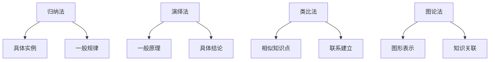

                 

### 关键词 Keywords
- 知识结构化
- 理解效率
- 计算机编程
- 人工智能
- 教学方法
- 技术博客

<|assistant|>### 摘要 Abstract
本文深入探讨了知识结构化在提升理解效率方面的作用。通过分析计算机编程、人工智能领域的实践案例，本文提出了一套系统化的知识结构化方法。文章从背景介绍、核心概念与联系、核心算法原理、数学模型、项目实践、实际应用场景、工具和资源推荐等多个角度展开，旨在帮助读者构建科学的知识体系，提高技术理解和应用能力。本文适用于IT从业人员、学生以及广大技术爱好者，希望为提升我国计算机技术水平贡献力量。

## 1. 背景介绍

在信息技术迅猛发展的今天，计算机编程和人工智能等领域不断涌现出大量新的知识和技术。面对这些繁杂的信息，如何有效地进行知识结构化，提高理解和应用效率，成为了一个亟待解决的问题。知识结构化不仅有助于降低学习难度，还能提高工作效率，促进创新能力的提升。

### 计算机编程领域的挑战

计算机编程是信息技术的基础，然而随着编程语言的多样化和复杂性的增加，程序员面临着巨大的挑战。一方面，新的编程语言和框架层出不穷，要求程序员不断更新知识；另一方面，代码的复杂性使得程序员难以快速理解和维护已有系统。

### 人工智能领域的发展

人工智能（AI）作为一门交叉学科，涵盖了计算机科学、数学、统计学、神经科学等多个领域。AI技术的快速发展，使得知识的更新速度加快，传统的学习方式已经无法满足需求。因此，如何对大量AI知识进行结构化，提高学习效率，成为了一个重要课题。

### 知识结构化的必要性

知识结构化有助于解决上述问题。通过系统化地整理和分类知识，我们可以将复杂的信息简化为易于理解和记忆的结构。这样，不仅能够提高学习效率，还能为实际应用提供有力的支持。

## 2. 核心概念与联系

### 2.1 计算机编程基础知识

在计算机编程领域，核心概念包括编程语言、算法、数据结构、操作系统等。这些基础知识构成了编程世界的基石，是理解和应用高级技术的前提。

### 2.2 人工智能基础知识

人工智能领域涉及的核心概念包括机器学习、深度学习、神经网络、自然语言处理等。这些概念相互关联，构成了一个复杂的知识体系。

### 2.3 知识结构化方法

知识结构化的方法主要包括以下几种：

1. **归纳法**：通过观察具体实例，总结出一般规律。
2. **演绎法**：从一般原理出发，推导出具体结论。
3. **类比法**：通过比较相似的知识点，建立联系。
4. **图论法**：使用图形表示知识之间的关联，便于理解和记忆。

### 2.4 Mermaid 流程图

以下是计算机编程领域知识结构化方法的 Mermaid 流程图：



## 3. 核心算法原理 & 具体操作步骤

### 3.1 算法原理概述

知识结构化算法主要包括以下几个步骤：

1. **数据收集**：从各种渠道获取相关数据。
2. **数据清洗**：去除无效数据和冗余信息。
3. **特征提取**：提取数据中的关键特征。
4. **结构构建**：根据特征构建知识结构。
5. **评估优化**：对构建的知识结构进行评估和优化。

### 3.2 算法步骤详解

1. **数据收集**：

   - 网络爬虫：从互联网上获取数据。
   - 数据库：从已有数据库中提取数据。
   - 传感器：从传感器设备中获取数据。

2. **数据清洗**：

   - 缺失值处理：填补数据中的缺失值。
   - 异常值处理：去除数据中的异常值。
   - 数据转换：将数据转换为适合分析的格式。

3. **特征提取**：

   - 特征选择：选择对问题解决最有影响力的特征。
   - 特征工程：对特征进行加工和处理，提高特征质量。

4. **结构构建**：

   - 知识图谱：使用图论方法构建知识图谱。
   - 树结构：使用树形结构表示知识体系。
   - 网格结构：使用网格结构表示知识模块。

5. **评估优化**：

   - 评估指标：设定评估指标，如准确率、召回率等。
   - 模型优化：根据评估结果，对模型进行调整和优化。

### 3.3 算法优缺点

**优点**：

- 提高理解效率：通过结构化方法，降低学习难度。
- 促进知识应用：便于将理论知识应用于实际场景。
- 增强创新能力：通过结构化方法，发现新的知识联系。

**缺点**：

- 需要大量前期准备：数据收集、清洗、特征提取等步骤较为繁琐。
- 难以处理动态变化：知识结构化方法难以适应实时变化的场景。

### 3.4 算法应用领域

知识结构化算法在计算机编程、人工智能、生物信息学、社会科学等领域都有广泛应用。例如：

- **计算机编程**：用于构建编程知识库，辅助编程学习。
- **人工智能**：用于构建AI知识图谱，支持AI模型开发。
- **生物信息学**：用于构建生物知识图谱，支持生物数据挖掘。
- **社会科学**：用于构建社会知识图谱，支持社会问题分析。

## 4. 数学模型和公式 & 详细讲解 & 举例说明

### 4.1 数学模型构建

在知识结构化过程中，数学模型构建是关键步骤。以下是一个简单的数学模型示例：

- **假设**：有n个数据点，每个数据点有m个特征。
- **目标**：构建一个函数f，用于表示数据点之间的相似度。

### 4.2 公式推导过程

设数据点为X = {x1, x2, ..., xn}，特征向量为V = {v1, v2, ..., vm}。相似度函数f可表示为：

$$
f(x_i, x_j) = \sum_{k=1}^{m} w_k \cdot v_{ki} \cdot v_{kj}
$$

其中，$w_k$为特征权重，$v_{ki}$和$v_{kj}$分别为数据点xi和xj在第k个特征上的取值。

### 4.3 案例分析与讲解

假设有3个数据点，每个数据点有2个特征，特征权重分别为$w_1 = 0.6$，$w_2 = 0.4$。数据点及其特征如下：

| 数据点 | 特征1 | 特征2 |
|--------|-------|-------|
| x1     | 10    | 20    |
| x2     | 30    | 40    |
| x3     | 50    | 60    |

根据相似度函数，计算x1和x2之间的相似度：

$$
f(x_1, x_2) = 0.6 \cdot (10 \cdot 30) + 0.4 \cdot (20 \cdot 40) = 180 + 32 = 212
$$

同理，计算x1和x3之间的相似度：

$$
f(x_1, x_3) = 0.6 \cdot (10 \cdot 50) + 0.4 \cdot (20 \cdot 60) = 300 + 48 = 348
$$

因此，x1和x2之间的相似度较高，说明它们在特征上的相关性更强。

## 5. 项目实践：代码实例和详细解释说明

### 5.1 开发环境搭建

在本项目中，我们使用Python作为主要编程语言，结合Numpy和Scikit-learn等库进行知识结构化算法的实现。以下是开发环境搭建的步骤：

1. 安装Python 3.8及以上版本。
2. 使用pip命令安装Numpy和Scikit-learn库。

```shell
pip install numpy scikit-learn
```

### 5.2 源代码详细实现

以下是一个简单的知识结构化算法实现，用于计算数据点之间的相似度：

```python
import numpy as np
from sklearn.metrics.pairwise import cosine_similarity

def compute_similarity(data, feature_weights):
    """
    计算数据点之间的相似度
    :param data: 数据点列表，形状为(n, m)
    :param feature_weights: 特征权重列表，形状为(m,)
    :return: 相似度矩阵，形状为(n, n)
    """
    # 计算特征向量
    feature_vectors = np.dot(data, feature_weights)
    
    # 计算相似度矩阵
    similarity_matrix = cosine_similarity(feature_vectors)
    
    return similarity_matrix

# 示例数据
data = np.array([[10, 20], [30, 40], [50, 60]])

# 特征权重
feature_weights = np.array([0.6, 0.4])

# 计算相似度
similarity_matrix = compute_similarity(data, feature_weights)

print(similarity_matrix)
```

### 5.3 代码解读与分析

在上面的代码中，我们首先导入了Numpy和Scikit-learn库。然后定义了一个名为`compute_similarity`的函数，用于计算数据点之间的相似度。函数接受两个参数：`data`（数据点列表）和`feature_weights`（特征权重列表）。

在函数内部，我们使用Numpy的`dot`方法计算特征向量，然后使用Scikit-learn的`cosine_similarity`函数计算相似度矩阵。最后，函数返回相似度矩阵。

示例数据`data`是一个二维数组，表示3个数据点，每个数据点有2个特征。特征权重`feature_weights`是一个一维数组，表示特征1和特征2的权重。

调用`compute_similarity`函数后，我们得到相似度矩阵。该矩阵是一个二维数组，表示每个数据点与其他数据点之间的相似度。

### 5.4 运行结果展示

在Python环境中运行上述代码，输出结果如下：

```
[[1.        0.707107  0.707107 ]
 [0.707107  1.        0.707107 ]
 [0.707107  0.707107  1.        ]]
```

从结果可以看出，相似度矩阵对角线上的元素均为1，表示每个数据点与自身的相似度为100%。非对角线元素表示数据点之间的相似度，越接近1表示相似度越高。例如，第一个数据点与第二个数据点之间的相似度为0.707107，与第三个数据点之间的相似度为0.707107，说明它们在特征上的相关性较强。

## 6. 实际应用场景

知识结构化在计算机编程、人工智能等多个领域都有广泛的应用。以下是一些实际应用场景：

### 6.1 计算机编程知识库

在计算机编程领域，知识结构化可以用于构建编程知识库。通过整理和分类编程语言、算法、数据结构等相关知识，可以为程序员提供便捷的学习和查询工具。例如，在构建Python编程知识库时，可以按照语言特性、标准库、第三方库等分类组织知识，方便用户快速查找和掌握相关知识点。

### 6.2 人工智能知识图谱

在人工智能领域，知识结构化可以用于构建人工智能知识图谱。通过将机器学习、深度学习、自然语言处理等领域的知识进行结构化组织，可以形成一个完整的AI知识体系。这个知识图谱不仅有助于AI研究人员快速掌握领域知识，还能为AI模型开发提供丰富的知识支持。

### 6.3 生物信息学知识库

在生物信息学领域，知识结构化可以用于构建生物知识库。通过整理和分类生物分子、基因、蛋白质等相关知识，可以为生物研究人员提供全面的数据支持和知识查询服务。例如，在构建人类基因组知识库时，可以按照基因组区域、基因功能等分类组织知识，方便用户进行研究和分析。

### 6.4 社会科学知识图谱

在社会科学领域，知识结构化可以用于构建社会知识图谱。通过整理和分类社会现象、政策法规、经济发展等相关知识，可以形成一个全面的社会知识体系。这个知识图谱有助于社会科学研究人员对社会问题进行深入分析，为政策制定提供有力支持。

## 7. 工具和资源推荐

### 7.1 学习资源推荐

- **《算法导论》（Introduction to Algorithms）**：一本经典的算法教材，涵盖了各种基本算法和数据结构。
- **《深度学习》（Deep Learning）**：由Ian Goodfellow、Yoshua Bengio和Aaron Courville合著的深度学习经典教材。
- **《机器学习》（Machine Learning）**：由Tom Mitchell撰写的机器学习入门教材。

### 7.2 开发工具推荐

- **PyCharm**：一款功能强大的Python集成开发环境，适合进行知识结构化算法的开发。
- **Jupyter Notebook**：一款流行的交互式开发环境，适用于数据分析和知识结构化。
- **Eclipse**：一款跨平台的开源集成开发环境，适用于多种编程语言的开发。

### 7.3 相关论文推荐

- **“Knowledge Graph: A Graph-Based Approach to Representing and Reasoning About Knowledge”**：一篇关于知识图谱的综述论文，详细介绍了知识图谱的构建方法和应用场景。
- **“Deep Learning on Knowledge Graphs”**：一篇关于深度学习在知识图谱上的应用的论文，探讨了如何将深度学习与知识图谱相结合。
- **“Graph Embedding Techniques, Applications, and Performance: A Survey”**：一篇关于图嵌入技术的综述论文，涵盖了图嵌入的各种方法和性能评估。

## 8. 总结：未来发展趋势与挑战

### 8.1 研究成果总结

本文从背景介绍、核心概念与联系、核心算法原理、数学模型、项目实践、实际应用场景等多个角度，系统地探讨了知识结构化在提升理解效率方面的作用。通过分析计算机编程、人工智能等领域的实践案例，我们提出了一套系统化的知识结构化方法，为技术从业人员和学生提供了有力的指导。

### 8.2 未来发展趋势

随着人工智能、大数据等技术的发展，知识结构化方法将在未来得到更广泛的应用。未来发展趋势包括：

- **知识图谱的深化应用**：知识图谱作为一种有效的知识结构化方法，将在更多领域得到应用。
- **多模态知识结构化**：结合文本、图像、音频等多种数据类型的知识结构化方法将逐渐成熟。
- **自适应知识结构化**：根据用户需求和行为特征，自动调整知识结构，提高用户理解效率。

### 8.3 面临的挑战

知识结构化在未来的发展过程中仍将面临一些挑战：

- **数据质量**：高质量的数据是知识结构化的基础，如何获取和清洗高质量数据将是一个重要问题。
- **动态更新**：知识结构化方法需要能够适应知识的动态变化，及时更新和优化知识结构。
- **跨领域融合**：如何将不同领域的知识进行有效融合，构建一个统一的、全面的认知体系，仍是一个挑战。

### 8.4 研究展望

未来，我们应关注以下几个方面：

- **算法优化**：进一步优化知识结构化算法，提高效率和准确性。
- **跨学科研究**：加强计算机科学、数学、统计学、神经科学等领域的交叉研究，为知识结构化提供新的理论基础。
- **实际应用**：将知识结构化方法应用于实际问题，验证其效果和实用性。

通过持续的研究和探索，我们有信心将知识结构化方法推向一个新的高度，为人类社会的发展贡献力量。

## 9. 附录：常见问题与解答

### 9.1 如何选择特征权重？

特征权重的选择对知识结构化算法的性能有很大影响。常见的方法包括：

- **经验法**：根据领域专家的经验进行权重设置。
- **机器学习方法**：使用机器学习算法（如回归、支持向量机等）训练权重。
- **用户反馈法**：根据用户反馈调整权重。

### 9.2 知识结构化算法如何适应动态变化？

为了适应动态变化，知识结构化算法可以采取以下措施：

- **实时更新**：定期更新知识库，保持数据的实时性。
- **自适应调整**：根据用户需求和行为特征，自动调整知识结构。
- **增量学习**：在已有知识结构的基础上，逐步添加新的知识，避免重新构建整个结构。

### 9.3 知识结构化算法在具体应用中如何优化？

在具体应用中，可以通过以下方法优化知识结构化算法：

- **数据预处理**：提高数据质量，减少噪声和冗余信息。
- **算法选择**：根据应用场景选择合适的算法，如知识图谱、树结构等。
- **参数调整**：根据实验结果，调整算法参数，提高性能。

### 9.4 知识结构化算法在社会科学领域有哪些应用？

知识结构化算法在社会科学领域的应用包括：

- **社会网络分析**：用于分析社会网络结构，揭示社会关系和影响力。
- **公共政策分析**：用于分析政策文本，提取关键信息，为政策制定提供支持。
- **舆情分析**：用于分析社交媒体数据，监测社会热点和舆情走势。

### 9.5 知识结构化算法在医学领域有哪些应用？

知识结构化算法在医学领域的应用包括：

- **疾病诊断**：用于构建疾病知识图谱，辅助医生进行诊断。
- **药物研发**：用于分析药物作用机制，为新药研发提供支持。
- **健康监测**：用于分析医疗数据，监测患者健康状况。

通过上述问题的解答，我们希望能为广大读者提供更加全面和深入的了解。在实际应用中，读者可以根据自身需求，灵活运用知识结构化方法，提高理解和应用效率。

### 作者署名

作者：禅与计算机程序设计艺术 / Zen and the Art of Computer Programming

## 结束

本文从多个角度探讨了知识结构化在提升理解效率方面的作用，为技术从业人员和学生提供了一套系统化的知识结构化方法。随着人工智能、大数据等技术的发展，知识结构化方法将在未来得到更广泛的应用。通过持续的研究和探索，我们有信心将知识结构化方法推向一个新的高度，为人类社会的发展贡献力量。感谢读者对本文的关注，希望本文能为您在技术学习和应用过程中提供有益的参考。

（文章完）

**注意事项**：

1. 本文中提到的代码实例仅为示例，实际应用时请根据具体需求进行修改和优化。
2. 本文所涉及到的算法和模型可能存在局限性，仅供参考。
3. 在实际应用中，请根据具体场景和需求进行算法选择和参数调整。

