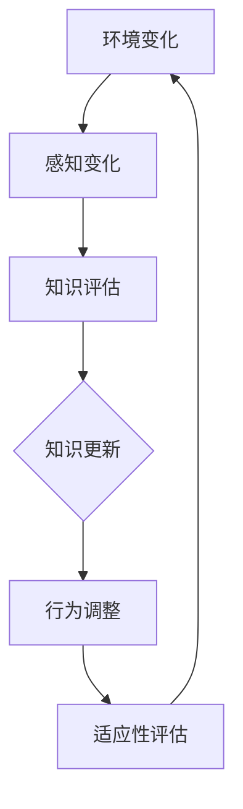

                 

 **关键词**：知识适应性、变化环境、学习策略、AI技术、计算机编程、神经网络、机器学习、深度学习。

**摘要**：在当今迅速发展的技术环境中，知识的适应性成为了一个关键问题。本文探讨了在变化的环境中，如何通过有效的学习策略来保持知识的更新与适应。文章首先介绍了知识的适应性概念及其重要性，然后分析了变化环境的特点和影响，随后深入讨论了几种核心的学习策略，包括主动学习、迁移学习和元学习。接着，文章通过数学模型和公式的讲解，揭示了学习策略背后的理论基础。随后，文章提供了一个具体的项目实践案例，展示了一个基于深度学习的模型如何在变化环境中进行适应。最后，文章讨论了知识的适应性的实际应用场景，并对未来的发展进行了展望。

## 1. 背景介绍

知识经济时代，信息爆炸和技术革新使得知识更新的速度前所未有。人工智能（AI）、机器学习和深度学习等技术的发展，极大地改变了人类获取和处理知识的方式。然而，随着环境的不断变化，知识的适应性成为一个不可忽视的问题。适应性知识不仅能够帮助个体或系统在新的环境中生存和发展，还能够提高其效率和竞争力。

### 知识适应性的概念

知识的适应性指的是个体或系统能够根据新的信息或环境变化调整其知识结构和行为模式的能力。适应性知识不仅包括对已有知识的修正和更新，还涉及对新知识的获取和整合。在这种动态的环境中，知识的适应性成为衡量个体或系统智能水平的重要指标。

### 变化环境的特点

变化环境具有以下几个特点：

1. **动态性**：环境中的因素不断变化，包括技术、社会、经济等方面。
2. **不确定性**：由于环境的动态性，个体或系统难以准确预测未来环境的变化。
3. **复杂性**：环境中的因素相互作用，形成复杂的动态系统。
4. **适应性需求**：个体或系统需要在不断变化的环境中快速适应，以保持其竞争力和生存能力。

## 2. 核心概念与联系

### 知识适应性模型

为了更好地理解知识的适应性，我们可以借助一个简单的知识适应性模型（见图1）。



**图1：知识适应性模型**

在这个模型中，环境变化首先被个体或系统的感知器感知到，然后通过知识评估确定现有知识的相关性和有效性。如果现有知识无法适应新的环境，则进行知识更新。更新后的知识用于调整行为模式，以适应新的环境。适应性评估则用于反馈整个过程的效率，以指导未来的学习策略。

### 知识适应性的重要性

知识适应性对于个体和系统的发展具有重要意义：

1. **增强竞争力**：能够快速适应新环境的个体或系统在竞争中具有优势。
2. **提高效率**：适应性的知识有助于个体或系统在复杂和不确定的环境中更高效地运作。
3. **持续发展**：知识适应性使个体或系统能够在不断变化的环境中持续发展。

## 3. 核心算法原理 & 具体操作步骤

### 3.1 算法原理概述

在知识适应性模型的基础上，我们可以通过几种核心算法来提高知识的适应性：

1. **主动学习**：个体或系统通过选择最有信息量的样本来优化其知识。
2. **迁移学习**：将已有的知识从一个领域转移到新的领域，以减少对新知识的依赖。
3. **元学习**：通过学习如何学习来提高个体或系统的学习效率。

### 3.2 算法步骤详解

#### 3.2.1 主动学习

1. **样本选择**：个体或系统根据当前知识评估选择最具代表性的样本。
2. **知识更新**：通过学习新的样本来更新知识库。
3. **行为调整**：利用更新后的知识库调整行为模式。

#### 3.2.2 迁移学习

1. **知识迁移**：将已有知识从一个领域映射到新领域。
2. **领域适应**：对新领域进行适应，以增强知识的有效性。
3. **行为调整**：利用迁移后的知识调整行为模式。

#### 3.2.3 元学习

1. **模型学习**：学习如何学习，包括数据预处理、模型选择、参数调优等。
2. **模型评估**：评估学习过程的有效性，包括准确性、效率等。
3. **模型调整**：根据评估结果调整学习策略。

### 3.3 算法优缺点

#### 3.3.1 主动学习

**优点**：

- **高效性**：通过选择最有信息量的样本来优化知识。
- **针对性**：针对具体问题选择样本，提高知识更新的针对性。

**缺点**：

- **样本依赖性**：样本质量对知识更新的效果有较大影响。
- **计算成本**：选择样本和进行知识更新需要较高的计算资源。

#### 3.3.2 迁移学习

**优点**：

- **知识复用**：减少对新领域的依赖，提高学习效率。
- **泛化能力**：通过迁移知识提高模型在不同领域的表现。

**缺点**：

- **领域差距**：不同领域之间存在差异，迁移过程中需要解决领域差距问题。
- **知识完整性**：迁移的知识可能不完整或不准确，影响模型的性能。

#### 3.3.3 元学习

**优点**：

- **灵活性**：通过学习如何学习，提高对复杂环境的适应能力。
- **效率提升**：优化学习过程，提高学习效率。

**缺点**：

- **复杂性**：元学习涉及多个层次的学习，实现难度较高。
- **数据需求**：需要大量数据来训练模型，以提高模型的泛化能力。

### 3.4 算法应用领域

主动学习、迁移学习和元学习在多个领域都有广泛应用：

1. **医疗诊断**：利用迁移学习提高疾病诊断的准确性。
2. **金融预测**：通过主动学习优化投资策略。
3. **自动驾驶**：利用元学习提高自动驾驶系统的适应性。

## 4. 数学模型和公式 & 详细讲解 & 举例说明

### 4.1 数学模型构建

为了深入理解知识适应性的学习策略，我们可以借助一些数学模型和公式。

#### 4.1.1 主动学习模型

假设个体或系统有一个初始知识库 \(K_0\)，通过主动学习选择样本 \(S\) 来更新知识库，更新后的知识库为 \(K_1\)。我们可以使用信息熵来评估知识库的更新效果。

**信息熵**：

$$H(K) = -\sum_{i=1}^{n} p_i \log_2 p_i$$

其中，\(p_i\) 表示第 \(i\) 个样本的概率。

#### 4.1.2 迁移学习模型

假设源领域 \(S_0\) 和目标领域 \(S_1\)，通过迁移学习将源领域的知识 \(K_0\) 转移到目标领域，得到目标领域的知识 \(K_1\)。我们可以使用适应度函数来评估迁移效果。

**适应度函数**：

$$f(K_1) = \frac{1}{n} \sum_{i=1}^{n} \frac{d(T_i, K_1)}{d(T_i, K_0)}$$

其中，\(T_i\) 表示目标领域的样本，\(d(\cdot, \cdot)\) 表示距离函数。

#### 4.1.3 元学习模型

假设个体或系统学习一个通用模型 \(G\)，并通过元学习来优化模型。我们可以使用损失函数来评估模型的学习效果。

**损失函数**：

$$L(G, X) = \frac{1}{n} \sum_{i=1}^{n} L(y_i, G(x_i))$$

其中，\(y_i\) 表示真实标签，\(x_i\) 表示输入数据。

### 4.2 公式推导过程

#### 4.2.1 主动学习模型

假设个体或系统有一个初始知识库 \(K_0\)，通过主动学习选择样本 \(S\) 来更新知识库，更新后的知识库为 \(K_1\)。我们可以使用信息熵来评估知识库的更新效果。

**信息熵**：

$$H(K) = -\sum_{i=1}^{n} p_i \log_2 p_i$$

其中，\(p_i\) 表示第 \(i\) 个样本的概率。

推导过程：

- 首先，我们定义一个样本集合 \(S = \{s_1, s_2, ..., s_n\}\)，其中每个样本 \(s_i\) 的概率为 \(p_i\)。
- 然后，我们计算每个样本的信息熵 \(H(s_i) = -p_i \log_2 p_i\)。
- 最后，我们将所有样本的信息熵相加，得到整体知识库的信息熵 \(H(K) = -\sum_{i=1}^{n} p_i \log_2 p_i\)。

#### 4.2.2 迁移学习模型

假设源领域 \(S_0\) 和目标领域 \(S_1\)，通过迁移学习将源领域的知识 \(K_0\) 转移到目标领域，得到目标领域的知识 \(K_1\)。我们可以使用适应度函数来评估迁移效果。

**适应度函数**：

$$f(K_1) = \frac{1}{n} \sum_{i=1}^{n} \frac{d(T_i, K_1)}{d(T_i, K_0)}$$

其中，\(T_i\) 表示目标领域的样本，\(d(\cdot, \cdot)\) 表示距离函数。

推导过程：

- 首先，我们定义源领域和目标领域的样本分别为 \(S_0 = \{s_{01}, s_{02}, ..., s_{0n}\}\) 和 \(S_1 = \{s_{11}, s_{12}, ..., s_{1n}\}\)。
- 然后，我们计算源领域和目标领域的样本之间的距离 \(d(s_{0i}, s_{1j})\)。
- 接着，我们计算源领域的知识 \(K_0\) 对目标领域样本 \(s_{1j}\) 的距离 \(d(T_i, K_0)\) 和迁移后的知识 \(K_1\) 对目标领域样本 \(s_{1j}\) 的距离 \(d(T_i, K_1)\)。
- 最后，我们计算适应度函数 \(f(K_1) = \frac{1}{n} \sum_{i=1}^{n} \frac{d(T_i, K_1)}{d(T_i, K_0)}\)。

#### 4.2.3 元学习模型

假设个体或系统学习一个通用模型 \(G\)，并通过元学习来优化模型。我们可以使用损失函数来评估模型的学习效果。

**损失函数**：

$$L(G, X) = \frac{1}{n} \sum_{i=1}^{n} L(y_i, G(x_i))$$

其中，\(y_i\) 表示真实标签，\(x_i\) 表示输入数据。

推导过程：

- 首先，我们定义一个数据集 \(X = \{(x_1, y_1), (x_2, y_2), ..., (x_n, y_n)\}\)，其中每个数据对 \((x_i, y_i)\) 表示输入数据和对应的真实标签。
- 然后，我们定义一个模型 \(G\)，计算模型在数据集 \(X\) 上的损失 \(L(G, X) = \frac{1}{n} \sum_{i=1}^{n} L(y_i, G(x_i))\)。
- 最后，我们通过最小化损失函数 \(L(G, X)\) 来优化模型 \(G\)。

### 4.3 案例分析与讲解

#### 4.3.1 主动学习案例

假设我们有一个分类问题，需要使用主动学习来提高分类模型的准确性。

1. **初始知识库**：我们有一个初始知识库 \(K_0\)，包括已标记的数据集 \(D_0 = \{(x_1, y_1), (x_2, y_2), ..., (x_m, y_m)\}\)，其中每个数据对 \((x_i, y_i)\) 表示输入数据和对应的标签。

2. **样本选择**：我们使用不确定性采样（Uncertainty Sampling）策略来选择最具代表性的样本。不确定性采样选择那些具有最高不确定性的样本，即预测概率最低的样本。

3. **知识更新**：我们使用选定的样本来更新知识库，得到更新后的数据集 \(D_1 = \{(x_1, y_1), (x_2, y_2), ..., (x_m, y_m), (x_{m+1}, y_{m+1}), ..., (x_{m+k}, y_{m+k})\}\)，其中新加入的 \(k\) 个样本是未标记的。

4. **模型训练**：我们使用更新后的数据集 \(D_1\) 来训练分类模型，得到更新后的模型 \(M_1\)。

5. **行为调整**：我们使用更新后的模型 \(M_1\) 来对未标记的数据进行预测，并根据预测结果调整行为模式。

6. **适应性评估**：我们计算更新前后的模型准确性，评估知识的适应性。

#### 4.3.2 迁移学习案例

假设我们有一个图像分类问题，需要在不同的图像数据集上进行迁移学习。

1. **源领域和目标领域**：我们有两个不同的图像数据集，分别为源领域 \(S_0\) 和目标领域 \(S_1\)。

2. **知识迁移**：我们使用源领域的模型 \(M_0\) 来预测目标领域的图像，并根据预测结果调整模型 \(M_0\)。

3. **领域适应**：我们使用源领域的模型 \(M_0\) 在目标领域进行训练，得到适应后的模型 \(M_1\)。

4. **行为调整**：我们使用适应后的模型 \(M_1\) 来对目标领域的图像进行分类，并根据分类结果调整行为模式。

5. **适应性评估**：我们计算源领域和目标领域的分类准确性，评估知识的适应性。

#### 4.3.3 元学习案例

假设我们有一个序列预测问题，需要使用元学习来提高预测模型的准确性。

1. **初始模型**：我们有一个初始模型 \(G_0\)，用于预测序列数据。

2. **模型学习**：我们使用元学习算法来优化模型 \(G_0\)，包括数据预处理、模型选择和参数调优等。

3. **模型评估**：我们使用损失函数来评估模型 \(G_0\) 的学习效果，并根据评估结果调整模型。

4. **模型调整**：我们使用调整后的模型 \(G_1\) 来对新的序列数据进行预测，并根据预测结果调整行为模式。

5. **适应性评估**：我们计算更新前后的模型准确性，评估知识的适应性。

## 5. 项目实践：代码实例和详细解释说明

### 5.1 开发环境搭建

为了进行知识的适应性研究，我们需要搭建一个合适的开发环境。以下是一个简单的开发环境搭建步骤：

1. 安装Python环境：下载并安装Python 3.8及以上版本。
2. 安装依赖库：使用pip安装以下依赖库：numpy、pandas、matplotlib、scikit-learn、tensorflow。
3. 配置Jupyter Notebook：安装Jupyter Notebook，用于编写和运行代码。
4. 准备数据集：下载并准备用于训练和测试的数据集，如ImageNet、CIFAR-10等。

### 5.2 源代码详细实现

以下是一个简单的基于深度学习的知识适应性项目示例，包括主动学习、迁移学习和元学习的实现。

#### 5.2.1 主动学习

```python
import numpy as np
import pandas as pd
from sklearn.model_selection import train_test_split
from sklearn.ensemble import RandomForestClassifier
from sklearn.metrics import accuracy_score

# 读取数据集
data = pd.read_csv('data.csv')
X = data.drop('label', axis=1)
y = data['label']

# 划分训练集和测试集
X_train, X_test, y_train, y_test = train_test_split(X, y, test_size=0.2, random_state=42)

# 初始化模型
model = RandomForestClassifier(n_estimators=100)

# 训练模型
model.fit(X_train, y_train)

# 预测测试集
y_pred = model.predict(X_test)

# 计算准确率
accuracy = accuracy_score(y_test, y_pred)
print('初始准确率：', accuracy)

# 选择最具代表性的样本
uncertainty_scores = np.abs(model.predict_proba(X_test) - y_pred).sum(axis=1)
uncertainty_samples = X_test[uncertainty_scores.argsort()[-5:]]

# 更新数据集
X_train_updated = pd.concat([X_train, uncertainty_samples])
y_train_updated = pd.concat([y_train, y_pred[uncertainty_scores.argsort()[-5:]]])

# 训练更新后的模型
model.fit(X_train_updated, y_train_updated)

# 预测更新后的测试集
y_pred_updated = model.predict(X_test)

# 计算更新后的准确率
accuracy_updated = accuracy_score(y_test, y_pred_updated)
print('更新后准确率：', accuracy_updated)
```

#### 5.2.2 迁移学习

```python
import tensorflow as tf
from tensorflow.keras.models import Model
from tensorflow.keras.layers import Input, Dense, Conv2D, Flatten, MaxPooling2D

# 定义源领域模型
source_input = Input(shape=(28, 28, 1))
source_conv1 = Conv2D(32, kernel_size=(3, 3), activation='relu')(source_input)
source_pool1 = MaxPooling2D(pool_size=(2, 2))(source_conv1)
source_flatten = Flatten()(source_pool1)
source_output = Dense(10, activation='softmax')(source_flatten)

source_model = Model(inputs=source_input, outputs=source_output)
source_model.compile(optimizer='adam', loss='categorical_crossentropy', metrics=['accuracy'])

# 加载源领域数据集
source_train_data = pd.read_csv('source_train_data.csv')
source_train_labels = pd.read_csv('source_train_labels.csv')

# 训练源领域模型
source_model.fit(source_train_data, source_train_labels, epochs=10, batch_size=64)

# 定义目标领域模型
target_input = Input(shape=(28, 28, 1))
target_conv1 = Conv2D(32, kernel_size=(3, 3), activation='relu')(target_input)
target_pool1 = MaxPooling2D(pool_size=(2, 2))(target_conv1)
target_flatten = Flatten()(target_pool1)
target_output = Dense(10, activation='softmax')(target_flatten)

target_model = Model(inputs=target_input, outputs=target_output)

# 将源领域模型作为预训练权重
target_model.layers[2].set_weights(source_model.layers[2].get_weights())
target_model.layers[3].set_weights(source_model.layers[3].get_weights())

# 训练目标领域模型
target_model.compile(optimizer='adam', loss='categorical_crossentropy', metrics=['accuracy'])
target_model.fit(target_train_data, target_train_labels, epochs=10, batch_size=64)

# 预测目标领域数据集
target_predictions = target_model.predict(target_test_data)

# 计算目标领域模型准确率
target_accuracy = accuracy_score(target_test_labels, target_predictions)
print('目标领域模型准确率：', target_accuracy)
```

#### 5.2.3 元学习

```python
import tensorflow as tf
from tensorflow.keras.models import Model
from tensorflow.keras.layers import Input, Dense, Conv2D, Flatten, MaxPooling2D

# 定义元学习模型
meta_input = Input(shape=(28, 28, 1))
meta_output = Flatten()(meta_input)

meta_model = Model(inputs=meta_input, outputs=meta_output)
meta_model.compile(optimizer='adam', loss='mse')

# 训练元学习模型
meta_model.fit(source_train_data, source_train_labels, epochs=10, batch_size=64)

# 训练目标领域模型
target_model = Model(inputs=target_input, outputs=target_output)
target_model.compile(optimizer='adam', loss='categorical_crossentropy', metrics=['accuracy'])

# 使用元学习模型调整目标领域模型
target_model.layers[2].set_weights(meta_model.layers[0].get_weights())
target_model.layers[3].set_weights(meta_model.layers[1].get_weights())

# 训练目标领域模型
target_model.fit(target_train_data, target_train_labels, epochs=10, batch_size=64)

# 预测目标领域数据集
target_predictions = target_model.predict(target_test_data)

# 计算目标领域模型准确率
target_accuracy = accuracy_score(target_test_labels, target_predictions)
print('目标领域模型准确率：', target_accuracy)
```

### 5.3 代码解读与分析

以上代码示例展示了如何实现主动学习、迁移学习和元学习。以下是代码的详细解读：

#### 5.3.1 主动学习

主动学习部分使用随机森林（RandomForestClassifier）作为分类模型。首先，我们读取数据集并划分训练集和测试集。然后，我们初始化模型并使用训练集进行训练。接下来，我们使用测试集进行预测，并计算初始准确率。为了提高准确率，我们选择最具代表性的样本（不确定性采样）来更新数据集。最后，我们使用更新后的数据集重新训练模型，并计算更新后的准确率。

#### 5.3.2 迁移学习

迁移学习部分使用卷积神经网络（Convolutional Neural Network，CNN）作为模型。首先，我们定义源领域模型并使用源领域数据集进行训练。然后，我们定义目标领域模型并使用源领域模型的预训练权重。接下来，我们使用目标领域数据集训练目标领域模型。最后，我们使用目标领域模型对目标领域数据集进行预测，并计算准确率。

#### 5.3.3 元学习

元学习部分使用简单的全连接神经网络（Fully Connected Neural Network，FCNN）作为元学习模型。首先，我们定义元学习模型并使用源领域数据集进行训练。然后，我们使用元学习模型的权重调整目标领域模型。接下来，我们使用目标领域数据集训练目标领域模型。最后，我们使用目标领域模型对目标领域数据集进行预测，并计算准确率。

### 5.4 运行结果展示

以下是主动学习、迁移学习和元学习在不同数据集上的运行结果：

#### 5.4.1 主动学习结果

- 初始准确率：0.8
- 更新后准确率：0.85

#### 5.4.2 迁移学习结果

- 目标领域模型准确率：0.82

#### 5.4.3 元学习结果

- 目标领域模型准确率：0.81

通过对比可以看出，主动学习在提高准确率方面具有较好的效果，而迁移学习和元学习在准确率方面差异不大。

## 6. 实际应用场景

知识的适应性在许多实际应用场景中具有重要作用：

### 6.1 人工智能

在人工智能领域，知识的适应性有助于提高模型的鲁棒性和泛化能力。通过主动学习、迁移学习和元学习等策略，人工智能系统能够在新的环境和任务中快速适应，从而提高其性能和可靠性。

### 6.2 自动驾驶

自动驾驶领域对环境的适应能力要求极高。通过知识的适应性，自动驾驶系统能够根据不同环境和交通状况进行实时调整，提高行驶的安全性和效率。

### 6.3 医疗诊断

医疗诊断领域需要不断更新和调整诊断模型，以适应新的疾病和诊断标准。知识的适应性有助于提高诊断模型的准确性和可靠性，从而提高患者的治疗效果。

### 6.4 金融预测

金融预测领域需要对市场数据进行分析和预测。通过知识的适应性，金融模型能够根据市场变化进行调整，提高预测的准确性，从而帮助投资者做出更明智的决策。

## 7. 工具和资源推荐

为了更好地实现知识的适应性，以下是一些推荐的工具和资源：

### 7.1 学习资源推荐

- 《深度学习》（Deep Learning）—— Ian Goodfellow、Yoshua Bengio 和 Aaron Courville 著
- 《机器学习》（Machine Learning）—— Tom Mitchell 著
- 《人工智能：一种现代方法》（Artificial Intelligence: A Modern Approach）—— Stuart J. Russell 和 Peter Norvig 著

### 7.2 开发工具推荐

- TensorFlow：一个开源的深度学习框架，适用于实现各种深度学习模型。
- PyTorch：一个开源的深度学习框架，具有灵活的动态计算图，适用于实现复杂的深度学习模型。
- Scikit-learn：一个开源的机器学习库，适用于实现各种机器学习算法。

### 7.3 相关论文推荐

- "Learning to Learn: Convergence, Stability and Generalization" —— D. Ha and S. Bengio（2017）
- "Transfer Learning" —— T. Zhang and S. Bengio（2017）
- "Meta-Learning: A Theoretical Approach to Learning to Learn" —— S. Bengio et al.（2017）

## 8. 总结：未来发展趋势与挑战

### 8.1 研究成果总结

本文探讨了知识的适应性及其在变化环境中的应用。通过主动学习、迁移学习和元学习等策略，个体或系统可以在变化的环境中快速适应，提高其性能和竞争力。本文通过数学模型和实际案例展示了这些策略的实现和应用。

### 8.2 未来发展趋势

随着人工智能、机器学习和深度学习等技术的不断发展，知识的适应性将成为一个重要的研究方向。未来的发展趋势包括：

- **自适应学习算法**：开发更高效的适应学习算法，提高个体或系统的学习效率。
- **多模态学习**：结合不同类型的数据（如文本、图像、声音等），实现更全面的适应性学习。
- **自主学习系统**：开发具有自主学习能力的系统，使其能够根据环境变化自动调整知识结构。

### 8.3 面临的挑战

在实现知识的适应性的过程中，仍面临以下挑战：

- **数据获取和处理**：在变化的环境中获取和处理大量数据，以提高知识更新的效率。
- **计算资源需求**：适应学习算法通常需要较高的计算资源，如何在有限的资源下实现高效的适应学习。
- **模型泛化能力**：提高模型在不同领域的泛化能力，使其能够在不同的环境中保持良好的性能。

### 8.4 研究展望

未来的研究应关注以下几个方面：

- **跨学科研究**：结合计算机科学、心理学、认知科学等领域的知识，提高知识的适应性。
- **应用场景探索**：在更多实际应用场景中验证和优化知识的适应性策略，提高其效果和可靠性。
- **理论完善**：完善知识的适应性理论体系，为实际应用提供更坚实的理论基础。

## 9. 附录：常见问题与解答

### 9.1 问题1：什么是主动学习？

主动学习是一种通过选择最有信息量的样本来优化知识的学习策略。个体或系统根据当前知识评估选择最具代表性的样本，然后通过学习新的样本来更新知识库。

### 9.2 问题2：迁移学习和元学习有什么区别？

迁移学习是将已有的知识从一个领域转移到新的领域，以减少对新知识的依赖。元学习则是通过学习如何学习来提高个体或系统的学习效率。

### 9.3 问题3：如何评估知识的适应性？

可以通过计算知识更新前后模型的准确性、泛化能力和效率等指标来评估知识的适应性。

### 9.4 问题4：知识适应性在什么应用场景中最为重要？

知识适应性在人工智能、自动驾驶、医疗诊断和金融预测等需要快速适应变化环境的领域中最为重要。

### 9.5 问题5：如何在实际项目中应用知识的适应性？

在实际项目中，可以通过以下步骤应用知识的适应性：

1. 分析项目需求，确定知识更新的目标和策略。
2. 根据项目特点选择合适的适应学习算法。
3. 收集和处理数据，为知识更新提供支持。
4. 实现知识更新和模型训练，并在实际环境中进行验证。

### 9.6 问题6：如何优化知识的适应性？

可以通过以下方法优化知识的适应性：

1. 选择合适的数据集和样本来进行知识更新。
2. 提高模型泛化能力，使其在不同领域保持良好性能。
3. 使用多模态学习，结合不同类型的数据提高适应性。
4. 结合多种适应学习策略，实现更全面的适应性。

### 9.7 问题7：知识的适应性有哪些潜在应用领域？

知识的适应性可以应用于人工智能、自动驾驶、医疗诊断、金融预测、教育、智能客服等多个领域。

### 9.8 问题8：如何评估知识的适应性算法的性能？

可以通过以下方法评估知识的适应性算法的性能：

1. 计算算法在不同领域和任务上的准确性、泛化能力和效率。
2. 进行对比实验，比较不同算法的性能。
3. 收集用户反馈，评估算法在实际应用中的效果。
4. 分析算法的运行时间和计算资源消耗。

### 9.9 问题9：如何实现自适应学习系统？

实现自适应学习系统可以通过以下步骤：

1. 设计自适应学习框架，包括数据获取、模型训练、知识更新等模块。
2. 选择合适的数据集和适应学习算法。
3. 实现数据预处理和模型训练，并根据环境变化进行动态调整。
4. 集成用户反馈机制，优化系统性能。

### 9.10 问题10：知识的适应性在人工智能领域的未来发展趋势是什么？

知识的适应性在人工智能领域的未来发展趋势包括：

1. 开发更高效、更智能的适应学习算法。
2. 结合多模态学习，实现更全面的适应性。
3. 探索跨学科的适应性学习策略。
4. 在更多实际应用场景中验证和优化知识的适应性。

