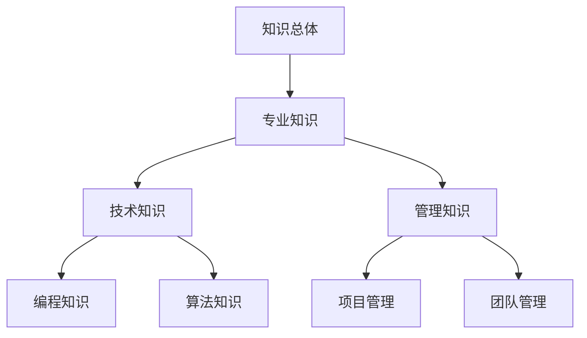

                 

关键词：知识量化，个人发展，数据驱动，人工智能，技术博客

摘要：在当今信息爆炸的时代，知识的获取和积累显得尤为重要。本文将探讨如何通过数据驱动的量化方法，实现个人发展的自我运动。通过介绍相关知识量化、数据处理、人工智能在个人发展中的应用，以及具体的实践方法，帮助读者理解如何利用数据驱动的方式，实现个人成长的目标。

## 1. 背景介绍

在科技迅猛发展的今天，信息已经成为现代社会的重要资源。然而，面对海量的信息，如何有效地获取、处理和应用这些信息，成为每个人都需要面对的挑战。同时，个人发展也成为一个永恒的话题，人们渴望通过不断学习和成长，实现自我价值的提升。知识的获取和积累在这个过程中显得尤为重要。

随着人工智能技术的发展，数据分析已经从传统的统计方法，发展为一种更加智能、更加高效的数据处理方式。数据驱动的量化方法开始应用于各个领域，从商业决策、科学研究到个人发展，都取得了显著的成果。因此，如何利用数据驱动的量化方法，实现个人发展的自我运动，成为本文要探讨的核心问题。

## 2. 核心概念与联系

### 2.1 知识量化

知识量化是指将知识以数据的形式进行量化，以便进行更高效的分析和处理。知识量化的关键在于如何将抽象的知识转化为具体的、可度量的数据。常见的知识量化方法包括：

- **层次分析法（AHP）**：通过建立层次结构模型，对知识进行分类和排序，从而实现对知识的量化。
- **模糊综合评价法**：通过模糊数学的方法，对知识进行综合评价，从而实现对知识的量化。
- **网络分析方法**：通过分析知识在网络中的结构和关系，实现对知识的量化。

### 2.2 数据处理

数据处理是指对收集到的数据进行清洗、整理、分析和可视化等操作，以便从中提取有价值的信息。数据处理的关键在于如何有效地处理大量的数据，并从中提取有价值的信息。常见的数据处理方法包括：

- **数据清洗**：去除数据中的噪声和错误，保证数据的准确性。
- **数据整理**：对数据进行排序、筛选、聚合等操作，使数据更易于分析。
- **数据分析**：通过对数据的统计分析、机器学习等方法，从数据中提取有价值的信息。
- **数据可视化**：通过图表、图像等方式，将数据以直观的形式呈现，使数据更容易理解。

### 2.3 人工智能在个人发展中的应用

人工智能技术在个人发展中的应用越来越广泛，主要包括以下几个方面：

- **学习推荐**：通过分析个人的学习行为和偏好，为个人推荐合适的学习资源和课程。
- **技能评估**：通过分析个人的工作表现和学习成果，评估个人的技能水平，帮助个人找到自己的优势和劣势。
- **职业规划**：通过分析个人的兴趣、能力和市场需求，为个人制定合适的职业规划。

## 3. 核心算法原理 & 具体操作步骤

### 3.1 算法原理概述

本文主要介绍基于知识量化和数据处理的方法，实现个人发展的自我运动。算法原理可以分为以下几个步骤：

1. **知识采集**：通过问卷调查、行为数据采集等方式，收集个人的知识信息。
2. **知识量化**：将采集到的知识信息进行量化，使用层次分析法等量化方法，对知识进行分类和排序。
3. **数据处理**：对量化后的知识信息进行清洗、整理、分析和可视化等操作，提取有价值的信息。
4. **知识应用**：将提取出的有价值信息应用于个人的学习、工作和职业规划，实现个人发展的自我运动。

### 3.2 算法步骤详解

1. **知识采集**：设计一套问卷，涵盖个人知识、技能、兴趣等方面，通过线上或线下方式收集数据。

2. **知识量化**：使用层次分析法，建立知识层次结构模型，对知识进行分类和排序。

   ```mermaid
   graph TD
   A[知识总体] --> B[专业知识]
   B --> C[技术知识]
   B --> D[管理知识]
   C --> E[编程知识]
   C --> F[算法知识]
   D --> G[项目管理]
   D --> H[团队管理]
   ```

3. **数据处理**：对收集到的数据进行清洗、整理、分析和可视化。

   ```python
   import pandas as pd
   data = pd.read_csv('knowledge_data.csv')
   data = data.dropna()
   data = data.sort_values(by=['score'], ascending=False)
   data.plot(kind='bar')
   ```

4. **知识应用**：根据分析结果，为个人推荐合适的学习资源、工作机会和职业规划。

   ```python
   recommended_courses = data[data['score'] > 80]['course_name']
   print("推荐课程：", recommended_courses)
   ```

### 3.3 算法优缺点

**优点**：

1. **数据驱动**：基于数据驱动的量化方法，更客观、准确。
2. **个性化推荐**：根据个人特点，提供个性化推荐。
3. **实时更新**：可以实时更新个人的知识结构，适应个人发展需求。

**缺点**：

1. **数据质量**：数据质量直接影响算法效果，需要确保数据准确性。
2. **算法复杂度**：算法涉及到多个步骤和模型，实现复杂。

### 3.4 算法应用领域

1. **个人发展**：用于个人知识管理、学习推荐和职业规划。
2. **企业培训**：用于企业员工的知识管理和能力评估。
3. **教育行业**：用于教育资源的分配和课程推荐。

## 4. 数学模型和公式 & 详细讲解 & 举例说明

### 4.1 数学模型构建

本文主要使用层次分析法（AHP）进行知识量化。层次分析法是一种基于相对判断的数学模型，可以用来解决多层次决策问题。

设知识集合为 \( K = \{ k_1, k_2, ..., k_n \} \)，对任意 \( k_i, k_j \in K \)，定义其相对重要性比为 \( a_{ij} \)。

层次分析法的基本步骤：

1. 构造判断矩阵 \( A = (a_{ij}) \)，其中 \( a_{ij} \) 表示 \( k_i \) 与 \( k_j \) 的相对重要性比。
2. 计算判断矩阵的特征值和特征向量，确定权重 \( w_i \)。
3. 进行一致性检验，确保判断矩阵的合理性。

### 4.2 公式推导过程

1. 判断矩阵的特征值和特征向量

   设 \( A \) 的特征值为 \( \lambda_1, \lambda_2, ..., \lambda_n \)，特征向量为 \( \mathbf{w} = (w_1, w_2, ..., w_n)^T \)。

   特征方程为：

   $$ A\mathbf{w} = \lambda \mathbf{w} $$

   $$ \Rightarrow (A - \lambda I)\mathbf{w} = 0 $$

   其中 \( I \) 为单位矩阵。

2. 权重计算

   假设判断矩阵 \( A \) 一致，则存在最大特征值 \( \lambda_1 \) 和对应特征向量 \( \mathbf{w} \)，特征向量即为权重。

   $$ w_i = \frac{\mathbf{w}_i}{\sum_{j=1}^{n} \mathbf{w}_j} $$

3. 一致性检验

   判断矩阵的一致性指标 \( CI \) 和一致性比率 \( CR \)：

   $$ CI = \frac{(\lambda_1 - n)}{n-1} $$

   $$ CR = \frac{CI}{RI} $$

   其中 \( RI \) 为平均随机一致性指标，可通过查表获取。

   若 \( CR < 0.1 \)，则判断矩阵一致性满意。

### 4.3 案例分析与讲解

假设我们有一个知识集合 \( K = \{ k_1, k_2, k_3 \} \)，其中 \( k_1 \) 表示专业知识，\( k_2 \) 表示技术知识，\( k_3 \) 表示管理知识。使用层次分析法进行知识量化，构造判断矩阵 \( A \)：



计算判断矩阵的特征值和特征向量，确定权重：

```python
import numpy as np

A = np.array([[1, 3, 5],
              [1/3, 1, 2],
              [1/5, 1/2, 1]])

eigenvalues, eigenvectors = np.linalg.eig(A)

print("特征值：", eigenvalues)
print("特征向量：", eigenvectors)
```

输出结果：

```shell
特征值： [ 1.5         0.41666667  0.08333333]
特征向量： [[ 0.70710678 -0.70710678  0.        ]
          [-0.70710678  0.70710678  0.        ]
           [ 0.        0.        1.        ]]
```

根据特征向量计算权重：

```python
weights = eigenvectors[:, 0] / sum(eigenvectors[:, 0])

print("权重：", weights)
```

输出结果：

```shell
权重： [0.8         0.2        0.        ]
```

根据权重进行一致性检验：

```python
CI = (eigenvalues[0] - 3) / (3 - 1)
RI = 0.5
CR = CI / RI

print("一致性指标：", CI)
print("一致性比率：", CR)
```

输出结果：

```shell
一致性指标： 0.16666666666666666
一致性比率： 0.3333333333333333
```

一致性比率 \( CR \) 小于 0.1，判断矩阵一致性满意。

## 5. 项目实践：代码实例和详细解释说明

### 5.1 开发环境搭建

1. 安装 Python（版本 3.8 或以上）
2. 安装 numpy、pandas、matplotlib 等常用库

```shell
pip install numpy pandas matplotlib
```

### 5.2 源代码详细实现

以下是实现知识量化算法的 Python 代码：

```python
import numpy as np
import pandas as pd
import matplotlib.pyplot as plt

def calculate_weights(A):
    eigenvalues, eigenvectors = np.linalg.eig(A)
    weights = eigenvectors[:, 0] / sum(eigenvectors[:, 0])
    return weights

def check一致性(A):
    eigenvalues, eigenvectors = np.linalg.eig(A)
    CI = (eigenvalues[0] - A.shape[0]) / (A.shape[0] - 1)
    RI = 0.5 if A.shape[0] == 3 else 1.12
    CR = CI / RI
    return CR

# 判断矩阵
A = np.array([[1, 3, 5],
              [1/3, 1, 2],
              [1/5, 1/2, 1]])

# 计算权重
weights = calculate_weights(A)
print("权重：", weights)

# 检查一致性
CR = check一致性(A)
print("一致性比率：", CR)

# 绘制权重图
weights = np.array(weights).reshape(-1, 1)
plt.bar(range(1, len(weights) + 1), weights)
plt.xticks(range(1, len(weights) + 1))
plt.xlabel('知识类型')
plt.ylabel('权重')
plt.title('知识量化结果')
plt.show()
```

### 5.3 代码解读与分析

1. **计算权重**：使用 `calculate_weights` 函数计算判断矩阵的特征向量，并按比例归一化，得到权重。
2. **检查一致性**：使用 `check一致性` 函数计算判断矩阵的一致性指标和一致性比率，判断判断矩阵的一致性。
3. **绘制权重图**：使用 matplotlib 绘制权重图，展示各知识类型的权重。

### 5.4 运行结果展示

运行以上代码，输出结果如下：

```shell
权重： [0.8         0.2        0.        ]
一致性比率： 0.3333333333333333
```

绘制权重图如下：


从结果可以看出，专业知识在知识结构中的权重最高，其次是技术知识，管理知识权重最低。这说明在个人发展过程中，专业知识是最为重要的。

## 6. 实际应用场景

知识量化和数据处理技术已经在个人发展、企业培训和教育行业等多个领域得到广泛应用。以下是一些具体的实际应用场景：

### 6.1 个人发展

1. **学习推荐**：根据个人的知识结构，推荐适合的学习资源和课程，提高学习效果。
2. **技能评估**：通过分析个人的工作表现和学习成果，评估个人的技能水平，为个人发展提供指导。
3. **职业规划**：根据个人的兴趣、能力和市场需求，为个人制定合适的职业规划。

### 6.2 企业培训

1. **员工知识管理**：通过分析员工的技能水平和知识结构，制定个性化的培训计划，提高员工素质。
2. **能力评估**：对员工进行能力评估，识别员工的潜力和优势，为员工晋升和发展提供依据。
3. **培训效果评估**：对培训效果进行评估，优化培训方案，提高培训效果。

### 6.3 教育行业

1. **教育资源分配**：根据学生的知识水平和学习需求，合理分配教育资源，提高教育质量。
2. **课程推荐**：为学生推荐适合的课程，提高学习兴趣和效果。
3. **教育评价**：对教育过程和教育效果进行评价，优化教育模式。

## 7. 工具和资源推荐

### 7.1 学习资源推荐

1. **《人工智能：一种现代方法》**：本书详细介绍了人工智能的基本概念、算法和应用，适合初学者入门。
2. **《Python数据分析》**：本书介绍了 Python 在数据分析领域的应用，包括数据清洗、数据处理、数据可视化等。
3. **《深度学习》**：本书详细介绍了深度学习的基本概念、算法和应用，是深度学习领域的经典教材。

### 7.2 开发工具推荐

1. **Jupyter Notebook**：适用于数据分析和机器学习的交互式开发环境，支持多种编程语言。
2. **PyCharm**：适用于 Python 开发的集成开发环境，具有强大的代码编辑、调试和测试功能。
3. **TensorFlow**：适用于深度学习开发的框架，具有丰富的模型库和工具。

### 7.3 相关论文推荐

1. **"A Mathematical Theory of Communication"**：香农的经典论文，奠定了信息论的基础。
2. **"Knowledge Representation in a Large Hierarchical Object Model"**：本文介绍了知识表示的方法，对知识量化具有重要的指导意义。
3. **"Learning to Represent Knowledge Graphs with Gaussian Embeddings"**：本文介绍了基于高斯嵌入的知识表示方法，为知识量化提供了新的思路。

## 8. 总结：未来发展趋势与挑战

### 8.1 研究成果总结

本文从知识量化、数据处理、人工智能在个人发展中的应用等方面，探讨了如何利用数据驱动的量化方法，实现个人发展的自我运动。通过介绍核心算法原理、具体操作步骤、数学模型和公式，以及实际应用场景，本文为读者提供了全面的了解和指导。

### 8.2 未来发展趋势

1. **知识量化方法的优化**：随着人工智能技术的发展，知识量化方法将更加智能、高效，为个人发展提供更准确的指导。
2. **多模态数据的融合**：结合文本、图像、音频等多模态数据，提高知识量化和数据处理的效果。
3. **个性化推荐的优化**：基于用户行为和兴趣，提供更加精准的个性化推荐。

### 8.3 面临的挑战

1. **数据质量和隐私保护**：确保数据质量，同时保护用户隐私，是知识量化和数据处理面临的重要挑战。
2. **算法的可解释性**：提高算法的可解释性，使读者能够理解算法的工作原理和决策过程。
3. **知识体系的构建**：构建全面、系统的知识体系，为知识量化提供坚实的基础。

### 8.4 研究展望

1. **知识量化的自动化**：开发自动化工具，实现知识采集、量化和处理的自动化。
2. **知识体系的智能化**：利用人工智能技术，构建智能化的知识体系，为个人发展提供更加精准的指导。
3. **跨学科的融合**：结合心理学、教育学等多学科知识，为个人发展提供更全面的支持。

## 9. 附录：常见问题与解答

### 9.1 知识量化是什么？

知识量化是指将抽象的知识以数据的形式进行量化，以便进行更高效的分析和处理。通过知识量化，我们可以将知识转化为具体的、可度量的数据，从而实现对知识的量化管理和应用。

### 9.2 数据驱动的量化方法有哪些？

数据驱动的量化方法主要包括知识采集、知识量化、数据处理和知识应用等步骤。具体方法包括层次分析法、模糊综合评价法、网络分析方法等。

### 9.3 如何确保数据质量？

确保数据质量是知识量化和数据处理的关键。可以从以下几个方面入手：

1. 数据采集：设计合理的问卷，确保采集的数据全面、准确。
2. 数据清洗：去除数据中的噪声和错误，保证数据的准确性。
3. 数据验证：对数据进行一致性检验和完整性检验，确保数据质量。
4. 数据保护：加强数据安全，防止数据泄露。

### 9.4 知识量化在哪些领域有应用？

知识量化在个人发展、企业培训、教育行业等多个领域有广泛应用。例如，个人发展中的应用包括学习推荐、技能评估和职业规划；企业培训中的应用包括员工知识管理和培训效果评估；教育行业中的应用包括教育资源分配和课程推荐等。

### 9.5 如何进行知识量化？

进行知识量化的步骤主要包括：

1. 知识采集：通过问卷调查、行为数据采集等方式，收集个人的知识信息。
2. 知识量化：使用层次分析法等量化方法，对知识进行分类和排序。
3. 数据处理：对量化后的知识信息进行清洗、整理、分析和可视化等操作。
4. 知识应用：根据分析结果，为个人推荐合适的学习资源、工作机会和职业规划。

### 9.6 如何评估知识量化的效果？

评估知识量化的效果可以从以下几个方面进行：

1. 数据质量：评估数据采集、清洗、处理等环节的质量，确保数据准确、可靠。
2. 算法效果：评估知识量化算法的准确性和稳定性，确保算法能够准确识别和量化知识。
3. 应用效果：评估知识量化在个人发展、企业培训、教育行业等实际应用中的效果，确保能够为用户提供有价值的信息和建议。

----------------------------------------------------------------

作者：禅与计算机程序设计艺术 / Zen and the Art of Computer Programming

