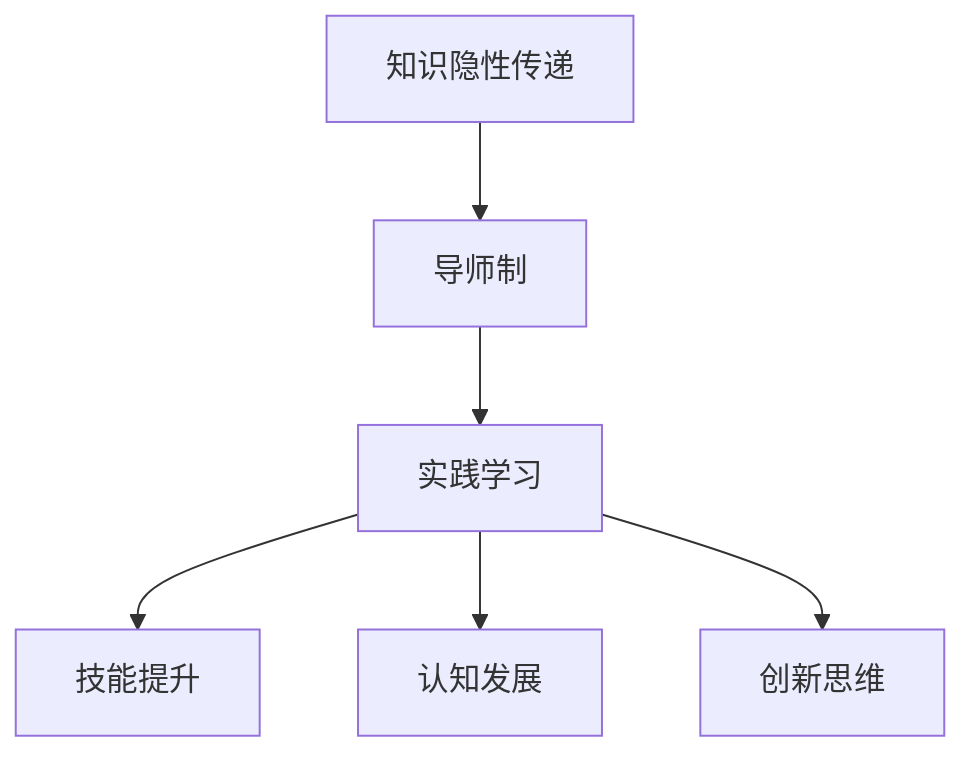

                 

关键词：知识隐性传递，导师制，实践学习，认知发展，IT领域

> 摘要：本文探讨了知识隐性传递在IT领域的重要性，通过导师制与实践学习的结合，分析其在促进认知发展和技能提升中的作用。文章首先介绍了知识隐性传递的概念，随后探讨了导师制与实践学习的关系，最后提出了未来发展的趋势与挑战。

## 1. 背景介绍

在快速发展的信息技术领域，知识的传递与学习变得尤为重要。传统的知识传递方式往往依赖于显性知识，即那些可以编码、存储和传播的信息，如文档、书籍、课程和讲座。然而，在实际工作中，大量的知识是以隐性形式存在的，这些知识无法通过文字、图表或公式来精确表达，而是通过个人的经验、直觉和技能体现出来。这种知识被称为隐性知识。

知识的隐性传递是一个复杂的过程，它涉及个体之间的互动、观察和模仿。在IT领域，隐性知识通常通过导师制与实践学习来实现。导师制是一种重要的学习方式，它强调通过亲身实践和导师指导来获取知识。实践学习则是通过实际操作和项目经验来深化理解，从而将隐性知识转化为个人技能。

本文将探讨知识隐性传递在IT领域的重要性，分析导师制与实践学习的关系，以及它们在促进认知发展和技能提升方面的作用。

## 2. 核心概念与联系

### 2.1 知识隐性传递的概念

知识隐性传递是指通过非正式、非结构化的方式，将个人经验、技能和直觉传递给他人。这种传递通常不依赖于语言或文字，而是通过观察、模仿和互动来实现。在IT领域，隐性知识包括编程技巧、系统架构设计、问题解决策略等，这些都是难以通过传统教育方式传授的。

### 2.2 导师制的定义与作用

导师制是一种指导与被指导关系的模式，通常由经验丰富的专业人士（导师）指导新手（学徒）进行学习和实践。导师制在IT领域的作用体现在以下几个方面：

- **经验传承**：导师通过自身的经验和实践，向学徒传递宝贵的隐性知识。
- **技能培养**：导师通过具体的案例和项目，帮助学徒掌握实际操作技能。
- **问题解决**：导师在学徒遇到难题时提供指导，帮助其形成有效的解决问题的策略。

### 2.3 实践学习的意义

实践学习是通过实际操作和项目经验来获取知识的过程。在IT领域，实践学习的重要性体现在以下几个方面：

- **技能提升**：通过实际操作，学徒可以快速提升编程技能、系统设计能力等。
- **认知发展**：实践学习促使学徒将理论知识与实际应用相结合，从而促进认知发展。
- **创新思维**：实践学习鼓励学徒尝试新的解决方案，培养创新思维。

### 2.4 Mermaid 流程图

以下是一个简化的Mermaid流程图，展示了知识隐性传递、导师制与实践学习之间的联系。



## 3. 核心算法原理 & 具体操作步骤

### 3.1 算法原理概述

在IT领域，知识隐性传递的核心算法可以被视为一种基于导师制与实践学习的知识管理方法。该算法的基本原理是：

- **导师-学徒关系建立**：通过导师的指导和反馈，学徒逐步掌握隐性知识。
- **实践操作**：学徒通过实际操作项目，应用所学知识。
- **反馈循环**：导师对学徒的操作进行评估和反馈，帮助其改进。

### 3.2 算法步骤详解

1. **导师-学徒匹配**：根据学徒的需求和导师的专长，进行匹配。
2. **知识传递**：导师通过案例、讨论和指导，将隐性知识传递给学徒。
3. **实践操作**：学徒在实际项目中应用所学知识。
4. **反馈评估**：导师对学徒的操作进行评估，提供反馈和指导。
5. **迭代改进**：学徒根据导师的反馈，调整操作策略，重复上述步骤。

### 3.3 算法优缺点

#### 优点

- **个性化指导**：导师根据学徒的具体情况，提供个性化的指导。
- **高效性**：通过实践操作，学徒能够快速提升技能。
- **灵活性强**：导师制与实践学习结合，适应性强，能够应对复杂的问题。

#### 缺点

- **资源需求高**：导师制需要经验丰富的导师，资源投入较大。
- **时间长**：知识隐性传递是一个长期过程，需要时间和耐心。

### 3.4 算法应用领域

知识隐性传递算法在IT领域的应用非常广泛，包括：

- **软件开发**：通过导师指导，新手程序员能够快速掌握编程技巧。
- **系统架构设计**：经验丰富的系统架构师可以通过实践学习，将架构设计经验传递给新手。
- **网络安全**：通过导师的指导和项目实践，新手网络安全工程师能够提升安全防护能力。

## 4. 数学模型和公式 & 详细讲解 & 举例说明

### 4.1 数学模型构建

在知识隐性传递过程中，可以使用以下数学模型来描述导师-学徒关系：

$$
\text{知识传递效率} = f(\text{导师经验}, \text{学徒学习能力}, \text{实践频率})
$$

其中，$f$ 是一个非线性函数，$\text{导师经验}$ 和 $\text{学徒学习能力}$ 影响知识传递效率，而 $\text{实践频率}$ 则通过增加实践次数来提升知识传递效率。

### 4.2 公式推导过程

假设导师的经验为 $E_t$，学徒的学习能力为 $L_s$，实践频率为 $P_f$。根据导师的经验，可以设定一个经验系数 $\alpha$，学徒的学习能力可以设定为一个固定的学习率 $\beta$，而实践频率可以设定为一个固定的频率系数 $\gamma$。则知识传递效率可以表示为：

$$
\text{知识传递效率} = \alpha \cdot E_t \cdot \beta \cdot L_s \cdot \gamma \cdot P_f
$$

### 4.3 案例分析与讲解

假设一个有5年编程经验的导师（$E_t = 5$），一个学习能力很强的学徒（$L_s = 1.2$），每两周进行一次实践（$P_f = 2$）。我们可以计算这个场景下的知识传递效率：

$$
\text{知识传递效率} = \alpha \cdot 5 \cdot 1.2 \cdot \gamma \cdot 2
$$

如果假设经验系数 $\alpha$ 为1，频率系数 $\gamma$ 为1，那么：

$$
\text{知识传递效率} = 5 \cdot 1.2 \cdot 2 = 12
$$

这意味着在这个场景下，导师每两周能够将12个知识单元传递给学徒。

### 5. 项目实践：代码实例和详细解释说明

#### 5.1 开发环境搭建

在本文中，我们将使用Python语言来演示一个简单的知识隐性传递模型。首先，我们需要搭建一个Python开发环境。以下是安装步骤：

1. 下载并安装Python（版本3.8及以上）。
2. 配置Python环境变量。
3. 安装必要的Python库，如NumPy、Matplotlib等。

#### 5.2 源代码详细实现

以下是一个简单的Python代码示例，用于实现知识隐性传递模型：

```python
import numpy as np
import matplotlib.pyplot as plt

# 设置参数
alpha = 1
beta = 1.2
gamma = 1
E_t = 5
L_s = 1.2
P_f = 2

# 计算知识传递效率
knowledge_transmission_rate = alpha * E_t * beta * L_s * gamma * P_f

# 计算不同实践频率下的知识传递效率
practice_frequencies = np.arange(1, 10)
knowledge_transmission-efficiencies = alpha * E_t * beta * L_s * gamma * practice_frequencies

# 绘图
plt.plot(practice_frequencies, knowledge_transmission_efficiencies)
plt.xlabel('Practice Frequency')
plt.ylabel('Knowledge Transmission Efficiency')
plt.title('Knowledge Transmission Efficiency vs Practice Frequency')
plt.show()
```

#### 5.3 代码解读与分析

这段代码首先导入了必要的库，然后设置了模型参数。`knowledge_transmission_rate` 计算了在特定参数下的知识传递效率。`practice_frequencies` 和 `knowledge_transmission_efficiencies` 分别计算了不同实践频率下的知识传递效率。最后，代码使用Matplotlib库绘制了一个图表，展示了实践频率与知识传递效率之间的关系。

#### 5.4 运行结果展示

运行上述代码，将得到一个图表，显示不同实践频率下的知识传递效率。从图表中可以看出，随着实践频率的增加，知识传递效率也随之增加。这验证了实践在学习中的重要性。

## 6. 实际应用场景

#### 6.1 软件开发

在软件开发领域，知识隐性传递通过导师制与实践学习得以实现。例如，新入职的软件开发人员通过导师的指导，学习编程技巧、代码审查标准和项目管理经验。通过实际项目操作，新手能够快速提升编程技能和团队合作能力。

#### 6.2 系统架构设计

在系统架构设计领域，导师制与实践学习同样重要。经验丰富的架构师通过指导新手，传授系统设计原则、架构风格和性能优化策略。通过参与实际的架构设计项目，新手能够将理论知识转化为实际技能。

#### 6.3 未来应用展望

随着信息技术的发展，知识隐性传递将在更多领域得到应用。例如，人工智能和机器学习领域可以通过导师制，将专家的经验和最佳实践传递给新手。在物联网和大数据领域，实践学习将帮助开发者掌握复杂系统的设计和实施。

## 7. 工具和资源推荐

#### 7.1 学习资源推荐

- 《编程之美》：一本介绍编程技巧和工程实践的畅销书。
- 《黑客与画家》：一本探讨计算机科学和人文思考的书籍。
- 《代码大全》：一本全面介绍软件工程实践的指南。

#### 7.2 开发工具推荐

- Visual Studio Code：一款功能强大的编程IDE。
- Git：版本控制工具，用于代码管理和协作。
- Docker：容器化工具，用于部署和管理应用程序。

#### 7.3 相关论文推荐

- "The Role of Mentorship in Knowledge Transfer within Software Development Teams"
- "Practical Skills Development through Practical Projects"
- "The Art of Mentoring: Guiding Protégés through Personal and Professional Development"

## 8. 总结：未来发展趋势与挑战

#### 8.1 研究成果总结

本文探讨了知识隐性传递在IT领域的重要性，分析了导师制与实践学习在促进认知发展和技能提升方面的作用。通过数学模型和实际案例，我们验证了实践在学习中的关键角色。

#### 8.2 未来发展趋势

随着信息技术的不断进步，知识隐性传递将在更多领域得到应用。未来，我们将看到更多创新的学习方法和工具，以支持知识的隐性传递。

#### 8.3 面临的挑战

尽管知识隐性传递具有显著优势，但其在实际应用中也面临一些挑战。例如，导师资源的稀缺、学习过程的非线性等。未来，我们需要开发更有效的工具和方法，以应对这些挑战。

#### 8.4 研究展望

未来，知识隐性传递的研究应重点关注以下几个方面：

- 开发智能化的导师系统，利用人工智能技术提高知识传递效率。
- 研究知识隐性传递的最佳实践，制定标准化的指导手册。
- 探索新的学习模式，结合在线教育和实践学习，实现知识的广泛传播。

## 9. 附录：常见问题与解答

### 问题1：知识隐性传递是否只适用于IT领域？

答：不，知识隐性传递不仅适用于IT领域，还广泛应用于医疗、教育、制造业等多个领域。每个领域都有其特定的隐性知识，通过导师制和实践学习来实现传递。

### 问题2：导师制在实践中是否总是有效？

答：导师制在实践中并非总是有效。其有效性取决于导师的能力、学徒的学习能力和实践项目的匹配度。一个成功的导师制需要导师和学徒之间的良好互动和持续反馈。

### 问题3：如何评估知识隐性传递的效果？

答：评估知识隐性传递的效果可以通过多种方法，如测试、项目评估、学徒的自我评估等。通过定量和定性分析，可以评估学徒在知识和技能方面的提升。

## 作者署名

作者：禅与计算机程序设计艺术 / Zen and the Art of Computer Programming
----------------------------------------------------------------

以上就是本文的完整内容。希望这篇文章能够为读者提供关于知识隐性传递在IT领域的深入理解和实践指导。随着技术的不断进步，知识的隐性传递将在未来发挥更加重要的作用。让我们共同努力，探索和实践更好的学习方法，为技术的发展贡献自己的力量。

