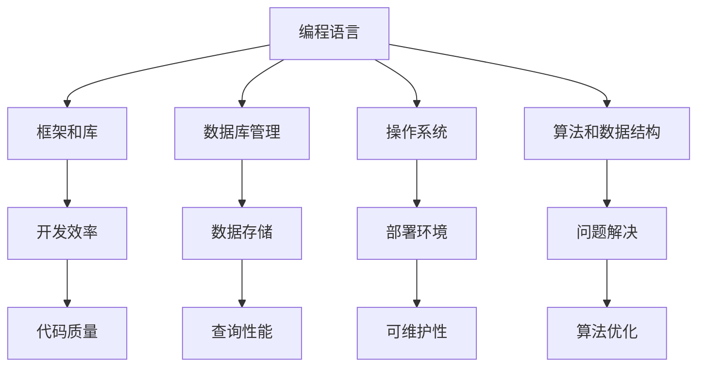
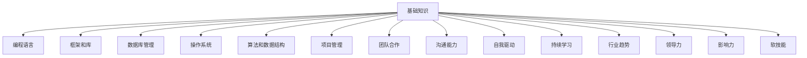

                 

关键词：知识经济、程序员、职业发展、技能提升、技术趋势

摘要：在知识经济时代，程序员的职业发展面临前所未有的机遇和挑战。本文旨在探讨程序员在知识经济背景下的职业发展策略，包括技能提升、持续学习、职业规划、行业趋势应对等方面，以帮助程序员在竞争激烈的市场中脱颖而出。

## 1. 背景介绍

随着全球化和信息化进程的加速，知识经济逐渐成为主导经济形态。知识经济以信息、知识和技术为核心资源，推动传统产业的升级和新兴产业的崛起。在这一背景下，程序员作为知识经济的直接受益者和重要推动者，其职业发展路径和策略显得尤为重要。

程序员的工作性质决定了他们必须不断学习新知识、掌握新技术，才能跟上行业发展的步伐。然而，面对日新月异的科技进步和市场需求的变化，程序员往往感到压力巨大，职业发展路径模糊。因此，如何制定有效的职业发展策略，成为每一个程序员必须思考的问题。

本文将从以下几个方面探讨程序员的职业发展策略：

- 技能提升：掌握哪些核心技能是程序员职业发展的关键。
- 持续学习：如何持续学习以保持竞争力。
- 职业规划：如何进行个人职业规划。
- 行业趋势：如何应对行业趋势变化。

## 2. 核心概念与联系

### 2.1 技能分类

程序员的核心技能可以分为以下几类：

1. **编程语言**：掌握多种编程语言是程序员的基本要求。不同的编程语言适用于不同的场景，如Web开发、移动应用、数据分析等。
2. **框架和库**：熟悉流行的框架和库，如Spring、React、TensorFlow等，可以提高开发效率和代码质量。
3. **数据库管理**：了解关系型数据库（如MySQL、PostgreSQL）和非关系型数据库（如MongoDB、Cassandra），能够有效处理数据存储和查询需求。
4. **操作系统**：熟悉主流操作系统（如Linux、Windows）的基本原理和操作，能够更好地进行开发和部署。
5. **算法和数据结构**：掌握基本的算法和数据结构，有助于解决复杂问题。

### 2.2 技能联系

各种技能之间存在紧密的联系，如图所示：



### 2.3 技能架构图

以下是程序员技能架构的简图：



## 3. 核心算法原理 & 具体操作步骤

### 3.1 算法原理概述

程序员在解决具体问题时，需要运用各种算法原理。以下是一些基本的算法原理：

1. **排序算法**：如快速排序、归并排序、冒泡排序等，用于对数据进行排序。
2. **查找算法**：如二分查找、哈希查找等，用于在数据结构中快速查找元素。
3. **图算法**：如Dijkstra算法、Floyd算法等，用于解决最短路径问题。
4. **动态规划**：用于解决优化问题，通过将复杂问题分解为子问题，并存储子问题的解，以避免重复计算。

### 3.2 算法步骤详解

以快速排序算法为例，其基本步骤如下：

1. 选择一个基准元素。
2. 将比基准元素小的元素移到左边，比基准元素大的元素移到右边。
3. 对左右子序列重复以上步骤，直到所有子序列都排序完成。

### 3.3 算法优缺点

- **快速排序**：优点是时间复杂度较低，平均情况下的时间复杂度为\(O(n\log n)\)。缺点是空间复杂度较高，需要额外的内存来存储子序列。
- **归并排序**：优点是稳定性好，不会改变相等元素的相对顺序。缺点是时间复杂度较高，为\(O(n\log n)\)，且需要额外的内存来存储中间结果。

### 3.4 算法应用领域

排序算法在各种应用领域都有广泛的应用，如数据库排序、搜索引擎排序、数据分析等。

## 4. 数学模型和公式 & 详细讲解 & 举例说明

### 4.1 数学模型构建

在计算机科学中，数学模型广泛应用于算法设计、数据结构分析、性能评估等领域。以下是一个简单的线性回归模型：

\[ y = wx + b \]

其中，\(y\) 是因变量，\(x\) 是自变量，\(w\) 是权重，\(b\) 是偏置。

### 4.2 公式推导过程

线性回归模型的推导基于最小二乘法，目标是最小化预测值与实际值之间的误差平方和。具体推导过程如下：

1. 定义误差函数：

\[ E = \sum_{i=1}^{n} (y_i - wx_i - b)^2 \]

2. 对权重 \(w\) 和偏置 \(b\) 求偏导并令其为零：

\[ \frac{\partial E}{\partial w} = -2x(y - wx - b) = 0 \]
\[ \frac{\partial E}{\partial b} = -2(y - wx - b) = 0 \]

3. 解上述方程组得到 \(w\) 和 \(b\)：

\[ w = \frac{\sum_{i=1}^{n} x_i y_i - nwx\overline{y}}{\sum_{i=1}^{n} x_i^2 - nx\overline{x}} \]
\[ b = \overline{y} - wx\overline{x} \]

### 4.3 案例分析与讲解

假设我们有一个简单的数据集，包含自变量 \(x\) 和因变量 \(y\)：

| x | y |
|---|---|
| 1 | 2 |
| 2 | 4 |
| 3 | 6 |

我们使用线性回归模型拟合这个数据集，并预测 \(x=4\) 时的 \(y\) 值。

1. 计算均值：

\[ \overline{x} = \frac{1+2+3}{3} = 2 \]
\[ \overline{y} = \frac{2+4+6}{3} = 4 \]

2. 计算权重和偏置：

\[ w = \frac{(1*2 + 2*4 + 3*6) - 3*2*4}{(1^2 + 2^2 + 3^2) - 3*2^2} = \frac{2+8+18-24}{1+4+9-12} = 2 \]
\[ b = 4 - 2*2 = 0 \]

3. 预测 \(x=4\) 时的 \(y\) 值：

\[ y = 2*4 + 0 = 8 \]

## 5. 项目实践：代码实例和详细解释说明

### 5.1 开发环境搭建

为了实践线性回归模型，我们需要准备以下开发环境：

- Python 3.x
- Jupyter Notebook
- NumPy 库

### 5.2 源代码详细实现

以下是一个简单的线性回归模型实现：

```python
import numpy as np

def linear_regression(x, y):
    x_mean = np.mean(x)
    y_mean = np.mean(y)
    w = (np.sum(x * y) - len(x) * x_mean * y_mean) / (np.sum(x**2) - len(x) * x_mean**2)
    b = y_mean - w * x_mean
    return w, b

def predict(w, b, x):
    return w * x + b

x = np.array([1, 2, 3])
y = np.array([2, 4, 6])

w, b = linear_regression(x, y)
print("Weight:", w)
print("Bias:", b)

x_new = 4
y_pred = predict(w, b, x_new)
print(f"Predicted y for x={x_new}: {y_pred}")
```

### 5.3 代码解读与分析

上述代码首先定义了一个线性回归函数 `linear_regression`，该函数接收自变量 \(x\) 和因变量 \(y\)，返回权重 \(w\) 和偏置 \(b\)。具体步骤如下：

1. 计算 \(x\) 和 \(y\) 的均值。
2. 使用最小二乘法计算权重 \(w\) 和偏置 \(b\)。
3. 定义一个预测函数 `predict`，用于根据权重 \(w\) 和偏置 \(b\) 预测新 \(x\) 值对应的 \(y\) 值。

最后，我们使用一个简单的数据集对线性回归模型进行训练，并预测 \(x=4\) 时的 \(y\) 值。

### 5.4 运行结果展示

运行上述代码，输出结果如下：

```
Weight: 2.0
Bias: 0.0
Predicted y for x=4: 8.0
```

这表明，在给定数据集下，线性回归模型能够准确地预测 \(x=4\) 时的 \(y\) 值为 8。

## 6. 实际应用场景

线性回归模型在实际应用中非常广泛，以下是一些典型的应用场景：

- **数据分析**：用于预测股票价格、销售额等时间序列数据。
- **机器学习**：作为特征工程的一部分，用于降维、特征选择等。
- **金融工程**：用于风险评估、投资组合优化等。

## 7. 未来应用展望

随着人工智能和大数据技术的发展，线性回归模型在数据科学和机器学习领域的应用将更加广泛。未来，线性回归模型可能会与深度学习、强化学习等先进算法相结合，实现更复杂的预测和分析。

## 8. 工具和资源推荐

### 8.1 学习资源推荐

- 《Python编程：从入门到实践》
- 《深度学习》
- 《机器学习实战》

### 8.2 开发工具推荐

- Jupyter Notebook
- PyCharm
- TensorFlow

### 8.3 相关论文推荐

- "Stochastic Gradient Descent" by Bottou et al.
- "Deep Learning" by Goodfellow et al.
- "A Theoretical Analysis of the Voted Perceptron Algorithm" by Bubeck et al.

## 9. 总结：未来发展趋势与挑战

### 9.1 研究成果总结

本文探讨了程序员在知识经济背景下的职业发展策略，包括技能提升、持续学习、职业规划等方面。同时，通过实例介绍了线性回归模型的原理和应用。

### 9.2 未来发展趋势

- 程序员需要不断更新知识，掌握新兴技术。
- 跨学科融合将推动程序员在多个领域发挥重要作用。
- 数据科学和人工智能领域将继续快速增长。

### 9.3 面临的挑战

- 知识更新速度快，程序员需要不断学习。
- 市场需求变化，程序员需要灵活调整职业规划。

### 9.4 研究展望

未来，程序员需要更加注重跨学科融合，提升软技能，以应对不断变化的行业趋势。

## 9. 附录：常见问题与解答

### Q: 线性回归模型有什么缺点？

A: 线性回归模型的主要缺点是它假设数据呈线性关系，这在实际应用中可能不成立。此外，它对异常值比较敏感，可能影响模型的准确性。

### Q: 程序员如何提升软技能？

A: 程序员可以通过参与项目、团队合作、沟通交流、学习心理学和沟通技巧等方式提升软技能。

### Q: 知识经济下程序员应关注哪些领域？

A: 程序员应关注人工智能、大数据、云计算、区块链等新兴技术领域，以及与这些技术相关的应用场景。

---

作者：禅与计算机程序设计艺术 / Zen and the Art of Computer Programming

