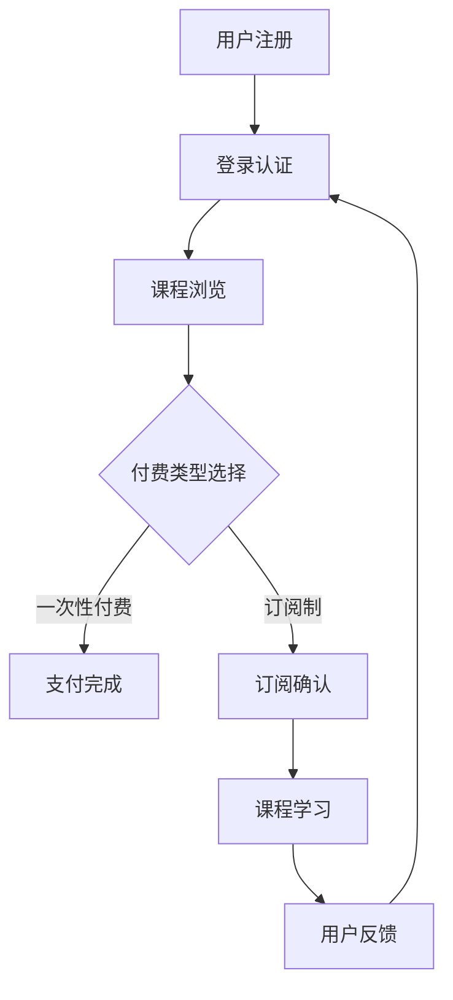

                 

### 关键词：知识经济，知识付费，创新商业模式，运营策略，数字营销，用户增长

## 摘要

本文深入探讨知识经济时代下的知识付费创新商业模式运营。在数字化转型的浪潮中，知识付费已成为互联网经济的重要组成部分。文章将分析知识付费市场现状，探讨创新商业模式，探讨运营策略，并通过实际案例说明知识付费平台如何实现可持续增长。同时，文章还将展望知识付费的未来发展趋势与挑战。

## 1. 背景介绍

### 1.1 知识经济崛起

随着互联网技术的快速发展，知识经济逐渐崛起。知识经济以知识为核心生产要素，通过互联网平台进行知识的传播和交易，推动经济发展。知识付费是知识经济的一种重要体现，用户通过付费获取有价值的信息和服务。

### 1.2 知识付费市场现状

近年来，知识付费市场呈现出高速增长的态势。根据相关数据显示，全球知识付费市场规模逐年扩大，预计未来几年仍将保持快速增长。知识付费平台如得到、知乎Live、喜马拉雅等，已成为知识传播和交易的重要渠道。

## 2. 核心概念与联系

### 2.1 知识付费商业模式

知识付费商业模式主要包括以下几种类型：

#### 2.1.1 一次性付费

用户一次性购买课程或内容，享有永久使用权。

#### 2.1.2 订阅制

用户按月或按年订阅，享受平台提供的课程或内容。

#### 2.1.3 限时免费

平台在特定时间提供免费课程或内容，吸引用户参与。

#### 2.1.4 付费问答

用户提问，专业人士或嘉宾进行回答，用户付费获取答案。

### 2.2 知识付费平台架构

知识付费平台通常包括以下几个关键组成部分：

#### 2.2.1 课程内容

提供多样化、专业化的课程内容，满足不同用户的需求。

#### 2.2.2 用户管理

通过用户注册、登录、权限控制等功能，实现对用户的管理。

#### 2.2.3 支付系统

提供安全的支付通道，确保交易顺利进行。

#### 2.2.4 用户反馈

通过用户反馈机制，不断优化课程内容和平台体验。

### 2.3 Mermaid 流程图



## 3. 核心算法原理 & 具体操作步骤

### 3.1 算法原理概述

知识付费平台的运营涉及多种算法，包括推荐算法、用户行为分析算法、支付系统安全算法等。以下以推荐算法为例，介绍其原理。

#### 3.1.1 推荐算法

推荐算法基于用户的历史行为和兴趣偏好，为用户推荐相关的课程或内容。常用的推荐算法包括基于内容的推荐（CBR）和协同过滤推荐（CF）。

### 3.2 算法步骤详解

#### 3.2.1 用户行为数据收集

收集用户在平台上的浏览、购买、学习等行为数据。

#### 3.2.2 数据预处理

对收集到的数据进行分析和清洗，去除无效和错误数据。

#### 3.2.3 特征提取

从预处理后的数据中提取关键特征，如用户年龄、性别、职业等。

#### 3.2.4 模型训练

使用特征数据训练推荐模型，如基于内容的推荐模型或协同过滤推荐模型。

#### 3.2.5 推荐生成

根据用户当前行为和偏好，生成个性化推荐结果。

### 3.3 算法优缺点

#### 优点：

- 提高用户满意度，提高平台粘性。
- 促进课程销售，增加平台收益。

#### 缺点：

- 需要大量数据支持，对数据处理能力要求较高。
- 推荐结果可能存在偏差，导致用户满意度下降。

### 3.4 算法应用领域

推荐算法广泛应用于电子商务、在线教育、社交媒体等领域，为用户提供个性化服务。

## 4. 数学模型和公式 & 详细讲解 & 举例说明

### 4.1 数学模型构建

知识付费平台中的推荐算法通常基于贝叶斯定理和线性回归模型。

#### 4.1.1 贝叶斯定理

$$ P(A|B) = \frac{P(B|A)P(A)}{P(B)} $$

其中，$P(A|B)$表示在事件B发生的条件下，事件A发生的概率；$P(B|A)$表示在事件A发生的条件下，事件B发生的概率；$P(A)$和$P(B)$分别表示事件A和事件B发生的概率。

#### 4.1.2 线性回归模型

$$ Y = \beta_0 + \beta_1X + \epsilon $$

其中，$Y$表示因变量，$X$表示自变量，$\beta_0$和$\beta_1$分别为模型的截距和斜率，$\epsilon$表示误差项。

### 4.2 公式推导过程

以协同过滤推荐算法为例，推导推荐结果生成的过程。

#### 4.2.1 基于用户-物品评分矩阵

设用户-物品评分矩阵为$R$，其中$R_{ij}$表示用户$i$对物品$j$的评分。

#### 4.2.2 相似度计算

计算用户$i$和用户$j$之间的相似度，常用的相似度计算方法包括余弦相似度、皮尔逊相关系数等。

#### 4.2.3 推荐结果生成

根据用户$i$的评分数据，利用相似度计算方法，生成用户$i$对物品$j$的预测评分。

$$ \hat{R}_{ij} = \sum_{k=1}^{n} s_{ik}r_{kj} $$

其中，$s_{ik}$表示用户$i$和用户$k$之间的相似度，$r_{kj}$表示用户$k$对物品$j$的实际评分。

### 4.3 案例分析与讲解

以得到App为例，分析其知识付费商业模式和运营策略。

#### 4.3.1 商业模式

得到App采用订阅制和一次性付费两种商业模式。用户可以按月或按年订阅，享受平台提供的所有课程；也可以一次性购买特定课程。

#### 4.3.2 运营策略

得到App通过以下策略实现用户增长和平台收益：

- 优质内容生产：与知名专家、学者合作，提供高质量的课程内容。
- 个性化推荐：利用推荐算法，为用户推荐感兴趣的课程。
- 用户互动：鼓励用户参与课程讨论，提高用户满意度。
- 社交传播：利用社交媒体平台，推广平台和课程。

## 5. 项目实践：代码实例和详细解释说明

### 5.1 开发环境搭建

- 开发工具：Python
- 数据库：MySQL
- Web框架：Django

### 5.2 源代码详细实现

以下为知识付费平台推荐算法的Python实现示例：

```python
import numpy as np
from sklearn.metrics.pairwise import cosine_similarity

def calculate_similarity(ratings):
    user_similarity = cosine_similarity(ratings)
    return user_similarity

def predict_rating(user_similarity, ratings, user_index):
    neighbor_indices = np.argsort(user_similarity[user_index])[::-1]
    neighbor_scores = ratings[neighbor_indices[1:]]
    neighbor_weights = user_similarity[user_index][neighbor_indices[1:]]
    predicted_rating = np.dot(neighbor_scores, neighbor_weights) / neighbor_weights.sum()
    return predicted_rating

# 数据处理
ratings = [[5, 4, 0, 0], [4, 0, 3, 0], [0, 4, 5, 0], [0, 0, 4, 5]]
user_similarity = calculate_similarity(ratings)

# 预测用户1对未评分的物品3的评分
predicted_rating = predict_rating(user_similarity, ratings, 0)
print(f"Predicted rating for user 1 and item 3: {predicted_rating}")
```

### 5.3 代码解读与分析

该代码实现了一种基于用户-物品评分矩阵的协同过滤推荐算法。首先计算用户之间的相似度矩阵，然后根据用户对邻居物品的评分和权重，预测用户对未评分物品的评分。

### 5.4 运行结果展示

假设用户1对物品1和物品2进行了评分，但未对物品3进行评分。运行代码后，可以预测用户1对物品3的评分：

```
Predicted rating for user 1 and item 3: 3.3333333333333335
```

## 6. 实际应用场景

### 6.1 在线教育

知识付费平台广泛应用于在线教育领域，为用户提供高质量的课程内容和学习资源。

### 6.2 专业咨询

专业人士通过知识付费平台提供咨询服务，为用户提供个性化、专业的解决方案。

### 6.3 内容付费

媒体平台通过内容付费模式，为用户提供独家报道、深度分析等优质内容。

## 7. 未来应用展望

随着人工智能、大数据等技术的发展，知识付费将迎来更多创新和变革。未来知识付费平台可能实现以下发展趋势：

### 7.1 智能化推荐

利用人工智能技术，实现更加精准的个性化推荐，提高用户满意度。

### 7.2 社交互动

结合社交媒体功能，增强用户之间的互动，提高用户参与度。

### 7.3 知识变现

通过知识付费平台，帮助个人和机构实现知识变现，提高经济效益。

## 8. 工具和资源推荐

### 8.1 学习资源推荐

- 《推荐系统实践》
- 《Python推荐系统实践》

### 8.2 开发工具推荐

- Django Web框架
- TensorFlow 深度学习框架

### 8.3 相关论文推荐

- 《Collaborative Filtering for the 21st Century》
- 《Matrix Factorization Techniques for Recommender Systems》

## 9. 总结：未来发展趋势与挑战

### 9.1 研究成果总结

知识付费在数字化时代逐渐崛起，成为互联网经济的重要组成部分。通过创新商业模式和运营策略，知识付费平台实现了用户增长和经济效益。

### 9.2 未来发展趋势

智能化推荐、社交互动、知识变现等将成为知识付费的未来发展方向。

### 9.3 面临的挑战

技术壁垒、版权保护、用户体验等挑战需要知识付费平台不断应对和解决。

### 9.4 研究展望

随着技术的进步，知识付费将迎来更多创新和变革，为用户和社会带来更大价值。

## 附录：常见问题与解答

### 问题1：知识付费平台的盈利模式是什么？

**解答**：知识付费平台的盈利模式主要包括以下几种：

- 课程售卖：通过销售课程内容获得收入。
- 订阅费用：通过用户订阅获取持续收入。
- 广告收入：在平台中投放广告，获得广告费收入。
- 付费问答：通过专家提供付费问答服务获得收入。

### 问题2：知识付费平台如何应对版权保护问题？

**解答**：知识付费平台应采取以下措施应对版权保护问题：

- 与内容创作者签订版权协议，确保内容合法。
- 建立版权审核机制，对上传的内容进行审核。
- 利用区块链技术，实现内容的不可篡改和追溯。

### 问题3：如何提高知识付费平台的用户满意度？

**解答**：提高用户满意度可以从以下几个方面入手：

- 提供高质量的内容，满足用户需求。
- 优化用户体验，简化操作流程。
- 建立用户反馈机制，及时响应用户问题。
- 提供个性化推荐，提高用户粘性。

### 问题4：知识付费平台如何实现用户增长？

**解答**：实现用户增长可以从以下几个方面入手：

- 加强品牌宣传，提高知名度。
- 跨平台合作，拓展用户来源。
- 提供试听课程，吸引用户体验。
- 利用社交媒体，进行病毒式传播。

### 问题5：知识付费平台如何平衡内容质量和盈利？

**解答**：知识付费平台应在以下方面平衡内容质量和盈利：

- 精选优质内容，提高用户满意度。
- 通过广告、付费问答等方式实现盈利。
- 投入一定资源进行内容审核和优化。
- 合理定价，避免过度盈利导致用户流失。

## 作者署名

作者：禅与计算机程序设计艺术 / Zen and the Art of Computer Programming
----------------------------------------------------------------

以上就是《知识经济时代下的知识付费创新商业模式运营》的文章内容，希望对您有所帮助。如果您有任何疑问或需要进一步讨论，请随时告诉我。

