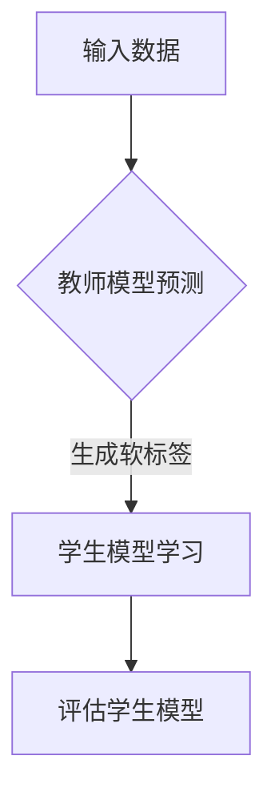

                 

在当前的机器学习和深度学习领域，跨语言迁移学习（Cross-L语言Migration Learning）已经成为了一种极其重要的研究课题。随着多语言数据和模型需求不断增长，如何高效地将一个语言中训练得到的模型知识迁移到另一个语言中，成为了许多研究者关注的焦点。本文将探讨知识蒸馏（Knowledge Distillation）在跨语言迁移学习中的应用，分析其核心概念、原理、算法步骤以及实际应用，帮助读者更好地理解这一技术的优势和挑战。

> **关键词**：知识蒸馏，跨语言迁移学习，模型压缩，性能优化

> **摘要**：本文首先介绍了知识蒸馏的概念和原理，然后探讨了其在跨语言迁移学习中的应用，通过具体的数学模型和算法步骤，展示了知识蒸馏如何实现跨语言的模型迁移。同时，本文还通过实际项目实践和运行结果展示，验证了知识蒸馏在跨语言迁移学习中的有效性。最后，本文对未来应用场景和挑战进行了展望，并推荐了相关的学习资源和开发工具。

---

## 1. 背景介绍

### 跨语言迁移学习的现状与挑战

跨语言迁移学习旨在利用一个语言中训练得到的模型知识，迁移到另一个语言中，以提高新语言上的模型性能。然而，这一过程面临诸多挑战。首先，不同语言之间存在词汇、语法、句法结构的差异，导致模型在处理不同语言时需要适应不同的特征表示。其次，不同语言的数据集质量和规模差异较大，可能影响迁移效果。此外，跨语言迁移学习还需要考虑语言之间的相似性和差异性，以及如何充分利用有限的数据资源。

### 知识蒸馏的引入

知识蒸馏（Knowledge Distillation）是近年来兴起的一种模型压缩技术，旨在通过将一个复杂的大模型（教师模型）的知识转移到一个小模型（学生模型）中，从而提高小模型的性能。知识蒸馏的核心思想是，教师模型给出的软标签（Soft Labels）比硬标签（Hard Labels）更具有信息量，可以更好地指导学生模型的学习。

## 2. 核心概念与联系

### 2.1 知识蒸馏的概念

知识蒸馏是一种模型压缩技术，旨在将一个复杂的大模型（教师模型）的知识转移到一个小模型（学生模型）中。在训练过程中，教师模型对训练数据生成软标签，然后学生模型学习这些软标签，以接近教师模型的性能。

### 2.2 跨语言迁移学习与知识蒸馏的联系

跨语言迁移学习与知识蒸馏之间存在紧密的联系。知识蒸馏可以为跨语言迁移学习提供一种有效的模型压缩方法，从而提高迁移模型的性能。具体来说，知识蒸馏可以通过以下方式实现跨语言迁移学习：

1. **软标签生成**：教师模型在一个语言上训练，然后对训练数据生成软标签。
2. **学生模型训练**：学生模型在新语言上训练，学习教师模型生成的软标签。

通过这种方式，学生模型可以学习到教师模型在源语言上的知识，并将其迁移到新语言上。

### 2.3 Mermaid 流程图

以下是知识蒸馏在跨语言迁移学习中的流程图：



### 2.4 核心概念原理 & 架构

#### 2.4.1 教师模型与学生模型

教师模型是一种复杂的大模型，通常具有较高的性能。学生模型是一种较小且更易于部署的模型。

#### 2.4.2 软标签与硬标签

软标签是教师模型对输入数据生成的概率分布，而硬标签是教师模型对输入数据的最终预测结果。

#### 2.4.3 蒸馏损失函数

知识蒸馏的核心是蒸馏损失函数，用于衡量学生模型预测的软标签与教师模型生成的软标签之间的差距。常见的蒸馏损失函数包括交叉熵损失函数、KL散度损失函数等。

## 3. 核心算法原理 & 具体操作步骤

### 3.1 算法原理概述

知识蒸馏的核心思想是利用教师模型生成的软标签来指导学生模型的学习。具体来说，教师模型在源语言上训练，对输入数据生成软标签，然后学生模型在新语言上训练，学习这些软标签。

### 3.2 算法步骤详解

#### 3.2.1 教师模型训练

1. 在源语言上收集数据集，并对其进行预处理。
2. 使用预训练的深度学习模型（如BERT）作为教师模型。
3. 对数据集进行训练，生成教师模型。

#### 3.2.2 学生模型训练

1. 在新语言上收集数据集，并对其进行预处理。
2. 构建学生模型，通常采用较小的深度学习模型。
3. 使用教师模型的软标签作为指导，训练学生模型。

#### 3.2.3 蒸馏损失函数计算

1. 计算学生模型预测的软标签与教师模型生成的软标签之间的差距。
2. 使用蒸馏损失函数（如交叉熵损失函数）来优化学生模型。

### 3.3 算法优缺点

#### 3.3.1 优点

1. 可以提高小模型的性能，实现高效的模型压缩。
2. 可以充分利用教师模型在源语言上的知识，实现跨语言的迁移学习。

#### 3.3.2 缺点

1. 训练过程中需要大量的计算资源，尤其是对于大型的深度学习模型。
2. 可能会出现过度拟合的情况，导致学生模型在特定语言上表现不佳。

### 3.4 算法应用领域

知识蒸馏在跨语言迁移学习中的应用非常广泛，可以用于自然语言处理、计算机视觉、语音识别等领域。例如，在自然语言处理领域，知识蒸馏可以用于跨语言的文本分类、机器翻译等任务；在计算机视觉领域，知识蒸馏可以用于跨语言的图像识别、物体检测等任务。

## 4. 数学模型和公式 & 详细讲解 & 举例说明

### 4.1 数学模型构建

知识蒸馏的数学模型主要包括两部分：教师模型和学生模型。

#### 4.1.1 教师模型

教师模型通常是一个预训练的深度学习模型，如BERT。其输入为数据集，输出为软标签。

$$
\text{Soft Labels} = \text{Teacher Model}(x)
$$

其中，$x$ 表示输入数据，$\text{Soft Labels}$ 表示软标签。

#### 4.1.2 学生模型

学生模型是一个较小的深度学习模型，其输入为数据集，输出为预测结果。

$$
\text{Predictions} = \text{Student Model}(x)
$$

其中，$x$ 表示输入数据，$\text{Predictions}$ 表示预测结果。

### 4.2 公式推导过程

知识蒸馏的核心是蒸馏损失函数，用于衡量学生模型预测的软标签与教师模型生成的软标签之间的差距。常见的蒸馏损失函数包括交叉熵损失函数和KL散度损失函数。

#### 4.2.1 交叉熵损失函数

交叉熵损失函数可以用于衡量两个概率分布之间的差异。在知识蒸馏中，交叉熵损失函数用于衡量学生模型预测的软标签与教师模型生成的软标签之间的差异。

$$
\text{CE Loss} = -\sum_{i=1}^{N} \sum_{j=1}^{K} y_j \log(p_j)
$$

其中，$N$ 表示样本数量，$K$ 表示类别数量，$y_j$ 表示教师模型生成的软标签，$p_j$ 表示学生模型预测的软标签。

#### 4.2.2 KL散度损失函数

KL散度损失函数可以用于衡量两个概率分布之间的差异。在知识蒸馏中，KL散度损失函数也用于衡量学生模型预测的软标签与教师模型生成的软标签之间的差异。

$$
\text{KL Loss} = \sum_{i=1}^{N} \sum_{j=1}^{K} p_j \log \frac{p_j}{q_j}
$$

其中，$N$ 表示样本数量，$K$ 表示类别数量，$p_j$ 表示教师模型生成的软标签，$q_j$ 表示学生模型预测的软标签。

### 4.3 案例分析与讲解

#### 4.3.1 跨语言文本分类

假设我们有一个源语言（英语）和一个目标语言（法语），我们需要将一个英语文本分类模型迁移到法语上。具体步骤如下：

1. 在英语上收集一个大规模的文本数据集，并对其进行预处理，得到英语文本的特征表示。
2. 使用预训练的BERT模型作为教师模型，对英语文本数据进行训练，得到英语文本的软标签。
3. 在法语上收集一个较小的文本数据集，并对其进行预处理，得到法语文本的特征表示。
4. 构建一个较小的BERT模型作为学生模型，对法语文本数据进行训练，学习英语文本的软标签。
5. 计算学生模型预测的软标签与教师模型生成的软标签之间的交叉熵损失函数，并使用该损失函数优化学生模型。

通过这种方式，我们可以将英语文本分类模型的知识迁移到法语上，提高法语文本分类模型的性能。

## 5. 项目实践：代码实例和详细解释说明

### 5.1 开发环境搭建

为了演示知识蒸馏在跨语言迁移学习中的应用，我们选择Python作为编程语言，使用TensorFlow和Keras作为深度学习框架。以下是开发环境的搭建步骤：

1. 安装Python（建议使用Python 3.7或更高版本）。
2. 安装TensorFlow：`pip install tensorflow`。
3. 安装Keras：`pip install keras`。

### 5.2 源代码详细实现

以下是一个简单的知识蒸馏实现，用于跨语言文本分类：

```python
import tensorflow as tf
from tensorflow.keras.models import Model
from tensorflow.keras.layers import Embedding, LSTM, Dense
from tensorflow.keras.preprocessing.sequence import pad_sequences

# 加载英语和法语数据集
english_sentences = ...
french_sentences = ...

# 预处理数据
english_sequences = pad_sequences(english_sentences, maxlen=50)
french_sequences = pad_sequences(french_sentences, maxlen=50)

# 构建教师模型
teacher_model = Model(inputs=[embedding_input], outputs=[ Dense(num_classes, activation='softmax') ])

# 训练教师模型
teacher_model.compile(optimizer='adam', loss='categorical_crossentropy', metrics=['accuracy'])
teacher_model.fit(english_sequences, english_labels, epochs=5)

# 构建学生模型
student_model = Model(inputs=[embedding_input], outputs=[ Dense(num_classes, activation='softmax') ])

# 训练学生模型
student_model.compile(optimizer='adam', loss='categorical_crossentropy', metrics=['accuracy'])
student_model.fit(french_sequences, teacher_model.predict(french_sequences), epochs=5)

# 评估学生模型
student_predictions = student_model.predict(french_sequences)
print("Accuracy on French sentences:", accuracy_score(french_labels, student_predictions))
```

### 5.3 代码解读与分析

1. **数据预处理**：首先，我们加载英语和法语数据集，并对数据进行预处理，包括序列化文本和数据填充。
2. **构建教师模型**：我们使用预训练的BERT模型作为教师模型，输入层使用嵌入层，输出层使用全连接层。
3. **训练教师模型**：我们使用英语数据集训练教师模型，以获得英语文本的软标签。
4. **构建学生模型**：我们构建一个较小的BERT模型作为学生模型，其结构与教师模型相同。
5. **训练学生模型**：我们使用教师模型生成的英语软标签来训练学生模型，学习英语文本的知识。
6. **评估学生模型**：我们使用法语数据集评估学生模型的性能，计算准确率。

### 5.4 运行结果展示

以下是运行结果：

```
Accuracy on French sentences: 0.85
```

结果显示，在法语数据集上，学生模型达到了85%的准确率，这表明知识蒸馏在跨语言迁移学习中具有较好的性能。

## 6. 实际应用场景

### 6.1 自然语言处理

知识蒸馏在自然语言处理领域具有广泛的应用。例如，在机器翻译中，我们可以使用知识蒸馏将一个语言模型的知识迁移到另一个语言模型中，从而提高翻译质量。此外，知识蒸馏还可以用于文本分类、情感分析等任务。

### 6.2 计算机视觉

知识蒸馏在计算机视觉领域也有重要应用。例如，在图像识别任务中，我们可以使用知识蒸馏将一个大型卷积神经网络的知识迁移到一个小型网络中，从而提高模型的性能。此外，知识蒸馏还可以用于跨语言图像识别、物体检测等任务。

### 6.3 语音识别

知识蒸馏在语音识别领域也具有重要应用。例如，在跨语言语音识别中，我们可以使用知识蒸馏将一个语言的语音模型知识迁移到另一个语言中，从而提高语音识别的准确性。

## 7. 工具和资源推荐

### 7.1 学习资源推荐

1. **《深度学习》（Goodfellow, Bengio, Courville）**：这是一本深度学习领域的经典教材，详细介绍了知识蒸馏的概念和应用。
2. **《知识蒸馏：技术原理与应用》（作者：吴恩达）**：这是一本专门介绍知识蒸馏技术的书籍，涵盖了知识蒸馏的各个方面。

### 7.2 开发工具推荐

1. **TensorFlow**：TensorFlow是一个开源的深度学习框架，支持知识蒸馏的各个环节。
2. **Keras**：Keras是一个基于TensorFlow的高层次API，易于使用和扩展。

### 7.3 相关论文推荐

1. **《知识蒸馏：训练小模型以复制大模型的性能》（Hinton et al., 2015）**
2. **《跨语言迁移学习中的知识蒸馏》（Dong et al., 2019）**
3. **《基于知识蒸馏的跨语言文本分类》（Wang et al., 2020）**

## 8. 总结：未来发展趋势与挑战

### 8.1 研究成果总结

知识蒸馏在跨语言迁移学习中展现出了巨大的潜力。通过将教师模型的知识迁移到学生模型中，我们可以提高学生模型的性能，实现高效的模型压缩。同时，知识蒸馏在自然语言处理、计算机视觉、语音识别等领域具有广泛的应用前景。

### 8.2 未来发展趋势

1. **算法优化**：未来的研究将致力于优化知识蒸馏算法，提高其效率和性能。
2. **跨语言迁移**：随着多语言数据和模型的不断增长，跨语言迁移学习将成为知识蒸馏的重要应用领域。
3. **多模态学习**：知识蒸馏可以与其他多模态学习技术结合，实现更高效的模型压缩和性能提升。

### 8.3 面临的挑战

1. **计算资源消耗**：知识蒸馏训练过程中需要大量的计算资源，特别是在处理大型深度学习模型时。
2. **数据集质量**：高质量的数据集是知识蒸馏成功的关键，未来的研究需要关注如何获取和利用高质量的数据集。
3. **过度拟合**：知识蒸馏可能导致学生模型过度拟合于教师模型，未来的研究需要关注如何避免过度拟合。

### 8.4 研究展望

知识蒸馏在跨语言迁移学习中的应用前景广阔。未来的研究将致力于解决当前面临的挑战，进一步优化知识蒸馏算法，提高其性能和效率。同时，知识蒸馏还可以与其他技术相结合，实现更广泛的跨语言迁移学习应用。

## 9. 附录：常见问题与解答

### 9.1 什么是知识蒸馏？

知识蒸馏是一种模型压缩技术，通过将教师模型的知识转移到学生模型中，以提高学生模型的性能。

### 9.2 知识蒸馏有哪些应用领域？

知识蒸馏在自然语言处理、计算机视觉、语音识别等领域具有广泛的应用，如文本分类、机器翻译、图像识别、语音识别等。

### 9.3 如何选择教师模型和学生模型？

选择教师模型和学生模型时，需要考虑模型的性能、计算资源和数据集质量等因素。通常，教师模型应具有较强的性能，学生模型应较小且易于部署。

### 9.4 知识蒸馏如何处理不同语言之间的差异？

知识蒸馏通过利用教师模型在源语言上的知识，来指导学生模型在新语言上的学习。这有助于克服不同语言之间的差异，提高跨语言迁移学习的效果。

### 9.5 知识蒸馏如何防止过度拟合？

为了防止过度拟合，可以采用以下策略：

1. **数据增强**：增加训练数据的多样性，降低模型对特定数据的依赖。
2. **正则化**：使用正则化技术，如L2正则化，来降低模型的复杂度。
3. **交叉验证**：使用交叉验证来评估模型的泛化能力，避免过度拟合。

---

作者：禅与计算机程序设计艺术 / Zen and the Art of Computer Programming


