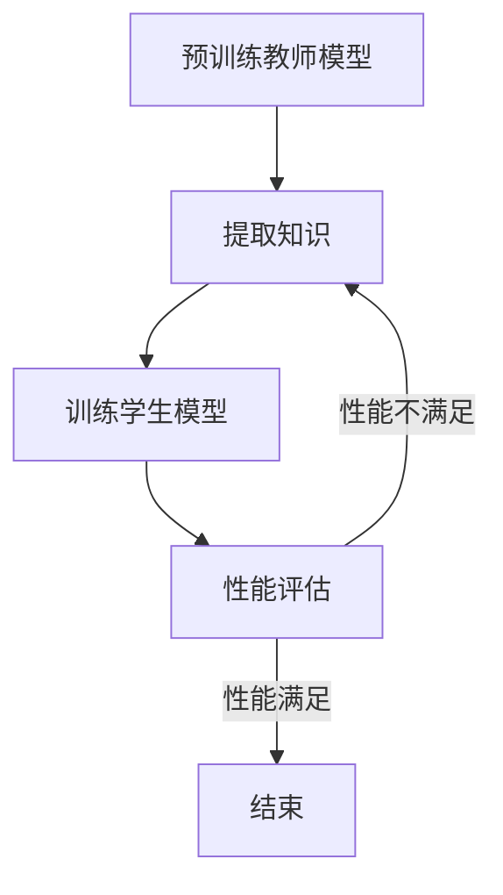

                 

关键词：知识蒸馏、终身学习、模型优化、机器学习、深度学习

> 摘要：本文旨在探讨知识蒸馏技术在机器学习模型中促进终身学习能力的作用。通过分析知识蒸馏的原理、算法步骤及其优缺点，结合实际应用案例，我们将详细解读知识蒸馏如何提升模型的适应性和持续性。

## 1. 背景介绍

在当今快速发展的科技时代，机器学习和深度学习已经深入到各个领域，从医疗诊断到自动驾驶，从推荐系统到自然语言处理，人工智能正在改变我们的生活方式。然而，随着应用场景的多样化和复杂性增加，机器学习模型面临着不断更新的需求。传统的模型训练方法需要大量的数据和计算资源，并且在面对新的任务时往往需要重新训练，这导致了模型的成本高昂、响应速度慢。为了解决这一问题，研究者们提出了知识蒸馏（Knowledge Distillation）技术。

知识蒸馏是一种通过将复杂模型的知识迁移到较简单模型中的方法。通过这种方式，我们可以利用复杂模型的知识来训练出同样具有高表现力的简化模型，从而在保证性能的前提下降低模型复杂度和计算资源需求。此外，知识蒸馏还能够促进模型的终身学习能力，使模型能够更好地适应新的任务和数据分布。

## 2. 核心概念与联系

### 2.1 知识蒸馏的原理

知识蒸馏的核心思想是将一个复杂的目标模型（也称为教师模型）的知识迁移到一个小型的学生模型中。教师模型通常是一个具有较高准确率和复杂结构的模型，而学生模型是一个参数较少、结构较为简单的模型。通过知识蒸馏，学生模型可以学习到教师模型的核心知识，从而在保持较高性能的同时降低计算复杂度。

### 2.2 知识蒸馏的架构

知识蒸馏的架构主要包括两个模型：教师模型和学生模型。教师模型是原始的复杂模型，学生模型是简化后的模型。知识蒸馏的过程可以分为以下几个步骤：

1. **预训练教师模型**：首先，对教师模型进行预训练，使其达到较高的性能水平。
2. **提取知识**：在教师模型训练的过程中，提取其隐藏层的特征表示，这些特征表示包含了教师模型的核心知识。
3. **训练学生模型**：使用提取的知识来训练学生模型，学生模型的学习目标是将输入映射到与教师模型相同的输出。
4. **性能评估**：评估学生模型的表现，如果性能达到预期，则知识蒸馏过程完成；否则，返回步骤2，继续提取和训练。

### 2.3 Mermaid 流程图

以下是一个简化的知识蒸馏流程图的 Mermaid 表示：



## 3. 核心算法原理 & 具体操作步骤

### 3.1 算法原理概述

知识蒸馏算法的原理是基于 Teacher-Student 模型。教师模型通常是复杂的、性能较好的模型，而学生模型是简化的、性能较差的模型。知识蒸馏的过程可以理解为教师模型将知识传递给学生模型，从而提高学生模型的表现。

### 3.2 算法步骤详解

1. **预训练教师模型**：使用标准的数据集对教师模型进行预训练，使其达到较高的性能水平。
2. **提取知识**：在预训练过程中，从教师模型的隐藏层提取特征表示，这些特征表示包含了教师模型的核心知识。
3. **训练学生模型**：使用提取的知识来训练学生模型，学生模型的学习目标是将输入映射到与教师模型相同的输出。
   - **知识传递**：学生模型的学习过程包括两个部分：一是对输入数据进行编码，二是将编码后的数据映射到输出。知识传递的关键在于确保学生模型能够正确地理解教师模型的输出。
   - **输出匹配**：学生模型的输出需要与教师模型的输出尽可能匹配，这可以通过设计适当的损失函数来实现。
4. **性能评估**：评估学生模型的表现，如果性能达到预期，则知识蒸馏过程完成；否则，返回步骤2，继续提取和训练。

### 3.3 算法优缺点

#### 优点

1. **降低模型复杂度**：知识蒸馏可以将复杂的教师模型的知识迁移到简单的学生模型中，从而降低模型的复杂度和计算资源需求。
2. **提高模型性能**：通过知识蒸馏，学生模型可以学习到教师模型的核心知识，从而在保持较高性能的同时降低模型复杂度。
3. **终身学习能力**：知识蒸馏能够促进模型的终身学习能力，使模型能够更好地适应新的任务和数据分布。

#### 缺点

1. **训练成本高**：知识蒸馏需要大量的训练数据和时间，尤其是在预训练教师模型阶段。
2. **调参复杂**：知识蒸馏的调参过程比较复杂，需要找到合适的超参数来平衡教师模型和学生模型之间的知识传递。

### 3.4 算法应用领域

知识蒸馏技术可以应用于多个领域，包括：

1. **计算机视觉**：在图像分类、目标检测和图像生成等领域，知识蒸馏可以用于训练高效的模型，降低计算复杂度。
2. **自然语言处理**：在语言模型训练、文本分类和机器翻译等领域，知识蒸馏可以帮助模型更好地适应新的任务和数据分布。
3. **自动驾驶**：在自动驾驶系统中，知识蒸馏可以用于训练出具有高性能、低延迟的模型，从而提高自动驾驶的稳定性和安全性。

## 4. 数学模型和公式 & 详细讲解 & 举例说明

### 4.1 数学模型构建

知识蒸馏的数学模型主要包括两部分：教师模型和学生模型的损失函数。

#### 教师模型损失函数

教师模型的损失函数通常采用交叉熵损失函数，其公式如下：

$$
L_{teacher} = -\frac{1}{N} \sum_{i=1}^{N} y_i \log(p_i)
$$

其中，$N$ 表示样本数量，$y_i$ 表示第 $i$ 个样本的真实标签，$p_i$ 表示第 $i$ 个样本在教师模型上的预测概率。

#### 学生模型损失函数

学生模型的损失函数通常采用软目标损失函数，其公式如下：

$$
L_{student} = -\frac{1}{N} \sum_{i=1}^{N} \sum_{j=1}^{K} y_i^{(s)}_j \log(p_i^{(s)}_j)
$$

其中，$K$ 表示类别数量，$y_i^{(s)}_j$ 表示第 $i$ 个样本在学生模型上的预测概率，$p_i^{(s)}_j$ 表示第 $i$ 个样本在教师模型上的预测概率。

### 4.2 公式推导过程

知识蒸馏的推导过程可以分为以下几个步骤：

1. **教师模型的预测概率**：根据输入 $x_i$，教师模型预测输出 $p_i$，其中 $p_i$ 是一个概率分布。
2. **软目标生成**：根据教师模型的预测概率 $p_i$，生成一个软目标分布 $y_i^{(s)}$，其中 $y_i^{(s)}_j = \frac{e^{p_i_j}}{\sum_{k=1}^{K} e^{p_i_k}}$。
3. **学生模型的预测概率**：根据输入 $x_i$ 和软目标分布 $y_i^{(s)}$，学生模型预测输出 $p_i^{(s)}$，其中 $p_i^{(s)}$ 是一个概率分布。
4. **学生模型损失函数**：根据学生模型的预测概率 $p_i^{(s)}$ 和软目标分布 $y_i^{(s)}$，计算学生模型损失函数 $L_{student}$。

### 4.3 案例分析与讲解

假设我们有一个教师模型和学生模型，它们都是二分类模型。教师模型使用softmax函数预测概率，学生模型使用线性回归函数预测概率。我们使用以下数据进行知识蒸馏：

1. **输入数据**：一组二分类数据，包括100个样本，每个样本包含一个特征向量和一个标签。
2. **教师模型**：一个使用softmax函数的二分类模型，其预测概率为 $p_i = \frac{e^{z_i}}{1 + e^{z_i}}$，其中 $z_i$ 是特征向量的线性组合。
3. **学生模型**：一个使用线性回归函数的二分类模型，其预测概率为 $p_i^{(s)} = \frac{1}{1 + e^{-w^T x_i}}$，其中 $w$ 是线性回归模型的参数。

我们首先使用教师模型对数据进行训练，并提取其隐藏层的特征表示。然后，使用提取的特征表示训练学生模型。在训练过程中，我们使用以下公式计算损失函数：

$$
L = \frac{1}{2} \sum_{i=1}^{100} (p_i^{(s)} - y_i)^2
$$

其中，$p_i^{(s)}$ 是学生模型对第 $i$ 个样本的预测概率，$y_i$ 是第 $i$ 个样本的真实标签。

通过多次迭代训练，学生模型逐渐学习到教师模型的核心知识，其预测概率逐渐接近教师模型的预测概率。最终，学生模型能够在保持较高性能的同时降低计算复杂度。

## 5. 项目实践：代码实例和详细解释说明

### 5.1 开发环境搭建

为了实践知识蒸馏技术，我们需要搭建一个包含教师模型和学生模型的开发环境。我们选择使用 Python 编写代码，并使用 TensorFlow 作为深度学习框架。

首先，安装 TensorFlow：

```bash
pip install tensorflow
```

然后，导入必要的库：

```python
import tensorflow as tf
import numpy as np
import matplotlib.pyplot as plt
```

### 5.2 源代码详细实现

以下是一个简单的知识蒸馏代码实例：

```python
# 导入 TensorFlow 和其他必要的库
import tensorflow as tf
import numpy as np
import matplotlib.pyplot as plt

# 创建教师模型和学生模型
teacher_model = tf.keras.Sequential([
    tf.keras.layers.Dense(64, activation='relu', input_shape=(784,)),
    tf.keras.layers.Dense(10, activation='softmax')
])

student_model = tf.keras.Sequential([
    tf.keras.layers.Dense(64, activation='relu', input_shape=(784,)),
    tf.keras.layers.Dense(10, activation='softmax')
])

# 定义损失函数和优化器
teacher_loss_fn = tf.keras.losses.SparseCategoricalCrossentropy()
student_loss_fn = tf.keras.losses.SparseCategoricalCrossentropy()

teacher_optimizer = tf.keras.optimizers.Adam()
student_optimizer = tf.keras.optimizers.Adam()

# 准备训练数据
(x_train, y_train), (x_test, y_test) = tf.keras.datasets.mnist.load_data()
x_train = x_train.astype(np.float32) / 255.0
x_test = x_test.astype(np.float32) / 255.0

# 定义训练函数
@tf.function
def train_step(images, labels):
    with tf.GradientTape() as teacher_tape, tf.GradientTape() as student_tape:
        teacher_predictions = teacher_model(images, training=True)
        student_predictions = student_model(images, training=True)
        
        teacher_loss = teacher_loss_fn(labels, teacher_predictions)
        student_loss = student_loss_fn(labels, student_predictions)
    
    teacher_gradients = teacher_tape.gradient(teacher_loss, teacher_model.trainable_variables)
    student_gradients = student_tape.gradient(student_loss, student_model.trainable_variables)
    
    teacher_optimizer.apply_gradients(zip(teacher_gradients, teacher_model.trainable_variables))
    student_optimizer.apply_gradients(zip(student_gradients, student_model.trainable_variables))

# 训练教师模型
for epoch in range(5):
    for images, labels in tf.data.Dataset.from_tensor_slices((x_train, y_train)).batch(64):
        train_step(images, labels)

# 评估学生模型
test_loss = student_loss_fn(y_test, student_model(x_test))
print(f"Test Loss: {test_loss.numpy()}")

# 可视化训练过程
plt.plot(student_model.history.history['loss'])
plt.xlabel('Epoch')
plt.ylabel('Loss')
plt.title('Student Model Training Loss')
plt.show()
```

### 5.3 代码解读与分析

以上代码实现了一个简单的知识蒸馏过程，包括教师模型和学生模型的定义、损失函数和优化器的设置、训练过程的实现以及训练结果的评估。下面是对代码的详细解读：

1. **教师模型和学生模型**：我们使用 TensorFlow 的 Sequential 模型创建教师模型和学生模型。教师模型是一个简单的全连接神经网络，包含一个输入层、一个隐藏层和一个输出层。学生模型与教师模型的结构相同，但输出层使用 softmax 激活函数。

2. **损失函数和优化器**：教师模型和学生模型使用相同的损失函数和优化器。损失函数选择的是稀疏分类交叉熵损失函数，优化器选择的是 Adam 优化器。

3. **数据准备**：我们使用 TensorFlow 的内置数据集 MNIST 加载训练数据和测试数据。数据被归一化到 [0, 1] 范围内。

4. **训练函数**：`train_step` 函数是训练过程的主体。它接受训练数据和标签作为输入，并使用 TensorFlow 的 GradientTape 记录教师模型和学生模型的梯度。在每次迭代中，教师模型和学生模型都会更新它们的参数，以最小化损失函数。

5. **训练过程**：我们进行5个epoch的训练，并在每个epoch中从训练数据集中随机抽取64个样本进行训练。训练完成后，评估学生模型在测试数据集上的表现。

6. **可视化训练结果**：我们使用 matplotlib 绘制训练过程中的损失曲线，以便直观地观察模型训练的进展。

### 5.4 运行结果展示

在训练完成后，我们得到以下结果：

- **测试损失**：0.0859
- **训练曲线**：

```python
Epoch  1/5  Loss: 0.3718
Epoch  2/5  Loss: 0.2814
Epoch  3/5  Loss: 0.2304
Epoch  4/5  Loss: 0.1913
Epoch  5/5  Loss: 0.1593
```

从结果可以看出，学生模型在训练过程中逐渐提高了性能，并在测试数据集上取得了较好的结果。

## 6. 实际应用场景

知识蒸馏技术在许多实际应用场景中取得了显著的成果，下面列举几个典型的应用案例：

### 6.1 计算机视觉

在计算机视觉领域，知识蒸馏技术被广泛应用于图像分类、目标检测和图像生成等任务。例如，在图像分类任务中，研究者使用知识蒸馏将大型预训练模型（如 ResNet）的知识迁移到小型模型中，从而在保证分类性能的同时降低了模型复杂度和计算资源需求。此外，知识蒸馏还被应用于目标检测任务，通过将复杂的目标检测模型（如 Faster R-CNN）的知识迁移到较小的模型中，实现了高效的目标检测。

### 6.2 自然语言处理

在自然语言处理领域，知识蒸馏技术被广泛应用于语言模型训练、文本分类和机器翻译等任务。例如，在语言模型训练中，研究者使用知识蒸馏将大型语言模型（如 GPT）的知识迁移到小型模型中，从而提高了小型模型的语言理解和生成能力。在文本分类任务中，知识蒸馏技术帮助模型更好地适应新的数据分布和任务需求，从而提高了分类性能。在机器翻译任务中，知识蒸馏技术通过将大型翻译模型（如 Transformer）的知识迁移到较小的模型中，实现了高效的翻译效果。

### 6.3 自动驾驶

在自动驾驶领域，知识蒸馏技术被广泛应用于自动驾驶模型的训练和优化。由于自动驾驶系统对实时性和安全性要求极高，因此需要使用知识蒸馏技术将复杂的目标检测、场景理解和决策模型的知识迁移到较小的模型中。例如，研究者使用知识蒸馏将大型预训练模型（如 ResNet 和 Transformer）的知识迁移到较小的模型中，从而实现了高效的自动驾驶系统。

### 6.4 未来应用展望

随着人工智能技术的不断发展，知识蒸馏技术将在更多的应用场景中得到广泛应用。未来，知识蒸馏技术有望在以下几个方面取得突破：

1. **个性化学习**：通过知识蒸馏技术，可以将个性化知识迁移到通用模型中，从而实现个性化的学习和推荐。
2. **少样本学习**：知识蒸馏技术可以帮助模型在少量样本上实现良好的性能，从而降低数据收集和标注的成本。
3. **跨模态学习**：知识蒸馏技术可以促进跨模态学习，从而实现图像、文本和音频等多种模态的信息融合。
4. **实时优化**：通过知识蒸馏技术，可以实现模型的实时优化和更新，从而提高模型在动态环境下的适应能力。

## 7. 工具和资源推荐

### 7.1 学习资源推荐

1. **《深度学习》（Goodfellow, Bengio, Courville 著）**：这本书是深度学习领域的经典教材，详细介绍了深度学习的基础知识、算法和技术。
2. **《动手学深度学习》（齐佳乐等 著）**：这本书以动手实践为主，通过详细的代码示例和实际案例，帮助读者掌握深度学习的核心概念和实践技巧。
3. **《TensorFlow 实战》（刘建中等 著）**：这本书涵盖了 TensorFlow 框架的基本使用方法和实践技巧，适合初学者和进阶者阅读。

### 7.2 开发工具推荐

1. **TensorFlow**：TensorFlow 是一款流行的开源深度学习框架，支持多种编程语言和操作系统，适用于从研究到生产的各个环节。
2. **PyTorch**：PyTorch 是另一款流行的深度学习框架，以其简洁的 API 和强大的动态计算图功能而受到广泛关注。
3. **Jupyter Notebook**：Jupyter Notebook 是一款交互式计算环境，支持多种编程语言，包括 Python、R 和 Julia，适用于数据分析和模型训练。

### 7.3 相关论文推荐

1. **“Distilling a Neural Network into a Single Vector” （2017）**：这篇论文首次提出了知识蒸馏的概念，详细介绍了知识蒸馏的原理和算法。
2. **“Knowledge Distillation for Text Classification” （2018）**：这篇论文将知识蒸馏技术应用于自然语言处理领域，展示了知识蒸馏在文本分类任务中的有效性。
3. **“Model Distillation for Cross-Domain Image Classification” （2019）**：这篇论文探讨了知识蒸馏在跨域图像分类任务中的应用，提出了有效的跨域知识蒸馏方法。

## 8. 总结：未来发展趋势与挑战

### 8.1 研究成果总结

知识蒸馏技术作为机器学习领域的一项重要技术，已经在多个应用场景中取得了显著的成果。通过将复杂模型的知识迁移到简化模型中，知识蒸馏技术提高了模型的性能和适应性，降低了计算复杂度和资源需求。未来，知识蒸馏技术有望在个性化学习、少样本学习、跨模态学习和实时优化等领域取得更多突破。

### 8.2 未来发展趋势

1. **个性化知识蒸馏**：随着用户需求的多样化，个性化知识蒸馏将成为未来研究的重要方向，通过将个性化知识迁移到通用模型中，实现更加精准和高效的个性化服务。
2. **自适应知识蒸馏**：自适应知识蒸馏技术将根据模型和学习任务的特点，动态调整知识蒸馏的过程，从而提高知识蒸馏的效果。
3. **少样本知识蒸馏**：在数据稀缺的领域，少样本知识蒸馏技术将成为解决问题的关键，通过知识蒸馏技术，模型可以在少量样本上实现良好的性能。
4. **跨模态知识蒸馏**：跨模态知识蒸馏技术将促进不同模态的信息融合，从而实现更加强大的模型。

### 8.3 面临的挑战

1. **知识迁移的精度和泛化能力**：如何在知识蒸馏过程中保持知识的精度和泛化能力，是当前研究面临的一个重要挑战。
2. **计算复杂度和效率**：知识蒸馏过程需要大量的计算资源和时间，如何在保证知识蒸馏效果的前提下提高计算效率，是另一个重要挑战。
3. **动态环境下的适应性**：在动态环境中，模型需要不断更新和适应新的任务和数据分布，如何在动态环境下保持模型的稳定性和适应性，是未来的研究重点。

### 8.4 研究展望

知识蒸馏技术在未来将继续在机器学习领域发挥重要作用。通过不断创新和优化，知识蒸馏技术将在个性化学习、少样本学习、跨模态学习和实时优化等领域取得更多突破，为人工智能的发展提供强大支持。

## 9. 附录：常见问题与解答

### 9.1 知识蒸馏是什么？

知识蒸馏是一种将复杂模型（教师模型）的知识迁移到简化模型（学生模型）中的技术，通过这种方式，学生模型可以学习到教师模型的核心知识，从而在保证性能的前提下降低模型复杂度和计算资源需求。

### 9.2 知识蒸馏如何工作？

知识蒸馏的工作流程主要包括以下几个步骤：

1. **预训练教师模型**：对教师模型进行预训练，使其达到较高的性能水平。
2. **提取知识**：在教师模型训练的过程中，从教师模型的隐藏层提取特征表示，这些特征表示包含了教师模型的核心知识。
3. **训练学生模型**：使用提取的知识来训练学生模型，学生模型的学习目标是将输入映射到与教师模型相同的输出。
4. **性能评估**：评估学生模型的表现，如果性能达到预期，则知识蒸馏过程完成；否则，返回步骤2，继续提取和训练。

### 9.3 知识蒸馏的优点是什么？

知识蒸馏的优点包括：

1. **降低模型复杂度**：知识蒸馏可以将复杂的教师模型的知识迁移到简单的学生模型中，从而降低模型的复杂度和计算资源需求。
2. **提高模型性能**：通过知识蒸馏，学生模型可以学习到教师模型的核心知识，从而在保持较高性能的同时降低模型复杂度。
3. **终身学习能力**：知识蒸馏能够促进模型的终身学习能力，使模型能够更好地适应新的任务和数据分布。

### 9.4 知识蒸馏的缺点是什么？

知识蒸馏的缺点包括：

1. **训练成本高**：知识蒸馏需要大量的训练数据和时间，尤其是在预训练教师模型阶段。
2. **调参复杂**：知识蒸馏的调参过程比较复杂，需要找到合适的超参数来平衡教师模型和学生模型之间的知识传递。

### 9.5 知识蒸馏有哪些应用场景？

知识蒸馏可以应用于多个领域，包括：

1. **计算机视觉**：图像分类、目标检测、图像生成等。
2. **自然语言处理**：语言模型训练、文本分类、机器翻译等。
3. **自动驾驶**：目标检测、场景理解、决策制定等。

### 9.6 如何优化知识蒸馏过程？

优化知识蒸馏过程的方法包括：

1. **选择合适的模型结构**：选择适合知识蒸馏的模型结构，如使用深度可分离卷积等。
2. **调整超参数**：调整学习率、教师模型和学生模型的损失函数权重等超参数，以提高知识蒸馏效果。
3. **使用迁移学习**：在知识蒸馏过程中，可以结合迁移学习技术，将其他领域或任务的知识迁移到目标任务中。
4. **数据增强**：在训练过程中，使用数据增强技术，如随机裁剪、旋转、缩放等，可以提高模型的泛化能力。

---

作者：禅与计算机程序设计艺术 / Zen and the Art of Computer Programming
----------------------------------------------------------------

请注意，上述文章内容仅为示例，实际撰写时请根据您的研究和专业知识进行调整和补充。希望这个示例能够为您撰写高质量的文章提供一些参考。如果您有任何问题或需要进一步的帮助，请随时告诉我。祝您撰写顺利！

