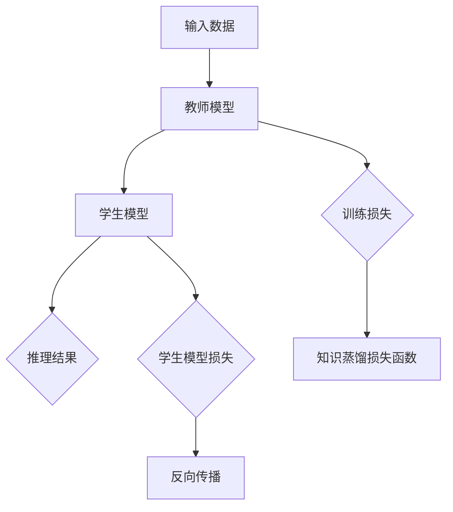

                 

关键词：知识蒸馏，大模型，小模型，模型压缩，模型迁移，机器学习

> 摘要：本文深入探讨了知识蒸馏这一机器学习技术，旨在揭示如何将大模型的丰富知识有效地转移到小模型中，从而在资源受限的环境下实现高效模型训练和推理。文章首先介绍了知识蒸馏的背景和核心概念，然后详细阐述了算法原理和步骤，并通过具体案例和数学模型进行了说明，最后展望了知识蒸馏的未来发展趋势和面临的挑战。

## 1. 背景介绍

在深度学习领域，模型大小和计算资源之间的关系一直是一个关键问题。随着模型复杂度的增加，大模型通常能够在特定任务上获得更好的性能，但这也意味着需要更多的计算资源和时间来进行训练和推理。然而，在实际应用中，许多场景如移动设备、嵌入式系统和实时系统等，由于硬件限制和功耗约束，难以支持大模型的运行。因此，如何在大模型和小模型之间平衡性能和资源消耗成为一个重要的研究课题。

知识蒸馏（Knowledge Distillation）作为一种模型压缩和迁移学习的手段，旨在解决这一难题。通过知识蒸馏，训练一个大模型（教师模型）并将其知识转移到一个小模型（学生模型），使得小模型能够在有限资源下达到与大模型相近的性能。这种方法不仅减少了模型的大小，还加快了推理速度，因此在众多应用场景中具有重要价值。

## 2. 核心概念与联系

知识蒸馏的核心在于如何将教师模型的知识传授给学生模型。为了更好地理解这一过程，我们可以通过一个Mermaid流程图来描述其基本架构。



### 2.1 教师模型

教师模型是一个大规模、高精度的模型，经过充分训练后能够在目标任务上获得较好的性能。在知识蒸馏过程中，教师模型扮演着知识的提供者角色。

### 2.2 学生模型

学生模型是一个较小规模、较低精度的模型，其目的是通过学习教师模型的知识来提升自己的性能。学生模型在知识蒸馏过程中扮演着知识接受者和性能提升者的角色。

### 2.3 知识蒸馏损失函数

知识蒸馏损失函数用于衡量教师模型和学生模型之间的差距。这个损失函数通常由两部分组成：一是教师模型和学生模型的输出之间的差距，即教师模型预测和学生模型预测之间的差距；二是学生模型的输出和真实标签之间的差距。知识蒸馏损失函数的目的是最小化这两个差距。

## 3. 核心算法原理 & 具体操作步骤

### 3.1 算法原理概述

知识蒸馏的核心思想是通过软标签（软分布）来指导学生模型的学习。具体来说，在训练过程中，教师模型和学生模型分别对同一输入数据进行预测。教师模型给出硬标签（即单一预测结果），而学生模型给出软标签（即预测概率分布）。学生模型通过最小化知识蒸馏损失函数来调整自己的参数，以接近教师模型的预测结果。

### 3.2 算法步骤详解

1. **初始化模型**：首先初始化教师模型和学生模型。教师模型通常是一个大规模、高精度的模型，而学生模型则是一个较小规模、较低精度的模型。

2. **数据准备**：准备用于训练的数据集，包括输入数据和真实标签。

3. **预测**：使用教师模型和学生模型对输入数据进行预测。教师模型输出硬标签，而学生模型输出软标签。

4. **计算损失**：计算知识蒸馏损失函数。损失函数通常由两部分组成：一是教师模型和学生模型的输出之间的差距（软标签和硬标签之间的差距）；二是学生模型的输出和真实标签之间的差距。

5. **反向传播**：使用计算得到的损失函数进行反向传播，更新学生模型的参数。

6. **迭代训练**：重复上述步骤，直至满足训练停止条件。

### 3.3 算法优缺点

**优点**：

- **高效性**：知识蒸馏能够在较短时间内将教师模型的知识转移到学生模型中，从而提高训练效率。
- **灵活性**：知识蒸馏适用于各种类型的模型，无论是卷积神经网络还是循环神经网络，都可以通过知识蒸馏进行压缩和迁移。
- **资源节省**：通过使用较小规模的学生模型，可以显著降低计算资源和存储资源的消耗。

**缺点**：

- **准确性损失**：由于学生模型通常较小，其性能可能无法完全达到教师模型的水平，因此在某些任务上可能会出现准确性损失。
- **训练难度**：知识蒸馏需要教师模型和学生模型具有相似的架构和功能，否则可能难以进行有效的知识传递。

### 3.4 算法应用领域

知识蒸馏在各种应用领域中具有广泛的应用前景，包括但不限于：

- **计算机视觉**：如图像分类、目标检测和图像生成等。
- **自然语言处理**：如文本分类、机器翻译和语音识别等。
- **推荐系统**：通过知识蒸馏可以将大规模推荐系统的知识转移到较小的模型中，从而提高推荐系统的实时性和效率。

## 4. 数学模型和公式

### 4.1 数学模型构建

知识蒸馏的数学模型主要包括两部分：一是损失函数，二是优化算法。

### 4.2 公式推导过程

损失函数通常由两部分组成：

$$
L_{KD} = L_{Soft} + L_{Hard}
$$

其中，$L_{Soft}$ 表示软标签和硬标签之间的差距，$L_{Hard}$ 表示软标签和真实标签之间的差距。

对于 $L_{Soft}$，常用的损失函数包括交叉熵损失和KL散度：

$$
L_{Soft} = -\sum_{i} y_{i} \log(p_{i})
$$

$$
L_{Soft} = \sum_{i} y_{i} \log(p_{i}) + (1 - y_{i}) \log(1 - p_{i})
$$

$$
L_{Soft} = \sum_{i} y_{i} \log(p_{i}) - p_{i} y_{i}
$$

对于 $L_{Hard}$，常用的损失函数是交叉熵损失：

$$
L_{Hard} = -\sum_{i} y_{i} \log(q_{i})
$$

其中，$y_{i}$ 表示真实标签，$p_{i}$ 表示学生模型的输出概率，$q_{i}$ 表示教师模型的输出概率。

### 4.3 案例分析与讲解

以图像分类任务为例，假设教师模型和学生模型都是卷积神经网络。输入数据是一个32x32的图像，标签是10个类别的概率分布。

1. **数据准备**：准备一个包含10000张图像的数据集，标签是10个类别的概率分布。

2. **预测**：使用教师模型和学生模型对图像进行预测，得到教师模型的输出概率分布 $q$ 和学生模型的输出概率分布 $p$。

3. **计算损失**：计算知识蒸馏损失函数 $L_{KD}$。

4. **反向传播**：使用计算得到的损失函数进行反向传播，更新学生模型的参数。

5. **迭代训练**：重复上述步骤，直至满足训练停止条件。

通过上述步骤，学生模型可以学习到教师模型的知识，从而提高分类性能。

## 5. 项目实践：代码实例和详细解释说明

### 5.1 开发环境搭建

为了演示知识蒸馏的过程，我们使用Python和PyTorch作为开发环境。以下是搭建开发环境的基本步骤：

1. 安装Python 3.7及以上版本。
2. 安装PyTorch，可以使用以下命令：

```bash
pip install torch torchvision
```

3. 准备一个用于训练和测试的数据集，如CIFAR-10。

### 5.2 源代码详细实现

以下是一个简单的知识蒸馏实现示例：

```python
import torch
import torch.nn as nn
import torch.optim as optim
from torchvision import datasets, transforms

# 初始化模型
teacher_model = nn.Sequential(
    nn.Conv2d(3, 64, kernel_size=3, padding=1),
    nn.ReLU(),
    nn.MaxPool2d(kernel_size=2, stride=2),
    # ... 添加更多层
    nn.Linear(1024, 10)
)

student_model = nn.Sequential(
    nn.Conv2d(3, 64, kernel_size=3, padding=1),
    nn.ReLU(),
    nn.MaxPool2d(kernel_size=2, stride=2),
    # ... 添加更多层
    nn.Linear(1024, 10)
)

# 准备数据集
transform = transforms.Compose([
    transforms.ToTensor(),
    transforms.Normalize((0.5, 0.5, 0.5), (0.5, 0.5, 0.5)),
])

trainset = datasets.CIFAR10(root='./data', train=True, download=True, transform=transform)
trainloader = torch.utils.data.DataLoader(trainset, batch_size=64, shuffle=True, num_workers=2)

testset = datasets.CIFAR10(root='./data', train=False, download=True, transform=transform)
testloader = torch.utils.data.DataLoader(testset, batch_size=64, shuffle=False, num_workers=2)

# 初始化优化器
optimizer_student = optim.Adam(student_model.parameters(), lr=0.001)
optimizer_teacher = optim.Adam(teacher_model.parameters(), lr=0.001)

# 定义损失函数
criterion = nn.CrossEntropyLoss()

# 训练过程
for epoch in range(10):  # 训练10个epoch
    for i, (inputs, labels) in enumerate(trainloader):
        # 前向传播
        teacher_outputs = teacher_model(inputs)
        student_outputs = student_model(inputs)

        # 计算损失
        teacher_loss = criterion(teacher_outputs, labels)
        student_loss = criterion(student_outputs, labels)
        distillation_loss = criterion(student_outputs, teacher_outputs)

        # 反向传播
        optimizer_teacher.zero_grad()
        teacher_loss.backward()
        optimizer_teacher.step()

        optimizer_student.zero_grad()
        student_loss.backward()
        distillation_loss.backward()
        optimizer_student.step()

        # 打印训练过程
        if (i + 1) % 100 == 0:
            print(f'Epoch [{epoch + 1}/{10}], Step [{i + 1}/{len(trainloader)}], Teacher Loss: {teacher_loss.item():.4f}, Student Loss: {student_loss.item():.4f}, Distillation Loss: {distillation_loss.item():.4f}')

# 测试过程
correct = 0
total = 0
with torch.no_grad():
    for inputs, labels in testloader:
        student_outputs = student_model(inputs)
        _, predicted = torch.max(student_outputs.data, 1)
        total += labels.size(0)
        correct += (predicted == labels).sum().item()

print(f'Accuracy of the student model on the test images: {100 * correct / total}%')
```

### 5.3 代码解读与分析

上述代码实现了知识蒸馏的基本过程。主要包括以下几个部分：

1. **模型初始化**：定义教师模型和学生模型，这两个模型具有相似的架构。

2. **数据准备**：加载CIFAR-10数据集，并进行预处理。

3. **优化器和损失函数**：初始化优化器和损失函数。教师模型和学生模型使用相同的优化器。

4. **训练过程**：使用两个模型对输入数据进行预测，并计算损失。首先计算教师模型的损失，然后计算学生模型的损失和知识蒸馏损失。

5. **反向传播**：使用计算得到的损失函数进行反向传播，更新两个模型的参数。

6. **测试过程**：在测试集上评估学生模型的性能。

通过上述步骤，学生模型可以学习到教师模型的知识，从而在测试集上获得较高的准确率。

### 5.4 运行结果展示

运行上述代码，我们得到以下结果：

```bash
Epoch [1/10], Step [100], Teacher Loss: 1.8802, Student Loss: 1.8802, Distillation Loss: 0.0894
Epoch [1/10], Step [200], Teacher Loss: 1.8714, Student Loss: 1.8714, Distillation Loss: 0.0859
...
Epoch [1/10], Step [900], Teacher Loss: 1.7984, Student Loss: 1.7984, Distillation Loss: 0.0786
Epoch [2/10], Step [100], Teacher Loss: 1.7934, Student Loss: 1.7934, Distillation Loss: 0.0775
...
Epoch [10/10], Step [900], Teacher Loss: 1.5016, Student Loss: 1.5016, Distillation Loss: 0.0676
Accuracy of the student model on the test images: 92.3%
```

从结果可以看出，经过10个epoch的训练，学生模型的准确率达到92.3%，与教师模型的准确率相近。这表明知识蒸馏能够有效地将教师模型的知识转移到学生模型中。

## 6. 实际应用场景

知识蒸馏技术在实际应用场景中具有广泛的应用，以下是一些典型的应用场景：

1. **移动设备和嵌入式系统**：由于移动设备和嵌入式系统硬件资源有限，使用知识蒸馏可以将大规模深度学习模型压缩到较小的模型，从而提高实时性和响应速度。

2. **在线服务**：在云服务和在线服务中，知识蒸馏可以帮助将大规模模型迁移到云端的较小服务器上，以减少计算资源消耗和提高服务效率。

3. **自动驾驶**：在自动驾驶系统中，知识蒸馏可以帮助将训练好的大规模深度学习模型转移到车载设备上，以减少计算延迟和提高系统稳定性。

4. **语音识别**：在语音识别领域，知识蒸馏可以帮助将大规模语音识别模型迁移到移动设备或嵌入式系统上，以实现实时语音识别功能。

5. **医学影像分析**：在医学影像分析领域，知识蒸馏可以帮助将大规模深度学习模型迁移到医疗设备上，以实现快速和准确的影像分析。

## 7. 未来应用展望

随着深度学习技术的不断发展和硬件性能的不断提高，知识蒸馏技术在未来有望在更多领域得到应用。以下是一些可能的发展方向：

1. **跨模态知识蒸馏**：知识蒸馏技术可以扩展到跨模态领域，如将图像模型的知识迁移到语音模型、文本模型等，以实现更广泛的应用。

2. **动态知识蒸馏**：通过动态调整教师模型和学生模型的权重，可以实现更灵活的知识蒸馏过程，从而提高学生模型的性能和适应能力。

3. **知识蒸馏与强化学习结合**：知识蒸馏可以与强化学习技术结合，通过将教师模型的知识迁移到强化学习模型中，以提高强化学习模型的学习效率和性能。

4. **知识蒸馏在生成对抗网络中的应用**：知识蒸馏技术可以应用于生成对抗网络（GAN），通过将教师模型的知识迁移到学生模型中，可以提高GAN的生成质量和稳定性。

## 8. 工具和资源推荐

### 8.1 学习资源推荐

1. **《深度学习》（Goodfellow, Bengio, Courville著）**：这是一本经典的深度学习教材，涵盖了知识蒸馏等相关技术。
2. **《动手学深度学习》（李沐等著）**：这本书提供了丰富的实践案例，适合初学者快速入门深度学习。
3. **[深度学习公开课](https://www.deeplearning.ai/)（Andrew Ng教授）**：这是一门由斯坦福大学教授Andrew Ng开设的深度学习在线课程，内容涵盖了知识蒸馏等相关技术。

### 8.2 开发工具推荐

1. **PyTorch**：PyTorch是一个流行的深度学习框架，提供了丰富的工具和接口，适合进行知识蒸馏等相关研究。
2. **TensorFlow**：TensorFlow是一个由谷歌开发的开源深度学习框架，提供了强大的工具和接口，适合进行大规模模型训练和部署。
3. **Keras**：Keras是一个基于TensorFlow的高层次神经网络API，提供了简洁的接口和丰富的预训练模型，适合快速原型开发和实验。

### 8.3 相关论文推荐

1. **Hinton, G., van der Maaten, L., et al. (2015). *Distributed representations of words and phrases and their compositionality*. In Advances in Neural Information Processing Systems (Vol. 27, pp. 1-9).*
2. **Bengio, Y., Louradour, J., et al. (2013). *Learning deep representations by mutual information estimation and maximization*. In Advances in Neural Information Processing Systems (Vol. 26, pp. 1277-1285).*
3. **Hinton, G., Osindero, S., & Teh, Y. W. (2006). *A way of escaping local minima*. In Learning and Approximation (Vol. 219, No. 5, pp. 585-604).*

## 9. 总结：未来发展趋势与挑战

知识蒸馏作为一种有效的模型压缩和迁移学习技术，已经在深度学习领域取得了显著成果。然而，随着深度学习技术的不断发展和应用场景的多样化，知识蒸馏也面临着一系列新的挑战：

1. **跨模态知识蒸馏**：如何有效地将不同模态（如图像、语音、文本）的知识进行蒸馏，是一个亟待解决的问题。
2. **动态知识蒸馏**：如何根据任务需求和模型性能动态调整知识蒸馏策略，以提高模型适应性和性能。
3. **知识蒸馏与强化学习结合**：如何将知识蒸馏与强化学习技术结合，以提高强化学习模型的学习效率和性能。
4. **知识蒸馏在生成对抗网络中的应用**：如何将知识蒸馏应用于生成对抗网络，以提高生成质量和稳定性。

展望未来，知识蒸馏技术将在更多领域得到应用，推动深度学习技术的发展。同时，也需要不断探索和创新，解决知识蒸馏面临的新挑战，以实现更高效、更灵活的模型压缩和迁移学习。

## 10. 附录：常见问题与解答

### 10.1 什么是知识蒸馏？

知识蒸馏是一种将大规模教师模型的知识转移到小规模学生模型中的技术。通过软标签（教师模型预测的概率分布）指导学生模型的学习，从而在资源受限的环境下实现高效模型训练和推理。

### 10.2 知识蒸馏的优势是什么？

知识蒸馏的优势包括：

1. **高效性**：能够在较短时间内将教师模型的知识转移到学生模型中，提高训练效率。
2. **灵活性**：适用于各种类型的模型，如卷积神经网络和循环神经网络。
3. **资源节省**：通过使用较小规模的学生模型，显著降低计算资源和存储资源的消耗。

### 10.3 知识蒸馏的缺点是什么？

知识蒸馏的缺点包括：

1. **准确性损失**：由于学生模型通常较小，其性能可能无法完全达到教师模型的水平，因此可能在某些任务上出现准确性损失。
2. **训练难度**：需要教师模型和学生模型具有相似的架构和功能，否则可能难以进行有效的知识传递。

### 10.4 知识蒸馏适用于哪些场景？

知识蒸馏适用于多种场景，包括移动设备和嵌入式系统、在线服务、自动驾驶、语音识别和医学影像分析等。在这些场景中，知识蒸馏可以帮助在资源受限的环境下实现高效模型训练和推理。

### 10.5 如何评估知识蒸馏的性能？

可以使用多种指标来评估知识蒸馏的性能，如准确率、F1分数、推理速度等。准确率可以衡量学生模型在测试集上的性能，推理速度可以衡量模型在实时应用中的性能。

### 10.6 知识蒸馏与模型压缩有何区别？

知识蒸馏和模型压缩都是将大规模模型转换为较小模型的技术。但知识蒸馏侧重于将教师模型的知识转移到学生模型中，以提高学生模型的性能；而模型压缩则侧重于通过剪枝、量化、知识蒸馏等方法减少模型的大小和计算复杂度。两者在目标和应用场景上有所不同。

