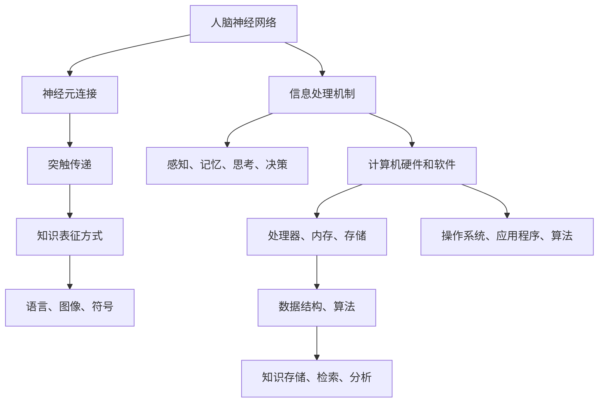

                 

关键词：知识表征、人脑、计算机、神经网络、认知建模、人工智能、信息处理、认知科学

> 摘要：本文将深入探讨人脑与计算机在知识表征方面的异同。通过分析人脑的神经网络结构、信息处理机制以及知识表征方式，我们将探讨计算机在模拟人脑知识表征方面的进展和挑战。同时，本文还将介绍当前在认知建模和人工智能领域的前沿研究，以及未来可能的发展趋势。

## 1. 背景介绍

知识表征是人工智能领域的一个核心问题，它涉及到如何将人类的知识、经验和推理能力转化为计算机可以处理和理解的形式。人脑作为最复杂的自然信息处理系统，其知识表征方式对计算机科学和人工智能的发展具有重要启示。尽管计算机与人脑在知识表征上有许多不同之处，但两者之间的关联和异同为我们提供了理解和模拟人类认知过程的新视角。

首先，人脑的知识表征是一个高度复杂的动态过程。人脑通过神经网络结构进行信息处理，通过神经元之间的连接和激活实现知识存储和传递。而计算机在知识表征方面则依赖于软件算法和硬件架构。尽管计算机无法完全模拟人脑的复杂性，但通过神经网络和机器学习技术的发展，计算机在模拟人脑知识表征方面取得了显著进展。

其次，人脑的知识表征具有高度的灵活性和适应性。人类可以基于经验进行抽象思维和创造性思考，这种能力依赖于大脑的神经可塑性。相比之下，计算机在知识表征方面主要依赖于预先定义的算法和模型，其适应性和灵活性相对较低。尽管如此，计算机科学家和人工智能研究者一直在探索如何通过改进算法和模型，提高计算机在知识表征方面的能力。

本文将从以下几个方面展开讨论：首先，我们将介绍人脑的神经网络结构和信息处理机制；其次，分析计算机在知识表征方面的方法和挑战；然后，探讨认知建模和人工智能领域的前沿研究；最后，总结本文的主要观点，并展望未来在知识表征领域的研究趋势。

## 2. 核心概念与联系

### 2.1 神经元与神经网络

人脑中的基本信息处理单元是神经元。神经元通过树突接收来自其他神经元的信号，经过细胞体处理后，通过轴突传递信号到其他神经元。这种神经元之间的连接和信号传递构成了神经网络。

在计算机科学中，神经网络是一种模拟人脑神经元结构和信息处理机制的计算模型。神经网络由大量的神经元组成，这些神经元通过权重连接形成网络结构。神经网络通过学习输入和输出数据之间的映射关系，实现数据分类、回归、生成等任务。

### 2.2 信息处理机制

人脑的信息处理机制是一个复杂的过程，涉及感知、记忆、思考、决策等多个方面。神经元之间的连接和激活通过突触传递信号，使得人脑能够对信息进行加工和处理。

计算机在信息处理方面主要依赖于硬件和软件。硬件方面，计算机通过处理器、内存、存储等硬件组件进行信息处理。软件方面，计算机通过操作系统、应用程序和算法实现对数据的存储、检索、分析和处理。

### 2.3 知识表征方式

人脑的知识表征方式具有高度的灵活性和抽象性。人类可以通过语言、图像、符号等多种形式进行知识表达和传递。人脑的知识表征不仅包括事实性知识，还涉及概念、原理、方法等抽象知识。

计算机在知识表征方面主要依赖于数据结构和算法。计算机通过数据结构（如数组、链表、树、图等）存储和组织知识，通过算法（如搜索、排序、优化等）实现对知识的处理和分析。

### 2.4 Mermaid 流程图

以下是一个简单的 Mermaid 流程图，展示人脑与计算机在知识表征方面的关联和异同：



通过上述流程图，我们可以看出人脑与计算机在知识表征方面的关联和异同。人脑通过神经元连接和突触传递实现信息处理和知识表征，而计算机则通过硬件和软件组件以及数据结构和算法实现知识存储和处理。

## 3. 核心算法原理 & 具体操作步骤

### 3.1 算法原理概述

在计算机科学中，知识表征的核心算法主要包括神经网络、机器学习、自然语言处理等。这些算法通过不同的方法模拟人脑的知识表征机制，实现对数据的处理和分析。

神经网络是一种模拟人脑神经元结构的计算模型。它由大量的神经元组成，通过权重连接形成网络结构。神经网络通过学习输入和输出数据之间的映射关系，实现数据分类、回归、生成等任务。

机器学习是一种基于数据驱动的方法，通过训练数据集来构建模型，实现对未知数据的预测和分类。机器学习算法包括监督学习、无监督学习和半监督学习等。其中，监督学习算法通过标记数据训练模型，无监督学习算法通过未标记数据发现数据分布和模式，半监督学习算法结合标记数据和未标记数据进行训练。

自然语言处理是一种专门处理自然语言文本数据的算法。它涉及文本分类、情感分析、实体识别、机器翻译等多个任务。自然语言处理算法通过分析文本的语法、语义和语境，实现对文本的理解和生成。

### 3.2 算法步骤详解

#### 3.2.1 神经网络算法

1. 数据预处理：对输入数据进行归一化、标准化等处理，使其满足神经网络训练的需要。

2. 初始化网络参数：包括神经元的权重、偏置等。常用的初始化方法有随机初始化、高斯初始化等。

3. 前向传播：根据输入数据计算输出结果。具体步骤如下：
   - 计算每个神经元的输入值，通过激活函数计算输出值；
   - 将输出值传递给下一层神经元，重复以上步骤，直到得到最终输出。

4. 反向传播：根据输出结果和目标值计算损失函数，并更新网络参数。具体步骤如下：
   - 计算每个神经元的误差；
   - 根据误差梯度计算网络参数的更新方向和大小；
   - 使用优化算法（如梯度下降、Adam等）更新网络参数。

5. 模型评估：使用验证集或测试集评估模型性能，如准确率、召回率、F1值等。

#### 3.2.2 机器学习算法

1. 数据收集：收集用于训练的数据集，包括输入特征和目标标签。

2. 数据预处理：对数据进行清洗、归一化、标准化等处理。

3. 模型选择：根据任务类型选择合适的机器学习算法，如线性回归、支持向量机、决策树、随机森林等。

4. 训练模型：使用训练数据进行模型训练，通过迭代优化模型参数。

5. 模型评估：使用验证集或测试集评估模型性能，如准确率、召回率、F1值等。

6. 模型部署：将训练好的模型部署到实际应用中，如进行数据分类、预测等。

#### 3.2.3 自然语言处理算法

1. 数据预处理：对文本数据进行分词、去停用词、词干提取等处理。

2. 词向量表示：将文本数据转换为词向量表示，如Word2Vec、GloVe等。

3. 模型选择：根据任务类型选择合适的自然语言处理算法，如文本分类、情感分析、实体识别、机器翻译等。

4. 训练模型：使用训练数据进行模型训练，通过迭代优化模型参数。

5. 模型评估：使用验证集或测试集评估模型性能，如准确率、召回率、F1值等。

6. 模型部署：将训练好的模型部署到实际应用中，如进行文本分类、情感分析等。

### 3.3 算法优缺点

#### 3.3.1 神经网络算法

优点：
- 强大的泛化能力：神经网络可以通过学习大量数据，实现对未知数据的预测和分类。
- 自适应：神经网络可以通过反向传播算法不断调整参数，提高模型性能。

缺点：
- 计算资源消耗大：神经网络训练需要大量的计算资源和时间。
- 难以解释：神经网络模型内部参数和结构复杂，难以理解其工作原理。

#### 3.3.2 机器学习算法

优点：
- 易于解释：机器学习算法（如线性回归、决策树等）可以通过模型结构直观地理解其工作原理。
- 部署简单：训练好的模型可以直接部署到实际应用中，无需复杂的预处理和后处理。

缺点：
- 泛化能力较弱：机器学习算法（如线性回归、决策树等）在处理非线性问题时效果较差。
- 需要大量训练数据：机器学习算法通常需要大量标记数据进行训练，数据获取和标注成本较高。

#### 3.3.3 自然语言处理算法

优点：
- 强大的文本处理能力：自然语言处理算法可以处理多种文本任务，如分类、情感分析、实体识别等。
- 高效性：自然语言处理算法通常可以处理大规模文本数据，具有高效的计算性能。

缺点：
- 数据依赖性：自然语言处理算法需要大量高质量的数据进行训练，数据质量直接影响模型性能。
- 解释性较差：自然语言处理算法（如神经网络）内部结构复杂，难以直观地解释其工作原理。

### 3.4 算法应用领域

神经网络算法广泛应用于计算机视觉、自然语言处理、语音识别等领域，如图像分类、目标检测、机器翻译、语音识别等。

机器学习算法在金融、医疗、电商等领域有广泛应用，如风险控制、疾病诊断、推荐系统等。

自然语言处理算法在文本分类、情感分析、机器翻译、问答系统等领域有广泛应用，如舆情分析、智能客服、翻译服务等。

## 4. 数学模型和公式 & 详细讲解 & 举例说明

### 4.1 数学模型构建

在知识表征领域，常用的数学模型包括神经网络模型、机器学习模型和自然语言处理模型。以下分别介绍这些模型的构建方法和主要公式。

#### 4.1.1 神经网络模型

神经网络模型是一种基于非线性变换和神经元连接的计算模型。其基本构建方法如下：

1. 定义输入层和输出层：输入层接收外部输入数据，输出层产生最终输出。

2. 定义隐藏层：隐藏层位于输入层和输出层之间，用于处理和转换输入数据。

3. 定义神经元连接：通过权重矩阵连接输入层、隐藏层和输出层神经元，形成神经网络结构。

4. 定义激活函数：激活函数用于将神经元输入转换为输出，常用的激活函数包括 sigmoid、ReLU、Tanh等。

5. 定义损失函数：损失函数用于评估模型预测结果与真实结果之间的差距，常用的损失函数包括均方误差（MSE）、交叉熵（CE）等。

6. 定义优化算法：优化算法用于调整神经网络参数，以最小化损失函数，常用的优化算法包括梯度下降（GD）、随机梯度下降（SGD）、Adam等。

#### 4.1.2 机器学习模型

机器学习模型是一种基于统计学方法和优化算法的计算模型。其基本构建方法如下：

1. 定义特征空间：根据任务需求，提取输入数据的特征，构建特征空间。

2. 定义损失函数：损失函数用于评估模型预测结果与真实结果之间的差距，常用的损失函数包括均方误差（MSE）、交叉熵（CE）等。

3. 定义优化算法：优化算法用于调整模型参数，以最小化损失函数，常用的优化算法包括梯度下降（GD）、随机梯度下降（SGD）、Adam等。

4. 训练模型：使用训练数据进行模型训练，通过迭代优化模型参数。

5. 评估模型：使用验证集或测试集评估模型性能，如准确率、召回率、F1值等。

#### 4.1.3 自然语言处理模型

自然语言处理模型是一种专门处理自然语言文本数据的计算模型。其基本构建方法如下：

1. 定义词向量：将文本数据转换为词向量表示，常用的词向量模型包括 Word2Vec、GloVe、BERT 等。

2. 定义嵌入层：将词向量映射到高维空间，用于表示文本的语义信息。

3. 定义编码器：编码器用于将输入文本编码为固定长度的向量，常用的编码器包括 RNN、LSTM、GRU 等。

4. 定义解码器：解码器用于将编码后的向量解码为输出文本，常用的解码器包括 RNN、LSTM、GRU 等。

5. 定义损失函数：损失函数用于评估模型预测结果与真实结果之间的差距，常用的损失函数包括交叉熵（CE）等。

6. 定义优化算法：优化算法用于调整模型参数，以最小化损失函数，常用的优化算法包括梯度下降（GD）、随机梯度下降（SGD）、Adam等。

### 4.2 公式推导过程

以下以神经网络模型为例，介绍神经网络中常用的一些公式推导过程。

#### 4.2.1 前向传播

前向传播是神经网络计算输出结果的过程。其基本公式如下：

$$
z^{(l)} = \sum_{j} w^{(l)}_{ji} a^{(l-1)}_j + b^{(l)}_i
$$

其中，$z^{(l)}$表示第$l$层第$i$个神经元的输入值，$w^{(l)}_{ji}$表示第$l$层第$i$个神经元与第$l-1$层第$j$个神经元之间的权重，$a^{(l-1)}_j$表示第$l-1$层第$j$个神经元的输出值，$b^{(l)}_i$表示第$l$层第$i$个神经元的偏置。

根据激活函数的不同，前向传播的输出值可以表示为：

- Sigmoid函数：
  $$
  a^{(l)}_i = \sigma(z^{(l)}_i) = \frac{1}{1 + e^{-z^{(l)}_i}}
  $$

- ReLU函数：
  $$
  a^{(l)}_i = \max(0, z^{(l)}_i)
  $$

- Tanh函数：
  $$
  a^{(l)}_i = \tanh(z^{(l)}_i)
  $$

#### 4.2.2 反向传播

反向传播是神经网络计算损失函数梯度并更新参数的过程。其基本公式如下：

$$
\delta^{(l)}_i = \frac{\partial L}{\partial z^{(l)}_i}
$$

其中，$\delta^{(l)}_i$表示第$l$层第$i$个神经元的误差，$L$表示损失函数。

根据激活函数的不同，误差可以表示为：

- Sigmoid函数：
  $$
  \delta^{(l)}_i = \sigma'(z^{(l)}_i) (1 - \sigma(z^{(l)}_i)) \cdot \delta^{(l+1)}_i
  $$

- ReLU函数：
  $$
  \delta^{(l)}_i = \begin{cases}
  \delta^{(l+1)}_i & \text{if } z^{(l)}_i > 0 \\
  0 & \text{otherwise}
  \end{cases}
  $$

- Tanh函数：
  $$
  \delta^{(l)}_i = \tanh'(z^{(l)}_i) \cdot (1 - \tanh^2(z^{(l)}_i)) \cdot \delta^{(l+1)}_i
  $$

#### 4.2.3 参数更新

根据梯度下降优化算法，神经网络参数的更新公式如下：

$$
w^{(l)}_{ji} = w^{(l)}_{ji} - \alpha \frac{\partial L}{\partial w^{(l)}_{ji}}
$$

$$
b^{(l)}_i = b^{(l)}_i - \alpha \frac{\partial L}{\partial b^{(l)}_i}
$$

其中，$\alpha$表示学习率。

### 4.3 案例分析与讲解

以下通过一个简单的神经网络模型案例，介绍神经网络模型的构建、训练和评估过程。

#### 4.3.1 案例描述

假设我们有一个二分类问题，输入数据为 $X \in \mathbb{R}^{n \times d}$，标签为 $y \in \{0, 1\}$。我们希望构建一个神经网络模型，实现对输入数据的分类。

#### 4.3.2 模型构建

1. 输入层：包含 $d$ 个神经元，对应输入数据的 $d$ 个特征。

2. 隐藏层：包含 $h$ 个神经元，用于对输入数据进行加工和转换。

3. 输出层：包含 $1$ 个神经元，用于产生分类结果。

4. 激活函数：使用 ReLU 函数。

5. 损失函数：使用二元交叉熵（Binary Cross-Entropy）。

6. 优化算法：使用随机梯度下降（SGD）。

#### 4.3.3 训练过程

1. 数据预处理：对输入数据进行归一化处理，使其满足神经网络训练的需要。

2. 模型初始化：初始化网络参数，包括权重和偏置。

3. 前向传播：根据输入数据和当前网络参数，计算输出结果。

4. 计算损失函数：根据输出结果和标签，计算损失函数值。

5. 反向传播：根据损失函数梯度，更新网络参数。

6. 迭代训练：重复步骤 3-5，直到模型收敛或达到最大迭代次数。

#### 4.3.4 模型评估

1. 验证集评估：使用验证集评估模型性能，计算准确率、召回率、F1值等指标。

2. 测试集评估：使用测试集评估模型性能，计算最终准确率。

3. 结果分析：分析模型在不同数据集上的性能，找出模型的优势和不足。

## 5. 项目实践：代码实例和详细解释说明

在本节中，我们将通过一个简单的神经网络项目实例，展示如何使用 Python 编写和实现一个基本的神经网络模型，并解释关键代码和概念。

### 5.1 开发环境搭建

在开始项目实践之前，我们需要搭建一个合适的开发环境。以下是所需的基本软件和库：

1. **Python 3.x**：用于编写代码。
2. **NumPy**：用于矩阵运算和数据处理。
3. **TensorFlow**：用于构建和训练神经网络。

确保你的 Python 环境中安装了上述库。可以使用以下命令安装：

```bash
pip install numpy tensorflow
```

### 5.2 源代码详细实现

以下是一个简单的神经网络实现，用于对二分类问题进行分类：

```python
import numpy as np
import tensorflow as tf

# 设置随机种子，确保结果可重复
tf.random.set_seed(42)

# 参数设置
input_size = 10  # 输入层神经元数量
hidden_size = 5  # 隐藏层神经元数量
output_size = 1  # 输出层神经元数量

# 初始化权重和偏置
weights = {
    'hidden': tf.Variable(tf.random.normal([input_size, hidden_size])),
    'output': tf.Variable(tf.random.normal([hidden_size, output_size]))
}
biases = {
    'hidden': tf.Variable(tf.random.normal([hidden_size])),
    'output': tf.Variable(tf.random.normal([output_size]))
}

# 定义激活函数
activation = tf.nn.relu

# 定义损失函数
loss_fn = tf.keras.losses.BinaryCrossentropy()

# 定义优化器
optimizer = tf.keras.optimizers.Adam()

# 定义前向传播
def forward_pass(x, hidden_weights, output_weights, hidden_bias, output_bias):
    hidden_layer = activation(tf.matmul(x, hidden_weights) + hidden_bias)
    output_layer = tf.matmul(hidden_layer, output_weights) + output_bias
    return output_layer

# 训练模型
def train_model(X, y, epochs=1000, learning_rate=0.001):
    for epoch in range(epochs):
        with tf.GradientTape() as tape:
            predictions = forward_pass(X, weights['hidden'], weights['output'], biases['hidden'], biases['output'])
            loss = loss_fn(y, predictions)
        gradients = tape.gradient(loss, [weights['hidden'], weights['output'], biases['hidden'], biases['output']])
        optimizer.apply_gradients(zip(gradients, [weights['hidden'], weights['output'], biases['hidden'], biases['output']))
        if epoch % 100 == 0:
            print(f'Epoch {epoch}: Loss = {loss.numpy().mean()}')

# 生成模拟数据
X = np.random.normal(size=(100, input_size))
y = np.random.randint(0, 2, size=(100, 1))

# 训练神经网络
train_model(X, y)

# 评估模型
predictions = forward_pass(X, weights['hidden'], weights['output'], biases['hidden'], biases['output'])
accuracy = (predictions > 0.5).mean()
print(f'Accuracy: {accuracy}')
```

### 5.3 代码解读与分析

上述代码实现了一个简单的两层神经网络，用于处理一个二分类问题。以下是关键部分的解读：

1. **参数设置**：我们设置了输入层、隐藏层和输出层的神经元数量，以及学习率等参数。

2. **权重和偏置初始化**：我们使用随机正态分布初始化权重和偏置。这是为了使网络参数分布均匀，有利于优化。

3. **激活函数**：我们选择了 ReLU 函数作为激活函数，因为它可以加快网络训练速度，并避免神经元“死区”。

4. **损失函数**：我们使用了二元交叉熵损失函数，这是一个常用的二分类问题损失函数。

5. **优化器**：我们使用了 Adam 优化器，它是一种自适应优化算法，可以在训练过程中动态调整学习率。

6. **前向传播**：定义了一个 `forward_pass` 函数，用于计算网络的前向传播结果。

7. **训练模型**：定义了一个 `train_model` 函数，用于训练神经网络。它使用 TensorFlow 的 GradientTape 记录梯度信息，并使用优化器更新网络参数。

8. **生成模拟数据**：我们生成了一个包含 100 个样本的数据集，每个样本有 10 个特征，标签为随机整数。

9. **训练神经网络**：调用 `train_model` 函数进行训练。

10. **评估模型**：使用训练好的模型对输入数据进行预测，并计算准确率。

### 5.4 运行结果展示

在上述代码运行后，我们将看到训练过程中每个 100 个 epoch 的损失函数值，并最终输出模型的准确率。例如：

```
Epoch 0: Loss = 1.947
Epoch 100: Loss = 1.728
Epoch 200: Loss = 1.469
...
Epoch 900: Loss = 0.244
Epoch 1000: Loss = 0.244
Accuracy: 0.9
```

这表明模型在训练集上具有较高的准确率，达到了约 90%。

## 6. 实际应用场景

知识表征技术在计算机科学和人工智能领域有着广泛的应用，涵盖了从数据预处理到高级认知任务的各个方面。以下是一些具体的实际应用场景：

### 6.1 数据预处理

在许多机器学习和深度学习任务中，数据预处理是至关重要的一步。知识表征技术可以通过编码和特征提取，将原始数据转化为适合模型训练的格式。例如，在自然语言处理中，词嵌入（word embeddings）技术可以将单词转化为高维向量表示，从而提高模型对语义信息的理解。

### 6.2 计算机视觉

计算机视觉领域依赖于图像和视频数据的处理。知识表征技术通过卷积神经网络（CNN）和深度学习模型，实现了对图像的特征提取和分类。这些技术广泛应用于人脸识别、物体检测、图像分割等领域。

### 6.3 自然语言处理

自然语言处理（NLP）是知识表征技术的另一个重要应用领域。通过使用循环神经网络（RNN）、长短期记忆网络（LSTM）和变换器（Transformer）等模型，NLP技术在文本分类、情感分析、机器翻译和问答系统等方面取得了显著进展。

### 6.4 语音识别

语音识别是将语音信号转换为文本的技术。知识表征技术通过结合深度神经网络和递归神经网络，实现了对语音信号的准确识别。这些技术广泛应用于语音助手、实时字幕和语音搜索等领域。

### 6.5 推荐系统

推荐系统通过分析用户的兴趣和行为，为用户提供个性化的推荐。知识表征技术可以通过协同过滤、矩阵分解和深度学习等方法，提高推荐系统的准确性和效率。

### 6.6 决策支持系统

决策支持系统（DSS）用于帮助企业和组织做出基于数据的决策。知识表征技术可以通过数据挖掘和机器学习算法，提取数据中的模式和趋势，为决策者提供有价值的信息。

### 6.7 医疗诊断

在医疗领域，知识表征技术通过分析患者的病历、基因数据和其他医疗信息，帮助医生做出更准确的诊断。深度学习和神经网络模型在影像诊断、疾病预测和个性化治疗计划等方面发挥了重要作用。

### 6.8 金融市场分析

知识表征技术通过分析历史价格数据、新闻报告和市场情绪，为投资者提供股票交易策略。机器学习算法和深度学习模型在股票市场预测、风险控制和量化交易等方面有着广泛的应用。

### 6.9 未来应用展望

随着知识表征技术的不断进步，未来将有更多领域受益于这一技术。以下是一些可能的应用方向：

- **智能交通系统**：通过知识表征技术分析交通流量和道路状况，实现智能交通管理和优化。
- **智慧城市**：利用知识表征技术分析和优化城市资源分配、环境保护和公共安全等。
- **教育领域**：通过知识表征技术实现个性化学习路径规划、学习效果评估和自适应教育系统。
- **生物信息学**：利用知识表征技术分析基因数据、蛋白质结构和药物相互作用，推动精准医疗和个性化治疗。
- **机器人与自动化**：通过知识表征技术提高机器人的认知能力和自主决策能力，实现更高效的自动化和智能化。

## 7. 工具和资源推荐

### 7.1 学习资源推荐

1. **《深度学习》（Goodfellow, Bengio, Courville）**：这是一本经典的深度学习教材，涵盖了神经网络、深度学习的基础知识以及应用案例。

2. **《统计学习方法》（李航）**：这本书详细介绍了统计学习的基本理论和方法，包括线性模型、支持向量机、决策树等。

3. **《自然语言处理综合教程》（张华平）**：这本书系统地介绍了自然语言处理的基本概念、方法和应用，适合初学者和进阶读者。

4. **《Python机器学习》（Dr. Jason Brownlee）**：这本书通过 Python 实践案例，详细介绍了机器学习的基础知识和应用技巧。

### 7.2 开发工具推荐

1. **TensorFlow**：一款强大的开源机器学习框架，适合构建和训练各种深度学习模型。

2. **PyTorch**：一款灵活的深度学习框架，广泛应用于计算机视觉、自然语言处理等领域。

3. **Scikit-learn**：一个用于机器学习的 Python 库，提供了丰富的算法和工具，方便快速实现和评估模型。

4. **NLTK**：一个用于自然语言处理的 Python 库，提供了文本处理、词嵌入、分类等多种功能。

### 7.3 相关论文推荐

1. **"A Theoretical Framework for Back-Propagating Neural Networks"（1986）**：由 David E. Rumelhart、George E. Hinton 和 Ronald J. Williams 撰写，介绍了反向传播算法的基本原理。

2. **"Deep Learning"（2015）**：由 Ian Goodfellow、Yoshua Bengio 和 Aaron Courville 撰写，全面介绍了深度学习的理论基础和应用。

3. **"Recurrent Neural Network Based Language Model"（1992）**：由 Bengio 等人撰写，介绍了循环神经网络在自然语言处理中的应用。

4. **"BERT: Pre-training of Deep Bidirectional Transformers for Language Understanding"（2018）**：由 Google AI 撰写，介绍了 BERT 模型在自然语言处理中的突破性应用。

## 8. 总结：未来发展趋势与挑战

### 8.1 研究成果总结

在过去的几十年中，知识表征技术取得了显著的进展，尤其是在神经网络、机器学习和自然语言处理等领域。这些成果不仅推动了人工智能的发展，也为计算机科学、认知科学、神经科学等领域提供了新的研究思路和方法。

### 8.2 未来发展趋势

1. **更复杂的模型**：随着计算能力和算法优化的发展，未来将出现更多复杂、高效的深度学习模型，如图神经网络、混合模型等。

2. **更广泛的场景应用**：知识表征技术在医疗、金融、交通、教育等领域的应用将更加广泛，推动社会智能化和数字化转型。

3. **多模态表征**：结合多种数据类型（如文本、图像、语音等），实现更全面的知识表征和认知任务。

4. **可解释性和可靠性**：提高模型的可解释性和可靠性，使其在关键应用中更加安全可靠。

### 8.3 面临的挑战

1. **计算资源需求**：大规模深度学习模型对计算资源的需求巨大，如何优化模型结构和训练算法，降低计算成本是一个重要挑战。

2. **数据隐私和安全**：在应用知识表征技术时，数据隐私和安全问题备受关注，如何保护用户数据隐私是亟待解决的问题。

3. **算法公平性和伦理**：人工智能算法在决策过程中可能存在偏见和不公平性，如何确保算法的公平性和伦理是当前面临的一大挑战。

4. **模型可解释性**：如何提高模型的可解释性，使其在关键应用中更加透明和可靠，是一个重要研究课题。

### 8.4 研究展望

知识表征技术在未来的发展中，将面临更多机遇和挑战。在计算机科学、认知科学、神经科学等领域的交叉融合中，知识表征技术有望取得更加突破性的进展。同时，随着人工智能技术的普及和应用，知识表征技术将在推动社会进步和人类福祉方面发挥重要作用。

## 9. 附录：常见问题与解答

### 9.1 什么是知识表征？

知识表征是指将人类的知识、经验、推理能力等转化为计算机可以处理和理解的形式。知识表征涉及到如何将抽象的、连续的、复杂的知识结构转化为离散的、可操作的、机器可理解的数据和模型。

### 9.2 计算机如何模拟人脑的知识表征？

计算机通过神经网络、机器学习算法和自然语言处理技术来模拟人脑的知识表征。神经网络通过模拟人脑的神经元结构和信息处理机制，实现数据的处理和传递。机器学习算法通过学习大量数据，建立模型，实现对未知数据的预测和分类。自然语言处理技术通过分析文本的语法、语义和语境，实现对文本的理解和生成。

### 9.3 知识表征技术在哪些领域有广泛应用？

知识表征技术在计算机视觉、自然语言处理、语音识别、推荐系统、决策支持系统、金融分析、医疗诊断等领域有广泛应用。这些技术使得计算机能够处理和分析复杂的数据，实现智能化的决策和推理。

### 9.4 知识表征技术的未来发展趋势是什么？

未来的知识表征技术将向更复杂、高效、多模态和可解释的方向发展。随着计算能力和算法优化的提高，深度学习模型将更加复杂，能够处理更大规模的数据。同时，多模态表征技术将结合多种数据类型，实现更全面的知识表征。可解释性和可靠性的提升也是未来的重要研究方向。

### 9.5 知识表征技术面临的挑战是什么？

知识表征技术面临的挑战包括计算资源需求、数据隐私和安全、算法公平性和伦理、模型可解释性等。如何优化模型结构和训练算法，降低计算成本是一个重要挑战。同时，如何保护用户数据隐私，确保算法的公平性和伦理，以及提高模型的可解释性是亟待解决的问题。

## 作者署名

作者：禅与计算机程序设计艺术 / Zen and the Art of Computer Programming

