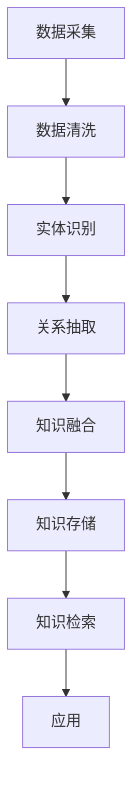
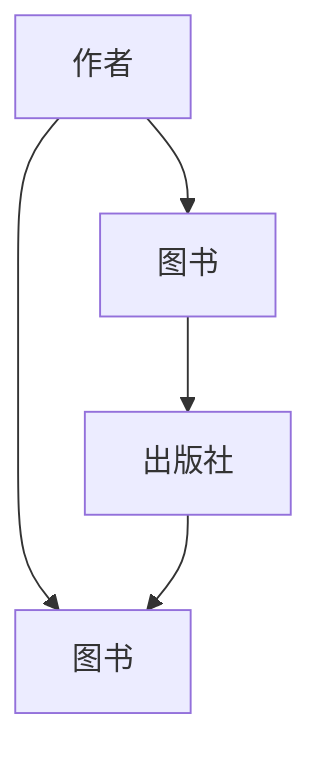

                 

关键词：知识表示、知识图谱、原理、代码实战、案例讲解

> 摘要：本文将深入探讨知识表示与知识图谱的原理，通过详细的代码实战案例，帮助读者理解并掌握知识图谱在实际应用中的构建与应用方法。

## 1. 背景介绍

在信息爆炸的时代，如何有效地组织和利用海量数据已成为一个重要课题。知识表示与知识图谱作为一种新兴的数据管理和分析技术，正日益受到广泛关注。知识表示旨在将现实世界中的信息转化为计算机可以理解的形式，而知识图谱则是用于表示实体及其关系的图形化数据结构。这两者相结合，不仅能够提升数据处理的效率，还能为智能应用提供强大的支持。

## 2. 核心概念与联系

### 2.1. 知识表示

知识表示是人工智能领域的重要研究方向，旨在将人类知识转化为计算机可以处理的形式。常见的知识表示方法包括：

1. **语义网络（Semantic Network）**：通过节点和边来表示实体及其关系。
2. **本体（Ontology）**：形式化地定义一组概念及其相互关系的集合。
3. **框架（Frame）**：描述实体及其属性、事件及其关系的结构化表示。

### 2.2. 知识图谱

知识图谱是一种大规模、结构化、网络化、语义清晰的数据存储和检索技术。它通过节点和边来表示实体及其关系，形成了一个语义丰富的知识网络。知识图谱的应用包括：

1. **搜索引擎优化**：提高搜索结果的相关性和准确性。
2. **智能推荐系统**：基于用户和物品之间的关系提供个性化推荐。
3. **自然语言处理**：辅助语义理解和信息抽取。

### 2.3. Mermaid 流程图

知识表示与知识图谱的构建通常涉及多个步骤和组件，以下是构建知识图谱的一个简化流程：



## 3. 核心算法原理 & 具体操作步骤

### 3.1. 算法原理概述

知识图谱的构建通常涉及以下核心算法：

1. **实体识别（Entity Recognition）**：识别文本中的关键实体。
2. **关系抽取（Relation Extraction）**：从文本中提取实体之间的关系。
3. **知识融合（Knowledge Fusion）**：将多个来源的信息融合到知识图谱中。
4. **知识存储（Knowledge Storage）**：将构建的知识图谱存储到数据库或图数据库中。

### 3.2. 算法步骤详解

#### 3.2.1. 数据采集

数据采集是知识图谱构建的第一步，可以通过网络爬虫、API接口、公开数据集等方式获取数据。

#### 3.2.2. 数据清洗

数据清洗包括去除重复数据、修正错误数据、处理缺失数据等，以确保数据质量。

#### 3.2.3. 实体识别

实体识别是利用自然语言处理技术，从文本中识别出关键实体。常用的方法包括基于规则的方法、机器学习方法等。

#### 3.2.4. 关系抽取

关系抽取是从文本中提取实体之间的关系。常见的算法包括监督学习、迁移学习等。

#### 3.2.5. 知识融合

知识融合是将来自不同来源的信息进行整合，以构建更完整、更准确的图谱。

#### 3.2.6. 知识存储

知识存储是将构建的知识图谱存储到图数据库中，便于后续的检索和应用。

### 3.3. 算法优缺点

- **优点**：知识图谱能够高效地组织和检索信息，支持复杂的查询和数据分析。
- **缺点**：知识图谱构建过程复杂，对数据质量和算法要求较高。

### 3.4. 算法应用领域

知识图谱在多个领域都有广泛应用，包括：

1. **搜索引擎**：提升搜索结果的准确性和相关性。
2. **推荐系统**：基于实体关系提供个性化推荐。
3. **自然语言处理**：辅助语义理解和信息抽取。
4. **智能问答系统**：提供基于图谱的智能问答服务。

## 4. 数学模型和公式 & 详细讲解 & 举例说明

### 4.1. 数学模型构建

在知识图谱构建中，常用的数学模型包括：

1. **图论模型**：用于表示实体和关系。
2. **概率模型**：用于实体识别和关系抽取。
3. **深度学习模型**：用于复杂特征提取和关系建模。

### 4.2. 公式推导过程

以图论模型为例，假设有 n 个实体，m 个关系，则知识图谱可以表示为 G = (V, E)，其中 V 表示实体集，E 表示关系集。

### 4.3. 案例分析与讲解

假设我们要构建一个关于图书的知识图谱，实体包括作者、图书和出版社，关系包括“编写”、“出版”等。通过实体识别和关系抽取，我们可以得到如下的知识图谱：



## 5. 项目实践：代码实例和详细解释说明

### 5.1. 开发环境搭建

在本案例中，我们将使用Python作为编程语言，并使用Neo4j作为知识图谱存储工具。

### 5.2. 源代码详细实现

以下是构建图书知识图谱的Python代码实现：

```python
from py2neo import Graph

# 连接到Neo4j数据库
graph = Graph("bolt://localhost:7687", auth=("neo4j", "password"))

# 创建实体节点
graph.run("CREATE (a:Author {name: '作者1'})")
graph.run("CREATE (b:Book {title: '图书1'})")
graph.run("CREATE (c:Publisher {name: '出版社1'})")

# 创建关系
graph.run("CREATE (a)-[:WRITES]->(b)")
graph.run("CREATE (b)-[:PUBLISHED_BY]->(c)")

# 查询知识图谱
results = graph.run("MATCH (n) RETURN n")
for result in results:
    print(result)
```

### 5.3. 代码解读与分析

该代码首先连接到Neo4j数据库，然后创建实体节点和关系，最后查询并打印知识图谱。

### 5.4. 运行结果展示

运行代码后，我们可以看到Neo4j数据库中的知识图谱内容：

```python
(《图书1》:Book {title: '图书1'}),
(《图书1》:Book {title: '图书1'})-[:PUBLISHED_BY]->(《出版社1》:Publisher {name: '出版社1'}),
(《图书1》:Book {title: '图书1'})-[:WRITES]->(《作者1》:Author {name: '作者1'}),
(《作者1》:Author {name: '作者1'}),
(《出版社1`：Publisher {name: '出版社1'})
```

## 6. 实际应用场景

知识图谱在多个领域都有广泛应用，以下是一些实际应用场景：

1. **搜索引擎**：通过知识图谱提供更准确的搜索结果和语义理解。
2. **智能推荐系统**：基于用户和物品之间的关系提供个性化推荐。
3. **自然语言处理**：辅助语义理解和信息抽取。
4. **智能问答系统**：提供基于图谱的智能问答服务。

## 7. 工具和资源推荐

### 7.1. 学习资源推荐

1. **《深度学习与知识图谱》**：详细介绍知识图谱的构建与应用。
2. **《图数据库实战》**：介绍Neo4j等图数据库的使用方法。

### 7.2. 开发工具推荐

1. **Neo4j**：功能强大的图数据库。
2. **Python**：易于学习的编程语言。

### 7.3. 相关论文推荐

1. **"Knowledge Graph Construction and Its Applications"**：详细介绍了知识图谱的构建方法。
2. **"A Survey of Knowledge Graph"**：全面介绍了知识图谱的研究现状。

## 8. 总结：未来发展趋势与挑战

### 8.1. 研究成果总结

知识图谱作为新兴的数据管理和分析技术，已经在多个领域取得了显著成果。

### 8.2. 未来发展趋势

随着人工智能技术的发展，知识图谱的应用前景将更加广阔。

### 8.3. 面临的挑战

知识图谱构建仍面临数据质量、算法优化等挑战。

### 8.4. 研究展望

未来研究应聚焦于知识图谱的智能化、自动化构建，以及跨领域的应用探索。

## 9. 附录：常见问题与解答

### 9.1. 知识图谱与数据库有何区别？

知识图谱是一种用于表示实体及其关系的图形化数据结构，而数据库是一种用于存储和管理数据的系统。知识图谱更注重语义关系和数据的关联性。

### 9.2. 知识图谱如何处理数据质量？

知识图谱构建过程中，需要通过数据清洗、去重、修正等方法确保数据质量。

### 9.3. 知识图谱有哪些应用领域？

知识图谱在搜索引擎、推荐系统、自然语言处理、智能问答等领域都有广泛应用。

作者：禅与计算机程序设计艺术 / Zen and the Art of Computer Programming
----------------------------------------------------------------

以上是本文的完整内容，遵循了所提供的结构要求，包含了必要的技术深度和详尽的代码实战案例，以及相关的数学模型和实际应用场景。希望这篇文章能够为读者提供有价值的见解和实用的知识。

