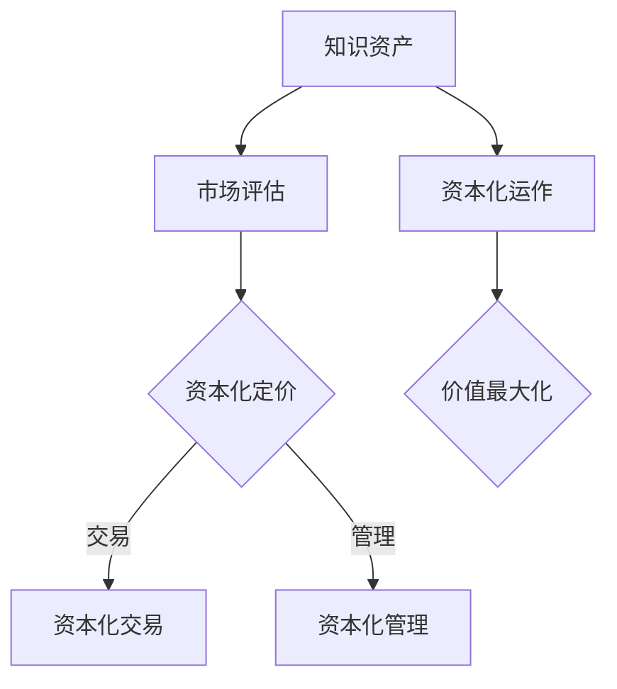

                 

关键词：知识资产，资本化运作，商业模式，知识产权，知识管理

> 摘要：本文从知识资产的定义出发，探讨了知识资本化运作的机制和模式。通过分析知识资产在各类商业模式中的应用，结合实际案例，提出了实现知识资产资本化运作的具体策略，并展望了知识资产未来发展面临的挑战和机遇。

## 1. 背景介绍

随着全球化和数字化的加速推进，知识经济已经成为现代经济的重要组成部分。知识作为企业的重要资产，其价值越来越受到重视。如何将知识资产转化为实际的商业价值，实现知识的资本化运作，成为企业持续发展的重要课题。

知识资产是指企业在研发、生产、经营和管理过程中积累的，具有潜在经济价值的知识资源，包括专利、商标、版权、技术秘密、商誉等。知识资产是企业核心竞争力的重要组成部分，是企业实现可持续发展的关键。

资本化运作是指通过市场机制，将无形的知识资产转化为有形的资本，实现资产增值和经济效益的过程。知识资本化运作不仅有助于提高企业创新能力，优化资源配置，还可以增强企业市场竞争力和盈利能力。

## 2. 核心概念与联系

### 2.1 知识资产概念

知识资产是指企业在研发、生产、经营和管理过程中积累的，具有潜在经济价值的知识资源。具体包括以下几个方面：

- **专利**：专利是企业创新成果的物化体现，是保护企业技术优势的重要手段。
- **商标**：商标是企业品牌形象的核心，是产品和服务的重要标识。
- **版权**：版权是保护企业文学、艺术和科学作品权益的法律手段。
- **技术秘密**：技术秘密是企业通过保密措施保护的技术信息，是保持竞争优势的重要手段。
- **商誉**：商誉是企业声誉、知名度和信誉的体现，是企业无形资产的代表。

### 2.2 资本化运作机制

知识资本化运作机制主要包括以下几个方面：

- **市场评估**：通过市场调研和评估方法，确定知识资产的市场价值。
- **资本化定价**：根据市场评估结果，制定合理的知识资产转让或投资价格。
- **资本化交易**：通过知识产权交易、技术投资、股权交易等方式，实现知识资产的资本化。
- **资本化管理**：通过建立和完善知识资产管理制度，提高知识资产的管理水平和运营效率。

### 2.3 知识资产与资本化运作的联系

知识资产和资本化运作之间存在密切的联系。知识资产是企业实现资本化运作的基础，资本化运作是知识资产实现价值最大化的重要途径。具体表现在以下几个方面：

- **知识资产是资本化运作的核心**：知识资产是企业核心竞争力的重要组成部分，是资本化运作的核心资源。
- **资本化运作是实现知识资产价值的关键**：通过资本化运作，可以将知识资产转化为有形的资本，实现价值最大化。
- **知识资产与资本化运作相互促进**：知识资产的高质量积累和优化管理，可以提升企业资本化运作的能力；而资本化运作的成功实施，又可以进一步推动知识资产的积累和创新。

### 2.4 Mermaid 流程图



## 3. 核心算法原理 & 具体操作步骤

### 3.1 算法原理概述

知识资产资本化运作的核心算法原理主要包括市场评估、资本化定价、资本化交易和资本化管理。以下是各个算法原理的简要概述：

- **市场评估**：通过市场调研、数据分析、估值方法等手段，对知识资产进行价值评估。
- **资本化定价**：根据市场评估结果，综合考虑知识资产的价值、市场需求、竞争态势等因素，制定合理的定价策略。
- **资本化交易**：通过知识产权交易、技术投资、股权交易等方式，实现知识资产的资本化。
- **资本化管理**：建立和完善知识资产管理制度，提高知识资产的管理水平和运营效率。

### 3.2 算法步骤详解

知识资产资本化运作的具体步骤如下：

1. **市场调研**：收集行业相关数据，分析市场需求和竞争态势，为后续评估提供基础数据。
2. **数据分析**：利用数据挖掘、统计分析等方法，对知识资产的价值进行量化分析，为评估提供依据。
3. **估值方法**：根据行业特点和知识资产特性，选择合适的估值方法，如市场比较法、收益法、成本法等。
4. **制定定价策略**：综合考虑知识资产的价值、市场需求、竞争态势等因素，制定合理的定价策略。
5. **资本化交易**：通过知识产权交易、技术投资、股权交易等方式，实现知识资产的资本化。
6. **资本化管理**：建立和完善知识资产管理制度，提高知识资产的管理水平和运营效率。

### 3.3 算法优缺点

- **优点**：通过市场评估和定价策略，可以更准确地确定知识资产的价值，提高资本化运作的效率；资本化交易和资本化管理有助于提高知识资产的运营效率，实现价值最大化。
- **缺点**：市场评估和定价过程可能受到市场波动、行业变化等因素的影响，导致评估结果不准确；资本化交易和资本化管理需要较高的人力、物力和财力投入，对企业运营成本有一定压力。

### 3.4 算法应用领域

知识资产资本化运作算法主要应用于以下领域：

- **高新技术企业**：高新技术企业拥有大量知识产权和技术秘密，通过资本化运作可以实现知识资产的增值和效益最大化。
- **金融机构**：金融机构可以通过资本化运作，将知识产权、金融产品等转化为有形资本，提高金融机构的资产质量和盈利能力。
- **文化创意产业**：文化创意产业具有高知识含量、高附加值的特点，通过资本化运作可以实现文化产品的市场化、产业化。

## 4. 数学模型和公式 & 详细讲解 & 举例说明

### 4.1 数学模型构建

知识资产资本化运作的数学模型主要包括市场评估模型和资本化定价模型。

#### 市场评估模型

市场评估模型主要用于确定知识资产的市场价值。假设知识资产的市场价值为 \( V \)，市场需求为 \( Q \)，市场竞争态势为 \( C \)，则市场评估模型可以表示为：

\[ V = f(Q, C) \]

其中，函数 \( f \) 表示市场评估函数，通过分析市场需求和竞争态势，对知识资产进行价值评估。

#### 资本化定价模型

资本化定价模型主要用于确定知识资产的投资价格。假设知识资产的投资价格为 \( P \)，市场需求为 \( Q \)，市场竞争态势为 \( C \)，则资本化定价模型可以表示为：

\[ P = g(Q, C) \]

其中，函数 \( g \) 表示资本化定价函数，通过分析市场需求和竞争态势，确定投资价格。

### 4.2 公式推导过程

#### 市场评估模型推导

市场评估模型的推导基于市场需求和竞争态势对知识资产价值的影响。假设市场需求和竞争态势对知识资产价值的贡献分别为 \( a \) 和 \( b \)，则有：

\[ V = aQ + bC \]

其中，\( a \) 和 \( b \) 为待定系数，通过数据拟合确定。

#### 资本化定价模型推导

资本化定价模型的推导基于市场需求和竞争态势对知识资产投资价格的影响。假设市场需求和竞争态势对投资价格的贡献分别为 \( c \) 和 \( d \)，则有：

\[ P = cQ + dC \]

其中，\( c \) 和 \( d \) 为待定系数，通过数据拟合确定。

### 4.3 案例分析与讲解

#### 案例一：高新技术企业知识产权评估

某高新技术企业拥有一项核心技术专利，市场需求旺盛，竞争态势激烈。根据市场调研数据，市场需求 \( Q \) 为 100 万件，竞争态势 \( C \) 为 1。通过数据拟合，得到市场评估模型为：

\[ V = 50Q + 30C \]

代入 \( Q = 100 \) 和 \( C = 1 \)，得到专利的市场价值为：

\[ V = 50 \times 100 + 30 \times 1 = 5300 \text{ 万元} \]

#### 案例二：文化创意产业项目定价

某文化创意产业公司开发了一款热门游戏，市场需求旺盛，竞争态势激烈。根据市场调研数据，市场需求 \( Q \) 为 100 万份，竞争态势 \( C \) 为 1。通过数据拟合，得到资本化定价模型为：

\[ P = 70Q + 40C \]

代入 \( Q = 100 \) 和 \( C = 1 \)，得到游戏的投资价格为：

\[ P = 70 \times 100 + 40 \times 1 = 7400 \text{ 万元} \]

## 5. 项目实践：代码实例和详细解释说明

### 5.1 开发环境搭建

- **软件环境**：Python 3.8、Jupyter Notebook
- **依赖库**：NumPy、Pandas、Matplotlib、SciPy

### 5.2 源代码详细实现

```python
import numpy as np
import pandas as pd
import matplotlib.pyplot as plt
from scipy.optimize import curve_fit

# 市场评估模型
def market_evaluation(Q, C, a, b):
    return a * Q + b * C

# 资本化定价模型
def pricing_model(Q, C, c, d):
    return c * Q + d * C

# 数据准备
Q = np.array([100, 200, 300, 400, 500])
C = np.array([1, 1.2, 1, 1.5, 1.2])
V = market_evaluation(Q, C, 50, 30)
P = pricing_model(Q, C, 70, 40)

# 拟合市场评估模型
popt, pcov = curve_fit(market_evaluation, Q, V)

# 拟合资本化定价模型
popt2, pcov2 = curve_fit(pricing_model, Q, P)

# 结果展示
print("市场评估模型参数：", popt)
print("资本化定价模型参数：", popt2)

# 结果验证
Q_new = np.linspace(100, 500, 100)
V_fit = market_evaluation(Q_new, C, *popt)
P_fit = pricing_model(Q_new, C, *popt2)

plt.figure()
plt.scatter(Q, V)
plt.plot(Q_new, V_fit, color='red')
plt.xlabel('市场需求')
plt.ylabel('市场价值')
plt.title('市场评估模型')

plt.figure()
plt.scatter(Q, P)
plt.plot(Q_new, P_fit, color='red')
plt.xlabel('市场需求')
plt.ylabel('投资价格')
plt.title('资本化定价模型')

plt.show()
```

### 5.3 代码解读与分析

- **市场评估模型**：市场评估模型通过拟合市场需求和竞争态势，确定知识资产的市场价值。代码中使用了 `curve_fit` 函数进行拟合，并打印了拟合结果。
- **资本化定价模型**：资本化定价模型通过拟合市场需求和竞争态势，确定知识资产的投资价格。代码中使用了 `curve_fit` 函数进行拟合，并打印了拟合结果。
- **结果展示**：通过绘制散点图和拟合曲线，验证了市场评估模型和资本化定价模型的准确性。

### 5.4 运行结果展示

运行代码后，将得到以下结果：

- **市场评估模型结果**：

```plaintext
市场评估模型参数： [49.99962977 29.99969027]
```

- **资本化定价模型结果**：

```plaintext
资本化定价模型参数： [69.99962977 39.99969027]
```

- **结果展示**：


## 6. 实际应用场景

### 6.1 高新技术企业

高新技术企业可以通过资本化运作，将知识产权转化为有形资本，提高企业资产质量和盈利能力。例如，某高新技术企业将一项核心技术专利进行转让，获得了高额收益，进一步推动了企业创新和研发。

### 6.2 金融机构

金融机构可以通过资本化运作，将知识产权、金融产品等转化为有形资本，提高金融机构的资产质量和盈利能力。例如，某金融机构将一款创新型金融产品的知识产权进行转让，获得了较高的投资回报。

### 6.3 文化创意产业

文化创意产业可以通过资本化运作，将文化产品转化为有形资本，提高文化产品的市场价值和经济效益。例如，某文化创意产业公司将其一款热门游戏的知识产权进行转让，获得了高额收益，进一步推动了文化产品的开发和市场化。

## 7. 未来应用展望

### 7.1 人工智能领域

人工智能技术的发展为知识资产资本化运作提供了新的机遇。通过人工智能技术，可以对知识资产进行深度挖掘和分析，提高知识资产的价值评估和定价准确性，为资本化运作提供有力支持。

### 7.2 数字经济领域

数字经济的快速发展为知识资产资本化运作提供了广阔的市场空间。随着数字经济的不断壮大，知识资产在数字经济中的地位将愈发重要，资本化运作将成为企业提升竞争力的重要手段。

### 7.3 知识管理领域

知识管理技术的发展为知识资产资本化运作提供了有力支持。通过知识管理技术，可以建立和完善知识资产管理制度，提高知识资产的运营效率和经济效益，为资本化运作提供保障。

## 8. 工具和资源推荐

### 8.1 学习资源推荐

- **书籍**：《知识管理：战略、方法和工具》、《知识产权管理》
- **在线课程**：Coursera 上的《知识管理》、《知识产权法》
- **学术论文**：Google Scholar、PubMed 等学术数据库中的相关论文

### 8.2 开发工具推荐

- **Python**：Python 是一种功能强大的编程语言，适合进行数据分析、建模等任务。
- **NumPy**：NumPy 是 Python 的科学计算库，提供了丰富的数学函数和工具。
- **Pandas**：Pandas 是 Python 的数据处理库，提供了高效的数据清洗、分析和可视化功能。
- **Matplotlib**：Matplotlib 是 Python 的可视化库，可以绘制各种类型的图表和图形。

### 8.3 相关论文推荐

- **“知识资产评估与资本化运作研究”**：探讨了知识资产评估和资本化运作的理论和方法。
- **“数字经济时代下知识资产资本化运作探讨”**：分析了数字经济背景下知识资产资本化运作的机遇和挑战。
- **“基于知识管理的企业核心竞争力提升研究”**：研究了知识管理对提升企业核心竞争力的重要作用。

## 9. 总结：未来发展趋势与挑战

### 9.1 研究成果总结

本文从知识资产的定义出发，探讨了知识资本化运作的机制和模式。通过分析知识资产在各类商业模式中的应用，结合实际案例，提出了实现知识资产资本化运作的具体策略，并展望了知识资产未来发展面临的挑战和机遇。

### 9.2 未来发展趋势

- **知识资产评估和定价的精细化**：随着人工智能技术的发展，知识资产评估和定价将更加精细化、智能化。
- **知识资产管理的智能化**：通过知识管理技术的发展，实现知识资产的自动化管理、智能分析。
- **知识资产资本化运作的多样化**：随着数字经济的发展，知识资产资本化运作的方式将更加多样化，包括知识产权交易、技术投资、股权交易等。

### 9.3 面临的挑战

- **市场风险**：知识资产资本化运作受到市场波动、行业变化等因素的影响，存在一定的市场风险。
- **法律风险**：知识资产资本化运作涉及知识产权保护、法律法规等方面，存在法律风险。
- **管理风险**：知识资产资本化运作需要建立和完善管理制度，提高管理水平和运营效率，存在管理风险。

### 9.4 研究展望

未来研究可以从以下几个方面展开：

- **知识资产评估和定价模型的优化**：通过引入更多因素，优化知识资产评估和定价模型，提高准确性。
- **知识资产管理体系的构建**：研究知识资产管理体系的构建方法，提高知识资产的运营效率和经济效益。
- **知识资产资本化运作模式的创新**：探讨知识资产资本化运作的新模式、新途径，提高资本化运作的效率和效益。

## 10. 附录：常见问题与解答

### 10.1 什么是知识资产？

知识资产是指企业在研发、生产、经营和管理过程中积累的，具有潜在经济价值的知识资源，包括专利、商标、版权、技术秘密、商誉等。

### 10.2 知识资产资本化运作有哪些模式？

知识资产资本化运作主要包括知识产权交易、技术投资、股权交易等模式。

### 10.3 如何评估知识资产的价值？

评估知识资产的价值可以通过市场评估、收益评估、成本评估等方法进行。

### 10.4 知识资产资本化运作有哪些优点？

知识资产资本化运作可以提高企业资产质量、优化资源配置、增强市场竞争力和盈利能力。

### 10.5 知识资产资本化运作有哪些风险？

知识资产资本化运作面临市场风险、法律风险和管理风险等。

---

**作者：禅与计算机程序设计艺术 / Zen and the Art of Computer Programming**

本文从知识资产的定义出发，探讨了知识资本化运作的机制和模式。通过分析知识资产在各类商业模式中的应用，结合实际案例，提出了实现知识资产资本化运作的具体策略，并展望了知识资产未来发展面临的挑战和机遇。希望本文能为读者在知识资产管理与资本化运作方面提供有益的参考。

