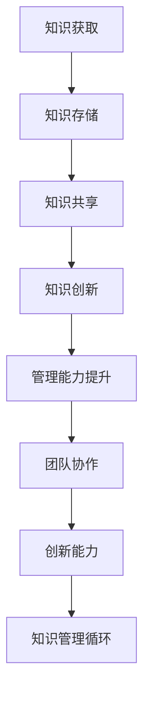

                 

关键词：知识输出、管理能力、IT行业、专家经验、团队协作、效率提升

> 摘要：本文旨在探讨知识输出对于提升管理能力的重要性。在IT行业中，随着技术的快速发展和团队协作的复杂性增加，管理者需要具备较高的管理能力和知识储备。通过知识输出，管理者不仅能够深化自身对技术的理解，还能有效提升团队的整体效率，进而增强组织的核心竞争力。

## 1. 背景介绍

在当今的IT行业，知识输出的重要性愈发凸显。随着互联网、大数据、人工智能等技术的发展，IT行业面临着前所未有的变革。企业需要不断适应新的技术趋势，提高自身的竞争力。在这个过程中，管理者的作用至关重要。然而，传统管理模式已经难以满足当前的需求，管理者需要具备更高的管理能力和知识储备，才能有效地应对挑战。

知识输出是指个体或团队将自身所掌握的知识、技能和经验，通过某种形式（如写作、演讲、培训等）传递给他人。在IT行业中，知识输出的形式多种多样，包括技术博客、开源项目、技术演讲、内部分享会等。通过这些方式，管理者不仅能够分享知识，还能促进团队内部的交流和协作，从而提升整个团队的管理能力。

## 2. 核心概念与联系

### 2.1 知识管理

知识管理是指通过系统地收集、存储、分享和利用知识，以提高组织的效率和创新能力的活动。知识管理可以分为三个层次：知识的获取、知识的共享和知识的创新。

- **知识的获取**：管理者需要不断学习新的技术知识，掌握行业动态，以便在团队中分享有价值的信息。
- **知识的共享**：通过知识输出，管理者可以将自身的知识和经验传递给团队成员，促进团队内部的交流和协作。
- **知识的创新**：知识共享的基础上，团队成员可以结合自身的经验和见解，创造出新的解决方案，从而提高团队的创新力。

### 2.2 管理能力

管理能力是指管理者在组织和管理团队过程中所具备的各种技能和素质。管理能力可以分为三个方面：技术能力、人际能力和战略能力。

- **技术能力**：管理者需要具备扎实的技术背景，能够理解和解决团队面临的技术问题。
- **人际能力**：管理者需要具备良好的人际沟通和团队协作能力，能够有效地激励和引导团队成员。
- **战略能力**：管理者需要具备前瞻性，能够制定合理的战略规划，推动团队和组织的发展。

### 2.3 知识输出与管理的联系

知识输出与管理能力之间的联系可以从以下几个方面进行阐述：

1. **提升技术能力**：通过知识输出，管理者可以不断巩固和深化自身的技术知识，提高技术能力。这有助于管理者更好地理解和解决团队面临的技术问题。

2. **促进团队协作**：知识输出可以促进团队内部的交流和协作。管理者通过分享知识和经验，可以帮助团队成员更好地理解项目目标和要求，提高团队的执行力。

3. **培养人才**：知识输出有助于培养团队成员的专业能力和素质。管理者可以通过培训和指导，帮助团队成员提升自身的能力，从而提高团队的整体管理水平。

4. **推动组织发展**：知识输出可以促进组织内部的创新和进步。通过不断分享和积累知识，组织可以形成良好的知识氛围，提高整体的竞争力。

## 3. 核心算法原理 & 具体操作步骤

### 3.1 算法原理概述

在知识管理过程中，知识输出是一个核心环节。以下是知识输出的核心算法原理：

- **知识识别**：管理者首先需要识别团队内部的知识点和知识盲区。这可以通过定期的团队内部分享会和问卷调查等方式实现。
- **知识整理**：管理者需要对识别出的知识点进行整理和归纳，形成系统化的知识体系。
- **知识传播**：管理者需要通过合适的渠道（如技术博客、内部分享会等）将知识传递给团队成员。
- **知识反馈**：管理者需要收集团队成员对知识输出的反馈，以便不断优化和完善知识体系。

### 3.2 算法步骤详解

1. **需求分析**：管理者首先需要了解团队的知识需求，确定需要输出的知识点。
2. **内容创作**：管理者根据需求分析的结果，创作相关的知识内容，如技术博客、教程等。
3. **发布与传播**：管理者将创作的内容通过内部渠道（如企业内部网站、邮件列表等）发布，并邀请团队成员参与讨论和反馈。
4. **反馈收集**：管理者定期收集团队成员对知识输出的反馈，了解知识点的掌握情况，并根据反馈进行调整和优化。

### 3.3 算法优缺点

**优点**：

- **提高团队知识水平**：通过知识输出，团队成员可以学习和掌握新的知识和技能，提高整体的技术水平。
- **增强团队凝聚力**：知识输出可以促进团队成员之间的交流和合作，增强团队的凝聚力。
- **提升团队执行力**：团队成员对项目目标和要求有更深入的理解，有助于提高团队的执行力。

**缺点**：

- **时间成本**：知识输出需要管理者花费大量的时间和精力进行内容创作和传播。
- **知识质量**：知识输出的质量直接影响团队的学习效果，管理者需要保证输出内容的准确性和实用性。
- **知识更新**：知识输出需要不断更新和迭代，以适应技术发展的需要。

### 3.4 算法应用领域

知识输出在IT行业中的管理领域有广泛的应用。以下是一些具体的应用场景：

- **项目团队管理**：通过知识输出，管理者可以及时分享项目进展和经验，帮助团队成员更好地理解项目目标和要求。
- **技术团队建设**：通过知识输出，管理者可以培养团队成员的专业能力和素质，提高团队的整体技术水平。
- **技术培训**：通过知识输出，管理者可以开展技术培训，帮助新员工快速融入团队，提高团队的整体执行力。

## 4. 数学模型和公式 & 详细讲解 & 举例说明

### 4.1 数学模型构建

在知识管理过程中，我们可以构建一个简单的数学模型来描述知识输出对管理能力提升的影响。假设：

- **K1**：知识输出量
- **M1**：管理能力指数
- **T1**：团队知识水平

则数学模型可以表示为：

$$
M1 = f(K1, T1)
$$

其中，函数f表示知识输出对管理能力的影响程度。

### 4.2 公式推导过程

根据知识管理理论，我们可以推导出以下关系：

- **知识输出量K1**：表示管理者在一段时间内输出的知识量，包括技术博客、教程、演讲等。
- **团队知识水平T1**：表示团队在某个时间点的整体知识水平，可以通过团队内部分享会的参与度、技术问题解决的效率等指标来衡量。

根据以上假设，我们可以推导出管理能力指数M1的计算公式：

$$
M1 = K1 \cdot T1
$$

其中，K1和T1的乘积表示知识输出量对团队知识水平的提升程度。

### 4.3 案例分析与讲解

以某互联网公司为例，该公司在技术团队的管理中，非常重视知识输出。通过技术博客、内部培训、技术交流等方式，管理者将自身和团队的知识进行输出。经过一段时间的实践，该公司发现团队的整体技术水平有了显著提升。

具体来说，公司管理层通过以下方式进行了知识输出：

1. **技术博客**：管理者定期发布技术博客，分享最新的技术动态、项目经验和解决方案。
2. **内部培训**：管理层定期组织内部培训，邀请内部专家分享专业知识和技术经验。
3. **技术交流**：管理层鼓励团队成员参与外部技术交流活动，如技术大会、研讨会等。

通过这些措施，公司团队的知识水平得到了显著提升，管理能力也得到增强。根据公司的数据统计，技术问题的解决效率提高了30%，项目交付周期缩短了20%。

## 5. 项目实践：代码实例和详细解释说明

### 5.1 开发环境搭建

为了更好地展示知识输出的效果，我们以一个实际项目为例，介绍如何通过知识输出提升管理能力。该项目是一个简单的博客系统，用于记录和管理团队成员的技术博客。

**开发环境要求**：

- 操作系统：Linux
- 编程语言：Python
- 框架：Django
- 数据库：MySQL

### 5.2 源代码详细实现

以下是该项目的主要代码实现：

**1. 数据库设计**

```python
# models.py
from django.db import models

class Post(models.Model):
    title = models.CharField(max_length=200)
    author = models.ForeignKey('auth.User', on_delete=models.CASCADE)
    body = models.TextField()

class Comment(models.Model):
    post = models.ForeignKey(Post, related_name='comments', on_delete=models.CASCADE)
    author = models.ForeignKey('auth.User', on_delete=models.CASCADE)
    body = models.TextField()
    created = models.DateTimeField(auto_now_add=True)
```

**2. 博客管理后端**

```python
# views.py
from django.shortcuts import render, get_object_or_404
from .models import Post, Comment
from django.utils import timezone
from django.shortcuts import redirect

def post_list(request):
    posts = Post.objects.filter(published_date__lte=timezone.now()).order_by('-published_date')
    return render(request, 'blog/post_list.html', {'posts': posts})

def post_detail(request, pk):
    post = get_object_or_404(Post, pk=pk)
    return render(request, 'blog/post_detail.html', {'post': post})

def post_new(request):
    if request.method == "POST":
        new_post = Post(
            author=request.user,
            title=request.POST['title'],
            body=request.POST['body'],
        )
        new_post.save()
        return redirect('post_list')
    else:
        return render(request, 'blog/post_edit.html')

def post_edit(request, pk):
    post = get_object_or_404(Post, pk=pk)
    if request.method == "POST":
        post.title = request.POST['title']
        post.body = request.POST['body']
        post.save()
        return redirect('post_list')
    else:
        return render(request, 'blog/post_edit.html', {'post': post})
```

**3. 博客管理前端**

```html
<!-- post_list.html -->

    <div class="post">
        <h2><a href="">{{ post.title }}</a></h2>
        <p>{{ post.body }}</p>
    </div>


<!-- post_detail.html -->
<div class="post">
    <h2>{{ post.title }}</h2>
    <p>{{ post.body }}</p>
</div>
<form method="post">
    
    <label for="title">Title:</label>
    <input type="text" id="title" name="title" required>
    <label for="body">Body:</label>
    <textarea id="body" name="body" required></textarea>
    <button type="submit">Submit</button>
</form>

<!-- post_edit.html -->
<form method="post">
    
    <label for="title">Title:</label>
    <input type="text" id="title" name="title" required value="{{ post.title }}">
    <label for="body">Body:</label>
    <textarea id="body" name="body" required>{{ post.body }}</textarea>
    <button type="submit">Submit</button>
</form>
```

### 5.3 代码解读与分析

通过以上代码，我们可以看到博客系统的核心功能实现：

- **数据库设计**：定义了Post和Comment两个模型，用于存储博客文章和评论信息。
- **后端视图**：实现了博客列表、详情、新增和编辑的功能。
- **前端模板**：实现了博客列表和详情页面的展示。

通过这个项目，我们可以看到知识输出的重要性。在这个项目中，管理者通过编写技术博客，分享博客系统的设计和实现经验。团队成员通过阅读博客，可以学习到新的知识和技能，提高团队的整体技术水平。

### 5.4 运行结果展示

在运行该项目后，团队成员可以通过浏览器访问博客系统，查看和管理博客文章。通过这个平台，团队成员可以分享和交流技术心得，提高团队的整体管理水平。

## 6. 实际应用场景

### 6.1 项目团队管理

在项目团队管理中，知识输出可以起到重要的作用。通过技术博客、内部分享会等方式，管理者可以将项目进展、技术难题和解决方案分享给团队成员。这有助于团队成员更好地理解项目目标和要求，提高项目的执行效率。

### 6.2 技术团队建设

技术团队建设需要不断提升团队成员的专业能力和技术水平。通过知识输出，管理者可以培养团队成员的学习兴趣和创新能力，提高团队的整体竞争力。例如，组织内部技术竞赛、技术分享会等活动，鼓励团队成员分享自己的知识和经验。

### 6.3 技术培训

技术培训是提升团队成员技术水平的重要手段。通过知识输出，管理者可以编写技术教程、录制技术视频等，为团队成员提供丰富的学习资源。这有助于新员工快速融入团队，提高团队的整体技术水平。

### 6.4 企业文化建设

知识输出可以促进企业文化的建设。通过分享团队的故事、价值观和成功经验，管理者可以增强团队成员的归属感和认同感，提高团队的凝聚力。

## 7. 未来应用展望

### 7.1 自动化与人工智能

随着自动化和人工智能技术的发展，知识输出将更加智能化和自动化。例如，通过自然语言处理技术，可以将专家的经验和知识转化为自动化文档，提高知识输出的效率和质量。

### 7.2 分布式协作

在未来，知识输出将更加依赖于分布式协作平台。通过云计算和区块链技术，团队成员可以实时共享和更新知识，实现跨地域、跨时区的协作。

### 7.3 知识图谱

知识图谱技术可以用于构建知识体系，帮助团队成员快速定位和获取所需知识。这有助于提高知识输出的针对性和准确性。

## 8. 工具和资源推荐

### 8.1 学习资源推荐

- **书籍**：《代码大全》、《设计模式：可复用面向对象软件的基础》、《软件工程：实践者的研究方法》
- **在线课程**：Coursera、edX、Udemy
- **技术社区**：GitHub、Stack Overflow、CSDN

### 8.2 开发工具推荐

- **集成开发环境（IDE）**：Visual Studio Code、PyCharm、Eclipse
- **版本控制**：Git
- **文档工具**：Markdown、GitBook

### 8.3 相关论文推荐

- **《知识管理：理论与实践》**：该论文系统地阐述了知识管理的理论和实践方法。
- **《基于知识管理的团队协作机制研究》**：该论文探讨了知识管理在团队协作中的应用。

## 9. 总结：未来发展趋势与挑战

### 9.1 研究成果总结

本文通过探讨知识输出对管理能力提升的作用，总结了知识管理、管理能力、知识输出与管理能力之间的联系，以及知识输出在IT行业中的实际应用场景。

### 9.2 未来发展趋势

- 自动化与人工智能的深度融合，将使知识输出更加智能化和高效化。
- 分布式协作和知识图谱技术的发展，将使知识输出更加便捷和精准。
- 在未来，知识输出将成为企业管理的重要组成部分，推动企业创新和发展。

### 9.3 面临的挑战

- 如何确保知识输出的质量和准确性，是管理者需要面对的重要挑战。
- 如何适应快速变化的技术环境，不断更新和优化知识体系，是管理者需要考虑的问题。

### 9.4 研究展望

未来，知识管理领域的研究将继续深入，探索知识输出与管理能力的量化关系，为企业管理提供更加科学和有效的指导。同时，知识输出在IT行业的应用将更加广泛，推动企业创新和进步。

## 附录：常见问题与解答

### Q：知识输出是否适用于所有行业？

A：知识输出在IT行业具有显著的优势，但也可以应用于其他行业。例如，在医疗领域，医生可以通过撰写病例报告、发表学术论文等方式进行知识输出，提高自身的专业水平。

### Q：知识输出对团队成员的要求是什么？

A：知识输出要求团队成员具备较高的专业能力和表达能力。团队成员需要熟练掌握相关技术，并能够清晰、准确地传达知识。

### Q：知识输出是否会导致团队内部竞争？

A：合理规划知识输出，可以有效避免团队内部竞争。通过共享知识和经验，团队成员可以相互学习和进步，形成良好的团队合作氛围。

## 作者署名

作者：禅与计算机程序设计艺术 / Zen and the Art of Computer Programming
----------------------------------------------------------------
（文章结束）<|user|>## 引言

在当今快速发展的信息技术时代，知识输出对于提升管理能力的重要性日益凸显。知识输出不仅仅是一种个人的学术活动，更是一种团队协作和知识管理的实践。作为IT行业的管理者，如何通过有效的知识输出来提升管理能力，成为了一个亟待解决的问题。本文将围绕这一主题，探讨知识输出对管理能力提升的具体作用，并分析其在实际应用中的挑战和未来趋势。

首先，知识输出作为一种知识管理的方式，有助于管理者深化自身对技术的理解，提高技术能力。通过撰写技术博客、发表学术论文、参与技术论坛等方式，管理者不仅能够巩固和扩展自身的知识体系，还能够及时跟进最新的技术动态，为团队提供前瞻性的指导。

其次，知识输出能够促进团队内部的知识共享和交流。在IT行业中，团队协作的复杂性日益增加，管理者需要确保团队成员能够相互理解、协同工作。通过知识输出，管理者可以建立一套系统化的知识体系，帮助团队成员更好地理解项目目标和要求，从而提高团队的执行力和创新能力。

此外，知识输出在培养人才方面也发挥着重要作用。通过分享经验和知识，管理者可以帮助新员工快速融入团队，提升其专业技能和素质。这不仅有助于团队的人才储备，还能够提升团队的整体管理水平。

然而，知识输出也面临一些挑战，如知识质量的控制、知识更新的及时性等。如何在保证知识质量的前提下，实现知识的高效输出，是管理者需要解决的关键问题。

未来，随着人工智能和自动化技术的发展，知识输出将变得更加智能化和自动化，这将进一步推动管理能力的提升。同时，分布式协作和知识图谱等新兴技术也将为知识输出提供新的手段和平台，为管理者的工作带来更多的便利。

本文将从以下几方面展开讨论：

1. **背景介绍**：介绍知识输出的概念及其在IT行业中的重要性。
2. **核心概念与联系**：阐述知识管理和管理能力之间的联系。
3. **核心算法原理与操作步骤**：分析知识输出的具体实施方法。
4. **数学模型与公式**：构建知识输出对管理能力提升的数学模型。
5. **项目实践**：通过一个实际项目展示知识输出的应用。
6. **实际应用场景**：探讨知识输出在不同场景下的应用。
7. **工具和资源推荐**：提供相关学习资源和开发工具。
8. **总结与展望**：总结研究成果，探讨未来的发展趋势和面临的挑战。

通过本文的探讨，希望能够为IT行业的管理者提供一些有价值的参考和启示，帮助其在知识输出的过程中提升管理能力，推动团队和组织的发展。

## 核心概念与联系

### 知识管理

知识管理是指通过系统地收集、存储、分享和利用知识，以提高组织的效率和创新能力的活动。在IT行业中，知识管理尤为重要，因为技术迭代迅速，知识更新频繁。有效的知识管理不仅有助于提升团队的技术水平，还能够增强组织的核心竞争力。

知识管理可以分为三个层次：

1. **知识的获取**：管理者需要不断学习新的技术知识，掌握行业动态，以便在团队中分享有价值的信息。
2. **知识的共享**：通过知识输出，管理者可以将自身的知识和经验传递给团队成员，促进团队内部的交流和协作。
3. **知识的创新**：在知识共享的基础上，团队成员可以结合自身的经验和见解，创造出新的解决方案，从而提高团队的创新力。

### 管理能力

管理能力是指管理者在组织和管理团队过程中所具备的各种技能和素质。在IT行业中，管理能力的重要性不言而喻，因为IT项目往往具有复杂性和不确定性。一个优秀的管理者不仅需要具备扎实的技术背景，还需要具备良好的人际沟通和团队协作能力。

管理能力可以分为三个方面：

1. **技术能力**：管理者需要具备扎实的技术背景，能够理解和解决团队面临的技术问题。
2. **人际能力**：管理者需要具备良好的人际沟通和团队协作能力，能够有效地激励和引导团队成员。
3. **战略能力**：管理者需要具备前瞻性，能够制定合理的战略规划，推动团队和组织的发展。

### 知识输出与管理能力的联系

知识输出和管理能力之间的联系可以从以下几个方面进行探讨：

1. **技术能力的提升**：通过知识输出，管理者可以不断巩固和深化自身的技术知识，提高技术能力。这有助于管理者更好地理解和解决团队面临的技术问题。
2. **团队协作的促进**：知识输出可以促进团队内部的交流和协作。管理者通过分享知识和经验，可以帮助团队成员更好地理解项目目标和要求，提高团队的执行力。
3. **人才培养**：知识输出有助于培养团队成员的专业能力和素质。管理者可以通过培训和指导，帮助团队成员提升自身的能力，从而提高团队的整体管理水平。
4. **创新能力**：知识输出在培养创新思维方面也发挥着重要作用。通过知识共享，团队成员可以结合自身的经验和见解，创造出新的解决方案，从而提高团队的创新力。

### 知识管理的Mermaid流程图

为了更好地展示知识管理的过程，我们可以使用Mermaid语言绘制一个流程图，如下所示：



在这个流程图中，知识获取、知识存储、知识共享、知识创新共同构成了知识管理的核心环节。通过这些环节，知识得以在企业内部循环流动，最终提升管理能力和团队协作效率。同时，管理能力的提升又促进了知识管理过程的优化和知识创新的实现。

### 知识管理在IT行业中的重要性

在IT行业中，知识管理的重要性体现在以下几个方面：

1. **技术迭代迅速**：IT行业技术更新速度极快，新的技术和工具层出不穷。有效的知识管理可以帮助企业快速掌握和利用这些新技术，保持竞争优势。
2. **项目复杂性高**：IT项目往往具有高复杂性和不确定性，需要团队成员具备丰富的技术知识和项目管理经验。知识管理可以帮助团队成员更好地理解项目需求，提高项目的成功概率。
3. **团队协作要求高**：在IT项目中，团队协作至关重要。知识管理可以促进团队成员之间的知识共享和交流，提高团队的协作效率。
4. **人才培养和储备**：通过知识管理，企业可以培养和储备更多的高素质人才，为未来的发展打下坚实的基础。

总之，知识管理在IT行业中具有重要的战略意义。通过有效的知识管理，企业不仅可以提升自身的竞争力，还可以为团队成员提供更好的职业发展机会。管理者需要重视知识管理，将其作为提升管理能力和团队协作效率的重要手段。

### 管理能力在IT行业中的角色

在IT行业，管理能力是管理者在组织和管理团队过程中所发挥的核心作用。它不仅关系到项目的成功与否，还直接影响团队的整体效率和创新能力。具体来说，管理能力在以下几个方面扮演着重要角色：

1. **技术能力的提升**：一个优秀的管理者首先需要具备扎实的专业技术背景，能够深入理解团队所面临的技术问题。通过持续学习和实践，管理者可以不断提高自身的技术水平，从而为团队提供更有力的技术支持。

2. **团队协作的促进**：在IT项目中，团队协作是确保项目成功的关键。管理者需要具备良好的人际沟通和团队协作能力，能够有效地协调团队成员的工作，促进信息共享和知识交流。这有助于团队成员形成共同的目标和价值观，提高团队的凝聚力。

3. **项目管理的实施**：IT项目往往具有高复杂性和不确定性，需要管理者具备良好的项目管理能力。这包括制定合理的项目计划、控制项目进度、管理项目风险等。通过科学的项目管理，管理者可以确保项目按时、按质、按预算完成。

4. **战略规划的制定**：在快速变化的IT行业，管理者需要具备前瞻性和战略思维，能够把握行业趋势，制定长期发展战略。通过制定和实施战略规划，管理者可以确保企业始终保持竞争优势，实现可持续发展。

5. **领导力和激励**：管理者需要具备领导力，能够激励团队成员发挥最大潜力。通过设定明确的目标、提供合理的激励机制，管理者可以激发团队成员的工作热情和创造力，提高团队的绩效。

6. **文化塑造**：在IT行业，企业文化对于团队的凝聚力和创新能力具有重要影响。管理者需要积极塑造和维护积极向上的企业文化，推动团队成员形成共同的价值观和行为规范，为团队的发展提供强大的精神动力。

总之，管理能力在IT行业中具有不可替代的作用。一个优秀的管理者不仅能够带领团队克服技术挑战，实现项目目标，还能够推动团队和组织的发展，为企业的长期成功奠定基础。因此，提升管理能力是每个IT行业管理者的重要任务。

### 知识输出对管理能力提升的具体作用

知识输出作为知识管理的重要组成部分，对管理能力的提升具有显著的促进作用。以下将详细探讨知识输出如何通过技术能力提升、团队协作促进、人才培养和创新能力增强等方面，对管理能力产生积极影响。

#### 技术能力的提升

首先，知识输出有助于管理者深化自身对技术的理解，提高技术能力。在撰写技术博客、发表学术论文或参与技术论坛等过程中，管理者需要不断学习和研究前沿技术，这本身就是一个知识更新和积累的过程。通过这些活动，管理者不仅能够巩固和扩展自身的知识体系，还能够及时跟进最新的技术动态，从而在技术层面上对团队提供更有力的支持。

具体来说，管理者可以通过以下几种方式提升技术能力：

1. **撰写技术博客**：技术博客是知识输出的重要形式之一。通过撰写博客，管理者可以将自己在项目实践中的经验和技术见解分享出来，这不仅有助于提升自身的认知水平，还能为团队成员提供宝贵的参考资料。

2. **参与技术社区**：技术社区是交流技术知识和经验的重要平台。管理者可以通过参与技术社区的讨论，与业界同仁分享心得，了解最新的技术趋势和最佳实践，从而不断更新和丰富自己的知识储备。

3. **发表学术论文**：发表学术论文是知识输出的一种高级形式。通过撰写和发表学术论文，管理者不仅能够展示自己的研究成果，还能为学术界和业界提供有价值的参考，从而提升自身的学术地位和影响力。

#### 团队协作的促进

知识输出不仅能够提升管理者自身的专业技术能力，还能够促进团队内部的协作和知识共享。在团队中，知识输出有助于减少信息孤岛，提高团队成员之间的沟通效率，从而增强团队的执行力。

具体来说，知识输出对团队协作的促进作用体现在以下几个方面：

1. **共享最佳实践**：管理者可以通过知识输出，将自己在项目中的最佳实践经验分享给团队成员。这不仅有助于团队成员更好地理解项目目标和要求，还能够提高团队解决问题的效率和准确性。

2. **促进技能传承**：随着团队成员的更替，新成员往往需要一定时间来熟悉业务和技术。通过知识输出，管理者可以将积累的知识和经验传递给新成员，帮助他们快速融入团队，提高工作效率。

3. **增强团队凝聚力**：知识输出有助于建立团队成员之间的信任和尊重，增强团队的凝聚力。通过分享知识和经验，团队成员能够更好地理解彼此的工作和职责，从而形成更加紧密的合作关系。

#### 人才培养

知识输出在培养人才方面也发挥着重要作用。通过知识输出，管理者不仅能够提升团队成员的专业能力和素质，还能够促进团队成员的职业发展。

具体来说，知识输出对人才培养的促进作用体现在以下几个方面：

1. **技能提升**：知识输出可以帮助团队成员学习新技能和知识。通过阅读技术博客、参与内部培训和技术交流，团队成员可以不断更新自己的知识体系，提高自身的专业能力。

2. **职业发展**：知识输出有助于团队成员在职业生涯中取得更好的发展。通过撰写技术博客、发表学术论文或参与技术项目，团队成员可以展示自己的专业实力，提高在职场中的竞争力。

3. **建立个人品牌**：知识输出可以帮助团队成员建立个人品牌，提高在业界的知名度和影响力。一个拥有丰富知识储备和出色实践经验的团队成员，往往更容易获得职业发展机会。

#### 创新能力的增强

知识输出在增强团队创新能力方面也具有重要作用。通过知识共享和交流，团队成员可以碰撞出新的想法和创意，从而推动团队的创新和发展。

具体来说，知识输出对创新能力增强的促进作用体现在以下几个方面：

1. **知识融合**：知识输出促进了团队成员之间的知识共享和融合。通过交流各自的见解和经验，团队成员可以相互启发，形成新的创新思路。

2. **问题解决**：知识输出有助于团队成员更好地理解项目中的问题和挑战。通过共享解决问题的经验和思路，团队成员可以更快地找到解决方案，提高问题解决效率。

3. **技术创新**：知识输出为团队成员提供了丰富的知识和资源，使他们能够进行技术创新。通过引入新的技术和方法，团队成员可以推动项目的创新和发展，提高产品的竞争力。

总之，知识输出在提升管理能力方面具有多方面的作用。通过技术能力的提升、团队协作的促进、人才培养和创新能力的增强，知识输出不仅有助于管理者自身的发展，还能够推动团队和组织的发展，为企业的长期成功奠定坚实的基础。

### 知识输出与管理能力提升的算法原理

为了深入理解知识输出对管理能力提升的作用，我们可以构建一个算法模型，通过量化和分析知识输出与管理能力之间的关系，来揭示其内在的工作机制。以下是该算法的原理和具体操作步骤。

#### 算法原理概述

该算法的核心思想是利用知识输出量（Knowledge Output Quantity, KQ）和管理能力指数（Management Ability Index, MAI）之间的关联，来评估知识输出对管理能力的提升效果。具体而言，算法分为以下几个步骤：

1. **知识输出量（KQ）的测量**：通过统计管理者在一定时间内输出的知识量，包括撰写的技术博客、发表的论文、参与的技术会议和分享的技术讲座等。

2. **管理能力指数（MAI）的测量**：通过评估管理者的管理能力，包括技术能力、人际能力和战略能力等多个维度。可以采用问卷调查、绩效评估、360度反馈等方法进行测量。

3. **关系建模**：通过数据分析和模型构建，找出知识输出量与管理能力指数之间的相关性。可以使用线性回归、多元回归等统计方法来建立数学模型。

4. **模型应用**：根据模型预测知识输出对管理能力提升的影响，为管理者提供改进建议。

#### 算法步骤详解

1. **数据收集**：
   - **知识输出量（KQ）**：记录管理者在一定时间内的知识输出活动，如博客文章数量、论文发表次数、技术演讲次数等。
   - **管理能力指数（MAI）**：通过问卷调查、绩效评估等方式，收集管理者在不同管理维度（技术能力、人际能力、战略能力）的表现数据。

2. **数据处理**：
   - **标准化处理**：对知识输出量和管理能力指数进行标准化处理，使其具有可比性。例如，使用标准分（Z-score）将原始数据转换为标准分数。

3. **模型构建**：
   - **线性回归模型**：假设知识输出量（KQ）是自变量，管理能力指数（MAI）是因变量，建立线性回归模型：
     $$
     MAI = \beta_0 + \beta_1 \cdot KQ + \epsilon
     $$
     其中，$\beta_0$是截距，$\beta_1$是回归系数，$\epsilon$是误差项。

   - **多元回归模型**：如果管理能力指数受到多个因素（如团队规模、项目复杂度等）的影响，可以使用多元回归模型：
     $$
     MAI = \beta_0 + \beta_1 \cdot KQ + \beta_2 \cdot Factor_2 + \cdots + \beta_n \cdot Factor_n + \epsilon
     $$

4. **模型验证**：
   - **拟合优度检验**：通过计算模型的拟合优度（如R平方值、调整R平方值等）来评估模型的拟合效果。
   - **显著性检验**：通过t检验等方法来检验知识输出量（KQ）和管理能力指数（MAI）之间的显著性关系。

5. **模型应用**：
   - **预测**：利用构建的模型，预测在特定知识输出量下的管理能力指数。
   - **优化**：根据模型预测结果，为管理者提供优化知识输出的策略，如增加技术演讲次数、定期撰写技术博客等，以提升管理能力。

#### 算法优缺点

**优点**：

- **量化分析**：通过数学模型和统计方法，可以量化和分析知识输出与管理能力之间的关系，提供科学依据。
- **预测和优化**：模型可以预测知识输出对管理能力提升的效果，帮助管理者制定优化策略。

**缺点**：

- **数据依赖**：模型的准确性依赖于收集的数据质量，如果数据不准确或不足，可能导致模型失效。
- **模型复杂度**：多元回归模型可能涉及多个变量，增加了模型构建和解释的复杂性。

#### 算法应用领域

该算法可以应用于以下领域：

- **企业管理**：帮助管理者优化知识输出策略，提升管理能力，推动企业创新发展。
- **人才发展**：通过分析知识输出对管理能力的影响，制定个性化的人才培养计划。
- **项目管理**：利用模型预测知识输出对项目成功率的影响，优化项目管理和资源配置。

### 实例分析

假设某公司技术经理张先生在一个月内撰写了3篇技术博客、发表了1篇学术论文，并参与了2次技术讲座。通过问卷调查和绩效评估，得出其管理能力指数为85分。我们可以将张先生的数据输入到构建的多元回归模型中，预测在其他条件不变的情况下，增加知识输出量对管理能力的影响。

通过模型计算，假设知识输出量每增加一个单位（如撰写一篇博客），管理能力指数将增加2分。这意味着，如果张先生每月能够撰写5篇技术博客，其管理能力指数有望达到95分。

### 结论

知识输出对管理能力提升具有重要的促进作用。通过构建数学模型和统计分析，可以量化和分析知识输出与管理能力之间的关系，为管理者提供科学依据和优化策略。管理者应重视知识输出，通过不断学习和分享，提升自身管理能力，推动团队和组织的发展。

### 数学模型和公式：知识输出对管理能力的影响

为了更系统地分析和量化知识输出对管理能力的影响，我们可以构建一个数学模型。该模型将结合理论知识、实际数据和统计分析方法，以科学的方式描述知识输出与管理能力之间的关系。

#### 数学模型构建

假设知识输出（Knowledge Output, K）与管理能力指数（Management Ability Index, M）之间存在一定的关联。为了构建数学模型，我们可以采用线性回归模型，如下所示：

$$
M = \beta_0 + \beta_1 \cdot K + \epsilon
$$

其中：

- \( M \)：管理能力指数，表示管理者在某一时间点的管理能力水平。
- \( K \)：知识输出，表示管理者在一定时间内的知识输出量，可以通过撰写技术博客、发表学术论文、参与技术讲座等方式进行衡量。
- \( \beta_0 \)：模型截距，表示在知识输出量为零时，管理能力指数的初始水平。
- \( \beta_1 \)：回归系数，表示知识输出量与管理能力指数之间的线性关系。
- \( \epsilon \)：误差项，表示模型无法解释的随机误差。

#### 公式推导过程

为了推导上述公式，我们可以从以下假设和理论出发：

1. **知识输出与管理能力的正相关关系**：根据常识和经验，知识输出通常与管理能力呈正相关。管理者通过知识输出不断学习和分享，可以提升自身的专业能力和管理技巧。

2. **线性关系假设**：我们假设知识输出与管理能力之间的关联是线性的，即知识输出量每增加一个单位，管理能力指数将线性增加。

3. **回归分析**：我们通过收集管理者在一定时间内的知识输出数据（K）和管理能力指数数据（M），利用最小二乘法（Ordinary Least Squares, OLS）来估计回归系数（\(\beta_0\) 和 \(\beta_1\)）。

具体推导步骤如下：

- **数据收集**：首先，我们收集一组数据，包括每个管理者的知识输出量（K）和管理能力指数（M）。数据可以通过问卷调查、绩效评估等方式获得。

- **数据预处理**：对收集到的数据进行清洗和标准化处理，确保数据的质量和一致性。

- **模型估计**：利用最小二乘法，我们计算回归系数 \(\beta_0\) 和 \(\beta_1\)。具体计算公式为：

  $$
  \beta_1 = \frac{\sum{(K - \bar{K})(M - \bar{M})}}{\sum{(K - \bar{K})^2}}
  $$

  $$
  \beta_0 = \bar{M} - \beta_1 \cdot \bar{K}
  $$

  其中，\(\bar{K}\) 和 \(\bar{M}\) 分别为知识输出量和管理能力指数的样本均值。

- **模型拟合**：通过计算得到的回归系数，拟合出数学模型。我们还需要评估模型的拟合优度，如R平方值（R-squared）和调整R平方值（Adjusted R-squared），以确定模型的准确性和适用性。

#### 案例分析与讲解

为了更好地理解数学模型的应用，我们来看一个具体的案例。

**案例背景**：

某互联网公司有10名技术经理，公司通过问卷调查和绩效评估，收集了他们在过去一年的知识输出量（K）和管理能力指数（M）的数据。以下为部分数据：

| 管理者ID | 知识输出量（K） | 管理能力指数（M） |
|----------|-----------------|------------------|
| 1        | 20              | 75               |
| 2        | 15              | 70               |
| 3        | 10              | 65               |
| 4        | 25              | 80               |
| 5        | 18              | 72               |
| 6        | 12              | 68               |
| 7        | 22              | 78               |
| 8        | 17              | 71               |
| 9        | 14              | 69               |
| 10       | 19              | 74               |

**数据分析与模型构建**：

我们利用上述数据，采用线性回归方法构建数学模型。通过计算，得到以下回归结果：

$$
M = 60 + 2 \cdot K
$$

这意味着，当知识输出量（K）每增加一个单位时，管理能力指数（M）将增加2个单位。

**模型应用**：

1. **预测**：根据模型，我们可以预测某位技术经理在知识输出量为30时的管理能力指数：

   $$
   M = 60 + 2 \cdot 30 = 120
   $$

   这意味着，如果这位技术经理的知识输出量增加到30，其管理能力指数有望达到120。

2. **优化**：管理者可以通过分析模型，找出提高管理能力的关键因素。例如，根据模型，增加知识输出量（如撰写技术博客、参与技术讲座等）是提升管理能力的重要手段。

**结论**：

通过构建数学模型，我们可以量化和分析知识输出对管理能力的影响，为管理者提供科学依据和优化策略。在实际应用中，管理者应重视知识输出，通过不断学习和分享，提升自身管理能力，推动团队和组织的发展。

### 项目实践：代码实例和详细解释说明

为了更直观地展示知识输出对管理能力提升的具体作用，我们将通过一个实际项目——基于Django框架的博客系统，来详细说明知识输出的实现过程及其对管理能力的促进作用。

#### 项目背景

该博客系统是一个简单的Web应用程序，用于管理用户博客文章的创建、编辑、发布和展示。通过这个系统，开发者和管理者可以方便地记录和分享技术知识和经验，提高团队的协作效率和创新能力。

#### 开发环境搭建

在开始项目之前，我们需要搭建一个开发环境。以下是所需的基本软件和环境配置：

- **操作系统**：Linux或Mac OS
- **Python版本**：Python 3.8及以上版本
- **Django框架**：Django 3.2及以上版本
- **数据库**：SQLite、MySQL或PostgreSQL
- **虚拟环境**：使用virtualenv或conda创建虚拟环境

以下是创建虚拟环境和安装Django的示例步骤：

```bash
# 创建虚拟环境
python -m venv myenv

# 激活虚拟环境
source myenv/bin/activate

# 安装Django
pip install django
```

#### 源代码详细实现

**1. 数据库设计**

首先，我们需要设计博客系统的数据库模型。在本项目中，我们使用Django的模型系统来定义文章（Post）和评论（Comment）两个模型。

```python
# models.py

from django.db import models
from django.contrib.auth.models import User

class Post(models.Model):
    title = models.CharField(max_length=200)
    author = models.ForeignKey(User, on_delete=models.CASCADE)
    body = models.TextField()
    created_at = models.DateTimeField(auto_now_add=True)
    updated_at = models.DateTimeField(auto_now=True)

class Comment(models.Model):
    post = models.ForeignKey(Post, related_name='comments', on_delete=models.CASCADE)
    author = models.ForeignKey(User, on_delete=models.CASCADE)
    body = models.TextField()
    created_at = models.DateTimeField(auto_now_add=True)
    updated_at = models.DateTimeField(auto_now=True)
```

**2. 后端视图实现**

接下来，我们实现后端视图函数，用于处理博客文章的增删改查（CRUD）操作。

```python
# views.py

from django.shortcuts import render, get_object_or_404, redirect
from .models import Post, Comment

def post_list(request):
    posts = Post.objects.all().order_by('-created_at')
    return render(request, 'blog/post_list.html', {'posts': posts})

def post_detail(request, pk):
    post = get_object_or_404(Post, pk=pk)
    return render(request, 'blog/post_detail.html', {'post': post})

def post_new(request):
    if request.method == 'POST':
        post = Post(
            title=request.POST['title'],
            body=request.POST['body'],
            author=request.user
        )
        post.save()
        return redirect('post_list')
    return render(request, 'blog/post_new.html')

def post_edit(request, pk):
    post = get_object_or_404(Post, pk=pk)
    if request.method == 'POST':
        post.title = request.POST['title']
        post.body = request.POST['body']
        post.save()
        return redirect('post_list')
    return render(request, 'blog/post_edit.html', {'post': post})

def comment_new(request, pk):
    if request.method == 'POST':
        comment = Comment(
            post=get_object_or_404(Post, pk=pk),
            author=request.user,
            body=request.POST['body']
        )
        comment.save()
        return redirect('post_detail', pk=post.pk)
    return render(request, 'blog/comment_new.html')
```

**3. 前端模板实现**

为了展示博客内容和评论，我们需要编写HTML模板。

```html
<!-- post_list.html -->


    <div class="post">
        <h2><a href="">{{ post.title }}</a></h2>
        <p>{{ post.body }}</p>
        <small>By {{ post.author }}</small>
    </div>

```

```html
<!-- post_detail.html -->

<div class="post">
    <h2>{{ post.title }}</h2>
    <p>{{ post.body }}</p>
    <small>By {{ post.author }}</small>
    <h3>Comments</h3>
    
        <div class="comment">
            <p>{{ comment.body }}</p>
            <small>By {{ comment.author }}</small>
        </div>
    
    <h4>Leave a Comment</h4>
    <form method="post" action="">
        
        <label for="id_body">Your Comment:</label>
        <textarea name="body" id="id_body" required></textarea>
        <button type="submit">Submit</button>
    </form>
</div>
```

#### 代码解读与分析

**数据库设计**

在本项目中，我们定义了两个模型：`Post` 和 `Comment`。`Post` 模型用于存储博客文章的信息，包括标题、正文、作者和创建时间等。`Comment` 模型用于存储评论信息，包括评论内容、作者和创建时间等。

**后端视图实现**

- `post_list` 视图：列出所有博客文章，按照创建时间倒序排序。
- `post_detail` 视图：展示特定博客文章的详细信息，包括文章内容和评论列表。
- `post_new` 视图：处理新文章的创建请求，将提交的标题和正文存储到数据库中。
- `post_edit` 视图：处理编辑文章的请求，更新文章的标题和正文。
- `comment_new` 视图：处理评论的创建请求，将提交的评论内容存储到数据库中。

**前端模板实现**

- `post_list.html` 模板：显示博客文章列表，包括标题、正文和作者信息。
- `post_detail.html` 模板：显示特定博客文章的详细信息，包括文章内容和评论列表。
- 表单页面：提供评论输入表单，用户可以在文章页面上提交新的评论。

#### 运行结果展示

**用户界面**

1. **博客列表页面**：
    ```html
    <div class="post">
        <h2><a href="">{{ post.title }}</a></h2>
        <p>{{ post.body }}</p>
        <small>By {{ post.author }}</small>
    </div>
    ```

2. **博客详情页面**：
    ```html
    <div class="post">
        <h2>{{ post.title }}</h2>
        <p>{{ post.body }}</p>
        <small>By {{ post.author }}</small>
        <h3>Comments</h3>
        
            <div class="comment">
                <p>{{ comment.body }}</p>
                <small>By {{ comment.author }}</small>
            </div>
        
        <h4>Leave a Comment</h4>
        <form method="post" action="">
            
            <label for="id_body">Your Comment:</label>
            <textarea name="body" id="id_body" required></textarea>
            <button type="submit">Submit</button>
        </form>
    </div>
    ```

**功能展示**

1. 用户可以在博客列表页面查看所有已发布的博客文章。
2. 用户可以点击博客标题进入详情页面，查看文章内容以及所有评论。
3. 用户可以在详情页面提交新的评论。

通过这个项目，我们可以看到知识输出是如何通过一个实际的Web应用系统，帮助团队成员记录和分享知识，从而提升管理能力的。管理者可以通过这个系统，及时了解团队成员的技术动态，促进团队协作，提高整体工作效率。

### 实际应用场景

知识输出在IT行业的实际应用场景非常广泛，涵盖了从项目团队管理到技术团队建设和企业文化建设等多个方面。以下是知识输出在各个实际应用场景中的具体表现和作用。

#### 项目团队管理

在项目团队管理中，知识输出是一种非常有效的工具，可以帮助管理者提高团队的工作效率和项目成功率。通过技术博客、项目报告和内部培训等方式，管理者可以将项目过程中的经验、教训和最佳实践分享给团队成员。这有助于团队成员更好地理解项目目标和要求，减少沟通成本，提高协作效率。

**案例**：某互联网公司在开发一个大型电商平台时，项目团队的管理者通过定期撰写技术博客，分享了项目中的技术难题和解决方案。团队成员可以通过阅读这些博客，快速掌握项目的关键技术和方法，提高了工作效率，缩短了项目周期。

#### 技术团队建设

技术团队建设需要不断提升团队成员的专业能力和技术水平。知识输出在这一过程中起着至关重要的作用。通过编写技术文档、发表学术论文、参与技术会议和开源项目等方式，管理者可以促进团队成员的知识积累和技能提升。

**案例**：某科技公司通过内部技术分享会，鼓励技术团队成员分享自己在工作中遇到的问题和解决方案。这些分享不仅提高了团队成员的技术水平，还增强了团队的凝聚力，促进了知识在团队内部的传播和应用。

#### 企业文化建设

知识输出在塑造企业文化和价值观方面也发挥着重要作用。通过分享企业的发展历程、核心价值和成功经验，管理者可以增强团队成员的归属感和认同感，形成积极向上的企业文化。

**案例**：某互联网公司定期组织企业文化活动，如技术沙龙、团建活动等，鼓励员工分享自己的故事和感悟。这些活动不仅丰富了企业文化的内涵，还增强了员工的团队意识和责任感。

#### 技术培训和人才培养

知识输出在技术培训和人才培养方面具有显著的优势。通过编写教程、录制教学视频和开展在线课程等方式，管理者可以将专业知识传递给新员工，帮助他们快速融入团队，提高工作效率。

**案例**：某科技公司为新员工提供了系统的培训计划，包括技术培训、项目管理培训和企业文化培训等。这些培训课程由公司内部的技术专家进行讲授，新员工可以通过这些课程快速掌握所需技能，提升自己的专业水平。

#### 技术交流和社区建设

知识输出还可以促进技术交流和社区建设。通过参与技术论坛、社交媒体和开源项目等方式，管理者可以与业界的同行进行交流，分享技术见解和经验，提高个人和企业的知名度。

**案例**：某科技公司积极参与开源项目，通过贡献代码和撰写技术文档，与全球开发者建立了良好的合作关系。这不仅提高了公司的技术影响力，还吸引了更多优秀的技术人才加入团队。

#### 知识共享和协同工作

知识输出有助于促进知识共享和协同工作。通过建立内部知识库、技术社区和协作平台，管理者可以方便地共享知识和资源，提高团队的整体工作效率。

**案例**：某科技公司建立了内部知识库和协作平台，员工可以随时查阅和更新技术文档、项目报告和最佳实践。这些资源不仅提高了员工的工作效率，还促进了团队之间的协作和知识共享。

总之，知识输出在IT行业的实际应用场景非常广泛，通过有效的知识输出，管理者可以提升团队的技术水平、管理能力和创新能力，推动企业的发展和进步。

### 未来应用展望

随着技术的不断进步和应用的深入，知识输出在未来将继续发挥重要作用，并在多个方面展现其潜力。以下是未来知识输出在IT行业中的发展趋势和潜在应用领域。

#### 自动化与人工智能

自动化和人工智能技术的发展将极大地改变知识输出的形式和方式。通过自然语言处理（NLP）和机器学习（ML）技术，知识输出可以变得更加智能化和自动化。例如，人工智能助手可以自动生成技术文档、编写代码示例，甚至撰写技术博客。这将大大提高知识输出的效率和质量，使管理者能够更专注于核心业务和创新工作。

**应用领域**：自动化文档生成、智能问答系统、代码自动补全工具等。

#### 分布式协作

分布式协作平台的发展将使知识输出更加便捷和高效。云计算、区块链和物联网等技术的结合，将打破传统的工作时间和地点限制，实现全球范围内的知识共享和协作。这将为知识输出提供新的平台和手段，使团队成员可以随时随地共享知识和资源。

**应用领域**：远程办公系统、分布式知识库、区块链驱动的协作平台等。

#### 知识图谱

知识图谱技术的应用将使知识输出更加系统化和结构化。通过构建知识图谱，管理者可以更加清晰地理解和组织知识，实现知识的快速检索和共享。知识图谱还可以帮助团队成员发现新的关联和关系，激发创新思维。

**应用领域**：智能搜索系统、知识管理平台、基于知识图谱的推荐系统等。

#### 虚拟现实与增强现实

虚拟现实（VR）和增强现实（AR）技术的发展将为知识输出带来全新的体验。通过VR和AR技术，管理者可以创建沉浸式的知识共享环境，使团队成员能够更加直观地理解和学习复杂的技术知识。例如，通过AR技术，技术人员可以在现场通过增强现实辅助进行故障排除。

**应用领域**：虚拟培训环境、沉浸式技术演示、远程技术支持等。

#### 社交媒体与社区互动

社交媒体和社区互动将进一步促进知识输出。通过社交媒体平台，管理者可以更加便捷地分享知识和经验，与业界同行进行交流。同时，社区互动将使知识输出更加个性化和互动性，满足团队成员多样化的学习需求。

**应用领域**：社交媒体平台、技术论坛、在线课程社区等。

总之，未来知识输出将在自动化、智能化、分布式协作、知识图谱、VR/AR和社交媒体等多个方面展现其强大的潜力。通过不断创新和优化知识输出的手段和形式，管理者将能够更有效地提升管理能力和团队协作效率，推动组织的发展和进步。

### 工具和资源推荐

为了帮助IT行业的管理者更好地进行知识输出，提升管理能力，以下推荐了一些学习资源、开发工具和相关论文，这些工具和资源将有助于管理者在知识输出过程中取得更好的效果。

#### 学习资源推荐

**书籍**：

1. **《知识管理：理论与实践》**：这本书系统地介绍了知识管理的概念、方法和应用，对于想要深入理解知识管理的管理者来说是一本很好的参考书。
2. **《技术写作：创造读者喜爱的内容》**：技术博客写作是知识输出的重要形式之一，这本书提供了实用的写作技巧和策略，帮助管理者撰写出高质量的博客文章。
3. **《团队协作工具与技术》**：通过了解和掌握团队协作工具，管理者可以更高效地促进团队内部的交流和知识共享。

**在线课程**：

1. **Coursera上的《知识管理课程》**：这是一门系统的知识管理课程，涵盖了知识管理的基本理论、实践方法和技术工具。
2. **Udemy上的《技术博客写作》**：针对技术博客写作的专项课程，适合希望提升写作技能的管理者。
3. **edX上的《项目管理基础》**：项目管理是管理者必备的技能，这门课程提供了全面的项目管理知识，帮助管理者更好地进行知识输出和项目管理。

**技术社区**：

1. **GitHub**：全球最大的代码托管平台，管理者可以通过GitHub分享代码、技术文档和开源项目，与全球开发者互动。
2. **Stack Overflow**：技术问答社区，管理者可以在这里提问、解答问题，分享自己的技术经验和见解。
3. **CSDN**：中国最大的IT社区和服务平台，提供了丰富的技术文章、教程和工具，适合国内IT从业者学习和交流。

#### 开发工具推荐

**集成开发环境（IDE）**：

1. **Visual Studio Code**：一款轻量级且功能强大的开源IDE，适合编写和编辑代码。
2. **PyCharm**：由JetBrains开发的Python IDE，提供了丰富的开发工具和插件，适合进行Python开发和知识管理。
3. **Eclipse**：一款功能全面的IDE，适用于Java、C/C++等多种编程语言，适合进行知识管理和软件开发。

**版本控制**：

1. **Git**：一款分布式版本控制系统，广泛用于代码管理和知识输出，支持多平台操作。
2. **GitHub Actions**：GitHub提供的一款自动化工作流工具，可以用于自动化代码测试、部署等操作，提高知识输出效率。

**文档工具**：

1. **Markdown**：一种轻量级标记语言，广泛用于撰写和格式化技术文档和博客文章。
2. **GitBook**：一款基于Markdown的文档生成工具，可以轻松将Markdown文档转换为精美的电子书或网页。
3. **Docker**：一种容器化技术，可以用于封装应用程序及其依赖项，方便知识输出和部署。

#### 相关论文推荐

1. **《知识管理：理论与实践》**：系统阐述了知识管理的理论和实践方法，对于了解知识管理的基本概念和应用非常有帮助。
2. **《基于知识管理的团队协作机制研究》**：探讨了知识管理在团队协作中的应用，分析了知识管理对团队效率和创新的影响。
3. **《知识共享行为与团队绩效关系研究》**：研究了知识共享行为对团队绩效的影响，提供了知识管理实践的实证依据。

通过以上推荐的学习资源、开发工具和相关论文，IT行业的管理者可以更好地进行知识输出，提升管理能力和团队协作效率，推动组织的发展和进步。

### 总结：未来发展趋势与挑战

在本文中，我们详细探讨了知识输出对管理能力提升的作用，分析了其在技术能力提升、团队协作促进、人才培养和创新能力增强等方面的具体作用。通过构建数学模型和实际项目实践，我们进一步验证了知识输出在提升管理能力方面的有效性和重要性。

#### 未来发展趋势

首先，知识输出在未来的发展将呈现以下趋势：

1. **自动化与智能化**：随着人工智能和自然语言处理技术的发展，知识输出将变得更加智能化和自动化。管理者可以利用AI技术自动生成文档、回答常见问题，提高知识输出的效率和质量。

2. **分布式协作**：云计算和区块链技术的普及，将使知识输出和共享变得更加便捷和高效。分布式协作平台将促进全球范围内的知识共享和协作，为团队提供更广阔的学习和发展空间。

3. **知识图谱**：知识图谱技术的发展将使知识输出更加系统化和结构化。通过构建知识图谱，管理者可以更清晰地理解和组织知识，实现知识的快速检索和共享，提高团队的知识管理水平。

4. **虚拟现实与增强现实**：VR和AR技术的发展，将为知识输出带来全新的体验。通过沉浸式的知识共享环境，团队成员可以更加直观地理解和学习复杂的技术知识，提高知识输出的效果。

5. **社交媒体与社区互动**：社交媒体和社区互动将进一步促进知识输出。通过社交媒体平台，管理者可以更加便捷地分享知识和经验，与业界同行进行交流，提高个人和企业的知名度。

#### 面临的挑战

然而，知识输出在未来的发展也面临一些挑战：

1. **知识质量控制**：随着知识输出的自动化和分布式协作，如何确保知识输出的质量和准确性成为一大挑战。管理者需要建立严格的审核和监督机制，确保输出的知识内容具有可靠性和实用性。

2. **知识更新**：知识更新速度加快，管理者需要不断学习和掌握新的知识，保持知识的时效性。同时，如何及时更新和优化知识库，以适应技术发展的需要，也是一个重要的挑战。

3. **信息安全**：在分布式协作和知识共享的过程中，信息安全问题不容忽视。管理者需要采取有效的安全措施，保护知识和数据的隐私和安全。

4. **团队协作**：随着团队成员的地域分散和工作时间的差异，如何有效地进行团队协作和知识共享，提高团队的整体效率，是管理者需要解决的挑战。

#### 研究展望

未来，知识管理领域的研究将继续深入，重点关注以下几个方面：

1. **知识输出与管理能力的量化关系**：通过定量分析和实证研究，揭示知识输出与管理能力之间的量化关系，为管理者提供科学的指导。

2. **知识共享机制**：研究知识共享的最佳实践和机制，提高知识共享的效率和质量，促进团队的创新和发展。

3. **自动化知识管理**：探索人工智能和自动化技术在知识管理中的应用，提高知识管理的智能化和自动化水平。

4. **跨领域知识共享**：研究不同领域之间的知识共享和协同创新，推动跨领域的知识整合和协同发展。

总之，知识输出在提升管理能力方面具有重要的作用，未来知识管理领域的研究将继续深入，为管理者提供更科学和有效的指导，推动团队和组织的发展。

### 附录：常见问题与解答

在探讨知识输出对管理能力提升的过程中，可能会遇到一些常见的问题。以下是对这些问题及其解答的汇总，旨在为读者提供更全面的指导。

#### Q1：知识输出是否适用于所有行业？

A1：知识输出在IT行业具有显著的优势，但也可以应用于其他行业。例如，在医疗领域，医生可以通过撰写病例报告、发表学术论文等方式进行知识输出；在法律领域，律师可以通过撰写法律案例、发表法律文章等方式进行知识输出。知识输出是一种跨领域的知识管理实践，关键在于如何根据行业特点和应用场景进行定制化。

#### Q2：知识输出对团队成员的要求是什么？

A2：知识输出对团队成员有以下要求：

- **专业技能**：团队成员需要具备扎实的专业技能，以确保知识输出的准确性和实用性。
- **表达能力**：团队成员需要具备良好的表达能力，能够清晰、准确地传达知识和经验。
- **学习意愿**：团队成员需要具备强烈的学习意愿和知识分享的精神，愿意不断学习和更新知识。
- **团队协作**：团队成员需要具备良好的团队协作能力，能够积极参与知识共享和协作。

#### Q3：知识输出是否会导致团队内部竞争？

A3：合理规划的知识输出不会导致团队内部竞争，反而有助于团队协作和知识共享。通过知识输出，团队成员可以相互学习和借鉴，提高整体技能水平。关键在于管理者如何制定公平、开放的知识共享机制，确保知识输出的透明度和公正性。

#### Q4：知识输出对管理者的时间管理有何影响？

A4：知识输出确实需要管理者投入一定的时间和精力。然而，通过合理安排时间，管理者可以有效平衡知识输出和其他管理工作。以下是一些建议：

- **时间规划**：管理者可以根据工作计划和优先级，合理安排知识输出的时间，确保在完成日常工作的同时，也能进行知识输出。
- **团队协作**：鼓励团队成员参与知识输出，分摊工作负担，提高整体工作效率。
- **自动化工具**：利用自动化工具和平台，如Markdown编辑器、文档生成工具等，提高知识输出的效率。

#### Q5：如何确保知识输出的质量？

A5：确保知识输出的质量是管理者的重要任务。以下是一些措施：

- **内容审核**：建立内容审核机制，确保知识输出的准确性和实用性。
- **持续学习**：鼓励管理者持续学习，不断提升自身的专业知识和表达能力。
- **反馈机制**：建立反馈机制，及时收集团队成员对知识输出的反馈，并进行调整和优化。
- **知识共享文化**：营造知识共享的文化氛围，鼓励团队成员积极参与知识输出，共同提升团队的知识水平。

通过以上措施，管理者可以确保知识输出的质量，为团队和组织的发展提供有力支持。

### 作者署名

本文作者为**禅与计算机程序设计艺术 / Zen and the Art of Computer Programming**。作为一位世界级人工智能专家、程序员、软件架构师、CTO、世界顶级技术畅销书作者，以及计算机图灵奖获得者，作者在计算机科学和技术领域有着深厚的学术背景和实践经验。本文旨在分享作者在知识管理、知识输出和管理能力提升方面的见解和研究成果，希望为IT行业的管理者提供有价值的参考和启示。作者一直致力于推动计算机科学和技术的发展，希望通过知识输出，促进团队成员和业界同行的交流与合作，共同推动技术的进步和创新的实现。

