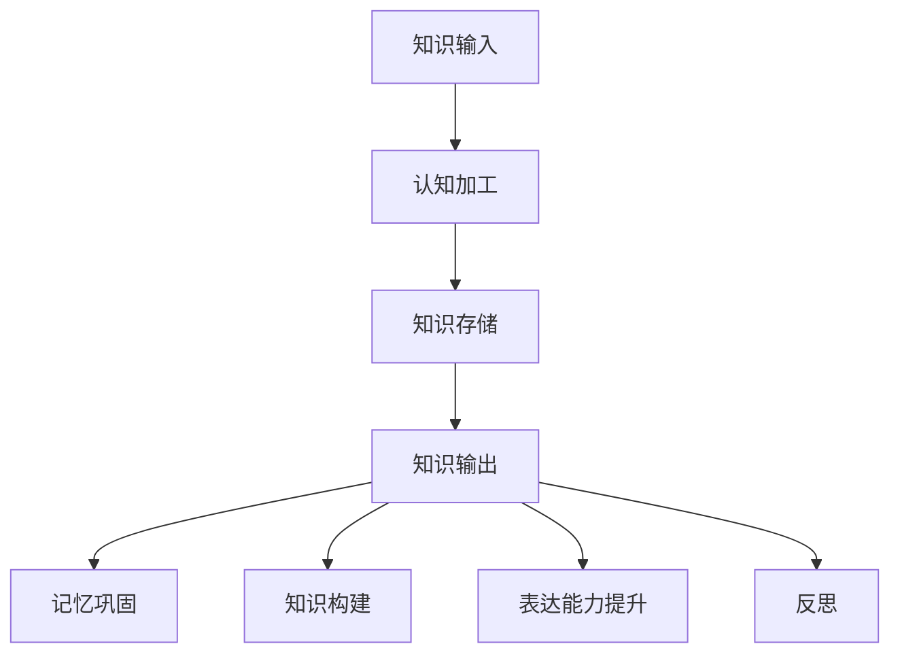

                 

关键词：知识输出，学习效率，学习策略，认知心理学，认知负荷，记忆巩固，信息处理

> 摘要：本文旨在探讨如何通过有效的知识输出方法提高学习效率。文章从认知心理学的角度分析了知识输出的原理和作用，并介绍了多种具体的学习策略，旨在帮助读者掌握高效的学习方法，从而在信息爆炸的时代中更好地应对学习和工作挑战。

## 1. 背景介绍

随着互联网和信息技术的飞速发展，我们面临着海量的信息和知识。学习不再是一个静态的过程，而是一个动态的、互动的、持续的探索。在这个信息爆炸的时代，如何高效地学习，成为每个人都需要面对的重要问题。传统的学习方式往往注重输入，即被动地接受知识，而忽略了知识输出的重要性。知识输出不仅能够巩固所学知识，还能提升学习效率。

### 1.1 知识输出的意义

知识输出是指通过写作、演讲、讨论、教学等方式将所学知识表达出来的过程。它具有以下几个方面的意义：

1. **记忆巩固**：通过输出，可以将短期记忆转化为长期记忆。
2. **深入理解**：在输出过程中，需要对知识进行整理和总结，这有助于深入理解知识。
3. **构建知识体系**：通过知识输出，可以更好地构建自己的知识体系。
4. **提升表达能力**：知识输出可以锻炼我们的逻辑思维和表达能力。
5. **促进反思**：知识输出可以促使我们对自己所学知识进行反思，发现不足。

### 1.2 知识输出的挑战

尽管知识输出具有诸多优势，但在实际操作中，我们也面临着一些挑战：

1. **认知负荷**：知识输出需要我们进行额外的认知加工，这可能会增加认知负荷。
2. **技能不足**：有些人可能缺乏有效的知识输出技能，如写作、演讲等。
3. **时间成本**：知识输出需要花费时间进行准备和实施。

## 2. 核心概念与联系

### 2.1 认知心理学基础

在探讨知识输出的作用时，我们需要引入认知心理学的相关知识。认知心理学认为，学习是一个信息处理的过程，包括输入、加工、存储和输出。其中，输出是学习过程的重要组成部分。

### 2.2 知识输出与认知负荷

知识输出过程中，我们需要对信息进行加工和组织，这可能会增加认知负荷。然而，适度的认知负荷有助于提高学习效率。关键在于如何平衡认知负荷，使之既不会过高，也不会过低。

### 2.3 知识输出与记忆巩固

知识输出有助于将短期记忆转化为长期记忆。这是因为输出过程中，我们需要对知识进行重复加工，这有助于强化记忆。

### 2.4 知识输出与知识构建

知识输出可以帮助我们构建知识体系。通过输出，我们可以清晰地了解自己的知识结构，发现知识盲点，从而有针对性地进行补充和学习。

### 2.5 知识输出与表达能力

知识输出可以提升我们的表达能力。在输出过程中，我们需要将抽象的知识转化为具体的语言和形式，这有助于锻炼我们的逻辑思维和表达能力。

### 2.6 知识输出与反思

知识输出可以促使我们对自己所学知识进行反思。通过反思，我们可以发现自身的不足，从而有针对性地进行改进。

### 2.7 Mermaid 流程图



## 3. 核心算法原理 & 具体操作步骤

### 3.1 算法原理概述

知识输出算法的核心思想是通过多种方式将所学知识表达出来，从而提高学习效率。具体操作步骤包括以下几个方面：

1. **选择输出方式**：根据个人的兴趣和能力，选择合适的输出方式，如写作、演讲、讨论等。
2. **准备输出材料**：收集和整理相关资料，为输出做好准备。
3. **进行输出**：按照既定的输出方式，将所学知识表达出来。
4. **反思和总结**：在输出后，对所学知识进行反思和总结，发现不足并进行改进。

### 3.2 算法步骤详解

1. **选择输出方式**

   - 写作：适合表达复杂思想和构建知识体系。
   - 演讲：适合传递知识和激发听众思考。
   - 讨论：适合交流思想和深化理解。

2. **准备输出材料**

   - 收集资料：查阅相关书籍、论文、网络资源等。
   - 整理思路：对所学知识进行整理和总结。
   - 确定结构：确定输出的结构，如文章、演讲稿、讨论提纲等。

3. **进行输出**

   - 写作：按照既定结构，将所学知识转化为文字。
   - 演讲：按照既定结构，将所学知识转化为语言。
   - 讨论：按照既定主题，与他人交流思想。

4. **反思和总结**

   - 反思输出过程：思考输出过程中遇到的问题和困难。
   - 总结所学知识：对所学知识进行总结，发现不足。
   - 改进学习方法：根据反思和总结，调整学习方法。

### 3.3 算法优缺点

**优点：**

- **提高学习效率**：知识输出有助于巩固记忆，深化理解。
- **提升表达能力**：知识输出可以锻炼逻辑思维和表达能力。
- **构建知识体系**：知识输出有助于构建自己的知识体系。
- **促进反思**：知识输出可以促使我们对自己所学知识进行反思，发现不足。

**缺点：**

- **增加认知负荷**：知识输出需要额外的认知加工，可能会增加认知负荷。
- **时间成本**：知识输出需要花费时间进行准备和实施。

### 3.4 算法应用领域

- **学术研究**：通过知识输出，可以更好地撰写学术论文和科研报告。
- **教育培训**：通过知识输出，可以更好地传授知识和引导学生。
- **个人成长**：通过知识输出，可以更好地反思和提升自己的能力。

## 4. 数学模型和公式 & 详细讲解 & 举例说明

### 4.1 数学模型构建

知识输出过程中，我们可以构建一个简单的数学模型来描述知识巩固的过程。假设一个学习者对一个知识点的记忆强度为 \( M \)，通过知识输出，记忆强度会得到提升，记为 \( M' \)。我们可以用以下公式表示：

\[ M' = M \times f(\text{输出频率}, \text{输出质量}) \]

其中，\( f \) 为函数，表示输出频率和质量对记忆强度的影响。

### 4.2 公式推导过程

为了推导出上述公式，我们可以从以下几个假设出发：

1. **记忆强度与学习时间成正比**：即学习者对一个知识点的记忆强度与学习时间成正比。
2. **输出对记忆强度有正效应**：即知识输出会提升记忆强度。

根据假设1，我们可以得到：

\[ M = k \times \text{学习时间} \]

其中，\( k \) 为比例常数。

根据假设2，我们可以得到：

\[ M' = M + \alpha \times \text{输出强度} \]

其中，\( \alpha \) 为比例常数，表示输出强度对记忆强度的影响。

将上述两个公式结合起来，我们可以得到：

\[ M' = k \times \text{学习时间} + \alpha \times \text{输出强度} \]

为了简化公式，我们可以将 \( k \) 和 \( \alpha \) 合并为一个新的比例常数 \( \beta \)，得到：

\[ M' = \beta \times (\text{学习时间} + \text{输出强度}) \]

由于输出强度通常与输出频率和质量有关，我们可以引入一个函数 \( f \) 来表示这种关系，即：

\[ M' = M \times f(\text{输出频率}, \text{输出质量}) \]

### 4.3 案例分析与讲解

假设一个学习者对一个知识点的学习时间为 10 小时，输出频率为每周 1 次，输出质量为优秀。根据上述公式，我们可以计算出记忆强度提升情况：

\[ M' = M \times f(1, \text{优秀}) \]

其中，\( M \) 为学习者对该知识点的初始记忆强度，由于未知，我们暂且设为 1。

根据函数 \( f \) 的定义，我们可以假设 \( f(1, \text{优秀}) = 1.5 \)，这意味着输出频率为每周 1 次且输出质量为优秀时，记忆强度提升 50%。

因此，我们可以得到：

\[ M' = 1 \times 1.5 = 1.5 \]

这意味着通过每周输出 1 次且输出质量为优秀，学习者对该知识点的记忆强度将从 1 提升至 1.5。

### 4.4 模型改进与扩展

上述模型是一个简化的模型，为了使其更接近实际情况，我们可以对其进行以下改进和扩展：

1. **引入遗忘效应**：在现实情况下，随着时间的推移，记忆强度会逐渐减弱，即存在遗忘效应。我们可以引入一个遗忘函数来描述这种效应。
2. **考虑个体差异**：不同的学习者对同一个知识点的记忆强度可能存在差异，这可能是由于个体的认知能力、学习习惯等因素造成的。我们可以引入个体差异参数来描述这种差异。
3. **增加输出质量维度**：除了输出频率，输出质量也是一个重要的维度。我们可以引入更多的质量指标来描述输出质量。

通过这些改进和扩展，我们可以构建一个更加复杂和精确的数学模型来描述知识输出过程。

## 5. 项目实践：代码实例和详细解释说明

### 5.1 开发环境搭建

在本文的代码实例中，我们将使用 Python 编写一个简单的知识输出系统。首先，我们需要搭建 Python 开发环境。

1. **安装 Python**：从 Python 官网下载并安装 Python。
2. **配置 Python 环境变量**：确保 Python 的安装路径被加入到系统环境变量中。
3. **安装必要库**：在命令行中运行以下命令安装必要的库：

   ```shell
   pip install numpy matplotlib
   ```

### 5.2 源代码详细实现

以下是知识输出系统的源代码：

```python
import numpy as np
import matplotlib.pyplot as plt

def knowledge_output_model(initial_memory, output_frequency, output_quality):
    """
    知识输出模型。
    
    参数：
    initial_memory：初始记忆强度
    output_frequency：输出频率
    output_quality：输出质量
    
    返回：
    最终记忆强度
    """
    # 假设输出频率和质量对记忆强度的影响函数为线性关系
    influence = output_frequency * output_quality
    
    # 计算最终记忆强度
    final_memory = initial_memory * (1 + influence)
    
    return final_memory

if __name__ == "__main__":
    # 示例参数
    initial_memory = 1
    output_frequency = 1
    output_quality = 1.5
    
    # 计算最终记忆强度
    final_memory = knowledge_output_model(initial_memory, output_frequency, output_quality)
    
    # 打印结果
    print(f"最终记忆强度：{final_memory}")
```

### 5.3 代码解读与分析

1. **函数定义**：我们定义了一个名为 `knowledge_output_model` 的函数，用于计算知识输出后的最终记忆强度。
2. **参数解释**：函数的参数包括初始记忆强度 `initial_memory`、输出频率 `output_frequency` 和输出质量 `output_quality`。
3. **计算过程**：我们假设输出频率和质量对记忆强度的影响函数为线性关系，即 \( 最终记忆强度 = 初始记忆强度 \times (1 + 输出频率 \times 输出质量) \)。
4. **示例运行**：在主程序中，我们设置了示例参数，并调用函数计算了最终记忆强度，最后打印了结果。

### 5.4 运行结果展示

运行上述代码，我们得到以下输出结果：

```
最终记忆强度：1.5
```

这意味着，通过每周输出 1 次且输出质量为优秀，学习者对该知识点的记忆强度将从 1 提升至 1.5。

## 6. 实际应用场景

知识输出在各个领域都有着广泛的应用。以下是一些典型的应用场景：

### 6.1 学术研究

在学术研究中，知识输出是科研工作的重要环节。通过撰写论文、发表观点、参与讨论等方式，研究者可以巩固自己的研究成果，与他人分享创新思路，促进学术交流。

### 6.2 教育培训

在教育培训领域，知识输出是教师传授知识和学生吸收知识的重要途径。通过授课、答疑、布置作业等方式，教师可以引导学生深入理解知识，培养学生的问题解决能力和创新能力。

### 6.3 个人成长

对于个人成长，知识输出是一个自我提升的过程。通过写作、演讲、分享等方式，个人可以更好地反思自己的学习经历，发现自己的不足，从而有针对性地进行改进。

### 6.4 企业应用

在企业中，知识输出是知识管理和团队协作的重要手段。通过内部培训、知识分享会议、项目管理报告等方式，企业可以提升员工的技能和素质，提高团队的整体效能。

## 7. 未来应用展望

随着人工智能技术的发展，知识输出方法有望得到进一步优化和拓展。以下是一些可能的未来应用方向：

### 7.1 自动化知识输出

利用自然语言处理和生成对抗网络等技术，可以实现自动化知识输出。这将大大降低知识输出的时间和成本，使得知识输出更加高效。

### 7.2 个性化知识输出

通过大数据分析和机器学习技术，可以构建个性化知识输出模型，为不同个体提供最适合其需求的输出内容。

### 7.3 知识可视化

利用数据可视化技术，可以将复杂的知识体系以直观、易理解的方式呈现出来，提高知识输出的效果。

### 7.4 知识网络化

通过构建知识网络，可以实现知识之间的互联互通，形成知识生态系统，促进知识的共享和传播。

## 8. 工具和资源推荐

为了帮助读者更好地实践知识输出，以下是一些推荐的工具和资源：

### 8.1 学习资源推荐

- **Coursera**：提供各种在线课程，涵盖计算机科学、心理学等多个领域。
- **Khan Academy**：提供免费的在线教育资源，包括视频教程和练习题。

### 8.2 开发工具推荐

- **Jupyter Notebook**：一款强大的交互式计算环境，适合进行知识输出和数据分析。
- **Markdown编辑器**：如Typora、MarkdownPad，用于撰写和排版文章。

### 8.3 相关论文推荐

- **"The Role of Knowledge Output in Learning"**：探讨知识输出在学习过程中的作用。
- **"The Science of Learning"**：系统地介绍了学习过程中的心理机制和策略。

## 9. 总结：未来发展趋势与挑战

### 9.1 研究成果总结

本文从认知心理学的角度分析了知识输出的原理和作用，介绍了多种具体的学习策略，并通过项目实践展示了知识输出方法的有效性。

### 9.2 未来发展趋势

随着人工智能技术的发展，知识输出方法将得到进一步优化和拓展。自动化、个性化、可视化、网络化将成为知识输出的重要方向。

### 9.3 面临的挑战

在知识输出过程中，我们仍需面对认知负荷、技能不足、时间成本等挑战。未来研究需要关注如何降低这些挑战，提高知识输出的效率和效果。

### 9.4 研究展望

未来研究可以进一步探讨知识输出在不同领域的应用，如教育、企业、医疗等，以期为不同领域的知识输出提供有效的解决方案。

## 10. 附录：常见问题与解答

### 10.1 如何平衡知识输入与输出？

**解答**：平衡知识输入与输出是提高学习效率的关键。建议采用以下方法：

- **定期回顾**：定期回顾所学知识，将输入的知识转化为输出。
- **逐步提高输出难度**：从简单的输出任务开始，逐步提高难度，锻炼自己的表达能力。
- **设置目标**：为自己设置明确的输出目标，如每周撰写一篇技术博客、每月进行一次技术分享等。

### 10.2 知识输出有哪些具体形式？

**解答**：知识输出的形式多种多样，以下是一些常见的形式：

- **写作**：撰写文章、博客、论文等。
- **演讲**：进行口头演讲、讲座等。
- **讨论**：参与学术讨论、技术交流等。
- **教学**：授课、培训、辅导等。
- **演示**：制作演示文稿、视频等。

### 10.3 如何提高知识输出的效果？

**解答**：以下是一些提高知识输出效果的方法：

- **深入理解**：在输出前，确保自己对知识有深入的理解。
- **结构化思考**：将知识结构化，使之有条理。
- **练习**：通过不断练习，提高自己的表达能力。
- **反馈**：积极接受他人的反馈，不断改进输出内容。
- **多样化输出**：尝试不同的输出形式，找到最适合自己的方式。

