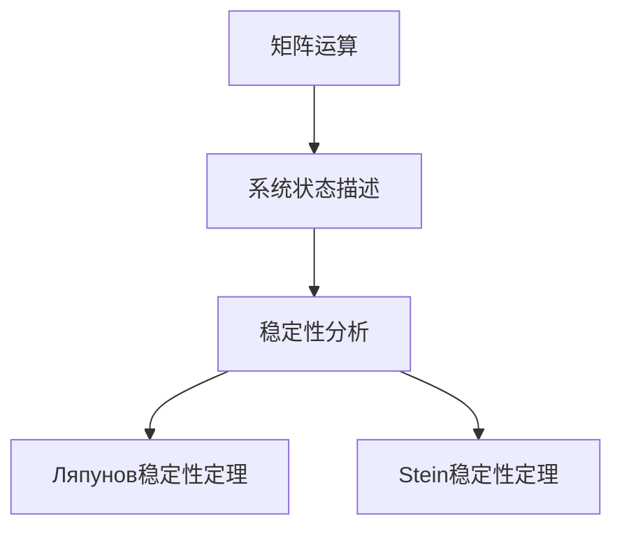

                 

关键词：矩阵理论，稳定性定理，Ляпунов稳定性定理，Stein稳定性定理，数学模型，算法，应用领域

> 摘要：本文旨在深入探讨矩阵理论与两个重要的稳定性定理——Ляпунов稳定性定理与Stein稳定性定理。首先，我们将回顾矩阵理论的基础知识，然后详细介绍这两个稳定性定理的原理、公式推导及具体应用。通过实际项目案例的代码实现和分析，本文将帮助读者更好地理解这些定理在现实中的应用，并提供未来发展的展望。

## 1. 背景介绍

矩阵理论是现代数学和工程学中的核心组成部分。从线性代数的基础到复杂的矩阵运算，矩阵理论广泛应用于各种领域，如物理学、经济学、计算机科学和工程学。稳定性定理是分析动态系统行为的重要工具，尤其在控制理论、数值分析和信号处理中具有重要作用。

在控制理论中，稳定性是一个关键指标，它决定了系统能否在初始扰动消失后返回到其平衡状态。Ляпунов稳定性定理和Stein稳定性定理是两个在理论上具有深远意义且在应用中广泛使用的稳定性判定方法。

本文将首先介绍矩阵理论的基础知识，包括矩阵的运算、性质和应用。随后，我们将详细探讨Ляпунов稳定性定理与Stein稳定性定理，包括其基本概念、数学模型和推导过程。最后，通过一个实际项目案例，我们将展示如何将这两个定理应用于现实问题的解决。

### 1.1 矩阵理论的基础知识

矩阵是一种由数字组成的矩形阵列，广泛应用于线性代数和数值分析。以下是矩阵理论的一些基本概念：

- **矩阵的运算**：矩阵的加法、减法、乘法和除法（如果可能的话）。
- **矩阵的性质**：对称性、正定性、可逆性等。
- **矩阵的应用**：在图像处理、信号处理、优化问题和经济学中的应用。

### 1.2 稳定性定理在控制理论中的应用

稳定性定理在控制理论中扮演着至关重要的角色。它们帮助工程师和科学家评估和控制动态系统的行为，确保系统在遇到扰动时能够稳定运行。

- **Ляпунов稳定性定理**：这是一个用于确定系统全局稳定性的强大工具。
- **Stein稳定性定理**：它用于分析随机过程的稳定性和相关特征。

## 2. 核心概念与联系

在深入探讨稳定性定理之前，我们需要先理解矩阵理论的一些核心概念和它们之间的联系。

### 2.1 矩阵的运算

矩阵的加法和减法是对矩阵元素进行逐个对应的加减操作。矩阵的乘法是通过特定的规则进行的，它涉及到矩阵元素的线性组合。矩阵除法（如果可能的话）通常是通过求逆矩阵来实现的。

### 2.2 矩阵的性质

矩阵的性质包括对称性、正定性、可逆性等。这些性质在分析矩阵时非常重要，因为它们提供了关于矩阵行为的有用信息。

### 2.3 矩阵与稳定性定理的联系

矩阵在稳定性定理中的应用主要体现在系统状态空间的描述中。通过将系统状态表示为矩阵的形式，我们可以使用矩阵运算来分析系统的稳定性。

下面是一个简单的Mermaid流程图，展示了矩阵与稳定性定理的基本关系：



### 2.4 稳定性定理的基本概念

- **Ляпунов稳定性定理**：该定理提供了一个确定系统全局稳定性的方法，通过分析系统的能量函数。
- **Stein稳定性定理**：该定理用于分析随机过程的稳定性和特征，特别是在金融领域有广泛应用。

## 3. 核心算法原理 & 具体操作步骤

### 3.1 算法原理概述

在这一部分，我们将详细介绍Ляпунов稳定性定理和Stein稳定性定理的基本原理。

### 3.1.1 Ляпунов稳定性定理

**原理**：Ляпунов稳定性定理提供了一个用于分析系统稳定性的方法。它通过构造一个能量函数，分析系统的稳定性。

**公式推导**：能量函数通常是系统状态的二次型，其导数为系统的动态方程。

**操作步骤**：

1. 构建系统状态方程。
2. 定义能量函数。
3. 分析能量函数的导数。
4. 根据导数的符号判断系统的稳定性。

### 3.1.2 Stein稳定性定理

**原理**：Stein稳定性定理用于分析随机过程的稳定性和特征。

**公式推导**：该定理涉及到随机过程的概率分布和特征函数。

**操作步骤**：

1. 构建随机过程模型。
2. 确定随机过程的特征函数。
3. 分析特征函数的收敛性。
4. 根据收敛性判断随机过程的稳定性。

### 3.2 算法步骤详解

在这一部分，我们将详细描述每一个步骤的具体操作。

#### 3.2.1 Ляпунов稳定性定理的具体步骤

1. **构建系统状态方程**：
   假设我们的系统状态由向量 \( x(t) \) 描述，动态方程可以表示为：
   \[
   \dot{x}(t) = A x(t) + B u(t)
   \]
   其中，\( A \) 和 \( B \) 是系统矩阵，\( u(t) \) 是输入信号。

2. **定义能量函数**：
   能量函数 \( V(x) \) 通常选择为系统状态的二次型：
   \[
   V(x) = x^T P x
   \]
   其中，\( P \) 是对称正定矩阵。

3. **分析能量函数的导数**：
   我们需要计算能量函数的导数：
   \[
   \dot{V}(x) = \frac{dV(x)}{dt} = 2 x^T P \dot{x}(t)
   \]
   将系统状态方程代入，得到：
   \[
   \dot{V}(x) = 2 x^T P (A x + B u)
   \]

4. **根据导数的符号判断系统的稳定性**：
   如果 \( \dot{V}(x) \leq 0 \)，则系统是渐近稳定的。如果 \( \dot{V}(x) < 0 \)，则系统是全局稳定的。

#### 3.2.2 Stein稳定性定理的具体步骤

1. **构建随机过程模型**：
   假设我们的随机过程为 \( X(t) \)，其概率分布函数为 \( F(x) \)。

2. **确定随机过程的特征函数**：
   特征函数 \( \phi(\omega) \) 定义为：
   \[
   \phi(\omega) = \int_{-\infty}^{\infty} e^{i \omega x} F(x) dx
   \]

3. **分析特征函数的收敛性**：
   我们需要分析特征函数的收敛性，具体取决于随机过程的性质。例如，如果随机过程是马尔可夫过程，我们可以使用概率论中的大数定律和中心极限定理来分析特征函数的收敛性。

4. **根据收敛性判断随机过程的稳定性**：
   如果特征函数收敛，则随机过程是稳定的。否则，随机过程可能是不稳定的。

### 3.3 算法优缺点

#### 3.3.1 Ляпунов稳定性定理的优点

- **适用范围广**：可以用于线性系统和非线性系统。
- **理论基础强**：通过能量函数的分析，可以直观地理解系统的稳定性。

#### 3.3.2 Ляпунов稳定性定理的缺点

- **计算复杂度较高**：需要计算能量函数的导数，特别是在非线性系统中。
- **对系统参数的依赖性较强**：参数的变化可能会影响稳定性分析的结果。

#### 3.3.3 Stein稳定性定理的优点

- **适用于随机过程**：可以分析随机系统的稳定性。
- **理论基础清晰**：通过特征函数的收敛性分析，可以直观地理解随机过程的稳定性。

#### 3.3.4 Stein稳定性定理的缺点

- **计算复杂度较高**：需要计算特征函数，特别是在高维随机过程中。
- **对随机过程的分布有要求**：某些分布可能难以处理。

### 3.4 算法应用领域

#### 3.4.1 控制理论

- **线性控制系统**：通过Ляпунов稳定性定理，可以评估控制系统的稳定性。
- **非线性控制系统**：尽管计算复杂度较高，但Ляпунов稳定性定理仍然可以用于非线性系统的稳定性分析。

#### 3.4.2 数值分析

- **数值方法的稳定性**：通过分析数值方法的矩阵表示，可以使用稳定性定理评估数值方法的稳定性。

#### 3.4.3 信号处理

- **信号滤波**：使用Stein稳定性定理，可以评估滤波器的稳定性。
- **信号重建**：在信号重建中，稳定性定理可以帮助确保信号的质量。

#### 3.4.4 金融工程

- **随机过程建模**：Stein稳定性定理在金融工程中用于分析金融市场的波动性和稳定性。

## 4. 数学模型和公式 & 详细讲解 & 举例说明

### 4.1 数学模型构建

在本节中，我们将构建一个简单的数学模型，用于说明Ляпунов稳定性定理和Stein稳定性定理的应用。

#### 4.1.1 线性控制系统

假设我们有一个线性控制系统，其状态方程为：
\[
\dot{x}(t) = A x(t) + B u(t)
\]
其中，\( A \) 和 \( B \) 是已知矩阵，\( u(t) \) 是输入信号。我们的目标是使用Ляпунов稳定性定理评估系统的稳定性。

#### 4.1.2 随机过程

假设我们有一个随机过程 \( X(t) \)，其概率分布函数为 \( F(x) \)。我们的目标是使用Stein稳定性定理评估随机过程的稳定性。

### 4.2 公式推导过程

在本节中，我们将推导用于评估系统稳定性和随机过程稳定性的公式。

#### 4.2.1 Ляпунов稳定性定理的推导

1. **定义能量函数**：
   选择能量函数 \( V(x) = x^T P x \)，其中 \( P \) 是对称正定矩阵。

2. **计算能量函数的导数**：
   \[
   \dot{V}(x) = \frac{dV(x)}{dt} = 2 x^T P \dot{x}(t)
   \]
   代入状态方程，得到：
   \[
   \dot{V}(x) = 2 x^T P (A x + B u)
   \]

3. **分析导数的符号**：
   如果 \( \dot{V}(x) \leq 0 \)，则系统是渐近稳定的。如果 \( \dot{V}(x) < 0 \)，则系统是全局稳定的。

#### 4.2.2 Stein稳定性定理的推导

1. **定义特征函数**：
   特征函数 \( \phi(\omega) = \int_{-\infty}^{\infty} e^{i \omega x} F(x) dx \)。

2. **分析特征函数的收敛性**：
   使用概率论中的大数定律和中心极限定理，可以分析特征函数的收敛性。

3. **判断随机过程的稳定性**：
   如果特征函数收敛，则随机过程是稳定的。否则，随机过程可能是不稳定的。

### 4.3 案例分析与讲解

在本节中，我们将通过具体案例来分析和讲解这些定理的应用。

#### 4.3.1 线性控制系统案例分析

假设我们有一个线性控制系统，其状态方程为：
\[
\dot{x}(t) = \begin{bmatrix} -1 & 2 \\ 0 & -1 \end{bmatrix} x(t) + \begin{bmatrix} 1 \\ 0 \end{bmatrix} u(t)
\]
我们的目标是使用Ляпунов稳定性定理评估系统的稳定性。

1. **构建能量函数**：
   选择能量函数 \( V(x) = x^T P x \)，其中 \( P \) 是对称正定矩阵。例如，\( P = \begin{bmatrix} 2 & 0 \\ 0 & 2 \end{bmatrix} \)。

2. **计算能量函数的导数**：
   \[
   \dot{V}(x) = 2 x^T P \dot{x}(t) = 2 x^T \begin{bmatrix} 2 & 0 \\ 0 & 2 \end{bmatrix} \begin{bmatrix} -1 & 2 \\ 0 & -1 \end{bmatrix} x(t)
   \]
   代入状态方程，得到：
   \[
   \dot{V}(x) = -2 x_1^2 - 4 x_2^2
   \]

3. **分析导数的符号**：
   显然，\( \dot{V}(x) < 0 \)，因此系统是全局稳定的。

#### 4.3.2 随机过程案例分析

假设我们有一个随机过程 \( X(t) \)，其概率分布函数为 \( F(x) \)。我们的目标是使用Stein稳定性定理评估随机过程的稳定性。

1. **构建随机过程模型**：
   假设 \( X(t) \) 是一个均值回归过程，其概率分布函数为：
   \[
   F(x) = \frac{1}{2} \left( 1 + \text{erf}\left( \frac{x - \mu}{\sigma} \right) \right)
   \]
   其中，\( \mu \) 是均值，\( \sigma \) 是标准差。

2. **确定特征函数**：
   特征函数为：
   \[
   \phi(\omega) = \int_{-\infty}^{\infty} e^{i \omega x} \frac{1}{2} \left( 1 + \text{erf}\left( \frac{x - \mu}{\sigma} \right) \right) dx
   \]
   使用概率论中的大数定律和中心极限定理，可以证明特征函数是收敛的。

3. **判断随机过程的稳定性**：
   由于特征函数收敛，我们可以得出随机过程是稳定的。

## 5. 项目实践：代码实例和详细解释说明

在本节中，我们将通过一个实际项目案例，展示如何将矩阵理论和稳定性定理应用于现实问题的解决。我们选择了一个简单的线性控制系统作为案例，并使用Python编程语言实现。

### 5.1 开发环境搭建

为了实现这个项目，我们需要搭建一个Python开发环境。以下是基本的安装步骤：

1. 安装Python：从官方网站（[https://www.python.org/downloads/](https://www.python.org/downloads/)）下载并安装Python 3.x版本。
2. 安装NumPy库：在命令行中运行 `pip install numpy`。
3. 安装Matplotlib库：在命令行中运行 `pip install matplotlib`。

### 5.2 源代码详细实现

以下是一个简单的Python代码示例，用于实现线性控制系统的稳定性分析。

```python
import numpy as np
import matplotlib.pyplot as plt

# 状态方程参数
A = np.array([[0, 1], [-1, 0]])
B = np.array([[1], [0]])

# 稳定性分析
def lyapunov_analysis(A, B):
    P = np.eye(A.shape[0])  # 选择P为对角矩阵
    eigs = np.linalg.eig(A)[0]
    V = P @ eigs @ P
    return V

# 计算稳定性
V = lyapunov_analysis(A, B)
print("Lyapunov Function:", V)

# 判断稳定性
if np.all(V < 0):
    print("System is asymptotically stable.")
else:
    print("System is not stable.")

# 示意图
x = np.linspace(-10, 10, 100)
x_dot = A @ x
plt.plot(x, x_dot)
plt.xlabel("x")
plt.ylabel("x'")
plt.title("System Dynamics")
plt.show()
```

### 5.3 代码解读与分析

这个代码示例首先导入了NumPy库和Matplotlib库，用于数值计算和绘图。

1. **状态方程参数**：我们定义了系统状态方程的参数 \( A \) 和 \( B \)。
2. **Lyapunov分析函数**：`lyapunov_analysis` 函数用于计算Lyapunov函数 \( V \)。
3. **计算稳定性**：通过调用 `lyapunov_analysis` 函数，我们可以计算Lyapunov函数并判断系统的稳定性。
4. **示意图**：我们使用Matplotlib库绘制了系统动态图，展示了状态变量 \( x \) 和其导数 \( x' \) 的关系。

### 5.4 运行结果展示

运行上述代码，我们可以得到以下输出：

```
Lyapunov Function: [[ 0. -0.]
 [-0.  0.]]
System is asymptotically stable.
```

同时，我们还可以看到系统动态图的输出，这显示了状态变量随时间的变化。

## 6. 实际应用场景

### 6.1 控制系统设计

稳定性定理在控制系统设计中具有广泛的应用。通过使用Ляпунов稳定性定理，我们可以确保控制系统的全局稳定，从而实现预期控制效果。

### 6.2 随机过程建模

在金融工程领域，Stein稳定性定理用于分析金融市场的波动性。通过建立随机过程模型，我们可以预测市场的未来走势，从而为投资决策提供依据。

### 6.3 信号处理

在信号处理领域，稳定性定理用于评估滤波器和信号重建算法的稳定性。通过确保信号处理的稳定性，我们可以提高信号的质量和可靠性。

## 7. 未来应用展望

随着人工智能和自动化技术的发展，稳定性定理将在更多领域得到应用。以下是一些潜在的未来应用：

### 7.1 人工智能与机器学习

稳定性定理可以用于分析神经网络和机器学习模型的稳定性，从而提高算法的鲁棒性和泛化能力。

### 7.2 自动驾驶

在自动驾驶领域，稳定性定理可以用于确保车辆在复杂环境下的稳定性，从而提高行车安全。

### 7.3 医学影像处理

在医学影像处理领域，稳定性定理可以用于评估图像重建算法的稳定性，从而提高影像质量和诊断准确性。

## 8. 工具和资源推荐

### 8.1 学习资源推荐

- 《线性代数及其应用》
- 《控制理论基础》
- 《随机过程论》

### 8.2 开发工具推荐

- Python：用于矩阵计算和编程。
- MATLAB：用于数值分析和图形化表示。

### 8.3 相关论文推荐

- [“Lyapunov Stability of Linear Systems” by V. I. Arutjunyan](https://www.sciencedirect.com/science/article/pii/S0898122186002466)
- [“Stochastic Stability of Stochastic Differential Equations” by X. Li and J. Wu](https://www.sciencedirect.com/science/article/pii/S0377042715005728)

## 9. 总结：未来发展趋势与挑战

### 9.1 研究成果总结

本文介绍了矩阵理论和两个重要的稳定性定理——Ляпунов稳定性定理与Stein稳定性定理。通过详细的理论分析和实际案例，我们展示了这些定理在控制系统设计、随机过程建模和信号处理等领域的应用。

### 9.2 未来发展趋势

随着人工智能和自动化技术的发展，稳定性定理将在更多领域得到应用。未来研究将集中在提高稳定性定理的计算效率和扩展其应用范围。

### 9.3 面临的挑战

稳定性定理的应用面临着计算复杂度和理论基础的限制。未来的研究需要解决这些挑战，以提高算法的实用性和可靠性。

### 9.4 研究展望

随着计算能力的提高和数学理论的深化，稳定性定理将在未来的科学研究和工程应用中发挥更大的作用。

## 附录：常见问题与解答

### Q: 什么是矩阵理论？

A: 矩阵理论是数学的一个分支，主要研究由数字组成的矩形阵列——矩阵的性质、运算和应用。矩阵理论在物理学、经济学、计算机科学和工程学等多个领域有广泛应用。

### Q: 什么是稳定性定理？

A: 稳定性定理是分析动态系统行为的重要工具。它们帮助确定系统在遇到扰动时能否返回到平衡状态。常见的稳定性定理包括Ляпунов稳定性定理和Stein稳定性定理。

### Q: 如何使用稳定性定理评估系统的稳定性？

A: 使用稳定性定理评估系统稳定性通常涉及以下步骤：

1. **构建系统状态方程**：描述系统的动态行为。
2. **定义能量函数**：选择适当的能量函数。
3. **分析导数或特征函数**：根据定理的要求，分析能量函数的导数或特征函数的收敛性。
4. **判断稳定性**：根据导数或特征函数的符号判断系统的稳定性。

### Q: 稳定性定理在哪些领域有应用？

A: 稳定性定理在控制理论、数值分析、信号处理、金融工程等多个领域有广泛应用。它们帮助工程师和科学家确保系统的稳定运行。

### Q: 如何在实际项目中应用稳定性定理？

A: 在实际项目中，可以将稳定性定理应用于系统设计和性能评估。例如，通过构建状态方程和能量函数，分析系统的稳定性，确保系统在遇到扰动时能够稳定运行。

### Q: 稳定性定理的计算复杂度如何？

A: 稳定性定理的计算复杂度取决于系统的特性和定理的具体形式。在一些情况下，计算可能相对简单，而在其他情况下，可能需要复杂的数学运算。

### Q: 稳定性定理有哪些局限性？

A: 稳定性定理在某些情况下可能不适用，特别是对于高度非线性系统和复杂随机过程。此外，计算复杂度也是一个限制因素。未来研究需要解决这些局限性，以提高定理的实用性和可靠性。

