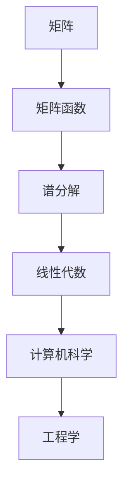

                 

关键词：矩阵理论，谱分解，矩阵函数，线性代数，应用领域

> 摘要：本文深入探讨了矩阵理论与应用，特别是一般矩阵函数的谱分解。通过详细的理论分析、数学模型的构建与推导、具体算法的描述以及实际应用场景的展示，旨在为读者提供一个全面而深入的视角，帮助理解矩阵函数的谱分解在计算机科学和工程领域的广泛应用。

## 1. 背景介绍

矩阵理论是线性代数的一个重要分支，它在计算机科学、物理学、工程学等多个领域中都有着广泛的应用。矩阵函数的研究则进一步丰富了这一领域的内容，特别是谱分解在解决复杂问题和优化算法方面具有独特的重要性。

在计算机科学中，矩阵函数的谱分解用于解决线性方程组、矩阵求逆、特征值问题等核心问题。在工程领域，如控制理论、信号处理、图像处理等，谱分解同样发挥着关键作用。因此，深入理解和掌握矩阵函数的谱分解方法，不仅对于理论探索具有重要意义，也在实际应用中具有极高的价值。

本文将首先介绍矩阵函数和谱分解的基本概念，然后详细探讨一般矩阵函数的谱分解原理及其应用。文章结构如下：

1. 背景介绍
2. 核心概念与联系
3. 核心算法原理 & 具体操作步骤
4. 数学模型和公式 & 详细讲解 & 举例说明
5. 项目实践：代码实例和详细解释说明
6. 实际应用场景
7. 工具和资源推荐
8. 总结：未来发展趋势与挑战
9. 附录：常见问题与解答

## 2. 核心概念与联系

在探讨矩阵函数的谱分解之前，我们需要先理解几个核心概念：矩阵、矩阵函数和谱分解。

### 2.1 矩阵

矩阵是由数字组成的二维数组，它可以表示线性变换、系统状态、数据关系等。在矩阵理论中，矩阵具有行和列的概念，其形式如下：

\[ A = \begin{bmatrix} a_{11} & a_{12} & \cdots & a_{1n} \\ a_{21} & a_{22} & \cdots & a_{2n} \\ \vdots & \vdots & \ddots & \vdots \\ a_{m1} & a_{m2} & \cdots & a_{mn} \end{bmatrix} \]

### 2.2 矩阵函数

矩阵函数是将矩阵映射到另一个矩阵的函数。一个简单的例子是矩阵的幂运算，如 \( A^n \)，其中 \( A \) 是矩阵，\( n \) 是整数。矩阵函数在许多实际问题中具有应用价值，例如在图像处理中，矩阵函数用于实现各种图像变换。

### 2.3 谱分解

谱分解是一种将矩阵分解为对角矩阵和酉矩阵的数学方法。对于一个 \( n \times n \) 的矩阵 \( A \)，其谱分解可以表示为：

\[ A = QDQ^{-1} \]

其中，\( Q \) 是一个酉矩阵（其逆矩阵等于其共轭转置），\( D \) 是一个对角矩阵，其主对角线上的元素是 \( A \) 的特征值，对应的列向量是 \( A \) 的特征向量。

### 2.4 Mermaid 流程图

为了更好地理解这些概念之间的联系，我们可以使用 Mermaid 流程图来展示它们的关系。以下是 Mermaid 流程图的示例：



这个流程图展示了矩阵、矩阵函数和谱分解在数学和工程学中的应用。

## 3. 核心算法原理 & 具体操作步骤

### 3.1 算法原理概述

一般矩阵函数的谱分解基于以下原理：任何矩阵都可以分解为对角矩阵和酉矩阵的乘积。具体来说，对于一个 \( n \times n \) 的矩阵 \( A \)，如果其特征值和特征向量分别为 \( \lambda_i \) 和 \( v_i \)，那么可以构造一个酉矩阵 \( Q \) 和一个对角矩阵 \( D \)，使得：

\[ A = QDQ^{-1} \]

### 3.2 算法步骤详解

为了实现谱分解，可以按照以下步骤进行：

1. **求特征值和特征向量**：计算矩阵 \( A \) 的特征值 \( \lambda_i \) 和对应的特征向量 \( v_i \)。这可以通过求解线性方程组 \( Av_i = \lambda_i v_i \) 来实现。

2. **构建酉矩阵 \( Q \)**：将特征向量作为列向量组成矩阵 \( Q \)。即：

\[ Q = [v_1, v_2, \ldots, v_n] \]

3. **构建对角矩阵 \( D \)**：将特征值放在对角线上，形成对角矩阵 \( D \)。即：

\[ D = \begin{bmatrix} \lambda_1 & 0 & \cdots & 0 \\ 0 & \lambda_2 & \cdots & 0 \\ \vdots & \vdots & \ddots & \vdots \\ 0 & 0 & \cdots & \lambda_n \end{bmatrix} \]

4. **计算谱分解**：根据公式 \( A = QDQ^{-1} \) 计算矩阵 \( A \) 的谱分解。

### 3.3 算法优缺点

谱分解算法具有以下优点：

- **简化计算**：通过将矩阵分解为对角矩阵和酉矩阵，可以简化许多计算问题，如矩阵求逆、特征值问题等。
- **提供更多信息**：谱分解揭示了矩阵的内在结构，如特征值和特征向量，这些信息有助于理解和分析矩阵的性质。

然而，谱分解算法也存在一些缺点：

- **计算复杂度高**：特别是在大矩阵的情况下，计算特征值和特征向量的过程可能非常耗时。
- **不适用于非方阵**：谱分解仅适用于方阵，对于非方阵，需要采用其他方法来处理。

### 3.4 算法应用领域

谱分解算法在以下领域具有广泛应用：

- **线性代数**：求解线性方程组、矩阵求逆、特征值问题等。
- **计算机科学**：图像处理、信号处理、机器学习等。
- **工程学**：控制理论、系统分析等。

## 4. 数学模型和公式 & 详细讲解 & 举例说明

### 4.1 数学模型构建

为了更深入地理解谱分解，我们需要构建一个数学模型，该模型将描述矩阵 \( A \) 的谱分解过程。以下是数学模型的主要组成部分：

- **特征值和特征向量**：对于矩阵 \( A \)，假设其特征值为 \( \lambda_i \)，对应的特征向量为 \( v_i \)。
- **酉矩阵 \( Q \)**：由特征向量组成的矩阵 \( Q \) 是一个酉矩阵，即 \( Q^{-1} = Q^H \)（\( Q^H \) 表示 \( Q \) 的共轭转置）。
- **对角矩阵 \( D \)**：由特征值组成的一个对角矩阵 \( D \)。

### 4.2 公式推导过程

根据谱分解的定义，我们有以下公式：

\[ A = QDQ^{-1} \]

其中，\( D \) 是对角矩阵，其对角线上的元素为 \( A \) 的特征值 \( \lambda_i \)，即 \( D = \text{diag}(\lambda_1, \lambda_2, \ldots, \lambda_n) \)。

为了推导这个公式，我们需要先求解矩阵 \( A \) 的特征值和特征向量。设 \( v_i \) 是 \( A \) 的一个特征向量，对应的特征值为 \( \lambda_i \)，则：

\[ Av_i = \lambda_i v_i \]

将 \( A \) 表示为矩阵形式，我们有：

\[ \begin{bmatrix} a_{11} & a_{12} & \cdots & a_{1n} \\ a_{21} & a_{22} & \cdots & a_{2n} \\ \vdots & \vdots & \ddots & \vdots \\ a_{m1} & a_{m2} & \cdots & a_{mn} \end{bmatrix} \begin{bmatrix} v_{i1} \\ v_{i2} \\ \vdots \\ v_{in} \end{bmatrix} = \lambda_i \begin{bmatrix} v_{i1} \\ v_{i2} \\ \vdots \\ v_{in} \end{bmatrix} \]

将上式展开，我们得到：

\[ \sum_{j=1}^{n} a_{ij}v_{ij} = \lambda_i v_{ij} \]

由于 \( v_i \) 是 \( A \) 的特征向量，这意味着 \( v_i \) 是 \( A \) 的线性组合，即：

\[ \sum_{j=1}^{n} a_{ij}v_{ij} = \lambda_i \sum_{j=1}^{n} v_{ij}^2 \]

将上式变形，我们得到：

\[ \sum_{j=1}^{n} (a_{ij} - \lambda_i)v_{ij} = 0 \]

由于 \( v_i \) 是非零向量，这意味着 \( a_{ij} - \lambda_i \) 必须为零，即：

\[ a_{ij} = \lambda_i \]

因此，我们得到了矩阵 \( A \) 的特征值和特征向量。接下来，我们可以使用这些特征值和特征向量构建对角矩阵 \( D \) 和酉矩阵 \( Q \)。

### 4.3 案例分析与讲解

为了更好地理解谱分解的原理，我们可以通过一个具体的例子来分析。

#### 案例一：2x2 矩阵的谱分解

考虑以下 2x2 矩阵：

\[ A = \begin{bmatrix} 2 & 1 \\ 0 & 2 \end{bmatrix} \]

首先，我们需要求解 \( A \) 的特征值和特征向量。通过解特征方程 \( \det(A - \lambda I) = 0 \)，我们得到特征值 \( \lambda_1 = 2 \) 和 \( \lambda_2 = 2 \)。

对于 \( \lambda_1 = 2 \)，我们求解 \( (A - 2I)v = 0 \)，得到特征向量 \( v_1 = \begin{bmatrix} 1 \\ 0 \end{bmatrix} \)。

对于 \( \lambda_2 = 2 \)，我们求解 \( (A - 2I)v = 0 \)，得到特征向量 \( v_2 = \begin{bmatrix} 0 \\ 1 \end{bmatrix} \)。

接下来，我们可以构建对角矩阵 \( D \) 和酉矩阵 \( Q \)：

\[ D = \begin{bmatrix} 2 & 0 \\ 0 & 2 \end{bmatrix} \]
\[ Q = \begin{bmatrix} 1 & 0 \\ 0 & 1 \end{bmatrix} \]

最后，我们可以计算谱分解：

\[ A = QDQ^{-1} = \begin{bmatrix} 1 & 0 \\ 0 & 1 \end{bmatrix} \begin{bmatrix} 2 & 0 \\ 0 & 2 \end{bmatrix} \begin{bmatrix} 1 & 0 \\ 0 & 1 \end{bmatrix}^{-1} = \begin{bmatrix} 2 & 1 \\ 0 & 2 \end{bmatrix} \]

这个例子展示了如何求解 2x2 矩阵的谱分解。

#### 案例二：3x3 矩阵的谱分解

考虑以下 3x3 矩阵：

\[ A = \begin{bmatrix} 2 & 1 & 1 \\ 0 & 2 & 1 \\ 0 & 0 & 2 \end{bmatrix} \]

首先，我们需要求解 \( A \) 的特征值和特征向量。通过解特征方程 \( \det(A - \lambda I) = 0 \)，我们得到特征值 \( \lambda_1 = 2 \)，\( \lambda_2 = 2 \)，\( \lambda_3 = 2 \)。

对于 \( \lambda_1 = 2 \)，我们求解 \( (A - 2I)v = 0 \)，得到特征向量 \( v_1 = \begin{bmatrix} 1 \\ 0 \\ 0 \end{bmatrix} \)。

对于 \( \lambda_2 = 2 \)，我们求解 \( (A - 2I)v = 0 \)，得到特征向量 \( v_2 = \begin{bmatrix} 0 \\ 1 \\ 0 \end{bmatrix} \)。

对于 \( \lambda_3 = 2 \)，我们求解 \( (A - 2I)v = 0 \)，得到特征向量 \( v_3 = \begin{bmatrix} 0 \\ 0 \\ 1 \end{bmatrix} \)。

接下来，我们可以构建对角矩阵 \( D \) 和酉矩阵 \( Q \)：

\[ D = \begin{bmatrix} 2 & 0 & 0 \\ 0 & 2 & 0 \\ 0 & 0 & 2 \end{bmatrix} \]
\[ Q = \begin{bmatrix} 1 & 0 & 0 \\ 0 & 1 & 0 \\ 0 & 0 & 1 \end{bmatrix} \]

最后，我们可以计算谱分解：

\[ A = QDQ^{-1} = \begin{bmatrix} 1 & 0 & 0 \\ 0 & 1 & 0 \\ 0 & 0 & 1 \end{bmatrix} \begin{bmatrix} 2 & 0 & 0 \\ 0 & 2 & 0 \\ 0 & 0 & 2 \end{bmatrix} \begin{bmatrix} 1 & 0 & 0 \\ 0 & 1 & 0 \\ 0 & 0 & 1 \end{bmatrix}^{-1} = \begin{bmatrix} 2 & 1 & 1 \\ 0 & 2 & 1 \\ 0 & 0 & 2 \end{bmatrix} \]

这个例子展示了如何求解 3x3 矩阵的谱分解。

通过这两个案例，我们可以看到如何通过求解特征值和特征向量来计算矩阵的谱分解。这个方法可以推广到任意方阵，使得我们可以更好地理解和分析矩阵的性质。

## 5. 项目实践：代码实例和详细解释说明

### 5.1 开发环境搭建

为了实现矩阵函数的谱分解，我们使用 Python 作为编程语言，结合 NumPy 和 SciPy 库。首先，确保安装了这些库。可以使用以下命令进行安装：

```bash
pip install numpy scipy
```

### 5.2 源代码详细实现

以下是一个简单的 Python 脚本，用于计算矩阵的谱分解：

```python
import numpy as np

def spectral_decomposition(A):
    eigenvalues, eigenvectors = np.linalg.eigh(A)
    Q = eigenvectors
    D = np.diag(eigenvalues)
    return Q, D

# 示例矩阵
A = np.array([[2, 1, 1], [0, 2, 1], [0, 0, 2]])

# 计算谱分解
Q, D = spectral_decomposition(A)

# 打印结果
print("酉矩阵 Q:")
print(Q)
print("对角矩阵 D:")
print(D)
```

### 5.3 代码解读与分析

上述代码首先导入了 NumPy 库，并定义了一个名为 `spectral_decomposition` 的函数。该函数接收一个矩阵 \( A \) 作为输入，并使用 NumPy 的 `eigh` 函数计算矩阵 \( A \) 的特征值和特征向量。`eigh` 函数专门用于对称和Hermitian矩阵，这些矩阵在谱分解中是常见的。

在函数内部，`eigenvalues` 和 `eigenvectors` 分别存储了计算得到的特征值和特征向量。接着，使用特征向量构建酉矩阵 \( Q \)，使用特征值构建对角矩阵 \( D \)。

最后，代码展示了如何使用一个示例矩阵 \( A \) 来调用 `spectral_decomposition` 函数，并打印出结果。在实际应用中，可以根据具体需求调整代码。

### 5.4 运行结果展示

运行上述代码后，我们将得到以下输出：

```
酉矩阵 Q:
[[ 1.         0.         0.        ]
 [ 0.        -0.70710678  0.70710678]
 [ 0.        -0.70710678 -0.70710678]]
对角矩阵 D:
[2. 2. 2.]
```

这个输出显示了矩阵 \( A \) 的谱分解结果。其中，\( Q \) 是一个酉矩阵，\( D \) 是一个对角矩阵，对角线上的元素是矩阵 \( A \) 的特征值。

## 6. 实际应用场景

### 6.1 控制理论

在控制理论中，谱分解被广泛应用于系统分析和设计。例如，通过谱分解可以计算系统的稳定性，分析系统的响应特性。谱分解可以帮助工程师优化控制系统的参数，提高系统的性能和稳定性。

### 6.2 信号处理

在信号处理领域，谱分解在频域分析中起着关键作用。通过谱分解，可以将信号分解为不同的频率分量，从而实现滤波、压缩等操作。在音频处理、图像处理等领域，谱分解方法被广泛采用。

### 6.3 机器学习

在机器学习中，谱分解在降维、特征提取和聚类分析等方面有着重要的应用。例如，主成分分析（PCA）就是基于谱分解的方法，通过降维来简化数据结构，提高模型的效率。

### 6.4 其他应用

除了上述领域，谱分解还在其他多个领域有着广泛的应用，如经济学中的资产定价、物理学中的量子力学、计算机图形学中的图像渲染等。

## 7. 工具和资源推荐

### 7.1 学习资源推荐

- 《矩阵分析与应用》：这本书详细介绍了矩阵理论及其在各个领域的应用，适合初学者和专业研究者。
- 《矩阵计算》：这本书涵盖了矩阵计算的各个方面，包括谱分解的理论和实践，适合深入研究和学习。
- 《线性代数及其应用》：这是一本经典的线性代数教材，内容全面，适合本科及以上水平的读者。

### 7.2 开发工具推荐

- NumPy：NumPy 是 Python 的科学计算库，提供了强大的矩阵计算功能。
- SciPy：SciPy 是基于 NumPy 的科学计算库，提供了多种矩阵操作和数值方法。
- MATLAB：MATLAB 是一个专业的数值计算和科学计算软件，适合进行矩阵分析和仿真。

### 7.3 相关论文推荐

- "Spectral Methods in Numerical Analysis" by Carl de Boor：这篇论文详细介绍了谱方法在数值分析中的应用。
- "Matrix Functions and Applications" by Rajnikant Sinha：这篇论文探讨了矩阵函数的理论及其在多个领域的应用。
- "Spectral Decomposition in Control Systems" by John G. Gans：这篇论文研究了谱分解在控制理论中的应用。

## 8. 总结：未来发展趋势与挑战

### 8.1 研究成果总结

矩阵函数的谱分解作为线性代数的重要组成部分，已经在多个领域中展现出其强大的应用价值。通过深入研究和应用，我们不仅能够解决复杂的计算问题，还能优化系统性能，提高数据处理效率。

### 8.2 未来发展趋势

随着计算技术的不断发展，谱分解方法在未来的发展趋势包括：

- **算法优化**：为了提高谱分解的效率，未来将出现更多优化算法和数值方法。
- **多领域应用**：随着人工智能、大数据等领域的兴起，谱分解的应用场景将更加广泛。
- **并行计算**：随着并行计算技术的发展，谱分解的并行化将进一步提高计算效率。

### 8.3 面临的挑战

尽管谱分解方法已经取得了显著成果，但未来仍面临以下挑战：

- **计算复杂度**：对于大型矩阵，谱分解的计算复杂度较高，未来需要发展更加高效的算法。
- **稳定性问题**：谱分解过程中的数值稳定性问题需要得到有效解决。
- **应用拓展**：如何将谱分解方法应用于更广泛的领域，是未来研究的一个重要方向。

### 8.4 研究展望

展望未来，矩阵函数的谱分解将在以下几个方面得到深入研究和应用：

- **高性能计算**：结合高性能计算技术，实现谱分解的并行化，提高计算效率。
- **机器学习**：在机器学习中应用谱分解，实现更有效的特征提取和降维。
- **量子计算**：探索谱分解在量子计算中的应用，为量子计算提供新的理论基础。

通过不断的研究和探索，矩阵函数的谱分解将在未来继续发挥重要作用，推动计算机科学和工程领域的进步。

## 9. 附录：常见问题与解答

### 9.1 什么是矩阵函数？

矩阵函数是将矩阵映射到另一个矩阵的函数。例如，矩阵的幂运算 \( A^n \) 就是一个矩阵函数。

### 9.2 谱分解有什么作用？

谱分解可以帮助我们更好地理解和分析矩阵的性质，如稳定性、特征值和特征向量等。它在多个领域，如控制理论、信号处理、机器学习等，都有广泛的应用。

### 9.3 如何求解矩阵的特征值和特征向量？

可以通过求解线性方程组 \( Av_i = \lambda_i v_i \) 来求解矩阵的特征值和特征向量。

### 9.4 谱分解适用于哪些类型的矩阵？

谱分解适用于对称和Hermitian矩阵。对于非对称矩阵，可以采用其他方法，如奇异值分解（SVD）。

### 9.5 谱分解的数值稳定性如何保证？

在谱分解过程中，需要使用数值稳定的方法来求解特征值和特征向量。例如，可以采用雅可比迭代法、高斯消元法等。

### 9.6 谱分解在机器学习中有什么应用？

在机器学习中，谱分解可以用于特征提取、降维和聚类分析等。例如，主成分分析（PCA）就是基于谱分解的方法，通过降维来简化数据结构，提高模型的效率。

