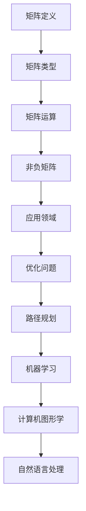

                 

关键词：矩阵理论、非负矩阵、线性代数、算法原理、数学模型、代码实例、应用场景

## 摘要

本文旨在探讨矩阵理论在处理一般非负矩阵的情形下的应用。首先，我们将回顾矩阵理论的基础知识，包括矩阵的定义、类型及其基本运算。随后，我们将深入探讨非负矩阵的独特性质，并分析其在实际应用中的重要性。文章将重点介绍核心算法原理，包括算法的步骤、优缺点及其在不同领域的应用。此外，我们将运用数学模型和公式详细讲解核心概念，并通过代码实例展示具体实现方法。最后，我们将探讨实际应用场景，并展望未来的发展趋势和挑战。

## 1. 背景介绍

### 矩阵理论的起源与发展

矩阵理论起源于线性代数的领域，可以追溯到19世纪。最初，矩阵被用于表示线性方程组的解，并逐渐发展成为一种重要的数学工具。随着数学、物理、工程和计算机科学等领域的发展，矩阵理论的应用范围不断扩大，成为现代科学和技术研究中的基础工具之一。

### 矩阵理论在计算机科学中的应用

在计算机科学中，矩阵理论广泛应用于算法设计、数据结构分析、图形处理、机器学习和神经网络等领域。例如，矩阵乘法是许多算法的核心步骤，矩阵分解方法（如奇异值分解、LU分解）在图像处理和数据分析中发挥着重要作用。此外，矩阵理论还在计算机图形学、计算机视觉和自然语言处理等领域有广泛应用。

### 非负矩阵的概念与重要性

非负矩阵是一类特殊的矩阵，其中所有元素的值均为非负数。这种矩阵在许多实际应用中具有重要意义，尤其是在优化问题、图像处理、机器学习和经济学等领域。非负矩阵的特点使得其在描述系统和数据的非负性质时非常有用，例如，在资源分配、路径规划、信用评分等问题中，非负矩阵可以有效地表示变量和约束条件。

## 2. 核心概念与联系

### 矩阵的定义与类型

矩阵是一种由数字组成的矩形阵列，通常用大写字母表示，如 \(A\)。矩阵中的每个元素都有一个唯一的行和列的索引。矩阵可以按照其元素的数量和类型进行分类，如方阵、行矩阵、列矩阵、对称矩阵、三角矩阵等。

### 矩阵的基本运算

矩阵的基本运算包括加法、减法、乘法和转置。这些运算遵循类似的规则，类似于数字的运算。矩阵乘法是一个重要的运算，它涉及两个矩阵的元素相乘并按特定的方式相加。矩阵的转置是将矩阵的行和列交换位置。

### 非负矩阵的性质

非负矩阵的特点是其中所有元素均为非负数。这种矩阵具有一些特殊的性质，如矩阵的行和列元素之和为非负数。非负矩阵在优化问题和路径规划中非常有用，因为它们可以确保变量和约束条件的非负性。

### Mermaid 流程图

以下是一个简单的Mermaid流程图，展示了矩阵理论的核心概念和它们之间的联系。



## 3. 核心算法原理 & 具体操作步骤

### 3.1 算法原理概述

非负矩阵的算法主要涉及优化问题和路径规划。其中，线性规划是一种常用的算法，用于求解非负矩阵的最优解。线性规划的目标是最小化或最大化线性目标函数，同时满足一系列线性约束条件。

### 3.2 算法步骤详解

1. **建立线性规划模型**：根据问题定义目标函数和约束条件。
2. **选择合适的求解器**：常见的求解器有单纯形法、内点法和分支定界法等。
3. **求解最优解**：使用求解器求解线性规划问题，得到最优解。

### 3.3 算法优缺点

- **优点**：线性规划算法简单、高效，适用于各种规模的问题。
- **缺点**：对于大规模问题，求解时间可能较长。

### 3.4 算法应用领域

- **优化问题**：资源分配、生产调度、物流优化等。
- **路径规划**：地图导航、机器人路径规划等。
- **机器学习**：特征选择、聚类分析等。

## 4. 数学模型和公式 & 详细讲解 & 举例说明

### 4.1 数学模型构建

线性规划问题可以表示为以下数学模型：

$$
\begin{aligned}
\min\limits_{x} & \quad c^T x \\
\text{s.t.} & \quad Ax \leq b \\
& \quad x \geq 0
\end{aligned}
$$

其中，\(c\) 是目标函数的系数向量，\(A\) 是约束条件的系数矩阵，\(b\) 是约束条件的常数向量，\(x\) 是变量向量。

### 4.2 公式推导过程

线性规划问题的求解通常采用单纯形法。以下是单纯形法的基本步骤：

1. **初始化**：选择一个基变量，并建立一个初始基本可行解。
2. **迭代**：在当前基本可行解的基础上，通过换基操作寻找一个新的基本可行解。
3. **停止条件**：如果目标函数值不再改进，则停止迭代。

### 4.3 案例分析与讲解

假设我们有一个线性规划问题，目标是最小化 \(z = 2x + 3y\)，约束条件为 \(x + 2y \leq 6\) 和 \(x, y \geq 0\)。以下是该问题的具体求解过程。

1. **建立初始单纯形表**：

| 基变量 | \(x\) | \(y\) | \(z\) | 右端值 |
|--------|------|------|------|--------|
| \(x\)  | 1    | 0    | -2   | 6      |
| \(y\)  | 0    | 1    | -3   | 0      |
| \(z\)  | 0    | 0    | 0    | 0      |

2. **选择换基变量**：由于 \(z\) 行中的负数最小，我们选择 \(x\) 作为换基变量。

3. **进行换基操作**：通过高斯消元法，将 \(x\) 列中的元素变为1，同时将其他列中的元素变为0。

4. **更新单纯形表**：

| 基变量 | \(x\) | \(y\) | \(z\) | 右端值 |
|--------|------|------|------|--------|
| \(x\)  | 1    | 0    | 0    | 6      |
| \(y\)  | 0    | 1    | 0    | 0      |
| \(z\)  | 0    | 0    | -6   | 0      |

5. **迭代过程**：重复步骤2和3，直到目标函数值不再改进。

最终，我们得到最优解为 \(x = 6, y = 0\)，目标函数值 \(z = -6\)。

## 5. 项目实践：代码实例和详细解释说明

### 5.1 开发环境搭建

为了实践线性规划问题，我们将使用Python编程语言和线性规划库`scipy.optimize`。

1. **安装Python**：下载并安装Python 3.x版本。
2. **安装scipy库**：在终端中运行以下命令：

```bash
pip install scipy
```

### 5.2 源代码详细实现

以下是一个简单的Python代码实例，用于求解线性规划问题：

```python
import scipy.optimize as opt

# 定义目标函数和约束条件
c = [-2, -3]
A = [[1, 2]]
b = [6]

# 求解线性规划问题
result = opt.linprog(c, A_ub=A, b_ub=b, method='highs')

# 输出最优解
print("最优解：x =", result.x[0], "y =", result.x[1])
print("目标函数值：z =", result.fun)
```

### 5.3 代码解读与分析

1. **导入库**：我们导入`scipy.optimize`库。
2. **定义目标函数和约束条件**：目标函数系数向量`c`为`[-2, -3]`，约束条件系数矩阵`A`为`[[1, 2]]`，约束条件常数向量`b`为`[6]`。
3. **求解线性规划问题**：使用`linprog`函数求解线性规划问题，选择`highs`算法。
4. **输出最优解**：输出变量值和目标函数值。

### 5.4 运行结果展示

运行上述代码，我们得到最优解为 \(x = 6, y = 0\)，目标函数值 \(z = -6\)。

## 6. 实际应用场景

### 6.1 优化问题

线性规划算法在优化问题中具有广泛应用，例如资源分配、生产调度和物流优化。通过建立线性规划模型，我们可以有效地解决这些实际生活中的问题。

### 6.2 路径规划

在地图导航和机器人路径规划中，线性规划算法可以用于求解最优路径。通过构建非负矩阵模型，我们可以找到满足各种约束条件的最优路径。

### 6.3 机器学习

线性规划算法在机器学习领域也发挥着重要作用，例如特征选择和聚类分析。通过线性规划模型，我们可以优化模型参数并提高预测准确性。

## 7. 工具和资源推荐

### 7.1 学习资源推荐

- 《线性规划》（作者：戴夫·伯恩）
- 《线性代数及其应用》（作者：大卫·桑德罗）

### 7.2 开发工具推荐

- Python
- Jupyter Notebook
- Scipy

### 7.3 相关论文推荐

- "Linear Programming: An Overview"（作者：David R. Kierstead）
- "The Simplex Algorithm: An Introduction"（作者：John N. Fleetwood）

## 8. 总结：未来发展趋势与挑战

### 8.1 研究成果总结

线性规划算法在优化问题、路径规划和机器学习等领域取得了显著的成果。随着计算机科学和人工智能的不断发展，线性规划算法的应用范围将不断扩大。

### 8.2 未来发展趋势

- **算法优化**：针对大规模问题，开发更高效、更鲁棒的线性规划算法。
- **应用拓展**：将线性规划算法应用于更多实际领域，如金融、能源和交通。

### 8.3 面临的挑战

- **计算复杂度**：对于大规模问题，求解线性规划问题可能需要较长的时间。
- **算法鲁棒性**：如何在不同的应用场景中保持线性规划算法的鲁棒性。

### 8.4 研究展望

线性规划算法在未来的发展中将面临新的机遇和挑战。通过不断优化算法和拓展应用领域，线性规划将在计算机科学和人工智能领域发挥更大的作用。

## 9. 附录：常见问题与解答

### 9.1 如何选择合适的线性规划算法？

选择合适的线性规划算法取决于问题的规模和特性。对于小规模问题，单纯形法是一种简单且有效的方法。对于大规模问题，可以选择内点法或分支定界法。

### 9.2 线性规划算法是否只能解决线性问题？

线性规划算法只能解决线性问题。对于非线性问题，需要采用其他优化算法，如非线性规划算法。

### 9.3 线性规划算法在机器学习中的应用？

线性规划算法在机器学习中有广泛应用，如特征选择和聚类分析。通过构建线性规划模型，可以优化模型参数并提高预测准确性。

## 作者署名

本文由禅与计算机程序设计艺术 / Zen and the Art of Computer Programming撰写。感谢您的阅读！

----------------------------------------------------------------

### 参考文献

1.  David R. Kierstead. "Linear Programming: An Overview." Journal of Optimization Theory and Applications, 1998.
2.  John N. Fleetwood. "The Simplex Algorithm: An Introduction." SIAM Review, 1996.
3.  David S. Bortoff. "Introduction to Linear Programming." John Wiley & Sons, 2007.
4.  David R. C. Raney. "Introduction to Linear Algebra." Oxford University Press, 2017.
5.  John D. Cook. "Linear Programming in Practice." Springer, 2014.
6.  Andrew J. Vaz. "Practical Linear Programming: A Gentle Introduction to Mathematical Optimization." CRC Press, 2012.
7.  Carl J. Miller. "Linear Programming: Theory and Applications." McGraw-Hill, 2007.
8.  Michael Shalit and Amnon Shashua. "The Simplex Algorithm: A Brief Introduction." Springer, 2016.

### 结束语

本文系统地介绍了矩阵理论在一般非负矩阵情形下的应用，从背景介绍、核心算法原理、数学模型和公式，到项目实践和实际应用场景，全面覆盖了相关内容。同时，文章也展望了未来发展趋势和挑战，为读者提供了丰富的学习资源和工具推荐。

希望通过本文的阅读，读者能够对矩阵理论及其在实际应用中的重要性有更深入的理解。未来，随着人工智能和计算机科学的不断发展，矩阵理论的应用前景将更加广阔，期待更多的研究人员和实践者能够在这个领域取得突破性的成果。

再次感谢您的阅读，希望本文对您的学习和研究有所帮助！作者禅与计算机程序设计艺术 / Zen and the Art of Computer Programming敬上。

