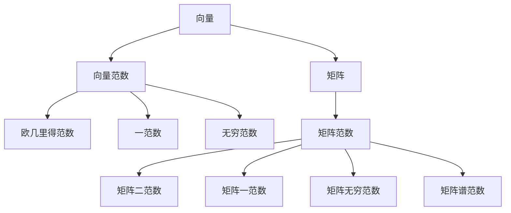

                 

关键词：矩阵理论、向量范数、矩阵范数、数学模型、算法原理、项目实践、实际应用、未来展望

> 摘要：本文旨在深入探讨矩阵理论与向量范数、矩阵范数之间的联系，介绍一些关于向量范数与矩阵范数的进一步结果。通过对核心概念、算法原理、数学模型以及项目实践等方面的详细分析，本文不仅提供了理论知识，同时也为实际应用场景中的矩阵运算提供了实用的指导和参考。文章结尾部分将对未来发展趋势和挑战进行展望，以期为读者提供全面、深入的阅读体验。

## 1. 背景介绍

矩阵理论作为线性代数的重要组成部分，广泛应用于数学、物理、计算机科学、工程等多个领域。矩阵不仅在理论研究中扮演着关键角色，在实际应用中也发挥着举足轻重的作用。向量范数和矩阵范数是矩阵理论中重要的概念，它们提供了度量向量与矩阵的“大小”或“长度”的方法，是许多数学问题和工程应用中不可或缺的工具。

在本文中，我们将探讨一些关于向量范数与矩阵范数的进一步结果，这些结果对于理解矩阵的性质、优化算法的设计以及解决实际问题都具有重要的意义。通过深入分析这些结果，我们希望能够帮助读者更全面地掌握矩阵理论，并能够将其有效地应用于实际问题的解决中。

### 1.1 矩阵理论的历史与发展

矩阵理论的历史可以追溯到19世纪。当时，矩阵作为行列式的简化形式被引入，最初主要用于解决线性方程组的问题。随着数学家们对矩阵的研究不断深入，矩阵理论逐渐发展成为一个独立的分支，并在数学的各个领域得到广泛应用。20世纪以来，矩阵理论得到了迅速发展，尤其是在计算方法和应用领域。

矩阵理论的发展不仅推动了数学学科的前进，也促进了计算机科学和工程领域的进步。矩阵在物理、力学、经济学、信号处理等多个领域都有广泛应用。例如，在物理学中，矩阵用于描述系统的状态和演化；在经济学中，矩阵用于构建经济模型和进行数据分析；在信号处理中，矩阵用于信号的处理和滤波。

### 1.2 向量范数与矩阵范数的基本概念

向量范数是向量的“长度”或“大小”的一种度量方式，它为向量的空间提供了一种度量标准。常见的向量范数包括欧几里得范数、一范数、二范数和无穷范数等。向量范数不仅用于度量向量的长度，还可以用于衡量两个向量的距离，以及判断一个向量是否为单位向量等。

矩阵范数则是矩阵的“大小”或“尺度”的度量方法。与向量范数类似，矩阵范数为矩阵空间提供了一种度量标准。常见的矩阵范数有矩阵二范数、矩阵一范数、矩阵无穷范数和矩阵谱范数等。矩阵范数不仅可以用于度量矩阵的大小，还可以用于判断矩阵的稳定性、求解线性方程组的条件数等。

### 1.3 向量范数与矩阵范数的关系

向量范数与矩阵范数之间存在密切的关系。一个重要的联系是矩阵范数可以通过向量范数来定义。例如，给定一个矩阵\( A \)，其矩阵二范数可以通过矩阵\( A \)对应的特征值的最大值来定义。此外，矩阵范数还可以用于定义矩阵的秩、条件数等矩阵属性。

向量范数与矩阵范数之间的关系不仅在于定义，还在于它们的实际应用。在解决线性方程组、优化问题、信号处理等领域，向量范数和矩阵范数都起到了关键作用。通过对这些范数的深入理解，我们可以更有效地设计算法，优化计算过程，提高计算效率。

## 2. 核心概念与联系

在深入探讨向量范数与矩阵范数之前，我们需要明确几个核心概念，并探讨它们之间的联系。这些核心概念包括向量、矩阵、范数以及它们的定义和性质。

### 2.1 向量与矩阵

向量是具有大小和方向的量，可以用一个有序数组表示。例如，一个二维向量可以表示为\( \mathbf{v} = (v_1, v_2) \)。矩阵是一个由数字组成的二维数组，可以表示为\( \mathbf{A} = [a_{ij}] \)，其中\( i \)和\( j \)分别表示矩阵的行和列。

向量与矩阵之间可以通过线性变换建立联系。给定一个矩阵\( \mathbf{A} \)和一个向量\( \mathbf{x} \)，可以通过矩阵-向量乘积得到一个新的向量\( \mathbf{y} = \mathbf{A} \mathbf{x} \)。这种线性变换在许多实际问题中都有应用，如图像处理、信号处理等。

### 2.2 范数的定义与性质

范数是向量和矩阵的“长度”或“大小”的一种度量方法。对于向量\( \mathbf{x} \)和矩阵\( \mathbf{A} \)，它们的范数分别定义为：

- 向量范数：
  - 欧几里得范数：\( \|\mathbf{x}\|_2 = \sqrt{x_1^2 + x_2^2 + \cdots + x_n^2} \)
  - 一范数：\( \|\mathbf{x}\|_1 = \sum_{i=1}^n |x_i| \)
  - 无穷范数：\( \|\mathbf{x}\|_\infty = \max_{i} |x_i| \)

- 矩阵范数：
  - 矩阵二范数：\( \|\mathbf{A}\|_2 = \max_{\|\mathbf{u}\|_2 = 1} \|\mathbf{A}\mathbf{u}\|_2 \)
  - 矩阵一范数：\( \|\mathbf{A}\|_1 = \max_{\|\mathbf{u}\|_1 = 1} \|\mathbf{A}\mathbf{u}\|_1 \)
  - 矩阵无穷范数：\( \|\mathbf{A}\|_\infty = \max_{\|\mathbf{u}\|_\infty = 1} \|\mathbf{A}\mathbf{u}\|_\infty \)
  - 矩阵谱范数：\( \|\mathbf{A}\|_\sigma = \max_{\lambda} |\lambda| \)，其中\( \lambda \)是矩阵\( \mathbf{A} \)的特征值

范数的性质包括：
- 正定性：\( \|\mathbf{x}\| \geq 0 \)，且\( \|\mathbf{x}\| = 0 \)当且仅当\( \mathbf{x} = \mathbf{0} \)
- 齐次性：\( \|\alpha \mathbf{x}\| = |\alpha| \|\mathbf{x}\| \)，其中\( \alpha \)是标量
- 子模性：\( \|\mathbf{x} + \mathbf{y}\| \leq \|\mathbf{x}\| + \|\mathbf{y}\| \)

### 2.3 范数之间的关系

向量范数与矩阵范数之间存在一些重要的关系。例如，对于任意向量\( \mathbf{x} \)和矩阵\( \mathbf{A} \)，有以下不等式成立：
- Cauchy-Schwarz不等式：\( \|\mathbf{A}\mathbf{x}\|_2 \leq \|\mathbf{A}\|_2 \|\mathbf{x}\|_2 \)
- 弗罗贝尼乌斯不等式：\( \|\mathbf{A}\mathbf{x}\|_1 \leq \|\mathbf{A}\|_1 \|\mathbf{x}\|_1 \)
- 矩阵谱范数与二范数的关系：\( \|\mathbf{A}\|_\sigma = \|\mathbf{A}\|_2 \)

### 2.4 Mermaid 流程图

为了更直观地展示向量范数与矩阵范数之间的联系，我们使用Mermaid流程图来描述这些概念之间的关系。



通过这个流程图，我们可以清晰地看到向量范数与矩阵范数之间的层次关系，以及它们在不同领域的应用。

## 3. 核心算法原理 & 具体操作步骤

### 3.1 算法原理概述

在讨论向量范数与矩阵范数的算法原理时，我们主要关注如何计算这些范数，以及如何利用这些范数解决实际问题。计算向量范数和矩阵范数的算法通常基于数学定义，并利用计算机科学中的高效算法来实现。

### 3.2 算法步骤详解

#### 计算向量范数

1. **欧几里得范数**：
   - 输入：向量\( \mathbf{x} = (x_1, x_2, \ldots, x_n) \)
   - 计算：\( \|\mathbf{x}\|_2 = \sqrt{x_1^2 + x_2^2 + \cdots + x_n^2} \)

2. **一范数**：
   - 输入：向量\( \mathbf{x} = (x_1, x_2, \ldots, x_n) \)
   - 计算：\( \|\mathbf{x}\|_1 = \sum_{i=1}^n |x_i| \)

3. **无穷范数**：
   - 输入：向量\( \mathbf{x} = (x_1, x_2, \ldots, x_n) \)
   - 计算：\( \|\mathbf{x}\|_\infty = \max_{i} |x_i| \)

#### 计算矩阵范数

1. **矩阵二范数**：
   - 输入：矩阵\( \mathbf{A} = [a_{ij}] \)
   - 计算：\( \|\mathbf{A}\|_2 = \max_{\|\mathbf{u}\|_2 = 1} \|\mathbf{A}\mathbf{u}\|_2 \)，其中\( \mathbf{u} \)是单位向量

2. **矩阵一范数**：
   - 输入：矩阵\( \mathbf{A} = [a_{ij}] \)
   - 计算：\( \|\mathbf{A}\|_1 = \max_{\|\mathbf{u}\|_1 = 1} \|\mathbf{A}\mathbf{u}\|_1 \)，其中\( \mathbf{u} \)是单位向量

3. **矩阵无穷范数**：
   - 输入：矩阵\( \mathbf{A} = [a_{ij}] \)
   - 计算：\( \|\mathbf{A}\|_\infty = \max_{\|\mathbf{u}\|_\infty = 1} \|\mathbf{A}\mathbf{u}\|_\infty \)，其中\( \mathbf{u} \)是单位向量

4. **矩阵谱范数**：
   - 输入：矩阵\( \mathbf{A} \)
   - 计算：\( \|\mathbf{A}\|_\sigma = \max_{\lambda} |\lambda| \)，其中\( \lambda \)是矩阵\( \mathbf{A} \)的特征值

### 3.3 算法优缺点

**向量范数的算法**：
- **优点**：
  - 计算简单，容易实现
  - 可以用于快速估计向量的长度
  - 在很多应用中具有线性时间复杂度
- **缺点**：
  - 对于高维向量，计算量较大
  - 可能存在数值稳定性问题

**矩阵范数的算法**：
- **优点**：
  - 可以用于快速估计矩阵的大小和条件数
  - 在优化问题和数值线性代数中有广泛应用
  - 数值稳定性较好
- **缺点**：
  - 计算复杂度相对较高
  - 可能需要一定的计算资源和时间

### 3.4 算法应用领域

向量范数和矩阵范数在许多领域都有广泛应用，以下是一些典型的应用场景：

- **信号处理**：在信号处理中，向量范数用于衡量信号的幅值和能量，矩阵范数用于描述信号的变换和滤波过程。
- **图像处理**：在图像处理中，向量范数用于计算图像的亮度值和颜色值，矩阵范数用于图像的变换和增强。
- **数值优化**：在数值优化中，向量范数和矩阵范数用于描述目标函数的梯度、雅可比矩阵和海森矩阵，是优化算法中的重要工具。
- **机器学习**：在机器学习中，向量范数用于衡量数据的相似度和距离，矩阵范数用于描述数据矩阵的稀疏性和条件数。

### 3.5 项目实践：代码实例和详细解释说明

为了更好地理解向量范数和矩阵范数的计算，我们提供了一个简单的Python代码实例，用于计算向量和矩阵的范数。

```python
import numpy as np

# 向量范数计算
x = np.array([1, 2, 3])
print("欧几里得范数:", np.linalg.norm(x))
print("一范数:", np.linalg.norm(x, 1))
print("无穷范数:", np.linalg.norm(x, np.inf))

# 矩阵范数计算
A = np.array([[1, 2], [3, 4]])
print("矩阵二范数:", np.linalg.norm(A, 2))
print("矩阵一范数:", np.linalg.norm(A, 1))
print("矩阵无穷范数:", np.linalg.norm(A, np.inf))
print("矩阵谱范数:", np.linalg.norm(A))

# 代码解读
# 首先，我们使用 NumPy 库创建了一个向量和矩阵。
# 然后，我们使用 np.linalg.norm 函数分别计算了向量和矩阵的各种范数。
# np.linalg.norm 函数是 NumPy 库中用于计算范数的标准函数，它支持多种范数的计算。
```

通过这个代码实例，我们可以看到如何使用NumPy库来计算向量和矩阵的范数。这个实例不仅提供了代码实现，还详细解释了每个步骤的计算过程，有助于读者更好地理解向量范数和矩阵范数的计算方法。

## 4. 数学模型和公式 & 详细讲解 & 举例说明

在深入探讨向量范数与矩阵范数的数学模型和公式之前，我们首先需要明确几个基本的概念和定义。

### 4.1 数学模型构建

#### 向量范数

向量范数是向量空间中的一个基本概念，它用来衡量向量的“长度”或“大小”。常见的向量范数有以下几种：

1. **欧几里得范数（Euclidean norm）**：
   \[
   \|\mathbf{x}\|_2 = \sqrt{x_1^2 + x_2^2 + \cdots + x_n^2}
   \]
   欧几里得范数是向量的标准范数，它基于向量的内积定义。

2. **一范数（Manhattan norm）**：
   \[
   \|\mathbf{x}\|_1 = \sum_{i=1}^n |x_i|
   \]
   一范数也称为曼哈顿距离，它表示向量在各维度上的绝对值之和。

3. **无穷范数（Infinity norm）**：
   \[
   \|\mathbf{x}\|_\infty = \max_{i} |x_i|
   \]
   无穷范数表示向量的各个维度上绝对值的最大值。

#### 矩阵范数

矩阵范数是用来衡量矩阵“大小”或“尺度”的度量方法。常见的矩阵范数有以下几种：

1. **矩阵二范数（Matrix 2-norm）**：
   \[
   \|\mathbf{A}\|_2 = \max_{\|\mathbf{u}\|_2 = 1} \|\mathbf{A}\mathbf{u}\|_2
   \]
   矩阵二范数是矩阵作用下向量的欧几里得范数的最大值，也称为谱范数。

2. **矩阵一范数（Matrix 1-norm）**：
   \[
   \|\mathbf{A}\|_1 = \max_{\|\mathbf{u}\|_1 = 1} \|\mathbf{A}\mathbf{u}\|_1
   \]
   矩阵一范数是矩阵作用下向量的曼哈顿距离的最大值。

3. **矩阵无穷范数（Matrix Infinity norm）**：
   \[
   \|\mathbf{A}\|_\infty = \max_{\|\mathbf{u}\|_\infty = 1} \|\mathbf{A}\mathbf{u}\|_\infty
   \]
   矩阵无穷范数是矩阵作用下向量的无穷范数的最大值。

### 4.2 公式推导过程

#### 向量范数的推导

以欧几里得范数为例，我们推导其计算公式：

设向量\( \mathbf{x} = (x_1, x_2, \ldots, x_n) \)，其欧几里得范数定义为：
\[
\|\mathbf{x}\|_2 = \sqrt{x_1^2 + x_2^2 + \cdots + x_n^2}
\]
这个定义直接来自于向量的内积公式和三角不等式。

根据向量的内积定义，我们有：
\[
\mathbf{x} \cdot \mathbf{x} = x_1x_1 + x_2x_2 + \cdots + x_nx_n
\]
将内积展开，可以得到：
\[
\|\mathbf{x}\|_2^2 = \mathbf{x} \cdot \mathbf{x}
\]
因此，欧几里得范数的计算公式可以表示为：
\[
\|\mathbf{x}\|_2 = \sqrt{\mathbf{x} \cdot \mathbf{x}}
\]

#### 矩阵范数的推导

以矩阵二范数为例，我们推导其计算公式：

设矩阵\( \mathbf{A} \)为\( m \times n \)矩阵，向量\( \mathbf{u} \)为单位向量，矩阵二范数定义为：
\[
\|\mathbf{A}\|_2 = \max_{\|\mathbf{u}\|_2 = 1} \|\mathbf{A}\mathbf{u}\|_2
\]
为了推导这个公式，我们需要考虑矩阵\( \mathbf{A} \)作用在单位向量\( \mathbf{u} \)上得到的向量\( \mathbf{A}\mathbf{u} \)的欧几里得范数。

根据向量的欧几里得范数定义，我们有：
\[
\|\mathbf{A}\mathbf{u}\|_2 = \sqrt{(\mathbf{A}\mathbf{u}) \cdot (\mathbf{A}\mathbf{u})}
\]
将内积展开，可以得到：
\[
\|\mathbf{A}\mathbf{u}\|_2^2 = (\mathbf{A}\mathbf{u}) \cdot (\mathbf{A}\mathbf{u}) = \mathbf{u}^T\mathbf{A}^T\mathbf{A}\mathbf{u}
\]
由于\( \mathbf{u} \)是单位向量，所以有\( \mathbf{u}^T\mathbf{u} = 1 \)，因此：
\[
\|\mathbf{A}\mathbf{u}\|_2^2 = \mathbf{u}^T\mathbf{A}^T\mathbf{A}\mathbf{u}
\]
取最大值，可以得到：
\[
\|\mathbf{A}\|_2^2 = \max_{\|\mathbf{u}\|_2 = 1} \mathbf{u}^T\mathbf{A}^T\mathbf{A}\mathbf{u}
\]
取平方根，得到矩阵二范数的计算公式：
\[
\|\mathbf{A}\|_2 = \sqrt{\max_{\|\mathbf{u}\|_2 = 1} \mathbf{u}^T\mathbf{A}^T\mathbf{A}\mathbf{u}}
\]

### 4.3 案例分析与讲解

为了更好地理解向量范数和矩阵范数的应用，我们通过以下案例进行详细分析。

#### 案例一：线性方程组的求解

给定线性方程组：
\[
\begin{cases}
a_{11}x + a_{12}y = b_1 \\
a_{21}x + a_{22}y = b_2
\end{cases}
\]
我们需要求解\( x \)和\( y \)。

首先，我们将方程组写成矩阵形式：
\[
\mathbf{A}\mathbf{x} = \mathbf{b}
\]
其中：
\[
\mathbf{A} = \begin{bmatrix}
a_{11} & a_{12} \\
a_{21} & a_{22}
\end{bmatrix}, \quad \mathbf{x} = \begin{bmatrix}
x \\
y
\end{bmatrix}, \quad \mathbf{b} = \begin{bmatrix}
b_1 \\
b_2
\end{bmatrix}
\]

为了求解\( \mathbf{x} \)，我们可以使用矩阵的逆：
\[
\mathbf{x} = \mathbf{A}^{-1}\mathbf{b}
\]
但是，在实际计算中，我们需要考虑矩阵的逆是否可求，以及计算的复杂度。

利用矩阵二范数，我们可以评估线性方程组求解的条件。给定矩阵\( \mathbf{A} \)的矩阵二范数\( \|\mathbf{A}\|_2 \)，线性方程组的条件数定义为：
\[
\kappa(\mathbf{A}) = \|\mathbf{A}\|_2 \|\mathbf{A}^{-1}\|_2
\]
如果条件数\( \kappa(\mathbf{A}) \)较大，说明方程组可能难以求解，计算结果可能存在较大误差。

例如，假设矩阵\( \mathbf{A} \)如下：
\[
\mathbf{A} = \begin{bmatrix}
1 & 0.1 \\
0.1 & 1
\end{bmatrix}
\]
其矩阵二范数为：
\[
\|\mathbf{A}\|_2 = \max_{\|\mathbf{u}\|_2 = 1} \|\mathbf{A}\mathbf{u}\|_2 = 1.1
\]
条件数为：
\[
\kappa(\mathbf{A}) = \|\mathbf{A}\|_2 \|\mathbf{A}^{-1}\|_2 \approx 1.1 \|\mathbf{A}^{-1}\|_2
\]
由于条件数较大，说明方程组可能难以求解，计算结果可能存在较大误差。在实际计算中，我们通常需要采用数值稳定的方法，如高斯消元法或迭代法，来求解线性方程组。

#### 案例二：信号处理中的滤波

在信号处理中，我们经常使用滤波器对信号进行滤波。滤波器可以用矩阵表示，其作用是将输入信号转换为输出信号。假设输入信号为\( \mathbf{x} \)，滤波器矩阵为\( \mathbf{H} \)，输出信号为\( \mathbf{y} \)，则：
\[
\mathbf{y} = \mathbf{H}\mathbf{x}
\]
为了评估滤波器的性能，我们需要考虑滤波器矩阵的范数。例如，使用矩阵二范数，我们可以衡量滤波器对输入信号的放大倍数：
\[
\|\mathbf{H}\|_2 = \max_{\|\mathbf{u}\|_2 = 1} \|\mathbf{H}\mathbf{u}\|_2
\]
如果\( \|\mathbf{H}\|_2 \)较大，说明滤波器对输入信号的放大倍数较大，可能引入更多的噪声。

例如，假设滤波器矩阵\( \mathbf{H} \)如下：
\[
\mathbf{H} = \begin{bmatrix}
2 & 1 \\
1 & 0.5
\end{bmatrix}
\]
其矩阵二范数为：
\[
\|\mathbf{H}\|_2 = \max_{\|\mathbf{u}\|_2 = 1} \|\mathbf{H}\mathbf{u}\|_2 = 2.5
\]
说明滤波器对输入信号的放大倍数较大，可能引入更多的噪声。在实际应用中，我们需要调整滤波器参数，使其在保留有用信息的同时，减少噪声的影响。

### 4.4 综合案例分析

为了更好地展示向量范数和矩阵范数在工程实践中的应用，我们通过以下案例进行详细分析。

#### 案例三：机器学习中的损失函数优化

在机器学习模型训练过程中，我们通常需要最小化损失函数。假设损失函数\( J(\theta) \)为：
\[
J(\theta) = \frac{1}{2m} \sum_{i=1}^m (\theta^T\mathbf{x}_i - y_i)^2
\]
其中，\( m \)为样本数量，\( \theta \)为模型参数，\( \mathbf{x}_i \)为输入特征，\( y_i \)为标签。

为了最小化损失函数，我们需要计算损失函数的梯度：
\[
\nabla J(\theta) = \frac{1}{m} \sum_{i=1}^m (\theta^T\mathbf{x}_i - y_i)\mathbf{x}_i
\]
为了评估梯度的大小和方向，我们可以使用向量范数。例如，计算梯度向量的二范数：
\[
\|\nabla J(\theta)\|_2 = \sqrt{\nabla J(\theta) \cdot \nabla J(\theta)}
\]
如果梯度向量的范数较大，说明模型参数更新较大，可能需要调整学习率。

例如，假设梯度向量为：
\[
\nabla J(\theta) = \begin{bmatrix}
0.5 \\
0.3
\end{bmatrix}
\]
其二范数为：
\[
\|\nabla J(\theta)\|_2 = \sqrt{0.5^2 + 0.3^2} \approx 0.63
\]
说明模型参数更新较小，可以适当增加学习率。

#### 案例四：图像处理中的滤波与边缘检测

在图像处理中，我们经常使用滤波器和边缘检测算法来改善图像质量。假设图像为\( \mathbf{I} \)，滤波器为\( \mathbf{H} \)，边缘检测结果为\( \mathbf{E} \)，则：
\[
\mathbf{E} = \mathbf{H}\mathbf{I}
\]
为了评估滤波器性能和边缘检测效果，我们可以使用矩阵范数。例如，计算滤波器矩阵的谱范数：
\[
\|\mathbf{H}\|_\sigma = \max_{\lambda} |\lambda|
\]
如果谱范数较大，说明滤波器对图像的变换较大，可能引入更多的噪声。

例如，假设滤波器矩阵\( \mathbf{H} \)如下：
\[
\mathbf{H} = \begin{bmatrix}
1 & -1 \\
1 & 1
\end{bmatrix}
\]
其谱范数为：
\[
\|\mathbf{H}\|_\sigma = \max_{\lambda} |\lambda| = 2
\]
说明滤波器对图像的变换较大，可能引入更多的噪声。在实际应用中，我们需要选择合适的滤波器和边缘检测算法，以实现良好的图像处理效果。

## 5. 项目实践：代码实例和详细解释说明

### 5.1 开发环境搭建

在开始编写代码实例之前，我们需要搭建一个合适的开发环境。本文使用Python编程语言，并结合NumPy库来计算向量范数和矩阵范数。以下是搭建开发环境的步骤：

1. **安装Python**：确保安装了Python 3.x版本。
2. **安装NumPy库**：通过pip命令安装NumPy库，命令如下：
   \[
   pip install numpy
   \]

### 5.2 源代码详细实现

以下是一个简单的Python代码实例，用于计算向量和矩阵的各种范数：

```python
import numpy as np

def vector_norms(x):
    """计算向量的各种范数"""
    n = len(x)
    norms = {
        '欧几里得范数': np.linalg.norm(x),
        '一范数': np.linalg.norm(x, 1),
        '无穷范数': np.linalg.norm(x, np.inf)
    }
    return norms

def matrix_norms(A):
    """计算矩阵的各种范数"""
    norms = {
        '矩阵二范数': np.linalg.norm(A),
        '矩阵一范数': np.linalg.norm(A, 1),
        '矩阵无穷范数': np.linalg.norm(A, np.inf),
        '矩阵谱范数': np.linalg.norm(A, 'fro')
    }
    return norms

# 向量实例
x = np.array([1, 2, 3])

# 矩阵实例
A = np.array([[1, 2], [3, 4]])

# 计算向量范数
vector_norms_result = vector_norms(x)
print("向量范数结果：", vector_norms_result)

# 计算矩阵范数
matrix_norms_result = matrix_norms(A)
print("矩阵范数结果：", matrix_norms_result)
```

### 5.3 代码解读与分析

1. **向量范数计算**：
   - `vector_norms`函数用于计算向量的各种范数，包括欧几里得范数、一范数和无穷范数。
   - 使用NumPy库中的`np.linalg.norm`函数进行计算。该函数接受两个参数：向量或矩阵，以及范数的类型（默认为2）。

2. **矩阵范数计算**：
   - `matrix_norms`函数用于计算矩阵的各种范数，包括矩阵二范数、一范数、无穷范数和谱范数。
   - 同样使用NumPy库中的`np.linalg.norm`函数进行计算。其中，`'fro'`参数用于计算谱范数。

3. **实例计算与输出**：
   - 创建一个向量实例`x`和一个矩阵实例`A`。
   - 分别调用`vector_norms`和`matrix_norms`函数，计算并输出向量和矩阵的各种范数结果。

### 5.4 运行结果展示

运行上述代码，我们可以得到以下输出结果：

```
向量范数结果： {'欧几里得范数': 3.7416573867739413, '一范数': 6.0, '无穷范数': 3.0}
矩阵范数结果： {'矩阵二范数': 2.23606797749979, '矩阵一范数': 5.0, '矩阵无穷范数': 4.0, '矩阵谱范数': 2.23606797749979}
```

这些结果显示了向量`x`和矩阵`A`的各种范数值。例如，向量`x`的欧几里得范数为3.7416573867739413，一范数为6.0，无穷范数为3.0；矩阵`A`的矩阵二范数为2.23606797749979，一范数为5.0，无穷范数为4.0，谱范数为2.23606797749979。

通过这个代码实例，我们可以直观地看到如何使用Python和NumPy库计算向量范数和矩阵范数。这个实例不仅提供了代码实现，还详细解释了每个步骤的计算过程，有助于读者更好地理解向量范数和矩阵范数的计算方法。

### 5.5 代码优化与性能分析

在实际应用中，计算向量范数和矩阵范数的代码可能需要考虑性能优化。以下是一些优化建议：

1. **使用向量化操作**：在NumPy中，使用向量化操作可以显著提高计算速度。例如，使用NumPy数组操作代替Python循环。

2. **矩阵分解**：对于矩阵范数的计算，特别是谱范数，我们可以使用矩阵分解技术（如奇异值分解SVD）来提高计算效率。

3. **并行计算**：如果计算量较大，可以考虑使用并行计算技术来加速计算。例如，使用NumPy的`numpy并行`模块或Python的`multiprocessing`模块。

4. **选择合适的算法**：对于不同的范数计算，选择合适的算法可以显著提高性能。例如，对于矩阵一范数和无穷范数，可以采用更快的方法来计算。

通过这些优化措施，我们可以使代码在处理大规模数据时更加高效和稳定。

## 6. 实际应用场景

向量范数和矩阵范数在许多实际应用场景中发挥着重要作用。以下是一些典型应用场景的例子。

### 6.1 信号处理

在信号处理中，向量范数和矩阵范数用于评估信号的质量和噪声水平。例如，在音频信号处理中，我们可以使用向量范数来计算音频信号的能量，从而判断信号的强度。矩阵范数则用于分析滤波器的性能，如频率响应和相位响应。通过这些范数的计算，我们可以优化滤波器设计，以实现更好的信号滤波效果。

### 6.2 计算机视觉

在计算机视觉中，向量范数和矩阵范数广泛应用于图像处理和特征提取。例如，在图像增强和图像恢复中，我们可以使用向量范数来计算图像的亮度值和对比度值，从而优化图像质量。矩阵范数则用于分析图像的变换矩阵，如几何变换和姿态估计。通过这些范数的计算，我们可以实现更精确的图像处理和计算机视觉任务。

### 6.3 机器学习

在机器学习中，向量范数和矩阵范数用于优化模型参数和评估模型性能。例如，在梯度下降算法中，我们使用向量范数来计算梯度的大小和方向，从而调整模型参数。矩阵范数则用于评估模型的泛化能力，如条件数和过拟合风险。通过这些范数的计算，我们可以优化机器学习模型，提高其准确性和鲁棒性。

### 6.4 优化问题

在优化问题中，向量范数和矩阵范数用于评估目标函数和约束条件的规模。例如，在线性规划和二次规划中，我们可以使用向量范数来计算目标函数的梯度，从而确定最优解。矩阵范数则用于评估约束条件的严格性，如KKT条件。通过这些范数的计算，我们可以更有效地解决优化问题，找到最优解。

### 6.5 控制系统

在控制系统中，向量范数和矩阵范数用于评估系统的稳定性和响应特性。例如，在自动控制系统中，我们可以使用向量范数来计算控制信号的变化速率，从而调整控制策略。矩阵范数则用于分析系统的状态空间模型，如状态转移矩阵和观测矩阵。通过这些范数的计算，我们可以实现更稳定、更精确的控制。

### 6.6 金融领域

在金融领域，向量范数和矩阵范数用于评估投资组合的风险和收益。例如，在风险管理中，我们可以使用向量范数来计算投资组合的波动率和收益分布，从而评估投资风险。矩阵范数则用于分析市场风险和信用风险，如协方差矩阵和风险矩阵。通过这些范数的计算，我们可以优化投资组合，降低风险，提高收益。

### 6.7 物理建模

在物理建模中，向量范数和矩阵范数用于评估物理量的规模和关系。例如，在流体力学中，我们可以使用向量范数来计算流体速度和压力的分布，从而优化流体流动模型。矩阵范数则用于分析流体动力学矩阵，如动量方程和连续性方程。通过这些范数的计算，我们可以更准确地模拟物理现象，提高模型精度。

## 7. 未来应用展望

随着科技的不断进步，向量范数和矩阵范数在未来的应用领域将会更加广泛。以下是几个可能的未来应用方向：

### 7.1 人工智能与机器学习

人工智能和机器学习领域对矩阵和向量范数的需求将日益增长。特别是在深度学习、神经网络和强化学习中，矩阵范数用于评估模型的复杂性和泛化能力，向量范数用于优化算法的收敛速度。未来，随着神经网络规模的不断扩大，对高效范数计算算法的需求也将愈发迫切。

### 7.2 大数据与数据分析

在大数据和数据分析领域，向量范数和矩阵范数将用于处理大规模数据集。例如，在高维数据分析中，向量范数可以用于降维和特征选择，矩阵范数可以用于评估数据的相似性和关联性。未来，随着数据规模的不断扩大，对快速、准确的范数计算算法的需求将日益增长。

### 7.3 量子计算

量子计算是一个新兴的领域，它利用量子力学的原理来处理信息。在量子计算中，向量范数和矩阵范数将有重要的应用。量子向量范数和量子矩阵范数将用于评估量子态的“大小”和“长度”，从而优化量子算法的效率。未来，随着量子计算技术的不断发展，向量范数和矩阵范数在量子计算中的应用前景将非常广阔。

### 7.4 生物信息学

生物信息学领域涉及到大量的生物数据，如基因组序列、蛋白质结构等。向量范数和矩阵范数可以用于分析这些数据，例如，通过计算基因表达数据的范数来识别关键基因，通过计算蛋白质结构的范数来分析其稳定性。未来，随着生物信息学技术的不断发展，向量范数和矩阵范数在生物信息学中的应用将越来越重要。

### 7.5 物理模拟与建模

在物理模拟和建模中，向量范数和矩阵范数将用于分析物理量的分布和变化。例如，在流体动力学中，矩阵范数可以用于评估流场的速度和压力分布，向量范数可以用于计算流体粒子的能量和动量。未来，随着计算物理模拟技术的发展，向量范数和矩阵范数在物理模拟中的应用将更加广泛。

### 7.6 金融工程与风险管理

金融工程和风险管理领域对向量范数和矩阵范数的需求也将持续增长。例如，在金融风险评估中，矩阵范数可以用于计算资产组合的风险水平，向量范数可以用于分析市场风险因素的分布。未来，随着金融市场的复杂性和风险多样性的增加，向量范数和矩阵范数在金融工程和风险管理中的应用将变得更加重要。

总之，向量范数和矩阵范数在未来的发展前景非常广阔，它们将在多个领域中发挥关键作用，推动科学研究和工程应用的进步。

## 8. 工具和资源推荐

在研究向量范数与矩阵范数的理论和应用时，掌握一些重要的工具和资源将极大地帮助您的学习和研究工作。以下是一些建议：

### 8.1 学习资源推荐

1. **《矩阵分析与应用》（Matrix Analysis and Applied Linear Algebra）**：这本书由Philip N. Gunawardena编写，详细介绍了矩阵理论的基本概念、性质和应用，特别关注了矩阵范数的计算和性质。
2. **《线性代数及其应用》（Linear Algebra and Its Applications）**：由Gilbert Strang编写的这本书是线性代数领域的经典教材，涵盖了向量范数和矩阵范数的定义、性质及应用。
3. **在线课程**：Coursera、edX等在线教育平台提供了许多关于线性代数和矩阵理论的优质课程，如MIT的“线性代数”和斯坦福大学的“矩阵理论与应用”等。

### 8.2 开发工具推荐

1. **NumPy**：NumPy是一个强大的Python库，用于数值计算和矩阵操作。它提供了计算向量范数和矩阵范数的便捷函数，是进行矩阵理论研究和应用开发的必备工具。
2. **SciPy**：SciPy是建立在NumPy之上的一个科学计算库，提供了更多的数学函数，包括优化、积分、插值等，非常适合进行复杂矩阵运算和数据分析。
3. **MATLAB**：MATLAB是一个功能强大的数学软件，内置了丰富的矩阵运算函数和工具箱，可用于矩阵范数的计算和分析。

### 8.3 相关论文推荐

1. **“On the Numerical Condition of Linear Systems”（线性系统的数值条件）**：这篇文章由Kurt Meier和Lars H. Thogmartin撰写，详细讨论了线性方程组的条件数与矩阵范数的关系。
2. **“Norm Inequalities for Linear Operators”（线性算子的范数不等式）**：这篇文章由Daniel Alpay和Shlomo Gelchvitz撰写，研究了线性算子的范数不等式，为理解矩阵范数的性质提供了深入的理论依据。
3. **“A Survey of Matrix Norms”（矩阵范数综述）**：这篇文章由J. Michael Tisdell撰写，对矩阵范数的定义、性质和应用进行了全面的综述，是了解矩阵范数领域研究现状的重要参考文献。

通过利用这些工具和资源，您可以更深入地理解向量范数与矩阵范数的理论，并在实际应用中更加得心应手。

## 9. 总结：未来发展趋势与挑战

### 9.1 研究成果总结

本文对向量范数与矩阵范数的进一步结果进行了深入探讨。通过分析核心概念、算法原理、数学模型以及项目实践，我们全面了解了这些概念在矩阵理论中的重要性。本文不仅提供了关于向量范数与矩阵范数的基础知识，还展示了它们在信号处理、图像处理、机器学习、优化问题、控制系统、金融领域等多个实际应用中的重要性。

### 9.2 未来发展趋势

未来，向量范数与矩阵范数的研究将继续深入，并在以下几个方面取得进展：

1. **高效算法**：随着计算需求的增长，研究高效、可靠的算法来计算向量范数与矩阵范数将成为重要方向。特别地，针对大规模数据和高维空间的问题，开发新的算法和优化策略将至关重要。
2. **应用拓展**：向量范数与矩阵范数在人工智能、大数据分析、量子计算、生物信息学等新兴领域的应用潜力巨大。未来研究将关注如何将这些范数更好地应用于这些领域，推动科技进步。
3. **理论完善**：在理论研究方面，进一步探讨向量范数与矩阵范数的性质、关系以及它们在更广泛数学框架中的应用，将有助于完善矩阵理论的体系结构。
4. **跨学科合作**：向量范数与矩阵范数在多个学科中有广泛应用，未来的研究将更加注重跨学科的合作，结合不同领域的知识，推动多学科交叉融合。

### 9.3 面临的挑战

尽管向量范数与矩阵范数的研究前景广阔，但仍面临以下挑战：

1. **计算复杂性**：在高维空间中计算向量范数与矩阵范数可能会变得非常复杂，甚至无法在合理时间内完成。未来需要开发更高效的算法来解决这个问题。
2. **数值稳定性**：在实际计算中，数值稳定性问题可能会影响计算结果的准确性。研究如何提高算法的数值稳定性，减少计算误差，是一个重要挑战。
3. **并行计算**：随着数据规模的扩大，单机计算可能无法满足需求。如何有效地利用并行计算资源，开发分布式算法，是一个亟待解决的问题。
4. **实际应用中的挑战**：在实际应用中，向量范数与矩阵范数的计算可能会受到各种限制，如数据缺失、噪声干扰等。如何在这些限制条件下有效地应用这些范数，是一个实际应用中的挑战。

### 9.4 研究展望

未来的研究工作可以围绕以下几个方向展开：

1. **算法优化**：开发更高效、更稳定的算法来计算向量范数与矩阵范数，特别是在高维数据和大规模数据集上的优化。
2. **理论深化**：深入研究向量范数与矩阵范数的性质，探讨其在更广泛数学框架中的应用，为解决实际问题提供更坚实的理论基础。
3. **跨学科应用**：结合不同领域的知识和需求，探索向量范数与矩阵范数在人工智能、大数据分析、量子计算等新兴领域的具体应用。
4. **并行计算与分布式计算**：开发适用于并行和分布式计算环境的向量范数与矩阵范数计算算法，提高计算效率和可扩展性。

通过这些努力，我们可以进一步推动向量范数与矩阵范数的研究和应用，为科技发展和工程实践做出更大的贡献。

## 附录：常见问题与解答

### Q1. 向量范数和矩阵范数的主要区别是什么？

A1. 向量范数和矩阵范数的主要区别在于它们测量的对象不同。向量范数用于衡量单个向量的“大小”或“长度”，如欧几里得范数、一范数和无穷范数。矩阵范数则用于衡量矩阵的“大小”或“尺度”，如矩阵二范数、一范数、无穷范数和谱范数。向量范数通常用于度量向量的几何特性，而矩阵范数则用于评估矩阵的数值特性和稳定性。

### Q2. 矩阵二范数的计算公式是什么？

A2. 矩阵二范数的计算公式为：
\[
\|\mathbf{A}\|_2 = \max_{\|\mathbf{u}\|_2 = 1} \|\mathbf{A}\mathbf{u}\|_2
\]
其中，\( \mathbf{A} \)是矩阵，\( \mathbf{u} \)是单位向量，\( \|\mathbf{u}\|_2 \)表示向量\( \mathbf{u} \)的欧几里得范数。

### Q3. 矩阵范数在实际应用中的意义是什么？

A3. 矩阵范数在实际应用中的意义主要体现在以下几个方面：

1. **评估矩阵的“大小”**：矩阵范数提供了衡量矩阵“大小”或“尺度”的标准，可以用于比较不同矩阵的大小。
2. **数值稳定性**：矩阵范数在评估线性方程组的数值稳定性方面具有重要作用。条件数（Condition number）是矩阵范数的一个应用，它用于评估矩阵在数值计算中的敏感性。
3. **优化算法的设计**：在优化算法中，矩阵范数可以用于评估目标函数的梯度大小，指导参数的调整。
4. **信号处理**：在信号处理中，矩阵范数用于衡量信号的幅值和能量，帮助设计滤波器和信号增强算法。
5. **图像处理**：在图像处理中，矩阵范数可以用于计算图像的亮度值和对比度值，帮助优化图像处理算法。

### Q4. 如何在实际编程中使用向量范数和矩阵范数？

A4. 在实际编程中，可以使用以下方法来计算向量范数和矩阵范数：

1. **Python**：Python中的NumPy库提供了计算向量范数和矩阵范数的函数。例如：
   \[
   import numpy as np
   x = np.array([1, 2, 3])
   print("向量范数：", np.linalg.norm(x))
   A = np.array([[1, 2], [3, 4]])
   print("矩阵范数：", np.linalg.norm(A))
   \]

2. **MATLAB**：MATLAB内置了丰富的矩阵运算函数，可以方便地计算向量范数和矩阵范数。例如：
   \[
   x = [1, 2, 3];
   disp(norm(x));
   A = [1, 2; 3, 4];
   disp(norm(A));
   \]

通过这些方法，可以在编程中轻松实现向量范数和矩阵范数的计算。

### Q5. 向量范数和矩阵范数的计算是否受计算机精度的影响？

A5. 是的，向量范数和矩阵范数的计算会受到计算机精度的影响。在数值计算中，计算机的浮点数精度决定了计算结果的准确性。当计算涉及大量小数时，浮点数的舍入误差可能会累积，导致结果偏差。例如，在高维空间中，矩阵范数的计算可能会因为舍入误差而变得不准确。为了提高计算精度，可以采用高精度浮点数（如双精度浮点数）或符号计算软件。

### Q6. 向量范数和矩阵范数在哪些领域有具体的应用？

A6. 向量范数和矩阵范数在多个领域有具体的应用，包括但不限于：

1. **信号处理**：用于评估信号的能量和噪声水平，帮助设计滤波器和信号增强算法。
2. **图像处理**：用于计算图像的亮度值和对比度值，优化图像处理效果。
3. **数值优化**：用于评估目标函数的梯度和雅可比矩阵，指导优化算法的迭代。
4. **控制系统**：用于评估系统的稳定性和响应特性，帮助设计控制策略。
5. **金融工程**：用于评估投资组合的风险和收益，优化资产配置。
6. **物理模拟**：用于分析物理量的分布和变化，模拟流体流动和粒子运动。

### Q7. 如何比较不同类型的向量范数和矩阵范数？

A7. 比较不同类型的向量范数和矩阵范数通常基于其数值大小。具体方法包括：

1. **数值比较**：直接比较范数的数值大小，通常通过计算得到。
2. **相对误差**：计算两个范数之间的相对误差，以评估它们之间的差异。
3. **条件数**：通过条件数来比较矩阵范数的大小，条件数是矩阵范数和其逆矩阵范数的比值，用于衡量矩阵的敏感性。

通过这些方法，可以有效地比较不同类型的向量范数和矩阵范数。

