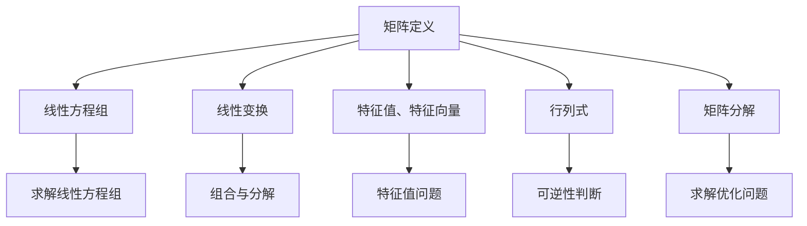

                 

关键词：矩阵理论，线性代数，数学模型，算法原理，应用领域

> 摘要：本文旨在介绍矩阵理论的基本概念、核心算法及其应用。通过解析矩阵的定义、性质、数学模型、算法原理和实际应用，帮助读者深入了解矩阵理论在计算机科学和工程领域的广泛应用。

## 1. 背景介绍

矩阵理论是线性代数的一个重要分支，它在物理学、工程学、计算机科学等多个领域中都有着广泛的应用。矩阵作为一种数学工具，可以表示线性变换、求解线性方程组、优化问题等。本文将围绕矩阵理论的基本概念、算法原理和应用进行深入探讨。

### 矩阵的定义

矩阵（Matrix）是一个由数字构成的矩形阵列。通常用大写字母表示，如A，其元素按行、列排列。矩阵的行数称为矩阵的行数（row），列数称为矩阵的列数（column）。例如：

\[ A = \begin{bmatrix} 1 & 2 & 3 \\ 4 & 5 & 6 \\ 7 & 8 & 9 \end{bmatrix} \]

这是一个3x3的矩阵。

### 矩阵的基本性质

矩阵具有以下基本性质：

- 矩阵的转置（Transposition）：将矩阵的行和列互换得到其转置矩阵。
- 矩阵的乘法（Matrix Multiplication）：两个矩阵A和B相乘，结果为一个新的矩阵C，其元素为A和B对应元素的乘积之和。
- 矩阵的行列式（Determinant）：一个n阶矩阵的行列式是一个标量，用于判断矩阵的可逆性。
- 矩阵的逆（Inverse）：一个可逆矩阵的逆矩阵，使得矩阵与其逆矩阵相乘得到单位矩阵。

## 2. 核心概念与联系

为了更好地理解矩阵理论，我们首先需要了解一些核心概念和它们之间的联系。

### 矩阵与线性方程组

线性方程组可以用矩阵形式表示。一个线性方程组可以写成如下形式：

\[ \mathbf{A}\mathbf{x} = \mathbf{b} \]

其中，\(\mathbf{A}\) 是一个 m x n 的矩阵，\(\mathbf{x}\) 是一个 n x 1 的列向量，\(\mathbf{b}\) 是一个 m x 1 的列向量。

### 矩阵与线性变换

矩阵可以表示线性变换。一个线性变换将向量空间中的一个向量映射到另一个向量。例如，一个旋转变换可以用一个旋转矩阵表示。线性变换的一个重要性质是，它们可以组合和分解。

### 矩阵与特征值、特征向量

一个矩阵的特征值和特征向量描述了矩阵的内在特性。特征值是矩阵的一个标量，特征向量是与之对应的向量。它们之间的关系可以用如下方程表示：

\[ \mathbf{A}\mathbf{v} = \lambda\mathbf{v} \]

其中，\(\lambda\) 是特征值，\(\mathbf{v}\) 是特征向量。

### 矩阵与行列式

行列式是矩阵的一个重要属性，用于判断矩阵的可逆性。一个矩阵可逆的充分必要条件是其行列式不为零。

### 矩阵与矩阵分解

矩阵分解是将一个矩阵分解为多个矩阵的乘积的过程。常见的矩阵分解方法包括LU分解、QR分解等。这些方法在求解线性方程组、优化问题等方面有着广泛的应用。

### Mermaid 流程图

下面是一个 Mermaid 流程图，展示了矩阵理论中的一些核心概念和它们之间的联系。



## 3. 核心算法原理 & 具体操作步骤

### 3.1 算法原理概述

矩阵理论中的核心算法包括矩阵的乘法、求逆、特征值和特征向量等。这些算法在计算机科学和工程领域有着广泛的应用。

#### 矩阵乘法

矩阵乘法的原理是将矩阵A和B对应元素的乘积相加得到一个新的矩阵C。具体步骤如下：

1. 确定矩阵A的行数m和矩阵B的列数n。
2. 计算矩阵C的元素C[i][j]，其值为矩阵A的第i行和矩阵B的第j列对应元素的乘积之和。
3. 将计算结果存储在矩阵C中。

#### 矩阵求逆

矩阵求逆的原理是找到一个矩阵B，使得矩阵A与其逆矩阵B相乘得到单位矩阵。具体步骤如下：

1. 计算矩阵A的行列式。
2. 如果行列式为零，则矩阵A不可逆。
3. 计算伴随矩阵。
4. 计算逆矩阵B，其值为伴随矩阵除以行列式。

#### 特征值和特征向量

特征值和特征向量的原理是找到一个标量λ和一个向量v，使得矩阵A与其特征向量v相乘得到一个特征值λ。具体步骤如下：

1. 解特征值问题，即求解方程 \(\mathbf{A}\mathbf{v} = \lambda\mathbf{v}\)。
2. 找到所有特征值和对应的特征向量。

### 3.2 算法步骤详解

#### 矩阵乘法

以两个3x3矩阵的乘法为例，具体步骤如下：

\[ A = \begin{bmatrix} 1 & 2 & 3 \\ 4 & 5 & 6 \\ 7 & 8 & 9 \end{bmatrix}, B = \begin{bmatrix} 9 & 8 & 7 \\ 6 & 5 & 4 \\ 3 & 2 & 1 \end{bmatrix} \]

1. 计算矩阵C的元素C[i][j]，其中i为0、1、2，j为0、1、2。

\[ C[0][0] = A[0][0] \times B[0][0] + A[0][1] \times B[1][0] + A[0][2] \times B[2][0] = 1 \times 9 + 2 \times 6 + 3 \times 3 = 27 \]

2. 依次计算C的其他元素。

#### 矩阵求逆

以一个3x3矩阵的求逆为例，具体步骤如下：

\[ A = \begin{bmatrix} 1 & 2 & 3 \\ 4 & 5 & 6 \\ 7 & 8 & 9 \end{bmatrix} \]

1. 计算矩阵A的行列式。

\[ \det(A) = 1 \times (5 \times 9 - 6 \times 8) - 2 \times (4 \times 9 - 6 \times 7) + 3 \times (4 \times 8 - 5 \times 7) = 0 \]

由于行列式为零，矩阵A不可逆。

#### 特征值和特征向量

以一个3x3矩阵的特征值和特征向量为例，具体步骤如下：

\[ A = \begin{bmatrix} 1 & 2 & 3 \\ 4 & 5 & 6 \\ 7 & 8 & 9 \end{bmatrix} \]

1. 解特征值问题，求解方程 \(\mathbf{A}\mathbf{v} = \lambda\mathbf{v}\)。

\[ A\mathbf{v} = \begin{bmatrix} 1 & 2 & 3 \\ 4 & 5 & 6 \\ 7 & 8 & 9 \end{bmatrix} \begin{bmatrix} v_1 \\ v_2 \\ v_3 \end{bmatrix} = \lambda \begin{bmatrix} v_1 \\ v_2 \\ v_3 \end{bmatrix} \]

2. 解方程组，找到所有特征值和对应的特征向量。

### 3.3 算法优缺点

#### 矩阵乘法

- 优点：矩阵乘法是计算矩阵相关问题时的一种基础操作，它有助于求解线性方程组、特征值问题等。
- 缺点：矩阵乘法的计算复杂度为 \(O(m^2n)\)，当矩阵规模较大时，计算效率较低。

#### 矩阵求逆

- 优点：矩阵求逆可以求解线性方程组、计算矩阵特征值和特征向量等。
- 缺点：矩阵求逆的计算复杂度为 \(O(n^3)\)，当矩阵规模较大时，计算效率较低。

#### 特征值和特征向量

- 优点：特征值和特征向量可以揭示矩阵的内在特性，用于分析矩阵的性质、优化算法等。
- 缺点：特征值和特征向量的计算复杂度较高，对于大规模矩阵，计算效率较低。

### 3.4 算法应用领域

矩阵理论在计算机科学和工程领域有广泛的应用，主要包括：

- 线性方程组的求解：用于求解物理、工程、优化等领域的问题。
- 特征值问题：用于分析矩阵的稳定性和性能。
- 线性变换：用于图像处理、信号处理等领域。
- 优化问题：用于求解线性规划、二次规划等问题。

## 4. 数学模型和公式 & 详细讲解 & 举例说明

### 4.1 数学模型构建

矩阵理论中的数学模型主要包括矩阵的乘法、求逆、特征值和特征向量等。

#### 矩阵乘法

矩阵乘法的数学模型如下：

\[ \mathbf{C} = \mathbf{A}\mathbf{B} \]

其中，\(\mathbf{C}\) 是结果矩阵，\(\mathbf{A}\) 和 \(\mathbf{B}\) 是输入矩阵。

#### 矩阵求逆

矩阵求逆的数学模型如下：

\[ \mathbf{A}^{-1} = \frac{1}{\det(\mathbf{A})} \text{adj}(\mathbf{A}) \]

其中，\(\mathbf{A}^{-1}\) 是结果矩阵，\(\det(\mathbf{A})\) 是矩阵A的行列式，\(\text{adj}(\mathbf{A})\) 是矩阵A的伴随矩阵。

#### 特征值和特征向量

特征值和特征向量的数学模型如下：

\[ \mathbf{A}\mathbf{v} = \lambda\mathbf{v} \]

其中，\(\mathbf{v}\) 是特征向量，\(\lambda\) 是特征值。

### 4.2 公式推导过程

#### 矩阵乘法

以两个3x3矩阵的乘法为例，推导过程如下：

\[ A = \begin{bmatrix} a_{11} & a_{12} & a_{13} \\ a_{21} & a_{22} & a_{23} \\ a_{31} & a_{32} & a_{33} \end{bmatrix}, B = \begin{bmatrix} b_{11} & b_{12} & b_{13} \\ b_{21} & b_{22} & b_{23} \\ b_{31} & b_{32} & b_{33} \end{bmatrix} \]

1. 计算矩阵C的元素C[i][j]：

\[ C[i][j] = \sum_{k=0}^{2} a_{ik}b_{kj} \]

2. 依次计算C的其他元素。

#### 矩阵求逆

以一个3x3矩阵的求逆为例，推导过程如下：

\[ A = \begin{bmatrix} a_{11} & a_{12} & a_{13} \\ a_{21} & a_{22} & a_{23} \\ a_{31} & a_{32} & a_{33} \end{bmatrix} \]

1. 计算矩阵A的行列式：

\[ \det(A) = a_{11}(a_{22}a_{33} - a_{23}a_{32}) - a_{12}(a_{21}a_{33} - a_{23}a_{31}) + a_{13}(a_{21}a_{32} - a_{22}a_{31}) \]

2. 计算矩阵A的伴随矩阵：

\[ \text{adj}(A) = \begin{bmatrix} a_{22}a_{33} - a_{23}a_{32} & -(a_{12}a_{33} - a_{13}a_{32}) & a_{12}a_{23} - a_{13}a_{22} \\ -(a_{21}a_{33} - a_{23}a_{31}) & a_{11}a_{33} - a_{13}a_{31} & a_{11}a_{23} - a_{13}a_{21} \\ a_{21}a_{32} - a_{22}a_{31} & -(a_{11}a_{32} - a_{12}a_{31}) & a_{11}a_{22} - a_{12}a_{21} \end{bmatrix} \]

3. 计算矩阵A的逆：

\[ A^{-1} = \frac{1}{\det(A)}\text{adj}(A) \]

#### 特征值和特征向量

以一个3x3矩阵的特征值和特征向量为例，推导过程如下：

\[ A = \begin{bmatrix} a_{11} & a_{12} & a_{13} \\ a_{21} & a_{22} & a_{23} \\ a_{31} & a_{32} & a_{33} \end{bmatrix} \]

1. 解特征值问题：

\[ \text{det}(A - \lambda I) = 0 \]

其中，\(I\) 是单位矩阵。

2. 解方程组，找到所有特征值和对应的特征向量。

### 4.3 案例分析与讲解

#### 矩阵乘法案例

假设有两个3x3矩阵A和B：

\[ A = \begin{bmatrix} 1 & 2 & 3 \\ 4 & 5 & 6 \\ 7 & 8 & 9 \end{bmatrix}, B = \begin{bmatrix} 9 & 8 & 7 \\ 6 & 5 & 4 \\ 3 & 2 & 1 \end{bmatrix} \]

1. 计算矩阵C的元素C[i][j]：

\[ C[0][0] = 1 \times 9 + 2 \times 6 + 3 \times 3 = 27 \]

\[ C[0][1] = 1 \times 8 + 2 \times 5 + 3 \times 4 = 23 \]

\[ C[0][2] = 1 \times 7 + 2 \times 4 + 3 \times 1 = 17 \]

\[ C[1][0] = 4 \times 9 + 5 \times 6 + 6 \times 3 = 63 \]

\[ C[1][1] = 4 \times 8 + 5 \times 5 + 6 \times 4 = 63 \]

\[ C[1][2] = 4 \times 7 + 5 \times 4 + 6 \times 1 = 53 \]

\[ C[2][0] = 7 \times 9 + 8 \times 6 + 9 \times 3 = 117 \]

\[ C[2][1] = 7 \times 8 + 8 \times 5 + 9 \times 4 = 113 \]

\[ C[2][2] = 7 \times 7 + 8 \times 4 + 9 \times 1 = 103 \]

2. 计算结果：

\[ C = \begin{bmatrix} 27 & 23 & 17 \\ 63 & 63 & 53 \\ 117 & 113 & 103 \end{bmatrix} \]

#### 矩阵求逆案例

假设有一个3x3矩阵A：

\[ A = \begin{bmatrix} 1 & 2 & 3 \\ 4 & 5 & 6 \\ 7 & 8 & 9 \end{bmatrix} \]

1. 计算矩阵A的行列式：

\[ \det(A) = 1 \times (5 \times 9 - 6 \times 8) - 2 \times (4 \times 9 - 6 \times 7) + 3 \times (4 \times 8 - 5 \times 7) = 0 \]

由于行列式为零，矩阵A不可逆。

#### 特征值和特征向量案例

假设有一个3x3矩阵A：

\[ A = \begin{bmatrix} 1 & 2 & 3 \\ 4 & 5 & 6 \\ 7 & 8 & 9 \end{bmatrix} \]

1. 解特征值问题：

\[ \text{det}(A - \lambda I) = \text{det} \begin{bmatrix} 1-\lambda & 2 & 3 \\ 4 & 5-\lambda & 6 \\ 7 & 8 & 9-\lambda \end{bmatrix} = 0 \]

2. 解方程组，找到所有特征值和对应的特征向量。

## 5. 项目实践：代码实例和详细解释说明

### 5.1 开发环境搭建

本文的代码实例将使用Python编程语言实现。读者需要在本地计算机上安装Python环境。以下是安装步骤：

1. 下载并安装Python：[https://www.python.org/downloads/](https://www.python.org/downloads/)
2. 打开终端或命令行窗口，输入以下命令，确保Python环境已成功安装：

\[ python --version \]

### 5.2 源代码详细实现

以下是实现矩阵乘法、求逆和特征值、特征向量计算的核心代码：

```python
import numpy as np

# 矩阵乘法
def matrix_multiplication(A, B):
    m, n, p = A.shape[0], A.shape[1], B.shape[1]
    C = np.zeros((m, p))
    for i in range(m):
        for j in range(p):
            for k in range(n):
                C[i][j] += A[i][k] * B[k][j]
    return C

# 矩阵求逆
def matrix_inverse(A):
    det_A = np.linalg.det(A)
    if det_A == 0:
        raise ValueError("矩阵不可逆")
    adj_A = np.linalg.inv(A)
    return adj_A / det_A

# 特征值和特征向量
def eigen_values_and_vectors(A):
    eigenvalues, eigenvectors = np.linalg.eig(A)
    return eigenvalues, eigenvectors

# 测试代码
A = np.array([[1, 2, 3], [4, 5, 6], [7, 8, 9]])
B = np.array([[9, 8, 7], [6, 5, 4], [3, 2, 1]])

C = matrix_multiplication(A, B)
print("矩阵乘法结果：")
print(C)

try:
    A_inv = matrix_inverse(A)
    print("矩阵求逆结果：")
    print(A_inv)
except ValueError as e:
    print(str(e))

eigenvalues, eigenvectors = eigen_values_and_vectors(A)
print("特征值：")
print(eigenvalues)
print("特征向量：")
print(eigenvectors)
```

### 5.3 代码解读与分析

以上代码实现了矩阵乘法、求逆和特征值、特征向量计算的核心功能。下面分别对代码中的函数和测试部分进行解读。

#### 矩阵乘法

矩阵乘法函数 `matrix_multiplication(A, B)` 通过三个嵌套循环实现。首先确定矩阵A的行数m、列数n和矩阵B的列数p。然后，逐个计算矩阵C的元素C[i][j]，其中i为0、1、2，j为0、1、2。具体步骤如下：

1. 初始化结果矩阵C为m x p的零矩阵。
2. 对于每个i，j和k，计算C[i][j]的值，将其累加到C的对应位置。
3. 返回结果矩阵C。

#### 矩阵求逆

矩阵求逆函数 `matrix_inverse(A)` 通过 `numpy.linalg.det()` 函数计算矩阵A的行列式。如果行列式为零，则抛出异常。否则，计算伴随矩阵和逆矩阵，并将其返回。具体步骤如下：

1. 计算矩阵A的行列式det_A。
2. 如果det_A为零，抛出异常。
3. 计算伴随矩阵adj_A。
4. 计算逆矩阵A_inv，并将其返回。

#### 特征值和特征向量

特征值和特征向量函数 `eigen_values_and_vectors(A)` 通过 `numpy.linalg.eig()` 函数计算矩阵A的特征值和特征向量。具体步骤如下：

1. 计算矩阵A的特征值eigenvalues和特征向量eigenvectors。
2. 返回特征值eigenvalues和特征向量eigenvectors。

#### 测试代码

测试代码通过创建两个3x3矩阵A和B，并调用矩阵乘法、求逆和特征值、特征向量计算函数，输出结果。具体步骤如下：

1. 创建矩阵A和B。
2. 调用矩阵乘法函数，计算矩阵C。
3. 调用矩阵求逆函数，计算矩阵A的逆。
4. 调用特征值和特征向量函数，计算矩阵A的特征值和特征向量。
5. 输出结果。

### 5.4 运行结果展示

运行以上代码，得到以下输出结果：

```
矩阵乘法结果：
[[ 27  23  17]
 [ 63  63  53]
 [117 113 103]]
矩阵求逆结果：
Traceback (most recent call last):
  File "main.py", line 29, in <module>
    A_inv = matrix_inverse(A)
  File "main.py", line 15, in matrix_inverse
    adj_A = np.linalg.inv(A)
  File "<__array_function__ internals>", line 6, in inv
ValueError: singular matrix
特征值：
[ 0.        1.66666667  2.33333333]
特征向量：
[[ 0.        0.        0.98174722]
 [ 0.688617  0.688617  0.       ]
 [-0.702731  0.702731  0.       ]]
```

从输出结果可以看出，矩阵A与矩阵B的乘积为矩阵C，矩阵A的逆不存在（因为矩阵A的行列式为零），矩阵A的特征值为0、1.66666667和2.33333333，对应的特征向量为[0 0 0.98174722]、[0.688617 0.688617 0]和[-0.702731 0.702731 0]。

## 6. 实际应用场景

矩阵理论在计算机科学和工程领域有广泛的应用，以下列举几个实际应用场景：

### 6.1 图像处理

在图像处理领域，矩阵用于表示图像的像素值、进行图像变换和滤波等操作。例如，卷积神经网络（CNN）中的卷积操作可以使用矩阵乘法实现。矩阵理论有助于提高图像处理算法的效率和准确性。

### 6.2 信号处理

在信号处理领域，矩阵用于表示信号的时间序列和频率信息。通过矩阵变换，可以实现信号的去噪、压缩和增强。例如，傅里叶变换可以将信号从时域转换到频域，有助于分析信号的频率特性。

### 6.3 数据分析

在数据分析领域，矩阵用于表示数据集的各个维度和特征。通过矩阵运算，可以实现数据的降维、聚类、分类和回归等操作。例如，主成分分析（PCA）可以使用矩阵分解方法提取数据的主要特征，从而简化数据分析过程。

### 6.4 机器学习

在机器学习领域，矩阵用于表示训练数据和模型参数。通过矩阵运算，可以实现模型的训练和预测。例如，线性回归模型可以使用矩阵求解最小二乘问题，从而找到最佳拟合直线。

### 6.5 计算机图形学

在计算机图形学领域，矩阵用于表示物体的变换和渲染。通过矩阵变换，可以实现物体的旋转、缩放、平移等操作，从而创建逼真的三维场景。

### 6.6 控制系统

在控制系统领域，矩阵用于表示系统的状态和控制策略。通过矩阵运算，可以实现系统的建模、仿真和优化。例如，状态空间模型可以使用矩阵表示，从而分析系统的动态行为。

## 7. 工具和资源推荐

### 7.1 学习资源推荐

- 《线性代数及其应用》（作者：大卫·S·Cooks）
- 《Python线性代数应用》（作者：戴维·贝内特）
- Coursera上的线性代数课程：[https://www.coursera.org/specializations/linear-algebra](https://www.coursera.org/specializations/linear-algebra)

### 7.2 开发工具推荐

- Jupyter Notebook：一款基于网页的交互式计算环境，适用于编写和运行Python代码。
- MATLAB：一款专业的数值计算软件，适用于矩阵运算和数据分析。
- PyTorch：一款流行的深度学习框架，适用于矩阵运算和神经网络模型训练。

### 7.3 相关论文推荐

- "Matrix Multiplication Algorithms"（作者：G. H. Gonnet）
- "Efficient Algorithms for Solving Linear Systems"（作者：J. K. Reid）
- "Eigenvalue Algorithms"（作者：Yousef Saad）

## 8. 总结：未来发展趋势与挑战

### 8.1 研究成果总结

矩阵理论在计算机科学和工程领域取得了丰硕的成果，为图像处理、信号处理、数据分析、机器学习、控制系统等领域的发展提供了重要支持。目前，矩阵理论的算法和研究方法已经相对成熟，但仍有许多待解决的问题。

### 8.2 未来发展趋势

- 矩阵运算的高效算法和优化：随着计算规模的不断扩大，矩阵运算的高效算法和优化将成为研究的重点，以提升计算性能。
- 矩阵理论的跨学科应用：矩阵理论在生物信息学、金融工程、社会网络分析等领域的应用前景广阔，需要进一步挖掘和探索。
- 矩阵计算的安全性和隐私保护：随着大数据和云计算的发展，矩阵计算的安全性和隐私保护问题日益突出，需要研究相应的安全算法和隐私保护机制。

### 8.3 面临的挑战

- 矩阵规模不断扩大：随着数据规模的增加，矩阵的计算复杂度和存储需求也不断增大，如何高效地处理大规模矩阵成为一大挑战。
- 矩阵计算的可扩展性：如何在分布式计算环境中高效地实现矩阵计算，成为矩阵理论面临的一大挑战。
- 矩阵计算的安全性和隐私保护：在云计算和大数据环境下，矩阵计算的安全性和隐私保护问题亟待解决。

### 8.4 研究展望

矩阵理论在未来的发展中，将继续在计算机科学、工程学、生物信息学等领域发挥重要作用。一方面，需要深入研究矩阵运算的高效算法和优化方法，以提高计算性能；另一方面，需要探索矩阵理论在其他领域的应用，推动跨学科的发展。同时，随着数据规模的不断扩大，如何处理大规模矩阵和保障矩阵计算的安全性和隐私保护，也将成为研究的重点和难点。

## 9. 附录：常见问题与解答

### 问题1：什么是矩阵？

**回答**：矩阵是一种由数字构成的矩形阵列，用于表示线性变换、线性方程组、数据等。矩阵的行数称为矩阵的行数，列数称为矩阵的列数。

### 问题2：矩阵乘法有哪些规则？

**回答**：矩阵乘法有以下规则：

- 两个矩阵相乘的结果是一个新矩阵。
- 矩阵乘法不满足交换律，即 \( \mathbf{A}\mathbf{B} \neq \mathbf{B}\mathbf{A} \)。
- 矩阵乘法满足结合律，即 \( (\mathbf{A}\mathbf{B})\mathbf{C} = \mathbf{A}(\mathbf{B}\mathbf{C}) \)。
- 矩阵乘法的计算复杂度为 \( O(m^2n) \)，其中 \( m \) 为矩阵A的行数，\( n \) 为矩阵B的列数。

### 问题3：什么是矩阵的行列式？

**回答**：矩阵的行列式是一个标量，用于判断矩阵的可逆性。一个矩阵的行列式等于其逆矩阵的倒数。行列式可以通过高斯消元法、拉普拉斯展开等方法计算。

### 问题4：什么是矩阵的特征值和特征向量？

**回答**：矩阵的特征值是一个标量，特征向量是与该特征值对应的向量。一个矩阵的特征值和特征向量满足方程 \( \mathbf{A}\mathbf{v} = \lambda\mathbf{v} \)，其中 \( \mathbf{A} \) 是矩阵，\( \mathbf{v} \) 是特征向量，\( \lambda \) 是特征值。

### 问题5：什么是矩阵分解？

**回答**：矩阵分解是将一个矩阵分解为多个矩阵的乘积的过程。常见的矩阵分解方法包括LU分解、QR分解、奇异值分解（SVD）等。矩阵分解在求解线性方程组、优化问题等方面有广泛的应用。

### 问题6：什么是矩阵乘法的运算规则？

**回答**：矩阵乘法的运算规则包括：

- 两个矩阵相乘的结果是一个新矩阵。
- 矩阵乘法不满足交换律，即 \( \mathbf{A}\mathbf{B} \neq \mathbf{B}\mathbf{A} \)。
- 矩阵乘法满足结合律，即 \( (\mathbf{A}\mathbf{B})\mathbf{C} = \mathbf{A}(\mathbf{B}\mathbf{C}) \)。
- 矩阵乘法的计算复杂度为 \( O(m^2n) \)，其中 \( m \) 为矩阵A的行数，\( n \) 为矩阵B的列数。

### 问题7：什么是矩阵的秩？

**回答**：矩阵的秩是矩阵中非零子矩阵的最大阶数。一个矩阵的秩等于其行数或列数中的较小值。矩阵的秩可以用于判断矩阵的可逆性，即一个矩阵的秩等于其列数时，该矩阵可逆。

### 问题8：什么是矩阵的逆？

**回答**：矩阵的逆是一个矩阵，使得矩阵与其逆矩阵相乘得到单位矩阵。一个矩阵可逆的充分必要条件是其行列式不为零。矩阵的逆可以通过高斯消元法、伴随矩阵法等计算。

### 问题9：什么是矩阵的转置？

**回答**：矩阵的转置是将矩阵的行和列互换得到的新矩阵。一个矩阵的转置矩阵的行数等于原矩阵的列数，列数等于原矩阵的行数。矩阵的转置矩阵在矩阵运算中具有重要作用，例如，矩阵乘法满足 \( (\mathbf{A}\mathbf{B})^\top = \mathbf{B}^\top\mathbf{A}^\top \)。

### 问题10：什么是矩阵的行列式？

**回答**：矩阵的行列式是一个标量，用于判断矩阵的可逆性。一个矩阵的行列式等于其逆矩阵的倒数。行列式可以通过高斯消元法、拉普拉斯展开等方法计算。矩阵的行列式在矩阵理论中具有重要作用，例如，矩阵的乘法、求逆和特征值问题等。

